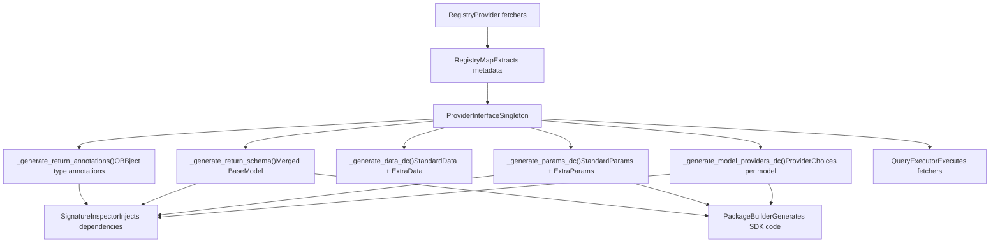
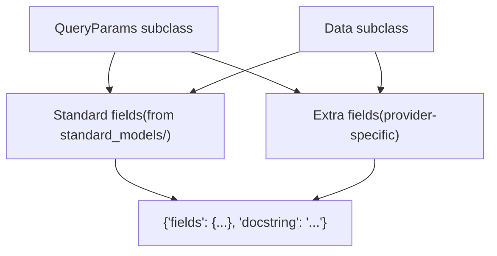
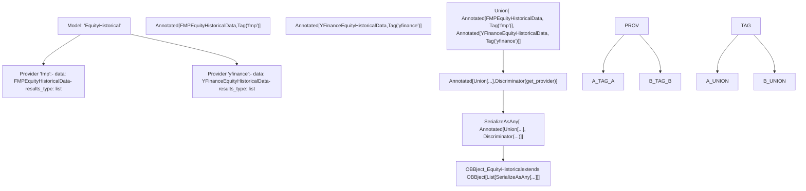

# Provider Interface and Integration

Relevant source files

-   [cli/tests/test\_argparse\_translator\_obbject\_registry.py](https://github.com/OpenBB-finance/OpenBB/blob/dddc3b32/cli/tests/test_argparse_translator_obbject_registry.py)
-   [openbb\_platform/core/openbb\_core/api/app\_loader.py](https://github.com/OpenBB-finance/OpenBB/blob/dddc3b32/openbb_platform/core/openbb_core/api/app_loader.py)
-   [openbb\_platform/core/openbb\_core/api/exception\_handlers.py](https://github.com/OpenBB-finance/OpenBB/blob/dddc3b32/openbb_platform/core/openbb_core/api/exception_handlers.py)
-   [openbb\_platform/core/openbb\_core/api/rest\_api.py](https://github.com/OpenBB-finance/OpenBB/blob/dddc3b32/openbb_platform/core/openbb_core/api/rest_api.py)
-   [openbb\_platform/core/openbb\_core/api/router/coverage.py](https://github.com/OpenBB-finance/OpenBB/blob/dddc3b32/openbb_platform/core/openbb_core/api/router/coverage.py)
-   [openbb\_platform/core/openbb\_core/app/provider\_interface.py](https://github.com/OpenBB-finance/OpenBB/blob/dddc3b32/openbb_platform/core/openbb_core/app/provider_interface.py)
-   [openbb\_platform/core/openbb\_core/app/router.py](https://github.com/OpenBB-finance/OpenBB/blob/dddc3b32/openbb_platform/core/openbb_core/app/router.py)
-   [openbb\_platform/core/openbb\_core/app/static/package\_builder.py](https://github.com/OpenBB-finance/OpenBB/blob/dddc3b32/openbb_platform/core/openbb_core/app/static/package_builder.py)
-   [openbb\_platform/core/openbb\_core/app/static/utils/filters.py](https://github.com/OpenBB-finance/OpenBB/blob/dddc3b32/openbb_platform/core/openbb_core/app/static/utils/filters.py)
-   [openbb\_platform/core/openbb\_core/app/utils.py](https://github.com/OpenBB-finance/OpenBB/blob/dddc3b32/openbb_platform/core/openbb_core/app/utils.py)
-   [openbb\_platform/core/openbb\_core/provider/registry\_map.py](https://github.com/OpenBB-finance/OpenBB/blob/dddc3b32/openbb_platform/core/openbb_core/provider/registry_map.py)
-   [openbb\_platform/core/openbb\_core/provider/standard\_models/fred\_release\_table.py](https://github.com/OpenBB-finance/OpenBB/blob/dddc3b32/openbb_platform/core/openbb_core/provider/standard_models/fred_release_table.py)
-   [openbb\_platform/core/openbb\_core/provider/standard\_models/futures\_curve.py](https://github.com/OpenBB-finance/OpenBB/blob/dddc3b32/openbb_platform/core/openbb_core/provider/standard_models/futures_curve.py)
-   [openbb\_platform/core/openbb\_core/provider/standard\_models/yield\_curve.py](https://github.com/OpenBB-finance/OpenBB/blob/dddc3b32/openbb_platform/core/openbb_core/provider/standard_models/yield_curve.py)
-   [openbb\_platform/core/tests/app/static/test\_filters.py](https://github.com/OpenBB-finance/OpenBB/blob/dddc3b32/openbb_platform/core/tests/app/static/test_filters.py)
-   [openbb\_platform/core/tests/app/static/test\_package\_builder.py](https://github.com/OpenBB-finance/OpenBB/blob/dddc3b32/openbb_platform/core/tests/app/static/test_package_builder.py)
-   [openbb\_platform/core/tests/app/test\_platform\_router.py](https://github.com/OpenBB-finance/OpenBB/blob/dddc3b32/openbb_platform/core/tests/app/test_platform_router.py)
-   [openbb\_platform/core/tests/app/test\_provider\_interface.py](https://github.com/OpenBB-finance/OpenBB/blob/dddc3b32/openbb_platform/core/tests/app/test_provider_interface.py)
-   [openbb\_platform/obbject\_extensions/charting/tests/test\_charting.py](https://github.com/OpenBB-finance/OpenBB/blob/dddc3b32/openbb_platform/obbject_extensions/charting/tests/test_charting.py)
-   [openbb\_platform/providers/bls/openbb\_bls/utils/helpers.py](https://github.com/OpenBB-finance/OpenBB/blob/dddc3b32/openbb_platform/providers/bls/openbb_bls/utils/helpers.py)
-   [openbb\_platform/providers/cboe/openbb\_cboe/models/futures\_curve.py](https://github.com/OpenBB-finance/OpenBB/blob/dddc3b32/openbb_platform/providers/cboe/openbb_cboe/models/futures_curve.py)
-   [openbb\_platform/providers/cboe/tests/test\_cboe\_fetchers.py](https://github.com/OpenBB-finance/OpenBB/blob/dddc3b32/openbb_platform/providers/cboe/tests/test_cboe_fetchers.py)
-   [openbb\_platform/providers/fred/openbb\_fred/models/release\_table.py](https://github.com/OpenBB-finance/OpenBB/blob/dddc3b32/openbb_platform/providers/fred/openbb_fred/models/release_table.py)

## Purpose and Scope

This document provides a detailed technical explanation of the `ProviderInterface` class and its role in the OpenBB Platform's provider system. The `ProviderInterface` is a singleton that transforms provider metadata from the registry into runtime-generated dataclasses and Pydantic models that power the Platform's dynamic type system.

For a higher-level overview of the provider architecture and the three-stage fetcher pattern, see [Provider Architecture](/OpenBB-finance/OpenBB/2.3-provider-architecture). For details on specific provider implementations, see [Economic Data Providers](/OpenBB-finance/OpenBB/4.2-economic-data-providers), [Financial Data Providers](/OpenBB-finance/OpenBB/4.3-financial-data-providers), and [Additional Providers](/OpenBB-finance/OpenBB/4.4-additional-providers).

**Sources:** [openbb\_platform/core/openbb\_core/app/provider\_interface.py1-742](https://github.com/OpenBB-finance/OpenBB/blob/dddc3b32/openbb_platform/core/openbb_core/app/provider_interface.py#L1-L742)

---

## Architecture Overview

The `ProviderInterface` sits at the intersection of the provider registry, the router system, and the package builder. It consumes metadata from `RegistryMap` and produces runtime types that are injected into command functions and used to generate the Python SDK.

### System Context Diagram


**Sources:** [openbb\_platform/core/openbb\_core/app/provider\_interface.py70-173](https://github.com/OpenBB-finance/OpenBB/blob/dddc3b32/openbb_platform/core/openbb_core/app/provider_interface.py#L70-L173) [openbb\_platform/core/openbb\_core/app/router.py227-296](https://github.com/OpenBB-finance/OpenBB/blob/dddc3b32/openbb_platform/core/openbb_core/app/router.py#L227-L296) [openbb\_platform/core/openbb\_core/app/static/package\_builder.py240-283](https://github.com/OpenBB-finance/OpenBB/blob/dddc3b32/openbb_platform/core/openbb_core/app/static/package_builder.py#L240-L283)

---

## Core Components

### ProviderInterface Class

The `ProviderInterface` is implemented as a singleton metaclass that maintains a single instance across the application lifecycle. It is initialized with a `RegistryMap` (which parses the provider registry) and a `QueryExecutor` class reference.

| Property | Type | Description |
| --- | --- | --- |
| `map` | `MapType` | Nested dict of provider metadata: `{model: {provider: {QueryParams: {...}, Data: {...}}}}` |
| `credentials` | `dict[str, list[str]]` | Map of provider names to required credential keys |
| `model_providers` | `dict[str, ProviderChoices]` | Dataclasses with `Literal` provider choices per model |
| `params` | `dict[str, dict[str, StandardParams | ExtraParams]]` | Standard and extra parameter dataclasses per model |
| `data` | `dict[str, dict[str, StandardData | ExtraData]]` | Standard and extra data models per model |
| `return_schema` | `dict[str, type[BaseModel]]` | Merged data schemas for FastAPI response models |
| `return_annotations` | `dict[str, type[OBBject]]` | OBBject type annotations with discriminated unions |
| `available_providers` | `list[str]` | List of all installed provider names (excludes "openbb") |
| `provider_choices` | `type` | Global dataclass with all provider names as `Literal` |
| `models` | `list[str]` | List of all available model names (e.g., "EquityHistorical") |

**Sources:** [openbb\_platform/core/openbb\_core/app/provider\_interface.py98-169](https://github.com/OpenBB-finance/OpenBB/blob/dddc3b32/openbb_platform/core/openbb_core/app/provider_interface.py#L98-L169)

### RegistryMap Input

The `RegistryMap` parses the provider registry to extract standard and extra fields from each provider's fetcher. It separates fields defined in standard models (in `openbb_core/provider/standard_models/`) from provider-specific fields.


**Sources:** [openbb\_platform/core/openbb\_core/provider/registry\_map.py71-106](https://github.com/OpenBB-finance/OpenBB/blob/dddc3b32/openbb_platform/core/openbb_core/provider/registry_map.py#L71-L106) [openbb\_platform/core/openbb\_core/provider/registry\_map.py142-181](https://github.com/OpenBB-finance/OpenBB/blob/dddc3b32/openbb_platform/core/openbb_core/provider/registry_map.py#L142-L181)

### Generated Runtime Types

The `ProviderInterface` generates five categories of runtime types:

1.  **ProviderChoices dataclasses**: Contain a single field `provider: Literal["provider_a", "provider_b", ...]` for each model
2.  **StandardParams dataclasses**: Contain fields defined in the standard model's `QueryParams` with merged descriptions
3.  **ExtraParams dataclasses**: Contain provider-specific query parameters marked as optional
4.  **StandardData/ExtraData Pydantic models**: Similar split for response data fields
5.  **OBBject type annotations**: Parameterized `OBBject[Union[...]]` types with discriminated unions

**Sources:** [openbb\_platform/core/openbb\_core/app/provider\_interface.py500-574](https://github.com/OpenBB-finance/OpenBB/blob/dddc3b32/openbb_platform/core/openbb_core/app/provider_interface.py#L500-L574)

---

## Parameter Merging Process

When multiple providers implement the same model, the `ProviderInterface` must merge their field definitions intelligently. This process handles both standard fields (redefined by providers with additional details) and extra fields (unique to specific providers).

### Field Merging Logic

```mermaid
flowchart TD
    START["For each provider's QueryParams"]
    IS_STANDARD["Field exists instandard model?"]
    STANDARD_FLOW["Standard field path"]
    CHECK_DESC["Description differsfrom standard?"]
    MERGE_STD["_merge_fields()Combine descriptions"]
    SKIP["Keep standard only"]
    EXTRA_FLOW["Extra field path"]
    FORCE_OPT["Create withforce_optional=True"]
    EXISTS["Field already inExtraParams?"]
    MERGE_EXTRA["_merge_fields()Combine from providers"]
    ADD["Add to ExtraParams"]

    START --> IS_STANDARD
    IS --> STANDARD_STANDARD_FLOW
    IS --> STANDARD_EXTRA_FLOW
    STANDARD --> FLOW_CHECK_DESC
    CHECK --> DESC_MERGE_STD
    CHECK --> DESC_SKIP
    EXTRA --> FLOW_FORCE_OPT
    FORCE --> OPT_EXISTS
    EXISTS --> MERGE_EXTRA
    EXISTS --> ADD
```


**Sources:** [openbb\_platform/core/openbb\_core/app/provider\_interface.py372-446](https://github.com/OpenBB-finance/OpenBB/blob/dddc3b32/openbb_platform/core/openbb_core/app/provider_interface.py#L372-L446)

### Merge Algorithm Details

The `_merge_fields()` method combines two `DataclassField` instances by:

1.  **Type merging**: If types differ, creates `Union[type1, type2]`
2.  **Description merging**:
    -   If descriptions are 80%+ similar (by `SequenceMatcher`), uses one with provider list: `"Description (provider: fmp,intrinio)"`
    -   Otherwise, concatenates: `"Desc1;\n Desc2"`
3.  **json\_schema\_extra merging**: Merges lists (like `choices`) and dicts (like `x-widget_config`) from both fields
4.  **Default handling**: Uses the first field's default value

**Sources:** [openbb\_platform/core/openbb\_core/app/provider\_interface.py175-242](https://github.com/OpenBB-finance/OpenBB/blob/dddc3b32/openbb_platform/core/openbb_core/app/provider_interface.py#L175-L242)

---

## Choices Validation and Auto-Derivation

A critical feature added in recent updates is the automatic derivation of parameter choices from `Literal` type annotations. This prevents silent data corruption when a user passes an invalid value that happens to match a merged default.

### Choices Auto-Derivation Flow

**Example from code:**

```
# In a provider's QueryParams class:class OECDBalanceOfPaymentsQueryParams(BalanceOfPaymentsQueryParams):    frequency: Literal["annual", "quarterly"] = Field(default="quarterly")
```
The `_create_field()` method detects this `Literal` annotation and automatically generates:

```
json_schema_extra = {    "oecd": {        "choices": ["annual", "quarterly"]    }}
```
This allows `filter_inputs()` to validate that the user's value is in the allowed set **before** the merged `ExtraParams` dataclass is instantiated, catching errors like passing `"monthly"` to a provider that only supports `"annual"` or `"quarterly"`.

**Sources:** [openbb\_platform/core/openbb\_core/app/provider\_interface.py289-308](https://github.com/OpenBB-finance/OpenBB/blob/dddc3b32/openbb_platform/core/openbb_core/app/provider_interface.py#L289-L308) [openbb\_platform/core/tests/app/static/test\_filters.py73-227](https://github.com/OpenBB-finance/OpenBB/blob/dddc3b32/openbb_platform/core/tests/app/static/test_filters.py#L73-L227)

---

## Data Schema Generation

Similar to parameter merging, the `ProviderInterface` generates data schemas by combining standard and extra data fields from all providers implementing a model.

### Data Schema Structure

| Component | Type | Purpose |
| --- | --- | --- |
| `StandardData` | Pydantic `BaseModel` | Fields defined in standard model's `Data` class |
| `ExtraData` | Pydantic `BaseModel` | Provider-specific data fields, all optional |
| `return_schema[model]` | Merged `BaseModel` | Combined schema for FastAPI response validation |

The merged return schema is created by:

1.  Copying all fields from `StandardData`
2.  Adding all fields from `ExtraData`
3.  Preserving field metadata (title, description, alias, json\_schema\_extra)
4.  Setting `model_config` with `extra="allow"` and `populate_by_name=True`

**Sources:** [openbb\_platform/core/openbb\_core/app/provider\_interface.py594-669](https://github.com/OpenBB-finance/OpenBB/blob/dddc3b32/openbb_platform/core/openbb_core/app/provider_interface.py#L594-L669)

---

## Return Type Annotations with Discriminated Unions

For commands that use provider models, the `ProviderInterface` generates parameterized `OBBject` types with discriminated unions. This enables FastAPI to serialize responses correctly based on which provider returned the data.

### Discriminated Union Construction


The discriminator function `get_provider(v)` extracts the `_provider` attribute that was set on each data model class during the annotation generation process.

**Sources:** [openbb\_platform/core/openbb\_core/app/provider\_interface.py678-741](https://github.com/OpenBB-finance/OpenBB/blob/dddc3b32/openbb_platform/core/openbb_core/app/provider_interface.py#L678-L741)

---

## Integration with SignatureInspector

The `SignatureInspector` class in the router system uses `ProviderInterface` to inject provider-specific dependencies into command functions at runtime.

### Injection Process

> **[Mermaid sequence]**
> *(图表结构无法解析)*

**Sources:** [openbb\_platform/core/openbb\_core/app/router.py230-296](https://github.com/OpenBB-finance/OpenBB/blob/dddc3b32/openbb_platform/core/openbb_core/app/router.py#L230-L296)

---

## Integration with PackageBuilder

The `PackageBuilder` uses `ProviderInterface` to generate method signatures in the Python SDK. It queries the interface to determine which parameters each command accepts and generates appropriate type hints.

### Code Generation Usage

When generating a command method, the `PackageBuilder`:

1.  **Retrieves parameter info**: Queries `provider_interface.params[model_name]` to get `StandardParams` and `ExtraParams`
2.  **Extracts field metadata**: Iterates over `__dataclass_fields__` to build method signature
3.  **Handles provider choices**: Adds `provider: Literal[...]` parameter from `model_providers[model_name]`
4.  **Generates docstrings**: Uses `return_schema[model_name]` to document return types
5.  **Builds filter info**: Extracts `json_schema_extra` with choices for runtime validation

Example of querying parameter metadata:

```
# In MethodDefinition.build_command_method()model_name = "EquityHistorical"pi = ProviderInterface() # Get standard parametersstandard_params = pi.params[model_name]["standard"]for field_name, field in standard_params.__dataclass_fields__.items():    # Generate method parameter: symbol: str, start_date: date, ...    pass # Get extra parameters  extra_params = pi.params[model_name]["extra"]for field_name, field in extra_params.__dataclass_fields__.items():    # Generate **kwargs parameters: adjusted: bool = None, ...    pass
```
**Sources:** [openbb\_platform/core/openbb\_core/app/static/package\_builder.py1000-1100](https://github.com/OpenBB-finance/OpenBB/blob/dddc3b32/openbb_platform/core/openbb_core/app/static/package_builder.py#L1000-L1100) [openbb\_platform/core/openbb\_core/app/static/package\_builder.py663-689](https://github.com/OpenBB-finance/OpenBB/blob/dddc3b32/openbb_platform/core/openbb_core/app/static/package_builder.py#L663-L689)

---

## Field Creation and Metadata Handling

The `_create_field()` static method is central to the parameter/data generation process. It transforms a Pydantic `FieldInfo` into a `DataclassField` tuple suitable for use with `dataclasses.make_dataclass()`.

### Field Creation Decision Tree

**Key behaviors:**

-   **Query parameters**: Wrapped in `Query(...)` for FastAPI to extract from URL query string
-   **Body parameters**: Wrapped in `Body(...)` for FastAPI to extract from request body (used for dicts and POST endpoints)
-   **Field parameters**: Wrapped in `Field(...)` for Pydantic model validation
-   **Multiple items**: Detection of `multiple_items_allowed` in `json_schema_extra` appends helper text to description
-   **Choices validation**: Auto-derived from `Literal` annotations and stored in `json_schema_extra`

**Sources:** [openbb\_platform/core/openbb\_core/app/provider\_interface.py244-370](https://github.com/OpenBB-finance/OpenBB/blob/dddc3b32/openbb_platform/core/openbb_core/app/provider_interface.py#L244-L370)

---

## Singleton Pattern and Lifecycle

The `ProviderInterface` uses `SingletonMeta` to ensure only one instance exists during the application lifecycle. This is critical because:

1.  **Performance**: Generating runtime dataclasses is expensive; doing it once reduces startup time
2.  **Consistency**: All parts of the system reference the same provider metadata
3.  **Memory efficiency**: Avoids duplicating large nested dictionaries

The singleton is initialized lazily on first access. The `RouterLoader.from_extensions()` method typically triggers the first instantiation when the FastAPI app starts.

**Sources:** [openbb\_platform/core/openbb\_core/app/provider\_interface.py70](https://github.com/OpenBB-finance/OpenBB/blob/dddc3b32/openbb_platform/core/openbb_core/app/provider_interface.py#L70-L70) [openbb\_platform/core/openbb\_core/app/model/abstract/singleton.py](https://github.com/OpenBB-finance/OpenBB/blob/dddc3b32/openbb_platform/core/openbb_core/app/model/abstract/singleton.py)

---

## Testing and Validation

The `ProviderInterface` includes comprehensive test coverage to ensure:

1.  **Field merging**: Descriptions and metadata combine correctly
2.  **Choices derivation**: `Literal` annotations produce `choices` in `json_schema_extra`
3.  **Optional wrapping**: `force_optional=True` correctly makes all extra params optional
4.  **Type unions**: Multiple provider types merge into discriminated unions

Example test structure:

| Test Case | Validates |
| --- | --- |
| `test_create_field_literal_annotation_produces_choices` | Auto-derivation of choices from `Literal` |
| `test_create_field_optional_literal_annotation_produces_choices` | Unwrapping `Optional[Literal[...]]` |
| `test_create_field_explicit_choices_not_overwritten` | Explicit choices take precedence |
| `test_filter_inputs_choices_invalid_value_raises` | Runtime validation catches invalid values |

**Sources:** [openbb\_platform/core/tests/app/test\_provider\_interface.py86-150](https://github.com/OpenBB-finance/OpenBB/blob/dddc3b32/openbb_platform/core/tests/app/test_provider_interface.py#L86-L150) [openbb\_platform/core/tests/app/static/test\_filters.py130-227](https://github.com/OpenBB-finance/OpenBB/blob/dddc3b32/openbb_platform/core/tests/app/static/test_filters.py#L130-L227)

---

## Summary of Key Classes and Methods

| Entity | Type | Responsibility |
| --- | --- | --- |
| `ProviderInterface` | Class (Singleton) | Orchestrates all provider metadata transformations |
| `RegistryMap` | Class | Parses provider registry to extract standard/extra fields |
| `_generate_model_providers_dc()` | Method | Creates `ProviderChoices` dataclasses per model |
| `_generate_params_dc()` | Method | Creates `StandardParams` and `ExtraParams` dataclasses per model |
| `_generate_data_dc()` | Method | Creates `StandardData` and `ExtraData` Pydantic models per model |
| `_generate_return_schema()` | Method | Merges data models into single BaseModel for FastAPI |
| `_generate_return_annotations()` | Method | Creates `OBBject[Union[...]]` with discriminated unions |
| `_extract_params()` | Method | Separates standard from extra parameters across providers |
| `_extract_data()` | Method | Separates standard from extra data fields across providers |
| `_merge_fields()` | Method | Combines two field definitions with intelligent merging |
| `_create_field()` | Method | Transforms Pydantic FieldInfo to DataclassField tuple |
| `get_provider()` | Function | Discriminator for polymorphic deserialization |

**Sources:** [openbb\_platform/core/openbb\_core/app/provider\_interface.py70-742](https://github.com/OpenBB-finance/OpenBB/blob/dddc3b32/openbb_platform/core/openbb_core/app/provider_interface.py#L70-L742)
