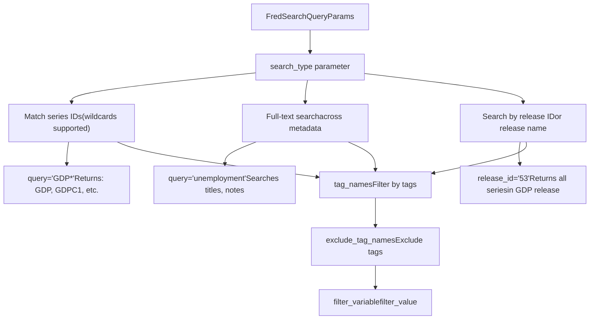
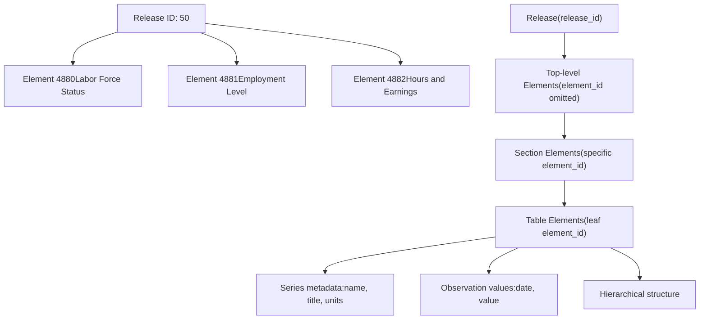
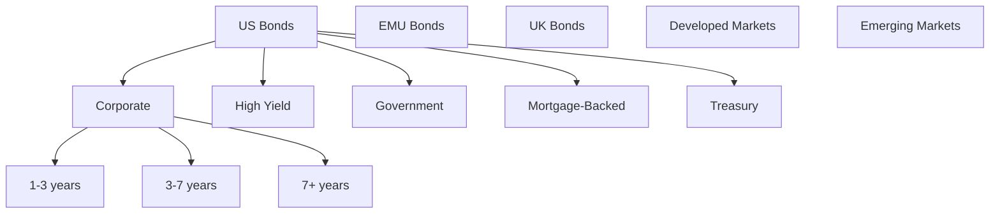
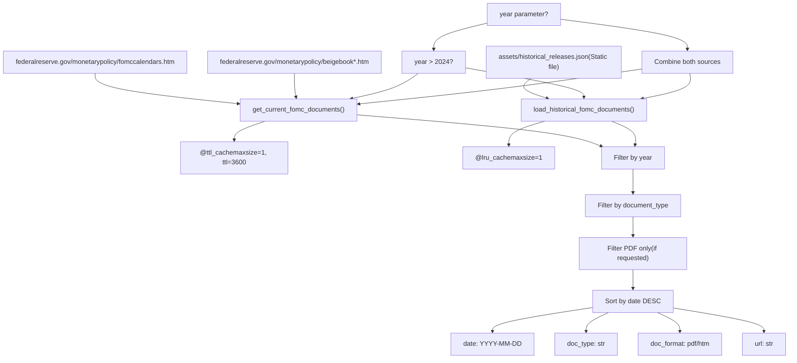
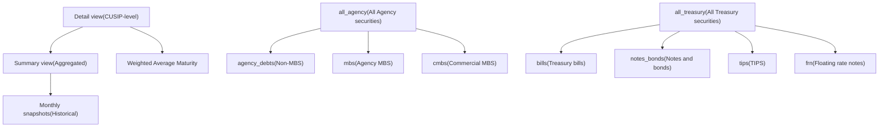

# Economic Data Providers

Relevant source files

-   [openbb\_platform/core/openbb\_core/app/model/charts/chart.py](https://github.com/OpenBB-finance/OpenBB/blob/dddc3b32/openbb_platform/core/openbb_core/app/model/charts/chart.py)
-   [openbb\_platform/core/openbb\_core/provider/standard\_models/primary\_dealer\_fails.py](https://github.com/OpenBB-finance/OpenBB/blob/dddc3b32/openbb_platform/core/openbb_core/provider/standard_models/primary_dealer_fails.py)
-   [openbb\_platform/core/tests/app/model/charts/test\_chart.py](https://github.com/OpenBB-finance/OpenBB/blob/dddc3b32/openbb_platform/core/tests/app/model/charts/test_chart.py)
-   [openbb\_platform/extensions/economy/integration/test\_economy\_api.py](https://github.com/OpenBB-finance/OpenBB/blob/dddc3b32/openbb_platform/extensions/economy/integration/test_economy_api.py)
-   [openbb\_platform/extensions/economy/integration/test\_economy\_python.py](https://github.com/OpenBB-finance/OpenBB/blob/dddc3b32/openbb_platform/extensions/economy/integration/test_economy_python.py)
-   [openbb\_platform/extensions/economy/openbb\_economy/economy\_router.py](https://github.com/OpenBB-finance/OpenBB/blob/dddc3b32/openbb_platform/extensions/economy/openbb_economy/economy_router.py)
-   [openbb\_platform/extensions/economy/openbb\_economy/survey/survey\_router.py](https://github.com/OpenBB-finance/OpenBB/blob/dddc3b32/openbb_platform/extensions/economy/openbb_economy/survey/survey_router.py)
-   [openbb\_platform/extensions/platform\_api/openbb\_platform\_api/assets/default\_apps.json](https://github.com/OpenBB-finance/OpenBB/blob/dddc3b32/openbb_platform/extensions/platform_api/openbb_platform_api/assets/default_apps.json)
-   [openbb\_platform/extensions/tests/test\_integration\_tests\_api.py](https://github.com/OpenBB-finance/OpenBB/blob/dddc3b32/openbb_platform/extensions/tests/test_integration_tests_api.py)
-   [openbb\_platform/extensions/tests/test\_integration\_tests\_python.py](https://github.com/OpenBB-finance/OpenBB/blob/dddc3b32/openbb_platform/extensions/tests/test_integration_tests_python.py)
-   [openbb\_platform/extensions/tests/utils/integration\_tests\_api\_generator.py](https://github.com/OpenBB-finance/OpenBB/blob/dddc3b32/openbb_platform/extensions/tests/utils/integration_tests_api_generator.py)
-   [openbb\_platform/extensions/tests/utils/integration\_tests\_testers.py](https://github.com/OpenBB-finance/OpenBB/blob/dddc3b32/openbb_platform/extensions/tests/utils/integration_tests_testers.py)
-   [openbb\_platform/providers/federal\_reserve/openbb\_federal\_reserve/\_\_init\_\_.py](https://github.com/OpenBB-finance/OpenBB/blob/dddc3b32/openbb_platform/providers/federal_reserve/openbb_federal_reserve/__init__.py)
-   [openbb\_platform/providers/federal\_reserve/openbb\_federal\_reserve/assets/historical\_releases.json](https://github.com/OpenBB-finance/OpenBB/blob/dddc3b32/openbb_platform/providers/federal_reserve/openbb_federal_reserve/assets/historical_releases.json)
-   [openbb\_platform/providers/federal\_reserve/openbb\_federal\_reserve/models/fomc\_documents.py](https://github.com/OpenBB-finance/OpenBB/blob/dddc3b32/openbb_platform/providers/federal_reserve/openbb_federal_reserve/models/fomc_documents.py)
-   [openbb\_platform/providers/federal\_reserve/openbb\_federal\_reserve/models/primary\_dealer\_fails.py](https://github.com/OpenBB-finance/OpenBB/blob/dddc3b32/openbb_platform/providers/federal_reserve/openbb_federal_reserve/models/primary_dealer_fails.py)
-   [openbb\_platform/providers/federal\_reserve/openbb\_federal\_reserve/models/primary\_dealer\_positioning.py](https://github.com/OpenBB-finance/OpenBB/blob/dddc3b32/openbb_platform/providers/federal_reserve/openbb_federal_reserve/models/primary_dealer_positioning.py)
-   [openbb\_platform/providers/federal\_reserve/openbb\_federal\_reserve/utils/fomc\_documents.py](https://github.com/OpenBB-finance/OpenBB/blob/dddc3b32/openbb_platform/providers/federal_reserve/openbb_federal_reserve/utils/fomc_documents.py)
-   [openbb\_platform/providers/federal\_reserve/openbb\_federal\_reserve/utils/primary\_dealer\_statistics.py](https://github.com/OpenBB-finance/OpenBB/blob/dddc3b32/openbb_platform/providers/federal_reserve/openbb_federal_reserve/utils/primary_dealer_statistics.py)
-   [openbb\_platform/providers/federal\_reserve/tests/record/http/test\_federal\_reserve\_fetchers/test\_federal\_reserve\_fomc\_documents\_fetcher\_urllib3\_v2.yaml](https://github.com/OpenBB-finance/OpenBB/blob/dddc3b32/openbb_platform/providers/federal_reserve/tests/record/http/test_federal_reserve_fetchers/test_federal_reserve_fomc_documents_fetcher_urllib3_v2.yaml)
-   [openbb\_platform/providers/federal\_reserve/tests/record/http/test\_federal\_reserve\_fetchers/test\_federal\_reserve\_primary\_dealer\_fails\_fetcher\_urllib3\_v2.yaml](https://github.com/OpenBB-finance/OpenBB/blob/dddc3b32/openbb_platform/providers/federal_reserve/tests/record/http/test_federal_reserve_fetchers/test_federal_reserve_primary_dealer_fails_fetcher_urllib3_v2.yaml)
-   [openbb\_platform/providers/federal\_reserve/tests/test\_federal\_reserve\_fetchers.py](https://github.com/OpenBB-finance/OpenBB/blob/dddc3b32/openbb_platform/providers/federal_reserve/tests/test_federal_reserve_fetchers.py)
-   [openbb\_platform/providers/fred/openbb\_fred/\_\_init\_\_.py](https://github.com/OpenBB-finance/OpenBB/blob/dddc3b32/openbb_platform/providers/fred/openbb_fred/__init__.py)
-   [openbb\_platform/providers/fred/openbb\_fred/models/manufacturing\_outlook\_ny.py](https://github.com/OpenBB-finance/OpenBB/blob/dddc3b32/openbb_platform/providers/fred/openbb_fred/models/manufacturing_outlook_ny.py)
-   [openbb\_platform/providers/fred/tests/record/http/test\_fred\_fetchers/test\_fred\_manufacturing\_outlook\_ny\_fetcher\_urllib3\_v2.yaml](https://github.com/OpenBB-finance/OpenBB/blob/dddc3b32/openbb_platform/providers/fred/tests/record/http/test_fred_fetchers/test_fred_manufacturing_outlook_ny_fetcher_urllib3_v2.yaml)
-   [openbb\_platform/providers/fred/tests/test\_fred\_fetchers.py](https://github.com/OpenBB-finance/OpenBB/blob/dddc3b32/openbb_platform/providers/fred/tests/test_fred_fetchers.py)

This document covers the FRED (Federal Reserve Economic Data) and Federal Reserve providers, which supply economic time series data, FOMC meeting documents, primary dealer statistics, and Federal Reserve balance sheet information to the OpenBB Platform.

For information about financial market data providers (FMP, Intrinio), see [4.2](/OpenBB-finance/OpenBB/4.2-economic-data-providers). For other economic data sources (BLS, OECD, EconDB, IMF), see [4.3](/OpenBB-finance/OpenBB/4.3-financial-data-providers).

---

## Overview

The OpenBB Platform integrates two specialized providers for accessing U.S. Federal Reserve and economic data:

-   **FRED Provider**: Provides access to 816,000+ economic time series from the Federal Reserve Bank of St. Louis, including GDP, CPI, unemployment, interest rates, and financial market indicators.
-   **Federal Reserve Provider**: Provides direct access to Federal Reserve Board data including FOMC documents, primary dealer statistics, central bank holdings, and Federal Reserve research datasets.

Both providers implement the standard fetcher pattern and register their data sources through the provider interface, making them accessible through the economy extension endpoints.

**Key Characteristics:**

| Provider | Source | Authentication | Fetchers | Data Types |
| --- | --- | --- | --- | --- |
| FRED | St. Louis Fed API | API Key | 40+ | Time series, search results, release tables |
| Federal Reserve | Federal Reserve Board | None | 13 | Documents, statistics, balance sheet data |

Sources: [openbb\_platform/providers/fred/openbb\_fred/\_\_init\_\_.py58-105](https://github.com/OpenBB-finance/OpenBB/blob/dddc3b32/openbb_platform/providers/fred/openbb_fred/__init__.py#L58-L105) [openbb\_platform/providers/federal\_reserve/openbb\_federal\_reserve/\_\_init\_\_.py40-60](https://github.com/OpenBB-finance/OpenBB/blob/dddc3b32/openbb_platform/providers/federal_reserve/openbb_federal_reserve/__init__.py#L40-L60)

---

## FRED Provider Architecture

### Provider Registration and Fetcher Dictionary

The FRED provider registers 40+ fetchers covering economic indicators, interest rates, surveys, and bond indices. The provider is defined in `fred_provider` and includes credentials configuration and fetcher mappings.

```mermaid
flowchart TD
    FREDProvider["fred_provider(Provider instance)"]
    Credentials["credentials=['api_key']"]
    FetcherDict["fetcher_dict(40+ fetchers)"]
    SeriesFetcher["FredSeriesFetcherSymbol: FredSeries"]
    SearchFetcher["FredSearchFetcherSymbol: FredSearch"]
    RegionalFetcher["FredRegionalDataFetcherSymbol: FredRegional"]
    ReleaseTableFetcher["FredReleaseTableFetcherSymbol: FredReleaseTable"]
    CPIFetcher["FREDConsumerPriceIndexFetcherSymbol: ConsumerPriceIndex"]
    BalancePaymentsFetcher["FredBalanceOfPaymentsFetcherSymbol: BalanceOfPayments"]
    RetailPricesFetcher["FredRetailPricesFetcherSymbol: RetailPrices"]
    SOFRFetcher["FREDSOFRFetcherSymbol: SOFR"]
    FFRFetcher["FredFederalFundsRateFetcherSymbol: FederalFundsRate"]
    SONIAFetcher["FREDSONIAFetcherSymbol: SONIA"]
    ESTRFetcher["FredEuroShortTermRateFetcherSymbol: EuroShortTermRate"]
    UofMFetcher["FredUofMichiganFetcherSymbol: UniversityOfMichigan"]
    SLOOSFetcher["FredSeniorLoanOfficerSurveyFetcherSymbol: SeniorLoanOfficerSurvey"]
    ManufacturingTXFetcher["FredManufacturingOutlookTexasFetcherSymbol: ManufacturingOutlookTexas"]
    ManufacturingNYFetcher["FredManufacturingOutlookNYFetcherSymbol: ManufacturingOutlookNY"]
    NonFarmFetcher["FredNonFarmPayrollsFetcherSymbol: NonFarmPayrolls"]
    BondIndicesFetcher["FredBondIndicesFetcherSymbol: BondIndices"]
    YieldCurveFetcher["FREDYieldCurveFetcherSymbol: YieldCurve"]
    TIPSFetcher["FredTipsYieldsFetcherSymbol: TipsYields"]

    FREDProvider --> Credentials
    FREDProvider --> FetcherDict
    FetcherDict --> SeriesFetcher
    FetcherDict --> SearchFetcher
    FetcherDict --> RegionalFetcher
    FetcherDict --> ReleaseTableFetcher
    FetcherDict --> CPIFetcher
    FetcherDict --> BalancePaymentsFetcher
    FetcherDict --> RetailPricesFetcher
    FetcherDict --> SOFRFetcher
    FetcherDict --> FFRFetcher
    FetcherDict --> SONIAFetcher
    FetcherDict --> ESTRFetcher
    FetcherDict --> UofMFetcher
    FetcherDict --> SLOOSFetcher
    FetcherDict --> ManufacturingTXFetcher
    FetcherDict --> ManufacturingNYFetcher
    FetcherDict --> NonFarmFetcher
    FetcherDict --> BondIndicesFetcher
    FetcherDict --> YieldCurveFetcher
    FetcherDict --> TIPSFetcher
```


**Fetcher Symbol Mapping**: The `fetcher_dict` maps standard model names (e.g., `"FredSeries"`, `"ConsumerPriceIndex"`) to their respective fetcher classes. This enables the provider interface to resolve queries like `obb.economy.fred_series(symbol="FEDFUNDS", provider="fred")`.

Sources: [openbb\_platform/providers/fred/openbb\_fred/\_\_init\_\_.py58-105](https://github.com/OpenBB-finance/OpenBB/blob/dddc3b32/openbb_platform/providers/fred/openbb_fred/__init__.py#L58-L105)

---

### FRED Series Fetching Pattern

#### Query Flow for Time Series Data

The `FredSeriesFetcher` retrieves time series observations for one or more FRED series IDs. This is the most commonly used fetcher for accessing economic data.

> **[Mermaid sequence]**
> *(图表结构无法解析)*

**Key Parameters:**

-   `symbol`: Comma-separated FRED series IDs (e.g., `"FEDFUNDS,GDP,UNRATE"`)
-   `start_date` / `end_date`: Date range for observations
-   `frequency`: Data aggregation frequency (`d`, `w`, `m`, `q`, `a`)
-   `aggregation_method`: How to aggregate (`avg`, `sum`, `eop`)
-   `transform`: Data transformation (`chg`, `pc1`, `pch`, `log`)

**Transform Options:**

-   `chg`: Change (period-to-period difference)
-   `pc1`: Percent change from a year ago
-   `pch`: Percent change from previous period
-   `log`: Natural log transformation

Sources: [openbb\_platform/extensions/economy/openbb\_economy/economy\_router.py151-173](https://github.com/OpenBB-finance/OpenBB/blob/dddc3b32/openbb_platform/extensions/economy/openbb_economy/economy_router.py#L151-L173) [openbb\_platform/providers/fred/tests/test\_fred\_fetchers.py291-298](https://github.com/OpenBB-finance/OpenBB/blob/dddc3b32/openbb_platform/providers/fred/tests/test_fred_fetchers.py#L291-L298)

---

### FRED Search Functionality

#### Search Types and Query Patterns

The `FredSearchFetcher` supports three distinct search types for discovering FRED series:


**Search Parameters:**

| Parameter | Description | Example |
| --- | --- | --- |
| `query` | Search term or series ID pattern | `"GDP*"`, `"unemployment"` |
| `search_type` | Type of search to perform | `"series_id"`, `"full_text"`, `"release"` |
| `tag_names` | Filter by tags (comma-separated) | `"gdp,quarterly"` |
| `exclude_tag_names` | Exclude tags | `"discontinued"` |
| `filter_variable` | Variable to filter on | `"frequency"`, `"seasonal_adjustment"` |
| `filter_value` | Value for filter variable | `"Monthly"`, `"Seasonally Adjusted"` |
| `series_id` | Specific series ID (for full\_text search) | `"NYICLAIMS"` |
| `release_id` | Release ID number | `"53"` (GDP) |

**Example Usage:**

```
# Search for GDP-related seriesresult = obb.economy.fred_search(    query="GDP*",    search_type="series_id",    tag_names="quarterly,usa",    limit=50,    provider="fred") # Full-text search with series ID contextresult = obb.economy.fred_search(    search_type="full_text",    series_id="NYICLAIMS",    provider="fred") # Search all series in a releaseresult = obb.economy.fred_search(    search_type="release",    release_id="50",  # Employment Situation    provider="fred")
```
Sources: [openbb\_platform/extensions/economy/openbb\_economy/economy\_router.py136-149](https://github.com/OpenBB-finance/OpenBB/blob/dddc3b32/openbb_platform/extensions/economy/openbb_economy/economy_router.py#L136-L149) [openbb\_platform/extensions/economy/integration/test\_economy\_python.py274-338](https://github.com/OpenBB-finance/OpenBB/blob/dddc3b32/openbb_platform/extensions/economy/integration/test_economy_python.py#L274-L338)

---

### FRED Regional Data

The `FredRegionalDataFetcher` accesses the GeoFRED API for state and regional economic data. Regional data can be retrieved either as metadata (when no date range is specified) or as time series (with date range).

**Regional Data Parameters:**

| Parameter | Type | Description |
| --- | --- | --- |
| `symbol` | str | Series group ID or individual series ID |
| `is_series_group` | bool | Whether symbol is a series group |
| `start_date` | date | Start of time series (enables time series mode) |
| `region_type` | str | `"state"`, `"msa"`, `"county"`, etc. |
| `frequency` | str | `"a"`, `"q"`, `"m"`, `"w"`, `"d"` |
| `units` | str | Units of measurement |
| `season` | str | `"sa"` (seasonally adjusted) or `"nsa"` |

**Example - Retrieve Unemployment by State:**

```
# Get metadata for state unemployment seriesresult = obb.economy.fred_regional(    symbol="NYICLAIMS",    is_series_group=False,    provider="fred") # Get time series for state unemploymentresult = obb.economy.fred_regional(    symbol="156241",    is_series_group=True,    start_date="2020-01-01",    end_date="2023-12-31",    frequency="m",    region_type="state",    season="nsa",    provider="fred")
```
Sources: [openbb\_platform/extensions/economy/openbb\_economy/economy\_router.py273-301](https://github.com/OpenBB-finance/OpenBB/blob/dddc3b32/openbb_platform/extensions/economy/openbb_economy/economy_router.py#L273-L301) [openbb\_platform/extensions/economy/integration/test\_economy\_python.py459-504](https://github.com/OpenBB-finance/OpenBB/blob/dddc3b32/openbb_platform/extensions/economy/integration/test_economy_python.py#L459-L504)

---

### FRED Release Tables

The `FredReleaseTableFetcher` retrieves structured data from FRED economic releases. Release tables provide hierarchical economic data organized by release ID and element ID.


**Usage Pattern:**

```
# Get top-level elementsresult = obb.economy.fred_release_table(    release_id="50",    provider="fred") # Drill down to specific sectionresult = obb.economy.fred_release_table(    release_id="50",    element_id="4880",    provider="fred") # Get data from a specific tableresult = obb.economy.fred_release_table(    release_id="50",    element_id="4881",    provider="fred")
```
Sources: [openbb\_platform/extensions/economy/openbb\_economy/economy\_router.py175-199](https://github.com/OpenBB-finance/OpenBB/blob/dddc3b32/openbb_platform/extensions/economy/openbb_economy/economy_router.py#L175-L199) [openbb\_platform/extensions/economy/integration/test\_economy\_python.py954-983](https://github.com/OpenBB-finance/OpenBB/blob/dddc3b32/openbb_platform/extensions/economy/integration/test_economy_python.py#L954-L983)

---

### Survey Data Fetchers

FRED provides several specialized fetchers for economic surveys:

#### University of Michigan Consumer Sentiment

```
result = obb.economy.survey.university_of_michigan(    start_date="2020-01-01",    frequency="m",    transform="pc1",    provider="fred")
```
#### Senior Loan Officer Opinion Survey (SLOOS)

```
result = obb.economy.survey.sloos(    category="auto",    start_date="2022-01-01",    provider="fred")
```
#### Manufacturing Outlook Surveys

The FRED provider includes two regional manufacturing surveys with detailed topic-based data mapping:

**Empire State Manufacturing Survey (New York):**

```
result = obb.economy.survey.manufacturing_outlook_ny(    topic="new_orders,hours_worked",    start_date="2020-01-01",    seasonally_adjusted=True,    transform="pc1",    provider="fred")
```
**Texas Manufacturing Outlook Survey:**

```
result = obb.economy.survey.manufacturing_outlook_texas(    topic="business_outlook,production",    start_date="2020-01-01",    transform="chg",    provider="fred")
```
**Manufacturing Survey Topics:**

Both surveys support multiple topics, each mapped to specific FRED series IDs:

| Topic Category | Examples | Series Count |
| --- | --- | --- |
| Business Outlook | Current, Future (6-month) | 8 series |
| New Orders | Current, Future | 8 series |
| Production | Current, Future | 8 series |
| Hours Worked | Current, Future | 8 series |
| Employment | Current, Future | 8 series |
| Prices | Paid, Received | 8 series |
| Inventories | Current | 4 series |

Each topic includes both seasonally adjusted and non-seasonally adjusted variants, with four data points:

-   Diffusion index
-   Percent reporting increase
-   Percent reporting decrease
-   Percent reporting no change

Sources: [openbb\_platform/providers/fred/openbb\_fred/models/manufacturing\_outlook\_ny.py17-288](https://github.com/OpenBB-finance/OpenBB/blob/dddc3b32/openbb_platform/providers/fred/openbb_fred/models/manufacturing_outlook_ny.py#L17-L288) [openbb\_platform/extensions/economy/openbb\_economy/survey/survey\_router.py113-177](https://github.com/OpenBB-finance/OpenBB/blob/dddc3b32/openbb_platform/extensions/economy/openbb_economy/survey/survey_router.py#L113-L177)

---

### Consumer Price Index (CPI) Data Mapping

The FRED CPI fetcher implements complex country-to-series mapping for international CPI data. Each country has multiple associated FRED series IDs for different CPI variants.

**CPI Mapping Structure:**

| Country | Transform | Frequency | Harmonized | Series ID |
| --- | --- | --- | --- | --- |
| United States | YoY | Monthly | No | `CPIAUCSL` (All Items) |
| United States | YoY | Monthly | No | `CPILFESL` (Less Food & Energy) |
| Euro Area | YoY | Monthly | Yes | `CP0000EZ19M086NEST` |
| Japan | YoY | Monthly | No | `JPNCPIALLMINMEI` |
| United Kingdom | YoY | Monthly | No | `GBRCPIALLMINMEI` |

**Harmonized vs. Non-Harmonized:**

-   **Harmonized**: Uses HICP (Harmonized Index of Consumer Prices) for EU countries, enabling cross-country comparisons
-   **Non-Harmonized**: Uses national CPI definitions

**Transform Options:**

-   `yoy`: Year-over-year percent change
-   `period`: Period-to-period percent change

Sources: [openbb\_platform/providers/fred/tests/test\_fred\_fetchers.py78-84](https://github.com/OpenBB-finance/OpenBB/blob/dddc3b32/openbb_platform/providers/fred/tests/test_fred_fetchers.py#L78-L84) [openbb\_platform/extensions/economy/integration/test\_economy\_python.py62-112](https://github.com/OpenBB-finance/OpenBB/blob/dddc3b32/openbb_platform/extensions/economy/integration/test_economy_python.py#L62-L112)

---

### Bond Indices

The `FredBondIndicesFetcher` provides access to ICE BofA bond indices tracked by FRED, organized by geographic category and index type.

**Bond Index Categories:**


**Usage Example:**

```
result = obb.fixedincome.bond_indices(    category="us",    index="corporate",    start_date="2020-01-01",    provider="fred")
```
Sources: [openbb\_platform/providers/fred/tests/test\_fred\_fetchers.py353-365](https://github.com/OpenBB-finance/OpenBB/blob/dddc3b32/openbb_platform/providers/fred/tests/test_fred_fetchers.py#L353-L365)

---

### Retail Prices

The `FredRetailPricesFetcher` provides Consumer Price Index data for specific retail items and regions, useful for tracking inflation at the product level.

**Supported Items:**

-   `eggs`, `milk`, `bread`, `rice`
-   `meats` (beef, pork, chicken)
-   `fruits`, `vegetables`
-   `gasoline`, `electricity`, `natural_gas`
-   `apparel`, `transportation`

**Regions:**

-   `all_city` (U.S. City Average)
-   `northeast`, `midwest`, `south`, `west`
-   Specific metro areas

**Example - Track Egg Prices:**

```
result = obb.economy.retail_prices(    item="eggs",    region="northeast",    start_date="2020-01-01",    transform="pc1",  # Year-over-year percent change    provider="fred")
```
Sources: [openbb\_platform/extensions/economy/openbb\_economy/economy\_router.py518-547](https://github.com/OpenBB-finance/OpenBB/blob/dddc3b32/openbb_platform/extensions/economy/openbb_economy/economy_router.py#L518-L547) [openbb\_platform/providers/fred/tests/test\_fred\_fetchers.py343-350](https://github.com/OpenBB-finance/OpenBB/blob/dddc3b32/openbb_platform/providers/fred/tests/test_fred_fetchers.py#L343-L350)

---

## Federal Reserve Provider

The Federal Reserve provider accesses data directly from the Federal Reserve Board's public datasets, including FOMC documents, primary dealer statistics, balance sheet holdings, and research publications.

### Provider Registration

```mermaid
flowchart TD
    FedProvider["federal_reserve_provider(Provider instance)"]
    NoAuth["credentials=None(No authentication required)"]
    FedFetcherDict["fetcher_dict(13 fetchers)"]
    FOMCDocs["FederalReserveFomcDocumentsFetcherSymbol: FomcDocuments"]
    InflationExp["FederalReserveInflationExpectationsFetcherSymbol: InflationExpectations"]
    TFP["FederalReserveTfpFetcherSymbol: TotalFactorProductivity"]
    PDPositioning["FederalReservePrimaryDealerPositioningFetcherSymbol: PrimaryDealerPositioning"]
    PDFails["FederalReservePrimaryDealerFailsFetcherSymbol: PrimaryDealerFails"]
    Holdings["FederalReserveCentralBankHoldingsFetcherSymbol: CentralBankHoldings"]
    MoneyMeasures["FederalReserveMoneyMeasuresFetcherSymbol: MoneyMeasures"]
    FFR["FederalReserveFederalFundsRateFetcherSymbol: FederalFundsRate"]
    SOFR["FederalReserveSOFRFetcherSymbol: SOFR"]
    OBFR["FederalReserveOvernightBankFundingRateFetcherSymbol: OvernightBankFundingRate"]
    YieldCurve["FederalReserveYieldCurveFetcherSymbol: YieldCurve"]
    Svensson["FederalReserveSvenssonFetcherSymbol: SvenssonYieldCurve"]
    TreasuryRates["FederalReserveTreasuryRatesFetcherSymbol: TreasuryRates"]

    FedProvider --> NoAuth
    FedProvider --> FedFetcherDict
    FedFetcherDict --> FOMCDocs
    FedFetcherDict --> InflationExp
    FedFetcherDict --> TFP
    FedFetcherDict --> PDPositioning
    FedFetcherDict --> PDFails
    FedFetcherDict --> Holdings
    FedFetcherDict --> MoneyMeasures
    FedFetcherDict --> FFR
    FedFetcherDict --> SOFR
    FedFetcherDict --> OBFR
    FedFetcherDict --> YieldCurve
    FedFetcherDict --> Svensson
    FedFetcherDict --> TreasuryRates
```


**Key Distinction**: The Federal Reserve provider requires no API key authentication, as it accesses publicly available Federal Reserve Board data.

Sources: [openbb\_platform/providers/federal\_reserve/openbb\_federal\_reserve/\_\_init\_\_.py40-60](https://github.com/OpenBB-finance/OpenBB/blob/dddc3b32/openbb_platform/providers/federal_reserve/openbb_federal_reserve/__init__.py#L40-L60)

---

### FOMC Documents System

#### Document Types and Historical Data

The FOMC documents fetcher provides access to Federal Open Market Committee materials dating back to 1959. The system combines current documents (scraped from federalreserve.gov) with a static historical archive.

**FOMC Document Type Definitions:**

```
FomcDocumentType = Literal[    "all",    "monetary_policy",      # Policy implementation notes    "minutes",              # Meeting minutes    "projections",          # Economic projections (SEP)    "materials",            # Meeting materials    "press_release",        # Policy announcements    "press_conference",     # Chair press conference transcripts    "agenda",               # Meeting agendas    "transcript",           # Full meeting transcripts (5-year lag)    "speaker_key",          # Speaker identification    "beige_book",           # Regional economic reports    "teal_book",            # Staff economic forecasts    "green_book",           # Staff economic analysis    "blue_book",            # Monetary policy options    "red_book",             # Foreign economic analysis]
```
Sources: [openbb\_platform/providers/federal\_reserve/openbb\_federal\_reserve/utils/fomc\_documents.py8-24](https://github.com/OpenBB-finance/OpenBB/blob/dddc3b32/openbb_platform/providers/federal_reserve/openbb_federal_reserve/utils/fomc_documents.py#L8-L24)

#### Document Fetching Architecture


**get\_current\_fomc\_documents() Function:**

-   Scrapes live HTML from federalreserve.gov
-   Uses BeautifulSoup to parse document links
-   Extracts date from filename using regex
-   Infers document type from URL pattern
-   Results cached for 1 hour (TTL cache)

**load\_historical\_fomc\_documents() Function:**

-   Loads static JSON file with 1959-2024 documents
-   File size: ~1.3MB with 9000+ document records
-   Uses LRU cache for efficient repeated access

Sources: [openbb\_platform/providers/federal\_reserve/openbb\_federal\_reserve/utils/fomc\_documents.py27-250](https://github.com/OpenBB-finance/OpenBB/blob/dddc3b32/openbb_platform/providers/federal_reserve/openbb_federal_reserve/utils/fomc_documents.py#L27-L250) [openbb\_platform/providers/federal\_reserve/openbb\_federal\_reserve/models/fomc\_documents.py1-173](https://github.com/OpenBB-finance/OpenBB/blob/dddc3b32/openbb_platform/providers/federal_reserve/openbb_federal_reserve/models/fomc_documents.py#L1-L173)

#### FOMC Documents Usage

```
# Get all documentsresult = obb.economy.fomc_documents(    provider="federal_reserve") # Filter by yearresult = obb.economy.fomc_documents(    year=2022,    provider="federal_reserve") # Filter by year and document typeresult = obb.economy.fomc_documents(    year=2022,    document_type="minutes",    provider="federal_reserve") # Get beige books onlyresult = obb.economy.fomc_documents(    document_type="beige_book",    provider="federal_reserve")
```
**Widget Integration:**

The FOMC documents model includes OpenBB Workspace widget configuration for a multi-file PDF viewer:

```
"x-widget_config": {    "$.type": "multi_file_viewer",    "$.name": "FOMC PDF Document Viewer",    "$.description": "Current and historical FOMC PDF materials.",    "$.endpoint": f"{api_prefix}/federal_reserve/fomc_documents_download",    # File selector endpoint configuration}
```
Sources: [openbb\_platform/providers/federal\_reserve/openbb\_federal\_reserve/models/fomc\_documents.py86-118](https://github.com/OpenBB-finance/OpenBB/blob/dddc3b32/openbb_platform/providers/federal_reserve/openbb_federal_reserve/models/fomc_documents.py#L86-L118) [openbb\_platform/extensions/economy/integration/test\_economy\_python.py1112-1132](https://github.com/OpenBB-finance/OpenBB/blob/dddc3b32/openbb_platform/extensions/economy/integration/test_economy_python.py#L1112-L1132)

---

### Primary Dealer Statistics

The Federal Reserve Bank of New York publishes weekly statistics on primary dealer positions and fails. The Federal Reserve provider implements complex series ID mappings for these datasets.

#### Primary Dealer Positioning

Primary dealer positioning data shows the net positions (long minus short) held by primary dealers across various asset classes.

**Position Categories and Series Mapping:**

The `POSITION_GROUPS_TO_SERIES` dictionary maps high-level categories to lists of FRED series IDs:

```
POSITION_GROUPS_TO_SERIES = {    "treasuries": [        "PDPOSGS-B",           # Bills        "PDPOSGSC-L2",         # Coupons ≤2Y        "PDPOSGSC-G2L3",       # Coupons 2-3Y        "PDPOSGSC-G3L6",       # Coupons 3-6Y        # ... more maturity buckets    ],    "bills": ["PDPOSGS-B"],    "coupons": ["PDPOSGSC-L2", "PDPOSGSC-G2L3", ...],    "notes": [...],    "tips": ["PDPOSTIPS-L2", "PDPOSTIPS-G2", ...],    "mbs": ["PDPOSMBSFGS-TBA", "PDPOSMBSFGS-OR", ...],    "cmbs": ["PDPOSMBSFGS-C", "PDPOSMBSNA-O"],    "municipal": ["PDPOSSMGO-L13", "PDPOSSMGO-G13", ...],    "corporate": ["PDPOSCSBND-L13", "PDPOSCSBND-G13", ...],    "commercial_paper": ["PDPOSCSCP"],    "corporate_ig": [...],    # Investment grade    "corporate_junk": [...],  # High yield    "abs": [...],             # Asset-backed securities}
```
**Series Title Mapping:**

The `POSITION_SERIES_TO_TITLE` dictionary maps series IDs to human-readable descriptions:

```
POSITION_SERIES_TO_TITLE = {    "PDPOSGS-B": "BILLS (EX. TIPS): DEALER POSITION - LONG. - BILLS (EX. TIPS): DEALER POSITION - SHORT",    "PDPOSGSC-L2": "TREASURIES (EX. TIPS) COUPONS DUE IN LESS THAN OR EQUAL TO 2 YEARS: DEALER POSITION - NET",    # ... ~70 more mappings}
```
**Data Flow:**

> **[Mermaid sequence]**
> *(图表结构无法解析)*

**Usage Example:**

```
# Get Treasury positionsresult = obb.economy.primary_dealer_positioning(    category="treasuries",    start_date="2024-01-01",    provider="federal_reserve") # Get corporate bond positionsresult = obb.economy.primary_dealer_positioning(    category="corporate",    provider="federal_reserve") # Get MBS positionsresult = obb.economy.primary_dealer_positioning(    category="mbs",    start_date="2023-01-01",    end_date="2024-12-31",    provider="federal_reserve")
```
Sources: [openbb\_platform/providers/federal\_reserve/openbb\_federal\_reserve/models/primary\_dealer\_positioning.py1-159](https://github.com/OpenBB-finance/OpenBB/blob/dddc3b32/openbb_platform/providers/federal_reserve/openbb_federal_reserve/models/primary_dealer_positioning.py#L1-L159) [openbb\_platform/providers/federal\_reserve/openbb\_federal\_reserve/utils/primary\_dealer\_statistics.py1-258](https://github.com/OpenBB-finance/OpenBB/blob/dddc3b32/openbb_platform/providers/federal_reserve/openbb_federal_reserve/utils/primary_dealer_statistics.py#L1-L258)

#### Primary Dealer Fails

Fails-to-deliver (FTD) and fails-to-receive (FTR) statistics track settlement fails in the primary dealer market. High fail rates can indicate market stress or liquidity issues.

**Fails Series Mapping:**

```
FAILS_SERIES_TO_TITLE = {    "PDFTD-CS": "FTD Corporate Securities",    "PDFTR-CS": "FTR Corporate Securities",    "PDFTD-FGEM": "FTD Agency and GSE Securities (Ex-MBS)",    "PDFTR-FGEM": "FTR Agency and GSE Securities (Ex-MBS)",    "PDFTD-FGM": "FTD Agency and GSE MBS",    "PDFTR-FGM": "FTR Agency and GSE MBS",    "PDFTD-UST": "FTD TIPS",    "PDFTR-UST": "FTR TIPS",    "PDFTD-USTET": "FTD Treasury Securities (Ex-TIPS)",    "PDFTR-USTET": "FTR Treasury Securities (Ex-TIPS)",    # ...}
```
**Fails Categories:**

| Asset Class | FTD Series | FTR Series |
| --- | --- | --- |
| Corporate Securities | `PDFTD-CS` | `PDFTR-CS` |
| Agency (Ex-MBS) | `PDFTD-FGEM` | `PDFTR-FGEM` |
| Agency MBS | `PDFTD-FGM` | `PDFTR-FGM` |
| Treasury (Ex-TIPS) | `PDFTD-USTET` | `PDFTR-USTET` |
| TIPS | `PDFTD-UST` | `PDFTR-UST` |

**Usage Example:**

```
# Get all fails dataresult = obb.economy.primary_dealer_fails(    provider="federal_reserve") # Get fails as percentage of totalresult = obb.economy.primary_dealer_fails(    unit="percent",    start_date="2020-01-01",    provider="federal_reserve")
```
Sources: [openbb\_platform/providers/federal\_reserve/openbb\_federal\_reserve/utils/primary\_dealer\_statistics.py6-27](https://github.com/OpenBB-finance/OpenBB/blob/dddc3b32/openbb_platform/providers/federal_reserve/openbb_federal_reserve/utils/primary_dealer_statistics.py#L6-L27) [openbb\_platform/extensions/economy/openbb\_economy/economy\_router.py612-642](https://github.com/OpenBB-finance/OpenBB/blob/dddc3b32/openbb_platform/extensions/economy/openbb_economy/economy_router.py#L612-L642)

---

### Central Bank Holdings

The `FederalReserveCentralBankHoldingsFetcher` provides the Federal Reserve's System Open Market Account (SOMA) holdings of Treasury and Agency securities.

**Holding Types:**


**Usage Examples:**

```
# Get latest Treasury holdingsresult = obb.economy.central_bank_holdings(    holding_type="all_treasury",    provider="federal_reserve") # Get historical summaryresult = obb.economy.central_bank_holdings(    holding_type="all_treasury",    summary=True,    provider="federal_reserve") # Get holdings as of a specific dateresult = obb.economy.central_bank_holdings(    date="2019-05-21",    holding_type="agency_debts",    provider="federal_reserve") # Get weighted average maturityresult = obb.economy.central_bank_holdings(    holding_type="all_agency",    wam=True,    provider="federal_reserve")
```
Sources: [openbb\_platform/extensions/economy/openbb\_economy/economy\_router.py400-429](https://github.com/OpenBB-finance/OpenBB/blob/dddc3b32/openbb_platform/extensions/economy/openbb_economy/economy_router.py#L400-L429) [openbb\_platform/extensions/economy/integration/test\_economy\_python.py611-646](https://github.com/OpenBB-finance/OpenBB/blob/dddc3b32/openbb_platform/extensions/economy/integration/test_economy_python.py#L611-L646)

---

### Money Measures

The Federal Reserve publishes M1 and M2 money supply measures as part of the H.6 statistical release. The `FederalReserveMoneyMeasuresFetcher` retrieves these aggregates and their components.

**Money Supply Components:**

-   **M1**: Currency, demand deposits, other checkable deposits, travelers checks
-   **M2**: M1 plus savings deposits, small time deposits, retail money market funds

**Adjustment Options:**

-   `adjusted=True`: Seasonally adjusted data
-   `adjusted=False`: Not seasonally adjusted

**Usage Example:**

```
# Get seasonally adjusted money measuresresult = obb.economy.money_measures(    start_date="2020-01-01",    end_date="2024-12-31",    adjusted=True,    provider="federal_reserve") # Get not seasonally adjustedresult = obb.economy.money_measures(    adjusted=False,    provider="federal_reserve")
```
Sources: [openbb\_platform/extensions/economy/openbb\_economy/economy\_router.py202-219](https://github.com/OpenBB-finance/OpenBB/blob/dddc3b32/openbb_platform/extensions/economy/openbb_economy/economy_router.py#L202-L219) [openbb\_platform/providers/federal\_reserve/tests/test\_federal\_reserve\_fetchers.py68-74](https://github.com/OpenBB-finance/OpenBB/blob/dddc3b32/openbb_platform/providers/federal_reserve/tests/test_federal_reserve_fetchers.py#L68-L74)

---

### Total Factor Productivity

The Federal Reserve Bank of San Francisco publishes quarterly total factor productivity (TFP) estimates adjusted for factor utilization (labor effort and capital workweek).

**Data Frequency Options:**

-   `frequency="quarterly"`: Time series data (default)
-   `frequency="summary"`: Summary statistics

**TFP Components:**

-   Business sector TFP (utilization-adjusted)
-   Equipment investment TFP
-   Consumption sector TFP
-   Labor composition adjustments
-   Capital composition adjustments

**Usage Example:**

```
# Get quarterly TFP time seriesresult = obb.economy.total_factor_productivity(    provider="federal_reserve") # Get summary statisticsresult = obb.economy.total_factor_productivity(    frequency="summary",    provider="federal_reserve")
```
Sources: [openbb\_platform/extensions/economy/openbb\_economy/economy\_router.py716-748](https://github.com/OpenBB-finance/OpenBB/blob/dddc3b32/openbb_platform/extensions/economy/openbb_economy/economy_router.py#L716-L748) [openbb\_platform/providers/federal\_reserve/tests/test\_federal\_reserve\_fetchers.py179-188](https://github.com/OpenBB-finance/OpenBB/blob/dddc3b32/openbb_platform/providers/federal_reserve/tests/test_federal_reserve_fetchers.py#L179-L188)

---

### Inflation Expectations

The Survey of Professional Forecasters provides forward-looking inflation expectations. The `FederalReserveInflationExpectationsFetcher` retrieves these forecasts.

**Forecast Horizons:**

-   Current year
-   Next year (1-year ahead)
-   10-year ahead

**Usage Example:**

```
result = obb.economy.survey.inflation_expectations(    start_date="2020-01-01",    end_date="2024-12-31",    provider="federal_reserve")
```
Sources: [openbb\_platform/extensions/economy/openbb\_economy/survey/survey\_router.py201-214](https://github.com/OpenBB-finance/OpenBB/blob/dddc3b32/openbb_platform/extensions/economy/openbb_economy/survey/survey_router.py#L201-L214) [openbb\_platform/providers/federal\_reserve/tests/test\_federal\_reserve\_fetchers.py191-200](https://github.com/OpenBB-finance/OpenBB/blob/dddc3b32/openbb_platform/providers/federal_reserve/tests/test_federal_reserve_fetchers.py#L191-L200)

---

## Integration with Economy Extension

### Router to Provider Mapping

The economy extension routes commands to the appropriate provider based on the `provider` parameter. The mapping is established through the provider interface.

```mermaid
flowchart TD
    FREDSearch["fred_search()"]
    FREDSeries["fred_series()"]
    FREDRegional["fred_regional()"]
    FREDReleaseTable["fred_release_table()"]
    CPI["cpi()"]
    RetailPrices["retail_prices()"]
    FOMCDocs["fomc_documents()"]
    PDPositioning["primary_dealer_positioning()"]
    PDFails["primary_dealer_fails()"]
    CBHoldings["central_bank_holdings()"]
    MoneyMeasures["money_measures()"]
    FredSearchModel["FredSearch"]
    FredSeriesModel["FredSeries"]
    FredRegionalModel["FredRegional"]
    FredReleaseTableModel["FredReleaseTable"]
    CPIModel["ConsumerPriceIndex"]
    RetailPricesModel["RetailPrices"]
    FomcDocsModel["FomcDocuments"]
    PDPositioningModel["PrimaryDealerPositioning"]
    PDFailsModel["PrimaryDealerFails"]
    CBHoldingsModel["CentralBankHoldings"]
    MoneyMeasuresModel["MoneyMeasures"]
    PI["ProviderInterface"]
    FREDProvider["fred provider"]
    FedProvider["federal_reserve provider"]

    FREDSearch --> FredSearchModel
    FREDSeries --> FredSeriesModel
    FREDRegional --> FredRegionalModel
    FREDReleaseTable --> FredReleaseTableModel
    CPI --> CPIModel
    RetailPrices --> RetailPricesModel
    FOMCDocs --> FomcDocsModel
    PDPositioning --> PDPositioningModel
    PDFails --> PDFailsModel
    CBHoldings --> CBHoldingsModel
    MoneyMeasures --> MoneyMeasuresModel
    FredSearchModel --> PI
    FredSeriesModel --> PI
    FredRegionalModel --> PI
    FredReleaseTableModel --> PI
    CPIModel --> PI
    RetailPricesModel --> PI
    FomcDocsModel --> PI
    PDPositioningModel --> PI
    PDFailsModel --> PI
    CBHoldingsModel --> PI
    MoneyMeasuresModel --> PI
    PI --> FREDProvider
    PI --> FedProvider
```


**Command Decorator Pattern:**

Each router command uses the `@router.command()` decorator with a `model` parameter that specifies the standard model name:

```
@router.command(    model="FredSeries",    examples=[APIEx(parameters={"symbol": "NFCI", "provider": "fred"})],)async def fred_series(    cc: CommandContext,    provider_choices: ProviderChoices,    standard_params: StandardParams,    extra_params: ExtraParams,) -> OBBject:    """Get data by series ID from FRED."""    return await OBBject.from_query(Query(**locals()))
```
The `Query(**locals())` pattern passes all parameters (including `provider_choices` which contains the provider name) to the provider interface for resolution.

Sources: [openbb\_platform/extensions/economy/openbb\_economy/economy\_router.py151-173](https://github.com/OpenBB-finance/OpenBB/blob/dddc3b32/openbb_platform/extensions/economy/openbb_economy/economy_router.py#L151-L173) [openbb\_platform/extensions/economy/openbb\_economy/economy\_router.py21-24](https://github.com/OpenBB-finance/OpenBB/blob/dddc3b32/openbb_platform/extensions/economy/openbb_economy/economy_router.py#L21-L24)

---

## Data Transformation and Standardization

### FRED Data Transformations

FRED supports several data transformations applied server-side before returning results:

| Transform Code | Description | Example |
| --- | --- | --- |
| `chg` | Change (difference) | Value(t) - Value(t-1) |
| `ch1` | Change from year ago | Value(t) - Value(t-12) |
| `pch` | Percent change | ((Value(t) - Value(t-1)) / Value(t-1)) \* 100 |
| `pc1` | Percent change from year ago | ((Value(t) - Value(t-12)) / Value(t-12)) \* 100 |
| `pca` | Compounded annual rate of change | ((Value(t) / Value(t-1))^(frequency) - 1) \* 100 |
| `cch` | Continuously compounded rate of change | (ln(Value(t)) - ln(Value(t-1))) \* 100 |
| `cca` | Continuously compounded annual rate of change | (ln(Value(t)) - ln(Value(t-1))) \* frequency \* 100 |
| `log` | Natural log | ln(Value(t)) |

**Frequency Aggregation:**

When requesting data at a lower frequency than the native frequency, FRED aggregates using the specified method:

-   `avg`: Average of values in period
-   `sum`: Sum of values in period
-   `eop`: End-of-period value

Sources: [openbb\_platform/extensions/economy/openbb\_economy/economy\_router.py151-173](https://github.com/OpenBB-finance/OpenBB/blob/dddc3b32/openbb_platform/extensions/economy/openbb_economy/economy_router.py#L151-L173)

---

### Standard Model Enforcement

The provider interface ensures that all fetchers return data conforming to standard models, regardless of the provider. This enables provider switching without breaking code.

**Example - Primary Dealer Fails:**

```
class PrimaryDealerFailsData(Data):    """Primary Dealer Fails Data."""        date: dateType = Field(description=DATA_DESCRIPTIONS.get("date", ""))    symbol: str = Field(description=DATA_DESCRIPTIONS.get("symbol", ""))
```
All providers implementing `PrimaryDealerFails` must return data with at minimum `date` and `symbol` fields. Provider-specific fields can be added in provider-specific data classes that inherit from the standard model.

Sources: [openbb\_platform/core/openbb\_core/provider/standard\_models/primary\_dealer\_fails.py1-32](https://github.com/OpenBB-finance/OpenBB/blob/dddc3b32/openbb_platform/core/openbb_core/provider/standard_models/primary_dealer_fails.py#L1-L32)

---

## Testing Patterns

### VCR-Based Provider Tests

Both FRED and Federal Reserve providers use pytest-vcr for recording HTTP interactions. This enables fast, deterministic tests without hitting live APIs.

**Test Pattern:**

```
@pytest.mark.record_httpdef test_fred_series_fetcher(credentials=test_credentials):    """Test FredSeriesFetcher."""    params = {"symbol": "SP500", "filter_variable": "frequency", "filter_value": "w"}        fetcher = FredSeriesFetcher()    result = fetcher.test(params, credentials)    assert result is None
```
**VCR Configuration:**

```
@pytest.fixture(scope="module")def vcr_config():    """VCR config."""    return {        "filter_headers": [("User-Agent", None)],        "filter_query_parameters": [            ("api_key", "MOCK_API_KEY"),        ],    }
```
The `filter_query_parameters` setting replaces real API keys with `MOCK_API_KEY` in the recorded cassettes, preventing credential leakage.

Sources: [openbb\_platform/providers/fred/tests/test\_fred\_fetchers.py66-74](https://github.com/OpenBB-finance/OpenBB/blob/dddc3b32/openbb_platform/providers/fred/tests/test_fred_fetchers.py#L66-L74) [openbb\_platform/providers/federal\_reserve/tests/test\_federal\_reserve\_fetchers.py48-54](https://github.com/OpenBB-finance/OpenBB/blob/dddc3b32/openbb_platform/providers/federal_reserve/tests/test_federal_reserve_fetchers.py#L48-L54)

---

### Integration Tests

Integration tests verify end-to-end functionality from the economy router through providers to final OBBject output.

**Integration Test Pattern:**

```
@pytest.mark.parametrize(    "params",    [        {            "symbol": "SP500",            "start_date": None,            "end_date": None,            "limit": 10000,            "frequency": "q",            "aggregation_method": "eop",            "transform": "chg",            "provider": "fred",        },    ],)@pytest.mark.integrationdef test_economy_fred_series(params, obb):    """Test economy fred series."""    params = {p: v for p, v in params.items() if v}        result = obb.economy.fred_series(**params)    assert result    assert isinstance(result, OBBject)    assert len(result.results) > 0
```
Integration tests use parametrized fixtures to test multiple provider configurations for each endpoint.

Sources: [openbb\_platform/extensions/economy/integration/test\_economy\_python.py341-377](https://github.com/OpenBB-finance/OpenBB/blob/dddc3b32/openbb_platform/extensions/economy/integration/test_economy_python.py#L341-L377) [openbb\_platform/extensions/tests/utils/integration\_tests\_testers.py22-51](https://github.com/OpenBB-finance/OpenBB/blob/dddc3b32/openbb_platform/extensions/tests/utils/integration_tests_testers.py#L22-L51)

---

## Summary

The FRED and Federal Reserve providers offer comprehensive access to U.S. economic data through standardized interfaces:

**FRED Provider Highlights:**

-   40+ fetchers covering economic indicators, surveys, interest rates, and bond indices
-   Powerful search and discovery tools (series ID search, full-text search, release search)
-   Regional economic data through GeoFRED API
-   Flexible data transformations and frequency aggregations
-   Complex country-to-series mappings for international data

**Federal Reserve Provider Highlights:**

-   No authentication required
-   Direct access to FOMC documents (1959-present)
-   Primary dealer statistics with detailed position and fails data
-   Federal Reserve balance sheet holdings (SOMA)
-   Money supply measures (M1, M2)
-   Total factor productivity research data
-   Inflation expectations from Survey of Professional Forecasters

**Key Design Patterns:**

-   Standard model inheritance ensures provider interchangeability
-   Complex data mappings (FOMC document types, primary dealer series IDs) isolated in utility modules
-   TTL and LRU caching optimize performance for frequently accessed data
-   VCR-based testing enables fast, reliable test suites
-   Provider interface abstracts authentication and data fetching complexity

Sources: [openbb\_platform/providers/fred/openbb\_fred/\_\_init\_\_.py58-105](https://github.com/OpenBB-finance/OpenBB/blob/dddc3b32/openbb_platform/providers/fred/openbb_fred/__init__.py#L58-L105) [openbb\_platform/providers/federal\_reserve/openbb\_federal\_reserve/\_\_init\_\_.py40-60](https://github.com/OpenBB-finance/OpenBB/blob/dddc3b32/openbb_platform/providers/federal_reserve/openbb_federal_reserve/__init__.py#L40-L60)
