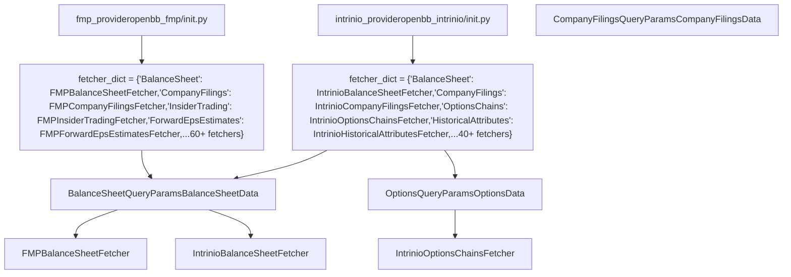
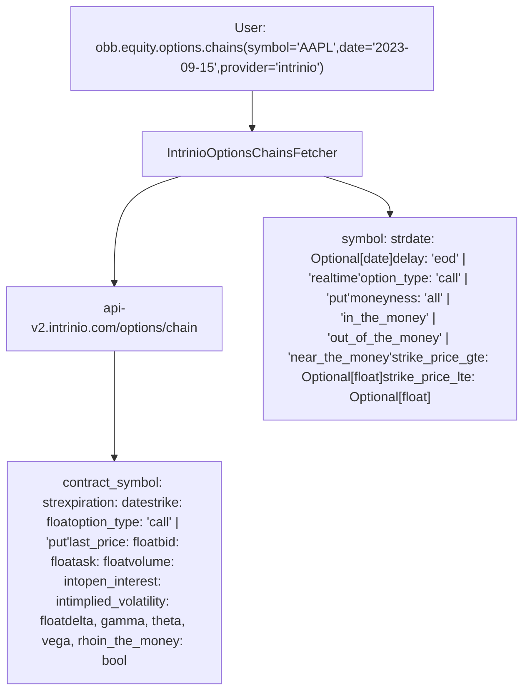
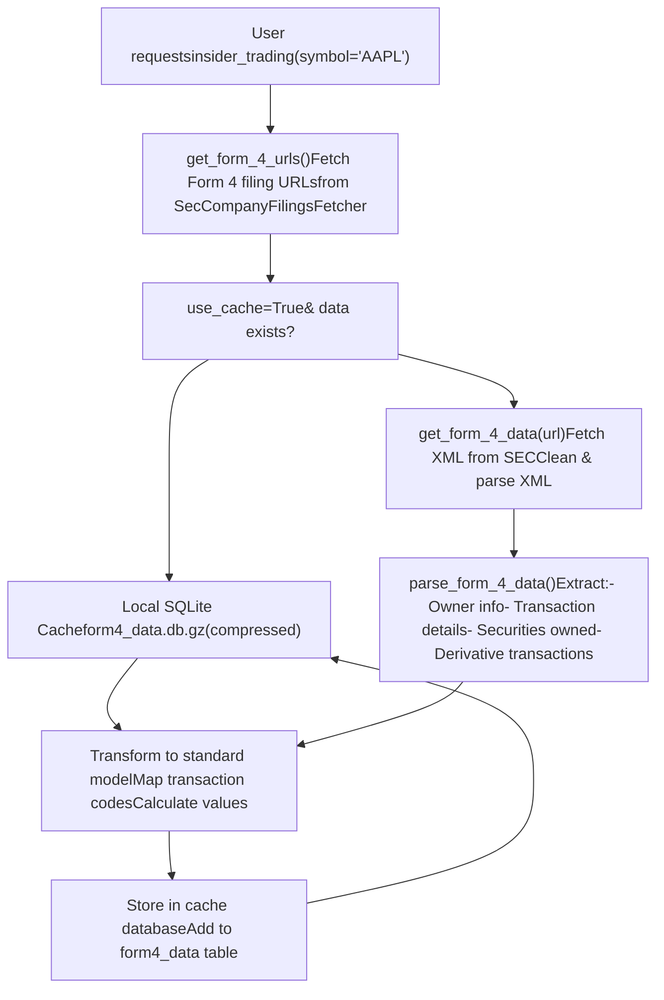
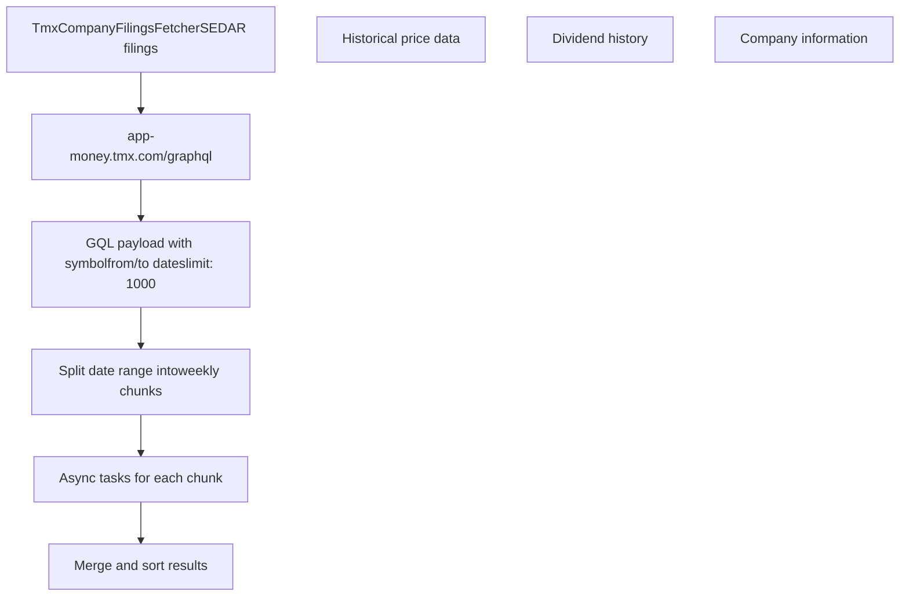
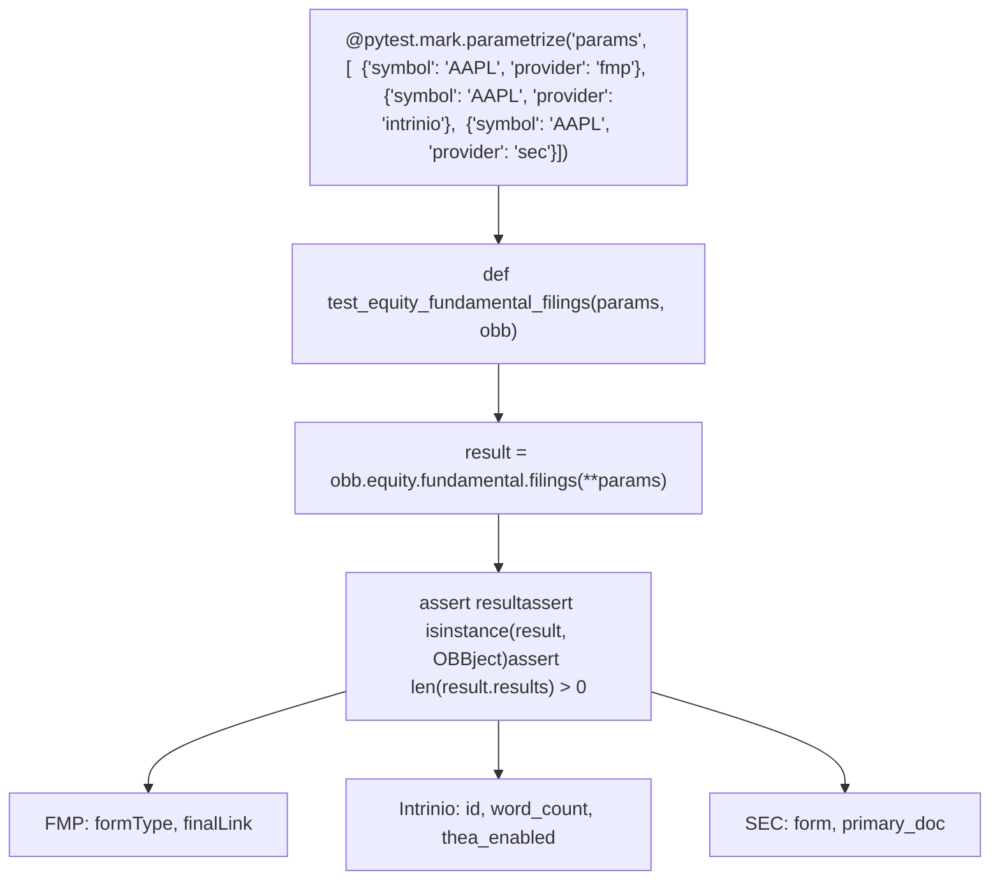
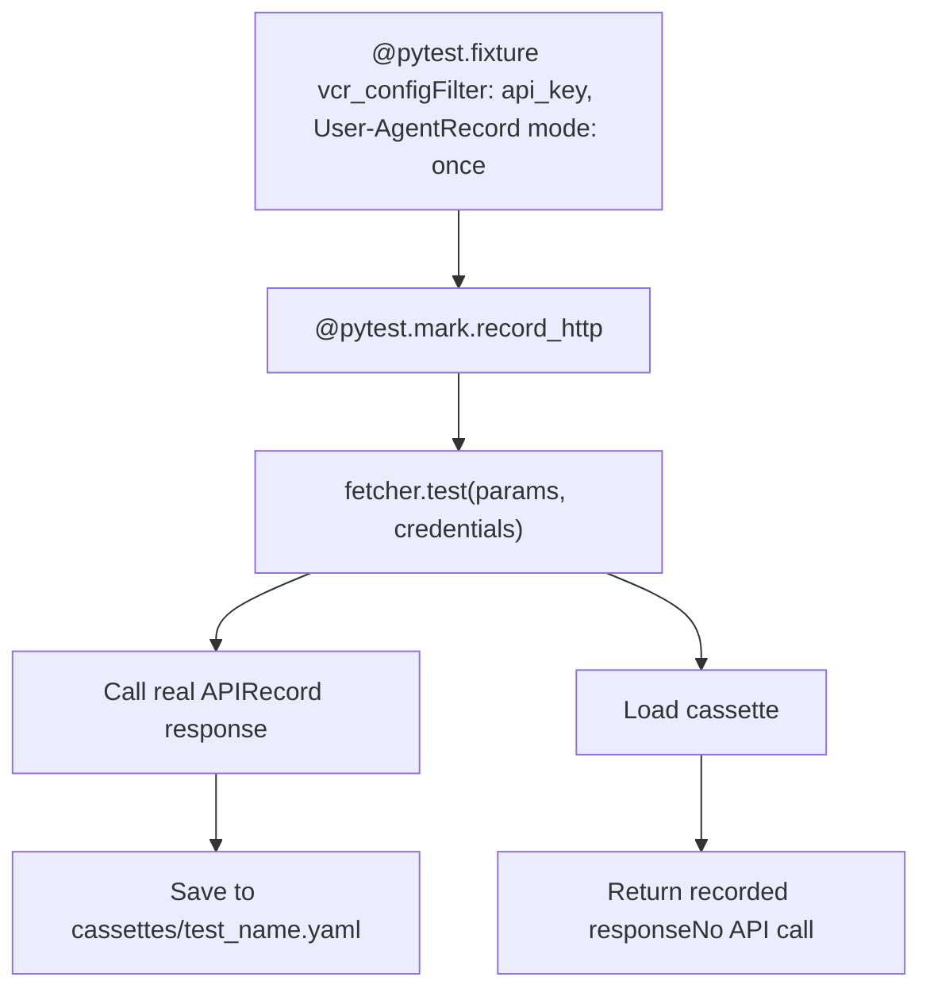

# Financial Data Providers

Relevant source files

-   [openbb\_platform/core/openbb\_core/app/model/charts/chart.py](https://github.com/OpenBB-finance/OpenBB/blob/dddc3b32/openbb_platform/core/openbb_core/app/model/charts/chart.py)
-   [openbb\_platform/core/openbb\_core/provider/standard\_models/company\_filings.py](https://github.com/OpenBB-finance/OpenBB/blob/dddc3b32/openbb_platform/core/openbb_core/provider/standard_models/company_filings.py)
-   [openbb\_platform/core/openbb\_core/provider/standard\_models/primary\_dealer\_fails.py](https://github.com/OpenBB-finance/OpenBB/blob/dddc3b32/openbb_platform/core/openbb_core/provider/standard_models/primary_dealer_fails.py)
-   [openbb\_platform/core/tests/app/model/charts/test\_chart.py](https://github.com/OpenBB-finance/OpenBB/blob/dddc3b32/openbb_platform/core/tests/app/model/charts/test_chart.py)
-   [openbb\_platform/extensions/economy/integration/test\_economy\_api.py](https://github.com/OpenBB-finance/OpenBB/blob/dddc3b32/openbb_platform/extensions/economy/integration/test_economy_api.py)
-   [openbb\_platform/extensions/economy/integration/test\_economy\_python.py](https://github.com/OpenBB-finance/OpenBB/blob/dddc3b32/openbb_platform/extensions/economy/integration/test_economy_python.py)
-   [openbb\_platform/extensions/economy/openbb\_economy/economy\_router.py](https://github.com/OpenBB-finance/OpenBB/blob/dddc3b32/openbb_platform/extensions/economy/openbb_economy/economy_router.py)
-   [openbb\_platform/extensions/economy/openbb\_economy/survey/survey\_router.py](https://github.com/OpenBB-finance/OpenBB/blob/dddc3b32/openbb_platform/extensions/economy/openbb_economy/survey/survey_router.py)
-   [openbb\_platform/extensions/equity/integration/test\_equity\_api.py](https://github.com/OpenBB-finance/OpenBB/blob/dddc3b32/openbb_platform/extensions/equity/integration/test_equity_api.py)
-   [openbb\_platform/extensions/equity/integration/test\_equity\_python.py](https://github.com/OpenBB-finance/OpenBB/blob/dddc3b32/openbb_platform/extensions/equity/integration/test_equity_python.py)
-   [openbb\_platform/extensions/equity/openbb\_equity/fundamental/fundamental\_router.py](https://github.com/OpenBB-finance/OpenBB/blob/dddc3b32/openbb_platform/extensions/equity/openbb_equity/fundamental/fundamental_router.py)
-   [openbb\_platform/extensions/etf/integration/test\_etf\_api.py](https://github.com/OpenBB-finance/OpenBB/blob/dddc3b32/openbb_platform/extensions/etf/integration/test_etf_api.py)
-   [openbb\_platform/extensions/etf/integration/test\_etf\_python.py](https://github.com/OpenBB-finance/OpenBB/blob/dddc3b32/openbb_platform/extensions/etf/integration/test_etf_python.py)
-   [openbb\_platform/extensions/platform\_api/openbb\_platform\_api/assets/default\_apps.json](https://github.com/OpenBB-finance/OpenBB/blob/dddc3b32/openbb_platform/extensions/platform_api/openbb_platform_api/assets/default_apps.json)
-   [openbb\_platform/extensions/tests/test\_integration\_tests\_api.py](https://github.com/OpenBB-finance/OpenBB/blob/dddc3b32/openbb_platform/extensions/tests/test_integration_tests_api.py)
-   [openbb\_platform/extensions/tests/test\_integration\_tests\_python.py](https://github.com/OpenBB-finance/OpenBB/blob/dddc3b32/openbb_platform/extensions/tests/test_integration_tests_python.py)
-   [openbb\_platform/extensions/tests/utils/integration\_tests\_api\_generator.py](https://github.com/OpenBB-finance/OpenBB/blob/dddc3b32/openbb_platform/extensions/tests/utils/integration_tests_api_generator.py)
-   [openbb\_platform/extensions/tests/utils/integration\_tests\_testers.py](https://github.com/OpenBB-finance/OpenBB/blob/dddc3b32/openbb_platform/extensions/tests/utils/integration_tests_testers.py)
-   [openbb\_platform/providers/federal\_reserve/openbb\_federal\_reserve/\_\_init\_\_.py](https://github.com/OpenBB-finance/OpenBB/blob/dddc3b32/openbb_platform/providers/federal_reserve/openbb_federal_reserve/__init__.py)
-   [openbb\_platform/providers/federal\_reserve/openbb\_federal\_reserve/assets/historical\_releases.json](https://github.com/OpenBB-finance/OpenBB/blob/dddc3b32/openbb_platform/providers/federal_reserve/openbb_federal_reserve/assets/historical_releases.json)
-   [openbb\_platform/providers/federal\_reserve/openbb\_federal\_reserve/models/fomc\_documents.py](https://github.com/OpenBB-finance/OpenBB/blob/dddc3b32/openbb_platform/providers/federal_reserve/openbb_federal_reserve/models/fomc_documents.py)
-   [openbb\_platform/providers/federal\_reserve/openbb\_federal\_reserve/models/primary\_dealer\_fails.py](https://github.com/OpenBB-finance/OpenBB/blob/dddc3b32/openbb_platform/providers/federal_reserve/openbb_federal_reserve/models/primary_dealer_fails.py)
-   [openbb\_platform/providers/federal\_reserve/openbb\_federal\_reserve/models/primary\_dealer\_positioning.py](https://github.com/OpenBB-finance/OpenBB/blob/dddc3b32/openbb_platform/providers/federal_reserve/openbb_federal_reserve/models/primary_dealer_positioning.py)
-   [openbb\_platform/providers/federal\_reserve/openbb\_federal\_reserve/utils/fomc\_documents.py](https://github.com/OpenBB-finance/OpenBB/blob/dddc3b32/openbb_platform/providers/federal_reserve/openbb_federal_reserve/utils/fomc_documents.py)
-   [openbb\_platform/providers/federal\_reserve/openbb\_federal\_reserve/utils/primary\_dealer\_statistics.py](https://github.com/OpenBB-finance/OpenBB/blob/dddc3b32/openbb_platform/providers/federal_reserve/openbb_federal_reserve/utils/primary_dealer_statistics.py)
-   [openbb\_platform/providers/federal\_reserve/tests/record/http/test\_federal\_reserve\_fetchers/test\_federal\_reserve\_fomc\_documents\_fetcher\_urllib3\_v2.yaml](https://github.com/OpenBB-finance/OpenBB/blob/dddc3b32/openbb_platform/providers/federal_reserve/tests/record/http/test_federal_reserve_fetchers/test_federal_reserve_fomc_documents_fetcher_urllib3_v2.yaml)
-   [openbb\_platform/providers/federal\_reserve/tests/record/http/test\_federal\_reserve\_fetchers/test\_federal\_reserve\_primary\_dealer\_fails\_fetcher\_urllib3\_v2.yaml](https://github.com/OpenBB-finance/OpenBB/blob/dddc3b32/openbb_platform/providers/federal_reserve/tests/record/http/test_federal_reserve_fetchers/test_federal_reserve_primary_dealer_fails_fetcher_urllib3_v2.yaml)
-   [openbb\_platform/providers/federal\_reserve/tests/test\_federal\_reserve\_fetchers.py](https://github.com/OpenBB-finance/OpenBB/blob/dddc3b32/openbb_platform/providers/federal_reserve/tests/test_federal_reserve_fetchers.py)
-   [openbb\_platform/providers/fmp/openbb\_fmp/\_\_init\_\_.py](https://github.com/OpenBB-finance/OpenBB/blob/dddc3b32/openbb_platform/providers/fmp/openbb_fmp/__init__.py)
-   [openbb\_platform/providers/fmp/openbb\_fmp/models/company\_filings.py](https://github.com/OpenBB-finance/OpenBB/blob/dddc3b32/openbb_platform/providers/fmp/openbb_fmp/models/company_filings.py)
-   [openbb\_platform/providers/fmp/pyproject.toml](https://github.com/OpenBB-finance/OpenBB/blob/dddc3b32/openbb_platform/providers/fmp/pyproject.toml)
-   [openbb\_platform/providers/fmp/tests/test\_fmp\_fetchers.py](https://github.com/OpenBB-finance/OpenBB/blob/dddc3b32/openbb_platform/providers/fmp/tests/test_fmp_fetchers.py)
-   [openbb\_platform/providers/fred/openbb\_fred/\_\_init\_\_.py](https://github.com/OpenBB-finance/OpenBB/blob/dddc3b32/openbb_platform/providers/fred/openbb_fred/__init__.py)
-   [openbb\_platform/providers/fred/openbb\_fred/models/manufacturing\_outlook\_ny.py](https://github.com/OpenBB-finance/OpenBB/blob/dddc3b32/openbb_platform/providers/fred/openbb_fred/models/manufacturing_outlook_ny.py)
-   [openbb\_platform/providers/fred/tests/record/http/test\_fred\_fetchers/test\_fred\_manufacturing\_outlook\_ny\_fetcher\_urllib3\_v2.yaml](https://github.com/OpenBB-finance/OpenBB/blob/dddc3b32/openbb_platform/providers/fred/tests/record/http/test_fred_fetchers/test_fred_manufacturing_outlook_ny_fetcher_urllib3_v2.yaml)
-   [openbb\_platform/providers/fred/tests/test\_fred\_fetchers.py](https://github.com/OpenBB-finance/OpenBB/blob/dddc3b32/openbb_platform/providers/fred/tests/test_fred_fetchers.py)
-   [openbb\_platform/providers/intrinio/openbb\_intrinio/\_\_init\_\_.py](https://github.com/OpenBB-finance/OpenBB/blob/dddc3b32/openbb_platform/providers/intrinio/openbb_intrinio/__init__.py)
-   [openbb\_platform/providers/intrinio/openbb\_intrinio/models/company\_filings.py](https://github.com/OpenBB-finance/OpenBB/blob/dddc3b32/openbb_platform/providers/intrinio/openbb_intrinio/models/company_filings.py)
-   [openbb\_platform/providers/intrinio/tests/test\_intrinio\_fetchers.py](https://github.com/OpenBB-finance/OpenBB/blob/dddc3b32/openbb_platform/providers/intrinio/tests/test_intrinio_fetchers.py)
-   [openbb\_platform/providers/sec/openbb\_sec/\_\_init\_\_.py](https://github.com/OpenBB-finance/OpenBB/blob/dddc3b32/openbb_platform/providers/sec/openbb_sec/__init__.py)
-   [openbb\_platform/providers/sec/openbb\_sec/utils/form4.py](https://github.com/OpenBB-finance/OpenBB/blob/dddc3b32/openbb_platform/providers/sec/openbb_sec/utils/form4.py)
-   [openbb\_platform/providers/sec/tests/test\_sec\_fetchers.py](https://github.com/OpenBB-finance/OpenBB/blob/dddc3b32/openbb_platform/providers/sec/tests/test_sec_fetchers.py)
-   [openbb\_platform/providers/tmx/openbb\_tmx/models/company\_filings.py](https://github.com/OpenBB-finance/OpenBB/blob/dddc3b32/openbb_platform/providers/tmx/openbb_tmx/models/company_filings.py)

This page documents FMP (Financial Modeling Prep) and Intrinio, the two most comprehensive commercial financial data providers in the OpenBB Platform. FMP provides 60+ fetchers and Intrinio provides 40+ fetchers covering equity fundamentals, company filings, analyst estimates, ownership data, and financial metrics.

For economic data providers (FRED, Federal Reserve), see page 4.1. For additional providers (YFinance, SEC, Nasdaq), see page 4.3.

## Overview

FMP and Intrinio are commercial API providers that offer extensive coverage of equity fundamental data, SEC filings, earnings estimates, and institutional ownership. Both require API keys and implement the provider abstraction pattern with standard models.

### Provider Comparison

| Feature | FMP | Intrinio |
| --- | --- | --- |
| **Fetchers** | 60+ | 40+ |
| **Pricing** | Commercial API | Commercial API |
| **Coverage** | US equities, international, crypto, forex | US equities, international |
| **Unique Features** | Growth metrics, earnings transcripts, executive compensation | Data tags system, options chains, as-reported financials |
| **Authentication** | API key from financialmodelingprep.com | API key from intrinio.com |
| **Fundamentals** | Balance sheet, income, cash flow, ratios, metrics | Balance sheet, income, cash flow, ratios, metrics, reported financials |
| **Options** | Not available | Options chains, unusual activity, snapshots |
| **Estimates** | Analyst estimates, price targets, forward EPS/EBITDA | Consensus estimates, forward EPS/sales/EBITDA/PE |
| **Ownership** | Insider trading, institutional ownership, major holders | Insider trading, share statistics |
| **Calendar** | Earnings, dividends, IPO, splits | IPO |

**Sources:**

-   [openbb\_platform/providers/fmp/openbb\_fmp/\_\_init\_\_.py1-153](https://github.com/OpenBB-finance/OpenBB/blob/dddc3b32/openbb_platform/providers/fmp/openbb_fmp/__init__.py#L1-L153)
-   [openbb\_platform/providers/intrinio/openbb\_intrinio/\_\_init\_\_.py1-117](https://github.com/OpenBB-finance/OpenBB/blob/dddc3b32/openbb_platform/providers/intrinio/openbb_intrinio/__init__.py#L1-L117)
-   [openbb\_platform/providers/fmp/pyproject.toml1-20](https://github.com/OpenBB-finance/OpenBB/blob/dddc3b32/openbb_platform/providers/fmp/pyproject.toml#L1-L20)

## Provider Registration Pattern

Both FMP and Intrinio register their fetchers through the `Provider` class, which maps standard model names to provider-specific fetcher implementations.


**Diagram: FMP and Intrinio Provider Registration**

The `fmp_provider` and `intrinio_provider` instances are defined in [openbb\_platform/providers/fmp/openbb\_fmp/\_\_init\_\_.py72-152](https://github.com/OpenBB-finance/OpenBB/blob/dddc3b32/openbb_platform/providers/fmp/openbb_fmp/__init__.py#L72-L152) and [openbb\_platform/providers/intrinio/openbb\_intrinio/\_\_init\_\_.py66-116](https://github.com/OpenBB-finance/OpenBB/blob/dddc3b32/openbb_platform/providers/intrinio/openbb_intrinio/__init__.py#L66-L116) Each provider's `fetcher_dict` maps standard model names to fetcher classes.

**Sources:**

-   [openbb\_platform/providers/fmp/openbb\_fmp/\_\_init\_\_.py72-152](https://github.com/OpenBB-finance/OpenBB/blob/dddc3b32/openbb_platform/providers/fmp/openbb_fmp/__init__.py#L72-L152)
-   [openbb\_platform/providers/intrinio/openbb\_intrinio/\_\_init\_\_.py66-116](https://github.com/OpenBB-finance/OpenBB/blob/dddc3b32/openbb_platform/providers/intrinio/openbb_intrinio/__init__.py#L66-L116)

## FMP Provider (Financial Modeling Prep)

FMP provides 60+ fetchers covering equity fundamentals, filings, estimates, ownership, and market data. It is registered as the `fmp_provider` in [openbb\_platform/providers/fmp/openbb\_fmp/\_\_init\_\_.py72-152](https://github.com/OpenBB-finance/OpenBB/blob/dddc3b32/openbb_platform/providers/fmp/openbb_fmp/__init__.py#L72-L152)

### Authentication

FMP requires an API key from financialmodelingprep.com. The credentials are stored as `fmp_api_key` in user settings.

```
# Credential configuration in fmp_providercredentials=["api_key"]deprecated_credentials={"API_KEY_FINANCIALMODELINGPREP": "fmp_api_key"}
```
Setup instructions are embedded in the provider definition at [openbb\_platform/providers/fmp/openbb\_fmp/\_\_init\_\_.py151](https://github.com/OpenBB-finance/OpenBB/blob/dddc3b32/openbb_platform/providers/fmp/openbb_fmp/__init__.py#L151-L151)

**Sources:**

-   [openbb\_platform/providers/fmp/openbb\_fmp/\_\_init\_\_.py72-152](https://github.com/OpenBB-finance/OpenBB/blob/dddc3b32/openbb_platform/providers/fmp/openbb_fmp/__init__.py#L72-L152)
-   [openbb\_platform/providers/fmp/pyproject.toml1-20](https://github.com/OpenBB-finance/OpenBB/blob/dddc3b32/openbb_platform/providers/fmp/pyproject.toml#L1-L20)

### FMP Fetcher Categories


**Diagram: FMP Fetcher Organization by Category**

FMP provides 60+ fetchers organized into fundamental data (9 fetchers), filings (5 fetchers), ownership (4 fetchers), estimates (6 fetchers), calendar events (4 fetchers), and executive data (2 fetchers). Complete list in [openbb\_platform/providers/fmp/openbb\_fmp/\_\_init\_\_.py78-148](https://github.com/OpenBB-finance/OpenBB/blob/dddc3b32/openbb_platform/providers/fmp/openbb_fmp/__init__.py#L78-L148)

**Sources:**

-   [openbb\_platform/providers/fmp/openbb\_fmp/\_\_init\_\_.py1-152](https://github.com/OpenBB-finance/OpenBB/blob/dddc3b32/openbb_platform/providers/fmp/openbb_fmp/__init__.py#L1-L152)
-   [openbb\_platform/providers/fmp/tests/test\_fmp\_fetchers.py1-100](https://github.com/OpenBB-finance/OpenBB/blob/dddc3b32/openbb_platform/providers/fmp/tests/test_fmp_fetchers.py#L1-L100)

### FMP Fetcher Implementation Pattern

FMP fetchers follow the standard three-stage pattern: `transform_query()`, `aextract_data()`, and `transform_data()`. This example shows the balance sheet fetcher.

> **[Mermaid sequence]**
> *(图表结构无法解析)*

**Diagram: FMP Balance Sheet Fetcher Execution**

The fetcher transforms query parameters, makes an authenticated API request to financialmodelingprep.com, and transforms the response into standardized data models. Implementation at [openbb\_platform/providers/fmp/openbb\_fmp/models/balance\_sheet.py](https://github.com/OpenBB-finance/OpenBB/blob/dddc3b32/openbb_platform/providers/fmp/openbb_fmp/models/balance_sheet.py)

**Sources:**

-   [openbb\_platform/providers/fmp/tests/test\_fmp\_fetchers.py189-195](https://github.com/OpenBB-finance/OpenBB/blob/dddc3b32/openbb_platform/providers/fmp/tests/test_fmp_fetchers.py#L189-L195)
-   [openbb\_platform/extensions/equity/integration/test\_equity\_python.py21-58](https://github.com/OpenBB-finance/OpenBB/blob/dddc3b32/openbb_platform/extensions/equity/integration/test_equity_python.py#L21-L58)

### FMP Query Parameters and Data Models

FMP fetchers extend standard models with provider-specific parameters. Key examples:

| Fetcher | Standard Params | FMP-Specific Params | Key Output Fields |
| --- | --- | --- | --- |
| `FMPBalanceSheetFetcher` | `symbol`, `period`, `limit` | None | `total_assets`, `total_liabilities`, `total_equity`, `fiscal_period`, `filing_date` |
| `FMPIncomeStatementFetcher` | `symbol`, `period`, `limit` | None | `revenue`, `cost_of_revenue`, `gross_profit`, `net_income`, `eps`, `eps_diluted` |
| `FMPCashFlowStatementFetcher` | `symbol`, `period`, `limit` | None | `net_cash_flow_from_operations`, `capital_expenditure`, `free_cash_flow` |
| `FMPCompanyFilingsFetcher` | `symbol`, `form_type` | `cik`, `start_date`, `end_date`, `page`, `limit` | `filing_date`, `report_type`, `report_url`, `filing_url`, `accepted_date` |
| `FMPInsiderTradingFetcher` | `symbol`, `limit` | `transaction_type`, `statistics` | `transaction_date`, `securities_transacted`, `transaction_price`, `securities_owned` |
| `FMPInstitutionalOwnershipFetcher` | `symbol` | `year`, `quarter`, `page` | `holder`, `shares`, `date_reported`, `pct_change`, `market_value` |
| `FMPFinancialRatiosFetcher` | `symbol`, `period`, `limit` | `ttm` (include TTM) | `current_ratio`, `debt_to_equity`, `return_on_equity`, `return_on_assets` |
| `FMPForwardEpsEstimatesFetcher` | `symbol` | `fiscal_period`, `limit`, `include_historical` | `date`, `estimated_revenue_high`, `estimated_revenue_low`, `number_analyst_estimated_revenue` |
| `FMPPriceTargetFetcher` | `symbol`, `limit` | None | `published_date`, `news_url`, `analyst_name`, `analyst_company`, `price_target` |

**Sources:**

-   [openbb\_platform/extensions/equity/integration/test\_equity\_python.py21-80](https://github.com/OpenBB-finance/OpenBB/blob/dddc3b32/openbb_platform/extensions/equity/integration/test_equity_python.py#L21-L80)
-   [openbb\_platform/providers/fmp/tests/test\_fmp\_fetchers.py189-215](https://github.com/OpenBB-finance/OpenBB/blob/dddc3b32/openbb_platform/providers/fmp/tests/test_fmp_fetchers.py#L189-L215)
-   [openbb\_platform/providers/fmp/tests/test\_fmp\_fetchers.py309-325](https://github.com/OpenBB-finance/OpenBB/blob/dddc3b32/openbb_platform/providers/fmp/tests/test_fmp_fetchers.py#L309-L325)

### FMP Unique Features

FMP provides several unique fetchers not available in other providers:

**Growth Metrics**: `FMPBalanceSheetGrowthFetcher`, `FMPIncomeStatementGrowthFetcher`, `FMPCashFlowStatementGrowthFetcher` provide year-over-year growth percentages for all financial statement line items.

**Earnings Transcripts**: `FMPEarningsCallTranscriptFetcher` returns full text of earnings call transcripts by year and quarter.

**Executive Compensation**: `FMPExecutiveCompensationFetcher` provides detailed compensation data for key executives including salary, bonus, stock awards, and total compensation.

**Revenue Segmentation**: `FMPRevenueGeographicFetcher` and `FMPRevenueBusinessLineFetcher` break down revenue by geographic region and business segment.

**Government Trades**: `FMPGovernmentTradesFetcher` tracks trades by US government officials.

**Testing**: Integration tests are in [openbb\_platform/extensions/equity/integration/test\_equity\_python.py21-600](https://github.com/OpenBB-finance/OpenBB/blob/dddc3b32/openbb_platform/extensions/equity/integration/test_equity_python.py#L21-L600) and unit tests with VCR cassettes are in [openbb\_platform/providers/fmp/tests/test\_fmp\_fetchers.py105-700](https://github.com/OpenBB-finance/OpenBB/blob/dddc3b32/openbb_platform/providers/fmp/tests/test_fmp_fetchers.py#L105-L700)

**Sources:**

-   [openbb\_platform/providers/fmp/openbb\_fmp/\_\_init\_\_.py78-148](https://github.com/OpenBB-finance/OpenBB/blob/dddc3b32/openbb_platform/providers/fmp/openbb_fmp/__init__.py#L78-L148)
-   [openbb\_platform/providers/fmp/tests/test\_fmp\_fetchers.py249-305](https://github.com/OpenBB-finance/OpenBB/blob/dddc3b32/openbb_platform/providers/fmp/tests/test_fmp_fetchers.py#L249-L305)
-   [openbb\_platform/extensions/equity/integration/test\_equity\_python.py67-80](https://github.com/OpenBB-finance/OpenBB/blob/dddc3b32/openbb_platform/extensions/equity/integration/test_equity_python.py#L67-L80)

## Intrinio Provider

Intrinio provides 40+ fetchers with advanced features including a searchable data tags system, options chains, as-reported financials, and NLP-enhanced filings. The provider is registered as `intrinio_provider` in [openbb\_platform/providers/intrinio/openbb\_intrinio/\_\_init\_\_.py66-116](https://github.com/OpenBB-finance/OpenBB/blob/dddc3b32/openbb_platform/providers/intrinio/openbb_intrinio/__init__.py#L66-L116)

### Authentication

Intrinio requires an API key from intrinio.com. The credentials are stored as `intrinio_api_key` in user settings.

```
# Credential configuration in intrinio_providercredentials=["api_key"]deprecated_credentials={"API_INTRINIO_KEY": "intrinio_api_key"}
```
Setup instructions are embedded in the provider definition at [openbb\_platform/providers/intrinio/openbb\_intrinio/\_\_init\_\_.py115](https://github.com/OpenBB-finance/OpenBB/blob/dddc3b32/openbb_platform/providers/intrinio/openbb_intrinio/__init__.py#L115-L115)

**Sources:**

-   [openbb\_platform/providers/intrinio/openbb\_intrinio/\_\_init\_\_.py66-116](https://github.com/OpenBB-finance/OpenBB/blob/dddc3b32/openbb_platform/providers/intrinio/openbb_intrinio/__init__.py#L66-L116)

### Intrinio Fetcher Categories


**Diagram: Intrinio Fetcher Organization**

Intrinio provides 40+ fetchers organized into fundamentals (6 fetchers), data tags (3 fetchers), options (3 fetchers), filings/ownership (3 fetchers), estimates (5 fetchers), and additional data (4+ fetchers). The data tags system and options fetchers are unique to Intrinio.

**Sources:**

-   [openbb\_platform/providers/intrinio/openbb\_intrinio/\_\_init\_\_.py66-116](https://github.com/OpenBB-finance/OpenBB/blob/dddc3b32/openbb_platform/providers/intrinio/openbb_intrinio/__init__.py#L66-L116)
-   [openbb\_platform/providers/intrinio/tests/test\_intrinio\_fetchers.py1-100](https://github.com/OpenBB-finance/OpenBB/blob/dddc3b32/openbb_platform/providers/intrinio/tests/test_intrinio_fetchers.py#L1-L100)

### Intrinio Data Tags System

Intrinio's data tags system provides access to 20,000+ financial metrics through a searchable taxonomy. The system consists of three fetchers: `IntrinioSearchAttributesFetcher`, `IntrinioHistoricalAttributesFetcher`, and `IntrinioLatestAttributesFetcher`.

> **[Mermaid sequence]**
> *(图表结构无法解析)*

**Diagram: Intrinio Data Tags API Flow**

The data tags system workflow: (1) Search for tags by query string, (2) Query historical time series by tag and frequency, (3) Get latest values for tags. Tags support comma-separated strings or lists. Implementations at [openbb\_platform/providers/intrinio/openbb\_intrinio/models/search\_attributes.py](https://github.com/OpenBB-finance/OpenBB/blob/dddc3b32/openbb_platform/providers/intrinio/openbb_intrinio/models/search_attributes.py) [openbb\_platform/providers/intrinio/openbb\_intrinio/models/historical\_attributes.py](https://github.com/OpenBB-finance/OpenBB/blob/dddc3b32/openbb_platform/providers/intrinio/openbb_intrinio/models/historical_attributes.py) [openbb\_platform/providers/intrinio/openbb\_intrinio/models/latest\_attributes.py](https://github.com/OpenBB-finance/OpenBB/blob/dddc3b32/openbb_platform/providers/intrinio/openbb_intrinio/models/latest_attributes.py)

**Sources:**

-   [openbb\_platform/providers/intrinio/tests/test\_intrinio\_fetchers.py248-290](https://github.com/OpenBB-finance/OpenBB/blob/dddc3b32/openbb_platform/providers/intrinio/tests/test_intrinio_fetchers.py#L248-L290)
-   [openbb\_platform/extensions/equity/integration/test\_equity\_python.py1148-1284](https://github.com/OpenBB-finance/OpenBB/blob/dddc3b32/openbb_platform/extensions/equity/integration/test_equity_python.py#L1148-L1284)

### Intrinio Options Chains

Intrinio is the only provider in this section offering comprehensive options data through three fetchers: `IntrinioOptionsChainsFetcher`, `IntrinioOptionsUnusualFetcher`, and `IntrinioOptionsSnapshotsFetcher`.


**Diagram: Intrinio Options Chains Architecture**

The options chains fetcher supports filtering by moneyness, option type, strike price range, and expiration date. Returns full Greeks (delta, gamma, theta, vega, rho) and implied volatility. Implementation at [openbb\_platform/providers/intrinio/openbb\_intrinio/models/options\_chains.py](https://github.com/OpenBB-finance/OpenBB/blob/dddc3b32/openbb_platform/providers/intrinio/openbb_intrinio/models/options_chains.py)

**Unusual Options Activity**: `IntrinioOptionsUnusualFetcher` identifies unusual trading activity with filters for trade type (block, sweep, large), sentiment (bullish, bearish, neutral), and minimum trade value. Test at [openbb\_platform/providers/intrinio/tests/test\_intrinio\_fetchers.py180-192](https://github.com/OpenBB-finance/OpenBB/blob/dddc3b32/openbb_platform/providers/intrinio/tests/test_intrinio_fetchers.py#L180-L192)

**Options Snapshots**: `IntrinioOptionsSnapshotsFetcher` retrieves full market snapshots of all options for a given date. Note: This endpoint can return very large datasets and is disabled in tests with `@pytest.mark.skip`.

**Sources:**

-   [openbb\_platform/providers/intrinio/tests/test\_intrinio\_fetchers.py169-192](https://github.com/OpenBB-finance/OpenBB/blob/dddc3b32/openbb_platform/providers/intrinio/tests/test_intrinio_fetchers.py#L169-L192)
-   [openbb\_platform/providers/intrinio/tests/test\_intrinio\_fetchers.py525-532](https://github.com/OpenBB-finance/OpenBB/blob/dddc3b32/openbb_platform/providers/intrinio/tests/test_intrinio_fetchers.py#L525-L532)
-   [openbb\_platform/providers/intrinio/openbb\_intrinio/\_\_init\_\_.py104-106](https://github.com/OpenBB-finance/OpenBB/blob/dddc3b32/openbb_platform/providers/intrinio/openbb_intrinio/__init__.py#L104-L106)

### Intrinio Query Parameters

Intrinio fetchers provide extensive filtering and customization options:

| Fetcher | Standard Params | Intrinio-Specific Params | Key Features |
| --- | --- | --- | --- |
| `IntrinioBalanceSheetFetcher` | `symbol`, `period`, `limit` | `fiscal_year` | Filter to specific fiscal year |
| `IntrinioCompanyFilingsFetcher` | `symbol`, `form_type` | `start_date`, `end_date`, `limit`, `thea_enabled` | `thea_enabled=True` returns NLP-processed filings |
| `IntrinioHistoricalAttributesFetcher` | `symbol`, `tag` | `frequency`, `tag_type`, `sort`, `start_date`, `end_date` | Tags support comma-separated values or lists |
| `IntrinioReportedFinancialsFetcher` | `symbol`, `statement_type` | `period`, `fiscal_year`, `limit` | Returns as-reported (not standardized) financials |
| `IntrinioInsiderTradingFetcher` | `symbol`, `limit` | `start_date`, `end_date`, `ownership_type`, `sort_by` | `sort_by` options: `updated_on`, `filed_on` |
| `IntrinioOptionsChainsFetcher` | `symbol` | `date`, `delay`, `option_type`, `moneyness`, `strike_price_gte`, `strike_price_lte` | Full Greeks and implied volatility |
| `IntrinioOptionsUnusualFetcher` | None | `source`, `trade_type`, `sentiment`, `start_date`, `min_value` | Filters for unusual options activity |
| `IntrinioForwardEpsEstimatesFetcher` | `symbol` | `fiscal_period`, `fiscal_year`, `calendar_year`, `calendar_period` | Multiple date filtering options |

**Sources:**

-   [openbb\_platform/extensions/equity/integration/test\_equity\_python.py1148-1284](https://github.com/OpenBB-finance/OpenBB/blob/dddc3b32/openbb_platform/extensions/equity/integration/test_equity_python.py#L1148-L1284)
-   [openbb\_platform/providers/intrinio/tests/test\_intrinio\_fetchers.py169-192](https://github.com/OpenBB-finance/OpenBB/blob/dddc3b32/openbb_platform/providers/intrinio/tests/test_intrinio_fetchers.py#L169-L192)

## SEC Provider (Free)

The SEC provider accesses data directly from the Securities and Exchange Commission EDGAR system, including advanced Form 4 insider trading processing.

### SEC Form 4 Processing Architecture

The SEC provider includes a sophisticated Form 4 processing system that parses XML filings and caches data locally.


**Diagram: SEC Form 4 Processing Pipeline**

The Form 4 fetcher creates a local SQLite database to cache parsed filings. The database is compressed with gzip when not in use. The parser handles complex XML structures including derivative securities, multiple owners, and footnotes.

**Sources:**

-   [openbb\_platform/providers/sec/openbb\_sec/utils/form4.py1-100](https://github.com/OpenBB-finance/OpenBB/blob/dddc3b32/openbb_platform/providers/sec/openbb_sec/utils/form4.py#L1-L100)
-   [openbb\_platform/providers/sec/openbb\_sec/utils/form4.py200-251](https://github.com/OpenBB-finance/OpenBB/blob/dddc3b32/openbb_platform/providers/sec/openbb_sec/utils/form4.py#L200-L251)
-   [openbb\_platform/providers/sec/openbb\_sec/utils/form4.py302-400](https://github.com/OpenBB-finance/OpenBB/blob/dddc3b32/openbb_platform/providers/sec/openbb_sec/utils/form4.py#L302-L400)

### SEC Form 4 Field Mapping

The Form 4 parser maps XML fields to standardized database columns with proper type conversions:

| XML Field | Database Column | Type | Description |
| --- | --- | --- | --- |
| `filingDate` | `filing_date` | DATE | Date the form was filed |
| `transactionDate` | `transaction_date` | DATE | Date of the transaction |
| `transactionCode` | `transaction_type` | TEXT | Type code (P, S, A, M, etc.) |
| `transactionShares` | `securities_transacted` | REAL | Number of shares transacted |
| `transactionPricePerShare` | `transaction_price` | MONEY | Price per share |
| `transactionTotalValue` | `transaction_value` | MONEY | Total transaction value |
| `sharesOwnedFollowingTransaction` | `securities_owned` | REAL | Shares owned after transaction |
| `isDirector` | `director` | BOOLEAN | Owner is a director |
| `isOfficer` | `officer` | BOOLEAN | Owner is an officer |
| `officerTitle` | `owner_title` | TEXT | Officer's title |

Transaction codes are mapped to descriptions (e.g., "P" → "Open market or private purchase of non-derivative or derivative security").

**Sources:**

-   [openbb\_platform/providers/sec/openbb\_sec/utils/form4.py14-48](https://github.com/OpenBB-finance/OpenBB/blob/dddc3b32/openbb_platform/providers/sec/openbb_sec/utils/form4.py#L14-L48)
-   [openbb\_platform/providers/sec/openbb\_sec/utils/form4.py56-81](https://github.com/OpenBB-finance/OpenBB/blob/dddc3b32/openbb_platform/providers/sec/openbb_sec/utils/form4.py#L56-L81)

### SEC Database Caching System

> **[Mermaid sequence]**
> *(图表结构无法解析)*

**Diagram: SEC Form 4 Caching Workflow**

The caching system reduces load on SEC servers by storing parsed Form 4 data locally. The database is compressed when not in use to save disk space. On close, the table is sorted by `filing_date` for efficient queries.

**Sources:**

-   [openbb\_platform/providers/sec/openbb\_sec/utils/form4.py100-142](https://github.com/OpenBB-finance/OpenBB/blob/dddc3b32/openbb_platform/providers/sec/openbb_sec/utils/form4.py#L100-L142)
-   [openbb\_platform/providers/sec/openbb\_sec/utils/form4.py164-198](https://github.com/OpenBB-finance/OpenBB/blob/dddc3b32/openbb_platform/providers/sec/openbb_sec/utils/form4.py#L164-L198)

## Other Financial Data Providers

### Nasdaq Provider

Provides calendar events and filings for US-listed companies.

| Fetcher | Purpose | Key Fields |
| --- | --- | --- |
| `NasdaqCalendarDividendFetcher` | Upcoming dividend payments | `ex_dividend_date`, `payment_date`, `declaration_date`, `amount` |
| `NasdaqCalendarEarningsFetcher` | Earnings release calendar | `report_date`, `symbol`, `name`, `market_cap` |
| `NasdaqCompanyFilingsFetcher` | SEC filings via Nasdaq API | `filing_date`, `form_group`, `year` |

**Sources:**

-   [openbb\_platform/extensions/equity/integration/test\_equity\_python.py100-110](https://github.com/OpenBB-finance/OpenBB/blob/dddc3b32/openbb_platform/extensions/equity/integration/test_equity_python.py#L100-L110)
-   [openbb\_platform/extensions/equity/integration/test\_equity\_python.py128-151](https://github.com/OpenBB-finance/OpenBB/blob/dddc3b32/openbb_platform/extensions/equity/integration/test_equity_python.py#L128-L151)

### TMX Provider (Toronto Stock Exchange)

Provides data for Canadian companies and funds.


**Diagram: TMX Provider GraphQL Query Pattern**

The TMX provider uses GraphQL queries with date range chunking to fetch large datasets efficiently. Each query fetches up to 1000 records per weekly chunk, then aggregates results.

**Sources:**

-   [openbb\_platform/providers/tmx/openbb\_tmx/models/company\_filings.py1-185](https://github.com/OpenBB-finance/OpenBB/blob/dddc3b32/openbb_platform/providers/tmx/openbb_tmx/models/company_filings.py#L1-L185)
-   [openbb\_platform/providers/tmx/openbb\_tmx/models/company\_filings.py100-175](https://github.com/OpenBB-finance/OpenBB/blob/dddc3b32/openbb_platform/providers/tmx/openbb_tmx/models/company_filings.py#L100-L175)

### Polygon Provider

Focuses on fundamental data with advanced filtering.

| Fetcher | Query Parameters | Notable Features |
| --- | --- | --- |
| `PolygonBalanceSheetFetcher` | `symbol`, `period`, `filing_date` filters | `include_sources`, `order`, `sort` by filing date or period |
| `PolygonIncomeStatementFetcher` | `symbol`, `period`, date range filters | Up to 12 filters for `filing_date` and `period_of_report_date` |
| `PolygonCashFlowStatementFetcher` | Same as income statement | `filing_date_lt`, `filing_date_gte`, etc. |

Polygon's standout feature is granular date filtering with operators: `filing_date`, `filing_date_lt`, `filing_date_lte`, `filing_date_gt`, `filing_date_gte`, plus equivalent filters for `period_of_report_date`.

**Sources:**

-   [openbb\_platform/extensions/equity/integration/test\_equity\_python.py34-54](https://github.com/OpenBB-finance/OpenBB/blob/dddc3b32/openbb_platform/extensions/equity/integration/test_equity_python.py#L34-L54)
-   [openbb\_platform/extensions/equity/integration/test\_equity\_python.py166-185](https://github.com/OpenBB-finance/OpenBB/blob/dddc3b32/openbb_platform/extensions/equity/integration/test_equity_python.py#L166-L185)

### Benzinga and Finviz Providers

**Benzinga** (commercial API):

-   Analyst ratings and price targets
-   Analyst search by firm or name
-   Detailed analyst metadata (IDs, firms, coverage)

**Finviz** (free):

-   Company metrics and fundamentals
-   Peer group comparisons
-   Price performance metrics
-   No API key required

**Sources:**

-   [openbb\_platform/extensions/equity/integration/test\_equity\_python.py644-674](https://github.com/OpenBB-finance/OpenBB/blob/dddc3b32/openbb_platform/extensions/equity/integration/test_equity_python.py#L644-L674)
-   [openbb\_platform/extensions/equity/integration/test\_equity\_python.py701-723](https://github.com/OpenBB-finance/OpenBB/blob/dddc3b32/openbb_platform/extensions/equity/integration/test_equity_python.py#L701-L723)

## Standard Models and Fetcher Patterns

### CompanyFilings Standard Model

All company filings fetchers implement the `CompanyFilings` standard model, allowing provider interchangeability.


**Diagram: CompanyFilings Standard Model Inheritance**

The standard model defines required fields (`filing_date`, `report_type`, `report_url`). Each provider extends this with additional fields. Field validators in the standard model (like `convert_date`) apply to all providers.

**Sources:**

-   [openbb\_platform/core/openbb\_core/provider/standard\_models/company\_filings.py1-44](https://github.com/OpenBB-finance/OpenBB/blob/dddc3b32/openbb_platform/core/openbb_core/provider/standard_models/company_filings.py#L1-L44)
-   [openbb\_platform/providers/fmp/openbb\_fmp/models/company\_filings.py53-70](https://github.com/OpenBB-finance/OpenBB/blob/dddc3b32/openbb_platform/providers/fmp/openbb_fmp/models/company_filings.py#L53-L70)
-   [openbb\_platform/providers/intrinio/openbb\_intrinio/models/company\_filings.py59-81](https://github.com/OpenBB-finance/OpenBB/blob/dddc3b32/openbb_platform/providers/intrinio/openbb_intrinio/models/company_filings.py#L59-L81)

### Provider-Specific Extension Pattern

Providers extend standard models to add unique data points while maintaining compatibility:

| Standard Field | FMP Extension | Intrinio Extension | SEC Extension |
| --- | --- | --- | --- |
| `filing_date` | ✓ Required | ✓ Required | ✓ Required |
| `report_type` | `formType` (alias) | ✓ | `form` |
| `report_url` | `finalLink` (alias) | ✓ | ✓ |
| Additional | `filing_url`, `cik`, `symbol`, `accepted_date` | `id`, `sec_unique_id`, `instance_url`, `industry_group`, `word_count`, `thea_enabled` | `primary_doc`, `items`, `size`, `complete_submission_url`, `filing_url` |

The `__alias_dict__` in data models maps provider API field names to standard names. For example, FMP uses `"formType"` but it's aliased to `report_type`.

**Sources:**

-   [openbb\_platform/providers/fmp/openbb\_fmp/models/company\_filings.py53-70](https://github.com/OpenBB-finance/OpenBB/blob/dddc3b32/openbb_platform/providers/fmp/openbb_fmp/models/company_filings.py#L53-L70)
-   [openbb\_platform/providers/intrinio/openbb\_intrinio/models/company\_filings.py59-81](https://github.com/OpenBB-finance/OpenBB/blob/dddc3b32/openbb_platform/providers/intrinio/openbb_intrinio/models/company_filings.py#L59-L81)

## Integration Testing Across Providers

### Parametrized Test Pattern

Integration tests validate that each provider correctly implements standard models using `@pytest.mark.parametrize`:


**Diagram: Multi-Provider Integration Test Pattern**

A single test function validates multiple providers by parametrizing the `provider` parameter. This ensures all providers correctly implement the standard interface.

**Sources:**

-   [openbb\_platform/extensions/equity/integration/test\_equity\_python.py900-971](https://github.com/OpenBB-finance/OpenBB/blob/dddc3b32/openbb_platform/extensions/equity/integration/test_equity_python.py#L900-L971)
-   [openbb\_platform/extensions/equity/integration/test\_equity\_api.py944-977](https://github.com/OpenBB-finance/OpenBB/blob/dddc3b32/openbb_platform/extensions/equity/integration/test_equity_api.py#L944-L977)

### Provider-Specific Parameter Testing

Tests also validate provider-specific parameters:

```
# FMP-specific parameters{"symbol": "AAPL", "form_type": "144", "limit": 100, "provider": "fmp"} # Intrinio-specific parameters{"symbol": "AAPL", "form_type": "4", "thea_enabled": None, "provider": "intrinio"} # SEC-specific parameters{"symbol": "AAPL", "form_type": "8-K", "use_cache": False, "provider": "sec"}
```
Each provider's test suite includes parameter combinations that test unique features (like FMP's pagination, Intrinio's NLP flag, or SEC's caching).

**Sources:**

-   [openbb\_platform/extensions/equity/integration/test\_equity\_python.py900-971](https://github.com/OpenBB-finance/OpenBB/blob/dddc3b32/openbb_platform/extensions/equity/integration/test_equity_python.py#L900-L971)
-   [openbb\_platform/extensions/equity/integration/test\_equity\_api.py944-1021](https://github.com/OpenBB-finance/OpenBB/blob/dddc3b32/openbb_platform/extensions/equity/integration/test_equity_api.py#L944-L1021)

### VCR Cassette Recording for Provider Tests

Provider-specific unit tests use VCR (Video Cassette Recorder) to record HTTP responses:


**Diagram: VCR Test Recording Pattern**

VCR records API responses on the first test run, then replays them in subsequent runs. This allows tests to run without API keys and ensures consistent test data. Sensitive data (API keys) are filtered before recording.

**Sources:**

-   [openbb\_platform/providers/fmp/tests/test\_fmp\_fetchers.py83-103](https://github.com/OpenBB-finance/OpenBB/blob/dddc3b32/openbb_platform/providers/fmp/tests/test_fmp_fetchers.py#L83-L103)
-   [openbb\_platform/providers/intrinio/tests/test\_intrinio\_fetchers.py75-90](https://github.com/OpenBB-finance/OpenBB/blob/dddc3b32/openbb_platform/providers/intrinio/tests/test_intrinio_fetchers.py#L75-L90)
