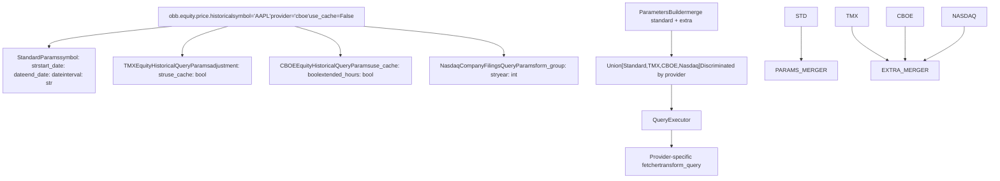

# Additional Providers

Relevant source files

-   [cli/poetry.lock](https://github.com/OpenBB-finance/OpenBB/blob/dddc3b32/cli/poetry.lock)
-   [openbb\_platform/core/openbb/assets/reference.json](https://github.com/OpenBB-finance/OpenBB/blob/dddc3b32/openbb_platform/core/openbb/assets/reference.json)
-   [openbb\_platform/core/openbb\_core/provider/standard\_models/company\_filings.py](https://github.com/OpenBB-finance/OpenBB/blob/dddc3b32/openbb_platform/core/openbb_core/provider/standard_models/company_filings.py)
-   [openbb\_platform/core/poetry.lock](https://github.com/OpenBB-finance/OpenBB/blob/dddc3b32/openbb_platform/core/poetry.lock)
-   [openbb\_platform/core/pyproject.toml](https://github.com/OpenBB-finance/OpenBB/blob/dddc3b32/openbb_platform/core/pyproject.toml)
-   [openbb\_platform/dev\_install.py](https://github.com/OpenBB-finance/OpenBB/blob/dddc3b32/openbb_platform/dev_install.py)
-   [openbb\_platform/extensions/devtools/poetry.lock](https://github.com/OpenBB-finance/OpenBB/blob/dddc3b32/openbb_platform/extensions/devtools/poetry.lock)
-   [openbb\_platform/extensions/devtools/pyproject.toml](https://github.com/OpenBB-finance/OpenBB/blob/dddc3b32/openbb_platform/extensions/devtools/pyproject.toml)
-   [openbb\_platform/extensions/equity/integration/test\_equity\_api.py](https://github.com/OpenBB-finance/OpenBB/blob/dddc3b32/openbb_platform/extensions/equity/integration/test_equity_api.py)
-   [openbb\_platform/extensions/equity/integration/test\_equity\_python.py](https://github.com/OpenBB-finance/OpenBB/blob/dddc3b32/openbb_platform/extensions/equity/integration/test_equity_python.py)
-   [openbb\_platform/extensions/equity/openbb\_equity/fundamental/fundamental\_router.py](https://github.com/OpenBB-finance/OpenBB/blob/dddc3b32/openbb_platform/extensions/equity/openbb_equity/fundamental/fundamental_router.py)
-   [openbb\_platform/extensions/etf/integration/test\_etf\_api.py](https://github.com/OpenBB-finance/OpenBB/blob/dddc3b32/openbb_platform/extensions/etf/integration/test_etf_api.py)
-   [openbb\_platform/extensions/etf/integration/test\_etf\_python.py](https://github.com/OpenBB-finance/OpenBB/blob/dddc3b32/openbb_platform/extensions/etf/integration/test_etf_python.py)
-   [openbb\_platform/poetry.lock](https://github.com/OpenBB-finance/OpenBB/blob/dddc3b32/openbb_platform/poetry.lock)
-   [openbb\_platform/providers/fmp/openbb\_fmp/\_\_init\_\_.py](https://github.com/OpenBB-finance/OpenBB/blob/dddc3b32/openbb_platform/providers/fmp/openbb_fmp/__init__.py)
-   [openbb\_platform/providers/fmp/openbb\_fmp/models/company\_filings.py](https://github.com/OpenBB-finance/OpenBB/blob/dddc3b32/openbb_platform/providers/fmp/openbb_fmp/models/company_filings.py)
-   [openbb\_platform/providers/fmp/pyproject.toml](https://github.com/OpenBB-finance/OpenBB/blob/dddc3b32/openbb_platform/providers/fmp/pyproject.toml)
-   [openbb\_platform/providers/fmp/tests/test\_fmp\_fetchers.py](https://github.com/OpenBB-finance/OpenBB/blob/dddc3b32/openbb_platform/providers/fmp/tests/test_fmp_fetchers.py)
-   [openbb\_platform/providers/intrinio/openbb\_intrinio/\_\_init\_\_.py](https://github.com/OpenBB-finance/OpenBB/blob/dddc3b32/openbb_platform/providers/intrinio/openbb_intrinio/__init__.py)
-   [openbb\_platform/providers/intrinio/openbb\_intrinio/models/company\_filings.py](https://github.com/OpenBB-finance/OpenBB/blob/dddc3b32/openbb_platform/providers/intrinio/openbb_intrinio/models/company_filings.py)
-   [openbb\_platform/providers/intrinio/tests/test\_intrinio\_fetchers.py](https://github.com/OpenBB-finance/OpenBB/blob/dddc3b32/openbb_platform/providers/intrinio/tests/test_intrinio_fetchers.py)
-   [openbb\_platform/providers/sec/openbb\_sec/\_\_init\_\_.py](https://github.com/OpenBB-finance/OpenBB/blob/dddc3b32/openbb_platform/providers/sec/openbb_sec/__init__.py)
-   [openbb\_platform/providers/sec/openbb\_sec/utils/form4.py](https://github.com/OpenBB-finance/OpenBB/blob/dddc3b32/openbb_platform/providers/sec/openbb_sec/utils/form4.py)
-   [openbb\_platform/providers/sec/tests/test\_sec\_fetchers.py](https://github.com/OpenBB-finance/OpenBB/blob/dddc3b32/openbb_platform/providers/sec/tests/test_sec_fetchers.py)
-   [openbb\_platform/providers/tmx/openbb\_tmx/models/company\_filings.py](https://github.com/OpenBB-finance/OpenBB/blob/dddc3b32/openbb_platform/providers/tmx/openbb_tmx/models/company_filings.py)
-   [openbb\_platform/providers/yfinance/poetry.lock](https://github.com/OpenBB-finance/OpenBB/blob/dddc3b32/openbb_platform/providers/yfinance/poetry.lock)
-   [openbb\_platform/pyproject.toml](https://github.com/OpenBB-finance/OpenBB/blob/dddc3b32/openbb_platform/pyproject.toml)

## Purpose and Scope

This page documents the additional and community-contributed data providers in the OpenBB Platform beyond the core economic and financial providers. These include market-specific providers (TMX, CBOE, Nasdaq), news aggregators (Biztoc, Finviz, Seeking Alpha), specialized data sources (Alpha Vantage, ECB, FINRA), and academic datasets (Fama-French).

For core financial providers like FMP, Intrinio, SEC, and YFinance, see [Financial Data Providers](/OpenBB-finance/OpenBB/4.3-financial-data-providers). For economic data providers like FRED and OECD, see [Economic Data Providers](/OpenBB-finance/OpenBB/4.2-economic-data-providers). For details on the provider architecture and integration mechanism, see [Provider Architecture](/OpenBB-finance/OpenBB/2.3-provider-architecture).

## Overview

Additional providers in the OpenBB Platform are classified as optional dependencies that extend the platform's capabilities with specialized data sources. Unlike core providers that are always installed, these are installed separately via Poetry extras or can be contributed by the community.

### Provider Classification

The platform distinguishes between core and optional providers through the Poetry dependency configuration:

**Core Providers** (always installed with base package):

-   `openbb-benzinga`, `openbb-bls`, `openbb-cftc`, `openbb-congress-gov`, `openbb-econdb`
-   `openbb-federal-reserve`, `openbb-fmp`, `openbb-fred`, `openbb-government-us`, `openbb-imf`
-   `openbb-intrinio`, `openbb-oecd`, `openbb-sec`, `openbb-tiingo`, `openbb-tradingeconomics`
-   `openbb-us-eia`, `openbb-yfinance`

**Optional Providers** (installed via extras):

-   Market data: `openbb-alpha-vantage`, `openbb-cboe`, `openbb-nasdaq`, `openbb-tmx`, `openbb-tradier`
-   News and analysis: `openbb-biztoc`, `openbb-seeking-alpha`, `openbb-stockgrid`, `openbb-wsj`
-   Specialized: `openbb-deribit`, `openbb-ecb`, `openbb-finra`, `openbb-finviz`, `openbb-multpl`
-   Academic: `openbb-famafrench`

Sources: [openbb\_platform/pyproject.toml16-32](https://github.com/OpenBB-finance/OpenBB/blob/dddc3b32/openbb_platform/pyproject.toml#L16-L32) [openbb\_platform/pyproject.toml47-61](https://github.com/OpenBB-finance/OpenBB/blob/dddc3b32/openbb_platform/pyproject.toml#L47-L61)

### Installation Methods

Optional providers are installed using Poetry extras syntax. Individual or multiple providers can be installed as needed:

```
# Install single providerpip install openbb[tmx] # Install multiple providerspip install openbb[tmx,cboe,nasdaq] # Install all optional providerspip install openbb[all]
```
The extras configuration maps provider names to their respective packages, enabling selective installation based on use case requirements.

Sources: [openbb\_platform/pyproject.toml69-113](https://github.com/OpenBB-finance/OpenBB/blob/dddc3b32/openbb_platform/pyproject.toml#L69-L113)

### Development Configuration

For local development, the `dev_install.py` script configures providers as editable path dependencies, allowing simultaneous development of multiple providers without publishing:

```
openbb-tmx = { path = "./providers/tmx", optional = true, develop = true }openbb-cboe = { path = "./providers/cboe", optional = true, develop = true }openbb-nasdaq = { path = "./providers/nasdaq", optional = true, develop = true }
```
This enables the development workflow where changes to provider code are immediately reflected without reinstallation.

Sources: [openbb\_platform/dev\_install.py59-61](https://github.com/OpenBB-finance/OpenBB/blob/dddc3b32/openbb_platform/dev_install.py#L59-L61)

## Provider Architecture Integration

All additional providers integrate with the OpenBB Platform through the same standardized architecture used by core providers. This diagram shows how optional providers register their implementations for standard models:

```mermaid
flowchart TD
    TMX["TMXProvideropenbb-tmx package"]
    CBOE["CBOEProvideropenbb-cboe package"]
    NASDAQ["NasdaqProvideropenbb-nasdaq package"]
    TRADIER["TradierProvideropenbb-tradier package"]
    FINVIZ["FinvizProvideropenbb-finviz package"]
    SEEKING["SeekingAlphaProvideropenbb-seeking-alpha package"]
    TMX_FILINGS["TMXCompanyFilingsFetcher"]
    TMX_HIST["TMXEquityHistoricalFetcher"]
    CBOE_HIST["CBOEEquityHistoricalFetcher"]
    CBOE_SEARCH["CBOEEquitySearchFetcher"]
    NASDAQ_FILINGS["NasdaqCompanyFilingsFetcher"]
    NASDAQ_CAL["NasdaqCalendarEarningsFetcher"]
    TRADIER_HIST["TradierEquityHistoricalFetcher"]
    FINVIZ_SCREEN["FinvizEquityScreenerFetcher"]
    SEEKING_CAL["SeekingAlphaCalendarEarningsFetcher"]
    PI["ProviderInterface"]
    FETCHER_MAP["fetcher_mapDict[str,Dict[str,Type]]"]
    PC["ProviderChoicesRuntime enum"]
    MODEL_FILINGS["CompanyFilings"]
    MODEL_HIST["EquityHistorical"]
    MODEL_SEARCH["EquitySearch"]
    MODEL_CAL["CalendarEarnings"]

    TMX --> TMX_FILINGS
    TMX --> TMX_HIST
    CBOE --> CBOE_HIST
    CBOE --> CBOE_SEARCH
    NASDAQ --> NASDAQ_FILINGS
    NASDAQ --> NASDAQ_CAL
    TRADIER --> TRADIER_HIST
    FINVIZ --> FINVIZ_SCREEN
    SEEKING --> SEEKING_CAL
    TMX --> FILINGS_MODEL_FILINGS
    TMX --> HIST_MODEL_HIST
    CBOE --> HIST_MODEL_HIST
    CBOE --> SEARCH_MODEL_SEARCH
    NASDAQ --> FILINGS_MODEL_FILINGS
    NASDAQ --> CAL_MODEL_CAL
    TRADIER --> HIST_MODEL_HIST
    SEEKING --> CAL_MODEL_CAL
    TMX --> FILINGS_FETCHER_MAP
    TMX --> HIST_FETCHER_MAP
    CBOE --> HIST_FETCHER_MAP
    CBOE --> SEARCH_FETCHER_MAP
    NASDAQ --> FILINGS_FETCHER_MAP
    NASDAQ --> CAL_FETCHER_MAP
    TRADIER --> HIST_FETCHER_MAP
    FINVIZ --> SCREEN_FETCHER_MAP
    SEEKING --> CAL_FETCHER_MAP
    FETCHER --> MAP_PI
    PI --> PC
```


Sources: [openbb\_platform/extensions/equity/integration/test\_equity\_python.py112](https://github.com/OpenBB-finance/OpenBB/blob/dddc3b32/openbb_platform/extensions/equity/integration/test_equity_python.py#L112-L112) [openbb\_platform/extensions/equity/integration/test\_equity\_python.py248](https://github.com/OpenBB-finance/OpenBB/blob/dddc3b32/openbb_platform/extensions/equity/integration/test_equity_python.py#L248-L248) [openbb\_platform/extensions/equity/integration/test\_equity\_python.py986](https://github.com/OpenBB-finance/OpenBB/blob/dddc3b32/openbb_platform/extensions/equity/integration/test_equity_python.py#L986-L986) [openbb\_platform/extensions/equity/integration/test\_equity\_python.py1289](https://github.com/OpenBB-finance/OpenBB/blob/dddc3b32/openbb_platform/extensions/equity/integration/test_equity_python.py#L1289-L1289)

## Market Data Providers

### TMX Provider

The TMX provider (`openbb-tmx`) delivers Canadian market data from the Toronto Stock Exchange and TSX Venture Exchange. It implements multiple standard models with Canada-specific features.

**Supported Standard Models:**

-   `EquitySearch` - Search Canadian securities
-   `EquityHistorical` - Historical price data
-   `EquityProfile` - Company profiles
-   `CompanyFilings` - SEDAR filings integration
-   `EtfSearch` - Canadian ETF search
-   `EtfHoldings` - ETF holdings data
-   `InsiderTrading` - Canadian insider transactions
-   `OptionsChains` - TSX options data
-   `CalendarEarnings` - Earnings calendar
-   `PriceTargetConsensus` - Analyst consensus

**Symbol Format:**

TMX uses a suffix notation for cross-listed securities to disambiguate between Canadian and US listings:

-   `"RY"` - Royal Bank of Canada on TSX
-   `"TD:US"` - TD Bank on US exchanges
-   `"AAPL:US"` - Apple on US exchanges (for historical data)

**Provider-Specific Parameters:**

The TMX provider exposes additional parameters through its query parameters:

```
# ETF search with TMX-specific filtersresult = obb.etf.search(    query="vanguard",    provider="tmx",    div_freq="quarterly",  # TMX-specific: filter by dividend frequency    sort_by="return_1y",   # TMX-specific: sort by 1-year return    use_cache=False) # Company filings from SEDARfilings = obb.equity.fundamental.filings(    symbol="RY",    provider="tmx",    start_date="2023-09-30",    end_date="2023-12-31")
```
Sources: [openbb\_platform/extensions/etf/integration/test\_etf\_python.py27-32](https://github.com/OpenBB-finance/OpenBB/blob/dddc3b32/openbb_platform/extensions/etf/integration/test_etf_python.py#L27-L32) [openbb\_platform/extensions/equity/integration/test\_equity\_python.py248](https://github.com/OpenBB-finance/OpenBB/blob/dddc3b32/openbb_platform/extensions/equity/integration/test_equity_python.py#L248-L248) [openbb\_platform/extensions/equity/integration/test\_equity\_python.py885-890](https://github.com/OpenBB-finance/OpenBB/blob/dddc3b32/openbb_platform/extensions/equity/integration/test_equity_python.py#L885-L890) [openbb\_platform/providers/tmx/openbb\_tmx/models/company\_filings.py1-15](https://github.com/OpenBB-finance/OpenBB/blob/dddc3b32/openbb_platform/providers/tmx/openbb_tmx/models/company_filings.py#L1-L15)

### CBOE Provider

The CBOE provider (`openbb-cboe`) provides real-time and historical data from the Chicago Board Options Exchange, with support for high-resolution intraday data.

**Supported Standard Models:**

-   `EquityHistorical` - Historical equity prices (1-minute to daily)
-   `EquitySearch` - Security search
-   `IndexConstituents` - Index membership data
-   `OptionsChains` - Options data
-   `MarketSnapshots` - Real-time snapshots

**Cache Control:**

CBOE implements a caching mechanism controlled by the `use_cache` parameter, useful for reducing API calls during development or when working with recent data:

```
# Disable caching for real-time dataresult = obb.equity.price.historical(    symbol="AAPL",    provider="cboe",    start_date="2024-01-01",    end_date="2024-01-02",    interval="1m",    use_cache=False)
```
**Intraday Resolution:**

CBOE supports high-resolution intraday intervals down to 1-minute granularity, making it suitable for algorithmic trading and backtesting applications.

Sources: [openbb\_platform/extensions/equity/integration/test\_equity\_python.py986-1003](https://github.com/OpenBB-finance/OpenBB/blob/dddc3b32/openbb_platform/extensions/equity/integration/test_equity_python.py#L986-L1003) [openbb\_platform/extensions/equity/integration/test\_equity\_python.py1289](https://github.com/OpenBB-finance/OpenBB/blob/dddc3b32/openbb_platform/extensions/equity/integration/test_equity_python.py#L1289-L1289)

### Nasdaq Provider

The Nasdaq provider (`openbb-nasdaq`) delivers Nasdaq exchange data including listings, calendar events, and corporate filings.

**Supported Standard Models:**

-   `CalendarDividend` - Dividend calendar
-   `CalendarEarnings` - Earnings announcements
-   `CalendarIpo` - IPO calendar
-   `CompanyFilings` - SEC filing metadata
-   `EquitySearch` - Security search
-   `TopRetail` - Most popular retail stocks

**Filing Query Capabilities:**

Nasdaq provides structured filing queries by form group and year, simplifying access to periodic reports:

```
# Query annual reports for specific yearfilings = obb.equity.fundamental.filings(    symbol="AAPL",    provider="nasdaq",    form_group="annual",  # Options: "annual", "quarterly", "proxies", etc.    year=2024)
```
The `form_group` parameter maps to common filing categories, eliminating the need to specify individual form types.

Sources: [openbb\_platform/extensions/equity/integration/test\_equity\_python.py80-81](https://github.com/OpenBB-finance/OpenBB/blob/dddc3b32/openbb_platform/extensions/equity/integration/test_equity_python.py#L80-L81) [openbb\_platform/extensions/equity/integration/test\_equity\_python.py123-124](https://github.com/OpenBB-finance/OpenBB/blob/dddc3b32/openbb_platform/extensions/equity/integration/test_equity_python.py#L123-L124) [openbb\_platform/extensions/equity/integration/test\_equity\_python.py893-898](https://github.com/OpenBB-finance/OpenBB/blob/dddc3b32/openbb_platform/extensions/equity/integration/test_equity_python.py#L893-L898)

### Tradier Provider

The Tradier provider (`openbb-tradier`) offers brokerage-grade market data through the Tradier API, including equities, options, and futures with extended hours support.

**Supported Standard Models:**

-   `EquityHistorical` - Historical prices with extended hours
-   `EquityQuote` - Real-time quotes
-   `EquitySearch` - Security search
-   `OptionsChains` - Options data
-   `OptionsUnusual` - Unusual options activity

**Extended Hours Trading:**

Tradier supports extended hours data, allowing analysis of pre-market and after-hours price action:

```
# Get intraday data with extended hoursresult = obb.equity.price.historical(    symbol="AAPL,MSFT",    provider="tradier",    start_date="2023-01-01",    end_date="2023-06-06",    interval="15m",    extended_hours=True  # Include pre and post-market data)
```
**Flexible Intervals:**

Tradier supports flexible interval formats including minutes (`"15m"`), months (`"1M"`), and various timeframes for different analysis needs.

Sources: [openbb\_platform/extensions/equity/integration/test\_equity\_python.py1094-1111](https://github.com/OpenBB-finance/OpenBB/blob/dddc3b32/openbb_platform/extensions/equity/integration/test_equity_python.py#L1094-L1111) [openbb\_platform/extensions/equity/integration/test\_equity\_python.py1292](https://github.com/OpenBB-finance/OpenBB/blob/dddc3b32/openbb_platform/extensions/equity/integration/test_equity_python.py#L1292-L1292)

### Alpha Vantage Provider

The Alpha Vantage provider (`openbb-alpha-vantage`) provides global equity data, technical indicators, and currency exchange rates.

**Supported Standard Models:**

-   `EquityHistorical` - Historical prices
-   `CurrencyHistorical` - FX rates
-   Technical indicators
-   Company fundamentals

**Adjustment Control:**

Alpha Vantage offers granular control over corporate action adjustments:

```
result = obb.equity.price.historical(    symbol="AAPL",    provider="alpha_vantage",    start_date="2023-01-01",    end_date="2023-06-06",    interval="15m",    adjustment="unadjusted",  # Options: "unadjusted", "splits_only", "splits_and_dividends"    extended_hours=True)
```
Sources: [openbb\_platform/extensions/equity/integration/test\_equity\_python.py975-982](https://github.com/OpenBB-finance/OpenBB/blob/dddc3b32/openbb_platform/extensions/equity/integration/test_equity_python.py#L975-L982)

## News and Analysis Providers

### Seeking Alpha Provider

The Seeking Alpha provider (`openbb-seeking-alpha`) delivers financial news, analysis, earnings calendar data, and analyst estimates.

**Supported Standard Models:**

-   `CalendarEarnings` - Earnings announcements with country filters
-   `ForwardEps` - Forward EPS estimates
-   `ForwardSales` - Forward revenue estimates
-   `PriceTargetConsensus` - Analyst price targets
-   `CompanyNews` - News and analysis articles

**Geographic Filtering:**

Seeking Alpha supports country-specific queries for earnings and estimates data:

```
# US earnings calendarus_earnings = obb.equity.calendar.earnings(    provider="seeking_alpha",    country="us") # Canadian company estimatescanadian_eps = obb.equity.estimates.forward_eps(    symbol="AAPL,BAM:CA",    period="annual",    provider="seeking_alpha")
```
The country code filtering enables region-specific analysis and reduces result noise when focusing on specific markets.

Sources: [openbb\_platform/extensions/equity/integration/test\_equity\_python.py115-120](https://github.com/OpenBB-finance/OpenBB/blob/dddc3b32/openbb_platform/extensions/equity/integration/test_equity_python.py#L115-L120) [openbb\_platform/extensions/equity/integration/test\_equity\_python.py676-681](https://github.com/OpenBB-finance/OpenBB/blob/dddc3b32/openbb_platform/extensions/equity/integration/test_equity_python.py#L676-L681) [openbb\_platform/extensions/equity/integration/test\_equity\_python.py716-721](https://github.com/OpenBB-finance/OpenBB/blob/dddc3b32/openbb_platform/extensions/equity/integration/test_equity_python.py#L716-L721)

### Finviz Provider

The Finviz provider (`openbb-finviz`) offers screening tools and visual market data analysis with support for comparative group analysis.

**Supported Standard Models:**

-   `EquityCompareGroups` - Comparative analysis by country, sector, industry
-   `EquityFundamentalMetrics` - Key metrics dashboard
-   `EquityScreener` - Stock screening
-   `PriceTarget` - Analyst price targets

**Group Comparison:**

Finviz enables comparative analysis across predefined market segments:

```
# Compare countries by valuation metricscountries = obb.equity.compare.groups(    group="country",    metric="overview",    provider="finviz") # Get fundamental metrics for multiple symbolsmetrics = obb.equity.fundamental.metrics(    symbol="AAPL,GOOG",    provider="finviz")
```
The group comparison functionality aggregates metrics across market segments, facilitating top-down analysis approaches.

Sources: [openbb\_platform/extensions/equity/integration/test\_equity\_python.py959](https://github.com/OpenBB-finance/OpenBB/blob/dddc3b32/openbb_platform/extensions/equity/integration/test_equity_python.py#L959-L959) [openbb\_platform/extensions/equity/integration/test\_equity\_python.py523](https://github.com/OpenBB-finance/OpenBB/blob/dddc3b32/openbb_platform/extensions/equity/integration/test_equity_python.py#L523-L523) [openbb\_platform/extensions/equity/integration/test\_equity\_python.py600](https://github.com/OpenBB-finance/OpenBB/blob/dddc3b32/openbb_platform/extensions/equity/integration/test_equity_python.py#L600-L600)

### Biztoc Provider

The Biztoc provider (`openbb-biztoc`) aggregates business and financial news from multiple sources with real-time updates.

**Supported Standard Models:**

-   `CompanyNews` - Company-specific news
-   `WorldNews` - General financial news
-   Trending topics

### WSJ Provider

The Wall Street Journal provider (`openbb-wsj`) provides WSJ financial news and market analysis.

**Supported Standard Models:**

-   `CompanyNews` - WSJ company coverage
-   Market insights
-   Economic commentary

### Stockgrid Provider

The Stockgrid provider (`openbb-stockgrid`) offers social sentiment and retail trading data.

**Supported Standard Models:**

-   Short interest data
-   Dark pool activity
-   Options flow
-   Retail sentiment indicators

Sources: [openbb\_platform/pyproject.toml56-61](https://github.com/OpenBB-finance/OpenBB/blob/dddc3b32/openbb_platform/pyproject.toml#L56-L61)

## Specialized Data Providers

### ECB Provider

The European Central Bank provider (`openbb-ecb`) supplies official ECB economic statistics and monetary policy data.

**Supported Standard Models:**

-   Interest rates (key ECB rates)
-   Exchange rates (EUR cross rates)
-   Monetary aggregates (M1, M2, M3)
-   Balance of payments

### FINRA Provider

The FINRA provider (`openbb-finra`) delivers regulatory data from the Financial Industry Regulatory Authority.

**Supported Standard Models:**

-   Short interest reporting
-   OTC trading statistics
-   Corporate bond data (TRACE)
-   Market transparency reports

### Deribit Provider

The Deribit provider (`openbb-deribit`) specializes in cryptocurrency derivatives data from the Deribit exchange.

**Supported Standard Models:**

-   Crypto options chains
-   Crypto futures data
-   Historical volatility
-   Greeks and implied volatility surfaces

Sources: [openbb\_platform/pyproject.toml50-52](https://github.com/OpenBB-finance/OpenBB/blob/dddc3b32/openbb_platform/pyproject.toml#L50-L52) [openbb\_platform/pyproject.toml53](https://github.com/OpenBB-finance/OpenBB/blob/dddc3b32/openbb_platform/pyproject.toml#L53-L53) [openbb\_platform/pyproject.toml74](https://github.com/OpenBB-finance/OpenBB/blob/dddc3b32/openbb_platform/pyproject.toml#L74-L74)

## Academic and Research Providers

### Fama-French Provider

The Fama-French provider (`openbb-famafrench`) provides access to the Kenneth French Data Library, widely used in academic finance research.

**Supported Standard Models:**

-   Factor returns (Mkt-RF, SMB, HML, RMW, CMA, UMD)
-   Portfolio sorts (size, value, profitability)
-   Industry portfolios (5, 10, 12, 17, 30, 38, 48, 49 industries)
-   Research datasets

**Use Case:**

The Fama-French factors are fundamental to asset pricing research and are commonly used for:

-   Multi-factor model construction
-   Portfolio performance attribution
-   Risk-adjusted return analysis
-   Academic empirical studies

### Multpl Provider

The Multpl provider (`openbb-multpl`) offers long-term historical market valuation metrics and economic indicators.

**Supported Standard Models:**

-   Shiller P/E ratio (CAPE ratio)
-   Market capitalization to GDP ratio
-   Historical dividend yields
-   Long-term market trends

**Data History:**

Multpl datasets typically extend back decades, enabling long-term trend analysis and historical context for current market valuations.

Sources: [openbb\_platform/pyproject.toml52](https://github.com/OpenBB-finance/OpenBB/blob/dddc3b32/openbb_platform/pyproject.toml#L52-L52) [openbb\_platform/pyproject.toml55](https://github.com/OpenBB-finance/OpenBB/blob/dddc3b32/openbb_platform/pyproject.toml#L55-L55)

## Provider-Specific Parameter Patterns

This diagram illustrates how provider-specific parameters flow through the parameter merging system:


Sources: [openbb\_platform/extensions/equity/integration/test\_equity\_python.py975-1122](https://github.com/OpenBB-finance/OpenBB/blob/dddc3b32/openbb_platform/extensions/equity/integration/test_equity_python.py#L975-L1122)

**Example Parameter Usage:**

```
# TMX-specific: dividend frequency filterobb.etf.search(    query="vanguard",    provider="tmx",    div_freq="quarterly",    sort_by="return_1y") # CBOE-specific: cache controlobb.equity.price.historical(    symbol="AAPL",    provider="cboe",    use_cache=False,    interval="1m") # Nasdaq-specific: form group and yearobb.equity.fundamental.filings(    symbol="AAPL",    provider="nasdaq",    form_group="annual",    year=2024) # Tradier-specific: extended hoursobb.equity.price.historical(    symbol="AAPL",    provider="tradier",    extended_hours=True) # Alpha Vantage-specific: adjustment modeobb.equity.price.historical(    symbol="AAPL",    provider="alpha_vantage",    adjustment="splits_only")
```
Sources: [openbb\_platform/extensions/etf/integration/test\_etf\_python.py27-32](https://github.com/OpenBB-finance/OpenBB/blob/dddc3b32/openbb_platform/extensions/etf/integration/test_etf_python.py#L27-L32) [openbb\_platform/extensions/equity/integration/test\_equity\_python.py986-1003](https://github.com/OpenBB-finance/OpenBB/blob/dddc3b32/openbb_platform/extensions/equity/integration/test_equity_python.py#L986-L1003) [openbb\_platform/extensions/equity/integration/test\_equity\_python.py893-898](https://github.com/OpenBB-finance/OpenBB/blob/dddc3b32/openbb_platform/extensions/equity/integration/test_equity_python.py#L893-L898)

## Provider Comparison Matrix

| Provider | Type | Geographic Focus | Update Frequency | Authentication | API Key Required |
| --- | --- | --- | --- | --- | --- |
| **TMX** | Market Data | Canada | Real-time | Optional | No |
| **CBOE** | Market Data | US Options | Real-time | Optional | No |
| **Nasdaq** | Market Data | US Equities | Daily | Optional | No |
| **Tradier** | Market Data | US Multi-asset | Real-time | Required | Yes |
| **Alpha Vantage** | Market Data | Global | 15-min delay | Required | Yes |
| **Seeking Alpha** | News/Analysis | Global | Daily | Optional | No |
| **Finviz** | Screening | US Equities | Daily | Optional | No |
| **Biztoc** | News Aggregation | Global | Real-time | Optional | No |
| **WSJ** | Premium News | Global | Real-time | Required | Yes |
| **Stockgrid** | Sentiment | US Equities | Real-time | Required | Yes |
| **ECB** | Economic Data | Eurozone | Daily/Monthly | None | No |
| **FINRA** | Regulatory | US Markets | Daily | None | No |
| **Deribit** | Crypto Derivatives | Global Crypto | Real-time | Required | Yes |
| **Fama-French** | Academic | US Factors | Monthly | None | No |
| **Multpl** | Historical | US Markets | Daily | None | No |

Sources: [openbb\_platform/pyproject.toml47-61](https://github.com/OpenBB-finance/OpenBB/blob/dddc3b32/openbb_platform/pyproject.toml#L47-L61)

## Configuration and Credentials

Additional providers requiring API credentials integrate with the OpenBB credential management system. Credentials are stored in user settings and accessed automatically during query execution.

**Credential Configuration:**

```
from openbb import obb # Set provider credentials programmaticallyobb.user.credentials.alpha_vantage_api_key = "your_api_key"obb.user.credentials.tradier_api_key = "your_api_key"obb.user.credentials.nasdaq_api_key = "your_api_key" # Credentials are automatically injected into provider requestsresult = obb.equity.price.historical(    symbol="AAPL",    provider="alpha_vantage")
```
**Credential Storage:**

Credentials can also be set via environment variables following the pattern `OPENBB_{PROVIDER}_{CREDENTIAL_TYPE}`:

```
export OPENBB_ALPHA_VANTAGE_API_KEY="your_key"export OPENBB_TRADIER_API_KEY="your_key"
```
The credential system maintains separation between providers while enabling unified configuration management.

Sources: [openbb\_platform/providers/intrinio/tests/test\_intrinio\_fetchers.py70-72](https://github.com/OpenBB-finance/OpenBB/blob/dddc3b32/openbb_platform/providers/intrinio/tests/test_intrinio_fetchers.py#L70-L72) [openbb\_platform/providers/fmp/tests/test\_fmp\_fetchers.py7-8](https://github.com/OpenBB-finance/OpenBB/blob/dddc3b32/openbb_platform/providers/fmp/tests/test_fmp_fetchers.py#L7-L8)

## Testing and Integration

Additional providers are tested using parameterized integration tests that verify implementation correctness across multiple providers for each standard model.

**Test Structure:**

```
@pytest.mark.parametrize(    "params",    [        ({"query": "AAPL", "is_symbol": True, "provider": "cboe", "use_cache": False}),        ({"query": "", "provider": "nasdaq", "is_etf": True}),        ({"query": "gold", "provider": "tmx", "use_cache": False}),        ({"query": "gold", "provider": "tradier", "is_symbol": False}),        ({"query": "gold", "provider": "intrinio", "active": True, "limit": 100}),    ],)@pytest.mark.integrationdef test_equity_search(params, obb):    """Test the equity search endpoint."""    result = obb.equity.search(**params)    assert result    assert isinstance(result, OBBject)    assert len(result.results) > 0
```
The parameterized approach ensures consistent behavior across providers while accommodating provider-specific parameters.

**VCR Cassettes:**

Integration tests use VCR (Video Cassette Recorder) to record HTTP interactions, enabling deterministic test execution without live API calls:

```
@pytest.fixture(scope="module")def vcr_config():    """VCR configuration."""    return {        "filter_headers": [("User-Agent", None)],        "filter_query_parameters": [None],    }
```
Sources: [openbb\_platform/extensions/equity/integration/test\_equity\_python.py1287-1311](https://github.com/OpenBB-finance/OpenBB/blob/dddc3b32/openbb_platform/extensions/equity/integration/test_equity_python.py#L1287-L1311) [openbb\_platform/providers/intrinio/tests/test\_intrinio\_fetchers.py75-82](https://github.com/OpenBB-finance/OpenBB/blob/dddc3b32/openbb_platform/providers/intrinio/tests/test_intrinio_fetchers.py#L75-L82)

## Contributing Additional Providers

Contributing a new additional provider involves implementing the provider interface and registering the provider through Python entry points.

**Provider Package Structure:**

```
openbb_platform/providers/{provider_name}/
├── openbb_{provider_name}/
│   ├── __init__.py                      # Provider registration
│   ├── utils/
│   │   └── helpers.py                   # Utility functions
│   └── models/
│       ├── model_one.py                 # Fetcher implementations
│       └── model_two.py
├── tests/
│   ├── test_{provider_name}_fetchers.py # Unit tests
│   └── record/                          # VCR cassettes
├── pyproject.toml                       # Package metadata
└── README.md                            # Provider documentation
```
**Provider Registration Example:**

```
# openbb_platform/providers/{provider_name}/openbb_{provider_name}/__init__.py from openbb_core.provider.abstract.provider import Providerfrom openbb_{provider_name}.models.equity_historical import (    {ProviderName}EquityHistoricalFetcher,)from openbb_{provider_name}.models.company_filings import (    {ProviderName}CompanyFilingsFetcher,) {provider_name}_provider = Provider(    name="{provider_name}",    website="https://www.{provider}.com",    description="Description of the provider",    credentials=["api_key"],  # Optional credentials    fetcher_dict={        "EquityHistorical": {ProviderName}EquityHistoricalFetcher,        "CompanyFilings": {ProviderName}CompanyFilingsFetcher,    },)
```
**Fetcher Implementation Pattern:**

Each fetcher must implement three methods following the three-stage pattern:

```
class {ProviderName}EquityHistoricalFetcher(    Fetcher[        {ProviderName}EquityHistoricalQueryParams,        List[{ProviderName}EquityHistoricalData],    ]):    """Fetcher for equity historical data."""     @staticmethod    def transform_query(params: Dict[str, Any]) -> {ProviderName}EquityHistoricalQueryParams:        """Transform and validate query parameters."""        # Validation logic        return {ProviderName}EquityHistoricalQueryParams(**params)     @staticmethod    async def aextract_data(        query: {ProviderName}EquityHistoricalQueryParams,        credentials: Optional[Dict[str, str]],        **kwargs: Any,    ) -> List[Dict]:        """Extract data from provider API."""        # API request logic        return raw_data     @staticmethod    def transform_data(        query: {ProviderName}EquityHistoricalQueryParams,        data: List[Dict],        **kwargs: Any,    ) -> List[{ProviderName}EquityHistoricalData]:        """Transform raw data to standard model format."""        # Data transformation logic        return [{ProviderName}EquityHistoricalData(**item) for item in data]
```
**Adding to pyproject.toml:**

Register the provider as an optional dependency:

```
[tool.poetry.dependencies]openbb-{provider-name} = { version = "^1.0.0", optional = true } [tool.poetry.extras]{provider_name} = ["openbb-{provider-name}"]all = [    # ... other providers    "openbb-{provider-name}",]
```
**Development Installation:**

Add path dependency to `dev_install.py`:

```
openbb-{provider-name} = { path = "./providers/{provider_name}", optional = true, develop = true }
```
Sources: [openbb\_platform/dev\_install.py57-71](https://github.com/OpenBB-finance/OpenBB/blob/dddc3b32/openbb_platform/dev_install.py#L57-L71) [openbb\_platform/providers/tmx/openbb\_tmx/models/company\_filings.py1-50](https://github.com/OpenBB-finance/OpenBB/blob/dddc3b32/openbb_platform/providers/tmx/openbb_tmx/models/company_filings.py#L1-L50) [openbb\_platform/providers/fmp/openbb\_fmp/\_\_init\_\_.py1-100](https://github.com/OpenBB-finance/OpenBB/blob/dddc3b32/openbb_platform/providers/fmp/openbb_fmp/__init__.py#L1-L100)

## Performance and Rate Limiting

Additional providers exhibit varying performance characteristics and rate limits based on their data sources and access tiers.

**Rate Limit Categories:**

| Category | Requests/Minute | Burst Capacity | Typical Providers |
| --- | --- | --- | --- |
| Free Tier | 5-25 | 5-10 | Alpha Vantage, public APIs |
| Basic Paid | 60-120 | 20-30 | Finviz, basic plans |
| Professional | 300-600 | 100-200 | Tradier, Seeking Alpha |
| Enterprise | 1000+ | 500+ | Premium subscriptions |
| Unlimited | No limit | No limit | FINRA, ECB, Fama-French |

**Caching Strategies:**

Providers implement varying caching approaches:

-   **Explicit cache control:** CBOE, TMX (`use_cache` parameter)
-   **TTL-based caching:** News providers (5-15 minute cache)
-   **Session caching:** Historical data (persistent across requests)
-   **No caching:** Real-time market data streams

**Data Latency:**

| Provider | Real-time | Delayed | EOD | Historical |
| --- | --- | --- | --- | --- |
| CBOE | ✓ (< 1s) | \- | ✓ | ✓ |
| Tradier | ✓ (< 1s) | \- | ✓ | ✓ |
| TMX | ✓ (< 15s) | \- | ✓ | ✓ |
| Nasdaq | \- | ✓ (15 min) | ✓ | ✓ |
| Alpha Vantage | \- | ✓ (15 min) | ✓ | ✓ |
| Seeking Alpha | \- | \- | ✓ | ✓ |
| Finviz | \- | \- | ✓ | ✓ |
| Fama-French | \- | \- | \- | ✓ (monthly) |

Sources: [openbb\_platform/extensions/equity/integration/test\_equity\_python.py986-1003](https://github.com/OpenBB-finance/OpenBB/blob/dddc3b32/openbb_platform/extensions/equity/integration/test_equity_python.py#L986-L1003) [openbb\_platform/extensions/etf/integration/test\_etf\_python.py27-32](https://github.com/OpenBB-finance/OpenBB/blob/dddc3b32/openbb_platform/extensions/etf/integration/test_etf_python.py#L27-L32)
