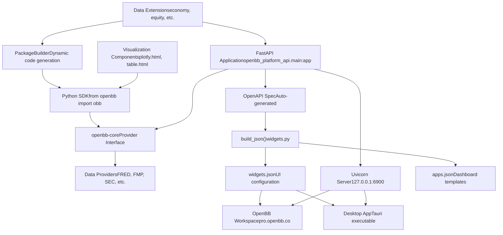
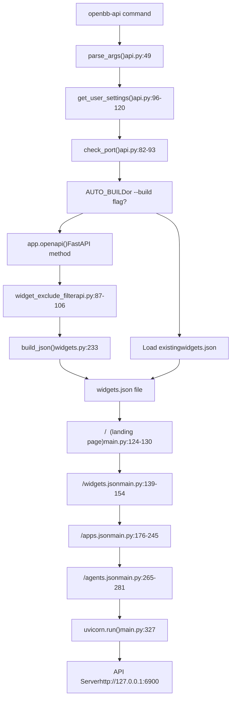
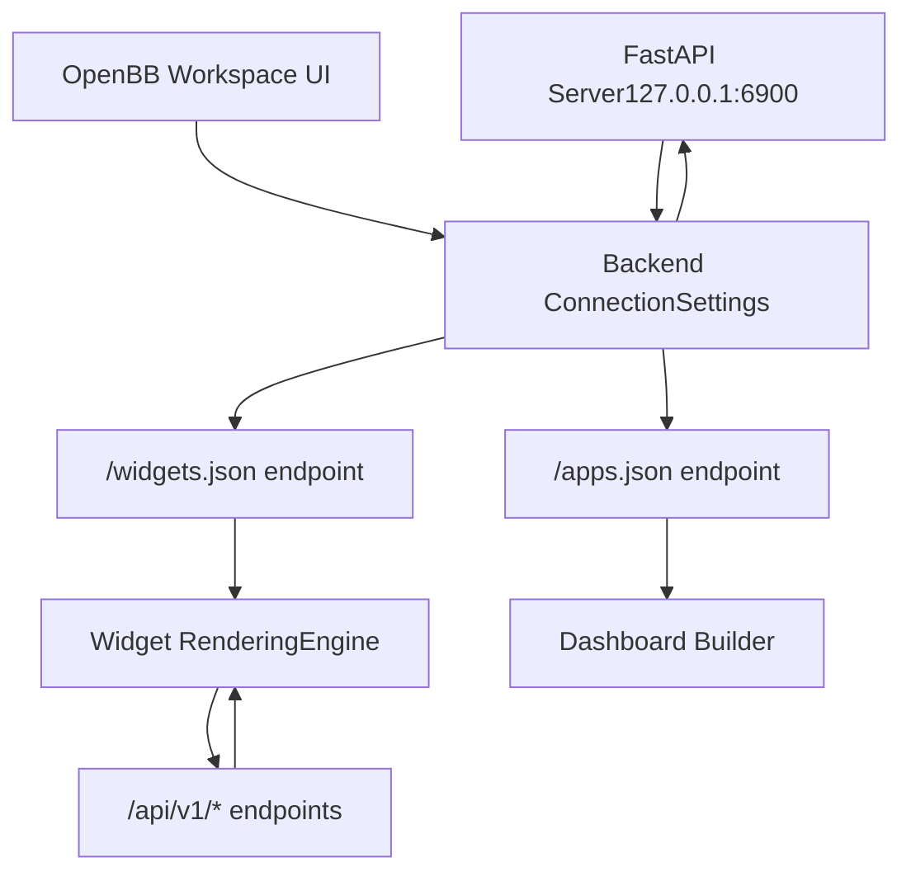
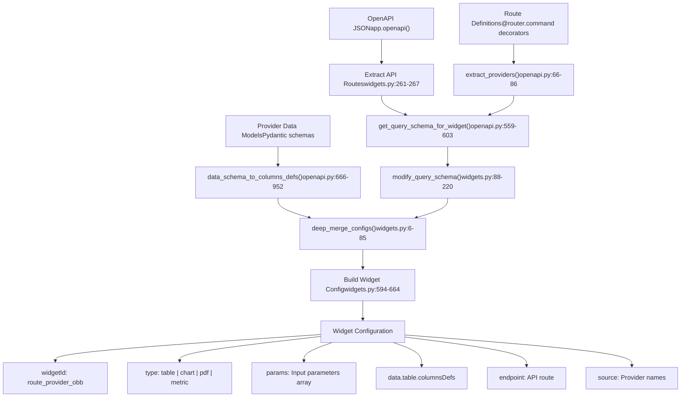
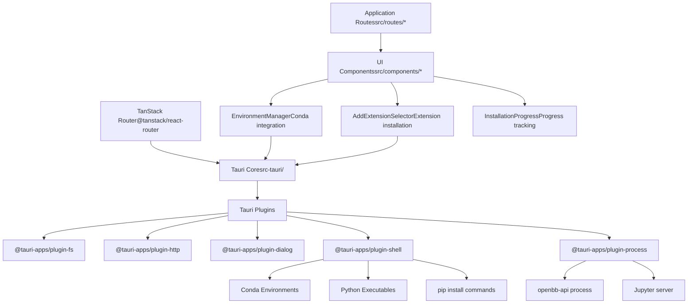
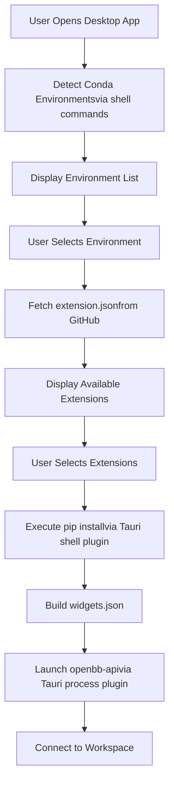
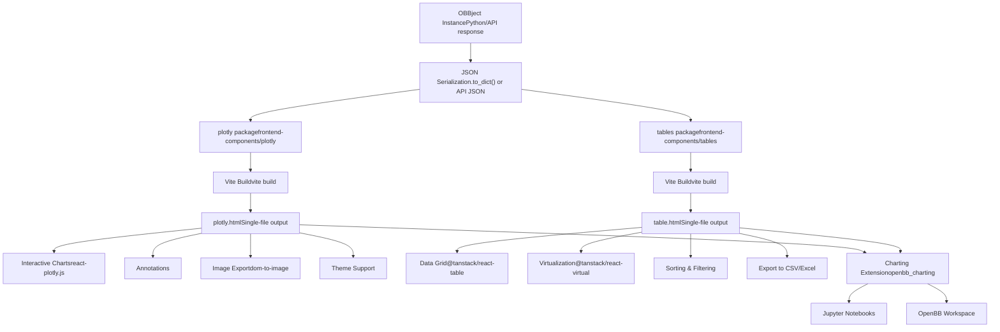
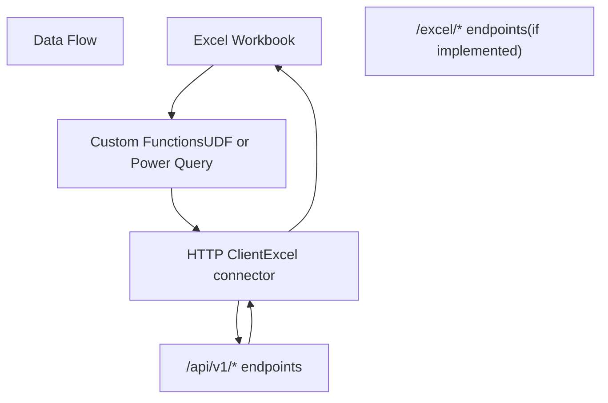

# User Interfaces

Relevant source files

-   [.codespell.skip](https://github.com/OpenBB-finance/OpenBB/blob/dddc3b32/.codespell.skip)
-   [.pre-commit-config.yaml](https://github.com/OpenBB-finance/OpenBB/blob/dddc3b32/.pre-commit-config.yaml)
-   [README.md](https://github.com/OpenBB-finance/OpenBB/blob/dddc3b32/README.md?plain=1)
-   [desktop/Cargo.lock](https://github.com/OpenBB-finance/OpenBB/blob/dddc3b32/desktop/Cargo.lock)
-   [desktop/package-lock.json](https://github.com/OpenBB-finance/OpenBB/blob/dddc3b32/desktop/package-lock.json)
-   [desktop/package.json](https://github.com/OpenBB-finance/OpenBB/blob/dddc3b32/desktop/package.json)
-   [desktop/src-tauri/Cargo.toml](https://github.com/OpenBB-finance/OpenBB/blob/dddc3b32/desktop/src-tauri/Cargo.toml)
-   [desktop/src-tauri/src/main.rs](https://github.com/OpenBB-finance/OpenBB/blob/dddc3b32/desktop/src-tauri/src/main.rs)
-   [desktop/src-tauri/src/tauri\_handlers/environments.rs](https://github.com/OpenBB-finance/OpenBB/blob/dddc3b32/desktop/src-tauri/src/tauri_handlers/environments.rs)
-   [desktop/src-tauri/src/tauri\_handlers/startup.rs](https://github.com/OpenBB-finance/OpenBB/blob/dddc3b32/desktop/src-tauri/src/tauri_handlers/startup.rs)
-   [desktop/src-tauri/tauri.conf.json](https://github.com/OpenBB-finance/OpenBB/blob/dddc3b32/desktop/src-tauri/tauri.conf.json)
-   [desktop/src/components/AddExtensionSelector.tsx](https://github.com/OpenBB-finance/OpenBB/blob/dddc3b32/desktop/src/components/AddExtensionSelector.tsx)
-   [desktop/src/components/InstallComponents.tsx](https://github.com/OpenBB-finance/OpenBB/blob/dddc3b32/desktop/src/components/InstallComponents.tsx)
-   [desktop/src/main.tsx](https://github.com/OpenBB-finance/OpenBB/blob/dddc3b32/desktop/src/main.tsx)
-   [desktop/src/routes/environments.tsx](https://github.com/OpenBB-finance/OpenBB/blob/dddc3b32/desktop/src/routes/environments.tsx)
-   [desktop/src/routes/installation-progress.tsx](https://github.com/OpenBB-finance/OpenBB/blob/dddc3b32/desktop/src/routes/installation-progress.tsx)
-   [desktop/src/tests/setup.ts](https://github.com/OpenBB-finance/OpenBB/blob/dddc3b32/desktop/src/tests/setup.ts)
-   [frontend-components/plotly/package-lock.json](https://github.com/OpenBB-finance/OpenBB/blob/dddc3b32/frontend-components/plotly/package-lock.json)
-   [frontend-components/plotly/package.json](https://github.com/OpenBB-finance/OpenBB/blob/dddc3b32/frontend-components/plotly/package.json)
-   [frontend-components/tables/package-lock.json](https://github.com/OpenBB-finance/OpenBB/blob/dddc3b32/frontend-components/tables/package-lock.json)
-   [frontend-components/tables/package.json](https://github.com/OpenBB-finance/OpenBB/blob/dddc3b32/frontend-components/tables/package.json)
-   [openbb\_platform/core/openbb\_core/provider/standard\_models/management\_discussion\_analysis.py](https://github.com/OpenBB-finance/OpenBB/blob/dddc3b32/openbb_platform/core/openbb_core/provider/standard_models/management_discussion_analysis.py)
-   [openbb\_platform/extensions/platform\_api/README.md](https://github.com/OpenBB-finance/OpenBB/blob/dddc3b32/openbb_platform/extensions/platform_api/README.md?plain=1)
-   [openbb\_platform/extensions/platform\_api/openbb\_platform\_api/main.py](https://github.com/OpenBB-finance/OpenBB/blob/dddc3b32/openbb_platform/extensions/platform_api/openbb_platform_api/main.py)
-   [openbb\_platform/extensions/platform\_api/openbb\_platform\_api/query\_models.py](https://github.com/OpenBB-finance/OpenBB/blob/dddc3b32/openbb_platform/extensions/platform_api/openbb_platform_api/query_models.py)
-   [openbb\_platform/extensions/platform\_api/openbb\_platform\_api/response\_models.py](https://github.com/OpenBB-finance/OpenBB/blob/dddc3b32/openbb_platform/extensions/platform_api/openbb_platform_api/response_models.py)
-   [openbb\_platform/extensions/platform\_api/openbb\_platform\_api/utils/api.py](https://github.com/OpenBB-finance/OpenBB/blob/dddc3b32/openbb_platform/extensions/platform_api/openbb_platform_api/utils/api.py)
-   [openbb\_platform/extensions/platform\_api/openbb\_platform\_api/utils/openapi.py](https://github.com/OpenBB-finance/OpenBB/blob/dddc3b32/openbb_platform/extensions/platform_api/openbb_platform_api/utils/openapi.py)
-   [openbb\_platform/extensions/platform\_api/openbb\_platform\_api/utils/widgets.py](https://github.com/OpenBB-finance/OpenBB/blob/dddc3b32/openbb_platform/extensions/platform_api/openbb_platform_api/utils/widgets.py)
-   [openbb\_platform/extensions/platform\_api/poetry.lock](https://github.com/OpenBB-finance/OpenBB/blob/dddc3b32/openbb_platform/extensions/platform_api/poetry.lock)
-   [openbb\_platform/extensions/platform\_api/pyproject.toml](https://github.com/OpenBB-finance/OpenBB/blob/dddc3b32/openbb_platform/extensions/platform_api/pyproject.toml)
-   [openbb\_platform/extensions/platform\_api/tests/mock\_openapi.json](https://github.com/OpenBB-finance/OpenBB/blob/dddc3b32/openbb_platform/extensions/platform_api/tests/mock_openapi.json)
-   [openbb\_platform/extensions/platform\_api/tests/mock\_widgets.json](https://github.com/OpenBB-finance/OpenBB/blob/dddc3b32/openbb_platform/extensions/platform_api/tests/mock_widgets.json)
-   [openbb\_platform/extensions/platform\_api/tests/test\_openapi\_utils.py](https://github.com/OpenBB-finance/OpenBB/blob/dddc3b32/openbb_platform/extensions/platform_api/tests/test_openapi_utils.py)
-   [openbb\_platform/extensions/platform\_api/tests/test\_widgets\_utils.py](https://github.com/OpenBB-finance/OpenBB/blob/dddc3b32/openbb_platform/extensions/platform_api/tests/test_widgets_utils.py)
-   [openbb\_platform/extensions/regulators/integration/test\_regulators\_api.py](https://github.com/OpenBB-finance/OpenBB/blob/dddc3b32/openbb_platform/extensions/regulators/integration/test_regulators_api.py)
-   [openbb\_platform/extensions/regulators/integration/test\_regulators\_python.py](https://github.com/OpenBB-finance/OpenBB/blob/dddc3b32/openbb_platform/extensions/regulators/integration/test_regulators_python.py)
-   [openbb\_platform/extensions/regulators/openbb\_regulators/cftc/cftc\_router.py](https://github.com/OpenBB-finance/OpenBB/blob/dddc3b32/openbb_platform/extensions/regulators/openbb_regulators/cftc/cftc_router.py)
-   [openbb\_platform/extensions/regulators/openbb\_regulators/sec/sec\_router.py](https://github.com/OpenBB-finance/OpenBB/blob/dddc3b32/openbb_platform/extensions/regulators/openbb_regulators/sec/sec_router.py)
-   [openbb\_platform/obbject\_extensions/charting/openbb\_charting/core/table.html](https://github.com/OpenBB-finance/OpenBB/blob/dddc3b32/openbb_platform/obbject_extensions/charting/openbb_charting/core/table.html)
-   [openbb\_platform/providers/nasdaq/tests/record/expected\_widgets.json](https://github.com/OpenBB-finance/OpenBB/blob/dddc3b32/openbb_platform/providers/nasdaq/tests/record/expected_widgets.json)
-   [openbb\_platform/providers/sec/openbb\_sec/models/management\_discussion\_analysis.py](https://github.com/OpenBB-finance/OpenBB/blob/dddc3b32/openbb_platform/providers/sec/openbb_sec/models/management_discussion_analysis.py)
-   [openbb\_platform/providers/sec/openbb\_sec/models/schema\_files.py](https://github.com/OpenBB-finance/OpenBB/blob/dddc3b32/openbb_platform/providers/sec/openbb_sec/models/schema_files.py)
-   [openbb\_platform/providers/sec/openbb\_sec/utils/html2markdown.py](https://github.com/OpenBB-finance/OpenBB/blob/dddc3b32/openbb_platform/providers/sec/openbb_sec/utils/html2markdown.py)
-   [openbb\_platform/providers/sec/openbb\_sec/utils/xbrl\_taxonomy\_helper.py](https://github.com/OpenBB-finance/OpenBB/blob/dddc3b32/openbb_platform/providers/sec/openbb_sec/utils/xbrl_taxonomy_helper.py)
-   [openbb\_platform/providers/sec/poetry.lock](https://github.com/OpenBB-finance/OpenBB/blob/dddc3b32/openbb_platform/providers/sec/poetry.lock)
-   [openbb\_platform/providers/sec/pyproject.toml](https://github.com/OpenBB-finance/OpenBB/blob/dddc3b32/openbb_platform/providers/sec/pyproject.toml)

## Purpose and Scope

This document describes the consumption surfaces and user interfaces for the OpenBB Platform. The OpenBB Platform follows a "connect once, consume everywhere" architecture, where data is integrated at the platform layer and exposed through multiple interfaces simultaneously. This page covers the technical architecture and implementation details of each interface.

For information about the core data integration and provider system, see [Core Architecture](/OpenBB-finance/OpenBB/2-core-architecture). For details about specific data extensions, see [Data Extensions](/OpenBB-finance/OpenBB/3-data-extensions).

## Overview of User Interfaces

The OpenBB Platform exposes data through five primary consumption surfaces:

| Interface | Technology | Entry Point | Primary Use Case |
| --- | --- | --- | --- |
| Python SDK | Python Package | `from openbb import obb` | Programmatic access for quants and data scientists |
| REST API | FastAPI + Uvicorn | `openbb-api` command | HTTP access for any application |
| OpenBB Workspace | Cloud Web UI | [https://pro.openbb.co](https://pro.openbb.co) | Enterprise analysts using browser-based dashboards |
| Desktop Application | Tauri (Rust + React) | Desktop executable | Local environment management and Jupyter integration |
| Visualization Components | React + Plotly/TanStack Table | Embedded HTML | Interactive charts and tables in notebooks and reports |

Additional integration points include Excel connectivity and MCP (Model Context Protocol) server capabilities for AI agents.

**Sources:** [README.md1-214](https://github.com/OpenBB-finance/OpenBB/blob/dddc3b32/README.md?plain=1#L1-L214) [openbb\_platform/extensions/platform\_api/README.md1-108](https://github.com/OpenBB-finance/OpenBB/blob/dddc3b32/openbb_platform/extensions/platform_api/README.md?plain=1#L1-L108)

## Interface Architecture and Data Flow

### High-Level Connection Pattern


**Sources:** [openbb\_platform/extensions/platform\_api/main.py1-340](https://github.com/OpenBB-finance/OpenBB/blob/dddc3b32/openbb_platform/extensions/platform_api/main.py#L1-L340) [openbb\_platform/extensions/platform\_api/utils/widgets.py233-741](https://github.com/OpenBB-finance/OpenBB/blob/dddc3b32/openbb_platform/extensions/platform_api/utils/widgets.py#L233-L741) [README.md40-96](https://github.com/OpenBB-finance/OpenBB/blob/dddc3b32/README.md?plain=1#L40-L96)

### API Server Startup and Widget Generation Flow


**Sources:** [openbb\_platform/extensions/platform\_api/main.py38-340](https://github.com/OpenBB-finance/OpenBB/blob/dddc3b32/openbb_platform/extensions/platform_api/main.py#L38-L340) [openbb\_platform/extensions/platform\_api/utils/api.py82-304](https://github.com/OpenBB-finance/OpenBB/blob/dddc3b32/openbb_platform/extensions/platform_api/utils/api.py#L82-L304) [openbb\_platform/extensions/platform\_api/utils/widgets.py233-741](https://github.com/OpenBB-finance/OpenBB/blob/dddc3b32/openbb_platform/extensions/platform_api/utils/widgets.py#L233-L741)

## Python SDK Interface

The Python SDK provides direct programmatic access to the OpenBB Platform. Users import the `obb` object and call methods that correspond to the router structure defined by extensions.

### Basic Usage Pattern

```
from openbb import obb # Call a command with provider selectionoutput = obb.equity.price.historical("AAPL", provider="fmp") # Access resultsdf = output.to_dataframe()chart = output.chartmetadata = output.extra
```
The SDK is dynamically generated by the `PackageBuilder` class, which scans installed extensions via entry points and generates Python module files at runtime or installation time.

### Package Structure

| Component | Location | Purpose |
| --- | --- | --- |
| Entry Point | `openbb/__init__.py` | Imports and exposes the `obb` object |
| Generated Modules | `openbb/package/*.py` | Dynamically generated router classes |
| OBBject Class | `openbb_core/app/model/obbject.py` | Standardized response wrapper |
| Command Runner | `openbb_core/app/command_runner.py` | Executes commands with validation |

**Sources:** [README.md28-36](https://github.com/OpenBB-finance/OpenBB/blob/dddc3b32/README.md?plain=1#L28-L36) Package structure inferred from architecture diagrams

## REST API Server

The REST API server is a FastAPI application launched via the `openbb-api` command. It exposes all platform functionality as HTTP endpoints with automatic OpenAPI documentation.

### Server Launch Configuration

The `openbb-api` command accepts arguments that configure both the launcher and Uvicorn:

```
# Basic launchopenbb-api # Custom host and portopenbb-api --host 0.0.0.0 --port 8080 # HTTPS with certificatesopenbb-api --ssl-keyfile localhost.key --ssl-certfile localhost.crt # Custom FastAPI appopenbb-api --app /path/to/custom_app.py --name my_app # Widget configurationopenbb-api --editable --widgets-json /path/to/widgets.json
```
### Key API Endpoints

| Endpoint | Method | Purpose | Implementation |
| --- | --- | --- | --- |
| `/` | GET | Landing page HTML | [openbb\_platform\_api/main.py124-130](https://github.com/OpenBB-finance/OpenBB/blob/dddc3b32/openbb_platform_api/main.py#L124-L130) |
| `/widgets.json` | GET | Widget configuration for UIs | [openbb\_platform\_api/main.py139-154](https://github.com/OpenBB-finance/OpenBB/blob/dddc3b32/openbb_platform_api/main.py#L139-L154) |
| `/apps.json` | GET | Dashboard templates | [openbb\_platform\_api/main.py176-245](https://github.com/OpenBB-finance/OpenBB/blob/dddc3b32/openbb_platform_api/main.py#L176-L245) |
| `/agents.json` | GET | AI agent configurations | [openbb\_platform\_api/main.py265-281](https://github.com/OpenBB-finance/OpenBB/blob/dddc3b32/openbb_platform_api/main.py#L265-L281) |
| `/api/v1/*` | GET/POST | Data endpoints (auto-generated) | Via FastAPI router registration |

### Environment Variables

| Variable | Default | Purpose |
| --- | --- | --- |
| `OPENBB_API_HOST` | 127.0.0.1 | API server host address |
| `OPENBB_API_PORT` | 6900 | API server port number |

**Sources:** [openbb\_platform/extensions/platform\_api/main.py1-340](https://github.com/OpenBB-finance/OpenBB/blob/dddc3b32/openbb_platform/extensions/platform_api/main.py#L1-L340) [openbb\_platform/extensions/platform\_api/README.md56-108](https://github.com/OpenBB-finance/OpenBB/blob/dddc3b32/openbb_platform/extensions/platform_api/README.md?plain=1#L56-L108) [openbb\_platform/extensions/platform\_api/utils/api.py16-79](https://github.com/OpenBB-finance/OpenBB/blob/dddc3b32/openbb_platform/extensions/platform_api/utils/api.py#L16-L79)

## OpenBB Workspace Integration

OpenBB Workspace is a cloud-based UI ([https://pro.openbb.co](https://pro.openbb.co)) that connects to a local API backend to maintain data sovereignty. The workspace renders widgets and dashboards using the `widgets.json` configuration file generated by the API server.

### Workspace Connection Flow


### Connection Setup Steps

As documented in [README.md82-96](https://github.com/OpenBB-finance/OpenBB/blob/dddc3b32/README.md?plain=1#L82-L96) users connect the workspace by:

1.  Starting the API server: `openbb-api`
2.  Opening OpenBB Workspace at [https://pro.openbb.co](https://pro.openbb.co)
3.  Navigating to "Apps" tab
4.  Clicking "Connect backend"
5.  Entering backend URL ([http://127.0.0.1:6900](http://127.0.0.1:6900))
6.  Testing connection
7.  Clicking "Add"

The workspace then fetches `widgets.json` to populate available data widgets and `apps.json` to load saved dashboard templates.

**Sources:** [README.md40-96](https://github.com/OpenBB-finance/OpenBB/blob/dddc3b32/README.md?plain=1#L40-L96) [openbb\_platform/extensions/platform\_api/README.md1-24](https://github.com/OpenBB-finance/OpenBB/blob/dddc3b32/openbb_platform/extensions/platform_api/README.md?plain=1#L1-L24)

## Widget System

The widget system transforms OpenAPI specifications into UI configurations that drive interactive components in OpenBB Workspace and the Desktop application.

### Widget Generation Pipeline


### Widget Configuration Structure

Each widget in `widgets.json` follows this structure:

| Field | Type | Purpose | Example |
| --- | --- | --- | --- |
| `widgetId` | string | Unique identifier | `"economy_survey_sloos_fred_obb"` |
| `name` | string | Display name | `"SLOOS"` |
| `type` | string | Widget type | `"table"`, `"chart"`, `"pdf"`, `"metric"`, `"form"`, `"omni"` |
| `endpoint` | string | API route | `"/api/v1/economy/survey/sloos"` |
| `params` | array | Input parameters with types and options | See parameter structure below |
| `data.table.columnsDefs` | array | Column definitions for table widgets | See column structure below |
| `source` | array | Provider names | `["FRED"]` |
| `category` | string | Menu category | `"Economy"` |
| `subCategory` | string | Menu subcategory | `"Survey"` |

### Parameter Configuration

Parameters are extracted from OpenAPI schema and processed per provider:

```
{  "paramName": "start_date",  "label": "Start Date",  "description": "Start date of the data, in YYYY-MM-DD format.",  "type": "date",           // text | number | date | boolean | endpoint  "value": null,            // default value  "optional": true,  "options": [              // for select inputs    {"label": "Option 1", "value": "opt1"}  ],  "multiSelect": false,  "show": true}
```
### Column Definition Structure

Column definitions are generated from response schemas:

```
{  "field": "date",  "headerName": "Date",  "headerTooltip": "The date of the data.",  "cellDataType": "date",   // date | number | text  "formatterFn": "none",    // none | int | percent | normalizedPercent  "renderFn": "greenRed",   // visual rendering function  "pinned": "left"          // left | right | undefined}
```
### Widget Type Mappings

| Type | Use Case | Data Source | Grid Size |
| --- | --- | --- | --- |
| `table` | Tabular data display | JSON array from API | 40x15 |
| `chart` | Time series visualization | JSON array with chart parameter | 40x20 |
| `pdf` | Document viewer | URL to PDF file | 20x25 |
| `metric` | Single value display | JSON object with single metric | 4x5 |
| `form` | User input collection | POST endpoint with form schema | Variable |
| `multi_file_viewer` | Multiple document viewer | Array of document URLs | 40x15 |
| `omni` | Custom composite widget | Multiple endpoints | Variable |

**Sources:** [openbb\_platform/extensions/platform\_api/utils/widgets.py1-741](https://github.com/OpenBB-finance/OpenBB/blob/dddc3b32/openbb_platform/extensions/platform_api/utils/widgets.py#L1-L741) [openbb\_platform/extensions/platform\_api/utils/openapi.py1-1279](https://github.com/OpenBB-finance/OpenBB/blob/dddc3b32/openbb_platform/extensions/platform_api/utils/openapi.py#L1-L1279) [openbb\_platform/extensions/platform\_api/tests/mock\_widgets.json1-554](https://github.com/OpenBB-finance/OpenBB/blob/dddc3b32/openbb_platform/extensions/platform_api/tests/mock_widgets.json#L1-L554)

## Desktop Application

The Desktop Application is built with Tauri, combining a Rust backend with a React frontend. It provides environment management, extension installation, and Jupyter server integration.

### Desktop Architecture


### Core Desktop Components

| Component | File | Purpose |
| --- | --- | --- |
| Main Entry | [desktop/src/main.tsx](https://github.com/OpenBB-finance/OpenBB/blob/dddc3b32/desktop/src/main.tsx) | Application bootstrap |
| Environment Manager | [desktop/src/components/EnvironmentManager.tsx](https://github.com/OpenBB-finance/OpenBB/blob/dddc3b32/desktop/src/components/EnvironmentManager.tsx) | Conda environment selection and creation |
| Extension Selector | [desktop/src/components/AddExtensionSelector.tsx1-1000](https://github.com/OpenBB-finance/OpenBB/blob/dddc3b32/desktop/src/components/AddExtensionSelector.tsx#L1-L1000) | Browse and install OpenBB extensions |
| Install Progress | [desktop/src/routes/installation-progress.tsx1-1500](https://github.com/OpenBB-finance/OpenBB/blob/dddc3b32/desktop/src/routes/installation-progress.tsx#L1-L1500) | Track package installation progress |
| Backend Config | [desktop/src/routes/backend.tsx](https://github.com/OpenBB-finance/OpenBB/blob/dddc3b32/desktop/src/routes/backend.tsx) | API server configuration |

### Desktop Technology Stack

| Layer | Technology | Configuration |
| --- | --- | --- |
| Frontend Framework | React 18 | [desktop/package.json31-32](https://github.com/OpenBB-finance/OpenBB/blob/dddc3b32/desktop/package.json#L31-L32) |
| UI Library | @openbb/ui-pro | [desktop/package.json19](https://github.com/OpenBB-finance/OpenBB/blob/dddc3b32/desktop/package.json#L19-L19) |
| Routing | TanStack Router | [desktop/package.json20-22](https://github.com/OpenBB-finance/OpenBB/blob/dddc3b32/desktop/package.json#L20-L22) |
| Backend Runtime | Tauri 2.9 | [desktop/src-tauri/Cargo.toml1-100](https://github.com/OpenBB-finance/OpenBB/blob/dddc3b32/desktop/src-tauri/Cargo.toml#L1-L100) |
| Backend Language | Rust | [desktop/src-tauri/Cargo.toml](https://github.com/OpenBB-finance/OpenBB/blob/dddc3b32/desktop/src-tauri/Cargo.toml) |
| Build Tool | Vite 7 | [desktop/package.json64](https://github.com/OpenBB-finance/OpenBB/blob/dddc3b32/desktop/package.json#L64-L64) |
| TypeScript | 5.9.2 | [desktop/package.json62](https://github.com/OpenBB-finance/OpenBB/blob/dddc3b32/desktop/package.json#L62-L62) |

### Environment Management Workflow


**Sources:** [desktop/package.json1-78](https://github.com/OpenBB-finance/OpenBB/blob/dddc3b32/desktop/package.json#L1-L78) [desktop/src-tauri/Cargo.toml1-100](https://github.com/OpenBB-finance/OpenBB/blob/dddc3b32/desktop/src-tauri/Cargo.toml#L1-L100) [desktop/src/components/AddExtensionSelector.tsx1-1000](https://github.com/OpenBB-finance/OpenBB/blob/dddc3b32/desktop/src/components/AddExtensionSelector.tsx#L1-L1000) [desktop/src/routes/installation-progress.tsx1-1500](https://github.com/OpenBB-finance/OpenBB/blob/dddc3b32/desktop/src/routes/installation-progress.tsx#L1-L1500)

## Visualization Components

The platform includes standalone React components for rendering interactive charts and tables. These components are compiled to single HTML files and embedded in notebooks or served as standalone pages.

### Plotly Component

The Plotly component renders interactive charts using Plotly.js:

| Aspect | Details |
| --- | --- |
| Package | [frontend-components/plotly/package.json1-48](https://github.com/OpenBB-finance/OpenBB/blob/dddc3b32/frontend-components/plotly/package.json#L1-L48) |
| Framework | React 18 + plotly.js-dist-min |
| Build Output | `plotly.html` |
| Deployment Target | [openbb\_platform/obbject\_extensions/charting/openbb\_charting/core/plotly.html](https://github.com/OpenBB-finance/OpenBB/blob/dddc3b32/openbb_platform/obbject_extensions/charting/openbb_charting/core/plotly.html) |
| Key Dependencies | react-plotly.js, plotly.js-dist-min, dom-to-image |

### Table Component

The Table component provides advanced data grid functionality:

| Aspect | Details |
| --- | --- |
| Package | [frontend-components/tables/package.json1-59](https://github.com/OpenBB-finance/OpenBB/blob/dddc3b32/frontend-components/tables/package.json#L1-L59) |
| Framework | React 18 + TanStack Table |
| Build Output | `table.html` |
| Deployment Target | [openbb\_platform/obbject\_extensions/charting/openbb\_charting/core/table.html1-1000](https://github.com/OpenBB-finance/OpenBB/blob/dddc3b32/openbb_platform/obbject_extensions/charting/openbb_charting/core/table.html#L1-L1000) |
| Key Dependencies | @tanstack/react-table, react-virtual, plotly.js |

### Component Architecture


### Build and Deploy Process

Both components use a similar build process:

```
# Build Plotly componentcd frontend-components/plotlynpm run build # Deploy to charting extensionnpm run deploy# This moves dist/index.html to openbb_charting/core/plotly.html # Build Table componentcd frontend-components/tablesnpm run build # Deploy to charting extensionnpm run deploy# This moves dist/index.html to openbb_charting/core/table.html
```
The `vite-plugin-singlefile` plugin bundles all assets (JS, CSS) into a single HTML file for easy distribution and embedding.

**Sources:** [frontend-components/plotly/package.json1-48](https://github.com/OpenBB-finance/OpenBB/blob/dddc3b32/frontend-components/plotly/package.json#L1-L48) [frontend-components/tables/package.json1-59](https://github.com/OpenBB-finance/OpenBB/blob/dddc3b32/frontend-components/tables/package.json#L1-L59) [openbb\_platform/obbject\_extensions/charting/openbb\_charting/core/table.html1-100](https://github.com/OpenBB-finance/OpenBB/blob/dddc3b32/openbb_platform/obbject_extensions/charting/openbb_charting/core/table.html#L1-L100)

## Excel Integration

Excel integration is provided through the REST API, allowing users to call OpenBB functions directly from Excel spreadsheets. The implementation details are referenced in the codebase but the primary mechanism is HTTP requests from Excel to the local API server.

### Excel Connection Pattern


Users configure the API connection in Excel and then use custom functions or Power Query to fetch data from OpenBB endpoints. The data is returned as JSON and parsed into Excel ranges.

**Sources:** Architecture diagram reference to Excel integration

## Summary of Interface Capabilities

| Interface | Data Access | Visualization | Environment Management | Offline Support | Primary Audience |
| --- | --- | --- | --- | --- | --- |
| Python SDK | Full | Via charting extension | N/A | Yes (cached) | Developers, Quants |
| REST API | Full | JSON only | N/A | No | Any HTTP client |
| OpenBB Workspace | Full | Advanced dashboards | No | No | Business analysts |
| Desktop App | Full | Via Workspace connection | Yes (Conda) | Partial | Power users |
| Visualization Components | Limited (passed data) | Charts and tables | N/A | Yes (embedded HTML) | Report consumers |
| Excel | Full | Excel native charts | No | No | Financial analysts |

Each interface is designed for specific use cases while maintaining consistent access to the underlying data platform. The widget system ensures that OpenBB Workspace and the Desktop application automatically reflect changes to available data sources and parameters as extensions are added or removed.

**Sources:** Overall system architecture and feature comparison based on [README.md1-214](https://github.com/OpenBB-finance/OpenBB/blob/dddc3b32/README.md?plain=1#L1-L214) [openbb\_platform/extensions/platform\_api/README.md1-108](https://github.com/OpenBB-finance/OpenBB/blob/dddc3b32/openbb_platform/extensions/platform_api/README.md?plain=1#L1-L108)
