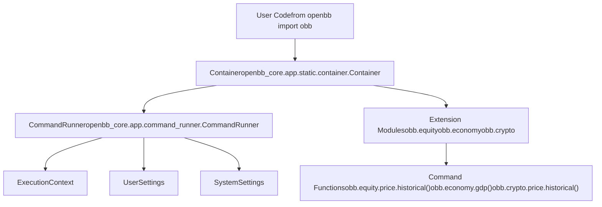
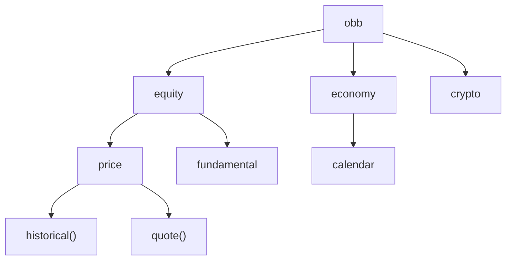
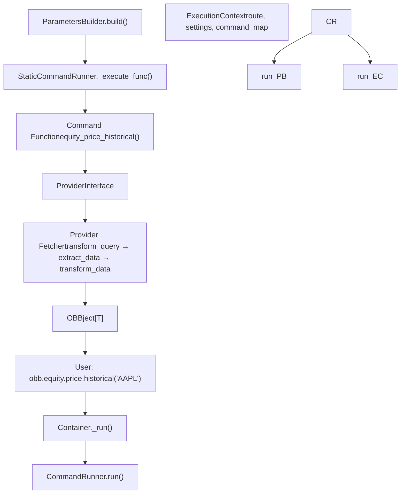
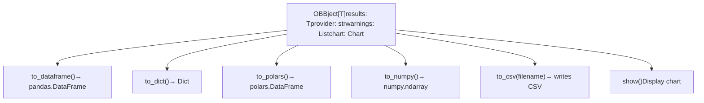
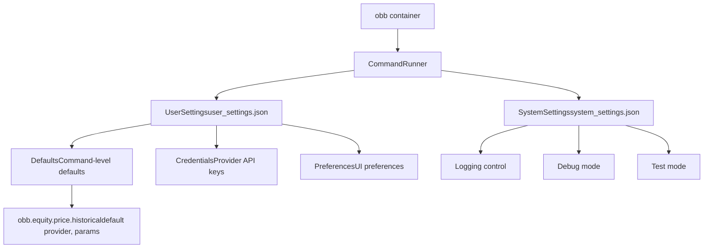
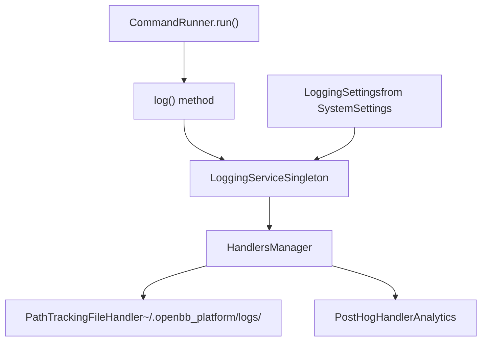
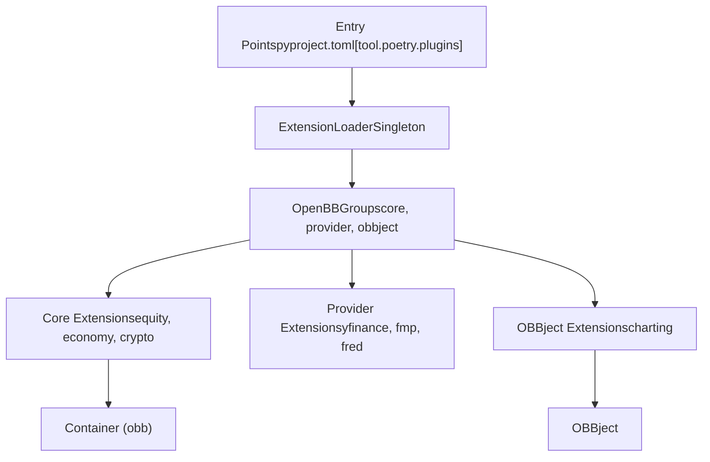
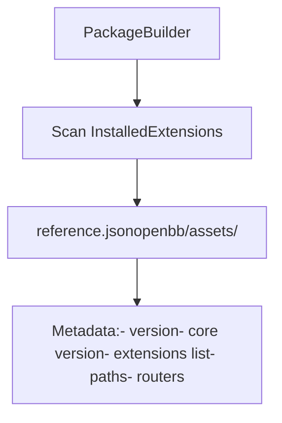

# Python SDK

Relevant source files

-   [.pre-commit-config.yaml](https://github.com/OpenBB-finance/OpenBB/blob/dddc3b32/.pre-commit-config.yaml)
-   [README.md](https://github.com/OpenBB-finance/OpenBB/blob/dddc3b32/README.md?plain=1)
-   [cli/poetry.lock](https://github.com/OpenBB-finance/OpenBB/blob/dddc3b32/cli/poetry.lock)
-   [frontend-components/plotly/src/data/mockup.ts](https://github.com/OpenBB-finance/OpenBB/blob/dddc3b32/frontend-components/plotly/src/data/mockup.ts)
-   [openbb\_platform/core/openbb/assets/reference.json](https://github.com/OpenBB-finance/OpenBB/blob/dddc3b32/openbb_platform/core/openbb/assets/reference.json)
-   [openbb\_platform/core/openbb\_core/api/router/commands.py](https://github.com/OpenBB-finance/OpenBB/blob/dddc3b32/openbb_platform/core/openbb_core/api/router/commands.py)
-   [openbb\_platform/core/openbb\_core/app/command\_runner.py](https://github.com/OpenBB-finance/OpenBB/blob/dddc3b32/openbb_platform/core/openbb_core/app/command_runner.py)
-   [openbb\_platform/core/openbb\_core/app/extension\_loader.py](https://github.com/OpenBB-finance/OpenBB/blob/dddc3b32/openbb_platform/core/openbb_core/app/extension_loader.py)
-   [openbb\_platform/core/openbb\_core/app/logs/handlers\_manager.py](https://github.com/OpenBB-finance/OpenBB/blob/dddc3b32/openbb_platform/core/openbb_core/app/logs/handlers_manager.py)
-   [openbb\_platform/core/openbb\_core/app/logs/logging\_service.py](https://github.com/OpenBB-finance/OpenBB/blob/dddc3b32/openbb_platform/core/openbb_core/app/logs/logging_service.py)
-   [openbb\_platform/core/openbb\_core/app/logs/models/logging\_settings.py](https://github.com/OpenBB-finance/OpenBB/blob/dddc3b32/openbb_platform/core/openbb_core/app/logs/models/logging_settings.py)
-   [openbb\_platform/core/openbb\_core/app/model/abstract/tagged.py](https://github.com/OpenBB-finance/OpenBB/blob/dddc3b32/openbb_platform/core/openbb_core/app/model/abstract/tagged.py)
-   [openbb\_platform/core/openbb\_core/app/model/charts/charting\_settings.py](https://github.com/OpenBB-finance/OpenBB/blob/dddc3b32/openbb_platform/core/openbb_core/app/model/charts/charting_settings.py)
-   [openbb\_platform/core/openbb\_core/app/model/defaults.py](https://github.com/OpenBB-finance/OpenBB/blob/dddc3b32/openbb_platform/core/openbb_core/app/model/defaults.py)
-   [openbb\_platform/core/openbb\_core/app/model/extension.py](https://github.com/OpenBB-finance/OpenBB/blob/dddc3b32/openbb_platform/core/openbb_core/app/model/extension.py)
-   [openbb\_platform/core/openbb\_core/app/model/obbject.py](https://github.com/OpenBB-finance/OpenBB/blob/dddc3b32/openbb_platform/core/openbb_core/app/model/obbject.py)
-   [openbb\_platform/core/openbb\_core/app/model/system\_settings.py](https://github.com/OpenBB-finance/OpenBB/blob/dddc3b32/openbb_platform/core/openbb_core/app/model/system_settings.py)
-   [openbb\_platform/core/openbb\_core/app/service/system\_service.py](https://github.com/OpenBB-finance/OpenBB/blob/dddc3b32/openbb_platform/core/openbb_core/app/service/system_service.py)
-   [openbb\_platform/core/openbb\_core/app/static/container.py](https://github.com/OpenBB-finance/OpenBB/blob/dddc3b32/openbb_platform/core/openbb_core/app/static/container.py)
-   [openbb\_platform/core/openbb\_core/env.py](https://github.com/OpenBB-finance/OpenBB/blob/dddc3b32/openbb_platform/core/openbb_core/env.py)
-   [openbb\_platform/core/poetry.lock](https://github.com/OpenBB-finance/OpenBB/blob/dddc3b32/openbb_platform/core/poetry.lock)
-   [openbb\_platform/core/pyproject.toml](https://github.com/OpenBB-finance/OpenBB/blob/dddc3b32/openbb_platform/core/pyproject.toml)
-   [openbb\_platform/core/tests/app/logs/test\_handlers\_manager.py](https://github.com/OpenBB-finance/OpenBB/blob/dddc3b32/openbb_platform/core/tests/app/logs/test_handlers_manager.py)
-   [openbb\_platform/core/tests/app/logs/test\_logging\_service.py](https://github.com/OpenBB-finance/OpenBB/blob/dddc3b32/openbb_platform/core/tests/app/logs/test_logging_service.py)
-   [openbb\_platform/core/tests/app/model/test\_extension.py](https://github.com/OpenBB-finance/OpenBB/blob/dddc3b32/openbb_platform/core/tests/app/model/test_extension.py)
-   [openbb\_platform/core/tests/app/model/test\_obbject.py](https://github.com/OpenBB-finance/OpenBB/blob/dddc3b32/openbb_platform/core/tests/app/model/test_obbject.py)
-   [openbb\_platform/core/tests/app/model/test\_system\_settings.py](https://github.com/OpenBB-finance/OpenBB/blob/dddc3b32/openbb_platform/core/tests/app/model/test_system_settings.py)
-   [openbb\_platform/core/tests/app/test\_command\_runner.py](https://github.com/OpenBB-finance/OpenBB/blob/dddc3b32/openbb_platform/core/tests/app/test_command_runner.py)
-   [openbb\_platform/dev\_install.py](https://github.com/OpenBB-finance/OpenBB/blob/dddc3b32/openbb_platform/dev_install.py)
-   [openbb\_platform/extensions/devtools/poetry.lock](https://github.com/OpenBB-finance/OpenBB/blob/dddc3b32/openbb_platform/extensions/devtools/poetry.lock)
-   [openbb\_platform/extensions/devtools/pyproject.toml](https://github.com/OpenBB-finance/OpenBB/blob/dddc3b32/openbb_platform/extensions/devtools/pyproject.toml)
-   [openbb\_platform/obbject\_extensions/charting/openbb\_charting/charts/helpers.py](https://github.com/OpenBB-finance/OpenBB/blob/dddc3b32/openbb_platform/obbject_extensions/charting/openbb_charting/charts/helpers.py)
-   [openbb\_platform/poetry.lock](https://github.com/OpenBB-finance/OpenBB/blob/dddc3b32/openbb_platform/poetry.lock)
-   [openbb\_platform/providers/yfinance/poetry.lock](https://github.com/OpenBB-finance/OpenBB/blob/dddc3b32/openbb_platform/providers/yfinance/poetry.lock)
-   [openbb\_platform/pyproject.toml](https://github.com/OpenBB-finance/OpenBB/blob/dddc3b32/openbb_platform/pyproject.toml)

The Python SDK is the primary programmatic interface to the OpenBB Platform. It provides a Pythonic API for accessing financial data, analytics, and visualizations through the `obb` object. This document covers installation, usage patterns, command execution, and result handling in the Python environment.

For information about the REST API server, see [REST API Server](/OpenBB-finance/OpenBB/5.2-rest-api-server). For details on the underlying command execution pipeline, see [Command Execution Pipeline](/OpenBB-finance/OpenBB/2.1-command-execution-pipeline). For provider configuration, see [Provider Architecture](/OpenBB-finance/OpenBB/2.3-provider-architecture).

---

## Installation and Import

The OpenBB Python SDK is distributed as the `openbb` package on PyPI. Installation includes the core platform and default extensions.

**Basic Installation**

```
pip install openbb
```
**Installation with Optional Extensions**

```
pip install openbb[all]  # All extensionspip install openbb[charting]  # Charting extension onlypip install openbb[technical,quantitative]  # Multiple extensions
```
**Import and Initialization**

```
from openbb import obb # The obb object is immediately availableresult = obb.equity.price.historical("AAPL")
```
The `openbb` package structure is defined in [openbb\_platform/pyproject.toml1-118](https://github.com/OpenBB-finance/OpenBB/blob/dddc3b32/openbb_platform/pyproject.toml#L1-L118) with core dependencies listed in [openbb\_platform/core/pyproject.toml1-36](https://github.com/OpenBB-finance/OpenBB/blob/dddc3b32/openbb_platform/core/pyproject.toml#L1-L36) The package includes `openbb-core`, `openbb-platform-api`, and domain extensions (equity, economy, crypto, etc.) along with data providers (yfinance, fred, fmp, etc.).

**Sources:** [README.md28-34](https://github.com/OpenBB-finance/OpenBB/blob/dddc3b32/README.md?plain=1#L28-L34) [openbb\_platform/pyproject.toml1-118](https://github.com/OpenBB-finance/OpenBB/blob/dddc3b32/openbb_platform/pyproject.toml#L1-L118) [openbb\_platform/core/pyproject.toml1-36](https://github.com/OpenBB-finance/OpenBB/blob/dddc3b32/openbb_platform/core/pyproject.toml#L1-L36)

---

## The `obb` Container Object


**Diagram: The obb Container Object Structure**

The `obb` object is an instance of the `Container` class that serves as the entry point to the OpenBB Platform. It wraps a `CommandRunner` instance and dynamically exposes extension modules.

**Container Initialization**

The `Container` class is defined in [openbb\_platform/core/openbb\_core/app/static/container.py11-24](https://github.com/OpenBB-finance/OpenBB/blob/dddc3b32/openbb_platform/core/openbb_core/app/static/container.py#L11-L24) On initialization:

1.  It receives a `CommandRunner` instance
2.  Sets `OBBject._user_settings` and `OBBject._system_settings` as class variables
3.  Dynamically loads extension modules via the PackageBuilder

**Key Attributes**

| Attribute | Type | Purpose |
| --- | --- | --- |
| `_command_runner` | `CommandRunner` | Manages command execution lifecycle |
| Extension attributes | Module | Dynamically loaded (e.g., `obb.equity`, `obb.economy`) |

The container exposes a `_run()` method [openbb\_platform/core/openbb\_core/app/static/container.py23-24](https://github.com/OpenBB-finance/OpenBB/blob/dddc3b32/openbb_platform/core/openbb_core/app/static/container.py#L23-L24) that delegates to the `CommandRunner` for actual command execution.

**Sources:** [openbb\_platform/core/openbb\_core/app/static/container.py1-24](https://github.com/OpenBB-finance/OpenBB/blob/dddc3b32/openbb_platform/core/openbb_core/app/static/container.py#L1-L24)

---

## Command Structure and Organization

Commands in the Python SDK are organized hierarchically by domain and function. The structure is dynamically generated by the PackageBuilder from installed extensions.


**Diagram: Command Hierarchy Example**

**Command Path Pattern**

Commands follow the pattern: `obb.<extension>.<router>.<command>(**params)`

-   **Extension**: Domain category (equity, economy, crypto, etc.)
-   **Router**: Sub-category within the extension (price, fundamental, etc.)
-   **Command**: Specific data retrieval function

**Example Command Paths**

| Command Path | Description |
| --- | --- |
| `obb.equity.price.historical()` | Historical equity price data |
| `obb.equity.fundamental.balance()` | Balance sheet data |
| `obb.economy.gdp()` | GDP economic data |
| `obb.crypto.price.historical()` | Historical crypto price data |

**Dynamic Generation**

The command structure is generated at runtime based on installed extensions. The PackageBuilder scans entry points and creates Python modules in the `openbb/package/` directory. This is covered in detail in [Package Builder and Code Generation](/OpenBB-finance/OpenBB/2.4-package-builder-and-code-generation).

**Sources:** [README.md30-34](https://github.com/OpenBB-finance/OpenBB/blob/dddc3b32/README.md?plain=1#L30-L34)

---

## Command Execution Flow


**Diagram: Command Execution Pipeline in Python SDK**

When a user calls a command like `obb.equity.price.historical("AAPL")`, the following execution flow occurs:

### 1\. Container Entry Point

The call is intercepted by `Container._run()` [openbb\_platform/core/openbb\_core/app/static/container.py23-24](https://github.com/OpenBB-finance/OpenBB/blob/dddc3b32/openbb_platform/core/openbb_core/app/static/container.py#L23-L24) which delegates to `CommandRunner.run()`.

### 2\. Parameter Building

`ParametersBuilder.build()` [openbb\_platform/core/openbb\_core/app/command\_runner.py209-236](https://github.com/OpenBB-finance/OpenBB/blob/dddc3b32/openbb_platform/core/openbb_core/app/command_runner.py#L209-L236) processes the arguments:

-   Merges positional and keyword arguments [openbb\_platform/core/openbb\_core/app/command\_runner.py88-124](https://github.com/OpenBB-finance/OpenBB/blob/dddc3b32/openbb_platform/core/openbb_core/app/command_runner.py#L88-L124)
-   Injects `CommandContext` if needed [openbb\_platform/core/openbb\_core/app/command\_runner.py126-144](https://github.com/OpenBB-finance/OpenBB/blob/dddc3b32/openbb_platform/core/openbb_core/app/command_runner.py#L126-L144)
-   Validates and coerces types [openbb\_platform/core/openbb\_core/app/command\_runner.py180-206](https://github.com/OpenBB-finance/OpenBB/blob/dddc3b32/openbb_platform/core/openbb_core/app/command_runner.py#L180-L206)

### 3\. Execution Context

`ExecutionContext` [openbb\_platform/core/openbb\_core/app/command\_runner.py34-57](https://github.com/OpenBB-finance/OpenBB/blob/dddc3b32/openbb_platform/core/openbb_core/app/command_runner.py#L34-L57) provides:

-   Command route mapping
-   System and user settings
-   Command map for function resolution

### 4\. Command Execution

`StaticCommandRunner._execute_func()` [openbb\_platform/core/openbb\_core/app/command\_runner.py307-393](https://github.com/OpenBB-finance/OpenBB/blob/dddc3b32/openbb_platform/core/openbb_core/app/command_runner.py#L307-L393) executes the command with:

-   Warning capture using `catch_warnings()` [openbb\_platform/core/openbb\_core/app/command\_runner.py323](https://github.com/OpenBB-finance/OpenBB/blob/dddc3b32/openbb_platform/core/openbb_core/app/command_runner.py#L323-L323)
-   Chart generation if `chart=True` [openbb\_platform/core/openbb\_core/app/command\_runner.py377-392](https://github.com/OpenBB-finance/OpenBB/blob/dddc3b32/openbb_platform/core/openbb_core/app/command_runner.py#L377-L392)
-   Custom header extraction [openbb\_platform/core/openbb\_core/app/command\_runner.py354-358](https://github.com/OpenBB-finance/OpenBB/blob/dddc3b32/openbb_platform/core/openbb_core/app/command_runner.py#L354-L358)

### 5\. Provider Integration

Commands that fetch data use the `ProviderInterface` to execute provider-specific fetchers through the three-stage pattern (transform\_query → extract\_data → transform\_data). See [Provider Architecture](/OpenBB-finance/OpenBB/2.3-provider-architecture) for details.

### 6\. Result Wrapping

Results are wrapped in an `OBBject` instance [openbb\_platform/core/openbb\_core/app/model/obbject.py36-72](https://github.com/OpenBB-finance/OpenBB/blob/dddc3b32/openbb_platform/core/openbb_core/app/model/obbject.py#L36-L72) with metadata including:

-   `results`: The actual data (List\[Data\], DataFrame, etc.)
-   `provider`: Provider name used
-   `warnings`: Any warnings raised
-   `chart`: Chart object if generated
-   `extra`: Additional metadata

**Sources:** [openbb\_platform/core/openbb\_core/app/command\_runner.py1-467](https://github.com/OpenBB-finance/OpenBB/blob/dddc3b32/openbb_platform/core/openbb_core/app/command_runner.py#L1-L467) [openbb\_platform/core/openbb\_core/app/static/container.py1-24](https://github.com/OpenBB-finance/OpenBB/blob/dddc3b32/openbb_platform/core/openbb_core/app/static/container.py#L1-L24)

---

## Working with OBBject Results

All commands return an `OBBject[T]` instance that wraps the results and provides multiple conversion methods.


**Diagram: OBBject Conversion Methods**

### Basic Result Access

```
result = obb.equity.price.historical("AAPL") # Access raw resultsdata = result.results  # List[Data] or other type # Access metadataprovider = result.provider  # "yfinance"warnings = result.warnings  # List[Warning_]
```
### Conversion Methods

The `OBBject` class provides multiple conversion methods defined in [openbb\_platform/core/openbb\_core/app/model/obbject.py81-333](https://github.com/OpenBB-finance/OpenBB/blob/dddc3b32/openbb_platform/core/openbb_core/app/model/obbject.py#L81-L333):

| Method | Return Type | Description |
| --- | --- | --- |
| `to_dataframe()` | `pd.DataFrame` | Convert to pandas DataFrame |
| `to_df()` | `pd.DataFrame` | Alias for `to_dataframe()` |
| `to_dict()` | `dict` | Convert to dictionary |
| `to_polars()` | `pl.DataFrame` | Convert to Polars DataFrame |
| `to_numpy()` | `np.ndarray` | Convert to NumPy array |
| `to_csv()` | `None` | Write to CSV file |

**DataFrame Conversion Example**

```
df = result.to_dataframe(    index="date",      # Column to use as index    sort_by="volume",  # Column to sort by    ascending=False    # Sort order)
```
The `to_dataframe()` method [openbb\_platform/core/openbb\_core/app/model/obbject.py121-224](https://github.com/OpenBB-finance/OpenBB/blob/dddc3b32/openbb_platform/core/openbb_core/app/model/obbject.py#L121-L224) supports multiple input formats:

-   `List[BaseModel]`
-   `List[Dict]`
-   `Dict[str, List]`
-   Nested structures

### Chart Display

If the command was called with `chart=True` and the charting extension is installed:

```
result = obb.equity.price.historical("AAPL", chart=True)result.show()  # Display the chart
```
Charts are generated using the `StaticCommandRunner._chart()` method [openbb\_platform/core/openbb\_core/app/command\_runner.py260-296](https://github.com/OpenBB-finance/OpenBB/blob/dddc3b32/openbb_platform/core/openbb_core/app/command_runner.py#L260-L296) which calls the charting extension's `show()` method.

### Warning Handling

Warnings are captured during execution and stored in the `warnings` field:

```
if result.warnings:    for warning in result.warnings:        print(f"{warning.category}: {warning.message}")
```
Warnings are cast to `Warning_` objects [openbb\_platform/core/openbb\_core/app/model/abstract/warning.py](https://github.com/OpenBB-finance/OpenBB/blob/dddc3b32/openbb_platform/core/openbb_core/app/model/abstract/warning.py) during execution.

**Sources:** [openbb\_platform/core/openbb\_core/app/model/obbject.py1-333](https://github.com/OpenBB-finance/OpenBB/blob/dddc3b32/openbb_platform/core/openbb_core/app/model/obbject.py#L1-L333) [openbb\_platform/core/openbb\_core/app/command\_runner.py260-296](https://github.com/OpenBB-finance/OpenBB/blob/dddc3b32/openbb_platform/core/openbb_core/app/command_runner.py#L260-L296)

---

## Configuration and Settings

The Python SDK uses two types of settings that affect command execution: `SystemSettings` and `UserSettings`.


**Diagram: Settings Architecture**

### System Settings

`SystemSettings` [openbb\_platform/core/openbb\_core/app/model/system\_settings.py22-102](https://github.com/OpenBB-finance/OpenBB/blob/dddc3b32/openbb_platform/core/openbb_core/app/model/system_settings.py#L22-L102) contains system-wide configuration:

| Field | Type | Purpose |
| --- | --- | --- |
| `logging_suppress` | `bool` | Suppress logging output |
| `debug_mode` | `bool` | Enable debug mode |
| `test_mode` | `bool` | Enable test mode |
| `python_settings` | `PythonSettings` | Python-specific settings |
| `api_settings` | `APISettings` | API server settings |

System settings are stored in `~/.openbb_platform/system_settings.json` and managed by `SystemService` [openbb\_platform/core/openbb\_core/app/service/system\_service.py12-95](https://github.com/OpenBB-finance/OpenBB/blob/dddc3b32/openbb_platform/core/openbb_core/app/service/system_service.py#L12-L95)

### User Settings

`UserSettings` contain user-specific configuration including:

-   **Defaults**: Command-level default parameters [openbb\_platform/core/openbb\_core/app/model/defaults.py10-60](https://github.com/OpenBB-finance/OpenBB/blob/dddc3b32/openbb_platform/core/openbb_core/app/model/defaults.py#L10-L60)
-   **Credentials**: Provider API keys and credentials
-   **Preferences**: UI preferences like `show_warnings`

User settings are stored in `~/.openbb_platform/user_settings.json`.

### Setting Defaults

Default parameters can be set per command to avoid repeating common arguments:

```
# Set defaults for a specific commandobb.user.defaults.commands = {    "equity.price.historical": {        "provider": "yfinance",        "start_date": "2020-01-01"    }} # Now calls will use defaultsresult = obb.equity.price.historical("AAPL")  # Uses yfinance, starts 2020-01-01
```
Defaults are applied in `ParametersBuilder.build()` during command execution. The system retrieves defaults from `user_settings.defaults.commands` and merges them with provided arguments [openbb\_platform/core/openbb\_core/api/router/commands.py247-269](https://github.com/OpenBB-finance/OpenBB/blob/dddc3b32/openbb_platform/core/openbb_core/api/router/commands.py#L247-L269)

### Provider Configuration

Provider-specific settings like API keys are configured in credentials:

```
# Set provider credentialsobb.user.credentials.fmp_api_key = "your_api_key" # Credentials are automatically used when provider is selectedresult = obb.equity.price.historical("AAPL", provider="fmp")
```
**Sources:** [openbb\_platform/core/openbb\_core/app/model/system\_settings.py1-102](https://github.com/OpenBB-finance/OpenBB/blob/dddc3b32/openbb_platform/core/openbb_core/app/model/system_settings.py#L1-L102) [openbb\_platform/core/openbb\_core/app/model/user\_settings.py](https://github.com/OpenBB-finance/OpenBB/blob/dddc3b32/openbb_platform/core/openbb_core/app/model/user_settings.py) [openbb\_platform/core/openbb\_core/app/model/defaults.py1-60](https://github.com/OpenBB-finance/OpenBB/blob/dddc3b32/openbb_platform/core/openbb_core/app/model/defaults.py#L1-L60) [openbb\_platform/core/openbb\_core/app/service/system\_service.py1-95](https://github.com/OpenBB-finance/OpenBB/blob/dddc3b32/openbb_platform/core/openbb_core/app/service/system_service.py#L1-L95)

---

## Logging and Debugging

The Python SDK includes comprehensive logging capabilities through the `LoggingService`.


**Diagram: Logging Architecture**

### Logging Configuration

Logging is controlled by `LoggingSettings` [openbb\_platform/core/openbb\_core/app/logs/models/logging\_settings.py1-75](https://github.com/OpenBB-finance/OpenBB/blob/dddc3b32/openbb_platform/core/openbb_core/app/logs/models/logging_settings.py#L1-L75) which reads from `SystemSettings`:

| Setting | Purpose |
| --- | --- |
| `logging_suppress` | Disable all logging |
| `logging_sub_app` | Sub-application identifier |
| `logging_frequency` | Log frequency (H=hourly, D=daily, etc.) |
| `logging_handlers` | Enabled handlers (file, posthog) |

### Log Files

Command execution logs are written to `~/.openbb_platform/logs/` with timestamps. The `PathTrackingFileHandler` [openbb\_platform/core/openbb\_core/app/logs/handlers\_manager.py1-89](https://github.com/OpenBB-finance/OpenBB/blob/dddc3b32/openbb_platform/core/openbb_core/app/logs/handlers_manager.py#L1-L89) manages log file rotation.

### Command Logging

Each command execution is logged by `LoggingService.log()` [openbb\_platform/core/openbb\_core/app/logs/logging\_service.py82-224](https://github.com/OpenBB-finance/OpenBB/blob/dddc3b32/openbb_platform/core/openbb_core/app/logs/logging_service.py#L82-L224) with:

-   Route path
-   Parameters used
-   Provider selected
-   Execution time
-   Warnings and errors

### Debug Mode

Enable debug mode for detailed error messages:

```
from openbb import obb # System settings is a singletonobb._command_runner.system_settings.debug_mode = True # Now errors will show full stack traces
```
Debug mode is checked in `StaticCommandRunner._chart()` [openbb\_platform/core/openbb\_core/app/command\_runner.py294-296](https://github.com/OpenBB-finance/OpenBB/blob/dddc3b32/openbb_platform/core/openbb_core/app/command_runner.py#L294-L296) and other error handling paths.

**Sources:** [openbb\_platform/core/openbb\_core/app/logs/logging\_service.py1-224](https://github.com/OpenBB-finance/OpenBB/blob/dddc3b32/openbb_platform/core/openbb_core/app/logs/logging_service.py#L1-L224) [openbb\_platform/core/openbb\_core/app/logs/models/logging\_settings.py1-75](https://github.com/OpenBB-finance/OpenBB/blob/dddc3b32/openbb_platform/core/openbb_core/app/logs/models/logging_settings.py#L1-L75) [openbb\_platform/core/openbb\_core/app/logs/handlers\_manager.py1-89](https://github.com/OpenBB-finance/OpenBB/blob/dddc3b32/openbb_platform/core/openbb_core/app/logs/handlers_manager.py#L1-L89)

---

## Extension System Integration

The Python SDK dynamically loads extensions via the `ExtensionLoader`.


**Diagram: Extension Loading in Python SDK**

### Extension Discovery

Extensions are discovered through Python entry points defined in `pyproject.toml` files. The `ExtensionLoader` [openbb\_platform/core/openbb\_core/app/extension\_loader.py1-205](https://github.com/OpenBB-finance/OpenBB/blob/dddc3b32/openbb_platform/core/openbb_core/app/extension_loader.py#L1-L205) scans three groups:

-   `openbb_core_extension`: Domain extensions (equity, economy, etc.)
-   `openbb_provider_extension`: Data provider extensions
-   `openbb_obbject_extension`: OBBject accessor extensions (like charting)

### Core Extensions

Core extensions like `openbb-equity` add command routers to the `obb` object:

```
# Loaded dynamicallyobb.equity.price.historical()obb.equity.fundamental.balance()
```
Extensions register routers that are loaded by the `ExtensionLoader.get_core_router_map()` [openbb\_platform/core/openbb\_core/app/extension\_loader.py91-117](https://github.com/OpenBB-finance/OpenBB/blob/dddc3b32/openbb_platform/core/openbb_core/app/extension_loader.py#L91-L117) method.

### OBBject Extensions

OBBject extensions add new methods to the `OBBject` class using the `CachedAccessor` pattern [openbb\_platform/core/openbb\_core/app/model/extension.py1-115](https://github.com/OpenBB-finance/OpenBB/blob/dddc3b32/openbb_platform/core/openbb_core/app/model/extension.py#L1-L115):

```
# Charting extension adds .charting accessorresult = obb.equity.price.historical("AAPL")result.charting.show()  # Added by openbb-charting extension
```
Extensions register accessors via `Extension.obbject_accessor` [openbb\_platform/core/openbb\_core/app/model/extension.py42-62](https://github.com/OpenBB-finance/OpenBB/blob/dddc3b32/openbb_platform/core/openbb_core/app/model/extension.py#L42-L62)

### Installing Additional Extensions

```
# Install optional extensionspip install openbb[charting]pip install openbb[quantitative,technical] # Extensions become available immediatelyresult.charting.show()obb.technical.sma(data, window=20)
```
**Sources:** [openbb\_platform/core/openbb\_core/app/extension\_loader.py1-205](https://github.com/OpenBB-finance/OpenBB/blob/dddc3b32/openbb_platform/core/openbb_core/app/extension_loader.py#L1-L205) [openbb\_platform/core/openbb\_core/app/model/extension.py1-115](https://github.com/OpenBB-finance/OpenBB/blob/dddc3b32/openbb_platform/core/openbb_core/app/model/extension.py#L1-L115)

---

## Development Workflow

For developers working on the OpenBB Platform, the `dev_install.py` script sets up local development dependencies.

### Development Installation

```
cd openbb_platformpython dev_install.py
```
The script [openbb\_platform/dev\_install.py1-244](https://github.com/OpenBB-finance/OpenBB/blob/dddc3b32/openbb_platform/dev_install.py#L1-L244) performs:

1.  Backs up production `pyproject.toml` and `poetry.lock`
2.  Replaces dependencies with local path references
3.  Runs `poetry install` to install in development mode
4.  Restores backups after installation

**Local Dependency Structure**

Development mode uses `{ path = "./extensions/...", develop = true }` for all dependencies [openbb\_platform/dev\_install.py18-113](https://github.com/OpenBB-finance/OpenBB/blob/dddc3b32/openbb_platform/dev_install.py#L18-L113) allowing:

-   Live code changes without reinstallation
-   Easier debugging across packages
-   Consistent development environment

### AUTO\_BUILD Configuration

The `AUTO_BUILD` environment variable controls automatic package rebuilding:

```
# In Env classAUTO_BUILD: bool = Field(default=True)
```
When enabled, the PackageBuilder automatically rebuilds the SDK structure when extension changes are detected. See [Package Builder and Code Generation](/OpenBB-finance/OpenBB/2.4-package-builder-and-code-generation) for details.

### Testing

The development setup includes testing utilities in `openbb-devtools` [openbb\_platform/extensions/devtools/pyproject.toml1-36](https://github.com/OpenBB-finance/OpenBB/blob/dddc3b32/openbb_platform/extensions/devtools/pyproject.toml#L1-L36):

-   `pytest` for unit tests
-   `pytest-recorder` for VCR cassettes
-   `pytest-asyncio` for async tests
-   `pytest-cov` for coverage

Tests for the command runner are in [openbb\_platform/core/tests/app/test\_command\_runner.py1-442](https://github.com/OpenBB-finance/OpenBB/blob/dddc3b32/openbb_platform/core/tests/app/test_command_runner.py#L1-L442)

**Sources:** [openbb\_platform/dev\_install.py1-244](https://github.com/OpenBB-finance/OpenBB/blob/dddc3b32/openbb_platform/dev_install.py#L1-L244) [openbb\_platform/extensions/devtools/pyproject.toml1-36](https://github.com/OpenBB-finance/OpenBB/blob/dddc3b32/openbb_platform/extensions/devtools/pyproject.toml#L1-L36) [openbb\_platform/core/openbb\_core/env.py1-95](https://github.com/OpenBB-finance/OpenBB/blob/dddc3b32/openbb_platform/core/openbb_core/env.py#L1-L95)

---

## Reference JSON Metadata

The Python SDK generates a `reference.json` file containing metadata about the platform installation.


**Diagram: Reference JSON Generation**

The reference file [openbb\_platform/core/openbb/assets/reference.json1-15](https://github.com/OpenBB-finance/OpenBB/blob/dddc3b32/openbb_platform/core/openbb/assets/reference.json#L1-L15) contains:

```
{    "openbb": "1.6.0core",    "info": {        "title": "OpenBB Platform (Python)",        "description": "Investment research for everyone, anywhere.",        "core": "1.6.0",        "extensions": {            "openbb_core_extension": [],            "openbb_provider_extension": [],            "openbb_obbject_extension": []        }    },    "paths": {},    "routers": {}}
```
This file is generated during the package build process and used by:

-   The API server to generate OpenAPI specifications
-   The widget system for UI generation
-   Documentation generation
-   Extension compatibility checking

**Sources:** [openbb\_platform/core/openbb/assets/reference.json1-15](https://github.com/OpenBB-finance/OpenBB/blob/dddc3b32/openbb_platform/core/openbb/assets/reference.json#L1-L15)
