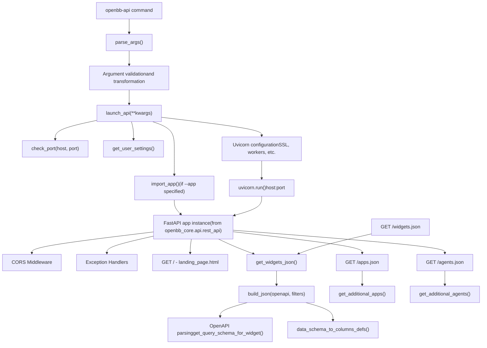
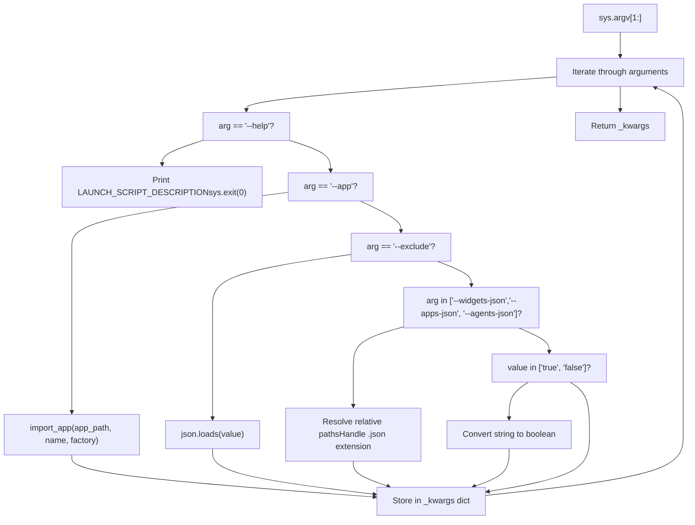
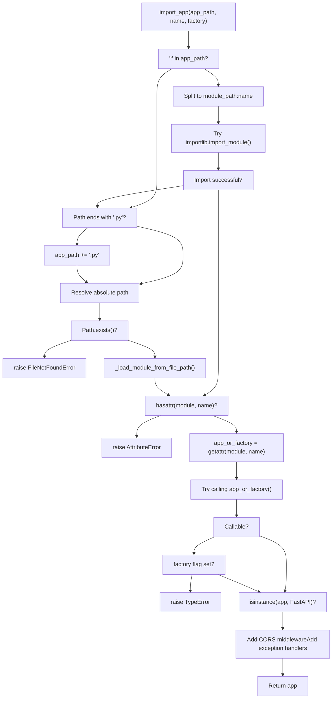
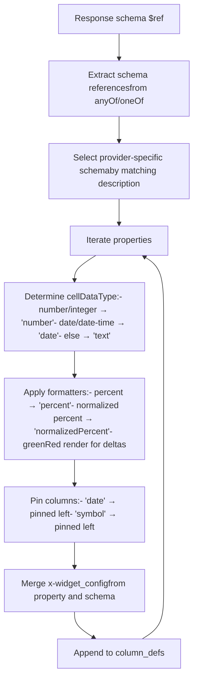
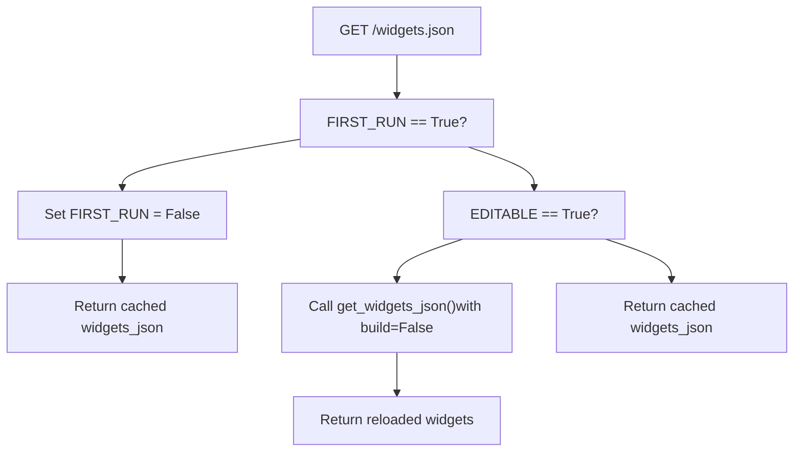
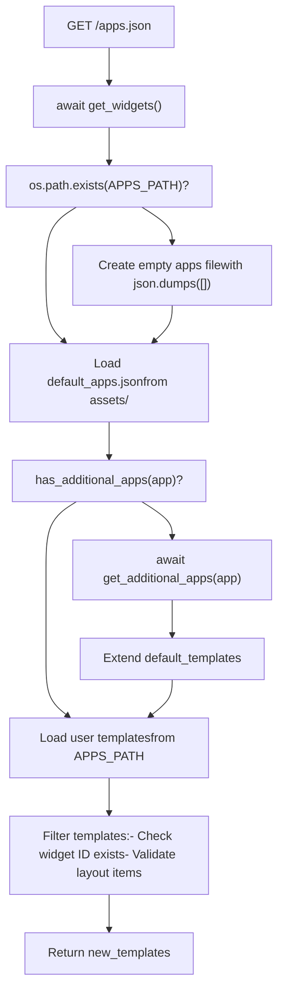
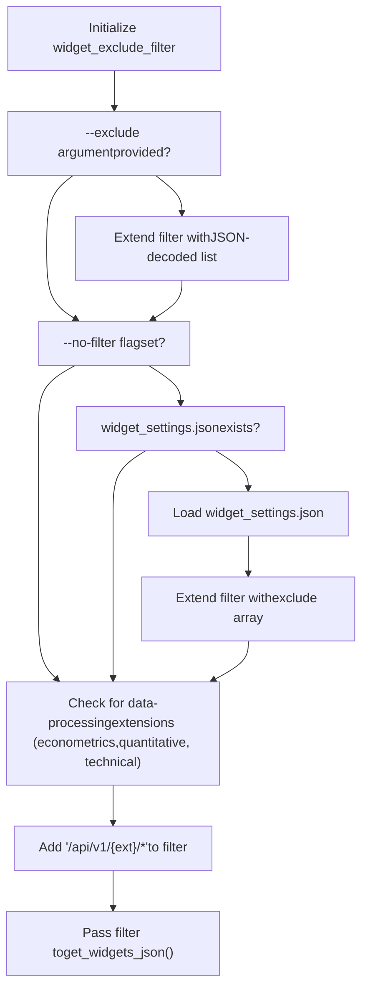

# FastAPI Server

Relevant source files

-   [.codespell.skip](https://github.com/OpenBB-finance/OpenBB/blob/dddc3b32/.codespell.skip)
-   [.pre-commit-config.yaml](https://github.com/OpenBB-finance/OpenBB/blob/dddc3b32/.pre-commit-config.yaml)
-   [README.md](https://github.com/OpenBB-finance/OpenBB/blob/dddc3b32/README.md?plain=1)
-   [cli/tests/test\_argparse\_translator\_obbject\_registry.py](https://github.com/OpenBB-finance/OpenBB/blob/dddc3b32/cli/tests/test_argparse_translator_obbject_registry.py)
-   [openbb\_platform/core/openbb\_core/api/app\_loader.py](https://github.com/OpenBB-finance/OpenBB/blob/dddc3b32/openbb_platform/core/openbb_core/api/app_loader.py)
-   [openbb\_platform/core/openbb\_core/api/exception\_handlers.py](https://github.com/OpenBB-finance/OpenBB/blob/dddc3b32/openbb_platform/core/openbb_core/api/exception_handlers.py)
-   [openbb\_platform/core/openbb\_core/api/rest\_api.py](https://github.com/OpenBB-finance/OpenBB/blob/dddc3b32/openbb_platform/core/openbb_core/api/rest_api.py)
-   [openbb\_platform/core/openbb\_core/api/router/coverage.py](https://github.com/OpenBB-finance/OpenBB/blob/dddc3b32/openbb_platform/core/openbb_core/api/router/coverage.py)
-   [openbb\_platform/core/openbb\_core/app/provider\_interface.py](https://github.com/OpenBB-finance/OpenBB/blob/dddc3b32/openbb_platform/core/openbb_core/app/provider_interface.py)
-   [openbb\_platform/core/openbb\_core/app/router.py](https://github.com/OpenBB-finance/OpenBB/blob/dddc3b32/openbb_platform/core/openbb_core/app/router.py)
-   [openbb\_platform/core/openbb\_core/app/static/package\_builder.py](https://github.com/OpenBB-finance/OpenBB/blob/dddc3b32/openbb_platform/core/openbb_core/app/static/package_builder.py)
-   [openbb\_platform/core/openbb\_core/app/static/utils/filters.py](https://github.com/OpenBB-finance/OpenBB/blob/dddc3b32/openbb_platform/core/openbb_core/app/static/utils/filters.py)
-   [openbb\_platform/core/openbb\_core/app/utils.py](https://github.com/OpenBB-finance/OpenBB/blob/dddc3b32/openbb_platform/core/openbb_core/app/utils.py)
-   [openbb\_platform/core/openbb\_core/provider/registry\_map.py](https://github.com/OpenBB-finance/OpenBB/blob/dddc3b32/openbb_platform/core/openbb_core/provider/registry_map.py)
-   [openbb\_platform/core/openbb\_core/provider/standard\_models/fred\_release\_table.py](https://github.com/OpenBB-finance/OpenBB/blob/dddc3b32/openbb_platform/core/openbb_core/provider/standard_models/fred_release_table.py)
-   [openbb\_platform/core/openbb\_core/provider/standard\_models/futures\_curve.py](https://github.com/OpenBB-finance/OpenBB/blob/dddc3b32/openbb_platform/core/openbb_core/provider/standard_models/futures_curve.py)
-   [openbb\_platform/core/openbb\_core/provider/standard\_models/management\_discussion\_analysis.py](https://github.com/OpenBB-finance/OpenBB/blob/dddc3b32/openbb_platform/core/openbb_core/provider/standard_models/management_discussion_analysis.py)
-   [openbb\_platform/core/openbb\_core/provider/standard\_models/yield\_curve.py](https://github.com/OpenBB-finance/OpenBB/blob/dddc3b32/openbb_platform/core/openbb_core/provider/standard_models/yield_curve.py)
-   [openbb\_platform/core/tests/app/static/test\_filters.py](https://github.com/OpenBB-finance/OpenBB/blob/dddc3b32/openbb_platform/core/tests/app/static/test_filters.py)
-   [openbb\_platform/core/tests/app/static/test\_package\_builder.py](https://github.com/OpenBB-finance/OpenBB/blob/dddc3b32/openbb_platform/core/tests/app/static/test_package_builder.py)
-   [openbb\_platform/core/tests/app/test\_platform\_router.py](https://github.com/OpenBB-finance/OpenBB/blob/dddc3b32/openbb_platform/core/tests/app/test_platform_router.py)
-   [openbb\_platform/core/tests/app/test\_provider\_interface.py](https://github.com/OpenBB-finance/OpenBB/blob/dddc3b32/openbb_platform/core/tests/app/test_provider_interface.py)
-   [openbb\_platform/extensions/platform\_api/README.md](https://github.com/OpenBB-finance/OpenBB/blob/dddc3b32/openbb_platform/extensions/platform_api/README.md?plain=1)
-   [openbb\_platform/extensions/platform\_api/openbb\_platform\_api/main.py](https://github.com/OpenBB-finance/OpenBB/blob/dddc3b32/openbb_platform/extensions/platform_api/openbb_platform_api/main.py)
-   [openbb\_platform/extensions/platform\_api/openbb\_platform\_api/query\_models.py](https://github.com/OpenBB-finance/OpenBB/blob/dddc3b32/openbb_platform/extensions/platform_api/openbb_platform_api/query_models.py)
-   [openbb\_platform/extensions/platform\_api/openbb\_platform\_api/response\_models.py](https://github.com/OpenBB-finance/OpenBB/blob/dddc3b32/openbb_platform/extensions/platform_api/openbb_platform_api/response_models.py)
-   [openbb\_platform/extensions/platform\_api/openbb\_platform\_api/utils/api.py](https://github.com/OpenBB-finance/OpenBB/blob/dddc3b32/openbb_platform/extensions/platform_api/openbb_platform_api/utils/api.py)
-   [openbb\_platform/extensions/platform\_api/openbb\_platform\_api/utils/openapi.py](https://github.com/OpenBB-finance/OpenBB/blob/dddc3b32/openbb_platform/extensions/platform_api/openbb_platform_api/utils/openapi.py)
-   [openbb\_platform/extensions/platform\_api/openbb\_platform\_api/utils/widgets.py](https://github.com/OpenBB-finance/OpenBB/blob/dddc3b32/openbb_platform/extensions/platform_api/openbb_platform_api/utils/widgets.py)
-   [openbb\_platform/extensions/platform\_api/poetry.lock](https://github.com/OpenBB-finance/OpenBB/blob/dddc3b32/openbb_platform/extensions/platform_api/poetry.lock)
-   [openbb\_platform/extensions/platform\_api/pyproject.toml](https://github.com/OpenBB-finance/OpenBB/blob/dddc3b32/openbb_platform/extensions/platform_api/pyproject.toml)
-   [openbb\_platform/extensions/platform\_api/tests/mock\_openapi.json](https://github.com/OpenBB-finance/OpenBB/blob/dddc3b32/openbb_platform/extensions/platform_api/tests/mock_openapi.json)
-   [openbb\_platform/extensions/platform\_api/tests/mock\_widgets.json](https://github.com/OpenBB-finance/OpenBB/blob/dddc3b32/openbb_platform/extensions/platform_api/tests/mock_widgets.json)
-   [openbb\_platform/extensions/platform\_api/tests/test\_openapi\_utils.py](https://github.com/OpenBB-finance/OpenBB/blob/dddc3b32/openbb_platform/extensions/platform_api/tests/test_openapi_utils.py)
-   [openbb\_platform/extensions/platform\_api/tests/test\_widgets\_utils.py](https://github.com/OpenBB-finance/OpenBB/blob/dddc3b32/openbb_platform/extensions/platform_api/tests/test_widgets_utils.py)
-   [openbb\_platform/extensions/regulators/integration/test\_regulators\_api.py](https://github.com/OpenBB-finance/OpenBB/blob/dddc3b32/openbb_platform/extensions/regulators/integration/test_regulators_api.py)
-   [openbb\_platform/extensions/regulators/integration/test\_regulators\_python.py](https://github.com/OpenBB-finance/OpenBB/blob/dddc3b32/openbb_platform/extensions/regulators/integration/test_regulators_python.py)
-   [openbb\_platform/extensions/regulators/openbb\_regulators/cftc/cftc\_router.py](https://github.com/OpenBB-finance/OpenBB/blob/dddc3b32/openbb_platform/extensions/regulators/openbb_regulators/cftc/cftc_router.py)
-   [openbb\_platform/extensions/regulators/openbb\_regulators/sec/sec\_router.py](https://github.com/OpenBB-finance/OpenBB/blob/dddc3b32/openbb_platform/extensions/regulators/openbb_regulators/sec/sec_router.py)
-   [openbb\_platform/obbject\_extensions/charting/tests/test\_charting.py](https://github.com/OpenBB-finance/OpenBB/blob/dddc3b32/openbb_platform/obbject_extensions/charting/tests/test_charting.py)
-   [openbb\_platform/providers/bls/openbb\_bls/utils/helpers.py](https://github.com/OpenBB-finance/OpenBB/blob/dddc3b32/openbb_platform/providers/bls/openbb_bls/utils/helpers.py)
-   [openbb\_platform/providers/cboe/openbb\_cboe/models/futures\_curve.py](https://github.com/OpenBB-finance/OpenBB/blob/dddc3b32/openbb_platform/providers/cboe/openbb_cboe/models/futures_curve.py)
-   [openbb\_platform/providers/cboe/tests/test\_cboe\_fetchers.py](https://github.com/OpenBB-finance/OpenBB/blob/dddc3b32/openbb_platform/providers/cboe/tests/test_cboe_fetchers.py)
-   [openbb\_platform/providers/fred/openbb\_fred/models/release\_table.py](https://github.com/OpenBB-finance/OpenBB/blob/dddc3b32/openbb_platform/providers/fred/openbb_fred/models/release_table.py)
-   [openbb\_platform/providers/nasdaq/tests/record/expected\_widgets.json](https://github.com/OpenBB-finance/OpenBB/blob/dddc3b32/openbb_platform/providers/nasdaq/tests/record/expected_widgets.json)
-   [openbb\_platform/providers/sec/openbb\_sec/models/management\_discussion\_analysis.py](https://github.com/OpenBB-finance/OpenBB/blob/dddc3b32/openbb_platform/providers/sec/openbb_sec/models/management_discussion_analysis.py)
-   [openbb\_platform/providers/sec/openbb\_sec/models/schema\_files.py](https://github.com/OpenBB-finance/OpenBB/blob/dddc3b32/openbb_platform/providers/sec/openbb_sec/models/schema_files.py)
-   [openbb\_platform/providers/sec/openbb\_sec/utils/html2markdown.py](https://github.com/OpenBB-finance/OpenBB/blob/dddc3b32/openbb_platform/providers/sec/openbb_sec/utils/html2markdown.py)
-   [openbb\_platform/providers/sec/openbb\_sec/utils/xbrl\_taxonomy\_helper.py](https://github.com/OpenBB-finance/OpenBB/blob/dddc3b32/openbb_platform/providers/sec/openbb_sec/utils/xbrl_taxonomy_helper.py)
-   [openbb\_platform/providers/sec/poetry.lock](https://github.com/OpenBB-finance/OpenBB/blob/dddc3b32/openbb_platform/providers/sec/poetry.lock)
-   [openbb\_platform/providers/sec/pyproject.toml](https://github.com/OpenBB-finance/OpenBB/blob/dddc3b32/openbb_platform/providers/sec/pyproject.toml)

## Purpose and Scope

The FastAPI Server system provides the HTTP API layer for the OpenBB Platform, exposing data provider endpoints and extensions through a REST interface. This document covers the server launch script, configuration options, widget generation, and integration with OpenBB Workspace. For information about the Python SDK and CLI interfaces, see [Python SDK and CLI](/OpenBB-finance/OpenBB/5.1-python-sdk). For details on widget configuration and Workspace integration, see [Widget System and Workspace Integration](/OpenBB-finance/OpenBB/5.3-openbb-workspace-integration).

The core implementation resides in the `openbb-platform-api` package, which serves as both a launcher for the standard OpenBB Platform API and a framework for building custom backend applications.

**Sources:** [openbb\_platform/extensions/platform\_api/openbb\_platform\_api/main.py1-340](https://github.com/OpenBB-finance/OpenBB/blob/dddc3b32/openbb_platform/extensions/platform_api/openbb_platform_api/main.py#L1-L340) [openbb\_platform/extensions/platform\_api/README.md1-15](https://github.com/OpenBB-finance/OpenBB/blob/dddc3b32/openbb_platform/extensions/platform_api/README.md?plain=1#L1-L15)

---

## Server Architecture


The server architecture follows a three-stage initialization flow: (1) command-line argument parsing and validation, (2) application and endpoint setup, and (3) Uvicorn server launch with runtime configuration.

**Sources:** [openbb\_platform/extensions/platform\_api/openbb\_platform\_api/main.py1-340](https://github.com/OpenBB-finance/OpenBB/blob/dddc3b32/openbb_platform/extensions/platform_api/openbb_platform_api/main.py#L1-L340) [openbb\_platform/extensions/platform\_api/openbb\_platform\_api/utils/api.py1-411](https://github.com/OpenBB-finance/OpenBB/blob/dddc3b32/openbb_platform/extensions/platform_api/openbb_platform_api/utils/api.py#L1-L411)

---

## Entry Point and Launch Script

### Command-Line Entry

The `openbb-api` command is registered as a console script entry point in `pyproject.toml`:

```
[tool.poetry.scripts]openbb-api = "openbb_platform_api.main:main"
```
The `main()` function at [openbb\_platform/extensions/platform\_api/openbb\_platform\_api/main.py330-339](https://github.com/OpenBB-finance/OpenBB/blob/dddc3b32/openbb_platform/extensions/platform_api/openbb_platform_api/main.py#L330-L339) serves as the entry point, which immediately delegates to `launch_api()` with parsed keyword arguments.

**Sources:** [openbb\_platform/extensions/platform\_api/pyproject.toml13-14](https://github.com/OpenBB-finance/OpenBB/blob/dddc3b32/openbb_platform/extensions/platform_api/pyproject.toml#L13-L14) [openbb\_platform/extensions/platform\_api/openbb\_platform\_api/main.py330-339](https://github.com/OpenBB-finance/OpenBB/blob/dddc3b32/openbb_platform/extensions/platform_api/openbb_platform_api/main.py#L330-L339)

### Argument Parsing

The `parse_args()` function at [openbb\_platform/extensions/platform\_api/openbb\_platform\_api/utils/api.py307-411](https://github.com/OpenBB-finance/OpenBB/blob/dddc3b32/openbb_platform/extensions/platform_api/openbb_platform_api/utils/api.py#L307-L411) processes command-line arguments:


The parser handles several special cases:

-   `--app`: Imports a custom FastAPI application using `import_app()`
-   `--exclude`: Parses JSON-encoded list of widget IDs to exclude
-   `--widgets-json`, `--apps-json`, `--agents-json`: Resolves file paths and enables editable mode
-   Boolean flags: Converts string values `"true"`/`"false"` to Python booleans

**Sources:** [openbb\_platform/extensions/platform\_api/openbb\_platform\_api/utils/api.py307-411](https://github.com/OpenBB-finance/OpenBB/blob/dddc3b32/openbb_platform/extensions/platform_api/openbb_platform_api/utils/api.py#L307-L411)

---

## Server Configuration

### Launch API Function

The `launch_api()` function at [openbb\_platform/extensions/platform\_api/openbb\_platform\_api/main.py284-328](https://github.com/OpenBB-finance/OpenBB/blob/dddc3b32/openbb_platform/extensions/platform_api/openbb_platform_api/main.py#L284-L328) configures and starts the Uvicorn server:

| Configuration Step | Implementation | Default Value |
| --- | --- | --- |
| Host resolution | `_kwargs.pop("host", os.getenv("OPENBB_API_HOST"))` | `"127.0.0.1"` |
| Port validation | `int(port)` with fallback logic | `6900` |
| Port availability | `check_port(host, port)` | Auto-increment if occupied |
| Color output | Platform detection for Windows | `True` (except Windows) |
| Uvicorn settings | Merge from `system_settings.python_settings.uvicorn` | See below |

### Port Allocation

The `check_port()` function at [openbb\_platform/extensions/platform\_api/openbb\_platform\_api/utils/api.py82-94](https://github.com/OpenBB-finance/OpenBB/blob/dddc3b32/openbb_platform/extensions/platform_api/openbb_platform_api/utils/api.py#L82-L94) ensures port availability:

```
def check_port(host, port):    port = int(port)    not_free = True    while not_free:        with socket.socket(socket.AF_INET, socket.SOCK_STREAM) as sock:            res = sock.connect_ex((host, port))            if res != 0:                not_free = False            else:                port += 1    return port
```
If the requested port is in use, the function automatically increments until finding an available port.

**Sources:** [openbb\_platform/extensions/platform\_api/openbb\_platform\_api/main.py284-328](https://github.com/OpenBB-finance/OpenBB/blob/dddc3b32/openbb_platform/extensions/platform_api/openbb_platform_api/main.py#L284-L328) [openbb\_platform/extensions/platform\_api/openbb\_platform\_api/utils/api.py82-94](https://github.com/OpenBB-finance/OpenBB/blob/dddc3b32/openbb_platform/extensions/platform_api/openbb_platform_api/utils/api.py#L82-L94)

### HTTPS Configuration

HTTPS support requires SSL certificate and key files. The server accepts these via command-line arguments:

```
openbb-api --ssl_keyfile localhost.key --ssl_certfile localhost.crt
```
The arguments are passed directly to `uvicorn.run()` at [openbb\_platform/extensions/platform\_api/openbb\_platform\_api/main.py327](https://github.com/OpenBB-finance/OpenBB/blob/dddc3b32/openbb_platform/extensions/platform_api/openbb_platform_api/main.py#L327-L327) Certificate generation instructions are provided in [openbb\_platform/extensions/platform\_api/README.md100-122](https://github.com/OpenBB-finance/OpenBB/blob/dddc3b32/openbb_platform/extensions/platform_api/README.md?plain=1#L100-L122)

**Sources:** [openbb\_platform/extensions/platform\_api/README.md99-122](https://github.com/OpenBB-finance/OpenBB/blob/dddc3b32/openbb_platform/extensions/platform_api/README.md?plain=1#L99-L122) [openbb\_platform/extensions/platform\_api/openbb\_platform\_api/main.py327](https://github.com/OpenBB-finance/OpenBB/blob/dddc3b32/openbb_platform/extensions/platform_api/openbb_platform_api/main.py#L327-L327)

---

## Application Initialization

### Standard OpenBB Platform App

By default (when `--app` is not specified), the server uses the FastAPI instance from `openbb_core.api.rest_api`:

```
from openbb_core.api.rest_api import app
```
This app is pre-configured at [openbb\_platform/extensions/platform\_api/openbb\_platform\_api/main.py14](https://github.com/OpenBB-finance/OpenBB/blob/dddc3b32/openbb_platform/extensions/platform_api/openbb_platform_api/main.py#L14-L14) and includes all registered OpenBB Platform extensions and providers.

### Custom Application Import

The `import_app()` function at [openbb\_platform/extensions/platform\_api/openbb\_platform\_api/utils/api.py213-305](https://github.com/OpenBB-finance/OpenBB/blob/dddc3b32/openbb_platform/extensions/platform_api/openbb_platform_api/utils/api.py#L213-L305) supports three import patterns:


**Import Pattern Examples:**

| Pattern | Example | Description |
| --- | --- | --- |
| Module path with colon | `my_app.main:app` | Import `app` from `my_app.main` module |
| File path | `./custom_backend.py` | Load file and import `app` attribute |
| File path with name | `./backend.py:my_api` | Load file and import `my_api` attribute |
| Factory function | `main.py:create_app --factory` | Call `create_app()` to get app instance |

**Sources:** [openbb\_platform/extensions/platform\_api/openbb\_platform\_api/utils/api.py213-305](https://github.com/OpenBB-finance/OpenBB/blob/dddc3b32/openbb_platform/extensions/platform_api/openbb_platform_api/utils/api.py#L213-L305) [openbb\_platform/extensions/platform\_api/README.md33-54](https://github.com/OpenBB-finance/OpenBB/blob/dddc3b32/openbb_platform/extensions/platform_api/README.md?plain=1#L33-L54)

---

## Widget JSON Generation

### Generation Pipeline

The `get_widgets_json()` function at [openbb\_platform/extensions/platform\_api/openbb\_platform\_api/utils/api.py110-211](https://github.com/OpenBB-finance/OpenBB/blob/dddc3b32/openbb_platform/extensions/platform_api/openbb_platform_api/utils/api.py#L110-L211) orchestrates widget generation:

> **[Mermaid sequence]**
> *(图表结构无法解析)*

**Sources:** [openbb\_platform/extensions/platform\_api/openbb\_platform\_api/utils/api.py110-211](https://github.com/OpenBB-finance/OpenBB/blob/dddc3b32/openbb_platform/extensions/platform_api/openbb_platform_api/utils/api.py#L110-L211) [openbb\_platform/extensions/platform\_api/openbb\_platform\_api/utils/widgets.py233-743](https://github.com/OpenBB-finance/OpenBB/blob/dddc3b32/openbb_platform/extensions/platform_api/openbb_platform_api/utils/widgets.py#L233-L743)

### OpenAPI Schema Processing

The `process_parameter()` function at [openbb\_platform/extensions/platform\_api/openbb\_platform\_api/utils/openapi.py370-557](https://github.com/OpenBB-finance/OpenBB/blob/dddc3b32/openbb_platform/extensions/platform_api/openbb_platform_api/utils/openapi.py#L370-L557) transforms OpenAPI parameter definitions into widget-compatible schemas:

**Parameter Transformation Rules:**

| OpenAPI Type | Widget Type | Special Handling |
| --- | --- | --- |
| `string` with `format: "date"` | `"date"` | Date picker widget |
| `string` with `enum` | `"text"` with `options` | Dropdown selector |
| `integer`, `float` | `"number"` | Numeric input |
| `boolean` | `"boolean"` | Checkbox/toggle |
| Parameters named `*_date` or `date` | `"date"` | Auto-detect date fields |
| Parameters named `limit` | `"number"` | Numeric input |

**Provider-Specific Processing:**

The function extracts provider-specific configurations from several locations:

1.  Schema `title` field: `"fred"` → `available_providers: ["fred"]`
2.  Description suffix: `"(provider: fred)"` → Provider-specific description
3.  Nested schema properties: `schema["fred"]["choices"]` → Provider-specific options
4.  `anyOf` enum lists: Multiple provider options with position-based matching

**Sources:** [openbb\_platform/extensions/platform\_api/openbb\_platform\_api/utils/openapi.py370-557](https://github.com/OpenBB-finance/OpenBB/blob/dddc3b32/openbb_platform/extensions/platform_api/openbb_platform_api/utils/openapi.py#L370-L557) [openbb\_platform/extensions/platform\_api/openbb\_platform\_api/utils/openapi.py66-87](https://github.com/OpenBB-finance/OpenBB/blob/dddc3b32/openbb_platform/extensions/platform_api/openbb_platform_api/utils/openapi.py#L66-L87)

### Column Definition Generation

The `data_schema_to_columns_defs()` function at [openbb\_platform/extensions/platform\_api/openbb\_platform\_api/utils/openapi.py665-939](https://github.com/OpenBB-finance/OpenBB/blob/dddc3b32/openbb_platform/extensions/platform_api/openbb_platform_api/utils/openapi.py#L665-L939) creates table column configurations:


**Special Column Handling:**

-   Fields with `x-unit_measurement: "percent"` get `formatterFn: "percent"` or `"normalizedPercent"` based on `x-frontend_multiply`
-   Fields named `"change"`, `"delta"`, `"theta"`, `"rho"` get `renderFn: "greenRed"` for color-coded display
-   Identifier fields (`"cik"`, `"isin"`, `"cusip"`, `"symbol"`) get `cellDataType: "text"` and `formatterFn: "none"`
-   Greek letters for options (`"delta"`, `"gamma"`, `"vega"`, etc.) get special numeric formatting

**Sources:** [openbb\_platform/extensions/platform\_api/openbb\_platform\_api/utils/openapi.py665-939](https://github.com/OpenBB-finance/OpenBB/blob/dddc3b32/openbb_platform/extensions/platform_api/openbb_platform_api/utils/openapi.py#L665-L939)

---

## Server Endpoints

### Root Endpoint

The root endpoint at [openbb\_platform/extensions/platform\_api/openbb\_platform\_api/main.py124-131](https://github.com/OpenBB-finance/OpenBB/blob/dddc3b32/openbb_platform/extensions/platform_api/openbb_platform_api/main.py#L124-L131) serves a landing page:

```
@app.get("/")async def root():    """Serve the landing page HTML content."""    html_path = Path(__file__).parent / "assets" / "landing_page.html"    with open(html_path, encoding="utf-8") as f:        html_content = f.read()    return HTMLResponse(content=html_content)
```
**Sources:** [openbb\_platform/extensions/platform\_api/openbb\_platform\_api/main.py124-131](https://github.com/OpenBB-finance/OpenBB/blob/dddc3b32/openbb_platform/extensions/platform_api/openbb_platform_api/main.py#L124-L131)

### Widgets Endpoint

The `/widgets.json` endpoint at [openbb\_platform/extensions/platform\_api/openbb\_platform\_api/main.py136-169](https://github.com/OpenBB-finance/OpenBB/blob/dddc3b32/openbb_platform/extensions/platform_api/openbb_platform_api/main.py#L136-L169) serves widget configurations:


**Editable Mode Behavior:**

When `--editable` flag is set:

1.  `EDITABLE = True` at [openbb\_platform/extensions/platform\_api/openbb\_platform\_api/main.py57](https://github.com/OpenBB-finance/OpenBB/blob/dddc3b32/openbb_platform/extensions/platform_api/openbb_platform_api/main.py#L57-L57)
2.  Subsequent requests reload widgets from the file path
3.  Allows runtime modification of `widgets.json` without server restart

**Sources:** [openbb\_platform/extensions/platform\_api/openbb\_platform\_api/main.py136-169](https://github.com/OpenBB-finance/OpenBB/blob/dddc3b32/openbb_platform/extensions/platform_api/openbb_platform_api/main.py#L136-L169)

### Apps Endpoint

The `/apps.json` endpoint at [openbb\_platform/extensions/platform\_api/openbb\_platform\_api/main.py176-246](https://github.com/OpenBB-finance/OpenBB/blob/dddc3b32/openbb_platform/extensions/platform_api/openbb_platform_api/main.py#L176-L246) aggregates dashboard templates:


**Template Validation:**

Templates are included if:

-   Single widget: `template["id"]` exists in `widgets_json`
-   Dashboard: All `item["i"]` in `template["layout"]` exist in `widgets_json`
-   Tabbed dashboard: All layout items in all tabs exist in `widgets_json`

**Sources:** [openbb\_platform/extensions/platform\_api/openbb\_platform\_api/main.py176-246](https://github.com/OpenBB-finance/OpenBB/blob/dddc3b32/openbb_platform/extensions/platform_api/openbb_platform_api/main.py#L176-L246)

### Agents Endpoint

The `/agents.json` endpoint provides AI agent configurations. Two implementations exist depending on configuration:

**With `--agents-json` argument** [openbb\_platform/extensions/platform\_api/openbb\_platform\_api/main.py248-258](https://github.com/OpenBB-finance/OpenBB/blob/dddc3b32/openbb_platform/extensions/platform_api/openbb_platform_api/main.py#L248-L258):

```
@app.get("/agents.json")async def get_agents():    """Get the agents.json file."""    if os.path.exists(AGENTS_PATH):        with open(AGENTS_PATH, encoding="utf-8") as f:            agents = json.load(f)        return JSONResponse(content=agents, headers=obb_headers)    return JSONResponse(content={}, headers=obb_headers)
```
**With additional agents from routers** [openbb\_platform/extensions/platform\_api/openbb\_platform\_api/main.py263-275](https://github.com/OpenBB-finance/OpenBB/blob/dddc3b32/openbb_platform/extensions/platform_api/openbb_platform_api/main.py#L263-L275):

```
@app.get("/agents.json")async def get_agents_json():    """Get the agents.json file."""    new_agents: dict = {}    additional_agents = await get_additional_agents(app)    if additional_agents:        for path_agents in additional_agents.values():            for k, v in path_agents.items():                new_agents[k] = v    return JSONResponse(content=new_agents, headers=obb_headers)
```
**Sources:** [openbb\_platform/extensions/platform\_api/openbb\_platform\_api/main.py248-282](https://github.com/OpenBB-finance/OpenBB/blob/dddc3b32/openbb_platform/extensions/platform_api/openbb_platform_api/main.py#L248-L282)

---

## Command-Line Arguments

### Launcher-Specific Arguments

| Argument | Type | Description | Default |
| --- | --- | --- | --- |
| `--app` | str | Absolute path to Python file with FastAPI instance | OpenBB Platform API |
| `--name` | str | Name of FastAPI instance in app file | `"app"` |
| `--factory` | flag | Indicates if app name is a factory function | `false` |
| `--editable` | flag | Make widgets.json editable during runtime | `false` |
| `--build` | flag | Prompt action if file exists (overwrite/append/ignore) | Prompt on changes |
| `--no-build` | flag | Skip building widgets.json, load existing | `false` |
| `--exclude` | JSON list | API paths to exclude from widgets.json | `[]` |
| `--no-filter` | flag | Ignore widget\_settings.json filters | `false` |
| `--widgets-json` | path | Path to use as widgets.json file | `~/envs/{env}/assets/widgets.json` |
| `--apps-json` | path | Path to use as apps.json file | `~/OpenBBUserData/workspace_apps.json` |
| `--agents-json` | path | Path to use as agents.json file | None |

**Sources:** [openbb\_platform/extensions/platform\_api/README.md60-73](https://github.com/OpenBB-finance/OpenBB/blob/dddc3b32/openbb_platform/extensions/platform_api/README.md?plain=1#L60-L73) [openbb\_platform/extensions/platform\_api/openbb\_platform\_api/utils/api.py16-79](https://github.com/OpenBB-finance/OpenBB/blob/dddc3b32/openbb_platform/extensions/platform_api/openbb_platform_api/utils/api.py#L16-L79)

### Uvicorn Arguments

Common uvicorn settings passed through to `uvicorn.run()`:

| Argument | Type | Description | Default |
| --- | --- | --- | --- |
| `--host` | str | Host IP address or hostname | `"127.0.0.1"` or `$OPENBB_API_HOST` |
| `--port` | int | Port number | `6900` or `$OPENBB_API_PORT` |
| `--ssl-keyfile` | path | SSL key file for HTTPS | None |
| `--ssl-certfile` | path | SSL certificate file for HTTPS | None |
| `--ssl-keyfile-password` | str | Password for SSL key file | None |
| `--ssl-version` | int | SSL version from stdlib ssl module | `17` |
| `--ssl-cert-reqs` | int | Whether client cert is required | `0` |
| `--ssl-ca-certs` | path | CA certificates file | None |
| `--ssl-ciphers` | str | Ciphers to use | `"TLSv1"` |
| `--reload` | flag | Enable auto-reload on code changes | `false` |
| `--workers` | int | Number of worker processes | `1` |

**Note:** Replace `-` with `_` in uvicorn arguments (e.g., `--ssl_keyfile` instead of `--ssl-keyfile`).

**Sources:** [openbb\_platform/extensions/platform\_api/README.md75-98](https://github.com/OpenBB-finance/OpenBB/blob/dddc3b32/openbb_platform/extensions/platform_api/README.md?plain=1#L75-L98) [openbb\_platform/extensions/platform\_api/openbb\_platform\_api/main.py66-74](https://github.com/OpenBB-finance/OpenBB/blob/dddc3b32/openbb_platform/extensions/platform_api/openbb_platform_api/main.py#L66-L74)

---

## Widget Filtering

### Filter Sources

The server supports multiple filtering mechanisms at [openbb\_platform/extensions/platform\_api/openbb\_platform\_api/main.py75-106](https://github.com/OpenBB-finance/OpenBB/blob/dddc3b32/openbb_platform/extensions/platform_api/openbb_platform_api/main.py#L75-L106):


### Extension-Based Filtering

The `check_for_platform_extensions()` function at [openbb\_platform/extensions/platform\_api/openbb\_platform\_api/main.py87-104](https://github.com/OpenBB-finance/OpenBB/blob/dddc3b32/openbb_platform/extensions/platform_api/openbb_platform_api/main.py#L87-L104) automatically excludes data-processing extensions:

```
def check_for_platform_extensions(fastapi_app, widgets_to_exclude) -> list:    """Check for data-processing Platform extensions and add them to the widget exclude filter."""    to_check_for = ["econometrics", "quantitative", "technical"]    openapi_tags = fastapi_app.openapi_tags or []    tags: list = []    for tag in openapi_tags:        if any(mod in tag.get("name", "") for mod in to_check_for):            tags.append(tag.get("name", ""))        if tags and (any(f"openbb_{mod}" in sys.modules for mod in to_check_for)):        api_prefix = SystemService().system_settings.api_settings.prefix        for tag in tags:            if f"openbb_{tag}" in sys.modules:                widgets_to_exclude.append(f"{api_prefix}/{tag}/*")        return widgets_to_exclude
```
This prevents data transformation endpoints from appearing as widgets in Workspace.

**Sources:** [openbb\_platform/extensions/platform\_api/openbb\_platform\_api/main.py75-106](https://github.com/OpenBB-finance/OpenBB/blob/dddc3b32/openbb_platform/extensions/platform_api/openbb_platform_api/main.py#L75-L106)

---

## Integration Points

### System Settings Integration

The server loads uvicorn configuration from `SystemService` at [openbb\_platform/extensions/platform\_api/openbb\_platform\_api/main.py66-74](https://github.com/OpenBB-finance/OpenBB/blob/dddc3b32/openbb_platform/extensions/platform_api/openbb_platform_api/main.py#L66-L74):

```
uvicorn_settings = (    SystemService().system_settings.python_settings.model_dump().get("uvicorn", {}))obb_headers = {"X-Backend-Type": "OpenBB Platform"} for key, value in uvicorn_settings.items():    if key not in kwargs and key != "app" and value is not None:        kwargs[key] = value
```
This allows centralized configuration through `user_settings.json` in addition to command-line arguments.

**Sources:** [openbb\_platform/extensions/platform\_api/openbb\_platform\_api/main.py66-74](https://github.com/OpenBB-finance/OpenBB/blob/dddc3b32/openbb_platform/extensions/platform_api/openbb_platform_api/main.py#L66-L74)

### User Settings

The `get_user_settings()` function at [openbb\_platform/extensions/platform\_api/openbb\_platform\_api/utils/api.py96-108](https://github.com/OpenBB-finance/OpenBB/blob/dddc3b32/openbb_platform/extensions/platform_api/openbb_platform_api/utils/api.py#L96-L108) loads user credentials and preferences:

```
def get_user_settings(current_user_settings: str) -> dict:    """Login to the OpenBB Platform."""    if Path(current_user_settings).exists():        with open(current_user_settings, encoding="utf-8") as f:            user_settings = json.load(f)    else:        user_settings = {            "credentials": {},            "preferences": {},            "defaults": {"commands": {}},        }    return user_settings
```
Settings are used to determine the `APPS_PATH` default location at [openbb\_platform/extensions/platform\_api/openbb\_platform\_api/main.py112-121](https://github.com/OpenBB-finance/OpenBB/blob/dddc3b32/openbb_platform/extensions/platform_api/openbb_platform_api/main.py#L112-L121)

**Sources:** [openbb\_platform/extensions/platform\_api/openbb\_platform\_api/utils/api.py96-108](https://github.com/OpenBB-finance/OpenBB/blob/dddc3b32/openbb_platform/extensions/platform_api/openbb_platform_api/utils/api.py#L96-L108) [openbb\_platform/extensions/platform\_api/openbb\_platform\_api/main.py108-121](https://github.com/OpenBB-finance/OpenBB/blob/dddc3b32/openbb_platform/extensions/platform_api/openbb_platform_api/main.py#L108-L121)

### Environment Variables

| Variable | Purpose | Used In |
| --- | --- | --- |
| `HOME` / `USERPROFILE` | Base directory for settings and data | [main.py40-45](https://github.com/OpenBB-finance/OpenBB/blob/dddc3b32/main.py#L40-L45) |
| `OPENBB_API_HOST` | Default host for server | [main.py286](https://github.com/OpenBB-finance/OpenBB/blob/dddc3b32/main.py#L286-L286) |
| `OPENBB_API_PORT` | Default port for server | [main.py295](https://github.com/OpenBB-finance/OpenBB/blob/dddc3b32/main.py#L295-L295) |

**Sources:** [openbb\_platform/extensions/platform\_api/openbb\_platform\_api/main.py38-45](https://github.com/OpenBB-finance/OpenBB/blob/dddc3b32/openbb_platform/extensions/platform_api/openbb_platform_api/main.py#L38-L45) [openbb\_platform/extensions/platform\_api/openbb\_platform\_api/main.py286-306](https://github.com/OpenBB-finance/OpenBB/blob/dddc3b32/openbb_platform/extensions/platform_api/openbb_platform_api/main.py#L286-L306)
