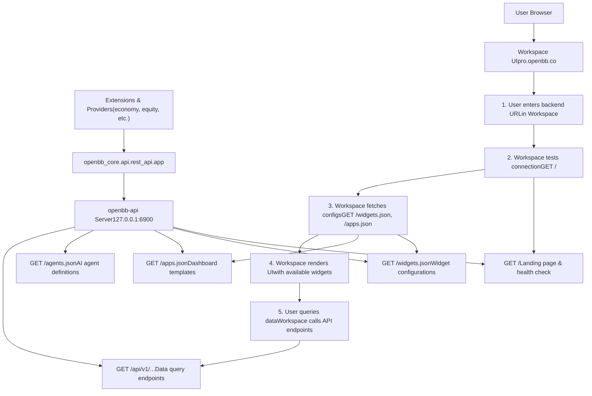
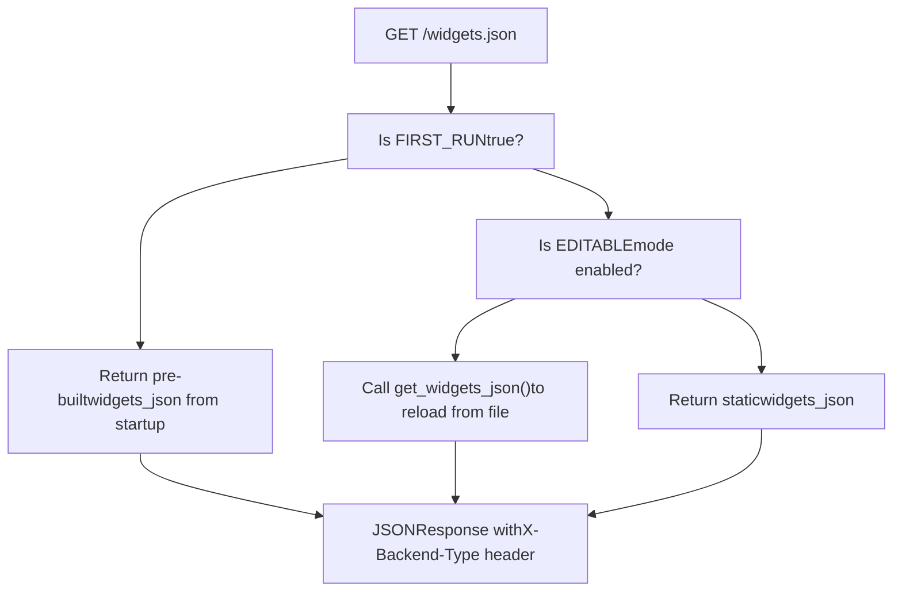
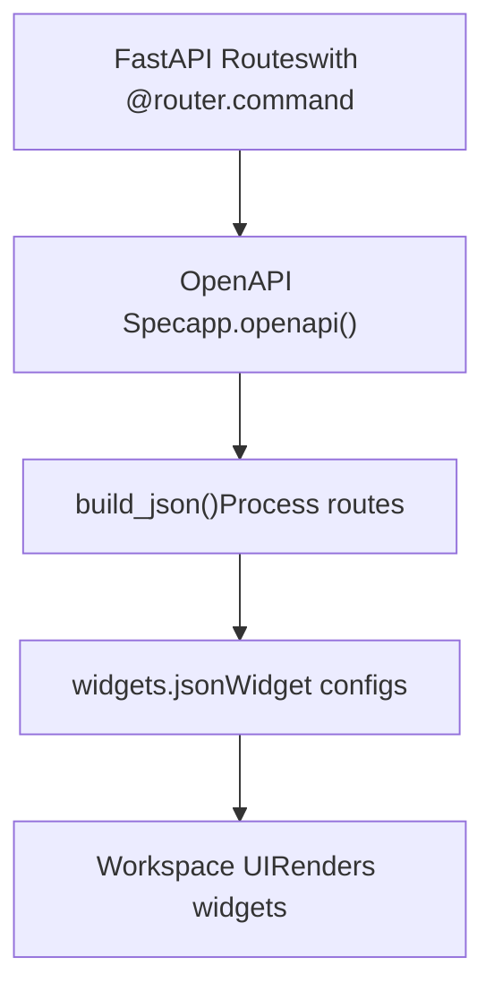

# OpenBB Workspace Integration

Relevant source files

-   [.codespell.skip](https://github.com/OpenBB-finance/OpenBB/blob/dddc3b32/.codespell.skip)
-   [.pre-commit-config.yaml](https://github.com/OpenBB-finance/OpenBB/blob/dddc3b32/.pre-commit-config.yaml)
-   [README.md](https://github.com/OpenBB-finance/OpenBB/blob/dddc3b32/README.md?plain=1)
-   [openbb\_platform/core/openbb\_core/provider/standard\_models/management\_discussion\_analysis.py](https://github.com/OpenBB-finance/OpenBB/blob/dddc3b32/openbb_platform/core/openbb_core/provider/standard_models/management_discussion_analysis.py)
-   [openbb\_platform/extensions/platform\_api/README.md](https://github.com/OpenBB-finance/OpenBB/blob/dddc3b32/openbb_platform/extensions/platform_api/README.md?plain=1)
-   [openbb\_platform/extensions/platform\_api/openbb\_platform\_api/main.py](https://github.com/OpenBB-finance/OpenBB/blob/dddc3b32/openbb_platform/extensions/platform_api/openbb_platform_api/main.py)
-   [openbb\_platform/extensions/platform\_api/openbb\_platform\_api/query\_models.py](https://github.com/OpenBB-finance/OpenBB/blob/dddc3b32/openbb_platform/extensions/platform_api/openbb_platform_api/query_models.py)
-   [openbb\_platform/extensions/platform\_api/openbb\_platform\_api/response\_models.py](https://github.com/OpenBB-finance/OpenBB/blob/dddc3b32/openbb_platform/extensions/platform_api/openbb_platform_api/response_models.py)
-   [openbb\_platform/extensions/platform\_api/openbb\_platform\_api/utils/api.py](https://github.com/OpenBB-finance/OpenBB/blob/dddc3b32/openbb_platform/extensions/platform_api/openbb_platform_api/utils/api.py)
-   [openbb\_platform/extensions/platform\_api/openbb\_platform\_api/utils/openapi.py](https://github.com/OpenBB-finance/OpenBB/blob/dddc3b32/openbb_platform/extensions/platform_api/openbb_platform_api/utils/openapi.py)
-   [openbb\_platform/extensions/platform\_api/openbb\_platform\_api/utils/widgets.py](https://github.com/OpenBB-finance/OpenBB/blob/dddc3b32/openbb_platform/extensions/platform_api/openbb_platform_api/utils/widgets.py)
-   [openbb\_platform/extensions/platform\_api/poetry.lock](https://github.com/OpenBB-finance/OpenBB/blob/dddc3b32/openbb_platform/extensions/platform_api/poetry.lock)
-   [openbb\_platform/extensions/platform\_api/pyproject.toml](https://github.com/OpenBB-finance/OpenBB/blob/dddc3b32/openbb_platform/extensions/platform_api/pyproject.toml)
-   [openbb\_platform/extensions/platform\_api/tests/mock\_openapi.json](https://github.com/OpenBB-finance/OpenBB/blob/dddc3b32/openbb_platform/extensions/platform_api/tests/mock_openapi.json)
-   [openbb\_platform/extensions/platform\_api/tests/mock\_widgets.json](https://github.com/OpenBB-finance/OpenBB/blob/dddc3b32/openbb_platform/extensions/platform_api/tests/mock_widgets.json)
-   [openbb\_platform/extensions/platform\_api/tests/test\_openapi\_utils.py](https://github.com/OpenBB-finance/OpenBB/blob/dddc3b32/openbb_platform/extensions/platform_api/tests/test_openapi_utils.py)
-   [openbb\_platform/extensions/platform\_api/tests/test\_widgets\_utils.py](https://github.com/OpenBB-finance/OpenBB/blob/dddc3b32/openbb_platform/extensions/platform_api/tests/test_widgets_utils.py)
-   [openbb\_platform/extensions/regulators/integration/test\_regulators\_api.py](https://github.com/OpenBB-finance/OpenBB/blob/dddc3b32/openbb_platform/extensions/regulators/integration/test_regulators_api.py)
-   [openbb\_platform/extensions/regulators/integration/test\_regulators\_python.py](https://github.com/OpenBB-finance/OpenBB/blob/dddc3b32/openbb_platform/extensions/regulators/integration/test_regulators_python.py)
-   [openbb\_platform/extensions/regulators/openbb\_regulators/cftc/cftc\_router.py](https://github.com/OpenBB-finance/OpenBB/blob/dddc3b32/openbb_platform/extensions/regulators/openbb_regulators/cftc/cftc_router.py)
-   [openbb\_platform/extensions/regulators/openbb\_regulators/sec/sec\_router.py](https://github.com/OpenBB-finance/OpenBB/blob/dddc3b32/openbb_platform/extensions/regulators/openbb_regulators/sec/sec_router.py)
-   [openbb\_platform/providers/nasdaq/tests/record/expected\_widgets.json](https://github.com/OpenBB-finance/OpenBB/blob/dddc3b32/openbb_platform/providers/nasdaq/tests/record/expected_widgets.json)
-   [openbb\_platform/providers/sec/openbb\_sec/models/management\_discussion\_analysis.py](https://github.com/OpenBB-finance/OpenBB/blob/dddc3b32/openbb_platform/providers/sec/openbb_sec/models/management_discussion_analysis.py)
-   [openbb\_platform/providers/sec/openbb\_sec/models/schema\_files.py](https://github.com/OpenBB-finance/OpenBB/blob/dddc3b32/openbb_platform/providers/sec/openbb_sec/models/schema_files.py)
-   [openbb\_platform/providers/sec/openbb\_sec/utils/html2markdown.py](https://github.com/OpenBB-finance/OpenBB/blob/dddc3b32/openbb_platform/providers/sec/openbb_sec/utils/html2markdown.py)
-   [openbb\_platform/providers/sec/openbb\_sec/utils/xbrl\_taxonomy\_helper.py](https://github.com/OpenBB-finance/OpenBB/blob/dddc3b32/openbb_platform/providers/sec/openbb_sec/utils/xbrl_taxonomy_helper.py)
-   [openbb\_platform/providers/sec/poetry.lock](https://github.com/OpenBB-finance/OpenBB/blob/dddc3b32/openbb_platform/providers/sec/poetry.lock)
-   [openbb\_platform/providers/sec/pyproject.toml](https://github.com/OpenBB-finance/OpenBB/blob/dddc3b32/openbb_platform/providers/sec/pyproject.toml)

## Purpose and Scope

OpenBB Workspace is a cloud-hosted enterprise UI application (hosted at `https://pro.openbb.co`) that connects to local or remote OpenBB Platform API backends to provide interactive data visualization, dashboard creation, and AI agent integration. This page documents how to connect the OpenBB Platform API server to Workspace and how the two systems communicate.

The integration maintains data sovereignty by keeping all data processing local while leveraging the cloud-hosted UI. This architecture enables users to access proprietary data sources through the OpenBB Platform while using Workspace's collaborative features.

For details on the REST API server itself, see page 5.2. For in-depth widget generation mechanics, see page 5.4. For visualization components, see page 5.6.

## What is OpenBB Workspace

OpenBB Workspace is a web-based financial research and analytics platform that provides:

-   **Interactive Dashboards**: Drag-and-drop widget placement with customizable layouts
-   **Data Visualization**: Tables, charts, metrics, and custom visualizations
-   **AI Agents**: Integration with language models for natural language queries
-   **Collaboration**: Shareable dashboards and applications
-   **Multi-Backend Support**: Connect to multiple data sources simultaneously

The Workspace UI runs in the cloud at `https://pro.openbb.co`, but connects to API backends that can run locally or on private infrastructure. This architecture ensures that sensitive data never leaves the user's environment while still providing a modern collaborative interface.

**Sources:** [README.md40-58](https://github.com/OpenBB-finance/OpenBB/blob/dddc3b32/README.md?plain=1#L40-L58)

## Integration Architecture


The integration maintains a clear separation:

-   **Backend (Local)**: Handles all data fetching, processing, and authentication
-   **Frontend (Cloud)**: Provides UI rendering, state management, and collaboration features
-   **Communication**: Standard HTTP/HTTPS requests with CORS headers

**Sources:** [README.md59-96](https://github.com/OpenBB-finance/OpenBB/blob/dddc3b32/README.md?plain=1#L59-L96) [openbb\_platform\_api/main.py124-282](https://github.com/OpenBB-finance/OpenBB/blob/dddc3b32/openbb_platform_api/main.py#L124-L282)

## Connection Setup

### Installing and Starting the Backend

To integrate the OpenBB Platform with Workspace, first install and start the API server:

```
# Install OpenBB Platform with all extensionspip install "openbb[all]" # Start the API serveropenbb-api
```
This launches a FastAPI server via Uvicorn at `http://127.0.0.1:6900` by default. The server can be verified by navigating to `http://127.0.0.1:6900` in a browser, which displays a landing page.

**Configuration Options:**

```
# Custom host and portopenbb-api --host 0.0.0.0 --port 8000 # Enable HTTPS with SSL certificatesopenbb-api --ssl_keyfile localhost.key --ssl_certfile localhost.crt # Custom widgets path for manual editingopenbb-api --editable --widgets-json /path/to/widgets.json # Exclude specific routes from widget generationopenbb-api --exclude '["/api/v1/econometrics/*"]'
```
**Sources:** [README.md59-79](https://github.com/OpenBB-finance/OpenBB/blob/dddc3b32/README.md?plain=1#L59-L79) [openbb\_platform\_api/README.md16-96](https://github.com/OpenBB-finance/OpenBB/blob/dddc3b32/openbb_platform_api/README.md?plain=1#L16-L96)

### Connecting from Workspace

Title: **Workspace Backend Connection Process**

> **[Mermaid sequence]**
> *(图表结构无法解析)*

The connection process from the Workspace UI:

1.  Navigate to the "Apps" tab in Workspace
2.  Click "Connect backend"
3.  Fill in the connection form:
    -   **Name**: Display name for the backend (e.g., "Open Data Platform")
    -   **URL**: Backend URL (e.g., `http://127.0.0.1:6900`)
4.  Click "Test" - Workspace verifies connectivity and fetches metadata
5.  Click "Add" - Backend is registered and available for use

**Sources:** [README.md83-96](https://github.com/OpenBB-finance/OpenBB/blob/dddc3b32/README.md?plain=1#L83-L96)

## Backend Integration Endpoints

### Root Endpoint (/)

The root endpoint serves a landing page and acts as a health check:

```
@app.get("/")async def root():    """Serve the landing page HTML content."""    html_path = Path(__file__).parent / "assets" / "landing_page.html"    with open(html_path, encoding="utf-8") as f:        html_content = f.read()    return HTMLResponse(content=html_content)
```
**Purpose:**

-   Verify backend is accessible
-   Provide human-readable status page
-   Serve as CORS preflight check

**Sources:** [openbb\_platform\_api/main.py124-130](https://github.com/OpenBB-finance/OpenBB/blob/dddc3b32/openbb_platform_api/main.py#L124-L130)

### Widgets Endpoint (/widgets.json)

Title: **widgets.json Endpoint Behavior**


The `/widgets.json` endpoint serves widget configurations that define:

-   Available widgets and their IDs
-   Input parameters for each widget
-   Data table column definitions
-   Chart configurations
-   Default values and validation rules

**Endpoint Implementation:**

```
@app.get("/widgets.json")async def get_widgets():    """Widgets configuration file for the OpenBB Workspace."""    global FIRST_RUN    if FIRST_RUN is True:        FIRST_RUN = False        return JSONResponse(content=widgets_json, headers=obb_headers)    if EDITABLE:        return JSONResponse(            content=get_widgets_json(                False, openapi, widget_exclude_filter, EDITABLE, WIDGETS_PATH, app            ),            headers=obb_headers,        )    return JSONResponse(content=widgets_json, headers=obb_headers)
```
**Response Format:**

```
{  "economy_gdp_fred_obb": {    "name": "GDP",    "description": "Get Gross Domestic Product data",    "category": "Economy",    "type": "table",    "widgetId": "economy_gdp_fred_obb",    "params": [...],    "endpoint": "/api/v1/economy/gdp",    "data": {      "dataKey": "results",      "table": {"columnsDefs": [...]}    },    "source": ["FRED"]  }}
```
For detailed widget configuration structure and generation, see page 5.4.

**Sources:** [openbb\_platform\_api/main.py139-169](https://github.com/OpenBB-finance/OpenBB/blob/dddc3b32/openbb_platform_api/main.py#L139-L169) [openbb\_platform\_api/utils/api.py110-211](https://github.com/OpenBB-finance/OpenBB/blob/dddc3b32/openbb_platform_api/utils/api.py#L110-L211)

### Apps Endpoint (/apps.json)

The `/apps.json` endpoint serves dashboard templates that users can instantiate in Workspace:

```
@app.get("/apps.json")async def get_apps_json():    """Get the apps.json file."""    new_templates: list = []    default_templates: list = []    widgets = await get_widgets()        # Load default templates from package    if os.path.exists(DEFAULT_APPS_PATH):        with open(DEFAULT_APPS_PATH, encoding="utf-8") as f:            default_templates = json.load(f)        # Load user templates from OpenBBUserData    if os.path.exists(APPS_PATH):        with open(APPS_PATH, encoding="utf-8") as templates_file:            templates = json.load(templates_file)        templates.extend(default_templates)                # Filter to only include templates with valid widget IDs        for template in templates:            if template.get("layout"):                if all(item.get("i") in widgets_json for item in template["layout"]):                    new_templates.append(template)        return JSONResponse(content=new_templates, headers=obb_headers)
```
**Template Structure:**

```
[  {    "name": "Economic Overview",    "description": "Key economic indicators",    "layout": [      {        "i": "economy_gdp_fred_obb",        "x": 0,        "y": 0,        "w": 20,        "h": 10      },      {        "i": "economy_cpi_fred_obb",        "x": 20,        "y": 0,        "w": 20,        "h": 10      }    ]  }]
```
Users can export dashboards from Workspace, which saves to `~/OpenBBUserData/workspace_apps.json` by default. These templates are then available when connecting to the backend.

**Sources:** [openbb\_platform\_api/main.py176-245](https://github.com/OpenBB-finance/OpenBB/blob/dddc3b32/openbb_platform_api/main.py#L176-L245)

### Agents Endpoint (/agents.json)

The optional `/agents.json` endpoint provides AI agent definitions for Workspace:

```
@app.get("/agents.json")async def get_agents_json():    """Get the agents.json file."""    new_agents: dict = {}    additional_agents = await get_additional_agents(app)    if additional_agents:        for path_agents in additional_agents.values():            for k, v in path_agents.items():                new_agents[k] = v    return JSONResponse(content=new_agents, headers=obb_headers)
```
This endpoint is only registered if:

-   The `--agents-json` CLI argument is provided, OR
-   Additional routes expose agents via their own endpoints

**Sources:** [openbb\_platform\_api/main.py260-282](https://github.com/OpenBB-finance/OpenBB/blob/dddc3b32/openbb_platform_api/main.py#L260-L282)

## Data Query Flow

Title: **Workspace Data Fetching Process**

> **[Mermaid sequence]**
> *(图表结构无法解析)*

### Response Format

The API returns data in the OBBject format:

```
{  "results": [    {      "date": "2024-01-01",      "open": 150.0,      "high": 155.0,      "low": 149.0,      "close": 153.0,      "volume": 1000000    }  ],  "provider": "fmp",  "warnings": [],  "chart": null,  "extra": {}}
```
Workspace uses the widget configuration's `data.dataKey` field (typically `"results"`) to extract the data array and `data.table.columnsDefs` to format each column appropriately.

**Sources:** [openbb\_platform\_api/main.py124-282](https://github.com/OpenBB-finance/OpenBB/blob/dddc3b32/openbb_platform_api/main.py#L124-L282) [openbb\_core/app/model/obbject.py](https://github.com/OpenBB-finance/OpenBB/blob/dddc3b32/openbb_core/app/model/obbject.py)

## Workspace Capabilities

### Interactive Dashboards

Workspace provides a grid-based layout system where users can:

-   **Add widgets**: Drag from widget library to dashboard
-   **Resize and position**: Drag handles to adjust size and position
-   **Configure parameters**: Set inputs for each widget instance
-   **Link widgets**: Use one widget's output as input to another
-   **Save layouts**: Export as apps.json templates

Widget configurations define default grid dimensions via the `gridData` field:

```
{  "gridData": {    "w": 40,  // Width in grid units (typically 40 max)    "h": 15   // Height in grid units  }}
```
**Sources:** [openbb\_platform\_api/utils/widgets.py132-136](https://github.com/OpenBB-finance/OpenBB/blob/dddc3b32/openbb_platform_api/utils/widgets.py#L132-L136)

### Data Sovereignty

The integration maintains data sovereignty through local processing:

| Component | Location | Role |
| --- | --- | --- |
| **API Server** | User's infrastructure (local/cloud) | Data fetching, authentication, processing |
| **Workspace UI** | OpenBB Cloud (`pro.openbb.co`) | Rendering, state management, collaboration |
| **Data Transit** | HTTPS requests | Encrypted communication |
| **Data Storage** | None in cloud | All data remains in user environment |

Workspace never stores query results or API responses. Each widget refresh fetches fresh data from the connected backend.

### Multiple Backend Support

Users can connect multiple backends simultaneously:

```
Workspace UI
  ├── Backend: "Open Data Platform" (http://127.0.0.1:6900)
  ├── Backend: "Company Data" (https://internal.company.com:8443)
  └── Backend: "Market Data" (http://192.168.1.100:6900)
```
Each backend contributes its widgets to the Workspace catalog, allowing users to combine data from multiple sources in a single dashboard.

**Sources:** [README.md40-58](https://github.com/OpenBB-finance/OpenBB/blob/dddc3b32/README.md?plain=1#L40-L58)

## Widget Generation Overview

While detailed widget generation is covered in page 5.4, here's a brief overview of how widgets are created:

Title: **Widget Generation Flow**


Key processes:

1.  **Route Discovery**: Scan all routes in OpenAPI specification
2.  **Parameter Extraction**: Transform OpenAPI parameters to widget inputs
3.  **Schema Processing**: Convert response schemas to table column definitions
4.  **Provider Iteration**: Create separate widget per provider
5.  **Configuration Merging**: Apply `x-widget_config` customizations

For detailed documentation on widget generation, customization, and the `x-widget_config` system, see page 5.4.

**Sources:** [openbb\_platform\_api/utils/widgets.py233-741](https://github.com/OpenBB-finance/OpenBB/blob/dddc3b32/openbb_platform_api/utils/widgets.py#L233-L741)

## Runtime Integration

### Workspace Connection Flow

> **[Mermaid sequence]**
> *(图表结构无法解析)*

**Sources:** [openbb\_platform\_api/main.py139-220](https://github.com/OpenBB-finance/OpenBB/blob/dddc3b32/openbb_platform_api/main.py#L139-L220)

### Editable Mode and Hot Reloading

When launched with `--editable` flag, the `/widgets.json` endpoint supports dynamic updates:

```
@app.get("/widgets.json")async def get_widgets():    global FIRST_RUN    if FIRST_RUN is True:        FIRST_RUN = False        return JSONResponse(content=widgets_json, headers=obb_headers)    if EDITABLE:        return JSONResponse(            content=get_widgets_json(                False, openapi, widget_exclude_filter, EDITABLE, WIDGETS_PATH            ),            headers=obb_headers,        )    return JSONResponse(content=widgets_json, headers=obb_headers)
```
Flow at [openbb\_platform\_api/main.py148-163](https://github.com/OpenBB-finance/OpenBB/blob/dddc3b32/openbb_platform_api/main.py#L148-L163):

1.  First request returns pre-built `widgets_json`
2.  Subsequent requests reload from file if `EDITABLE=True`
3.  Allows manual editing of `widgets.json` and immediate reflection in Workspace

**Sources:** [openbb\_platform\_api/main.py148-163](https://github.com/OpenBB-finance/OpenBB/blob/dddc3b32/openbb_platform_api/main.py#L148-L163) [openbb\_platform\_api/utils/api.py115-174](https://github.com/OpenBB-finance/OpenBB/blob/dddc3b32/openbb_platform_api/utils/api.py#L115-L174)

### Apps.json Template System

The `/apps.json` endpoint serves dashboard templates:

```
@app.get("/apps.json")async def get_apps_json():    new_templates: list = []    default_templates: list = []    widgets = await get_widgets()        # Load default templates from package    if os.path.exists(DEFAULT_APPS_PATH):        with open(DEFAULT_APPS_PATH) as f:            default_templates = json.load(f)        # Load user templates    if os.path.exists(APPS_PATH):        with open(APPS_PATH) as templates_file:            templates = json.load(templates_file)        templates.extend(default_templates)                # Filter templates to only include widgets that exist        for template in templates:            if template.get("layout"):                if all(item.get("i") in widgets_json for item in template["layout"]):                    new_templates.append(template)        return JSONResponse(content=new_templates, headers=obb_headers)
```
Template validation at [openbb\_platform\_api/main.py195-216](https://github.com/OpenBB-finance/OpenBB/blob/dddc3b32/openbb_platform_api/main.py#L195-L216) ensures only widgets with matching IDs are included.

**Sources:** [openbb\_platform\_api/main.py167-220](https://github.com/OpenBB-finance/OpenBB/blob/dddc3b32/openbb_platform_api/main.py#L167-L220)

### CORS Headers and Security

The server adds CORS headers to all responses for cross-origin access:

```
obb_headers = {"X-Backend-Type": "OpenBB Platform"}
```
Headers added to responses at [openbb\_platform\_api/main.py155](https://github.com/OpenBB-finance/OpenBB/blob/dddc3b32/openbb_platform_api/main.py#L155-L155) [openbb\_platform\_api/main.py161](https://github.com/OpenBB-finance/OpenBB/blob/dddc3b32/openbb_platform_api/main.py#L161-L161) [openbb\_platform\_api/main.py218](https://github.com/OpenBB-finance/OpenBB/blob/dddc3b32/openbb_platform_api/main.py#L218-L218)

CORS middleware configured when importing custom apps at [openbb\_platform\_api/utils/api.py260-265](https://github.com/OpenBB-finance/OpenBB/blob/dddc3b32/openbb_platform_api/utils/api.py#L260-L265)

**Sources:** [openbb\_platform\_api/main.py78-79](https://github.com/OpenBB-finance/OpenBB/blob/dddc3b32/openbb_platform_api/main.py#L78-L79) [openbb\_platform\_api/utils/api.py260-265](https://github.com/OpenBB-finance/OpenBB/blob/dddc3b32/openbb_platform_api/utils/api.py#L260-L265)

## Configuration Examples

### Complete Widget Configuration Structure

Example from [openbb\_platform\_api/tests/mock\_widgets.json2-182](https://github.com/OpenBB-finance/OpenBB/blob/dddc3b32/openbb_platform_api/tests/mock_widgets.json#L2-L182):

```
{  "economy_survey_sloos_fred_obb": {    "name": "SLOOS",    "description": "Get Senior Loan Officers Opinion Survey.",    "category": "Economy",    "subCategory": "Survey",    "type": "table",    "searchCategory": "Economy",    "widgetId": "economy_survey_sloos_fred_obb",    "mcp_tool": {      "mcp_server": "Open Data Platform",      "tool_id": "economy_survey_sloos"    },    "params": [      {        "paramName": "start_date",        "label": "Start Date",        "type": "date",        "optional": true,        "value": null,        "show": true      },      {        "paramName": "category",        "label": "Category",        "type": "text",        "optional": true,        "value": "spreads",        "options": [          {"label": "spreads", "value": "spreads"},          {"label": "consumer", "value": "consumer"}        ]      }    ],    "endpoint": "/api/v1/economy/survey/sloos",    "gridData": {"w": 40, "h": 15},    "data": {      "dataKey": "results",      "table": {        "showAll": true,        "columnsDefs": [          {            "field": "date",            "headerName": "Date",            "cellDataType": "date",            "pinned": "left"          },          {            "field": "value",            "headerName": "Value",            "cellDataType": "number"          }        ],        "enableAdvanced": true      }    },    "source": ["FRED"]  }}
```
**Sources:** [openbb\_platform\_api/tests/mock\_widgets.json2-182](https://github.com/OpenBB-finance/OpenBB/blob/dddc3b32/openbb_platform_api/tests/mock_widgets.json#L2-L182)

### Provider-Specific Example

Multi-provider widget showing provider-specific parameters:

```
{  "params": [    {      "paramName": "country",      "label": "Country",      "type": "text",      "options": ["united_states", "canada", "mexico"],      "available_providers": ["fred"],      "show": true    },    {      "paramName": "frequency",      "label": "Frequency",      "type": "text",      "options": ["annual", "quarterly", "monthly"],      "available_providers": ["fred", "oecd"],      "show": true    },    {      "paramName": "provider",      "value": "fred",      "show": false    }  ]}
```
Generated by [openbb\_platform\_api/utils/widgets.py215-218](https://github.com/OpenBB-finance/OpenBB/blob/dddc3b32/openbb_platform_api/utils/widgets.py#L215-L218)

**Sources:** [openbb\_platform\_api/utils/widgets.py103-218](https://github.com/OpenBB-finance/OpenBB/blob/dddc3b32/openbb_platform_api/utils/widgets.py#L103-L218)
