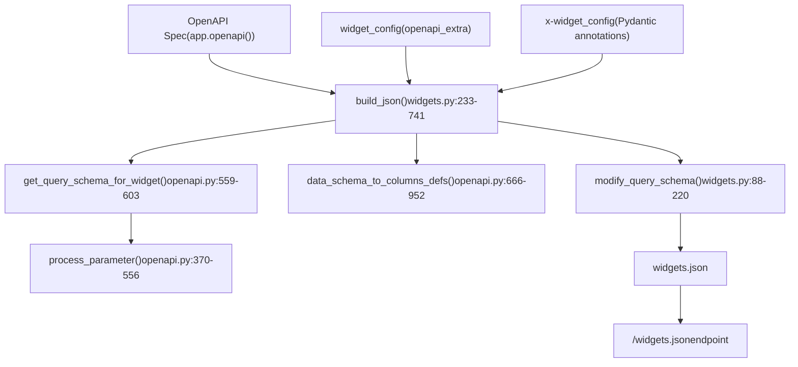
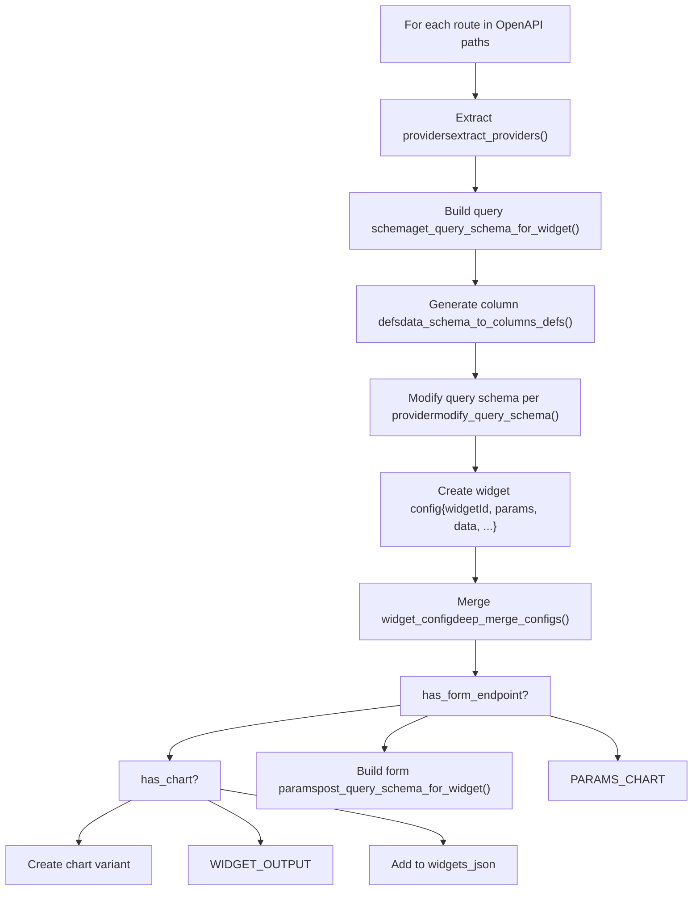
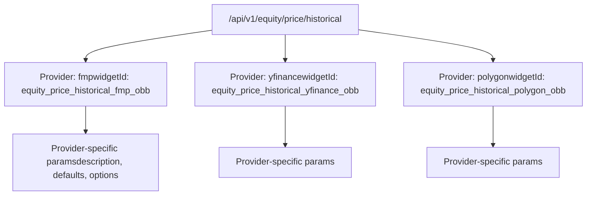
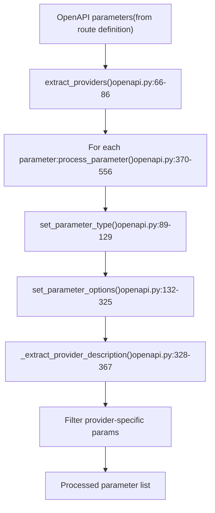
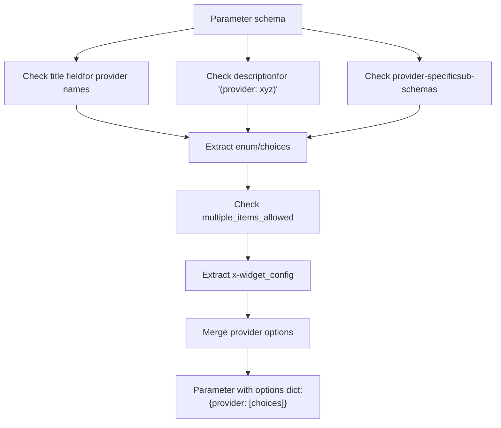
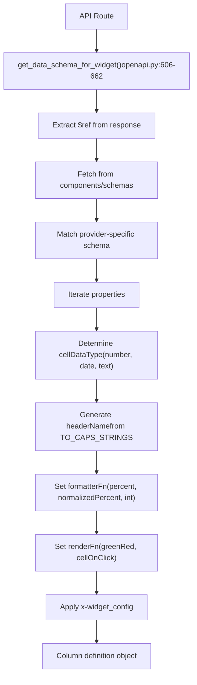
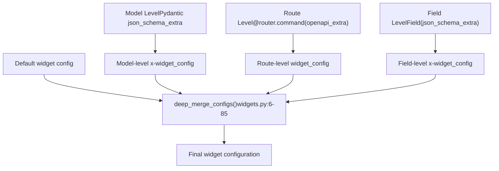
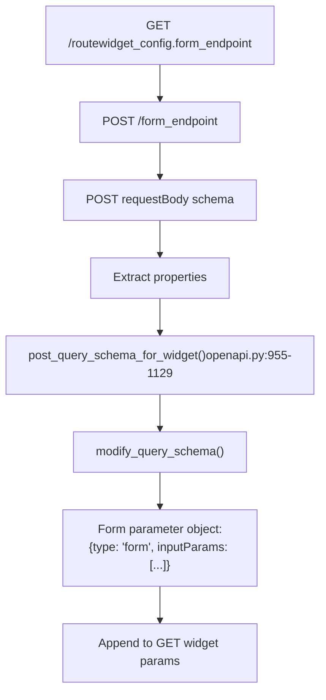
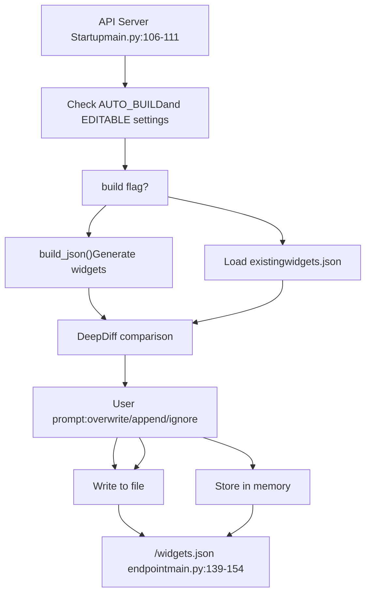

# Widget System

Relevant source files

-   [.codespell.skip](https://github.com/OpenBB-finance/OpenBB/blob/dddc3b32/.codespell.skip)
-   [openbb\_platform/core/openbb\_core/provider/standard\_models/management\_discussion\_analysis.py](https://github.com/OpenBB-finance/OpenBB/blob/dddc3b32/openbb_platform/core/openbb_core/provider/standard_models/management_discussion_analysis.py)
-   [openbb\_platform/extensions/platform\_api/README.md](https://github.com/OpenBB-finance/OpenBB/blob/dddc3b32/openbb_platform/extensions/platform_api/README.md?plain=1)
-   [openbb\_platform/extensions/platform\_api/openbb\_platform\_api/main.py](https://github.com/OpenBB-finance/OpenBB/blob/dddc3b32/openbb_platform/extensions/platform_api/openbb_platform_api/main.py)
-   [openbb\_platform/extensions/platform\_api/openbb\_platform\_api/query\_models.py](https://github.com/OpenBB-finance/OpenBB/blob/dddc3b32/openbb_platform/extensions/platform_api/openbb_platform_api/query_models.py)
-   [openbb\_platform/extensions/platform\_api/openbb\_platform\_api/response\_models.py](https://github.com/OpenBB-finance/OpenBB/blob/dddc3b32/openbb_platform/extensions/platform_api/openbb_platform_api/response_models.py)
-   [openbb\_platform/extensions/platform\_api/openbb\_platform\_api/utils/api.py](https://github.com/OpenBB-finance/OpenBB/blob/dddc3b32/openbb_platform/extensions/platform_api/openbb_platform_api/utils/api.py)
-   [openbb\_platform/extensions/platform\_api/openbb\_platform\_api/utils/openapi.py](https://github.com/OpenBB-finance/OpenBB/blob/dddc3b32/openbb_platform/extensions/platform_api/openbb_platform_api/utils/openapi.py)
-   [openbb\_platform/extensions/platform\_api/openbb\_platform\_api/utils/widgets.py](https://github.com/OpenBB-finance/OpenBB/blob/dddc3b32/openbb_platform/extensions/platform_api/openbb_platform_api/utils/widgets.py)
-   [openbb\_platform/extensions/platform\_api/poetry.lock](https://github.com/OpenBB-finance/OpenBB/blob/dddc3b32/openbb_platform/extensions/platform_api/poetry.lock)
-   [openbb\_platform/extensions/platform\_api/pyproject.toml](https://github.com/OpenBB-finance/OpenBB/blob/dddc3b32/openbb_platform/extensions/platform_api/pyproject.toml)
-   [openbb\_platform/extensions/platform\_api/tests/mock\_openapi.json](https://github.com/OpenBB-finance/OpenBB/blob/dddc3b32/openbb_platform/extensions/platform_api/tests/mock_openapi.json)
-   [openbb\_platform/extensions/platform\_api/tests/mock\_widgets.json](https://github.com/OpenBB-finance/OpenBB/blob/dddc3b32/openbb_platform/extensions/platform_api/tests/mock_widgets.json)
-   [openbb\_platform/extensions/platform\_api/tests/test\_openapi\_utils.py](https://github.com/OpenBB-finance/OpenBB/blob/dddc3b32/openbb_platform/extensions/platform_api/tests/test_openapi_utils.py)
-   [openbb\_platform/extensions/platform\_api/tests/test\_widgets\_utils.py](https://github.com/OpenBB-finance/OpenBB/blob/dddc3b32/openbb_platform/extensions/platform_api/tests/test_widgets_utils.py)
-   [openbb\_platform/extensions/regulators/integration/test\_regulators\_api.py](https://github.com/OpenBB-finance/OpenBB/blob/dddc3b32/openbb_platform/extensions/regulators/integration/test_regulators_api.py)
-   [openbb\_platform/extensions/regulators/integration/test\_regulators\_python.py](https://github.com/OpenBB-finance/OpenBB/blob/dddc3b32/openbb_platform/extensions/regulators/integration/test_regulators_python.py)
-   [openbb\_platform/extensions/regulators/openbb\_regulators/cftc/cftc\_router.py](https://github.com/OpenBB-finance/OpenBB/blob/dddc3b32/openbb_platform/extensions/regulators/openbb_regulators/cftc/cftc_router.py)
-   [openbb\_platform/extensions/regulators/openbb\_regulators/sec/sec\_router.py](https://github.com/OpenBB-finance/OpenBB/blob/dddc3b32/openbb_platform/extensions/regulators/openbb_regulators/sec/sec_router.py)
-   [openbb\_platform/providers/nasdaq/tests/record/expected\_widgets.json](https://github.com/OpenBB-finance/OpenBB/blob/dddc3b32/openbb_platform/providers/nasdaq/tests/record/expected_widgets.json)
-   [openbb\_platform/providers/sec/openbb\_sec/models/management\_discussion\_analysis.py](https://github.com/OpenBB-finance/OpenBB/blob/dddc3b32/openbb_platform/providers/sec/openbb_sec/models/management_discussion_analysis.py)
-   [openbb\_platform/providers/sec/openbb\_sec/models/schema\_files.py](https://github.com/OpenBB-finance/OpenBB/blob/dddc3b32/openbb_platform/providers/sec/openbb_sec/models/schema_files.py)
-   [openbb\_platform/providers/sec/openbb\_sec/utils/html2markdown.py](https://github.com/OpenBB-finance/OpenBB/blob/dddc3b32/openbb_platform/providers/sec/openbb_sec/utils/html2markdown.py)
-   [openbb\_platform/providers/sec/openbb\_sec/utils/xbrl\_taxonomy\_helper.py](https://github.com/OpenBB-finance/OpenBB/blob/dddc3b32/openbb_platform/providers/sec/openbb_sec/utils/xbrl_taxonomy_helper.py)
-   [openbb\_platform/providers/sec/poetry.lock](https://github.com/OpenBB-finance/OpenBB/blob/dddc3b32/openbb_platform/providers/sec/poetry.lock)
-   [openbb\_platform/providers/sec/pyproject.toml](https://github.com/OpenBB-finance/OpenBB/blob/dddc3b32/openbb_platform/providers/sec/pyproject.toml)

## Purpose and Scope

The Widget System is responsible for automatically generating and serving UI configuration metadata for the OpenBB Workspace frontend. It transforms the OpenBB Platform's OpenAPI specification into a `widgets.json` file that defines interactive components (widgets) consumable by the Workspace interface. This system enables the "connect once, consume everywhere" architecture by bridging the REST API backend with the cloud-based Workspace UI.

For information about the REST API server that generates the OpenAPI spec, see [REST API Server](/OpenBB-finance/OpenBB/5.2-rest-api-server). For details on how Workspace integrates with the API, see [OpenBB Workspace Integration](/OpenBB-finance/OpenBB/5.3-openbb-workspace-integration).

---

## System Overview

The widget system operates through a **build-time generation** or **runtime serving** model, where the OpenAPI specification is parsed and transformed into widget configurations. Each API endpoint can be represented as one or more widgets (e.g., a table widget and a chart widget for the same data).


**Sources:**

-   [openbb\_platform\_api/utils/widgets.py233-741](https://github.com/OpenBB-finance/OpenBB/blob/dddc3b32/openbb_platform_api/utils/widgets.py#L233-L741)
-   [openbb\_platform\_api/utils/openapi.py559-603](https://github.com/OpenBB-finance/OpenBB/blob/dddc3b32/openbb_platform_api/utils/openapi.py#L559-L603)
-   [openbb\_platform\_api/main.py109-111](https://github.com/OpenBB-finance/OpenBB/blob/dddc3b32/openbb_platform_api/main.py#L109-L111)

---

## Widget Generation Pipeline

### Core Generation Flow

The `build_json()` function in [openbb\_platform\_api/utils/widgets.py233-741](https://github.com/OpenBB-finance/OpenBB/blob/dddc3b32/openbb_platform_api/utils/widgets.py#L233-L741) orchestrates the entire widget generation process:


**Key Functions:**

| Function | Location | Purpose |
| --- | --- | --- |
| `build_json()` | [widgets.py233-741](https://github.com/OpenBB-finance/OpenBB/blob/dddc3b32/widgets.py#L233-L741) | Main orchestrator for widget generation |
| `get_query_schema_for_widget()` | [openapi.py559-603](https://github.com/OpenBB-finance/OpenBB/blob/dddc3b32/openapi.py#L559-L603) | Extracts and processes query parameters |
| `data_schema_to_columns_defs()` | [openapi.py666-952](https://github.com/OpenBB-finance/OpenBB/blob/dddc3b32/openapi.py#L666-L952) | Converts data schemas to table column definitions |
| `modify_query_schema()` | [widgets.py88-220](https://github.com/OpenBB-finance/OpenBB/blob/dddc3b32/widgets.py#L88-L220) | Adapts parameters for specific providers |
| `deep_merge_configs()` | [widgets.py6-85](https://github.com/OpenBB-finance/OpenBB/blob/dddc3b32/widgets.py#L6-L85) | Merges widget configurations hierarchically |

**Sources:**

-   [openbb\_platform\_api/utils/widgets.py233-741](https://github.com/OpenBB-finance/OpenBB/blob/dddc3b32/openbb_platform_api/utils/widgets.py#L233-L741)
-   [openbb\_platform\_api/utils/openapi.py559-603](https://github.com/OpenBB-finance/OpenBB/blob/dddc3b32/openbb_platform_api/utils/openapi.py#L559-L603)
-   [openbb\_platform\_api/utils/openapi.py666-952](https://github.com/OpenBB-finance/OpenBB/blob/dddc3b32/openbb_platform_api/utils/openapi.py#L666-L952)

### Provider-Specific Widget Generation

For each API route, the system generates separate widget configurations for each available provider. This is implemented in the main loop at [widgets.py336-740](https://github.com/OpenBB-finance/OpenBB/blob/dddc3b32/widgets.py#L336-L740):


Each widget receives provider-specific parameter descriptions and default values through `process_parameter()` with the `single_provider` argument set ([openapi.py370-556](https://github.com/OpenBB-finance/OpenBB/blob/dddc3b32/openapi.py#L370-L556)).

**Sources:**

-   [openbb\_platform\_api/utils/widgets.py336-340](https://github.com/OpenBB-finance/OpenBB/blob/dddc3b32/openbb_platform_api/utils/widgets.py#L336-L340)
-   [openbb\_platform\_api/utils/openapi.py370-556](https://github.com/OpenBB-finance/OpenBB/blob/dddc3b32/openbb_platform_api/utils/openapi.py#L370-L556)

---

## Widget Types and Structure

### Widget Type Determination

The system supports multiple widget types, determined by response schema analysis and explicit configuration:

| Widget Type | Trigger | Configuration Location |
| --- | --- | --- |
| `table` | Default for list responses | [widgets.py588-593](https://github.com/OpenBB-finance/OpenBB/blob/dddc3b32/widgets.py#L588-L593) |
| `chart` | `has_chart` parameter present | [widgets.py710-739](https://github.com/OpenBB-finance/OpenBB/blob/dddc3b32/widgets.py#L710-L739) |
| `metric` | `MetricResponseModel` response | [response\_models.py9-60](https://github.com/OpenBB-finance/OpenBB/blob/dddc3b32/response_models.py#L9-L60) |
| `pdf` | `PdfResponseModel` response | [response\_models.py62-103](https://github.com/OpenBB-finance/OpenBB/blob/dddc3b32/response_models.py#L62-L103) |
| `markdown` | String response schema | [widgets.py588-593](https://github.com/OpenBB-finance/OpenBB/blob/dddc3b32/widgets.py#L588-L593) |
| `omni` | `OmniWidgetResponseModel` response | [response\_models.py105-220](https://github.com/OpenBB-finance/OpenBB/blob/dddc3b32/response_models.py#L105-L220) |
| `form` | Has `form_endpoint` in widget\_config | [widgets.py388-523](https://github.com/OpenBB-finance/OpenBB/blob/dddc3b32/widgets.py#L388-L523) |

### Standard Widget Structure

Every widget in `widgets.json` follows this structure, as defined in [widgets.py594-615](https://github.com/OpenBB-finance/OpenBB/blob/dddc3b32/widgets.py#L594-L615):

```
{  "widgetId": "economy_survey_sloos_fred_obb",  "name": "SLOOS",  "description": "Get Senior Loan Officers Opinion Survey.",  "category": "Economy",  "subCategory": "Survey",  "type": "table",  "endpoint": "/api/v1/economy/survey/sloos",  "params": [...],  "data": {    "dataKey": "results",    "table": {      "showAll": true,      "columnsDefs": [...]    }  },  "source": ["FRED"],  "gridData": {"w": 40, "h": 15},  "runButton": false}
```
**Sources:**

-   [openbb\_platform\_api/utils/widgets.py594-615](https://github.com/OpenBB-finance/OpenBB/blob/dddc3b32/openbb_platform_api/utils/widgets.py#L594-L615)
-   [openbb\_platform\_api/tests/mock\_widgets.json1-180](https://github.com/OpenBB-finance/OpenBB/blob/dddc3b32/openbb_platform_api/tests/mock_widgets.json#L1-L180)

---

## Parameter Processing

### Query Parameter Extraction and Transformation

The `get_query_schema_for_widget()` function ([openapi.py559-603](https://github.com/OpenBB-finance/OpenBB/blob/dddc3b32/openapi.py#L559-L603)) extracts parameters from the OpenAPI spec and transforms them into widget-compatible format:


### Parameter Type Mapping

The `set_parameter_type()` function ([openapi.py89-129](https://github.com/OpenBB-finance/OpenBB/blob/dddc3b32/openapi.py#L89-L129)) maps OpenAPI types to widget input types:

| OpenAPI Type | Condition | Widget Type |
| --- | --- | --- |
| `string` | Default | `"text"` |
| `integer`, `float` | Default | `"number"` |
| `boolean` | Default | `"boolean"` |
| `string` | Parameter name contains "date" | `"date"` |
| `array`, `list` | Default | `"text"` |

### Provider-Specific Options

The `set_parameter_options()` function ([openapi.py132-325](https://github.com/OpenBB-finance/OpenBB/blob/dddc3b32/openapi.py#L132-L325)) handles complex provider-specific choice extraction:


**Example parameter with provider-specific options:**

```
{  "paramName": "country",  "label": "Country",  "type": "text",  "options": {    "fred": [      {"label": "argentina", "value": "argentina"},      {"label": "australia", "value": "australia"}    ]  },  "available_providers": ["fred"]}
```
**Sources:**

-   [openbb\_platform\_api/utils/openapi.py559-603](https://github.com/OpenBB-finance/OpenBB/blob/dddc3b32/openbb_platform_api/utils/openapi.py#L559-L603)
-   [openbb\_platform\_api/utils/openapi.py89-129](https://github.com/OpenBB-finance/OpenBB/blob/dddc3b32/openbb_platform_api/utils/openapi.py#L89-L129)
-   [openbb\_platform\_api/utils/openapi.py132-325](https://github.com/OpenBB-finance/OpenBB/blob/dddc3b32/openbb_platform_api/utils/openapi.py#L132-L325)

---

## Data Schema to Column Definitions

### Column Definition Generation

The `data_schema_to_columns_defs()` function ([openapi.py666-952](https://github.com/OpenBB-finance/OpenBB/blob/dddc3b32/openapi.py#L666-L952)) converts Pydantic response models into table column configurations:


### Column Definition Structure

Each column definition includes:

```
{  "field": "date",  "headerName": "Date",  "headerTooltip": "The date of the data.",  "cellDataType": "date",  "formatterFn": null,  "pinned": "left"}
```
**Special formatting rules** are applied based on field properties ([openapi.py824-950](https://github.com/OpenBB-finance/OpenBB/blob/dddc3b32/openapi.py#L824-L950)):

| Condition | Formatter | Render Function |
| --- | --- | --- |
| `x-unit_measurement: "percent"` | `"percent"` or `"normalizedPercent"` | `"greenRed"` |
| Field type is `integer` | `"int"` | \- |
| Field name in `["delta", "theta", "rho"]` | `"none"` | `"greenRed"` |
| Field name is `"change"` | \- | `"greenRed"` |

**Sources:**

-   [openbb\_platform\_api/utils/openapi.py666-952](https://github.com/OpenBB-finance/OpenBB/blob/dddc3b32/openbb_platform_api/utils/openapi.py#L666-L952)
-   [openbb\_platform\_api/utils/openapi.py606-662](https://github.com/OpenBB-finance/OpenBB/blob/dddc3b32/openbb_platform_api/utils/openapi.py#L606-L662)

---

## Widget Configuration Annotations

### The x-widget\_config System

Widget behavior can be customized through `x-widget_config` annotations at multiple levels in the OpenAPI spec:


### Common x-widget\_config Options

**For Parameters:**

```
{  "x-widget_config": {    "multiSelect": true,    "exclude": false,    "show": true,    "style": {"popupWidth": 400}  }}
```
**For Response Fields:**

```
{  "x-widget_config": {    "formatterFn": "normalizedPercent",    "renderFn": "greenRed",    "hide": true,    "pinned": "left"  }}
```
**For Widget-Level Configuration:**

```
{  "widget_config": {    "type": "chart",    "gridData": {"w": 40, "h": 20},    "exclude": false,    "form_endpoint": "/some_post_endpoint"  }}
```
### Variable Key Syntax

Configuration can target specific parts of the widget structure using the `$.` prefix ([widgets.py498-557](https://github.com/OpenBB-finance/OpenBB/blob/dddc3b32/widgets.py#L498-L557)):

```
{  "x-widget_config": {    "$.type": "metric",    "$.data": {"dataKey": "results.value"},    "$.params": [{"paramName": "custom", "value": "test"}]  }}
```
**Sources:**

-   [openbb\_platform\_api/utils/widgets.py6-85](https://github.com/OpenBB-finance/OpenBB/blob/dddc3b32/openbb_platform_api/utils/widgets.py#L6-L85)
-   [openbb\_platform\_api/utils/widgets.py498-557](https://github.com/OpenBB-finance/OpenBB/blob/dddc3b32/openbb_platform_api/utils/widgets.py#L498-L557)
-   [openbb\_platform\_api/README.md243-339](https://github.com/OpenBB-finance/OpenBB/blob/dddc3b32/openbb_platform_api/README.md?plain=1#L243-L339)

---

## Form Widgets and POST Endpoints

### Form Endpoint Integration

When a GET route specifies a `form_endpoint` in its `widget_config`, the system generates form input parameters from a POST endpoint ([widgets.py388-523](https://github.com/OpenBB-finance/OpenBB/blob/dddc3b32/widgets.py#L388-L523)):


### Form Parameter Structure

Form parameters are embedded as a special parameter type:

```
{  "type": "form",  "paramName": "form_data",  "label": "Form",  "endpoint": "/api/v1/post_endpoint",  "inputParams": [    {      "paramName": "field1",      "label": "Field 1",      "type": "text",      "value": "default"    }  ]}
```
**Sources:**

-   [openbb\_platform\_api/utils/widgets.py388-523](https://github.com/OpenBB-finance/OpenBB/blob/dddc3b32/openbb_platform_api/utils/widgets.py#L388-L523)
-   [openbb\_platform\_api/utils/openapi.py955-1129](https://github.com/OpenBB-finance/OpenBB/blob/dddc3b32/openbb_platform_api/utils/openapi.py#L955-L1129)

---

## Runtime Widget Serving

### Editable vs. Built-In Mode

The widget system supports two serving modes, configured at API launch ([main.py109-111](https://github.com/OpenBB-finance/OpenBB/blob/dddc3b32/main.py#L109-L111)):

| Mode | Trigger | Behavior |
| --- | --- | --- |
| **Built-in** | Default | Widgets generated once at startup, served from memory |
| **Editable** | `--editable` flag or `--widgets-json` path | Widgets written to file, can be modified and reloaded |

### Serving Flow


### The /widgets.json Endpoint

The endpoint at [main.py139-154](https://github.com/OpenBB-finance/OpenBB/blob/dddc3b32/main.py#L139-L154) serves the widgets configuration:

```
@app.get("/widgets.json")async def get_widgets():    """Widgets configuration file for the OpenBB Workspace."""    global FIRST_RUN    if FIRST_RUN is True:        FIRST_RUN = False        return JSONResponse(content=widgets_json, headers=obb_headers)    if EDITABLE:        return JSONResponse(            content=get_widgets_json(                False, openapi, widget_exclude_filter, EDITABLE, WIDGETS_PATH, app            ),            headers=obb_headers,        )    return JSONResponse(content=widgets_json, headers=obb_headers)
```
When `EDITABLE` mode is enabled, the endpoint reloads the widgets from disk on each request, allowing runtime modifications.

**Sources:**

-   [openbb\_platform\_api/main.py109-111](https://github.com/OpenBB-finance/OpenBB/blob/dddc3b32/openbb_platform_api/main.py#L109-L111)
-   [openbb\_platform\_api/main.py139-154](https://github.com/OpenBB-finance/OpenBB/blob/dddc3b32/openbb_platform_api/main.py#L139-L154)
-   [openbb\_platform\_api/utils/api.py110-210](https://github.com/OpenBB-finance/OpenBB/blob/dddc3b32/openbb_platform_api/utils/api.py#L110-L210)

---

## Widget Filtering and Exclusion

### Widget Exclusion Mechanisms

Widgets can be filtered from generation through multiple mechanisms:

1.  **Command-line argument**: `--exclude` ([main.py65](https://github.com/OpenBB-finance/OpenBB/blob/dddc3b32/main.py#L65-L65))
2.  **widget\_settings.json file**: `exclude` array ([main.py75-84](https://github.com/OpenBB-finance/OpenBB/blob/dddc3b32/main.py#L75-L84))
3.  **Widget-level exclusion**: `widget_config.exclude: true` ([widgets.py311-312](https://github.com/OpenBB-finance/OpenBB/blob/dddc3b32/widgets.py#L311-L312))
4.  **Platform extension detection**: Automatic exclusion of data-processing extensions ([main.py87-106](https://github.com/OpenBB-finance/OpenBB/blob/dddc3b32/main.py#L87-L106))

### Wildcard Filtering

The exclusion system supports wildcard patterns for entire routes ([widgets.py284-296](https://github.com/OpenBB-finance/OpenBB/blob/dddc3b32/widgets.py#L284-L296)):

```
widget_exclude_filter = [    "/api/v1/econometrics/*",  # Exclude entire econometrics route    "specific_widget_id"        # Exclude specific widget]
```
**Sources:**

-   [openbb\_platform\_api/main.py65-106](https://github.com/OpenBB-finance/OpenBB/blob/dddc3b32/openbb_platform_api/main.py#L65-L106)
-   [openbb\_platform\_api/utils/widgets.py284-296](https://github.com/OpenBB-finance/OpenBB/blob/dddc3b32/openbb_platform_api/utils/widgets.py#L284-L296)

---

## Example: Complete Widget Generation

### From OpenAPI Route to Widget

Consider this route definition at [openbb\_regulators/sec/sec\_router.py50-75](https://github.com/OpenBB-finance/OpenBB/blob/dddc3b32/openbb_regulators/sec/sec_router.py#L50-L75):

```
@router.command(    model="SecHtmFile",    openapi_extra={        "widget_config": {            "name": "Open HTML",            "description": "Open a HTM/HTML document from the SEC website.",            "gridData": {"w": 40, "h": 25},            "refetchInterval": False,            "type": "markdown",            "data": {"dataKey": "results.content"},        }    },)async def htm_file(...) -> OBBject:    """Download a raw HTML object from the SEC website."""
```
### Generated Widget Output

The widget system produces:

```
{  "sec_htm_file_sec_obb": {    "name": "Open HTML",    "description": "Open a HTM/HTML document from the SEC website.",    "category": "Sec",    "type": "markdown",    "widgetId": "sec_htm_file_sec_obb",    "params": [      {        "paramName": "url",        "label": "URL",        "description": "URL of the SEC document.",        "type": "text",        "value": null,        "show": true      },      {        "paramName": "provider",        "value": "sec",        "show": false      }    ],    "endpoint": "/api/v1/regulators/sec/htm_file",    "gridData": {"w": 40, "h": 25},    "data": {"dataKey": "results.content"},    "source": ["SEC"],    "refetchInterval": false  }}
```
**Sources:**

-   [openbb\_regulators/sec/sec\_router.py50-75](https://github.com/OpenBB-finance/OpenBB/blob/dddc3b32/openbb_regulators/sec/sec_router.py#L50-L75)
-   [openbb\_platform\_api/utils/widgets.py594-664](https://github.com/OpenBB-finance/OpenBB/blob/dddc3b32/openbb_platform_api/utils/widgets.py#L594-L664)
