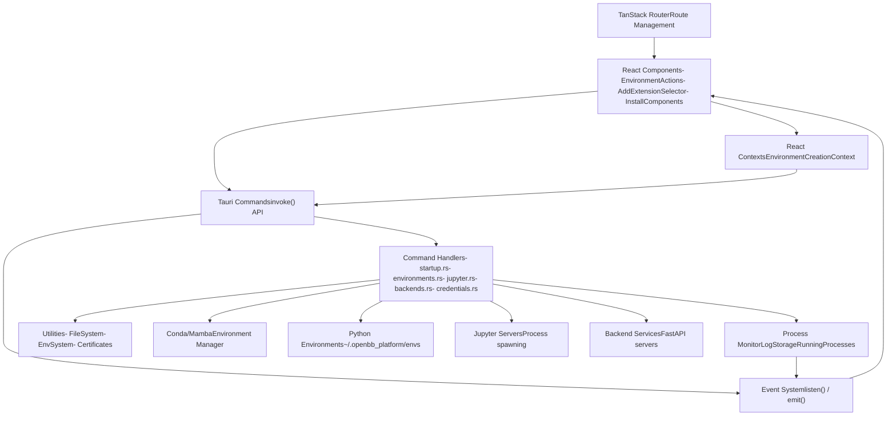
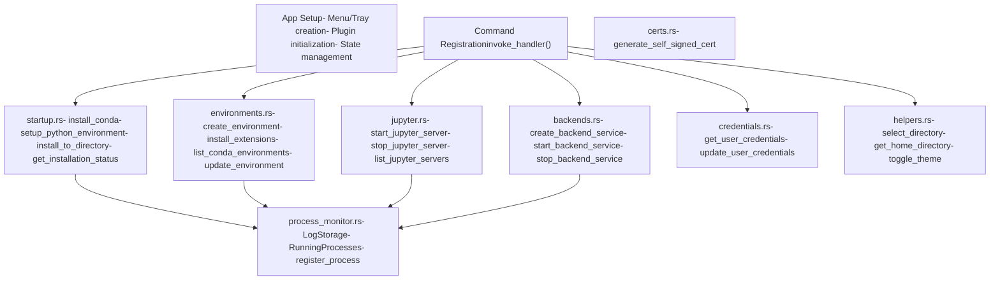
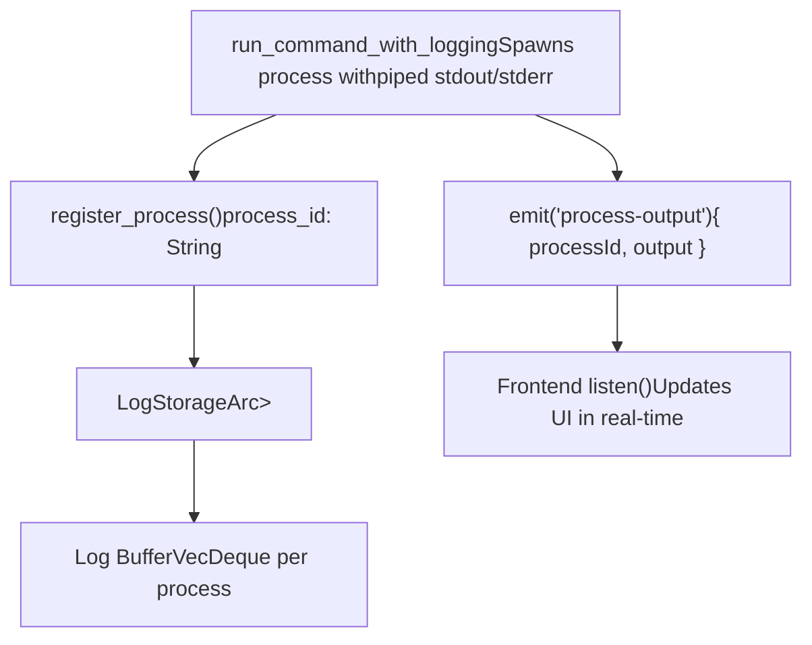
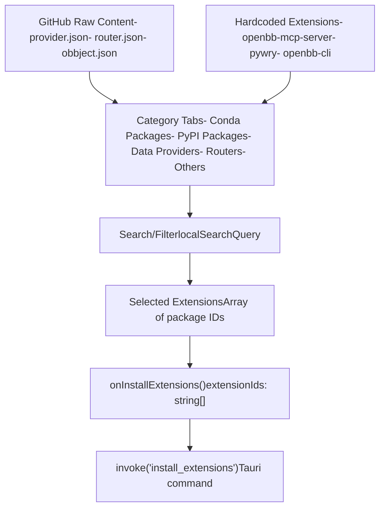
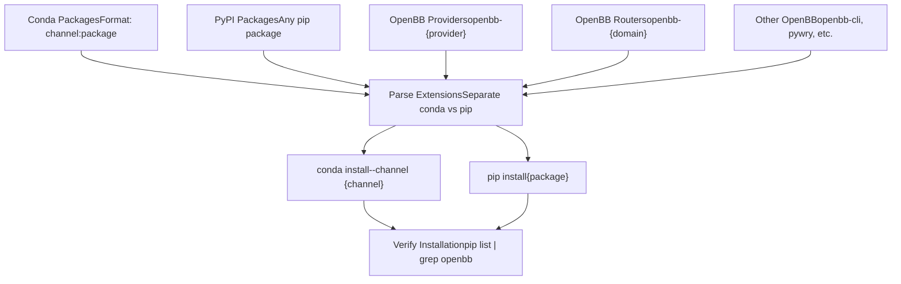
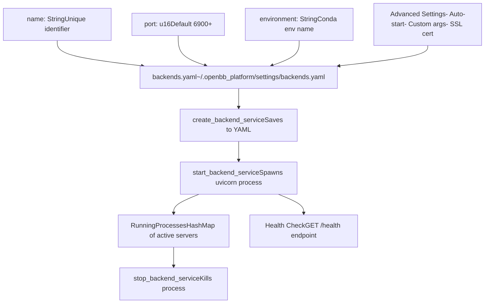

# Desktop Application

Relevant source files

-   [desktop/Cargo.lock](https://github.com/OpenBB-finance/OpenBB/blob/dddc3b32/desktop/Cargo.lock)
-   [desktop/package-lock.json](https://github.com/OpenBB-finance/OpenBB/blob/dddc3b32/desktop/package-lock.json)
-   [desktop/package.json](https://github.com/OpenBB-finance/OpenBB/blob/dddc3b32/desktop/package.json)
-   [desktop/src-tauri/Cargo.toml](https://github.com/OpenBB-finance/OpenBB/blob/dddc3b32/desktop/src-tauri/Cargo.toml)
-   [desktop/src-tauri/src/main.rs](https://github.com/OpenBB-finance/OpenBB/blob/dddc3b32/desktop/src-tauri/src/main.rs)
-   [desktop/src-tauri/src/tauri\_handlers/environments.rs](https://github.com/OpenBB-finance/OpenBB/blob/dddc3b32/desktop/src-tauri/src/tauri_handlers/environments.rs)
-   [desktop/src-tauri/src/tauri\_handlers/startup.rs](https://github.com/OpenBB-finance/OpenBB/blob/dddc3b32/desktop/src-tauri/src/tauri_handlers/startup.rs)
-   [desktop/src-tauri/tauri.conf.json](https://github.com/OpenBB-finance/OpenBB/blob/dddc3b32/desktop/src-tauri/tauri.conf.json)
-   [desktop/src/components/AddExtensionSelector.tsx](https://github.com/OpenBB-finance/OpenBB/blob/dddc3b32/desktop/src/components/AddExtensionSelector.tsx)
-   [desktop/src/components/InstallComponents.tsx](https://github.com/OpenBB-finance/OpenBB/blob/dddc3b32/desktop/src/components/InstallComponents.tsx)
-   [desktop/src/main.tsx](https://github.com/OpenBB-finance/OpenBB/blob/dddc3b32/desktop/src/main.tsx)
-   [desktop/src/routes/environments.tsx](https://github.com/OpenBB-finance/OpenBB/blob/dddc3b32/desktop/src/routes/environments.tsx)
-   [desktop/src/routes/installation-progress.tsx](https://github.com/OpenBB-finance/OpenBB/blob/dddc3b32/desktop/src/routes/installation-progress.tsx)
-   [desktop/src/tests/setup.ts](https://github.com/OpenBB-finance/OpenBB/blob/dddc3b32/desktop/src/tests/setup.ts)
-   [frontend-components/plotly/package-lock.json](https://github.com/OpenBB-finance/OpenBB/blob/dddc3b32/frontend-components/plotly/package-lock.json)
-   [frontend-components/plotly/package.json](https://github.com/OpenBB-finance/OpenBB/blob/dddc3b32/frontend-components/plotly/package.json)
-   [frontend-components/tables/package-lock.json](https://github.com/OpenBB-finance/OpenBB/blob/dddc3b32/frontend-components/tables/package-lock.json)
-   [frontend-components/tables/package.json](https://github.com/OpenBB-finance/OpenBB/blob/dddc3b32/frontend-components/tables/package.json)
-   [openbb\_platform/obbject\_extensions/charting/openbb\_charting/core/table.html](https://github.com/OpenBB-finance/OpenBB/blob/dddc3b32/openbb_platform/obbject_extensions/charting/openbb_charting/core/table.html)

The OpenBB Desktop Application is a cross-platform desktop tool built with Tauri (Rust + React) that provides a graphical interface for managing Python environments, installing OpenBB extensions, running API backend servers, and launching Jupyter notebooks. It serves as the primary environment management and development tool for the OpenBB Platform ecosystem, handling conda environment creation, package installation, and server orchestration without requiring users to interact with command-line tools directly.

For information about the REST API server that the desktop application manages, see [REST API Server](/OpenBB-finance/OpenBB/5.2-rest-api-server). For the OpenBB Workspace that connects to these local backends, see [OpenBB Workspace Integration](/OpenBB-finance/OpenBB/5.3-openbb-workspace-integration).

## Architecture Overview

The desktop application follows a hybrid architecture pattern where Rust handles system-level operations (process management, file system access, conda operations) and React provides the user interface. Communication between the frontend and backend occurs through Tauri's command system, which exposes Rust functions as asynchronous JavaScript APIs.


**Sources**: [desktop/package.json1-78](https://github.com/OpenBB-finance/OpenBB/blob/dddc3b32/desktop/package.json#L1-L78) [desktop/src-tauri/Cargo.toml1-78](https://github.com/OpenBB-finance/OpenBB/blob/dddc3b32/desktop/src-tauri/Cargo.toml#L1-L78) [desktop/src-tauri/src/main.rs1-300](https://github.com/OpenBB-finance/OpenBB/blob/dddc3b32/desktop/src-tauri/src/main.rs#L1-L300) [desktop/src/main.tsx1-39](https://github.com/OpenBB-finance/OpenBB/blob/dddc3b32/desktop/src/main.tsx#L1-L39)

## Technology Stack

| Component | Technology | Purpose |
| --- | --- | --- |
| **Application Framework** | Tauri 2.9.6 | Cross-platform desktop application framework |
| **Backend Runtime** | Rust 1.90.0 | System operations, process management |
| **Frontend Framework** | React 18.3.1 | User interface |
| **Bundler** | Vite 7.2.2 | Frontend build tool |
| **Router** | TanStack Router 1.131.27 | Client-side routing |
| **UI Components** | @openbb/ui-pro 0.6.10 | Shared UI component library |
| **Async Runtime** | Tokio 1.47.1 | Rust async operations |
| **HTTP Client** | reqwest 0.12.23 | API calls from Rust |
| **State Management** | React Hooks | Component state |

**Sources**: [desktop/package.json16-72](https://github.com/OpenBB-finance/OpenBB/blob/dddc3b32/desktop/package.json#L16-L72) [desktop/src-tauri/Cargo.toml16-50](https://github.com/OpenBB-finance/OpenBB/blob/dddc3b32/desktop/src-tauri/Cargo.toml#L16-L50)

## Rust Backend Architecture

### Command Handler Structure

The Rust backend exposes functionality through Tauri command handlers organized into modules. Each module handles a specific domain of operations.


**Sources**: [desktop/src-tauri/src/main.rs20-50](https://github.com/OpenBB-finance/OpenBB/blob/dddc3b32/desktop/src-tauri/src/main.rs#L20-L50) [desktop/src-tauri/src/tauri\_handlers/startup.rs1-30](https://github.com/OpenBB-finance/OpenBB/blob/dddc3b32/desktop/src-tauri/src/tauri_handlers/startup.rs#L1-L30) [desktop/src-tauri/src/tauri\_handlers/environments.rs1-157](https://github.com/OpenBB-finance/OpenBB/blob/dddc3b32/desktop/src-tauri/src/tauri_handlers/environments.rs#L1-L157)

### Process Monitoring System

The application tracks spawned processes (conda commands, pip installs, Jupyter servers, backend APIs) using a centralized logging system. This enables real-time log streaming to the frontend and process lifecycle management.


**Sources**: [desktop/src-tauri/src/main.rs74-92](https://github.com/OpenBB-finance/OpenBB/blob/dddc3b32/desktop/src-tauri/src/main.rs#L74-L92) [desktop/src-tauri/src/tauri\_handlers/environments.rs14-105](https://github.com/OpenBB-finance/OpenBB/blob/dddc3b32/desktop/src-tauri/src/tauri_handlers/environments.rs#L14-L105)

## React Frontend Architecture

### Route Structure

The frontend uses TanStack Router for file-based routing. Key routes handle different phases of the application lifecycle.

| Route | Component | Purpose |
| --- | --- | --- |
| `/` | index.tsx | Landing/home screen |
| `/installation-progress` | installation-progress.tsx | Initial installation wizard |
| `/environments` | environments.tsx | Environment management UI |
| `/backends` | (likely in routes) | Backend service management |

**Sources**: [desktop/src/main.tsx17-27](https://github.com/OpenBB-finance/OpenBB/blob/dddc3b32/desktop/src/main.tsx#L17-L27) [desktop/src/routes/installation-progress.tsx1-10](https://github.com/OpenBB-finance/OpenBB/blob/dddc3b32/desktop/src/routes/installation-progress.tsx#L1-L10) [desktop/src/routes/environments.tsx1-15](https://github.com/OpenBB-finance/OpenBB/blob/dddc3b32/desktop/src/routes/environments.tsx#L1-L15)

### Key Components

**AddExtensionSelector Component**

Provides a categorized interface for selecting and installing OpenBB extensions, conda packages, and PyPI packages. Fetches extension metadata from GitHub.


**Sources**: [desktop/src/components/AddExtensionSelector.tsx1-50](https://github.com/OpenBB-finance/OpenBB/blob/dddc3b32/desktop/src/components/AddExtensionSelector.tsx#L1-L50) [desktop/src/components/AddExtensionSelector.tsx237-262](https://github.com/OpenBB-finance/OpenBB/blob/dddc3b32/desktop/src/components/AddExtensionSelector.tsx#L237-L262)

**InstallComponents**

Provides reusable UI components for the installation flow, including Python version selection and extension selection.

-   `PythonVersionSelector`: Radio button group for selecting Python 3.10-3.14
-   `ExtensionSelector`: Full extension browsing and selection interface

**Sources**: [desktop/src/components/InstallComponents.tsx1-104](https://github.com/OpenBB-finance/OpenBB/blob/dddc3b32/desktop/src/components/InstallComponents.tsx#L1-L104) [desktop/src/components/InstallComponents.tsx106-258](https://github.com/OpenBB-finance/OpenBB/blob/dddc3b32/desktop/src/components/InstallComponents.tsx#L106-L258)

## Environment Management

The desktop application manages conda/mamba environments in `~/.openbb_platform/envs/`. Each environment contains a Python interpreter and installed OpenBB packages.

### Environment Creation Flow

> **[Mermaid sequence]**
> *(图表结构无法解析)*

**Sources**: [desktop/src/routes/environments.tsx1-200](https://github.com/OpenBB-finance/OpenBB/blob/dddc3b32/desktop/src/routes/environments.tsx#L1-L200) [desktop/src-tauri/src/tauri\_handlers/environments.rs118-300](https://github.com/OpenBB-finance/OpenBB/blob/dddc3b32/desktop/src-tauri/src/tauri_handlers/environments.rs#L118-L300)

### Extension Installation

Extensions can be installed into existing environments. The system supports:

-   **OpenBB Providers**: Data providers (e.g., `openbb-fmp`, `openbb-fred`)
-   **OpenBB Routers**: API extensions (e.g., `openbb-economy`, `openbb-equity`)
-   **OBBject Extensions**: Output modifiers (e.g., `openbb-charting`)
-   **Conda Packages**: System dependencies with channel support
-   **PyPI Packages**: Any pip-installable package


**Sources**: [desktop/src/components/AddExtensionSelector.tsx22-48](https://github.com/OpenBB-finance/OpenBB/blob/dddc3b32/desktop/src/components/AddExtensionSelector.tsx#L22-L48) [desktop/src-tauri/src/tauri\_handlers/environments.rs400-600](https://github.com/OpenBB-finance/OpenBB/blob/dddc3b32/desktop/src-tauri/src/tauri_handlers/environments.rs#L400-L600)

### Environment Actions

The `EnvironmentActions` component provides operations on existing environments:

| Action | Tauri Command | Description |
| --- | --- | --- |
| **Start Backend** | `create_backend_service` | Creates and starts FastAPI server |
| **Start Jupyter** | `start_jupyter_server` | Launches Jupyter Lab |
| **Update** | `update_environment` | Updates all packages |
| **Add Extensions** | `install_extensions` | Installs new packages |
| **Remove Extension** | `remove_extension` | Uninstalls a package |
| **Delete** | `remove_environment` | Deletes entire environment |

**Sources**: [desktop/src/components/EnvironmentActions.tsx1-100](https://github.com/OpenBB-finance/OpenBB/blob/dddc3b32/desktop/src/components/EnvironmentActions.tsx#L1-L100) (referenced but not provided in full)

## Backend Service Management

The desktop application can create multiple "backend services" - instances of the OpenBB Platform API server running on different ports with different configurations. Each backend service is tied to a specific conda environment.

### Backend Service Structure


**Sources**: [desktop/src-tauri/src/tauri\_handlers/backends.rs1-300](https://github.com/OpenBB-finance/OpenBB/blob/dddc3b32/desktop/src-tauri/src/tauri_handlers/backends.rs#L1-L300) (referenced in main.rs), [desktop/src-tauri/src/main.rs41-45](https://github.com/OpenBB-finance/OpenBB/blob/dddc3b32/desktop/src-tauri/src/main.rs#L41-L45)

### Default Backend Creation

On first installation, the system automatically creates a default backend service named "default" pointing to the base environment on port 6900. This ensures immediate usability.

**Sources**: [desktop/src-tauri/src/tauri\_handlers/startup.rs500-600](https://github.com/OpenBB-finance/OpenBB/blob/dddc3b32/desktop/src-tauri/src/tauri_handlers/startup.rs#L500-L600) (referenced in main.rs line 23)

## Jupyter Integration

The desktop application can start Jupyter Lab servers for each conda environment, enabling notebook-based development.

### Jupyter Server Management

> **[Mermaid sequence]**
> *(图表结构无法解析)*

**Key Functions**:

-   `start_jupyter_server(env_name: String)`: Spawns Jupyter Lab in the environment
-   `stop_jupyter_server(env_name: String)`: Terminates the Jupyter process
-   `list_jupyter_servers()`: Returns all running Jupyter instances
-   `check_jupyter_server(env_name: String)`: Polls server health

**Sources**: [desktop/src-tauri/src/main.rs33-37](https://github.com/OpenBB-finance/OpenBB/blob/dddc3b32/desktop/src-tauri/src/main.rs#L33-L37) [desktop/src-tauri/src/tauri\_handlers/jupyter.rs1-200](https://github.com/OpenBB-finance/OpenBB/blob/dddc3b32/desktop/src-tauri/src/tauri_handlers/jupyter.rs#L1-L200) (referenced)

## Installation Flow

The desktop application includes a first-run installation wizard that downloads and installs conda/mamba, creates a base Python environment, and installs core OpenBB packages.

### Installation Phases

> **[Mermaid stateDiagram]**
> *(图表结构无法解析)*

### Installation State Management

The Rust backend maintains installation state in `INSTALLATION_STATE` global mutex:

```
pub struct InstallationState {    pub is_downloading: bool,    pub is_installing: bool,    pub is_configuring: bool,    pub is_complete: bool,    pub message: String,}
```
Frontend polls `get_installation_status()` command and listens to `process-output` events for real-time progress updates.

**Sources**: [desktop/src/routes/installation-progress.tsx10-100](https://github.com/OpenBB-finance/OpenBB/blob/dddc3b32/desktop/src/routes/installation-progress.tsx#L10-L100) [desktop/src-tauri/src/tauri\_handlers/startup.rs15-130](https://github.com/OpenBB-finance/OpenBB/blob/dddc3b32/desktop/src-tauri/src/tauri_handlers/startup.rs#L15-L130)

### Conda Installation

If conda/mamba is not found in the system PATH, the application downloads Miniforge (a minimal conda distribution with conda-forge as default channel):

1.  **Detection**: Checks for `conda` or `mamba` in PATH
2.  **Download**: Fetches platform-specific Miniforge installer from GitHub
3.  **Installation**: Runs silent installer to `~/.openbb_platform/conda`
4.  **Verification**: Tests conda/mamba availability

**Sources**: [desktop/src-tauri/src/tauri\_handlers/startup.rs200-400](https://github.com/OpenBB-finance/OpenBB/blob/dddc3b32/desktop/src-tauri/src/tauri_handlers/startup.rs#L200-L400)

## Update System

The desktop application uses Tauri's plugin-updater to check for new releases and apply updates automatically.

### Update Configuration

-   **Update Endpoint**: `https://github.com/OpenBB-finance/OpenBB/releases/download/ODP/latest.json`
-   **Public Key**: Embedded in `tauri.conf.json` for signature verification
-   **Check Frequency**: On startup and via manual "Check for Updates" menu item

**Sources**: [desktop/src-tauri/tauri.conf.json58-64](https://github.com/OpenBB-finance/OpenBB/blob/dddc3b32/desktop/src-tauri/tauri.conf.json#L58-L64) [desktop/src-tauri/src/main.rs94-150](https://github.com/OpenBB-finance/OpenBB/blob/dddc3b32/desktop/src-tauri/src/main.rs#L94-L150)

## Configuration and Storage

The application stores configuration in platform-specific user data directories:

| Platform | Base Path |
| --- | --- |
| **macOS** | `~/Library/Application Support/co.openbb.platform/` |
| **Windows** | `%APPDATA%\co.openbb.platform\` |
| **Linux** | `~/.local/share/co.openbb.platform/` |

### Key Files

| File | Location | Purpose |
| --- | --- | --- |
| `backends.yaml` | `{settings}/backends.yaml` | Backend service definitions |
| `user_settings.json` | `~/.openbb_platform/user_settings.json` | OpenBB user credentials |
| `system_settings.json` | `~/.openbb_platform/system_settings.json` | OpenBB system config |
| Environment YAML | `~/.openbb_platform/envs/{name}/env.yaml` | Per-environment metadata |

**Sources**: [desktop/src-tauri/src/main.rs51-54](https://github.com/OpenBB-finance/OpenBB/blob/dddc3b32/desktop/src-tauri/src/main.rs#L51-L54) [desktop/src-tauri/src/tauri\_handlers/environments.rs150-200](https://github.com/OpenBB-finance/OpenBB/blob/dddc3b32/desktop/src-tauri/src/tauri_handlers/environments.rs#L150-L200)

## Development Setup

### Prerequisites

-   Node.js 18+
-   Rust 1.90+
-   Platform-specific tools (Xcode on macOS, Visual Studio on Windows, build-essential on Linux)

### Build Commands

```
# Install dependenciesnpm install # Development mode (hot reload)npm run dev # Production buildnpm run build # Tauri-specific commandsnpm run tauri dev    # Run in Tauri dev modenpm run tauri build  # Create distributable
```
**Sources**: [desktop/package.json7-14](https://github.com/OpenBB-finance/OpenBB/blob/dddc3b32/desktop/package.json#L7-L14)

### Project Structure

```
desktop/
├── src/                     # React frontend
│   ├── routes/             # TanStack Router routes
│   ├── components/         # React components
│   ├── contexts/           # React contexts
│   ├── tests/             # Vitest tests
│   └── main.tsx           # Entry point
├── src-tauri/              # Rust backend
│   ├── src/
│   │   ├── main.rs        # Tauri setup
│   │   ├── tauri_handlers/ # Command handlers
│   │   ├── utils/         # Utilities
│   │   └── uninstall.rs   # Uninstall logic
│   ├── Cargo.toml         # Rust dependencies
│   └── tauri.conf.json    # Tauri configuration
└── package.json            # Node dependencies
```
**Sources**: [desktop/package.json1-78](https://github.com/OpenBB-finance/OpenBB/blob/dddc3b32/desktop/package.json#L1-L78) [desktop/src-tauri/Cargo.toml1-78](https://github.com/OpenBB-finance/OpenBB/blob/dddc3b32/desktop/src-tauri/Cargo.toml#L1-L78)

## Testing

The application uses Vitest for React component testing with jsdom for DOM simulation.

-   **Test Setup**: [desktop/src/tests/setup.ts1-57](https://github.com/OpenBB-finance/OpenBB/blob/dddc3b32/desktop/src/tests/setup.ts#L1-L57)
-   **Mocked Dependencies**: `@openbb/ui-pro`, `ResizeObserver`, `localStorage`
-   **Test Command**: `npm run test`

**Sources**: [desktop/package.json12](https://github.com/OpenBB-finance/OpenBB/blob/dddc3b32/desktop/package.json#L12-L12) [desktop/src/tests/setup.ts1-57](https://github.com/OpenBB-finance/OpenBB/blob/dddc3b32/desktop/src/tests/setup.ts#L1-L57)
