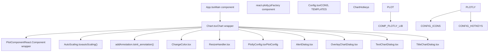
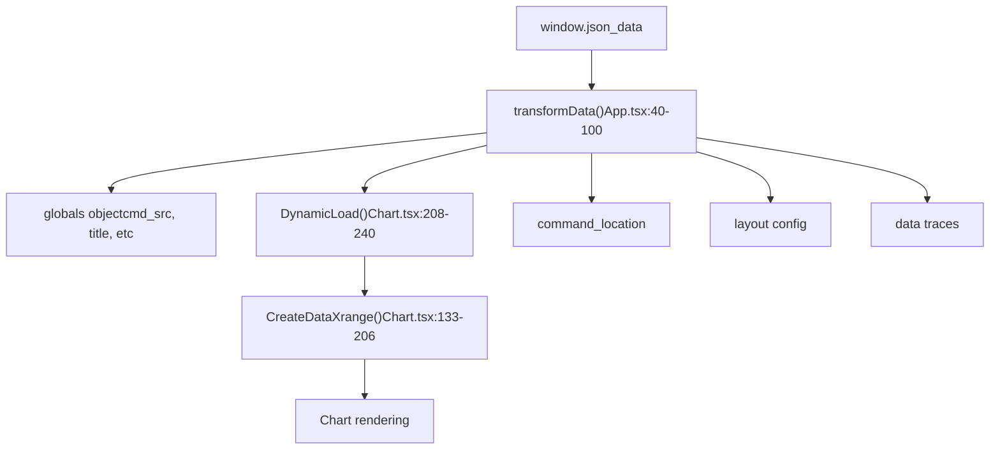
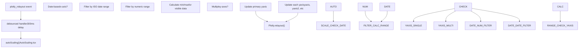
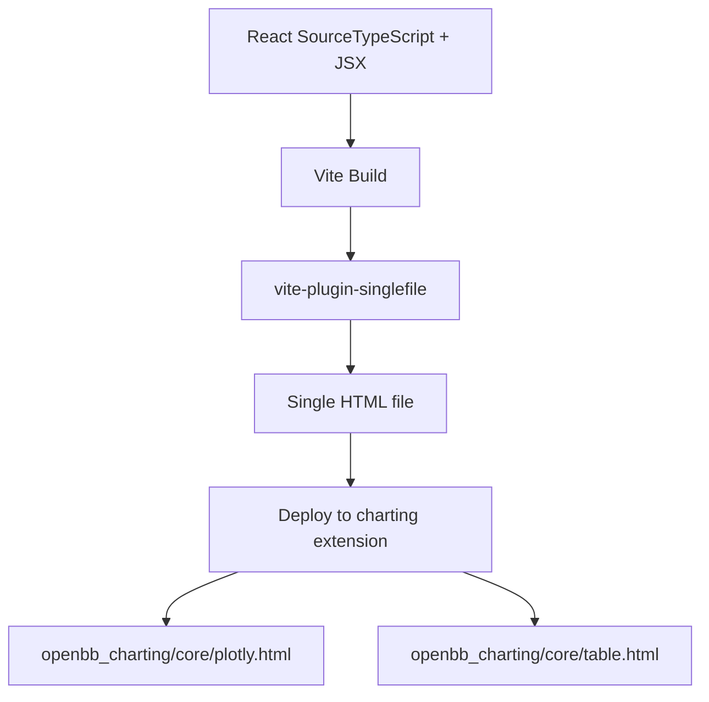

# Visualization Components

Relevant source files

-   [desktop/Cargo.lock](https://github.com/OpenBB-finance/OpenBB/blob/dddc3b32/desktop/Cargo.lock)
-   [desktop/package-lock.json](https://github.com/OpenBB-finance/OpenBB/blob/dddc3b32/desktop/package-lock.json)
-   [desktop/package.json](https://github.com/OpenBB-finance/OpenBB/blob/dddc3b32/desktop/package.json)
-   [desktop/src-tauri/Cargo.toml](https://github.com/OpenBB-finance/OpenBB/blob/dddc3b32/desktop/src-tauri/Cargo.toml)
-   [desktop/src-tauri/src/main.rs](https://github.com/OpenBB-finance/OpenBB/blob/dddc3b32/desktop/src-tauri/src/main.rs)
-   [desktop/src-tauri/src/tauri\_handlers/environments.rs](https://github.com/OpenBB-finance/OpenBB/blob/dddc3b32/desktop/src-tauri/src/tauri_handlers/environments.rs)
-   [desktop/src-tauri/src/tauri\_handlers/startup.rs](https://github.com/OpenBB-finance/OpenBB/blob/dddc3b32/desktop/src-tauri/src/tauri_handlers/startup.rs)
-   [desktop/src-tauri/tauri.conf.json](https://github.com/OpenBB-finance/OpenBB/blob/dddc3b32/desktop/src-tauri/tauri.conf.json)
-   [desktop/src/components/AddExtensionSelector.tsx](https://github.com/OpenBB-finance/OpenBB/blob/dddc3b32/desktop/src/components/AddExtensionSelector.tsx)
-   [desktop/src/components/InstallComponents.tsx](https://github.com/OpenBB-finance/OpenBB/blob/dddc3b32/desktop/src/components/InstallComponents.tsx)
-   [desktop/src/main.tsx](https://github.com/OpenBB-finance/OpenBB/blob/dddc3b32/desktop/src/main.tsx)
-   [desktop/src/routes/environments.tsx](https://github.com/OpenBB-finance/OpenBB/blob/dddc3b32/desktop/src/routes/environments.tsx)
-   [desktop/src/routes/installation-progress.tsx](https://github.com/OpenBB-finance/OpenBB/blob/dddc3b32/desktop/src/routes/installation-progress.tsx)
-   [desktop/src/tests/setup.ts](https://github.com/OpenBB-finance/OpenBB/blob/dddc3b32/desktop/src/tests/setup.ts)
-   [frontend-components/plotly/package-lock.json](https://github.com/OpenBB-finance/OpenBB/blob/dddc3b32/frontend-components/plotly/package-lock.json)
-   [frontend-components/plotly/package.json](https://github.com/OpenBB-finance/OpenBB/blob/dddc3b32/frontend-components/plotly/package.json)
-   [frontend-components/plotly/src/App.tsx](https://github.com/OpenBB-finance/OpenBB/blob/dddc3b32/frontend-components/plotly/src/App.tsx)
-   [frontend-components/plotly/src/components/Chart.tsx](https://github.com/OpenBB-finance/OpenBB/blob/dddc3b32/frontend-components/plotly/src/components/Chart.tsx)
-   [frontend-components/plotly/src/components/Config.tsx](https://github.com/OpenBB-finance/OpenBB/blob/dddc3b32/frontend-components/plotly/src/components/Config.tsx)
-   [frontend-components/plotly/src/components/Dialogs/AlertDialog.tsx](https://github.com/OpenBB-finance/OpenBB/blob/dddc3b32/frontend-components/plotly/src/components/Dialogs/AlertDialog.tsx)
-   [frontend-components/plotly/src/components/PlotlyConfig.tsx](https://github.com/OpenBB-finance/OpenBB/blob/dddc3b32/frontend-components/plotly/src/components/PlotlyConfig.tsx)
-   [frontend-components/tables/package-lock.json](https://github.com/OpenBB-finance/OpenBB/blob/dddc3b32/frontend-components/tables/package-lock.json)
-   [frontend-components/tables/package.json](https://github.com/OpenBB-finance/OpenBB/blob/dddc3b32/frontend-components/tables/package.json)
-   [openbb\_platform/obbject\_extensions/charting/openbb\_charting/core/chart\_style.py](https://github.com/OpenBB-finance/OpenBB/blob/dddc3b32/openbb_platform/obbject_extensions/charting/openbb_charting/core/chart_style.py)
-   [openbb\_platform/obbject\_extensions/charting/openbb\_charting/core/plotly.html](https://github.com/OpenBB-finance/OpenBB/blob/dddc3b32/openbb_platform/obbject_extensions/charting/openbb_charting/core/plotly.html)
-   [openbb\_platform/obbject\_extensions/charting/openbb\_charting/core/table.html](https://github.com/OpenBB-finance/OpenBB/blob/dddc3b32/openbb_platform/obbject_extensions/charting/openbb_charting/core/table.html)

This page documents the standalone React-based visualization components that render interactive charts and tables for OpenBB data. These components consume OBBject JSON data and provide features like theming, annotations, auto-scaling, and export capabilities. For information about how these components are integrated into the widget system for OpenBB Workspace, see [Widget System](/OpenBB-finance/OpenBB/5.4-widget-system). For details on the Python charting extension that serves these components, see the charting extension documentation.

## Architecture Overview

The visualization components are standalone React applications built with TypeScript and bundled as single HTML files. They are embedded into the Python charting extension and can be rendered in browsers, Jupyter notebooks, the Desktop app, or OpenBB Workspace.

### Component Structure and Data Flow

```mermaid
flowchart TD
    OBB["OBBject"]
    CHART_EXT["openbb_charting extension"]
    STYLE_PY["chart_style.pyChartStyle class"]
    PLOTLY_HTML["plotly.htmlCompiled single-file app"]
    TABLE_HTML["table.htmlCompiled single-file app"]
    PLOTLY_SRC["frontend-components/plotly/"]
    TABLE_SRC["frontend-components/tables/"]
    APP_TSX["App.tsx"]
    CHART_TSX["Chart.tsx"]
    VITE["Vite bundler"]
    VITE_PLUGIN["vite-plugin-singlefile"]
    BROWSER["Web Browser"]
    JUPYTER["Jupyter Notebook"]
    WORKSPACE["OpenBB Workspace"]
    DESKTOP["Desktop App"]

    OBB --> CHART_EXT
    CHART --> EXT_STYLE_PY
    CHART --> EXT_PLOTLY_HTML
    CHART --> EXT_TABLE_HTML
    PLOTLY --> SRC_APP_TSX
    APP --> TSX_CHART_TSX
    PLOTLY --> SRC_VITE
    TABLE --> SRC_VITE
    VITE --> VITE_PLUGIN
    VITE --> PLUGIN_PLOTLY_HTML
    VITE --> PLUGIN_TABLE_HTML
    PLOTLY --> HTML_BROWSER
    PLOTLY --> HTML_JUPYTER
    PLOTLY --> HTML_WORKSPACE
    PLOTLY --> HTML_DESKTOP
    TABLE --> HTML_BROWSER
    TABLE --> HTML_JUPYTER
    TABLE --> HTML_WORKSPACE
    TABLE --> HTML_DESKTOP
    OBB --> PLOTLY_HTML
    OBB --> TABLE_HTML
```


**Sources:** [openbb\_platform/obbject\_extensions/charting/openbb\_charting/core/plotly.html1-50](https://github.com/OpenBB-finance/OpenBB/blob/dddc3b32/openbb_platform/obbject_extensions/charting/openbb_charting/core/plotly.html#L1-L50) [frontend-components/plotly/src/App.tsx1-143](https://github.com/OpenBB-finance/OpenBB/blob/dddc3b32/frontend-components/plotly/src/App.tsx#L1-L143) [frontend-components/plotly/package.json1-48](https://github.com/OpenBB-finance/OpenBB/blob/dddc3b32/frontend-components/plotly/package.json#L1-L48)

### Technology Stack

| Component | Technologies | Purpose |
| --- | --- | --- |
| **UI Framework** | React 18, TypeScript | Component development |
| **Chart Library** | Plotly.js, react-plotly.js | Interactive visualizations |
| **Table Library** | TanStack Table v8, TanStack Virtual | High-performance data grids |
| **Styling** | Tailwind CSS, Radix UI primitives | Theming and UI components |
| **Build Tool** | Vite 7, vite-plugin-singlefile | Single HTML file compilation |
| **State Management** | React hooks (useState, useEffect, useCallback) | Component state |

**Sources:** [frontend-components/plotly/package.json10-23](https://github.com/OpenBB-finance/OpenBB/blob/dddc3b32/frontend-components/plotly/package.json#L10-L23) [frontend-components/tables/package.json13-38](https://github.com/OpenBB-finance/OpenBB/blob/dddc3b32/frontend-components/tables/package.json#L13-L38)

## Plotly Chart Component

The Plotly component (`frontend-components/plotly/`) renders interactive financial charts with support for OHLC data, time series, scatter plots, and custom annotations.

### Component Hierarchy


**Sources:** [frontend-components/plotly/src/App.tsx20-143](https://github.com/OpenBB-finance/OpenBB/blob/dddc3b32/frontend-components/plotly/src/App.tsx#L20-L143) [frontend-components/plotly/src/components/Chart.tsx253-307](https://github.com/OpenBB-finance/OpenBB/blob/dddc3b32/frontend-components/plotly/src/components/Chart.tsx#L253-L307)

### Data Loading and Processing

The component receives JSON data through the `window.json_data` global variable in production mode. The data transformation pipeline prepares Plotly-compatible chart configurations:


The `DynamicLoad` function handles large datasets by filtering data points based on the visible x-axis range. For datasets with more than 2000 points, it only renders the visible subset to improve performance.

**Sources:** [frontend-components/plotly/src/App.tsx40-100](https://github.com/OpenBB-finance/OpenBB/blob/dddc3b32/frontend-components/plotly/src/App.tsx#L40-L100) [frontend-components/plotly/src/components/Chart.tsx208-240](https://github.com/OpenBB-finance/OpenBB/blob/dddc3b32/frontend-components/plotly/src/components/Chart.tsx#L208-L240) [frontend-components/plotly/src/components/Chart.tsx133-206](https://github.com/OpenBB-finance/OpenBB/blob/dddc3b32/frontend-components/plotly/src/components/Chart.tsx#L133-L206)

### Auto-Scaling Feature

The auto-scaling system dynamically adjusts y-axis ranges based on visible data when zooming or panning:


The button state is managed through the `button_pressed` function at [frontend-components/plotly/src/components/Chart.tsx381-398](https://github.com/OpenBB-finance/OpenBB/blob/dddc3b32/frontend-components/plotly/src/components/Chart.tsx#L381-L398) which provides visual feedback when auto-scaling is active.

**Sources:** [frontend-components/plotly/src/components/Chart.tsx421-471](https://github.com/OpenBB-finance/OpenBB/blob/dddc3b32/frontend-components/plotly/src/components/Chart.tsx#L421-L471) [frontend-components/plotly/src/components/AutoScaling.tsx1-200](https://github.com/OpenBB-finance/OpenBB/blob/dddc3b32/frontend-components/plotly/src/components/AutoScaling.tsx#L1-L200)

### Annotation System

The annotation system allows users to add text, lines, and shapes to charts:

| Annotation Type | Trigger | Implementation |
| --- | --- | --- |
| **Point Annotations** | Click on data point | `init_annotation()` in addAnnotation.ts |
| **Text Labels** | TextChartDialog | Positioned annotations with customizable text |
| **Drawing Shapes** | Config modebar buttons | Plotly's built-in shape drawing |
| **OHLC Annotations** | Special handling for candlestick charts | `ohlcAnnotation` state |

The annotation click handler is defined at [frontend-components/plotly/src/components/Chart.tsx326-345](https://github.com/OpenBB-finance/OpenBB/blob/dddc3b32/frontend-components/plotly/src/components/Chart.tsx#L326-L345) which delegates to `init_annotation` for processing.

**Sources:** [frontend-components/plotly/src/utils/addAnnotation.ts1-200](https://github.com/OpenBB-finance/OpenBB/blob/dddc3b32/frontend-components/plotly/src/utils/addAnnotation.ts#L1-L200) [frontend-components/plotly/src/components/Chart.tsx311-324](https://github.com/OpenBB-finance/OpenBB/blob/dddc3b32/frontend-components/plotly/src/components/Chart.tsx#L311-L324) [frontend-components/plotly/src/components/Dialogs/TextChartDialog.tsx1-150](https://github.com/OpenBB-finance/OpenBB/blob/dddc3b32/frontend-components/plotly/src/components/Dialogs/TextChartDialog.tsx#L1-L150)

### Theme System

Theme management is handled through state and localStorage:

```
// Theme state managementconst [darkMode, setDarkMode] = useState(true);const [changeTheme, setChangeTheme] = useState(false); // Templates defined in Config.tsxDARK_CHARTS_TEMPLATE: plotly template objectLIGHT_CHARTS_TEMPLATE: plotly template object
```
The theme toggle updates both the plot layout and persists the preference to localStorage for subsequent sessions.

**Sources:** [frontend-components/plotly/src/components/Chart.tsx290-292](https://github.com/OpenBB-finance/OpenBB/blob/dddc3b32/frontend-components/plotly/src/components/Chart.tsx#L290-L292) [frontend-components/plotly/src/components/Config.tsx1-300](https://github.com/OpenBB-finance/OpenBB/blob/dddc3b32/frontend-components/plotly/src/components/Config.tsx#L1-L300)

## Table Component

The table component (`frontend-components/tables/`) provides high-performance data grids with sorting, filtering, column resizing, and virtualization.

### Table Architecture

```mermaid
flowchart TD
    TABLE_APP["App.tsxTable app entry"]
    TABLE_COMP["Table component"]
    TANSTACK["@tanstack/react-tableCore table logic"]
    VIRTUAL["@tanstack/react-virtualRow virtualization"]
    SORT["Column sorting"]
    FILTER["Column filtering"]
    RESIZE["Column resizing"]
    CONTEXT["Context menu"]
    SELECT["Row selection"]
    RADIX_SELECT["@radix-ui/react-select"]
    RADIX_MENU["@radix-ui/react-context-menu"]
    RADIX_DIALOG["@radix-ui/react-dialog"]
    RADIX_TOAST["@radix-ui/react-toast"]

    TABLE --> APP_TABLE_COMP
    TABLE --> COMP_TANSTACK
    TABLE --> COMP_VIRTUAL
    TANSTACK --> SORT
    TANSTACK --> FILTER
    TANSTACK --> RESIZE
    TABLE --> COMP_CONTEXT
    TABLE --> COMP_SELECT
    TABLE --> COMP_RADIX_SELECT
    TABLE --> COMP_RADIX_MENU
    TABLE --> COMP_RADIX_DIALOG
    TABLE --> COMP_RADIX_TOAST
```


**Sources:** [frontend-components/tables/package.json13-38](https://github.com/OpenBB-finance/OpenBB/blob/dddc3b32/frontend-components/tables/package.json#L13-L38)

### Key Table Features

| Feature | Implementation | Description |
| --- | --- | --- |
| **Virtualization** | `@tanstack/react-virtual` | Only renders visible rows for performance |
| **Sorting** | TanStack Table sorting API | Multi-column sort with sort indicators |
| **Filtering** | `@tanstack/match-sorter-utils` | Fuzzy text matching for quick filtering |
| **Column Resizing** | TanStack Table column resizing | Drag column borders to resize |
| **Context Menu** | `@radix-ui/react-context-menu` | Right-click menu for row actions |
| **Export** | `dom-to-image` library | Export to PNG, copy to clipboard |
| **Chart Integration** | `plotly.js`, `react-plotly.js` | Embed mini charts in table cells |

The table component also includes drag-and-drop column reordering using `react-dnd` and `react-dnd-html5-backend`.

**Sources:** [frontend-components/tables/package.json20-35](https://github.com/OpenBB-finance/OpenBB/blob/dddc3b32/frontend-components/tables/package.json#L20-L35)

## Build System and Integration

Both visualization components use Vite with a specialized plugin to compile to single HTML files:

### Build Process


**Build Commands:**

```
// frontend-components/plotly/package.json{  "scripts": {    "dev": "vite",    "build": "vite build",    "deploy": "npm run build && mv dist/index.html ../../openbb_platform/obbject_extensions/charting/openbb_charting/core/plotly.html"  }}
```
The single-file output includes all JavaScript, CSS, and assets inlined, making the components completely self-contained.

**Sources:** [frontend-components/plotly/package.json5-10](https://github.com/OpenBB-finance/OpenBB/blob/dddc3b32/frontend-components/plotly/package.json#L5-L10) [frontend-components/tables/package.json6-11](https://github.com/OpenBB-finance/OpenBB/blob/dddc3b32/frontend-components/tables/package.json#L6-L11) [frontend-components/plotly/vite.config.ts1-50](https://github.com/OpenBB-finance/OpenBB/blob/dddc3b32/frontend-components/plotly/vite.config.ts#L1-L50)

### Integration with Python Charting Extension

The compiled HTML files are deployed to the `openbb_charting` extension:

```
openbb_platform/
└── obbject_extensions/
    └── charting/
        └── openbb_charting/
            └── core/
                ├── plotly.html (compiled from frontend-components/plotly/)
                └── table.html (compiled from frontend-components/tables/)
```
The Python `ChartStyle` class at [openbb\_platform/obbject\_extensions/charting/openbb\_charting/core/chart\_style.py22-300](https://github.com/OpenBB-finance/OpenBB/blob/dddc3b32/openbb_platform/obbject_extensions/charting/openbb_charting/core/chart_style.py#L22-L300) provides styling configuration that gets embedded into the JSON data passed to these components.

**Sources:** [openbb\_platform/obbject\_extensions/charting/openbb\_charting/core/plotly.html1-10](https://github.com/OpenBB-finance/OpenBB/blob/dddc3b32/openbb_platform/obbject_extensions/charting/openbb_charting/core/plotly.html#L1-L10) [openbb\_platform/obbject\_extensions/charting/openbb\_charting/core/table.html1-10](https://github.com/OpenBB-finance/OpenBB/blob/dddc3b32/openbb_platform/obbject_extensions/charting/openbb_charting/core/table.html#L1-L10) [openbb\_platform/obbject\_extensions/charting/openbb\_charting/core/chart\_style.py22-50](https://github.com/OpenBB-finance/OpenBB/blob/dddc3b32/openbb_platform/obbject_extensions/charting/openbb_charting/core/chart_style.py#L22-L50)

## Theming and Styling

### Chart Themes

The `ChartStyle` class in Python provides two Plotly templates that are embedded into chart data:

| Template | Colors | Usage |
| --- | --- | --- |
| **DARK\_CHARTS\_TEMPLATE** | Dark background, light text | Default for dark mode |
| **LIGHT\_CHARTS\_TEMPLATE** | Light background, dark text | Light mode variant |

Color schemes defined in Python:

-   `PLT_COLORWAY`: Primary color palette for traces
-   `PLT_INCREASING_COLORWAY`: Colors for positive price movements
-   `PLT_DECREASING_COLORWAY`: Colors for negative price movements

These are referenced from [openbb\_charting/core/config/openbb\_styles.py](https://github.com/OpenBB-finance/OpenBB/blob/dddc3b32/openbb_charting/core/config/openbb_styles.py) The `ChartStyle.to_plotly_json()` method serializes these templates into the JSON passed to the React components.

**Sources:** [openbb\_platform/obbject\_extensions/charting/openbb\_charting/core/chart\_style.py15-27](https://github.com/OpenBB-finance/OpenBB/blob/dddc3b32/openbb_platform/obbject_extensions/charting/openbb_charting/core/chart_style.py#L15-L27)

### Component-Level Theming

The React components use Tailwind CSS with dark mode support via class-based theming:

```
// Theme detection on loadif (localStorage.theme === "dark" ||     (!("theme" in localStorage) &&      window.matchMedia("(prefers-color-scheme: dark)").matches)) {  document.documentElement.classList.add("dark");}
```
The theme state is synchronized between:

1.  Browser `localStorage` for persistence
2.  `document.documentElement.classList` for Tailwind dark mode
3.  Plotly chart template configuration

**Sources:** [openbb\_platform/obbject\_extensions/charting/openbb\_charting/core/plotly.html8-34](https://github.com/OpenBB-finance/OpenBB/blob/dddc3b32/openbb_platform/obbject_extensions/charting/openbb_charting/core/plotly.html#L8-L34) [openbb\_platform/obbject\_extensions/charting/openbb\_charting/core/table.html8-33](https://github.com/OpenBB-finance/OpenBB/blob/dddc3b32/openbb_platform/obbject_extensions/charting/openbb_charting/core/table.html#L8-L33)

## Interactive Features

### Chart Interactions

The Plotly component supports these keyboard shortcuts via `react-hotkeys-hook`:

| Shortcut | Function | Implementation |
| --- | --- | --- |
| `Ctrl+Shift+A` | Toggle auto-scaling | `autoscaleButton()` callback |
| `Ctrl+Shift+T` | Toggle theme | `changeTheme()` callback |
| `Ctrl+Shift+H` | Hide modebar | `hideModebar()` function |
| `Ctrl+Shift+S` | Save chart | Export functionality |

The hotkeys are registered through the `ChartHotkeys` component at [frontend-components/plotly/src/components/PlotlyConfig.tsx140-200](https://github.com/OpenBB-finance/OpenBB/blob/dddc3b32/frontend-components/plotly/src/components/PlotlyConfig.tsx#L140-L200)

**Sources:** [frontend-components/plotly/src/components/PlotlyConfig.tsx1-200](https://github.com/OpenBB-finance/OpenBB/blob/dddc3b32/frontend-components/plotly/src/components/PlotlyConfig.tsx#L1-L200) [frontend-components/plotly/src/components/Chart.tsx421-471](https://github.com/OpenBB-finance/OpenBB/blob/dddc3b32/frontend-components/plotly/src/components/Chart.tsx#L421-L471)

### Modebar Configuration

Custom modebar buttons extend Plotly's default functionality:

```
// Custom buttons defined in PlotConfig{  name: "Download CSV",  icon: ICONS.download_csv,  click: () => downloadCSV()},{  name: "Auto Scale",  icon: ICONS.autoscale,  click: () => autoscaleButton()},{  name: "Add Text",  icon: ICONS.add_text,  click: () => setModal({ name: "addText" })}
```
The modebar is positioned using `config.displayModeBar = "hover"` to show controls only when the user hovers over the chart.

**Sources:** [frontend-components/plotly/src/components/PlotlyConfig.tsx42-120](https://github.com/OpenBB-finance/OpenBB/blob/dddc3b32/frontend-components/plotly/src/components/PlotlyConfig.tsx#L42-L120)

### Export and Sharing

Both components support multiple export formats:

**Plotly Chart Exports:**

-   PNG image via `dom-to-image` library
-   CSV data export from visible traces
-   Chart state persistence to localStorage

**Table Exports:**

-   PNG screenshot of visible table area
-   Copy selected rows to clipboard
-   Export filtered/sorted data to CSV

The export implementations use the `dom-to-image` library for rendering DOM elements to images, as specified in the dependencies at [frontend-components/plotly/package.json14](https://github.com/OpenBB-finance/OpenBB/blob/dddc3b32/frontend-components/plotly/package.json#L14-L14) and [frontend-components/tables/package.json25](https://github.com/OpenBB-finance/OpenBB/blob/dddc3b32/frontend-components/tables/package.json#L25-L25)

**Sources:** [frontend-components/plotly/package.json14](https://github.com/OpenBB-finance/OpenBB/blob/dddc3b32/frontend-components/plotly/package.json#L14-L14) [frontend-components/tables/package.json25](https://github.com/OpenBB-finance/OpenBB/blob/dddc3b32/frontend-components/tables/package.json#L25-L25)
