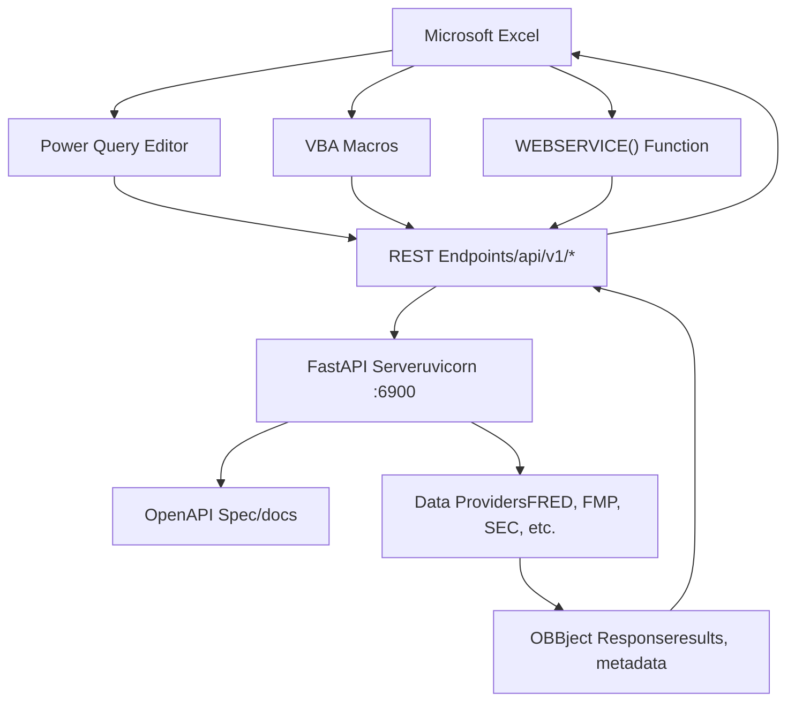
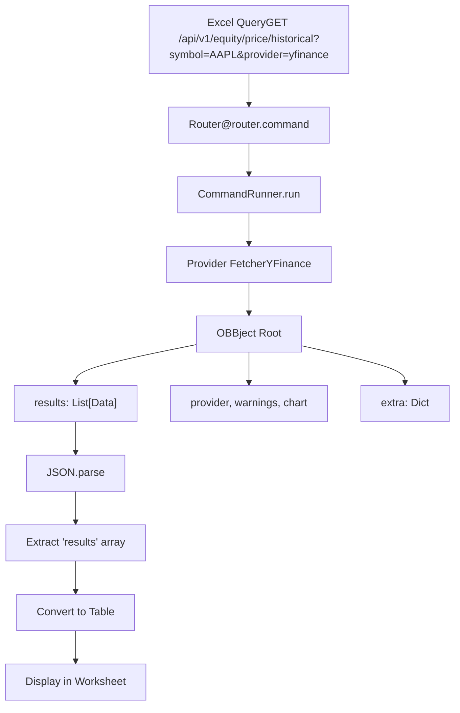

# Excel Integration

Relevant source files

-   [.codespell.skip](https://github.com/OpenBB-finance/OpenBB/blob/dddc3b32/.codespell.skip)
-   [.gitignore](https://github.com/OpenBB-finance/OpenBB/blob/dddc3b32/.gitignore)
-   [openbb\_platform/core/openbb\_core/provider/standard\_models/management\_discussion\_analysis.py](https://github.com/OpenBB-finance/OpenBB/blob/dddc3b32/openbb_platform/core/openbb_core/provider/standard_models/management_discussion_analysis.py)
-   [openbb\_platform/extensions/platform\_api/README.md](https://github.com/OpenBB-finance/OpenBB/blob/dddc3b32/openbb_platform/extensions/platform_api/README.md?plain=1)
-   [openbb\_platform/extensions/platform\_api/openbb\_platform\_api/main.py](https://github.com/OpenBB-finance/OpenBB/blob/dddc3b32/openbb_platform/extensions/platform_api/openbb_platform_api/main.py)
-   [openbb\_platform/extensions/platform\_api/openbb\_platform\_api/query\_models.py](https://github.com/OpenBB-finance/OpenBB/blob/dddc3b32/openbb_platform/extensions/platform_api/openbb_platform_api/query_models.py)
-   [openbb\_platform/extensions/platform\_api/openbb\_platform\_api/response\_models.py](https://github.com/OpenBB-finance/OpenBB/blob/dddc3b32/openbb_platform/extensions/platform_api/openbb_platform_api/response_models.py)
-   [openbb\_platform/extensions/platform\_api/openbb\_platform\_api/utils/api.py](https://github.com/OpenBB-finance/OpenBB/blob/dddc3b32/openbb_platform/extensions/platform_api/openbb_platform_api/utils/api.py)
-   [openbb\_platform/extensions/platform\_api/openbb\_platform\_api/utils/openapi.py](https://github.com/OpenBB-finance/OpenBB/blob/dddc3b32/openbb_platform/extensions/platform_api/openbb_platform_api/utils/openapi.py)
-   [openbb\_platform/extensions/platform\_api/openbb\_platform\_api/utils/widgets.py](https://github.com/OpenBB-finance/OpenBB/blob/dddc3b32/openbb_platform/extensions/platform_api/openbb_platform_api/utils/widgets.py)
-   [openbb\_platform/extensions/platform\_api/poetry.lock](https://github.com/OpenBB-finance/OpenBB/blob/dddc3b32/openbb_platform/extensions/platform_api/poetry.lock)
-   [openbb\_platform/extensions/platform\_api/pyproject.toml](https://github.com/OpenBB-finance/OpenBB/blob/dddc3b32/openbb_platform/extensions/platform_api/pyproject.toml)
-   [openbb\_platform/extensions/platform\_api/tests/mock\_openapi.json](https://github.com/OpenBB-finance/OpenBB/blob/dddc3b32/openbb_platform/extensions/platform_api/tests/mock_openapi.json)
-   [openbb\_platform/extensions/platform\_api/tests/mock\_widgets.json](https://github.com/OpenBB-finance/OpenBB/blob/dddc3b32/openbb_platform/extensions/platform_api/tests/mock_widgets.json)
-   [openbb\_platform/extensions/platform\_api/tests/test\_openapi\_utils.py](https://github.com/OpenBB-finance/OpenBB/blob/dddc3b32/openbb_platform/extensions/platform_api/tests/test_openapi_utils.py)
-   [openbb\_platform/extensions/platform\_api/tests/test\_widgets\_utils.py](https://github.com/OpenBB-finance/OpenBB/blob/dddc3b32/openbb_platform/extensions/platform_api/tests/test_widgets_utils.py)
-   [openbb\_platform/extensions/regulators/integration/test\_regulators\_api.py](https://github.com/OpenBB-finance/OpenBB/blob/dddc3b32/openbb_platform/extensions/regulators/integration/test_regulators_api.py)
-   [openbb\_platform/extensions/regulators/integration/test\_regulators\_python.py](https://github.com/OpenBB-finance/OpenBB/blob/dddc3b32/openbb_platform/extensions/regulators/integration/test_regulators_python.py)
-   [openbb\_platform/extensions/regulators/openbb\_regulators/cftc/cftc\_router.py](https://github.com/OpenBB-finance/OpenBB/blob/dddc3b32/openbb_platform/extensions/regulators/openbb_regulators/cftc/cftc_router.py)
-   [openbb\_platform/extensions/regulators/openbb\_regulators/sec/sec\_router.py](https://github.com/OpenBB-finance/OpenBB/blob/dddc3b32/openbb_platform/extensions/regulators/openbb_regulators/sec/sec_router.py)
-   [openbb\_platform/providers/nasdaq/tests/record/expected\_widgets.json](https://github.com/OpenBB-finance/OpenBB/blob/dddc3b32/openbb_platform/providers/nasdaq/tests/record/expected_widgets.json)
-   [openbb\_platform/providers/sec/openbb\_sec/models/management\_discussion\_analysis.py](https://github.com/OpenBB-finance/OpenBB/blob/dddc3b32/openbb_platform/providers/sec/openbb_sec/models/management_discussion_analysis.py)
-   [openbb\_platform/providers/sec/openbb\_sec/models/schema\_files.py](https://github.com/OpenBB-finance/OpenBB/blob/dddc3b32/openbb_platform/providers/sec/openbb_sec/models/schema_files.py)
-   [openbb\_platform/providers/sec/openbb\_sec/utils/html2markdown.py](https://github.com/OpenBB-finance/OpenBB/blob/dddc3b32/openbb_platform/providers/sec/openbb_sec/utils/html2markdown.py)
-   [openbb\_platform/providers/sec/openbb\_sec/utils/xbrl\_taxonomy\_helper.py](https://github.com/OpenBB-finance/OpenBB/blob/dddc3b32/openbb_platform/providers/sec/openbb_sec/utils/xbrl_taxonomy_helper.py)
-   [openbb\_platform/providers/sec/poetry.lock](https://github.com/OpenBB-finance/OpenBB/blob/dddc3b32/openbb_platform/providers/sec/poetry.lock)
-   [openbb\_platform/providers/sec/pyproject.toml](https://github.com/OpenBB-finance/OpenBB/blob/dddc3b32/openbb_platform/providers/sec/pyproject.toml)

## Purpose and Scope

This page describes how to integrate OpenBB Platform data into Microsoft Excel spreadsheets. Excel can query the OpenBB Platform REST API to retrieve financial and economic data for analysis and reporting. This integration enables Excel users to leverage OpenBB's data providers without leaving their spreadsheet environment.

For information about the underlying REST API server, see [REST API Server](/OpenBB-finance/OpenBB/5.2-rest-api-server). For the OpenBB Workspace web interface, see [OpenBB Workspace Integration](/OpenBB-finance/OpenBB/5.3-openbb-workspace-integration).

## Overview

Excel integration with the OpenBB Platform is achieved by connecting Excel to the local FastAPI server. Unlike dedicated Excel add-ins, this approach uses Excel's native HTTP capabilities (Power Query, VBA, or Web functions) to make REST API calls and retrieve data.

**Key Characteristics:**

-   No dedicated Excel add-in required
-   Uses standard Excel data connection tools
-   Connects to local API server (default: `http://127.0.0.1:6900`)
-   Returns data in JSON format for Excel to parse
-   Supports all platform endpoints and providers

Sources: [openbb\_platform/extensions/platform\_api/README.md1-28](https://github.com/OpenBB-finance/OpenBB/blob/dddc3b32/openbb_platform/extensions/platform_api/README.md?plain=1#L1-L28) [openbb\_platform/extensions/platform\_api/openbb\_platform\_api/main.py1-28](https://github.com/OpenBB-finance/OpenBB/blob/dddc3b32/openbb_platform/extensions/platform_api/openbb_platform_api/main.py#L1-L28)

## Architecture

### Connection Flow


Sources: [openbb\_platform/extensions/platform\_api/README.md20-40](https://github.com/OpenBB-finance/OpenBB/blob/dddc3b32/openbb_platform/extensions/platform_api/README.md?plain=1#L20-L40) [openbb\_platform/extensions/platform\_api/openbb\_platform\_api/main.py283-327](https://github.com/OpenBB-finance/OpenBB/blob/dddc3b32/openbb_platform/extensions/platform_api/openbb_platform_api/main.py#L283-L327)

### Data Flow and Response Structure


**OBBject Structure:**

The API returns data in the `OBBject` format, which Excel must parse:

```
{  "results": [    {"date": "2024-01-01", "close": 150.50, "volume": 1000000},    {"date": "2024-01-02", "close": 151.20, "volume": 950000}  ],  "provider": "yfinance",  "warnings": [],  "chart": null,  "extra": {    "metadata": {}  }}
```
Excel typically needs to extract the `results` array for tabular display.

Sources: [openbb\_platform/core/openbb\_core/app/model/obbject.py](https://github.com/OpenBB-finance/OpenBB/blob/dddc3b32/openbb_platform/core/openbb_core/app/model/obbject.py) (implied from response structure), [openbb\_platform/extensions/platform\_api/openbb\_platform\_api/main.py124-154](https://github.com/OpenBB-finance/OpenBB/blob/dddc3b32/openbb_platform/extensions/platform_api/openbb_platform_api/main.py#L124-L154)

## Setup and Configuration

### 1\. Start the API Server

Before Excel can connect, the OpenBB Platform API server must be running:

```
openbb-api
```
This launches the FastAPI server at `http://127.0.0.1:6900`. You can configure the host and port:

```
openbb-api --host 127.0.0.1 --port 6900
```
For HTTPS connections (required by some corporate Excel installations):

```
openssl req -x509 -days 3650 -out localhost.crt -keyout localhost.key \  -newkey rsa:4096 -nodes -sha256 -subj '/CN=localhost' \  -extensions EXT -config <(printf "[dn]\nCN=localhost\n[req]\ndistinguished_name=dn\n[EXT]\nsubjectAltName=DNS:localhost\nkeyUsage=digitalSignature\nextendedKeyUsage=serverAuth") openbb-api --ssl_keyfile localhost.key --ssl_certfile localhost.crt
```
Sources: [openbb\_platform/extensions/platform\_api/README.md99-123](https://github.com/OpenBB-finance/OpenBB/blob/dddc3b32/openbb_platform/extensions/platform_api/README.md?plain=1#L99-L123) [openbb\_platform/extensions/platform\_api/openbb\_platform\_api/main.py284-327](https://github.com/OpenBB-finance/OpenBB/blob/dddc3b32/openbb_platform/extensions/platform_api/openbb_platform_api/main.py#L284-L327)

### 2\. Verify API Availability

Open your browser and navigate to:

-   API Root: `http://127.0.0.1:6900/`
-   OpenAPI Docs: `http://127.0.0.1:6900/docs`

The OpenAPI documentation lists all available endpoints with parameter schemas.

Sources: [openbb\_platform/extensions/platform\_api/openbb\_platform\_api/main.py124-130](https://github.com/OpenBB-finance/OpenBB/blob/dddc3b32/openbb_platform/extensions/platform_api/openbb_platform_api/main.py#L124-L130)

### 3\. Authentication Configuration

If the API requires authentication, you'll need to configure Basic Auth credentials:

```
# Set in environment variables or user_settings.jsonOPENBB_API_USERNAME=your_usernameOPENBB_API_PASSWORD=your_password
```
In Excel, include the `Authorization` header in your requests:

```
Authorization: Basic <base64_encoded_username:password>
```
Sources: [openbb\_platform/extensions/regulators/integration/test\_regulators\_api.py12-18](https://github.com/OpenBB-finance/OpenBB/blob/dddc3b32/openbb_platform/extensions/regulators/integration/test_regulators_api.py#L12-L18) [openbb\_core/env](https://github.com/OpenBB-finance/OpenBB/blob/dddc3b32/openbb_core/env) (implied from environment configuration)

## Connection Methods

### Method 1: Power Query (Recommended)

Power Query is Excel's built-in ETL tool and provides the most robust integration:

**Steps:**

1.  **Open Power Query:**

    -   Excel → Data tab → Get Data → From Other Sources → From Web
2.  **Enter API URL:**

    ```
    http://127.0.0.1:6900/api/v1/equity/price/historical?symbol=AAPL&provider=yfinance&start_date=2024-01-01&end_date=2024-12-31
    ```

3.  **Configure Request (if authentication required):**

    -   Advanced → HTTP request headers
    -   Add header: `Authorization: Basic <credentials>`
4.  **Parse JSON Response:**

    -   Power Query will detect JSON format
    -   Expand the `results` column to see data fields
    -   Select columns to keep (date, close, volume, etc.)
5.  **Load to Worksheet:**

    -   Click "Close & Load"
    -   Data appears in new worksheet with automatic refresh capability

**Advantages:**

-   GUI-based, no coding required
-   Built-in JSON parsing
-   Scheduled refresh capabilities
-   Query parameters can reference Excel cells
-   Error handling and retry logic

Sources: Excel documentation (conceptual), [openbb\_platform/extensions/platform\_api/README.md20-28](https://github.com/OpenBB-finance/OpenBB/blob/dddc3b32/openbb_platform/extensions/platform_api/README.md?plain=1#L20-L28)

### Method 2: VBA Macros

For programmatic control, use VBA with the `MSXML2.XMLHTTP` or `WinHttp.WinHttpRequest` objects:

**Example VBA Code:**

```
Function FetchOBBData(endpoint As String, params As String) As String    Dim http As Object    Dim url As String        ' Create HTTP request object    Set http = CreateObject("MSXML2.XMLHTTP")        ' Build full URL    url = "http://127.0.0.1:6900" & endpoint & "?" & params        ' Make GET request    http.Open "GET", url, False    http.setRequestHeader "Content-Type", "application/json"    ' Add auth header if needed    ' http.setRequestHeader "Authorization", "Basic " & EncodeBase64("user:pass")        http.Send        ' Return response text    FetchOBBData = http.responseText        Set http = NothingEnd FunctionSub LoadEquityData()    Dim response As String    Dim jsonResult As Object        ' Fetch data    response = FetchOBBData("/api/v1/equity/price/historical", _                           "symbol=AAPL&provider=yfinance&start_date=2024-01-01")        ' Parse JSON (requires JSON library or manual parsing)    ' Set jsonResult = JsonConverter.ParseJson(response)        ' Extract results array and populate worksheet    ' ... (implementation depends on JSON library)End Sub
```
**Note:** VBA does not have native JSON parsing. You'll need:

-   VBA-JSON library ([https://github.com/VBA-tools/VBA-JSON](https://github.com/VBA-tools/VBA-JSON))
-   Manual string parsing
-   Power Query conversion (load as Power Query, then reference in VBA)

Sources: VBA/Excel documentation (conceptual), [openbb\_platform/extensions/platform\_api/openbb\_platform\_api/main.py124-154](https://github.com/OpenBB-finance/OpenBB/blob/dddc3b32/openbb_platform/extensions/platform_api/openbb_platform_api/main.py#L124-L154)

### Method 3: WEBSERVICE Function (Limited)

Excel's `WEBSERVICE()` function can make GET requests but has significant limitations:

**Formula:**

```
=WEBSERVICE("http://127.0.0.1:6900/api/v1/equity/price/historical?symbol=AAPL&provider=yfinance")
```
**Limitations:**

-   Returns raw JSON string (not parsed)
-   No authentication support
-   No POST request support
-   Character limit on response (~32,767 characters)
-   Limited error handling

You can combine with `FILTERXML()` for simple parsing, but this is not recommended for complex JSON structures like OBBject.

Sources: Excel documentation (conceptual)

## Available Endpoints for Excel

All REST API endpoints are available to Excel. Common use cases:

### Equity Data

**Historical Prices:**

```
GET /api/v1/equity/price/historical
Parameters: symbol, provider, start_date, end_date, interval
```
**Company Fundamentals:**

```
GET /api/v1/equity/fundamental/balance
GET /api/v1/equity/fundamental/income
GET /api/v1/equity/fundamental/cash
Parameters: symbol, provider, period, limit
```
**Calendar Data:**

```
GET /api/v1/equity/calendar/earnings
GET /api/v1/equity/calendar/dividends
Parameters: symbol, provider, start_date, end_date
```
### Economic Data

**Federal Reserve Data:**

```
GET /api/v1/economy/fred_series
Parameters: symbol, provider, start_date, end_date, frequency
```
**Economic Indicators:**

```
GET /api/v1/economy/cpi
GET /api/v1/economy/gdp
GET /api/v1/economy/unemployment
Parameters: country, provider, start_date, end_date
```
### SEC Filings

**Company Filings:**

```
GET /api/v1/regulators/sec/company_filings
Parameters: symbol, form_type, provider
```
**Full endpoint list available at:** `http://127.0.0.1:6900/docs`

Sources: [openbb\_platform/extensions/platform\_api/openbb\_platform\_api/main.py107-111](https://github.com/OpenBB-finance/OpenBB/blob/dddc3b32/openbb_platform/extensions/platform_api/openbb_platform_api/main.py#L107-L111) [openbb\_platform/extensions/economy/](https://github.com/OpenBB-finance/OpenBB/blob/dddc3b32/openbb_platform/extensions/economy/) (implied), [openbb\_platform/extensions/regulators/](https://github.com/OpenBB-finance/OpenBB/blob/dddc3b32/openbb_platform/extensions/regulators/) (implied)

## Data Format Handling

### OBBject Structure

All API responses follow the `OBBject` format:

| Field | Type | Description |
| --- | --- | --- |
| `results` | `List[Dict]` | Array of data records (the actual data) |
| `provider` | `str` | Data provider name (e.g., "yfinance") |
| `warnings` | `List[Dict]` | Warning messages, if any |
| `chart` | `Dict` or `null` | Chart configuration (if chart=true parameter) |
| `extra` | `Dict` | Additional metadata |

### Extracting Results in Power Query

When you load JSON into Power Query:

1.  Power Query shows `OBBject` as a `Record`
2.  Click the expand icon next to the `Record` column header
3.  Select `results` from the dropdown
4.  Power Query converts the results array to a table
5.  Expand the `List` to show individual record fields
6.  Select which fields to keep (date, close, volume, etc.)
7.  Click "Close & Load"

### Handling Date Fields

API returns dates as strings (ISO 8601 format: `"YYYY-MM-DD"`). In Power Query:

1.  Select the date column
2.  Transform → Data Type → Date
3.  Power Query converts string to proper Excel date format

### Handling Null Values

The API may return `null` for missing data:

-   Power Query displays as `null`
-   Excel displays as blank cells
-   Use Power Query's "Replace Values" to convert `null` to 0 or other defaults

Sources: [openbb\_platform/extensions/platform\_api/openbb\_platform\_api/main.py](https://github.com/OpenBB-finance/OpenBB/blob/dddc3b32/openbb_platform/extensions/platform_api/openbb_platform_api/main.py) (implied from OBBject structure), Power Query documentation (conceptual)

## Parameterized Queries

### Using Excel Cells as Parameters

Power Query can reference Excel cell values as query parameters:

1.  **Create Parameter Cells:**

    -   Cell A1: `AAPL` (symbol)
    -   Cell B1: `2024-01-01` (start\_date)
    -   Cell C1: `2024-12-31` (end\_date)
2.  **Define Named Ranges:**

    -   Name cell A1 as `SymbolParam`
    -   Name cell B1 as `StartDateParam`
    -   Name cell C1 as `EndDateParam`
3.  **In Power Query M Code:**

    ```
    let    Symbol = Excel.CurrentWorkbook(){[Name="SymbolParam"]}[Content]{0}[Column1],    StartDate = Excel.CurrentWorkbook(){[Name="StartDateParam"]}[Content]{0}[Column1],    EndDate = Excel.CurrentWorkbook(){[Name="EndDateParam"]}[Content]{0}[Column1],        BaseUrl = "http://127.0.0.1:6900/api/v1/equity/price/historical",    FullUrl = BaseUrl & "?symbol=" & Symbol &               "&start_date=" & StartDate &               "&end_date=" & EndDate &               "&provider=yfinance",        Source = Json.Document(Web.Contents(FullUrl)),    Results = Source[results],    ResultsTable = Table.FromList(Results, Splitter.SplitByNothing(), null, null, ExtraValues.Error),    ExpandedTable = Table.ExpandRecordColumn(ResultsTable, "Column1",                     {"date", "close", "volume", "open", "high", "low"})in    ExpandedTable
    ```

4.  **Refresh Data:**

    -   Change parameter values in cells A1, B1, C1
    -   Right-click query → Refresh
    -   Data updates automatically

Sources: Power Query M language documentation (conceptual), [openbb\_platform/extensions/platform\_api/openbb\_platform\_api/main.py107-111](https://github.com/OpenBB-finance/OpenBB/blob/dddc3b32/openbb_platform/extensions/platform_api/openbb_platform_api/main.py#L107-L111)

## Error Handling

### Common Error Responses

The API returns standard HTTP error codes:

| Status | Description | Handling in Excel |
| --- | --- | --- |
| 200 | Success | Data loaded successfully |
| 400 | Bad Request (invalid parameters) | Check parameter names and values |
| 404 | Not Found (invalid endpoint) | Verify endpoint path from `/docs` |
| 422 | Validation Error | Check parameter types and required fields |
| 500 | Internal Server Error | Check API server logs |

### Error Response Format

```
{  "detail": "Validation error description",  "errors": [    {"loc": ["query", "symbol"], "msg": "field required", "type": "value_error.missing"}  ]}
```
### Handling Errors in Power Query

Add error handling to Power Query M code:

```
let    Source = try Json.Document(Web.Contents(url)) otherwise null,    Result = if Source = null then                 #table({"Error"}, {{"Failed to fetch data"}})             else if Record.HasFields(Source, "detail") then                #table({"Error"}, {{Source[detail]}})             else                Source[results]in    Result
```
Sources: [openbb\_platform/extensions/platform\_api/openbb\_platform\_api/main.py](https://github.com/OpenBB-finance/OpenBB/blob/dddc3b32/openbb_platform/extensions/platform_api/openbb_platform_api/main.py) (implied from error handling), FastAPI documentation (conceptual)

## Provider Selection

### Multi-Provider Endpoints

Many endpoints support multiple data providers via the `provider` parameter:

**Example:** Historical equity prices

-   `provider=yfinance` - Free, basic data
-   `provider=fmp` - Financial Modeling Prep (API key required)
-   `provider=intrinio` - Intrinio (subscription required)

**In Excel URL:**

```
http://127.0.0.1:6900/api/v1/equity/price/historical?symbol=AAPL&provider=yfinance
```
**Change provider by modifying the parameter:**

```
http://127.0.0.1:6900/api/v1/equity/price/historical?symbol=AAPL&provider=fmp
```
### Provider-Specific Fields

Different providers may return additional fields:

-   Standard fields: `date`, `close`, `volume`, `open`, `high`, `low`
-   Provider-specific fields: `adj_close`, `vwap`, `transactions`, etc.

Power Query's column expansion automatically detects all available fields.

Sources: [openbb\_platform/core/openbb\_core/app/provider\_interface.py](https://github.com/OpenBB-finance/OpenBB/blob/dddc3b32/openbb_platform/core/openbb_core/app/provider_interface.py) (implied), [openbb\_platform/providers/](https://github.com/OpenBB-finance/OpenBB/blob/dddc3b32/openbb_platform/providers/) (various providers)

## Performance Considerations

### API Rate Limits

Some data providers impose rate limits:

-   Free providers: Often limit requests per minute
-   Paid providers: Higher limits based on subscription tier

**Mitigation in Excel:**

-   Avoid high-frequency refreshes
-   Cache data locally in worksheets
-   Use Power Query's built-in query folding when possible

### Response Size

Large date ranges or multiple symbols can return large responses:

-   Use `limit` parameter to restrict number of records
-   Use `start_date` and `end_date` to filter date ranges
-   Consider pagination for very large datasets

**Example with limit:**

```
GET /api/v1/equity/price/historical?symbol=AAPL&provider=yfinance&limit=100
```
### Refresh Strategies

Power Query queries can be set to:

-   **Manual Refresh:** Right-click → Refresh
-   **Scheduled Refresh:** Data → Queries & Connections → Query Properties → Refresh Control
-   **On Workbook Open:** Enable "Refresh data when opening the file"

Sources: [openbb\_platform/extensions/platform\_api/README.md66-95](https://github.com/OpenBB-finance/OpenBB/blob/dddc3b32/openbb_platform/extensions/platform_api/README.md?plain=1#L66-L95) (uvicorn configuration)

## Troubleshooting

### Connection Refused

**Problem:** Excel cannot connect to `http://127.0.0.1:6900`

**Solutions:**

1.  Verify API server is running: Check terminal for `uvicorn` output
2.  Check port availability: `netstat -an | grep 6900` (Unix) or `netstat -an | findstr 6900` (Windows)
3.  Try alternate port: `openbb-api --port 6901`
4.  Check firewall settings: Allow connections to localhost

Sources: [openbb\_platform/extensions/platform\_api/openbb\_platform\_api/utils/api.py82-93](https://github.com/OpenBB-finance/OpenBB/blob/dddc3b32/openbb_platform/extensions/platform_api/openbb_platform_api/utils/api.py#L82-L93)

### CORS Errors

**Problem:** Browser-based Excel (Excel Online) may encounter CORS restrictions

**Solution:** CORS is handled by the API's `CORSMiddleware`. Ensure the API is configured to allow your Excel Online domain.

Sources: [openbb\_platform/extensions/platform\_api/openbb\_platform\_api/utils/api.py305-315](https://github.com/OpenBB-finance/OpenBB/blob/dddc3b32/openbb_platform/extensions/platform_api/openbb_platform_api/utils/api.py#L305-L315)

### SSL Certificate Errors

**Problem:** HTTPS connection fails with certificate error

**Solutions:**

1.  Use HTTP instead (if security allows): `http://127.0.0.1:6900`
2.  Trust self-signed certificate: Add `localhost.crt` to system trust store
3.  Use corporate-issued certificate for production deployments

Sources: [openbb\_platform/extensions/platform\_api/README.md99-123](https://github.com/OpenBB-finance/OpenBB/blob/dddc3b32/openbb_platform/extensions/platform_api/README.md?plain=1#L99-L123)

### JSON Parsing Failures

**Problem:** Power Query fails to parse response

**Causes:**

-   Empty response (no data available)
-   Error response (non-200 status)
-   Malformed JSON (rare, usually indicates API bug)

**Solution:** Add error handling to Power Query M code (see Error Handling section above)

### Authentication Errors (401 Unauthorized)

**Problem:** API requires authentication but credentials not provided

**Solution:**

1.  Verify credentials in environment variables
2.  Add `Authorization` header to Power Query request
3.  Use VBA to handle authentication programmatically

Sources: [openbb\_platform/extensions/regulators/integration/test\_regulators\_api.py12-18](https://github.com/OpenBB-finance/OpenBB/blob/dddc3b32/openbb_platform/extensions/regulators/integration/test_regulators_api.py#L12-L18)

## Advanced Use Cases

### Multi-Symbol Queries

Fetch data for multiple symbols by making multiple API calls:

**Option 1: Separate Queries**

-   Create one Power Query per symbol
-   Combine using "Append Queries"

**Option 2: VBA Loop**

```
Sub FetchMultipleSymbols()    Dim symbols As Variant    Dim symbol As Variant    Dim ws As Worksheet    Dim rowNum As Long        symbols = Array("AAPL", "GOOGL", "MSFT", "AMZN")    Set ws = ThisWorkbook.Sheets("Data")    rowNum = 2        For Each symbol In symbols        ' Fetch data for each symbol        Dim response As String        response = FetchOBBData("/api/v1/equity/price/historical", _                               "symbol=" & symbol & "&provider=yfinance&limit=1")                ' Parse and write to worksheet        ' ... (implementation depends on JSON library)                rowNum = rowNum + 1    Next symbolEnd Sub
```
### Dashboard Creation

Build dynamic dashboards using Excel features:

1.  **Power Query:** Fetch data from multiple API endpoints
2.  **PivotTables:** Summarize and analyze data
3.  **Charts:** Visualize trends and comparisons
4.  **Slicers:** Filter data interactively
5.  **Conditional Formatting:** Highlight insights

Sources: Excel documentation (conceptual)

### Real-Time Data Updates

For near-real-time data:

1.  Set Power Query refresh interval (minimum 1 minute)
2.  Use VBA timer to trigger refresh programmatically
3.  Consider WebSocket alternatives for true real-time (not natively supported by OpenBB Platform API)

**VBA Timer Example:**

```
Private Sub Workbook_Open()    ' Refresh data every 5 minutes    Application.OnTime Now + TimeValue("00:05:00"), "RefreshAllQueries"End SubSub RefreshAllQueries()    ThisWorkbook.Queries.Refresh    ' Schedule next refresh    Application.OnTime Now + TimeValue("00:05:00"), "RefreshAllQueries"End Sub
```
## Comparison with Alternatives

| Method | Pros | Cons | Best For |
| --- | --- | --- | --- |
| **Excel + OpenBB API** | Full platform features, free, local control | Requires API server running | Advanced users, custom workflows |
| **Excel Add-ins** (if available) | One-click functions, no setup | Limited to add-in features | Casual users, simple queries |
| **Python + Excel** | Unlimited customization | Requires Python knowledge | Data scientists, automation |
| **Manual Export** | Simple, no technical skills | No automation, manual updates | One-time analysis |

The OpenBB Platform API integration provides maximum flexibility while maintaining full data sovereignty, making it ideal for power users and automated workflows.

Sources: Comparative analysis (conceptual)

## Future Enhancements

Potential improvements to Excel integration:

1.  **Dedicated Excel Add-in:**

    -   Custom ribbon with OpenBB functions
    -   Autocomplete for symbols and parameters
    -   Built-in authentication UI
2.  **Excel Function Library:**

    -   User-defined functions (UDFs): `=OPENBB.PRICE("AAPL")`
    -   Native Excel formula syntax
    -   IntelliSense support
3.  **Template Workbooks:**

    -   Pre-configured queries for common use cases
    -   Ready-to-use dashboards
    -   Example formulas and visualizations
4.  **Enhanced Widget Support:**

    -   Excel-specific widget types in `widgets.json`
    -   Direct integration with OpenBB Workspace
    -   Shared query definitions

These enhancements would build upon the existing REST API foundation while providing a more Excel-native experience.

Sources: Architecture planning (conceptual), [openbb\_platform/extensions/platform\_api/README.md1-24](https://github.com/OpenBB-finance/OpenBB/blob/dddc3b32/openbb_platform/extensions/platform_api/README.md?plain=1#L1-L24)

---

**Summary:** Excel integration with OpenBB Platform is achieved through standard HTTP requests to the local FastAPI server. Power Query provides the most robust integration method, with VBA and web functions available for specialized use cases. All platform endpoints and providers are accessible to Excel users, enabling comprehensive financial data analysis within familiar spreadsheet environments.
