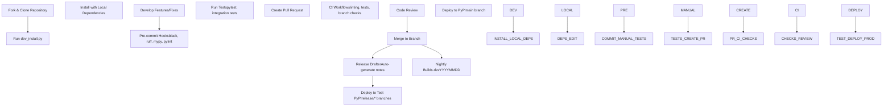
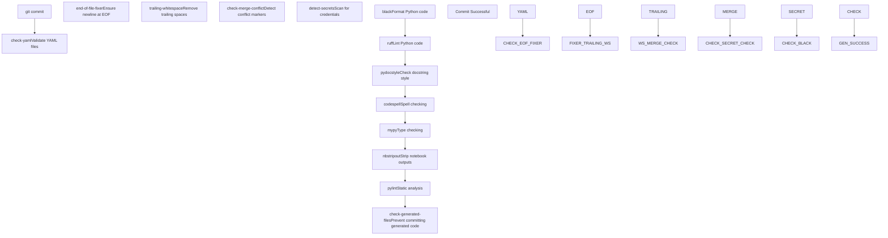
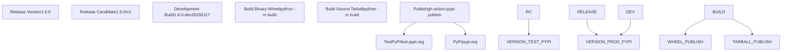
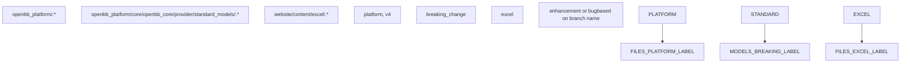

# Development and Deployment

Relevant source files

-   [.github/labeler.yml](https://github.com/OpenBB-finance/OpenBB/blob/dddc3b32/.github/labeler.yml)
-   [.github/platform-drafter.yml](https://github.com/OpenBB-finance/OpenBB/blob/dddc3b32/.github/platform-drafter.yml)
-   [.github/release-drafter.yml](https://github.com/OpenBB-finance/OpenBB/blob/dddc3b32/.github/release-drafter.yml)
-   [.github/workflows/README.md](https://github.com/OpenBB-finance/OpenBB/blob/dddc3b32/.github/workflows/README.md?plain=1)
-   [.pre-commit-config.yaml](https://github.com/OpenBB-finance/OpenBB/blob/dddc3b32/.pre-commit-config.yaml)
-   [README.md](https://github.com/OpenBB-finance/OpenBB/blob/dddc3b32/README.md?plain=1)
-   [cli/poetry.lock](https://github.com/OpenBB-finance/OpenBB/blob/dddc3b32/cli/poetry.lock)
-   [openbb\_platform/core/openbb/assets/reference.json](https://github.com/OpenBB-finance/OpenBB/blob/dddc3b32/openbb_platform/core/openbb/assets/reference.json)
-   [openbb\_platform/core/poetry.lock](https://github.com/OpenBB-finance/OpenBB/blob/dddc3b32/openbb_platform/core/poetry.lock)
-   [openbb\_platform/core/pyproject.toml](https://github.com/OpenBB-finance/OpenBB/blob/dddc3b32/openbb_platform/core/pyproject.toml)
-   [openbb\_platform/dev\_install.py](https://github.com/OpenBB-finance/OpenBB/blob/dddc3b32/openbb_platform/dev_install.py)
-   [openbb\_platform/extensions/devtools/poetry.lock](https://github.com/OpenBB-finance/OpenBB/blob/dddc3b32/openbb_platform/extensions/devtools/poetry.lock)
-   [openbb\_platform/extensions/devtools/pyproject.toml](https://github.com/OpenBB-finance/OpenBB/blob/dddc3b32/openbb_platform/extensions/devtools/pyproject.toml)
-   [openbb\_platform/poetry.lock](https://github.com/OpenBB-finance/OpenBB/blob/dddc3b32/openbb_platform/poetry.lock)
-   [openbb\_platform/providers/yfinance/poetry.lock](https://github.com/OpenBB-finance/OpenBB/blob/dddc3b32/openbb_platform/providers/yfinance/poetry.lock)
-   [openbb\_platform/pyproject.toml](https://github.com/OpenBB-finance/OpenBB/blob/dddc3b32/openbb_platform/pyproject.toml)

This page provides an overview of the development workflow, build system, testing infrastructure, and deployment pipelines for the OpenBB Platform. It covers the tools and processes used by contributors to develop, test, and release new features and fixes.

**Scope**: This page introduces the development lifecycle from initial setup through production deployment. For detailed guidance on specific topics, see:

-   For setting up your local development environment: [Development Setup](/OpenBB-finance/OpenBB/6.1-development-setup)
-   For code quality standards and testing: [Code Quality and Testing](/OpenBB-finance/OpenBB/6.2-code-quality-and-testing)
-   For building custom extensions: [Creating Extensions](/OpenBB-finance/OpenBB/6.3-creating-extensions)
-   For CI/CD workflows and releases: [CI/CD and Release Process](/OpenBB-finance/OpenBB/6.4-cicd-and-release-process)

---

## Development Workflow Overview

The OpenBB Platform uses a **Poetry-based monorepo** structure where extensions and providers are developed as separate packages but installed in editable mode for local development. The workflow is designed to support rapid iteration while maintaining code quality through automated checks.


**Sources**: [README.md131-149](https://github.com/OpenBB-finance/OpenBB/blob/dddc3b32/README.md?plain=1#L131-L149) [openbb\_platform/dev\_install.py1-177](https://github.com/OpenBB-finance/OpenBB/blob/dddc3b32/openbb_platform/dev_install.py#L1-L177) [.github/workflows/README.md1-101](https://github.com/OpenBB-finance/OpenBB/blob/dddc3b32/.github/workflows/README.md?plain=1#L1-L101)

---

## Development Environment Setup

The platform provides the `dev_install.py` script to configure local development with editable installations of all extensions and providers. This script modifies `pyproject.toml` to replace PyPI dependencies with local path references.

### Local Dependency Configuration

The script converts published package dependencies to local path dependencies:

| Dependency Type | PyPI Format | Local Format |
| --- | --- | --- |
| Core | `openbb-core = "^1.6.0"` | `openbb-core = { path = "./core", develop = true }` |
| Providers | `openbb-fred = "^1.5.1"` | `openbb-fred = { path = "./providers/fred", develop = true }` |
| Extensions | `openbb-equity = "^1.6.0"` | `openbb-equity = { path = "./extensions/equity", develop = true }` |

```mermaid
flowchart TD
    READ_PYPROJECT["Read pyproject.toml"]
    REPLACE_DEPS["Replace Dependencieswith Local Paths"]
    WRITE_LOCAL["Write Local Config"]
    POETRY_INSTALL["Run poetry install"]
    CORE["core/openbb-core"]
    PROVIDERS["providers/fred, fmp, sec, etc."]
    EXTENSIONS["extensions/equity, economy, etc."]
    DEV_ENV["Development Environmentwith editable packages"]
    AUTO_RELOAD["Changes immediatelyreflected in runtime"]

    READ --> PYPROJECT_REPLACE_DEPS
    REPLACE --> DEPS_WRITE_LOCAL
    WRITE --> LOCAL_POETRY_INSTALL
    POETRY --> INSTALL_CORE
    POETRY --> INSTALL_PROVIDERS
    POETRY --> INSTALL_EXTENSIONS
    CORE --> DEV_ENV
    PROVIDERS --> DEV_ENV
    EXTENSIONS --> DEV_ENV
    DEV --> ENV_AUTO_RELOAD
```


**Sources**: [openbb\_platform/dev\_install.py11-77](https://github.com/OpenBB-finance/OpenBB/blob/dddc3b32/openbb_platform/dev_install.py#L11-L77) [openbb\_platform/dev\_install.py102-177](https://github.com/OpenBB-finance/OpenBB/blob/dddc3b32/openbb_platform/dev_install.py#L102-L177)

---

## Build System Architecture

The OpenBB Platform uses **Poetry** for dependency management and package building. The build system supports both local development workflows and production releases.

### Key Build Components

| Component | Purpose | Location |
| --- | --- | --- |
| `poetry.lock` | Lock file for reproducible builds | `openbb_platform/poetry.lock` |
| `pyproject.toml` | Package configuration | `openbb_platform/pyproject.toml` |
| `openbb-build` script | CLI command for building packages | `openbb_platform/core/pyproject.toml:31` |
| PackageBuilder | Dynamic code generator | `openbb_platform/core/openbb_core/app/static/package_builder.py` |

The build process generates Python SDK code dynamically based on installed extensions, as detailed in [Package Builder and Code Generation](/OpenBB-finance/OpenBB/2.4-package-builder-and-code-generation).

**Sources**: [openbb\_platform/pyproject.toml1-118](https://github.com/OpenBB-finance/OpenBB/blob/dddc3b32/openbb_platform/pyproject.toml#L1-L118) [openbb\_platform/core/pyproject.toml30-31](https://github.com/OpenBB-finance/OpenBB/blob/dddc3b32/openbb_platform/core/pyproject.toml#L30-L31)

---

## Code Quality Infrastructure

### Pre-commit Hooks

The platform enforces code quality through automated pre-commit hooks that run before each commit:


**Configuration**: The pre-commit configuration excludes certain file types and paths to avoid false positives:

-   Excludes `construct.yaml` from YAML checks
-   Excludes CSS, Markdown, SVG from EOF fixer
-   Excludes test files from docstring checks
-   Uses `.codespell.ignore` for custom dictionary

**Sources**: [.pre-commit-config.yaml1-95](https://github.com/OpenBB-finance/OpenBB/blob/dddc3b32/.pre-commit-config.yaml#L1-L95)

### Generated Code Protection

The pre-commit hook includes a check to prevent committing generated SDK code:

```
# From .pre-commit-config.yaml:70-82if git ls-files | grep "^openbb_platform/core/openbb/package/" |    grep -v "^openbb_platform/core/openbb/package/__init__\.py$"; then  echo "Error: Attempting to commit generated files in package directory."  exit 1fi
```
Only `__init__.py` is allowed in the package directory, as all other files are dynamically generated.

**Sources**: [.pre-commit-config.yaml70-82](https://github.com/OpenBB-finance/OpenBB/blob/dddc3b32/.pre-commit-config.yaml#L70-L82)

---

## Testing Strategy

The platform employs a multi-layered testing approach:

| Test Type | Tool | Scope | Trigger |
| --- | --- | --- | --- |
| Unit Tests | pytest | Individual functions/classes | Pre-commit, CI |
| Integration Tests | pytest + VCR | Provider endpoints | CI on PR |
| Type Checking | mypy | Static type validation | Pre-commit, CI |
| Coverage | pytest-cov | Code coverage metrics | CI |

### Test Infrastructure Components

```mermaid
flowchart TD
    PYTEST["pytestTest runner"]
    PYTEST_ASYNCIO["pytest-asyncioAsync test support"]
    PYTEST_COV["pytest-covCoverage measurement"]
    PYTEST_RECORDER["pytest-recorderVCR cassettes"]
    PYTEST_SUBTESTS["pytest-subtestsSubtests within tests"]
    PYTEST_ORDER["pytest-orderTest execution order"]
    UNIT_LOCAL["Local Unit Tests"]
    INTEGRATION_LOCAL["Local Integration Tests"]
    CI_UNIT["CI Unit Tests"]
    CI_INTEGRATION["CI Integration Tests"]
    COVERAGE["Coverage Reports"]
    CODECOV["Upload to Codecov"]

    PYTEST --> UNIT_LOCAL
    PYTEST --> INTEGRATION_LOCAL
    PYTEST --> ASYNCIO_CI_UNIT
    PYTEST --> RECORDER_CI_INTEGRATION
    PYTEST --> COV_COVERAGE
    COVERAGE --> CODECOV
```


**Sources**: [openbb\_platform/extensions/devtools/pyproject.toml20-26](https://github.com/OpenBB-finance/OpenBB/blob/dddc3b32/openbb_platform/extensions/devtools/pyproject.toml#L20-L26)

---

## CI/CD Pipeline

### GitHub Actions Workflows

The platform uses multiple GitHub Actions workflows for different stages of the development lifecycle:

```mermaid
flowchart TD
    PR_EVENT["Pull Requestopened, synchronize, edited"]
    PUSH_FEATURE["Push to feature/*"]
    PUSH_RELEASE["Push to release/*"]
    PUSH_MAIN["Push to main"]
    SCHEDULE["Daily ScheduleUTC+0"]
    BRANCH_CHECK["Branch Name CheckValidate GitFlow naming"]
    GENERAL_LINT["General Lintingbandit, black, ruff, pylint, mypy"]
    LABELER["PR Auto Labelerplatform, bug, enhancement"]
    UNIT_PLATFORM["Unit Test Platformproviders, extensions"]
    UNIT_CLI["Unit Test CLI"]
    INTEGRATION_API["Integration Test API"]
    DRAFT_RELEASE["Draft Releaserelease-drafter.yml"]
    DEPLOY_TEST["Deploy to Test PyPIrelease/* branches"]
    DEPLOY_PROD["Deploy to PyPImain branch"]
    NIGHTLY["Nightly Build.devYYYYMMDD versioning"]
    DOCS["Deploy to GitHub Pages"]

    PR --> EVENT_BRANCH_CHECK
    PR --> EVENT_GENERAL_LINT
    PR --> EVENT_LABELER
    PR --> EVENT_UNIT_PLATFORM
    PR --> EVENT_UNIT_CLI
    PR --> EVENT_INTEGRATION_API
    PR --> EVENT_DRAFT_RELEASE
    PUSH --> RELEASE_DEPLOY_TEST
    PUSH --> MAIN_DEPLOY_PROD
    SCHEDULE --> NIGHTLY
    PUSH --> MAIN_DOCS
```


**Sources**: [.github/workflows/README.md1-101](https://github.com/OpenBB-finance/OpenBB/blob/dddc3b32/.github/workflows/README.md?plain=1#L1-L101)

### Branch Naming Conventions

The CI enforces GitFlow naming conventions:

| Branch Type | Pattern | Target Branch |
| --- | --- | --- |
| Feature | `feature/*` | develop |
| Hotfix | `hotfix/*` | main |
| Release | `release/<major.minor.patch>(rc<number>)` | main |
| Bugfix | `bugfix/*` | develop |

**Sources**: [.github/workflows/README.md22-31](https://github.com/OpenBB-finance/OpenBB/blob/dddc3b32/.github/workflows/README.md?plain=1#L22-L31)

---

## Deployment Pipeline

### Version Management

The platform supports multiple deployment strategies:


**Nightly Build Versioning**:

-   Format: `<currentVersion>.dev<YYYYMMDD>`
-   Example: `1.6.0.dev20250117`
-   Triggered daily at UTC+0
-   Always publishes to production PyPI with dev suffix

**Sources**: [.github/workflows/README.md33-43](https://github.com/OpenBB-finance/OpenBB/blob/dddc3b32/.github/workflows/README.md?plain=1#L33-L43)

### Release Automation

Release notes are automatically generated using Release Drafter:

| Category | Label | Description |
| --- | --- | --- |
| 🚨 Breaking Changes | `breaking_change` | Changes to standard models |
| 🦋 Enhancements | `platform`, `v4` | New features |
| 🐛 Bug Fixes | `bug` | Bug fixes |
| 📚 Documentation | `docs` | Documentation updates |

**Excluded Contributors**: Core team members are excluded from the contributor list to highlight community contributions.

**Sources**: [.github/release-drafter.yml1-49](https://github.com/OpenBB-finance/OpenBB/blob/dddc3b32/.github/release-drafter.yml#L1-L49) [.github/platform-drafter.yml1-49](https://github.com/OpenBB-finance/OpenBB/blob/dddc3b32/.github/platform-drafter.yml#L1-L49)

---

## Package Publishing

### PyPI Deployment Process

```mermaid
flowchart TD
    CHECKOUT["Checkout Code"]
    SETUP_PYTHON["Setup Python 3.10"]
    INSTALL_BUILD["Install pypa/build"]
    RUN_BUILD["python -m build"]
    WHEEL["*.whlBinary Wheel"]
    TARBALL["*.tar.gzSource Distribution"]
    TEST_CREDS["TEST_PYPI_API_TOKEN"]
    PROD_CREDS["PYPI_API_TOKEN"]
    PUBLISH_ACTION["gh-action-pypi-publish"]
    TEST_INDEX["test.pypi.orgrelease/* branches"]
    PROD_INDEX["pypi.orgmain branch"]

    CHECKOUT --> SETUP_PYTHON
    SETUP --> PYTHON_INSTALL_BUILD
    INSTALL --> BUILD_RUN_BUILD
    RUN --> BUILD_WHEEL
    RUN --> BUILD_TARBALL
    WHEEL --> PUBLISH_ACTION
    TARBALL --> PUBLISH_ACTION
    TEST --> CREDS_PUBLISH_ACTION
    PROD --> CREDS_PUBLISH_ACTION
    PUBLISH --> ACTION_TEST_INDEX
    PUBLISH --> ACTION_PROD_INDEX
```


**API Token Storage**:

-   Test PyPI: `TEST_PYPI_API_TOKEN` (GitHub secret)
-   Production PyPI: `PYPI_API_TOKEN` (GitHub secret)

**Sources**: [.github/workflows/README.md44-60](https://github.com/OpenBB-finance/OpenBB/blob/dddc3b32/.github/workflows/README.md?plain=1#L44-L60)

---

## Development Tools

The `openbb-devtools` extension provides utilities for platform developers:

| Tool | Version | Purpose |
| --- | --- | --- |
| ruff | ^0.13 | Fast Python linter |
| pylint | ^3.3 | Static code analyzer |
| mypy | ^1.12.1 | Static type checker |
| pydocstyle | ^6.3.0 | Docstring style checker |
| black | ^25.1.0 | Code formatter |
| codespell | ^2.2.5 | Spell checker |
| pre-commit | ^3.5.0 | Git hook manager |
| tox | ^4.11.3 | Test environment manager |
| poetry | \>=2.1.3 | Dependency manager |

**Sources**: [openbb\_platform/extensions/devtools/pyproject.toml10-29](https://github.com/OpenBB-finance/OpenBB/blob/dddc3b32/openbb_platform/extensions/devtools/pyproject.toml#L10-L29)

---

## Dependency Management

### Poetry Lock Files

The platform maintains lock files at multiple levels:


**Lock File Purpose**:

-   Ensures reproducible builds across environments
-   Pins exact versions of all transitive dependencies
-   Prevents dependency conflicts

**Sources**: [openbb\_platform/poetry.lock1-10](https://github.com/OpenBB-finance/OpenBB/blob/dddc3b32/openbb_platform/poetry.lock#L1-L10) [openbb\_platform/core/poetry.lock1-10](https://github.com/OpenBB-finance/OpenBB/blob/dddc3b32/openbb_platform/core/poetry.lock#L1-L10) [cli/poetry.lock1-10](https://github.com/OpenBB-finance/OpenBB/blob/dddc3b32/cli/poetry.lock#L1-L10)

---

## Quality Metrics

### Automated Labeling

Pull requests are automatically labeled based on modified files:


**Branch-based Labels**:

-   `feature/*` → `enhancement`
-   `hotfix/*` or `bugfix/*` → `bug`

**Sources**: [.github/labeler.yml1-28](https://github.com/OpenBB-finance/OpenBB/blob/dddc3b32/.github/labeler.yml#L1-L28)

---

## Summary

The OpenBB Platform development and deployment infrastructure provides:

1.  **Local Development**: Editable package installations via `dev_install.py`
2.  **Quality Assurance**: Multi-stage pre-commit hooks and CI checks
3.  **Testing**: Unit, integration, and coverage testing with pytest
4.  **CI/CD**: Automated workflows for linting, testing, and deployment
5.  **Release Management**: Automated release notes and PyPI publishing
6.  **Version Control**: Nightly, RC, and production releases

This infrastructure ensures code quality, facilitates rapid development, and automates the release process while maintaining compatibility across extensions and providers.
