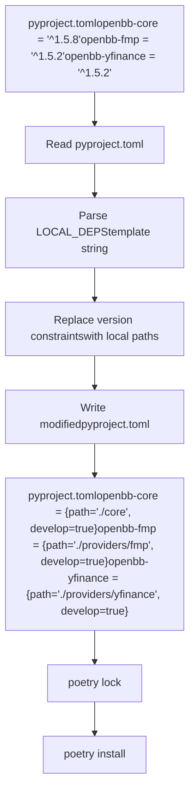
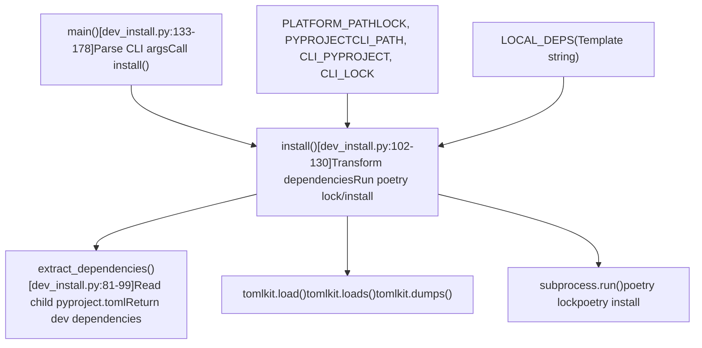
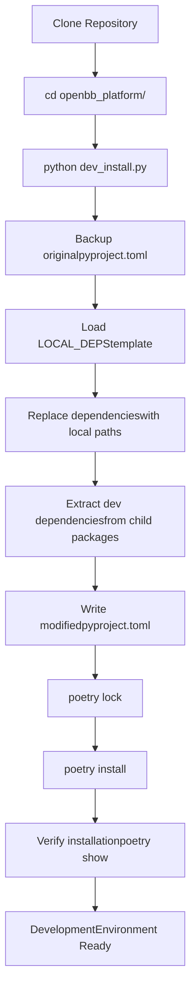
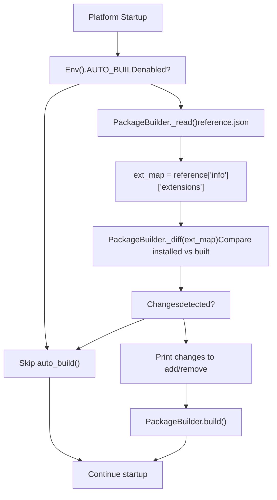

# Development Setup

Relevant source files

-   [.pre-commit-config.yaml](https://github.com/OpenBB-finance/OpenBB/blob/dddc3b32/.pre-commit-config.yaml)
-   [README.md](https://github.com/OpenBB-finance/OpenBB/blob/dddc3b32/README.md?plain=1)
-   [cli/poetry.lock](https://github.com/OpenBB-finance/OpenBB/blob/dddc3b32/cli/poetry.lock)
-   [cli/tests/test\_argparse\_translator\_obbject\_registry.py](https://github.com/OpenBB-finance/OpenBB/blob/dddc3b32/cli/tests/test_argparse_translator_obbject_registry.py)
-   [openbb\_platform/core/openbb/assets/reference.json](https://github.com/OpenBB-finance/OpenBB/blob/dddc3b32/openbb_platform/core/openbb/assets/reference.json)
-   [openbb\_platform/core/openbb\_core/api/app\_loader.py](https://github.com/OpenBB-finance/OpenBB/blob/dddc3b32/openbb_platform/core/openbb_core/api/app_loader.py)
-   [openbb\_platform/core/openbb\_core/api/exception\_handlers.py](https://github.com/OpenBB-finance/OpenBB/blob/dddc3b32/openbb_platform/core/openbb_core/api/exception_handlers.py)
-   [openbb\_platform/core/openbb\_core/api/rest\_api.py](https://github.com/OpenBB-finance/OpenBB/blob/dddc3b32/openbb_platform/core/openbb_core/api/rest_api.py)
-   [openbb\_platform/core/openbb\_core/api/router/coverage.py](https://github.com/OpenBB-finance/OpenBB/blob/dddc3b32/openbb_platform/core/openbb_core/api/router/coverage.py)
-   [openbb\_platform/core/openbb\_core/app/provider\_interface.py](https://github.com/OpenBB-finance/OpenBB/blob/dddc3b32/openbb_platform/core/openbb_core/app/provider_interface.py)
-   [openbb\_platform/core/openbb\_core/app/router.py](https://github.com/OpenBB-finance/OpenBB/blob/dddc3b32/openbb_platform/core/openbb_core/app/router.py)
-   [openbb\_platform/core/openbb\_core/app/static/package\_builder.py](https://github.com/OpenBB-finance/OpenBB/blob/dddc3b32/openbb_platform/core/openbb_core/app/static/package_builder.py)
-   [openbb\_platform/core/openbb\_core/app/static/utils/filters.py](https://github.com/OpenBB-finance/OpenBB/blob/dddc3b32/openbb_platform/core/openbb_core/app/static/utils/filters.py)
-   [openbb\_platform/core/openbb\_core/app/utils.py](https://github.com/OpenBB-finance/OpenBB/blob/dddc3b32/openbb_platform/core/openbb_core/app/utils.py)
-   [openbb\_platform/core/openbb\_core/provider/registry\_map.py](https://github.com/OpenBB-finance/OpenBB/blob/dddc3b32/openbb_platform/core/openbb_core/provider/registry_map.py)
-   [openbb\_platform/core/openbb\_core/provider/standard\_models/fred\_release\_table.py](https://github.com/OpenBB-finance/OpenBB/blob/dddc3b32/openbb_platform/core/openbb_core/provider/standard_models/fred_release_table.py)
-   [openbb\_platform/core/openbb\_core/provider/standard\_models/futures\_curve.py](https://github.com/OpenBB-finance/OpenBB/blob/dddc3b32/openbb_platform/core/openbb_core/provider/standard_models/futures_curve.py)
-   [openbb\_platform/core/openbb\_core/provider/standard\_models/yield\_curve.py](https://github.com/OpenBB-finance/OpenBB/blob/dddc3b32/openbb_platform/core/openbb_core/provider/standard_models/yield_curve.py)
-   [openbb\_platform/core/poetry.lock](https://github.com/OpenBB-finance/OpenBB/blob/dddc3b32/openbb_platform/core/poetry.lock)
-   [openbb\_platform/core/pyproject.toml](https://github.com/OpenBB-finance/OpenBB/blob/dddc3b32/openbb_platform/core/pyproject.toml)
-   [openbb\_platform/core/tests/app/static/test\_filters.py](https://github.com/OpenBB-finance/OpenBB/blob/dddc3b32/openbb_platform/core/tests/app/static/test_filters.py)
-   [openbb\_platform/core/tests/app/static/test\_package\_builder.py](https://github.com/OpenBB-finance/OpenBB/blob/dddc3b32/openbb_platform/core/tests/app/static/test_package_builder.py)
-   [openbb\_platform/core/tests/app/test\_platform\_router.py](https://github.com/OpenBB-finance/OpenBB/blob/dddc3b32/openbb_platform/core/tests/app/test_platform_router.py)
-   [openbb\_platform/core/tests/app/test\_provider\_interface.py](https://github.com/OpenBB-finance/OpenBB/blob/dddc3b32/openbb_platform/core/tests/app/test_provider_interface.py)
-   [openbb\_platform/dev\_install.py](https://github.com/OpenBB-finance/OpenBB/blob/dddc3b32/openbb_platform/dev_install.py)
-   [openbb\_platform/extensions/devtools/poetry.lock](https://github.com/OpenBB-finance/OpenBB/blob/dddc3b32/openbb_platform/extensions/devtools/poetry.lock)
-   [openbb\_platform/extensions/devtools/pyproject.toml](https://github.com/OpenBB-finance/OpenBB/blob/dddc3b32/openbb_platform/extensions/devtools/pyproject.toml)
-   [openbb\_platform/obbject\_extensions/charting/tests/test\_charting.py](https://github.com/OpenBB-finance/OpenBB/blob/dddc3b32/openbb_platform/obbject_extensions/charting/tests/test_charting.py)
-   [openbb\_platform/poetry.lock](https://github.com/OpenBB-finance/OpenBB/blob/dddc3b32/openbb_platform/poetry.lock)
-   [openbb\_platform/providers/bls/openbb\_bls/utils/helpers.py](https://github.com/OpenBB-finance/OpenBB/blob/dddc3b32/openbb_platform/providers/bls/openbb_bls/utils/helpers.py)
-   [openbb\_platform/providers/cboe/openbb\_cboe/models/futures\_curve.py](https://github.com/OpenBB-finance/OpenBB/blob/dddc3b32/openbb_platform/providers/cboe/openbb_cboe/models/futures_curve.py)
-   [openbb\_platform/providers/cboe/tests/test\_cboe\_fetchers.py](https://github.com/OpenBB-finance/OpenBB/blob/dddc3b32/openbb_platform/providers/cboe/tests/test_cboe_fetchers.py)
-   [openbb\_platform/providers/fred/openbb\_fred/models/release\_table.py](https://github.com/OpenBB-finance/OpenBB/blob/dddc3b32/openbb_platform/providers/fred/openbb_fred/models/release_table.py)
-   [openbb\_platform/providers/yfinance/poetry.lock](https://github.com/OpenBB-finance/OpenBB/blob/dddc3b32/openbb_platform/providers/yfinance/poetry.lock)
-   [openbb\_platform/pyproject.toml](https://github.com/OpenBB-finance/OpenBB/blob/dddc3b32/openbb_platform/pyproject.toml)

This page explains how to configure a local development environment for contributing to the OpenBB Platform. It covers Poetry workspace configuration, the `dev_install.py` script that converts package dependencies to local paths, virtual environment management, and development workflow patterns.

For information about code quality tools and pre-commit hooks, see [Code Quality and Testing](/OpenBB-finance/OpenBB/6.2-code-quality-and-testing). For building custom extensions, see [Creating Extensions](/OpenBB-finance/OpenBB/6.3-creating-extensions).

---

## Overview

The OpenBB Platform uses **Poetry** for dependency management and package building. The repository is structured as a monorepo with multiple independently-versioned packages (core, providers, extensions) that reference each other. For local development, the [dev\_install.py1-178](https://github.com/OpenBB-finance/OpenBB/blob/dddc3b32/dev_install.py#L1-L178) script automates the conversion of PyPI version constraints to local path dependencies with `develop=true`, enabling live code reloading.

The platform also includes an **AUTO\_BUILD** mechanism managed by the `PackageBuilder` class [openbb\_platform/core/openbb\_core/app/static/package\_builder.py134-361](https://github.com/OpenBB-finance/OpenBB/blob/dddc3b32/openbb_platform/core/openbb_core/app/static/package_builder.py#L134-L361) that automatically regenerates Python SDK code when extensions are added or removed. This can be configured via environment variables to enable automatic rebuilds on platform startup.

**Sources:** [dev\_install.py1-178](https://github.com/OpenBB-finance/OpenBB/blob/dddc3b32/dev_install.py#L1-L178) [openbb\_platform/core/openbb\_core/app/static/package\_builder.py134-361](https://github.com/OpenBB-finance/OpenBB/blob/dddc3b32/openbb_platform/core/openbb_core/app/static/package_builder.py#L134-L361)

---

## Repository Structure

The development workspace is organized under `openbb_platform/`:

```
openbb_platform/
├── pyproject.toml              # Main aggregator package
├── poetry.lock                 # Lockfile for main package
├── dev_install.py              # Development install script
├── core/                       # openbb-core package
│   ├── pyproject.toml
│   └── poetry.lock
├── providers/                  # Data provider packages
│   ├── yfinance/
│   │   ├── pyproject.toml
│   │   └── poetry.lock
│   ├── fmp/
│   └── ...
├── extensions/                 # Domain extensions
│   ├── economy/
│   ├── equity/
│   ├── devtools/               # Development tools
│   │   └── pyproject.toml
│   └── ...
└── obbject_extensions/         # Optional extensions
    └── charting/
```
Each package maintains its own `pyproject.toml` and `poetry.lock` for isolated dependency management.

**Sources:** [openbb\_platform/pyproject.toml1-119](https://github.com/OpenBB-finance/OpenBB/blob/dddc3b32/openbb_platform/pyproject.toml#L1-L119) [openbb\_platform/core/pyproject.toml1-36](https://github.com/OpenBB-finance/OpenBB/blob/dddc3b32/openbb_platform/core/pyproject.toml#L1-L36) [openbb\_platform/extensions/devtools/pyproject.toml1-37](https://github.com/OpenBB-finance/OpenBB/blob/dddc3b32/openbb_platform/extensions/devtools/pyproject.toml#L1-L37) [openbb\_platform/providers/yfinance/pyproject.toml1-21](https://github.com/OpenBB-finance/OpenBB/blob/dddc3b32/openbb_platform/providers/yfinance/pyproject.toml#L1-L21)

---

## Development Dependencies in pyproject.toml Files

### Core Package Dependencies

The core package defines the base dependencies for the entire platform:

[openbb\_platform/core/pyproject.toml13-28](https://github.com/OpenBB-finance/OpenBB/blob/dddc3b32/openbb_platform/core/pyproject.toml#L13-L28)

Key dependencies include:

-   `python = ">=3.10,<3.14"` - Python version constraint
-   `fastapi = "^0.128.0"` - API framework
-   `pydantic = "^2.12.3"` - Data validation
-   `uvicorn = "^0.40.0"` - ASGI server
-   `pandas = ">=1.5.3"` - Data manipulation
-   `aiohttp = ">=3.13.3"` - Async HTTP client
-   `ruff = "^0.13"` - Linter (needed for generated code)

### Development Tools Package

The devtools extension contains all development and testing tools:

[openbb\_platform/extensions/devtools/pyproject.toml10-31](https://github.com/OpenBB-finance/OpenBB/blob/dddc3b32/openbb_platform/extensions/devtools/pyproject.toml#L10-L31)

This package includes:

-   **Linters/Formatters:** `ruff`, `pylint`, `mypy`, `black`, `pydocstyle`, `bandit`, `codespell`
-   **Testing:** `pytest`, `pytest-cov`, `pytest-asyncio`, `pytest-recorder`, `pytest-order`
-   **Pre-commit:** `pre-commit` for git hooks
-   **Build Tools:** `poetry`, `tox`
-   **Type Stubs:** `types-python-dateutil`, `types-toml`

### Provider Package Structure

Provider packages follow a standard structure:

[openbb\_platform/providers/yfinance/pyproject.toml1-21](https://github.com/OpenBB-finance/OpenBB/blob/dddc3b32/openbb_platform/providers/yfinance/pyproject.toml#L1-L21)

Key elements:

-   Version-pinned dependency on `openbb-core`
-   Provider-specific dependencies (e.g., `yfinance = "^0.2.66"`)
-   Entry point registration via `[tool.poetry.plugins."openbb_provider_extension"]`

**Sources:** [openbb\_platform/core/pyproject.toml13-28](https://github.com/OpenBB-finance/OpenBB/blob/dddc3b32/openbb_platform/core/pyproject.toml#L13-L28) [openbb\_platform/extensions/devtools/pyproject.toml10-31](https://github.com/OpenBB-finance/OpenBB/blob/dddc3b32/openbb_platform/extensions/devtools/pyproject.toml#L10-L31) [openbb\_platform/providers/yfinance/pyproject.toml1-21](https://github.com/OpenBB-finance/OpenBB/blob/dddc3b32/openbb_platform/providers/yfinance/pyproject.toml#L1-L21)

---

## The dev\_install.py Script

### Purpose and Workflow

The `dev_install.py` script is the primary tool for setting up a local development environment. It performs these transformations:


### Script Structure

**Diagram: dev\_install.py Module Organization**


[dev\_install.py1-178](https://github.com/OpenBB-finance/OpenBB/blob/dddc3b32/dev_install.py#L1-L178) contains three main sections:

1.  **Constant Definitions** [dev\_install.py11-78](https://github.com/OpenBB-finance/OpenBB/blob/dddc3b32/dev_install.py#L11-L78)

    -   Path constants: `PLATFORM_PATH`, `LOCK`, `PYPROJECT`, `CLI_PATH`, etc.
    -   `LOCAL_DEPS` string template defining all local dependencies with `develop = true`
2.  **Helper Functions**:

    -   `extract_dependencies()` [dev\_install.py81-99](https://github.com/OpenBB-finance/OpenBB/blob/dddc3b32/dev_install.py#L81-L99) - Reads `pyproject.toml` from child packages and extracts dev dependencies
    -   `install()` [dev\_install.py102-130](https://github.com/OpenBB-finance/OpenBB/blob/dddc3b32/dev_install.py#L102-L130) - Main transformation logic: backs up original, replaces dependencies, runs poetry commands
    -   `main()` [dev\_install.py133-178](https://github.com/OpenBB-finance/OpenBB/blob/dddc3b32/dev_install.py#L133-L178) - Entry point with argparse for CLI flags
3.  **External Dependencies**:

    -   `tomlkit` - TOML file parsing and manipulation
    -   `subprocess` - Execute `poetry lock` and `poetry install` commands

**Sources:** [dev\_install.py1-178](https://github.com/OpenBB-finance/OpenBB/blob/dddc3b32/dev_install.py#L1-L178)

### LOCAL\_DEPS Template

The `LOCAL_DEPS` constant defines the local path structure:

[dev\_install.py18-78](https://github.com/OpenBB-finance/OpenBB/blob/dddc3b32/dev_install.py#L18-L78)

Key patterns:

-   **Core and API:** `{ path = "./core", develop = true }`
-   **Providers:** `{ path = "./providers/<name>", develop = true }`
-   **Extensions:** `{ path = "./extensions/<name>", develop = true }`
-   **Optional Dependencies:** `optional = true` flag for extras
-   **Python Markers:** `markers = "python_version >= '3.10'"` for conditional installs

### Transformation Process

**Diagram: dev\_install.py Execution Flow**

> **[Mermaid sequence]**
> *(图表结构无法解析)*

**Sources:** [dev\_install.py81-178](https://github.com/OpenBB-finance/OpenBB/blob/dddc3b32/dev_install.py#L81-L178)

### CLI Options

The script's `main()` function supports several command-line flags:

[dev\_install.py133-178](https://github.com/OpenBB-finance/OpenBB/blob/dddc3b32/dev_install.py#L133-L178)

| Flag | Purpose | Implementation |
| --- | --- | --- |
| `--no-install` | Skip `poetry install` step, only rewrite dependencies | Sets `args.lock = True` and `args.install = False` |
| `--cli` | Install CLI package in addition to platform | Calls `install()` twice: platform then CLI |
| `--extras` | Install with `--all-extras` flag for optional dependencies | Adds `"--all-extras"` to poetry install command |
| `--lock` | Perform `poetry lock --no-update` instead of install | Runs `poetry lock --no-update` via subprocess |

Example usage:

```
# Standard installpython dev_install.py # With CLI and extraspython dev_install.py --cli --extras # Only lock, don't installpython dev_install.py --lock
```
**Sources:** [openbb\_platform/dev\_install.py133-178](https://github.com/OpenBB-finance/OpenBB/blob/dddc3b32/openbb_platform/dev_install.py#L133-L178)

---

## Virtual Environment Setup

### Poetry Environment Management

Poetry automatically creates and manages virtual environments. The environment is stored in one of these locations:

1.  **Default location:** `{cache-dir}/virtualenvs/`
2.  **In-project:** `.venv/` (if `virtualenvs.in-project = true`)

To configure Poetry settings:

```
# Use in-project virtualenvpoetry config virtualenvs.in-project true # View current configurationpoetry config --list # Show virtualenv pathpoetry env info --path
```
### Python Version Management

The platform requires Python 3.10-3.13:

[openbb\_platform/core/pyproject.toml14](https://github.com/OpenBB-finance/OpenBB/blob/dddc3b32/openbb_platform/core/pyproject.toml#L14-L14)

To set the Python version:

```
# Use specific Python versionpoetry env use python3.10poetry env use python3.11 # Or use absolute pathpoetry env use /usr/local/bin/python3.10
```
### Environment Activation

Poetry provides multiple ways to activate the environment:

```
# Option 1: Spawn a new shellpoetry shell # Option 2: Run commands in the environmentpoetry run python script.pypoetry run pytest # Option 3: Get environment path and activate manuallysource $(poetry env info --path)/bin/activate  # Unix$(poetry env info --path)\Scripts\activate.ps1  # Windows
```
**Sources:** [openbb\_platform/core/pyproject.toml14](https://github.com/OpenBB-finance/OpenBB/blob/dddc3b32/openbb_platform/core/pyproject.toml#L14-L14)

---

## Installation Workflow

### Standard Development Setup


### Full Installation with CLI

For development on both platform and CLI:

```
# Install platform with CLI supportcd openbb_platform/python dev_install.py --cli # This performs:# 1. Install platform packages in editable mode# 2. Modify cli/pyproject.toml with local path# 3. Install CLI package in editable mode
```
The CLI installation process:

[dev\_install.py152-178](https://github.com/OpenBB-finance/OpenBB/blob/dddc3b32/dev_install.py#L152-L178)

### Editable Mode Details

When `develop = true` is specified, Poetry installs packages in **editable mode**:

-   Code changes are immediately reflected without reinstallation
-   Package is linked via `.pth` file in site-packages
-   Import system resolves to source directory
-   Equivalent to `pip install -e .`

Example from installed environment:

```
import openbb_coreprint(openbb_core.__file__)# Output: /path/to/openbb_platform/core/openbb_core/__init__.py
```
**Sources:** [openbb\_platform/dev\_install.py102-178](https://github.com/OpenBB-finance/OpenBB/blob/dddc3b32/openbb_platform/dev_install.py#L102-L178)

---

## Dependency Resolution

### Lock File Management

Each package maintains its own `poetry.lock` file:

-   **Platform lock:** [openbb\_platform/poetry.lock1-50](https://github.com/OpenBB-finance/OpenBB/blob/dddc3b32/openbb_platform/poetry.lock#L1-L50) (~26,000 lines)
-   **Core lock:** [openbb\_platform/core/poetry.lock1-50](https://github.com/OpenBB-finance/OpenBB/blob/dddc3b32/openbb_platform/core/poetry.lock#L1-L50) (~33,000 lines)
-   **Provider locks:** [openbb\_platform/providers/yfinance/poetry.lock1-50](https://github.com/OpenBB-finance/OpenBB/blob/dddc3b32/openbb_platform/providers/yfinance/poetry.lock#L1-L50) (per provider)
-   **CLI lock:** [cli/poetry.lock1-50](https://github.com/OpenBB-finance/OpenBB/blob/dddc3b32/cli/poetry.lock#L1-L50) (~18,000 lines)

Lock files pin exact versions of all transitive dependencies:

[openbb\_platform/core/poetry.lock15-26](https://github.com/OpenBB-finance/OpenBB/blob/dddc3b32/openbb_platform/core/poetry.lock#L15-L26)

### Updating Dependencies

```
# Update all dependenciespoetry update # Update specific packagepoetry update pandas # Update without modifying pyproject.toml constraintspoetry lock --no-update # Show outdated packagespoetry show --outdated
```
### Handling Dependency Conflicts

When conflicts occur:

1.  **Check conflicting constraints:**

    ```
    poetry show <package>
    ```

2.  **Relax version constraints** in `pyproject.toml`:

    ```
    # Before (strict)pandas = "^1.5.3" # After (relaxed)pandas = ">=1.5.3,<3.0"
    ```

3.  **Force resolution:**

    ```
    poetry lock --no-updatepoetry install
    ```


**Sources:** [openbb\_platform/poetry.lock1-50](https://github.com/OpenBB-finance/OpenBB/blob/dddc3b32/openbb_platform/poetry.lock#L1-L50) [openbb\_platform/core/poetry.lock1-50](https://github.com/OpenBB-finance/OpenBB/blob/dddc3b32/openbb_platform/core/poetry.lock#L1-L50)

---

## .gitignore Configuration

### Development Artifacts Excluded

The `.gitignore` ensures development artifacts are not committed:

[.gitignore1-64](https://github.com/OpenBB-finance/OpenBB/blob/dddc3b32/.gitignore#L1-L64)

Key exclusion patterns:

| Pattern | Purpose |
| --- | --- |
| `__pycache__/`, `*.pyc` | Python bytecode |
| `.venv`, `venv*/` | Virtual environments |
| `.mypy_cache`, `.ruff_cache`, `.pytest_cache` | Tool caches |
| `*.ipynb` | Jupyter notebooks (except whitelisted) |
| `.coverage*`, `htmlcov` | Test coverage reports |
| `openbb_platform/core/openbb/package/*` | Generated package code |
| `build/`, `dist/` | Build artifacts |
| `*.env` | Environment configuration files |

### Platform-Specific Exclusions

[.gitignore43-64](https://github.com/OpenBB-finance/OpenBB/blob/dddc3b32/.gitignore#L43-L64)

**Generated Code:**

-   `openbb_platform/core/openbb/package/*` - Auto-generated by PackageBuilder

**Build Artifacts:**

-   `build/cli`, `build/conda/tmp` - Build intermediates
-   `*.dmg`, `*.exe`, `*.pkg` - Installers

**Sources:** [.gitignore1-64](https://github.com/OpenBB-finance/OpenBB/blob/dddc3b32/.gitignore#L1-L64)

---

## Development Workflow

### Typical Development Cycle

> **[Mermaid stateDiagram]**
> *(图表结构无法解析)*

### Running Tests

From platform directory:

```
# Activate environmentpoetry shell # Run all testspytest # Run specific provider testspytest openbb_platform/providers/yfinance/tests/ # Run with coveragepytest --cov=openbb_core --cov-report=html # Run integration tests onlypytest -m integration
```
### Code Quality Checks

The devtools package provides all necessary tools:

```
# Run linterspoetry run ruff check .poetry run pylint openbb_core/ # Format codepoetry run black . # Type checkingpoetry run mypy openbb_core/ # Run all pre-commit hookspoetry run pre-commit run --all-files
```
For detailed information on code quality standards, see [Code Quality and Testing](/OpenBB-finance/OpenBB/6.2-code-quality-and-testing).

**Sources:** [openbb\_platform/extensions/devtools/pyproject.toml10-31](https://github.com/OpenBB-finance/OpenBB/blob/dddc3b32/openbb_platform/extensions/devtools/pyproject.toml#L10-L31)

---

## Package Building and Scripts

### Build Commands

Poetry provides commands for package management:

```
# Build distribution packagespoetry build # Build only wheelpoetry build -f wheel # Build only sdistpoetry build -f sdist # Output to custom directorypoetry build -o dist/
```
### Entry Points and Scripts

The core package defines the `openbb-build` script:

[openbb\_platform/core/pyproject.toml30-31](https://github.com/OpenBB-finance/OpenBB/blob/dddc3b32/openbb_platform/core/pyproject.toml#L30-L31)

This script can be executed as:

```
poetry run openbb-build# Or after activationopenbb-build
```
### Provider Plugin Registration

Providers register themselves via entry points:

[openbb\_platform/providers/yfinance/pyproject.toml19-20](https://github.com/OpenBB-finance/OpenBB/blob/dddc3b32/openbb_platform/providers/yfinance/pyproject.toml#L19-L20)

This allows automatic discovery by the core system without manual registration.

**Sources:** [openbb\_platform/core/pyproject.toml30-31](https://github.com/OpenBB-finance/OpenBB/blob/dddc3b32/openbb_platform/core/pyproject.toml#L30-L31) [openbb\_platform/providers/yfinance/pyproject.toml19-20](https://github.com/OpenBB-finance/OpenBB/blob/dddc3b32/openbb_platform/providers/yfinance/pyproject.toml#L19-L20)

---

## AUTO\_BUILD Configuration

### Overview

The `PackageBuilder` class [openbb\_platform/core/openbb\_core/app/static/package\_builder.py134-361](https://github.com/OpenBB-finance/OpenBB/blob/dddc3b32/openbb_platform/core/openbb_core/app/static/package_builder.py#L134-L361) provides automatic code generation when extensions are installed or removed. This is controlled by the `AUTO_BUILD` environment variable (from `Env` class).

### auto\_build() Method

**Diagram: AUTO\_BUILD Decision Flow**


The `auto_build()` method [openbb\_platform/core/openbb\_core/app/static/package\_builder.py149-168](https://github.com/OpenBB-finance/OpenBB/blob/dddc3b32/openbb_platform/core/openbb_core/app/static/package_builder.py#L149-L168) performs these steps:

1.  **Check AUTO\_BUILD flag:** Reads `Env().AUTO_BUILD` environment variable
2.  **Load reference.json:** Reads the last build state from [openbb\_platform/core/openbb/assets/reference.json1-15](https://github.com/OpenBB-finance/OpenBB/blob/dddc3b32/openbb_platform/core/openbb/assets/reference.json#L1-L15)
3.  **Compare extensions:** Calls `PackageBuilder._diff()` [openbb\_platform/core/openbb\_core/app/static/package\_builder.py318-361](https://github.com/OpenBB-finance/OpenBB/blob/dddc3b32/openbb_platform/core/openbb_core/app/static/package_builder.py#L318-L361) to find added/removed extensions
4.  **Trigger rebuild:** If differences found, calls `build()` method

### FileLock Mechanism

The `build()` method uses a file-based locking mechanism to prevent concurrent builds:

**Diagram: FileLock Implementation**

> **[Mermaid sequence]**
> *(图表结构无法解析)*

Key implementation details:

-   **Lock file location:** [openbb\_platform/core/openbb\_core/app/static/package\_builder.py147](https://github.com/OpenBB-finance/OpenBB/blob/dddc3b32/openbb_platform/core/openbb_core/app/static/package_builder.py#L147-L147) - `self._lock_path = self.directory / ".build.lock"`
-   **Cross-platform locking:** [openbb\_platform/core/openbb\_core/app/static/package\_builder.py67-73](https://github.com/OpenBB-finance/OpenBB/blob/dddc3b32/openbb_platform/core/openbb_core/app/static/package_builder.py#L67-L73) - Uses `fcntl` on Unix and `msvcrt` on Windows
-   **Non-blocking acquire:** [openbb\_platform/core/openbb\_core/app/static/package\_builder.py181](https://github.com/OpenBB-finance/OpenBB/blob/dddc3b32/openbb_platform/core/openbb_core/app/static/package_builder.py#L181-L181) - Prevents hanging if another build is running
-   **PID tracking:** [openbb\_platform/core/openbb\_core/app/static/package\_builder.py184-187](https://github.com/OpenBB-finance/OpenBB/blob/dddc3b32/openbb_platform/core/openbb_core/app/static/package_builder.py#L184-L187) - Writes process ID for debugging

### Enabling AUTO\_BUILD

Configure via environment variable:

```
# Enable AUTO_BUILDexport OPENBB_AUTO_BUILD=true # Or in .env fileOPENBB_AUTO_BUILD=true
```
When enabled, the platform will:

1.  Compare installed extensions with last build on startup
2.  Print extensions to add/remove
3.  Automatically rebuild if changes detected
4.  Use file locking to prevent concurrent builds

### Extension Detection

The `_diff()` method [openbb\_platform/core/openbb\_core/app/static/package\_builder.py318-361](https://github.com/OpenBB-finance/OpenBB/blob/dddc3b32/openbb_platform/core/openbb_core/app/static/package_builder.py#L318-L361) compares three extension groups:

| Group | Purpose |
| --- | --- |
| `openbb_core_extension` | Domain extensions (economy, equity, etc.) |
| `openbb_provider_extension` | Data providers (fmp, yfinance, etc.) |
| `openbb_obbject_extension` | OBBject extensions (charting) |

Example output when extensions change:

```
Extensions to add: openbb-cboe@1.5.1, openbb-nasdaq@1.5.1
Extensions to remove: openbb-biztoc@1.5.1

Building...
```
**Sources:** [openbb\_platform/core/openbb\_core/app/static/package\_builder.py134-361](https://github.com/OpenBB-finance/OpenBB/blob/dddc3b32/openbb_platform/core/openbb_core/app/static/package_builder.py#L134-L361) [openbb\_platform/core/openbb/assets/reference.json1-15](https://github.com/OpenBB-finance/OpenBB/blob/dddc3b32/openbb_platform/core/openbb/assets/reference.json#L1-L15)

---

## Common Issues and Solutions

### Issue: Import Errors After Installation

**Symptom:** `ModuleNotFoundError` for local packages

**Solution:**

```
# Verify packages are installed in editable modepoetry show -v openbb-core# Should show: path = "../core" develop = true # Reinstall if neededpoetry install --no-cache
```
### Issue: Lock File Conflicts

**Symptom:** `poetry lock` fails with dependency conflicts

**Solution:**

```
# Clear cachepoetry cache clear . --all # Remove lock file and regeneraterm poetry.lockpoetry lock # If still failing, check for circular dependenciespoetry show --tree
```
### Issue: Wrong Python Version

**Symptom:** `The current project's Python requirement (>=3.10,<3.14) is not compatible`

**Solution:**

```
# Remove existing environmentpoetry env remove python # Create with correct versionpoetry env use python3.10 # Reinstallpython dev_install.py
```
### Issue: Stale Generated Code

**Symptom:** Changes in extensions not reflected in `openbb.package`

**Solution:**

```
# The package is auto-generated and gitignored# Force rebuild with AUTO_BUILD:export OPENBB_AUTO_BUILD=truepython -c "import openbb; print(openbb.__version__)" # Or manually delete and regenerate:rm -rf openbb_platform/core/openbb/package/python -c "import openbb"
```
### Issue: Build Lock Timeout

**Symptom:** `RuntimeError: Another build process is running and has locked .build.lock`

**Solution:**

```
# Check if another build is runningps aux | grep python | grep dev_install # If no build is running, remove stale lockrm openbb_platform/core/.build.lock # Retry buildpython dev_install.py
```
**Sources:** [.gitignore54](https://github.com/OpenBB-finance/OpenBB/blob/dddc3b32/.gitignore#L54-L54) [openbb\_platform/core/openbb\_core/app/static/package\_builder.py149-206](https://github.com/OpenBB-finance/OpenBB/blob/dddc3b32/openbb_platform/core/openbb_core/app/static/package_builder.py#L149-L206)

---

## Summary

The OpenBB Platform development setup centers on these key concepts:

1.  **Poetry Workspace:** Each package maintains independent `pyproject.toml` and `poetry.lock` files
2.  **dev\_install.py:** Converts PyPI dependencies to local editable paths for development
3.  **Editable Mode:** `develop = true` enables live code reloading without reinstallation
4.  **devtools Package:** Consolidates all linting, testing, and quality tools
5.  **Lock Files:** Pin exact versions across the entire dependency tree

To get started:

```
cd openbb_platform/python dev_install.pypoetry shell
```
**Sources:** [openbb\_platform/dev\_install.py1-178](https://github.com/OpenBB-finance/OpenBB/blob/dddc3b32/openbb_platform/dev_install.py#L1-L178) [openbb\_platform/pyproject.toml1-119](https://github.com/OpenBB-finance/OpenBB/blob/dddc3b32/openbb_platform/pyproject.toml#L1-L119) [openbb\_platform/core/pyproject.toml1-36](https://github.com/OpenBB-finance/OpenBB/blob/dddc3b32/openbb_platform/core/pyproject.toml#L1-L36) [openbb\_platform/extensions/devtools/pyproject.toml1-37](https://github.com/OpenBB-finance/OpenBB/blob/dddc3b32/openbb_platform/extensions/devtools/pyproject.toml#L1-L37) [.gitignore1-64](https://github.com/OpenBB-finance/OpenBB/blob/dddc3b32/.gitignore#L1-L64)
