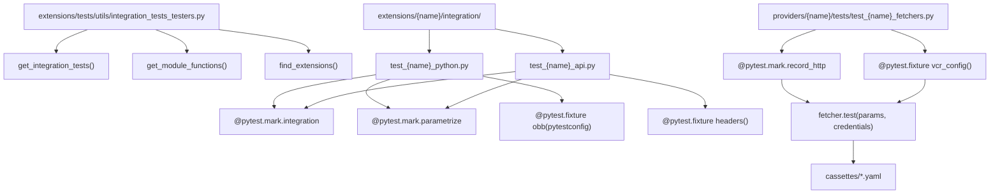
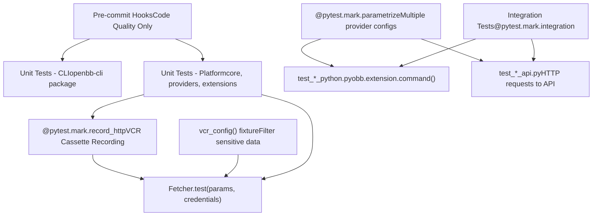
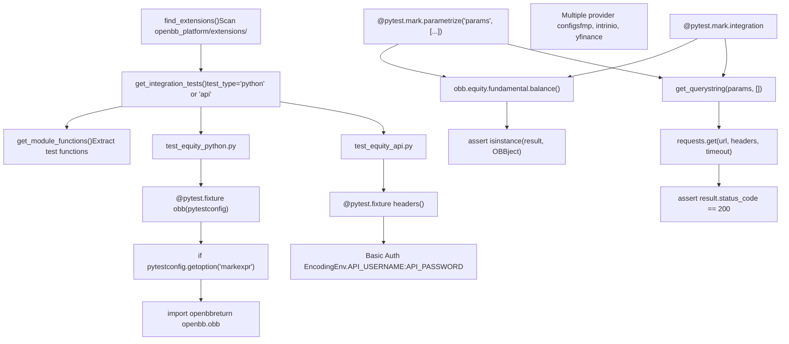
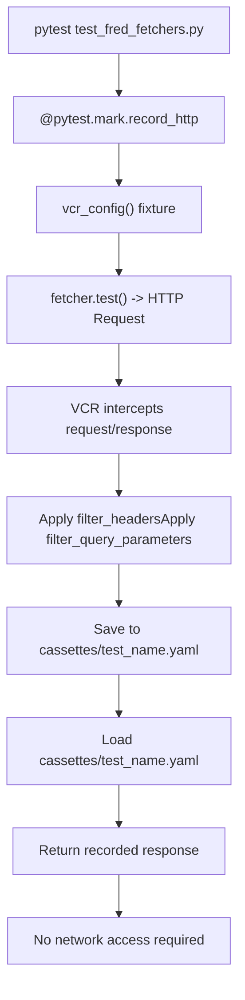
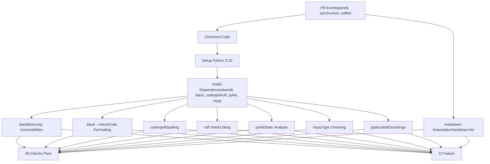
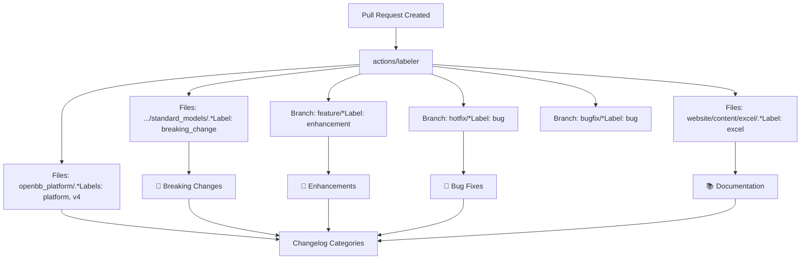
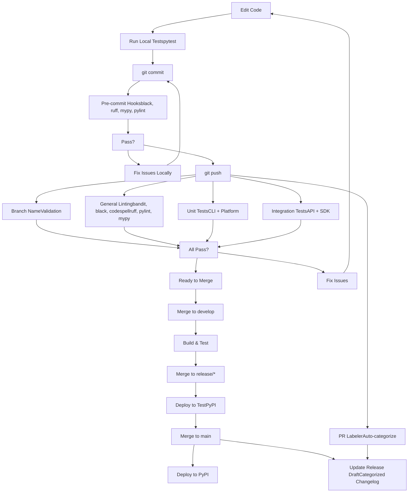

# Code Quality and Testing

Relevant source files

-   [.github/labeler.yml](https://github.com/OpenBB-finance/OpenBB/blob/dddc3b32/.github/labeler.yml)
-   [.github/platform-drafter.yml](https://github.com/OpenBB-finance/OpenBB/blob/dddc3b32/.github/platform-drafter.yml)
-   [.github/release-drafter.yml](https://github.com/OpenBB-finance/OpenBB/blob/dddc3b32/.github/release-drafter.yml)
-   [.github/workflows/README.md](https://github.com/OpenBB-finance/OpenBB/blob/dddc3b32/.github/workflows/README.md?plain=1)
-   [.pre-commit-config.yaml](https://github.com/OpenBB-finance/OpenBB/blob/dddc3b32/.pre-commit-config.yaml)
-   [README.md](https://github.com/OpenBB-finance/OpenBB/blob/dddc3b32/README.md?plain=1)
-   [openbb\_platform/core/openbb\_core/app/model/charts/chart.py](https://github.com/OpenBB-finance/OpenBB/blob/dddc3b32/openbb_platform/core/openbb_core/app/model/charts/chart.py)
-   [openbb\_platform/core/openbb\_core/provider/standard\_models/company\_filings.py](https://github.com/OpenBB-finance/OpenBB/blob/dddc3b32/openbb_platform/core/openbb_core/provider/standard_models/company_filings.py)
-   [openbb\_platform/core/openbb\_core/provider/standard\_models/primary\_dealer\_fails.py](https://github.com/OpenBB-finance/OpenBB/blob/dddc3b32/openbb_platform/core/openbb_core/provider/standard_models/primary_dealer_fails.py)
-   [openbb\_platform/core/tests/app/model/charts/test\_chart.py](https://github.com/OpenBB-finance/OpenBB/blob/dddc3b32/openbb_platform/core/tests/app/model/charts/test_chart.py)
-   [openbb\_platform/extensions/economy/integration/test\_economy\_api.py](https://github.com/OpenBB-finance/OpenBB/blob/dddc3b32/openbb_platform/extensions/economy/integration/test_economy_api.py)
-   [openbb\_platform/extensions/economy/integration/test\_economy\_python.py](https://github.com/OpenBB-finance/OpenBB/blob/dddc3b32/openbb_platform/extensions/economy/integration/test_economy_python.py)
-   [openbb\_platform/extensions/economy/openbb\_economy/economy\_router.py](https://github.com/OpenBB-finance/OpenBB/blob/dddc3b32/openbb_platform/extensions/economy/openbb_economy/economy_router.py)
-   [openbb\_platform/extensions/economy/openbb\_economy/survey/survey\_router.py](https://github.com/OpenBB-finance/OpenBB/blob/dddc3b32/openbb_platform/extensions/economy/openbb_economy/survey/survey_router.py)
-   [openbb\_platform/extensions/equity/integration/test\_equity\_api.py](https://github.com/OpenBB-finance/OpenBB/blob/dddc3b32/openbb_platform/extensions/equity/integration/test_equity_api.py)
-   [openbb\_platform/extensions/equity/integration/test\_equity\_python.py](https://github.com/OpenBB-finance/OpenBB/blob/dddc3b32/openbb_platform/extensions/equity/integration/test_equity_python.py)
-   [openbb\_platform/extensions/equity/openbb\_equity/fundamental/fundamental\_router.py](https://github.com/OpenBB-finance/OpenBB/blob/dddc3b32/openbb_platform/extensions/equity/openbb_equity/fundamental/fundamental_router.py)
-   [openbb\_platform/extensions/etf/integration/test\_etf\_api.py](https://github.com/OpenBB-finance/OpenBB/blob/dddc3b32/openbb_platform/extensions/etf/integration/test_etf_api.py)
-   [openbb\_platform/extensions/etf/integration/test\_etf\_python.py](https://github.com/OpenBB-finance/OpenBB/blob/dddc3b32/openbb_platform/extensions/etf/integration/test_etf_python.py)
-   [openbb\_platform/extensions/platform\_api/openbb\_platform\_api/assets/default\_apps.json](https://github.com/OpenBB-finance/OpenBB/blob/dddc3b32/openbb_platform/extensions/platform_api/openbb_platform_api/assets/default_apps.json)
-   [openbb\_platform/extensions/tests/test\_integration\_tests\_api.py](https://github.com/OpenBB-finance/OpenBB/blob/dddc3b32/openbb_platform/extensions/tests/test_integration_tests_api.py)
-   [openbb\_platform/extensions/tests/test\_integration\_tests\_python.py](https://github.com/OpenBB-finance/OpenBB/blob/dddc3b32/openbb_platform/extensions/tests/test_integration_tests_python.py)
-   [openbb\_platform/extensions/tests/utils/integration\_tests\_api\_generator.py](https://github.com/OpenBB-finance/OpenBB/blob/dddc3b32/openbb_platform/extensions/tests/utils/integration_tests_api_generator.py)
-   [openbb\_platform/extensions/tests/utils/integration\_tests\_testers.py](https://github.com/OpenBB-finance/OpenBB/blob/dddc3b32/openbb_platform/extensions/tests/utils/integration_tests_testers.py)
-   [openbb\_platform/providers/federal\_reserve/openbb\_federal\_reserve/\_\_init\_\_.py](https://github.com/OpenBB-finance/OpenBB/blob/dddc3b32/openbb_platform/providers/federal_reserve/openbb_federal_reserve/__init__.py)
-   [openbb\_platform/providers/federal\_reserve/openbb\_federal\_reserve/assets/historical\_releases.json](https://github.com/OpenBB-finance/OpenBB/blob/dddc3b32/openbb_platform/providers/federal_reserve/openbb_federal_reserve/assets/historical_releases.json)
-   [openbb\_platform/providers/federal\_reserve/openbb\_federal\_reserve/models/fomc\_documents.py](https://github.com/OpenBB-finance/OpenBB/blob/dddc3b32/openbb_platform/providers/federal_reserve/openbb_federal_reserve/models/fomc_documents.py)
-   [openbb\_platform/providers/federal\_reserve/openbb\_federal\_reserve/models/primary\_dealer\_fails.py](https://github.com/OpenBB-finance/OpenBB/blob/dddc3b32/openbb_platform/providers/federal_reserve/openbb_federal_reserve/models/primary_dealer_fails.py)
-   [openbb\_platform/providers/federal\_reserve/openbb\_federal\_reserve/models/primary\_dealer\_positioning.py](https://github.com/OpenBB-finance/OpenBB/blob/dddc3b32/openbb_platform/providers/federal_reserve/openbb_federal_reserve/models/primary_dealer_positioning.py)
-   [openbb\_platform/providers/federal\_reserve/openbb\_federal\_reserve/utils/fomc\_documents.py](https://github.com/OpenBB-finance/OpenBB/blob/dddc3b32/openbb_platform/providers/federal_reserve/openbb_federal_reserve/utils/fomc_documents.py)
-   [openbb\_platform/providers/federal\_reserve/openbb\_federal\_reserve/utils/primary\_dealer\_statistics.py](https://github.com/OpenBB-finance/OpenBB/blob/dddc3b32/openbb_platform/providers/federal_reserve/openbb_federal_reserve/utils/primary_dealer_statistics.py)
-   [openbb\_platform/providers/federal\_reserve/tests/record/http/test\_federal\_reserve\_fetchers/test\_federal\_reserve\_fomc\_documents\_fetcher\_urllib3\_v2.yaml](https://github.com/OpenBB-finance/OpenBB/blob/dddc3b32/openbb_platform/providers/federal_reserve/tests/record/http/test_federal_reserve_fetchers/test_federal_reserve_fomc_documents_fetcher_urllib3_v2.yaml)
-   [openbb\_platform/providers/federal\_reserve/tests/record/http/test\_federal\_reserve\_fetchers/test\_federal\_reserve\_primary\_dealer\_fails\_fetcher\_urllib3\_v2.yaml](https://github.com/OpenBB-finance/OpenBB/blob/dddc3b32/openbb_platform/providers/federal_reserve/tests/record/http/test_federal_reserve_fetchers/test_federal_reserve_primary_dealer_fails_fetcher_urllib3_v2.yaml)
-   [openbb\_platform/providers/federal\_reserve/tests/test\_federal\_reserve\_fetchers.py](https://github.com/OpenBB-finance/OpenBB/blob/dddc3b32/openbb_platform/providers/federal_reserve/tests/test_federal_reserve_fetchers.py)
-   [openbb\_platform/providers/fmp/openbb\_fmp/\_\_init\_\_.py](https://github.com/OpenBB-finance/OpenBB/blob/dddc3b32/openbb_platform/providers/fmp/openbb_fmp/__init__.py)
-   [openbb\_platform/providers/fmp/openbb\_fmp/models/company\_filings.py](https://github.com/OpenBB-finance/OpenBB/blob/dddc3b32/openbb_platform/providers/fmp/openbb_fmp/models/company_filings.py)
-   [openbb\_platform/providers/fmp/pyproject.toml](https://github.com/OpenBB-finance/OpenBB/blob/dddc3b32/openbb_platform/providers/fmp/pyproject.toml)
-   [openbb\_platform/providers/fmp/tests/test\_fmp\_fetchers.py](https://github.com/OpenBB-finance/OpenBB/blob/dddc3b32/openbb_platform/providers/fmp/tests/test_fmp_fetchers.py)
-   [openbb\_platform/providers/fred/openbb\_fred/\_\_init\_\_.py](https://github.com/OpenBB-finance/OpenBB/blob/dddc3b32/openbb_platform/providers/fred/openbb_fred/__init__.py)
-   [openbb\_platform/providers/fred/openbb\_fred/models/manufacturing\_outlook\_ny.py](https://github.com/OpenBB-finance/OpenBB/blob/dddc3b32/openbb_platform/providers/fred/openbb_fred/models/manufacturing_outlook_ny.py)
-   [openbb\_platform/providers/fred/tests/record/http/test\_fred\_fetchers/test\_fred\_manufacturing\_outlook\_ny\_fetcher\_urllib3\_v2.yaml](https://github.com/OpenBB-finance/OpenBB/blob/dddc3b32/openbb_platform/providers/fred/tests/record/http/test_fred_fetchers/test_fred_manufacturing_outlook_ny_fetcher_urllib3_v2.yaml)
-   [openbb\_platform/providers/fred/tests/test\_fred\_fetchers.py](https://github.com/OpenBB-finance/OpenBB/blob/dddc3b32/openbb_platform/providers/fred/tests/test_fred_fetchers.py)
-   [openbb\_platform/providers/intrinio/openbb\_intrinio/\_\_init\_\_.py](https://github.com/OpenBB-finance/OpenBB/blob/dddc3b32/openbb_platform/providers/intrinio/openbb_intrinio/__init__.py)
-   [openbb\_platform/providers/intrinio/openbb\_intrinio/models/company\_filings.py](https://github.com/OpenBB-finance/OpenBB/blob/dddc3b32/openbb_platform/providers/intrinio/openbb_intrinio/models/company_filings.py)
-   [openbb\_platform/providers/intrinio/tests/test\_intrinio\_fetchers.py](https://github.com/OpenBB-finance/OpenBB/blob/dddc3b32/openbb_platform/providers/intrinio/tests/test_intrinio_fetchers.py)
-   [openbb\_platform/providers/sec/openbb\_sec/\_\_init\_\_.py](https://github.com/OpenBB-finance/OpenBB/blob/dddc3b32/openbb_platform/providers/sec/openbb_sec/__init__.py)
-   [openbb\_platform/providers/sec/openbb\_sec/utils/form4.py](https://github.com/OpenBB-finance/OpenBB/blob/dddc3b32/openbb_platform/providers/sec/openbb_sec/utils/form4.py)
-   [openbb\_platform/providers/sec/tests/test\_sec\_fetchers.py](https://github.com/OpenBB-finance/OpenBB/blob/dddc3b32/openbb_platform/providers/sec/tests/test_sec_fetchers.py)
-   [openbb\_platform/providers/tmx/openbb\_tmx/models/company\_filings.py](https://github.com/OpenBB-finance/OpenBB/blob/dddc3b32/openbb_platform/providers/tmx/openbb_tmx/models/company_filings.py)

This document covers the code quality enforcement mechanisms, testing strategies, and development standards used in the OpenBB Platform. It details the pre-commit hooks, linting tools, type checking systems, and test execution workflows that ensure code consistency and reliability across the codebase.

For information about the CI/CD deployment pipeline, see [CI/CD Pipeline](/OpenBB-finance/OpenBB/5.1-python-sdk). For guidance on creating new extensions that follow these quality standards, see [Creating Extensions](/OpenBB-finance/OpenBB/5.3-openbb-workspace-integration).

---

## Pre-commit Hook System

The OpenBB Platform enforces code quality standards through an automated pre-commit hook system configured in [.pre-commit-config.yaml1-95](https://github.com/OpenBB-finance/OpenBB/blob/dddc3b32/.pre-commit-config.yaml#L1-L95) This system runs multiple validation checks before allowing commits, ensuring that all code meets quality standards before entering the repository.

### Hook Execution Flow

```mermaid
flowchart TD
    GitCommit["git commit"]
    PreCommitFramework["pre-commit run"]
    CheckYAML["check-yaml"]
    EndOfFile["end-of-file-fixer"]
    TrailingWS["trailing-whitespace"]
    MergeConflict["check-merge-conflict"]
    DetectPrivKey["detect-private-key"]
    BlackFormat["black --check"]
    RuffLint["ruff check"]
    Pydocstyle["pydocstyle--config=ruff.tomlfiles: openbb_platform/|cli/"]
    Codespell["codespell--ignore-words=.codespell.ignore"]
    MypyCheck["mypy--ignore-missing-imports--check-untyped-defs"]
    PylintLocal["pylintsystem installation"]
    CheckGenFiles["check-generated-filesbash script"]
    DetectSecrets["detect-secrets--baseline .secrets.baseline"]
    Nbstripout["nbstripout"]
    Success["Commit Successful"]
    Fail["Commit Blocked"]

    GitCommit --> PreCommitFramework
    PreCommitFramework --> CheckYAML
    PreCommitFramework --> EndOfFile
    PreCommitFramework --> TrailingWS
    PreCommitFramework --> MergeConflict
    PreCommitFramework --> DetectPrivKey
    PreCommitFramework --> BlackFormat
    PreCommitFramework --> RuffLint
    PreCommitFramework --> Pydocstyle
    PreCommitFramework --> Codespell
    PreCommitFramework --> MypyCheck
    PreCommitFramework --> PylintLocal
    PreCommitFramework --> DetectSecrets
    PreCommitFramework --> Nbstripout
    PreCommitFramework --> CheckGenFiles
    CheckYAML --> Success
    EndOfFile --> Success
    TrailingWS --> Success
    MergeConflict --> Fail
    DetectPrivKey --> Fail
    BlackFormat --> Success
    RuffLint --> Success
    Pydocstyle --> Success
    Codespell --> Success
    MypyCheck --> Success
    PylintLocal --> Success
    DetectSecrets --> Fail
    Nbstripout --> Success
    CheckGenFiles --> Fail
```


Sources: [.pre-commit-config.yaml1-95](https://github.com/OpenBB-finance/OpenBB/blob/dddc3b32/.pre-commit-config.yaml#L1-L95)

<old\_str>

**Pytest Markers:**

| Marker | Purpose | Usage Location | Example |
| --- | --- | --- | --- |
| `@pytest.mark.integration` | End-to-end SDK/API tests | `extensions/*/integration/` | [openbb\_platform/extensions/equity/integration/test\_equity\_python.py52](https://github.com/OpenBB-finance/OpenBB/blob/dddc3b32/openbb_platform/extensions/equity/integration/test_equity_python.py#L52-L52) |
| `@pytest.mark.record_http` | VCR cassette recording | `providers/*/tests/` | [openbb\_platform/providers/fred/tests/test\_fred\_fetchers.py78](https://github.com/OpenBB-finance/OpenBB/blob/dddc3b32/openbb_platform/providers/fred/tests/test_fred_fetchers.py#L78-L78) |
| `@pytest.mark.parametrize` | Multiple test configurations | All test files | [openbb\_platform/extensions/equity/integration/test\_equity\_python.py21](https://github.com/OpenBB-finance/OpenBB/blob/dddc3b32/openbb_platform/extensions/equity/integration/test_equity_python.py#L21-L21) |

Sources: [openbb\_platform/extensions/equity/integration/test\_equity\_python.py1-80](https://github.com/OpenBB-finance/OpenBB/blob/dddc3b32/openbb_platform/extensions/equity/integration/test_equity_python.py#L1-L80) [openbb\_platform/providers/fred/tests/test\_fred\_fetchers.py1-85](https://github.com/OpenBB-finance/OpenBB/blob/dddc3b32/openbb_platform/providers/fred/tests/test_fred_fetchers.py#L1-L85) [openbb\_platform/extensions/tests/utils/integration\_tests\_testers.py1-200](https://github.com/OpenBB-finance/OpenBB/blob/dddc3b32/openbb_platform/extensions/tests/utils/integration_tests_testers.py#L1-L200) </old\_str> <new\_str>

### Test Categories and Markers

**Test Directory Structure:**

```
openbb_platform/
├── providers/
│   ├── fmp/tests/test_fmp_fetchers.py
│   ├── fred/tests/test_fred_fetchers.py
│   ├── intrinio/tests/test_intrinio_fetchers.py
│   └── sec/tests/test_sec_fetchers.py
├── extensions/
│   ├── equity/integration/
│   │   ├── test_equity_python.py
│   │   └── test_equity_api.py
│   ├── economy/integration/
│   │   ├── test_economy_python.py
│   │   └── test_economy_api.py
│   └── tests/utils/integration_tests_testers.py
└── core/tests/
```

### Code Formatters

#### Black

The `black` code formatter enforces consistent Python code style automatically. It runs on all Python files and reformats them according to the Black style guide.

**Configuration:**

-   Version: `25.1.0`
-   Repository: `https://github.com/psf/black`
-   Auto-fixes: Yes
-   Applies to: All `.py` files

Sources: [.pre-commit-config.yaml13-16](https://github.com/OpenBB-finance/OpenBB/blob/dddc3b32/.pre-commit-config.yaml#L13-L16)

#### Ruff

The `ruff` linter provides fast Python linting with auto-fix capabilities. It combines functionality from multiple linters including Flake8, isort, and pydocstyle.

**Configuration:**

-   Version: `v0.12.12`
-   Repository: `https://github.com/charliermarsh/ruff-pre-commit`
-   Auto-fixes: Yes
-   Applies to: All Python files

Sources: [.pre-commit-config.yaml17-20](https://github.com/OpenBB-finance/OpenBB/blob/dddc3b32/.pre-commit-config.yaml#L17-L20)

### Documentation Validators

#### Pydocstyle

The `pydocstyle` tool validates that all docstrings follow the configured style conventions.

**Configuration:**

-   Version: `6.3.0`
-   Config file: `ruff.toml`
-   File pattern: `'^(openbb_platform/|cli/).*\.py$'`
-   Exclusions: Test files (`tests/.*\.py`, `test_.*\.py`)
-   Additional dependencies: `tomli`

**Key Parameters:**

```
--config=ruff.toml
```
Sources: [.pre-commit-config.yaml21-32](https://github.com/OpenBB-finance/OpenBB/blob/dddc3b32/.pre-commit-config.yaml#L21-L32)

#### Codespell

The `codespell` tool checks for common misspellings in code comments, strings, and documentation.

**Configuration:**

-   Version: `v2.4.1`
-   Ignore list: `.codespell.ignore`
-   Quiet level: 2
-   Excluded patterns: tests, build artifacts, config files, notebooks, web assets

**Key Parameters:**

```
--ignore-words=.codespell.ignore--quiet-level=2--skip=./**/tests/**,./**/test_*.py,.git,*.css,*.csv,*.html,*.ini,*.ipynb,*.js,*.json,*.lock,*.scss,*.txt,*.yaml
```
Sources: [.pre-commit-config.yaml33-44](https://github.com/OpenBB-finance/OpenBB/blob/dddc3b32/.pre-commit-config.yaml#L33-L44)

### Type Checking

#### Mypy

The `mypy` type checker validates type annotations and performs static type analysis.

**Configuration:**

-   Version: `v1.15.0`
-   Repository: `https://github.com/pre-commit/mirrors-mypy`
-   Additional type stubs: `types-requests`, `types-setuptools`, `types-python-dateutil`, `types-pytz`
-   Exclusions: Test files (`test_.*\.py`)
-   Require serial: Yes

**Key Parameters:**

```
--ignore-missing-imports--scripts-are-modules--check-untyped-defs
```
Sources: [.pre-commit-config.yaml45-57](https://github.com/OpenBB-finance/OpenBB/blob/dddc3b32/.pre-commit-config.yaml#L45-L57)

### Static Analysis

#### Pylint

The `pylint` tool performs comprehensive static code analysis to detect errors, code smells, and style issues.

**Configuration:**

-   Local system installation
-   Language: Python
-   Applies to: All Python files

This is configured as a local hook, meaning it uses the version of `pylint` installed in the developer's environment.

Sources: [.pre-commit-config.yaml65-69](https://github.com/OpenBB-finance/OpenBB/blob/dddc3b32/.pre-commit-config.yaml#L65-L69)

### Security and Cleanup Tools

#### Detect Secrets

The `detect-secrets` tool prevents accidental commits of API keys, passwords, and other sensitive information.

**Configuration:**

-   Version: `v1.5.0`
-   Baseline file: `.secrets.baseline`
-   Exclusions: test cassettes, recordings, generated API docs, charting assets

**Key Parameters:**

```
--baseline .secrets.baseline--exclude-files cassettes/.*|record/.*|website/content/api/.*|openbb_platform/extensions/charting/openbb_charting/infrastructure/assets/.*\.js
```
Sources: [.pre-commit-config.yaml83-94](https://github.com/OpenBB-finance/OpenBB/blob/dddc3b32/.pre-commit-config.yaml#L83-L94)

#### Nbstripout

The `nbstripout` tool strips output from Jupyter notebooks before committing, keeping the repository clean and reducing diff noise.

**Configuration:**

-   Version: `0.8.1`
-   Applies to: All `.ipynb` files

Sources: [.pre-commit-config.yaml58-62](https://github.com/OpenBB-finance/OpenBB/blob/dddc3b32/.pre-commit-config.yaml#L58-L62)

### Custom Validation Hooks

#### Check Generated Files

A custom bash script prevents committing generated package files. The OpenBB Platform dynamically generates Python modules in `openbb_platform/core/openbb/package/`, and these should never be committed to git.

**Implementation:**

```
if git ls-files | grep "^openbb_platform/core/openbb/package/" | grep -v "^openbb_platform/core/openbb/package/__init__\.py$"; then  echo "Error: Attempting to commit generated files in package directory. Only __init__.py should exist."  exit 1fi
```
**Rationale:** The package directory contents are generated by the PackageBuilder during installation based on installed extensions. Committing these files would cause conflicts and inconsistencies.

Sources: [.pre-commit-config.yaml70-82](https://github.com/OpenBB-finance/OpenBB/blob/dddc3b32/.pre-commit-config.yaml#L70-L82)

---

## Testing Strategy

The OpenBB Platform implements a comprehensive testing strategy with multiple test layers executing at different stages of the development workflow.

### Test Categories and Markers


**Pytest Markers:**

| Marker | Purpose | Example |
| --- | --- | --- |
| `@pytest.mark.integration` | End-to-end tests requiring API server | [openbb\_platform/extensions/equity/integration/test\_equity\_python.py73](https://github.com/OpenBB-finance/OpenBB/blob/dddc3b32/openbb_platform/extensions/equity/integration/test_equity_python.py#L73-L73) |
| `@pytest.mark.record_http` | HTTP recording with VCR | [openbb\_platform/providers/fred/tests/test\_fred\_fetchers.py77](https://github.com/OpenBB-finance/OpenBB/blob/dddc3b32/openbb_platform/providers/fred/tests/test_fred_fetchers.py#L77-L77) |
| `@pytest.mark.parametrize` | Multiple test configurations | [openbb\_platform/extensions/equity/integration/test\_equity\_python.py21-72](https://github.com/OpenBB-finance/OpenBB/blob/dddc3b32/openbb_platform/extensions/equity/integration/test_equity_python.py#L21-L72) |

Sources: [openbb\_platform/extensions/equity/integration/test\_equity\_python.py1-80](https://github.com/OpenBB-finance/OpenBB/blob/dddc3b32/openbb_platform/extensions/equity/integration/test_equity_python.py#L1-L80) [openbb\_platform/providers/fred/tests/test\_fred\_fetchers.py1-85](https://github.com/OpenBB-finance/OpenBB/blob/dddc3b32/openbb_platform/providers/fred/tests/test_fred_fetchers.py#L1-L85)

### Unit Testing

Unit tests validate individual components in isolation. The platform uses `pytest` as the testing framework with specialized fixtures and patterns.

#### Provider Unit Tests

Provider tests validate fetcher implementations using the **VCR (Video Cassette Recorder)** pattern to record and replay HTTP requests. Each provider's fetcher implements a `test()` method defined in the base `Fetcher` class.

**VCR Test Pattern with Fetcher.test():**

```
# File: openbb_platform/providers/fred/tests/test_fred_fetchers.pyfrom openbb_core.app.service.user_service import UserServicefrom openbb_fred.models.consumer_price_index import FREDConsumerPriceIndexFetcher test_credentials = UserService().default_user_settings.credentials.model_dump(mode="json") @pytest.fixture(scope="module")def vcr_config():    """VCR configuration."""    return {        "filter_headers": [("User-Agent", None)],        "filter_query_parameters": [            ("api_key", "MOCK_API_KEY"),        ],    } @pytest.mark.record_httpdef test_fredcpi_fetcher(credentials=test_credentials):    """Test FREDConsumerPriceIndexFetcher."""    params = {"country": "portugal,spain"}        fetcher = FREDConsumerPriceIndexFetcher()    result = fetcher.test(params, credentials)  # Calls Fetcher.test() base method    assert result is None  # test() returns None on success, raises on failure
```
**Fetcher Test Method Flow:**

The `Fetcher.test()` method executes the complete fetch cycle:

1.  `transform_query()` - Validate and transform input parameters
2.  `extract_data()` or `aextract_data()` - Make HTTP request (recorded by VCR)
3.  `transform_data()` - Parse and validate response against data models

**VCR Configuration Patterns:**

| Provider | Filter Headers | Filter Query Parameters | Response Filters |
| --- | --- | --- | --- |
| FRED | `User-Agent` | `api_key` | None |
| FMP | `User-Agent` | `apikey` | `Location` header (redirect URLs) |
| Intrinio | `User-Agent` | `api_key`, `X-Amz-*` | None |
| SEC | `User-Agent` | None | None |

**Provider Test File Structure:**

| Provider | Test File Path | Fetcher Count | Example Test |
| --- | --- | --- | --- |
| FRED | `providers/fred/tests/test_fred_fetchers.py` | 42+ | `test_fredcpi_fetcher()` |
| FMP | `providers/fmp/tests/test_fmp_fetchers.py` | 60+ | `test_fmp_equity_historical_fetcher()` |
| Intrinio | `providers/intrinio/tests/test_intrinio_fetchers.py` | 30+ | `test_intrinio_equity_historical_fetcher()` |
| SEC | `providers/sec/tests/test_sec_fetchers.py` | 15+ | `test_sec_company_filings_fetcher()` |

**Cassette Storage:** Recorded HTTP interactions are saved as YAML files:

```
providers/{provider_name}/tests/cassettes/
└── test_{fetcher_name}.yaml
```
Sources: [openbb\_platform/providers/fred/tests/test\_fred\_fetchers.py62-85](https://github.com/OpenBB-finance/OpenBB/blob/dddc3b32/openbb_platform/providers/fred/tests/test_fred_fetchers.py#L62-L85) [openbb\_platform/providers/fmp/tests/test\_fmp\_fetchers.py83-119](https://github.com/OpenBB-finance/OpenBB/blob/dddc3b32/openbb_platform/providers/fmp/tests/test_fmp_fetchers.py#L83-L119) [openbb\_platform/providers/intrinio/tests/test\_intrinio\_fetchers.py75-114](https://github.com/OpenBB-finance/OpenBB/blob/dddc3b32/openbb_platform/providers/intrinio/tests/test_intrinio_fetchers.py#L75-L114) [openbb\_platform/providers/sec/tests/test\_sec\_fetchers.py40-48](https://github.com/OpenBB-finance/OpenBB/blob/dddc3b32/openbb_platform/providers/sec/tests/test_sec_fetchers.py#L40-L48)

#### CLI Unit Tests

Tests for the CLI interface validate command parsing, argument handling, and execution flow.

**Workflow:** Unit test CLI **Directory:** `cli/` **Execution:** Triggered on pull requests and feature branches

Sources: [.github/workflows/README.md94-96](https://github.com/OpenBB-finance/OpenBB/blob/dddc3b32/.github/workflows/README.md?plain=1#L94-L96)

#### Core and Extension Unit Tests

Core tests validate fundamental platform components while extension tests focus on router command implementations.

**Test Exclusions:** Pre-commit hooks exclude test files from certain checks:

-   Pydocstyle: `tests/.*\.py|openbb_platform/test_.*\.py`
-   Mypy: `test_.*\.py`

Sources: [.github/workflows/README.md98-100](https://github.com/OpenBB-finance/OpenBB/blob/dddc3b32/.github/workflows/README.md?plain=1#L98-L100) [.pre-commit-config.yaml31](https://github.com/OpenBB-finance/OpenBB/blob/dddc3b32/.pre-commit-config.yaml#L31-L31) [.pre-commit-config.yaml57](https://github.com/OpenBB-finance/OpenBB/blob/dddc3b32/.pre-commit-config.yaml#L57-L57)

### Integration Testing

Integration tests validate end-to-end functionality across the Python SDK and REST API interfaces using parametrized test configurations. Tests are automatically discovered and validated using utilities in `integration_tests_testers.py`.

**Integration Test Structure:**


**Python SDK Integration Tests:**

Integration tests use the `obb` fixture to test the dynamically-generated Python SDK:

```
# File: openbb_platform/extensions/equity/integration/test_equity_python.pyfrom openbb_core.app.model.obbject import OBBject @pytest.fixture(scope="session")def obb(pytestconfig):    """Fixture to setup obb."""    if pytestconfig.getoption("markexpr") != "not integration":        import openbb  # Import dynamically generated SDK        return openbb.obb @pytest.mark.parametrize(    "params",    [        ({"symbol": "AAPL", "period": "annual", "limit": 12}),        ({"provider": "intrinio", "symbol": "AAPL", "period": "quarter", "fiscal_year": 2014, "limit": 2}),        ({"symbol": "AAPL", "period": "annual", "limit": 12, "provider": "fmp"}),    ],)@pytest.mark.integrationdef test_equity_fundamental_balance(params, obb):    """Test the equity fundamental balance endpoint."""    result = obb.equity.fundamental.balance(**params)  # Calls generated SDK method    assert result    assert isinstance(result, OBBject)    assert len(result.results) > 0
```
**REST API Integration Tests:**

API tests validate the FastAPI server endpoints with Basic Auth:

```
# File: openbb_platform/extensions/equity/integration/test_equity_api.pyimport base64import requestsfrom openbb_core.env import Envfrom openbb_core.provider.utils.helpers import get_querystring @pytest.fixture(scope="session")def headers():    """Get the headers for the API request."""    userpass = f"{Env().API_USERNAME}:{Env().API_PASSWORD}"    userpass_bytes = userpass.encode("ascii")    base64_bytes = base64.b64encode(userpass_bytes)    return {"Authorization": f"Basic {base64_bytes.decode('ascii')}"} @pytest.mark.parametrize(    "params",    [        ({"symbol": "AAPL", "period": "annual", "limit": 12, "provider": "fmp"}),        ({"provider": "intrinio", "symbol": "AAPL", "period": "annual", "fiscal_year": None, "limit": 2}),    ],)@pytest.mark.integrationdef test_equity_fundamental_balance(params, headers):    """Test the equity fundamental balance endpoint."""    params = {p: v for p, v in params.items() if v}    query_str = get_querystring(params, [])    url = f"http://0.0.0.0:8000/api/v1/equity/fundamental/balance?{query_str}"    result = requests.get(url, headers=headers, timeout=10)    assert isinstance(result, requests.Response)    assert result.status_code == 200
```
**Integration Test Coverage:**

| Extension | Python Test File | API Test File | Test Functions |
| --- | --- | --- | --- |
| Equity | `extensions/equity/integration/test_equity_python.py` | `extensions/equity/integration/test_equity_api.py` | 80+ |
| Economy | `extensions/economy/integration/test_economy_python.py` | `extensions/economy/integration/test_economy_api.py` | 40+ |
| ETF | `extensions/etf/integration/test_etf_python.py` | `extensions/etf/integration/test_etf_api.py` | 25+ |

**Test Discovery Utilities:**

The `integration_tests_testers.py` module provides utilities to discover and validate integration tests:

```
# File: openbb_platform/extensions/tests/utils/integration_tests_testers.pydef get_integration_tests(test_type: Literal["api", "python"],                           filter_charting_ext: bool | None = True) -> list[Any]:    """Get integration tests for the OpenBB Platform."""    # Discovers test files matching test_*_{test_type}.py pattern    # Returns list of imported test modules def get_module_functions(module_list: list[Any]) -> dict[str, Any]:    """Extract test functions from modules."""    # Returns mapping of function names to callables def find_extensions(filter_charting_ext: bool | None = True) -> list[str]:    """Find all extension directories."""    # Scans openbb_platform/extensions/ for integration folders
```
Sources: [openbb\_platform/extensions/equity/integration/test\_equity\_python.py12-58](https://github.com/OpenBB-finance/OpenBB/blob/dddc3b32/openbb_platform/extensions/equity/integration/test_equity_python.py#L12-L58) [openbb\_platform/extensions/equity/integration/test\_equity\_api.py13-64](https://github.com/OpenBB-finance/OpenBB/blob/dddc3b32/openbb_platform/extensions/equity/integration/test_equity_api.py#L13-L64) [openbb\_platform/extensions/tests/utils/integration\_tests\_testers.py18-60](https://github.com/OpenBB-finance/OpenBB/blob/dddc3b32/openbb_platform/extensions/tests/utils/integration_tests_testers.py#L18-L60)

### VCR Cassette Recording

The platform uses VCR (Video Cassette Recorder) with pytest-recording to record HTTP interactions during provider tests. The `@pytest.mark.record_http` marker triggers cassette recording.

**VCR Recording Flow:**


**VCR Configuration Examples:**

```
# FRED Provider - Basic API key filtering@pytest.fixture(scope="module")def vcr_config():    return {        "filter_headers": [("User-Agent", None)],        "filter_query_parameters": [("api_key", "MOCK_API_KEY")],    } # Intrinio Provider - AWS signature filtering@pytest.fixture(scope="module")def vcr_config():    return {        "filter_headers": [("User-Agent", None)],        "filter_query_parameters": [            ("api_key", "MOCK_API_KEY"),            ("X-Amz-Algorithm", "MOCK_X-Amz-Algorithm"),            ("X-Amz-Credential", "MOCK_X-Amz-Credential"),            ("X-Amz-Date", "MOCK_X-Amz-Date"),            ("X-Amz-Expires", "MOCK_X-Amz-Expires"),            ("X-Amz-SignedHeaders", "MOCK_X-Amz-SignedHeaders"),            ("X-Amz-Signature", "MOCK_X-Amz-Signature"),        ],    } # FMP Provider - Response filtering for redirectsdef response_filter(response):    if "Location" in response["headers"]:        response["headers"]["Location"] = [            re.sub(r"apikey=[^&]+", "apikey=MOCK_API_KEY", x)            for x in response["headers"]["Location"]        ]    return response @pytest.fixture(scope="module")def vcr_config():    return {        "filter_headers": [("User-Agent", None)],        "filter_query_parameters": [("apikey", "MOCK_API_KEY")],        "before_record_response": response_filter,    }
```
**Cassette File Structure:**

```
# cassettes/test_fred_series_fetcher.yamlinteractions:- request:    method: GET    uri: https://api.stlouisfed.org/fred/series/observations?series_id=SP500&api_key=MOCK_API_KEY  response:    status:      code: 200    body:      string: '{"observations": [...]}'version: 1
```
**Cassette Storage Locations:**

| Provider | Cassette Directory | Excluded from Secrets |
| --- | --- | --- |
| All providers | `providers/{name}/tests/cassettes/*.yaml` | Yes - [.pre-commit-config.yaml92](https://github.com/OpenBB-finance/OpenBB/blob/dddc3b32/.pre-commit-config.yaml#L92-L92) |
| Integration tests | `extensions/{name}/integration/cassettes/*.yaml` | Yes - [.pre-commit-config.yaml92](https://github.com/OpenBB-finance/OpenBB/blob/dddc3b32/.pre-commit-config.yaml#L92-L92) |

Sources: [openbb\_platform/providers/fred/tests/test\_fred\_fetchers.py67-75](https://github.com/OpenBB-finance/OpenBB/blob/dddc3b32/openbb_platform/providers/fred/tests/test_fred_fetchers.py#L67-L75) [openbb\_platform/providers/intrinio/tests/test\_intrinio\_fetchers.py75-89](https://github.com/OpenBB-finance/OpenBB/blob/dddc3b32/openbb_platform/providers/intrinio/tests/test_intrinio_fetchers.py#L75-L89) [openbb\_platform/providers/fmp/tests/test\_fmp\_fetchers.py83-102](https://github.com/OpenBB-finance/OpenBB/blob/dddc3b32/openbb_platform/providers/fmp/tests/test_fmp_fetchers.py#L83-L102) [.pre-commit-config.yaml92](https://github.com/OpenBB-finance/OpenBB/blob/dddc3b32/.pre-commit-config.yaml#L92-L92)

---

## CI/CD Quality Gates

The OpenBB Platform enforces quality through multiple automated workflows that run on GitHub Actions.

### Linting Workflow

The general linting workflow runs comprehensive code quality checks on pull requests and feature branches.


**Trigger conditions:**

-   Pull request events: `opened`, `synchronize`, `edited`
-   Push to branches: `feature/*`, `hotfix/*`, `release/*`

**Tools executed:**

1.  `bandit` - Security vulnerability scanning
2.  `black --check` - Code formatting verification
3.  `codespell` - Spelling validation
4.  `ruff` - Fast linting
5.  `pylint` - Static code analysis
6.  `mypy` - Type checking
7.  `pydocstyle` - Docstring validation

Sources: [.github/workflows/README.md65-84](https://github.com/OpenBB-finance/OpenBB/blob/dddc3b32/.github/workflows/README.md?plain=1#L65-L84)

### Branch Name Validation

The platform enforces GitFlow naming conventions for branches.

**Valid branch patterns:**

| Branch Type | Pattern | Purpose |
| --- | --- | --- |
| Feature | `feature/<feature-name>` | New features |
| Hotfix | `hotfix/<hotfix-name>` | Urgent bug fixes |
| Release | `release/<major.minor.patch>(rc<number>)` | Release preparation |

**Validation rules:**

-   PRs to `develop`: Source branch must match feature, hotfix, or release pattern
-   PRs to `main`: Source branch must be hotfix or release only

Sources: [.github/workflows/README.md9-31](https://github.com/OpenBB-finance/OpenBB/blob/dddc3b32/.github/workflows/README.md?plain=1#L9-L31) [README.md126-144](https://github.com/OpenBB-finance/OpenBB/blob/dddc3b32/README.md?plain=1#L126-L144)

### Automatic PR Labeling

The platform automatically applies labels to pull requests based on file paths and branch patterns.


**Label configuration:**

| File Pattern | Labels Applied |
| --- | --- |
| `openbb_platform/.*` | `platform`, `v4` |
| `website/content/excel/.*` | `excel` |
| `.../standard_models/.*` | `breaking_change` |

| Branch Pattern | Label Applied |
| --- | --- |
| `feature/*` | `enhancement` |
| `hotfix/*` | `bug` |
| `bugfix/*` | `bug` |

Sources: [.github/labeler.yml1-28](https://github.com/OpenBB-finance/OpenBB/blob/dddc3b32/.github/labeler.yml#L1-L28) [.github/workflows/README.md86-88](https://github.com/OpenBB-finance/OpenBB/blob/dddc3b32/.github/workflows/README.md?plain=1#L86-L88)

### Release Draft Generation

The release drafter automatically generates and categorizes changelogs based on PR labels.

**Changelog categories:**

| Category | Label | Description |
| --- | --- | --- |
| 🚨 OpenBB Platform Breaking Changes | `breaking_change` | API-breaking changes |
| 🦋 OpenBB Platform Enhancements | `platform`, `v4` | New features |
| 🐛 OpenBB Platform Bug Fixes | `bug` | Bug fixes |
| 📚 OpenBB Documentation Changes | `docs` | Documentation updates |

**Change format:**

```
- $TITLE @$AUTHOR (#$NUMBER)
```
**Excluded contributors:** Core team members are excluded from the "new contributors" section to highlight community contributions.

Sources: [.github/release-drafter.yml1-49](https://github.com/OpenBB-finance/OpenBB/blob/dddc3b32/.github/release-drafter.yml#L1-L49) [.github/platform-drafter.yml1-49](https://github.com/OpenBB-finance/OpenBB/blob/dddc3b32/.github/platform-drafter.yml#L1-L49)

---

## Code Standards and Conventions

The OpenBB Platform enforces specific coding standards to maintain consistency and quality across the codebase.

### File Structure Standards

#### Package Directory Protection

The `openbb_platform/core/openbb/package/` directory contains dynamically generated code that should never be committed (except `__init__.py`).

**Enforcement mechanism:**

```
# Pre-commit hook: check-generated-filesif git ls-files | grep "^openbb_platform/core/openbb/package/" | grep -v "^openbb_platform/core/openbb/package/__init__\.py$"; then  echo "Error: Attempting to commit generated files in package directory. Only __init__.py should exist."  exit 1fi
```
Sources: [.pre-commit-config.yaml70-82](https://github.com/OpenBB-finance/OpenBB/blob/dddc3b32/.pre-commit-config.yaml#L70-L82)

### Python Code Standards

#### Import Organization

Imports are automatically organized by `ruff`, which includes isort functionality.

#### Type Annotations

All functions should include type annotations. The `mypy` checker validates:

-   Function parameter types
-   Return type annotations
-   Type consistency
-   Optional/Union type usage

**Mypy configuration:**

```
--ignore-missing-imports  # Allow imports without stubs--scripts-are-modules     # Treat scripts as modules--check-untyped-defs      # Check functions without annotations
```
Sources: [.pre-commit-config.yaml54](https://github.com/OpenBB-finance/OpenBB/blob/dddc3b32/.pre-commit-config.yaml#L54-L54)

#### Docstring Format

Docstrings must follow the configured pydocstyle conventions defined in `ruff.toml`.

**Scope:**

-   All functions in `openbb_platform/`
-   All functions in `cli/`
-   Excludes test files

Sources: [.pre-commit-config.yaml30-32](https://github.com/OpenBB-finance/OpenBB/blob/dddc3b32/.pre-commit-config.yaml#L30-L32)

### Security Standards

#### Secret Detection

The `detect-secrets` tool prevents committing sensitive information.

**Baseline file:** `.secrets.baseline`

**Excluded patterns:**

-   Test cassettes and recordings
-   Generated API documentation
-   Charting infrastructure assets

**Detected patterns:**

-   API keys
-   Passwords
-   Private keys
-   Tokens
-   Connection strings

Sources: [.pre-commit-config.yaml83-94](https://github.com/OpenBB-finance/OpenBB/blob/dddc3b32/.pre-commit-config.yaml#L83-L94)

#### Security Scanning

The `bandit` tool scans for common security issues in Python code during CI.

**Common issues detected:**

-   Hard-coded passwords
-   SQL injection vulnerabilities
-   Shell injection risks
-   Weak cryptography usage
-   Unsafe YAML loading

Sources: [.github/workflows/README.md76](https://github.com/OpenBB-finance/OpenBB/blob/dddc3b32/.github/workflows/README.md?plain=1#L76-L76)

---

## Quality Metrics

The OpenBB Platform tracks code quality through various metrics visible in the CI/CD pipeline.

### Coverage and Metrics Table

| Metric | Tool | Enforcement Level |
| --- | --- | --- |
| Code Formatting | black | Blocking (pre-commit + CI) |
| Linting | ruff | Blocking (pre-commit + CI) |
| Type Safety | mypy | Blocking (pre-commit + CI) |
| Static Analysis | pylint | Blocking (pre-commit + CI) |
| Security Scan | bandit | Blocking (CI) |
| Docstring Style | pydocstyle | Blocking (pre-commit + CI) |
| Spelling | codespell | Blocking (pre-commit + CI) |
| Secret Detection | detect-secrets | Blocking (pre-commit + CI) |
| Branch Naming | branch-check | Blocking (CI) |
| Unit Tests | pytest | Blocking (CI) |
| Integration Tests | pytest | Blocking (CI) |

### Test Execution Timing

Pre-commit hooks run locally and must complete quickly to avoid disrupting development flow. CI workflows have different timing characteristics:

**Pre-commit hooks:** < 1 minute total

-   File checks: < 5 seconds
-   Formatters: < 30 seconds
-   Type checking: < 30 seconds
-   Static analysis: < 30 seconds

**CI workflows:** 5-15 minutes

-   Linting: 2-5 minutes
-   Unit tests: 3-8 minutes
-   Integration tests: 5-10 minutes

Sources: [.pre-commit-config.yaml1-95](https://github.com/OpenBB-finance/OpenBB/blob/dddc3b32/.pre-commit-config.yaml#L1-L95) [.github/workflows/README.md65-100](https://github.com/OpenBB-finance/OpenBB/blob/dddc3b32/.github/workflows/README.md?plain=1#L65-L100)

---

## Developer Workflow

The complete quality enforcement flow integrates local pre-commit hooks with CI/CD validation.


Sources: [.pre-commit-config.yaml1-95](https://github.com/OpenBB-finance/OpenBB/blob/dddc3b32/.pre-commit-config.yaml#L1-L95) [.github/workflows/README.md1-100](https://github.com/OpenBB-finance/OpenBB/blob/dddc3b32/.github/workflows/README.md?plain=1#L1-L100) [README.md126-144](https://github.com/OpenBB-finance/OpenBB/blob/dddc3b32/README.md?plain=1#L126-L144)

---

## Best Practices

### For Contributors

1.  **Install pre-commit hooks:**

    ```
    pip install pre-commitpre-commit install
    ```

2.  **Run hooks manually before committing:**

    ```
    pre-commit run --all-files
    ```

3.  **Run tests locally:**

    ```
    pytest openbb_platform/pytest cli/
    ```

4.  **Follow branch naming conventions:**

    -   Feature work: `feature/my-feature-name`
    -   Bug fixes: `hotfix/fix-description` or `bugfix/fix-description`
    -   Releases: `release/1.2.3` or `release/1.2.3rc1`
5.  **Write type annotations:**

    ```
    def fetch_data(symbol: str, provider: str = "fmp") -> pd.DataFrame:    """Fetch data with proper type hints."""    ...
    ```

6.  **Document with proper docstrings:**

    ```
    def my_function(param: str) -> int:    """Short description.        Parameters    ----------    param : str        Parameter description.            Returns    -------    int        Return value description.    """    ...
    ```

7.  **Never commit generated package files:**

    -   The hook will block commits to `openbb_platform/core/openbb/package/`
    -   These files are generated during installation by PackageBuilder

Sources: [.pre-commit-config.yaml1-95](https://github.com/OpenBB-finance/OpenBB/blob/dddc3b32/.pre-commit-config.yaml#L1-L95) [README.md126-144](https://github.com/OpenBB-finance/OpenBB/blob/dddc3b32/README.md?plain=1#L126-L144)

### For Extension Developers

When creating new extensions (see [Creating Extensions](/OpenBB-finance/OpenBB/5.3-openbb-workspace-integration)):

1.  **Include unit tests** for all fetcher implementations
2.  **Add integration tests** for router commands
3.  **Document all functions** with proper docstrings
4.  **Use type hints** for all function signatures
5.  **Follow the provider-fetcher pattern** for consistency
6.  **Test with multiple providers** when applicable

The quality gates will automatically validate these standards when you submit a pull request.

Sources: [.pre-commit-config.yaml1-95](https://github.com/OpenBB-finance/OpenBB/blob/dddc3b32/.pre-commit-config.yaml#L1-L95) [.github/workflows/README.md65-100](https://github.com/OpenBB-finance/OpenBB/blob/dddc3b32/.github/workflows/README.md?plain=1#L65-L100)
