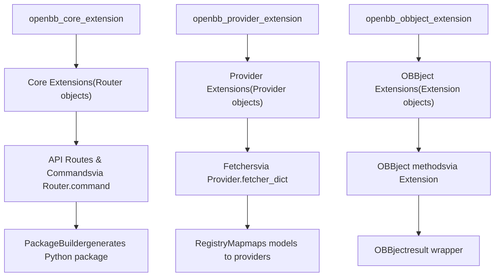
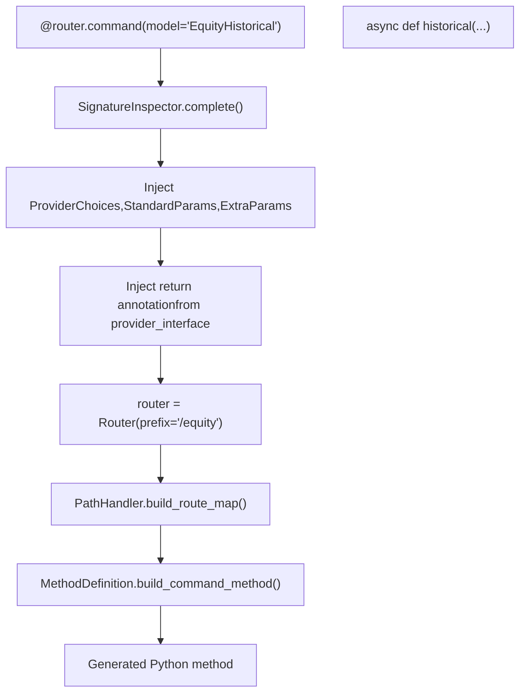
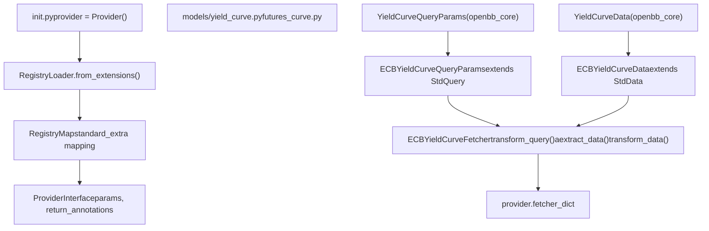
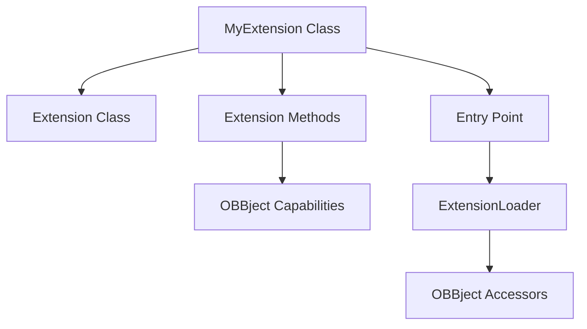
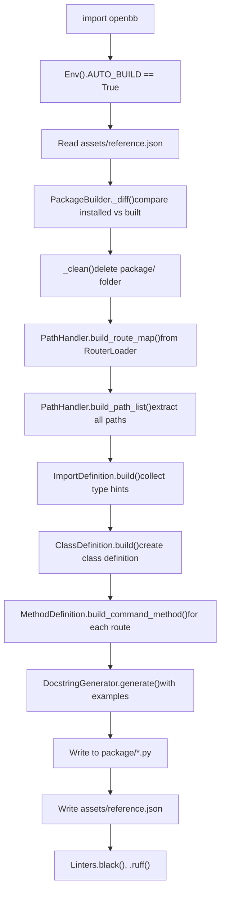
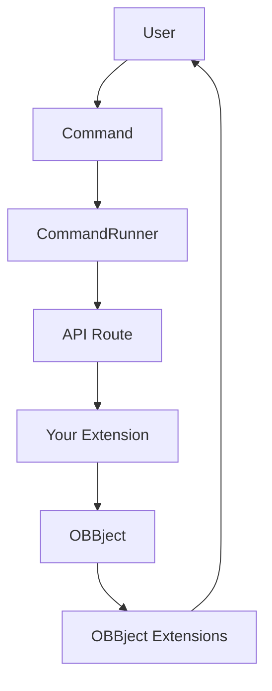

# Extending OpenBB

Relevant source files

-   [cli/tests/test\_argparse\_translator\_obbject\_registry.py](https://github.com/OpenBB-finance/OpenBB/blob/dddc3b32/cli/tests/test_argparse_translator_obbject_registry.py)
-   [openbb\_platform/core/openbb\_core/api/app\_loader.py](https://github.com/OpenBB-finance/OpenBB/blob/dddc3b32/openbb_platform/core/openbb_core/api/app_loader.py)
-   [openbb\_platform/core/openbb\_core/api/exception\_handlers.py](https://github.com/OpenBB-finance/OpenBB/blob/dddc3b32/openbb_platform/core/openbb_core/api/exception_handlers.py)
-   [openbb\_platform/core/openbb\_core/api/rest\_api.py](https://github.com/OpenBB-finance/OpenBB/blob/dddc3b32/openbb_platform/core/openbb_core/api/rest_api.py)
-   [openbb\_platform/core/openbb\_core/api/router/coverage.py](https://github.com/OpenBB-finance/OpenBB/blob/dddc3b32/openbb_platform/core/openbb_core/api/router/coverage.py)
-   [openbb\_platform/core/openbb\_core/app/model/charts/chart.py](https://github.com/OpenBB-finance/OpenBB/blob/dddc3b32/openbb_platform/core/openbb_core/app/model/charts/chart.py)
-   [openbb\_platform/core/openbb\_core/app/provider\_interface.py](https://github.com/OpenBB-finance/OpenBB/blob/dddc3b32/openbb_platform/core/openbb_core/app/provider_interface.py)
-   [openbb\_platform/core/openbb\_core/app/router.py](https://github.com/OpenBB-finance/OpenBB/blob/dddc3b32/openbb_platform/core/openbb_core/app/router.py)
-   [openbb\_platform/core/openbb\_core/app/static/package\_builder.py](https://github.com/OpenBB-finance/OpenBB/blob/dddc3b32/openbb_platform/core/openbb_core/app/static/package_builder.py)
-   [openbb\_platform/core/openbb\_core/app/static/utils/filters.py](https://github.com/OpenBB-finance/OpenBB/blob/dddc3b32/openbb_platform/core/openbb_core/app/static/utils/filters.py)
-   [openbb\_platform/core/openbb\_core/app/utils.py](https://github.com/OpenBB-finance/OpenBB/blob/dddc3b32/openbb_platform/core/openbb_core/app/utils.py)
-   [openbb\_platform/core/openbb\_core/provider/registry\_map.py](https://github.com/OpenBB-finance/OpenBB/blob/dddc3b32/openbb_platform/core/openbb_core/provider/registry_map.py)
-   [openbb\_platform/core/openbb\_core/provider/standard\_models/company\_filings.py](https://github.com/OpenBB-finance/OpenBB/blob/dddc3b32/openbb_platform/core/openbb_core/provider/standard_models/company_filings.py)
-   [openbb\_platform/core/openbb\_core/provider/standard\_models/fred\_release\_table.py](https://github.com/OpenBB-finance/OpenBB/blob/dddc3b32/openbb_platform/core/openbb_core/provider/standard_models/fred_release_table.py)
-   [openbb\_platform/core/openbb\_core/provider/standard\_models/futures\_curve.py](https://github.com/OpenBB-finance/OpenBB/blob/dddc3b32/openbb_platform/core/openbb_core/provider/standard_models/futures_curve.py)
-   [openbb\_platform/core/openbb\_core/provider/standard\_models/primary\_dealer\_fails.py](https://github.com/OpenBB-finance/OpenBB/blob/dddc3b32/openbb_platform/core/openbb_core/provider/standard_models/primary_dealer_fails.py)
-   [openbb\_platform/core/openbb\_core/provider/standard\_models/yield\_curve.py](https://github.com/OpenBB-finance/OpenBB/blob/dddc3b32/openbb_platform/core/openbb_core/provider/standard_models/yield_curve.py)
-   [openbb\_platform/core/tests/app/model/charts/test\_chart.py](https://github.com/OpenBB-finance/OpenBB/blob/dddc3b32/openbb_platform/core/tests/app/model/charts/test_chart.py)
-   [openbb\_platform/core/tests/app/static/test\_filters.py](https://github.com/OpenBB-finance/OpenBB/blob/dddc3b32/openbb_platform/core/tests/app/static/test_filters.py)
-   [openbb\_platform/core/tests/app/static/test\_package\_builder.py](https://github.com/OpenBB-finance/OpenBB/blob/dddc3b32/openbb_platform/core/tests/app/static/test_package_builder.py)
-   [openbb\_platform/core/tests/app/test\_platform\_router.py](https://github.com/OpenBB-finance/OpenBB/blob/dddc3b32/openbb_platform/core/tests/app/test_platform_router.py)
-   [openbb\_platform/core/tests/app/test\_provider\_interface.py](https://github.com/OpenBB-finance/OpenBB/blob/dddc3b32/openbb_platform/core/tests/app/test_provider_interface.py)
-   [openbb\_platform/extensions/economy/integration/test\_economy\_api.py](https://github.com/OpenBB-finance/OpenBB/blob/dddc3b32/openbb_platform/extensions/economy/integration/test_economy_api.py)
-   [openbb\_platform/extensions/economy/integration/test\_economy\_python.py](https://github.com/OpenBB-finance/OpenBB/blob/dddc3b32/openbb_platform/extensions/economy/integration/test_economy_python.py)
-   [openbb\_platform/extensions/economy/openbb\_economy/economy\_router.py](https://github.com/OpenBB-finance/OpenBB/blob/dddc3b32/openbb_platform/extensions/economy/openbb_economy/economy_router.py)
-   [openbb\_platform/extensions/economy/openbb\_economy/survey/survey\_router.py](https://github.com/OpenBB-finance/OpenBB/blob/dddc3b32/openbb_platform/extensions/economy/openbb_economy/survey/survey_router.py)
-   [openbb\_platform/extensions/equity/integration/test\_equity\_api.py](https://github.com/OpenBB-finance/OpenBB/blob/dddc3b32/openbb_platform/extensions/equity/integration/test_equity_api.py)
-   [openbb\_platform/extensions/equity/integration/test\_equity\_python.py](https://github.com/OpenBB-finance/OpenBB/blob/dddc3b32/openbb_platform/extensions/equity/integration/test_equity_python.py)
-   [openbb\_platform/extensions/equity/openbb\_equity/fundamental/fundamental\_router.py](https://github.com/OpenBB-finance/OpenBB/blob/dddc3b32/openbb_platform/extensions/equity/openbb_equity/fundamental/fundamental_router.py)
-   [openbb\_platform/extensions/etf/integration/test\_etf\_api.py](https://github.com/OpenBB-finance/OpenBB/blob/dddc3b32/openbb_platform/extensions/etf/integration/test_etf_api.py)
-   [openbb\_platform/extensions/etf/integration/test\_etf\_python.py](https://github.com/OpenBB-finance/OpenBB/blob/dddc3b32/openbb_platform/extensions/etf/integration/test_etf_python.py)
-   [openbb\_platform/extensions/platform\_api/openbb\_platform\_api/assets/default\_apps.json](https://github.com/OpenBB-finance/OpenBB/blob/dddc3b32/openbb_platform/extensions/platform_api/openbb_platform_api/assets/default_apps.json)
-   [openbb\_platform/extensions/tests/test\_integration\_tests\_api.py](https://github.com/OpenBB-finance/OpenBB/blob/dddc3b32/openbb_platform/extensions/tests/test_integration_tests_api.py)
-   [openbb\_platform/extensions/tests/test\_integration\_tests\_python.py](https://github.com/OpenBB-finance/OpenBB/blob/dddc3b32/openbb_platform/extensions/tests/test_integration_tests_python.py)
-   [openbb\_platform/extensions/tests/utils/integration\_tests\_api\_generator.py](https://github.com/OpenBB-finance/OpenBB/blob/dddc3b32/openbb_platform/extensions/tests/utils/integration_tests_api_generator.py)
-   [openbb\_platform/extensions/tests/utils/integration\_tests\_testers.py](https://github.com/OpenBB-finance/OpenBB/blob/dddc3b32/openbb_platform/extensions/tests/utils/integration_tests_testers.py)
-   [openbb\_platform/obbject\_extensions/charting/tests/test\_charting.py](https://github.com/OpenBB-finance/OpenBB/blob/dddc3b32/openbb_platform/obbject_extensions/charting/tests/test_charting.py)
-   [openbb\_platform/providers/bls/openbb\_bls/utils/helpers.py](https://github.com/OpenBB-finance/OpenBB/blob/dddc3b32/openbb_platform/providers/bls/openbb_bls/utils/helpers.py)
-   [openbb\_platform/providers/cboe/openbb\_cboe/models/futures\_curve.py](https://github.com/OpenBB-finance/OpenBB/blob/dddc3b32/openbb_platform/providers/cboe/openbb_cboe/models/futures_curve.py)
-   [openbb\_platform/providers/cboe/tests/test\_cboe\_fetchers.py](https://github.com/OpenBB-finance/OpenBB/blob/dddc3b32/openbb_platform/providers/cboe/tests/test_cboe_fetchers.py)
-   [openbb\_platform/providers/federal\_reserve/openbb\_federal\_reserve/\_\_init\_\_.py](https://github.com/OpenBB-finance/OpenBB/blob/dddc3b32/openbb_platform/providers/federal_reserve/openbb_federal_reserve/__init__.py)
-   [openbb\_platform/providers/federal\_reserve/openbb\_federal\_reserve/assets/historical\_releases.json](https://github.com/OpenBB-finance/OpenBB/blob/dddc3b32/openbb_platform/providers/federal_reserve/openbb_federal_reserve/assets/historical_releases.json)
-   [openbb\_platform/providers/federal\_reserve/openbb\_federal\_reserve/models/fomc\_documents.py](https://github.com/OpenBB-finance/OpenBB/blob/dddc3b32/openbb_platform/providers/federal_reserve/openbb_federal_reserve/models/fomc_documents.py)
-   [openbb\_platform/providers/federal\_reserve/openbb\_federal\_reserve/models/primary\_dealer\_fails.py](https://github.com/OpenBB-finance/OpenBB/blob/dddc3b32/openbb_platform/providers/federal_reserve/openbb_federal_reserve/models/primary_dealer_fails.py)
-   [openbb\_platform/providers/federal\_reserve/openbb\_federal\_reserve/models/primary\_dealer\_positioning.py](https://github.com/OpenBB-finance/OpenBB/blob/dddc3b32/openbb_platform/providers/federal_reserve/openbb_federal_reserve/models/primary_dealer_positioning.py)
-   [openbb\_platform/providers/federal\_reserve/openbb\_federal\_reserve/utils/fomc\_documents.py](https://github.com/OpenBB-finance/OpenBB/blob/dddc3b32/openbb_platform/providers/federal_reserve/openbb_federal_reserve/utils/fomc_documents.py)
-   [openbb\_platform/providers/federal\_reserve/openbb\_federal\_reserve/utils/primary\_dealer\_statistics.py](https://github.com/OpenBB-finance/OpenBB/blob/dddc3b32/openbb_platform/providers/federal_reserve/openbb_federal_reserve/utils/primary_dealer_statistics.py)
-   [openbb\_platform/providers/federal\_reserve/tests/record/http/test\_federal\_reserve\_fetchers/test\_federal\_reserve\_fomc\_documents\_fetcher\_urllib3\_v2.yaml](https://github.com/OpenBB-finance/OpenBB/blob/dddc3b32/openbb_platform/providers/federal_reserve/tests/record/http/test_federal_reserve_fetchers/test_federal_reserve_fomc_documents_fetcher_urllib3_v2.yaml)
-   [openbb\_platform/providers/federal\_reserve/tests/record/http/test\_federal\_reserve\_fetchers/test\_federal\_reserve\_primary\_dealer\_fails\_fetcher\_urllib3\_v2.yaml](https://github.com/OpenBB-finance/OpenBB/blob/dddc3b32/openbb_platform/providers/federal_reserve/tests/record/http/test_federal_reserve_fetchers/test_federal_reserve_primary_dealer_fails_fetcher_urllib3_v2.yaml)
-   [openbb\_platform/providers/federal\_reserve/tests/test\_federal\_reserve\_fetchers.py](https://github.com/OpenBB-finance/OpenBB/blob/dddc3b32/openbb_platform/providers/federal_reserve/tests/test_federal_reserve_fetchers.py)
-   [openbb\_platform/providers/fmp/openbb\_fmp/\_\_init\_\_.py](https://github.com/OpenBB-finance/OpenBB/blob/dddc3b32/openbb_platform/providers/fmp/openbb_fmp/__init__.py)
-   [openbb\_platform/providers/fmp/openbb\_fmp/models/company\_filings.py](https://github.com/OpenBB-finance/OpenBB/blob/dddc3b32/openbb_platform/providers/fmp/openbb_fmp/models/company_filings.py)
-   [openbb\_platform/providers/fmp/pyproject.toml](https://github.com/OpenBB-finance/OpenBB/blob/dddc3b32/openbb_platform/providers/fmp/pyproject.toml)
-   [openbb\_platform/providers/fmp/tests/test\_fmp\_fetchers.py](https://github.com/OpenBB-finance/OpenBB/blob/dddc3b32/openbb_platform/providers/fmp/tests/test_fmp_fetchers.py)
-   [openbb\_platform/providers/fred/openbb\_fred/\_\_init\_\_.py](https://github.com/OpenBB-finance/OpenBB/blob/dddc3b32/openbb_platform/providers/fred/openbb_fred/__init__.py)
-   [openbb\_platform/providers/fred/openbb\_fred/models/manufacturing\_outlook\_ny.py](https://github.com/OpenBB-finance/OpenBB/blob/dddc3b32/openbb_platform/providers/fred/openbb_fred/models/manufacturing_outlook_ny.py)
-   [openbb\_platform/providers/fred/openbb\_fred/models/release\_table.py](https://github.com/OpenBB-finance/OpenBB/blob/dddc3b32/openbb_platform/providers/fred/openbb_fred/models/release_table.py)
-   [openbb\_platform/providers/fred/tests/record/http/test\_fred\_fetchers/test\_fred\_manufacturing\_outlook\_ny\_fetcher\_urllib3\_v2.yaml](https://github.com/OpenBB-finance/OpenBB/blob/dddc3b32/openbb_platform/providers/fred/tests/record/http/test_fred_fetchers/test_fred_manufacturing_outlook_ny_fetcher_urllib3_v2.yaml)
-   [openbb\_platform/providers/fred/tests/test\_fred\_fetchers.py](https://github.com/OpenBB-finance/OpenBB/blob/dddc3b32/openbb_platform/providers/fred/tests/test_fred_fetchers.py)
-   [openbb\_platform/providers/intrinio/openbb\_intrinio/\_\_init\_\_.py](https://github.com/OpenBB-finance/OpenBB/blob/dddc3b32/openbb_platform/providers/intrinio/openbb_intrinio/__init__.py)
-   [openbb\_platform/providers/intrinio/openbb\_intrinio/models/company\_filings.py](https://github.com/OpenBB-finance/OpenBB/blob/dddc3b32/openbb_platform/providers/intrinio/openbb_intrinio/models/company_filings.py)
-   [openbb\_platform/providers/intrinio/tests/test\_intrinio\_fetchers.py](https://github.com/OpenBB-finance/OpenBB/blob/dddc3b32/openbb_platform/providers/intrinio/tests/test_intrinio_fetchers.py)
-   [openbb\_platform/providers/sec/openbb\_sec/\_\_init\_\_.py](https://github.com/OpenBB-finance/OpenBB/blob/dddc3b32/openbb_platform/providers/sec/openbb_sec/__init__.py)
-   [openbb\_platform/providers/sec/openbb\_sec/utils/form4.py](https://github.com/OpenBB-finance/OpenBB/blob/dddc3b32/openbb_platform/providers/sec/openbb_sec/utils/form4.py)
-   [openbb\_platform/providers/sec/tests/test\_sec\_fetchers.py](https://github.com/OpenBB-finance/OpenBB/blob/dddc3b32/openbb_platform/providers/sec/tests/test_sec_fetchers.py)
-   [openbb\_platform/providers/tmx/openbb\_tmx/models/company\_filings.py](https://github.com/OpenBB-finance/OpenBB/blob/dddc3b32/openbb_platform/providers/tmx/openbb_tmx/models/company_filings.py)

This guide explains how to extend the OpenBB Platform by creating custom extensions. The OpenBB Platform is designed with modularity in mind, allowing developers to add new functionality, integrate additional data providers, and enhance existing capabilities without modifying the core codebase.

For information on using the extension system as a consumer of the platform, see [Extension System](/OpenBB-finance/OpenBB/2.2-extension-system).

## Extension System Overview

The OpenBB Platform extension system supports three types of extensions, registered through Python entry points:

**Diagram: Extension Types and Entry Points**


Sources:

-   [openbb\_platform/core/openbb\_core/app/extension\_loader.py14-32](https://github.com/OpenBB-finance/OpenBB/blob/dddc3b32/openbb_platform/core/openbb_core/app/extension_loader.py#L14-L32)
-   [openbb\_platform/core/openbb\_core/app/static/package\_builder.py135-230](https://github.com/OpenBB-finance/OpenBB/blob/dddc3b32/openbb_platform/core/openbb_core/app/static/package_builder.py#L135-L230)
-   [openbb\_platform/core/openbb\_core/provider/registry\_map.py20-60](https://github.com/OpenBB-finance/OpenBB/blob/dddc3b32/openbb_platform/core/openbb_core/provider/registry_map.py#L20-L60)

1.  **Core Extensions**: Add new API routes and commands via the `Router` class with `@router.command` decorator. Examples: `openbb-equity`, `openbb-economy`
2.  **Provider Extensions**: Integrate new data providers by implementing the `Fetcher` pattern. Examples: `openbb-fred`, `openbb-fmp`, `openbb-yfinance`
3.  **OBBject Extensions**: Enhance output objects with additional methods. Examples: `openbb-charting`, `openbb-technical`

## Extension Loading and Build Architecture

The extension system uses Python's entry points mechanism to discover extensions, then the `PackageBuilder` generates Python code for the complete API:

**Diagram: Extension Discovery and Code Generation Flow**

> **[Mermaid sequence]**
> *(图表结构无法解析)*

Sources:

-   [openbb\_platform/core/openbb\_core/app/extension\_loader.py33-168](https://github.com/OpenBB-finance/OpenBB/blob/dddc3b32/openbb_platform/core/openbb_core/app/extension_loader.py#L33-L168)
-   [openbb\_platform/core/openbb\_core/app/static/package\_builder.py135-362](https://github.com/OpenBB-finance/OpenBB/blob/dddc3b32/openbb_platform/core/openbb_core/app/static/package_builder.py#L135-L362)
-   [openbb\_platform/core/openbb\_core/app/router.py515-537](https://github.com/OpenBB-finance/OpenBB/blob/dddc3b32/openbb_platform/core/openbb_core/app/router.py#L515-L537)

The `ExtensionLoader` class ([openbb\_core/app/extension\_loader.py33-93](https://github.com/OpenBB-finance/OpenBB/blob/dddc3b32/openbb_core/app/extension_loader.py#L33-L93)) performs extension discovery:

1.  Queries entry points for `openbb_core_extension`, `openbb_provider_extension`, and `openbb_obbject_extension` groups
2.  Loads the extension objects from each entry point
3.  Makes them available via `.core_objects`, `.provider_objects`, and `.obbject_objects` properties

The `PackageBuilder` class ([openbb\_core/app/static/package\_builder.py135-306](https://github.com/OpenBB-finance/OpenBB/blob/dddc3b32/openbb_core/app/static/package_builder.py#L135-L306)) generates Python code:

1.  Builds a route map from all loaded `Router` objects
2.  Generates import statements for all type hints
3.  Generates class definitions with methods for each command
4.  Writes the generated code to `package/` directory
5.  Runs linters (black, ruff) on the generated code

## Creating an Extension

### Extension Project Structure

A typical extension project should have the following structure:

```
extension_project/
├── pyproject.toml         # Package metadata and entry points
├── openbb_extension/      # Extension package
│   ├── __init__.py        # Package initialization
│   ├── models/            # Data models (for provider extensions)
│   │   ├── __init__.py
│   │   └── my_model.py    # Custom model implementations
│   ├── router.py          # API routes (for core extensions)
│   └── extension.py       # Extension class (for OBBject extensions)
└── tests/                 # Tests for your extension
```
### Registering Extensions

Extensions are registered using Python entry points in your `pyproject.toml` file. The entry point value should be a module path to the extension object:

```
[project.entry-points."openbb_core_extension"]my_extension = "openbb_my_extension:router" [project.entry-points."openbb_provider_extension"]my_provider = "openbb_my_provider.provider:provider" [project.entry-points."openbb_obbject_extension"]my_obbject_extension = "openbb_my_extension.extension:ext"
```
The extension groups map to specific object types:

| Entry Point Group | Expected Object Type | Example |
| --- | --- | --- |
| `openbb_core_extension` | `Router` instance | `router = Router(prefix="/equity")` |
| `openbb_provider_extension` | `Provider` instance | `provider = Provider(name="fred", ...)` |
| `openbb_obbject_extension` | `Extension` instance | `ext = Extension(...)` |

Sources:

-   [openbb\_platform/core/openbb\_core/app/extension\_loader.py14-32](https://github.com/OpenBB-finance/OpenBB/blob/dddc3b32/openbb_platform/core/openbb_core/app/extension_loader.py#L14-L32)
-   [openbb\_platform/extensions/equity/pyproject.toml1-60](https://github.com/OpenBB-finance/OpenBB/blob/dddc3b32/openbb_platform/extensions/equity/pyproject.toml#L1-L60)
-   [openbb\_platform/providers/fred/pyproject.toml1-47](https://github.com/OpenBB-finance/OpenBB/blob/dddc3b32/openbb_platform/providers/fred/pyproject.toml#L1-L47)

## Creating Core Extensions

Core extensions add new API routes and commands to the OpenBB Platform. They use the `Router` class to define routes and the `@router.command` decorator to create endpoints.

**Diagram: Core Extension Command Flow**


Sources:

-   [openbb\_platform/core/openbb\_core/app/router.py43-225](https://github.com/OpenBB-finance/OpenBB/blob/dddc3b32/openbb_platform/core/openbb_core/app/router.py#L43-L225)
-   [openbb\_platform/core/openbb\_core/app/router.py227-375](https://github.com/OpenBB-finance/OpenBB/blob/dddc3b32/openbb_platform/core/openbb_core/app/router.py#L227-L375)
-   [openbb\_platform/core/openbb\_core/app/static/package\_builder.py763-1163](https://github.com/OpenBB-finance/OpenBB/blob/dddc3b32/openbb_platform/core/openbb_core/app/static/package_builder.py#L763-L1163)

### Router Command Decorator with Model

The `@router.command` decorator can be used with or without a `model` parameter. When a model is specified, it connects the command to provider implementations:

```
from openbb_core.app.router import Routerfrom openbb_core.app.model.obbject import OBBjectfrom openbb_core.app.provider_interface import (    ProviderChoices,    StandardParams,    ExtraParams,) router = Router(prefix="/equity") @router.command(model="EquityHistorical")async def historical(    cc: CommandContext,    provider_choices: ProviderChoices,    standard_params: StandardParams,    extra_params: ExtraParams,) -> OBBject:    """    Get historical price data for a stock.        The model parameter 'EquityHistorical' must match a model name    in the provider interface's fetcher_dict.    """    return await OBBject.from_query(Query(**locals()))
```
The `SignatureInspector.complete()` method ([openbb\_core/app/router.py230-296](https://github.com/OpenBB-finance/OpenBB/blob/dddc3b32/openbb_core/app/router.py#L230-L296)) processes the command:

1.  Validates that the model exists in `ProviderInterface().models`
2.  Injects `Depends()` annotations for provider\_choices, standard\_params, and extra\_params
3.  Adds the return type annotation from `provider_interface.return_annotations[model]`

### Example Core Extension Without Model

For commands that don't use the provider system:

```
from openbb_core.app.router import Routerfrom openbb_core.app.model.obbject import OBBjectfrom pydantic import BaseModel router = Router(prefix="/custom", description="Custom extension commands") class CustomData(BaseModel):    """Custom data model."""    value: float    label: str @router.commandasync def custom_calculation(    input_value: float,    multiplier: float = 2.0) -> OBBject[list[CustomData]]:    """    Perform a custom calculation.        Parameters    ----------    input_value : float        The input value to process    multiplier : float        The multiplier to apply        Returns    -------    OBBject[list[CustomData]]        Results containing the calculated value    """    result = [        CustomData(            value=input_value * multiplier,            label=f"Result of {input_value} * {multiplier}"        )    ]    return OBBject(results=result)
```
Sources:

-   [openbb\_platform/core/openbb\_core/app/router.py87-171](https://github.com/OpenBB-finance/OpenBB/blob/dddc3b32/openbb_platform/core/openbb_core/app/router.py#L87-L171)
-   [openbb\_platform/extensions/equity/openbb\_equity/equity\_router.py1-50](https://github.com/OpenBB-finance/OpenBB/blob/dddc3b32/openbb_platform/extensions/equity/openbb_equity/equity_router.py#L1-L50)

## Creating Provider Extensions

Provider extensions add new data sources to the platform. Each provider implements the three-stage `Fetcher` pattern: `transform_query`, `aextract_data`, `transform_data`.

**Diagram: Provider Extension Architecture**


Sources:

-   [openbb\_platform/core/openbb\_core/provider/registry.py14-59](https://github.com/OpenBB-finance/OpenBB/blob/dddc3b32/openbb_platform/core/openbb_core/provider/registry.py#L14-L59)
-   [openbb\_platform/core/openbb\_core/provider/registry\_map.py20-208](https://github.com/OpenBB-finance/OpenBB/blob/dddc3b32/openbb_platform/core/openbb_core/provider/registry_map.py#L20-L208)
-   [openbb\_platform/providers/ecb/openbb\_ecb/models/yield\_curve.py1-169](https://github.com/OpenBB-finance/OpenBB/blob/dddc3b32/openbb_platform/providers/ecb/openbb_ecb/models/yield_curve.py#L1-L169)

### Fetcher Pattern: Three Required Methods

Every fetcher must implement three static methods:

| Method | Purpose | Input | Output |
| --- | --- | --- | --- |
| `transform_query()` | Validate and transform query parameters | `dict[str, Any]` | `QueryParams` subclass |
| `aextract_data()` | Fetch data from external source (async) | `QueryParams`, `credentials` | `list[dict]` |
| `transform_data()` | Transform raw data to standard model | `QueryParams`, `list[dict]` | `list[Data]` |

### Standard Models

The OpenBB Platform provides standard models in [openbb\_core/provider/standard\_models/](https://github.com/OpenBB-finance/OpenBB/blob/dddc3b32/openbb_core/provider/standard_models/):

-   `yield_curve.py` - Treasury yield curve data
-   `futures_curve.py` - Futures contract curve data
-   `fred_series.py` - FRED economic time series
-   `fred_release_table.py` - FRED release table data
-   `spot.py` - Spot rate data

Your provider should extend these models by inheriting from `QueryParams` and `Data` base classes:

```
from openbb_core.provider.abstract.query_params import QueryParamsfrom openbb_core.provider.abstract.data import Datafrom pydantic import Field class YieldCurveQueryParams(QueryParams):    """Base query parameters for yield curve."""    date: dateType | str | None = Field(        default=None,        description="The date for the yield curve."    ) class YieldCurveData(Data):    """Base data model for yield curve."""    date: dateType | None = Field(        default=None,        description="The date of the observation."    )    maturity: str = Field(description="Maturity length of the security.")
```
Sources:

-   [openbb\_platform/core/openbb\_core/provider/standard\_models/yield\_curve.py1-72](https://github.com/OpenBB-finance/OpenBB/blob/dddc3b32/openbb_platform/core/openbb_core/provider/standard_models/yield_curve.py#L1-L72)
-   [openbb\_platform/core/openbb\_core/provider/standard\_models/futures\_curve.py1-63](https://github.com/OpenBB-finance/OpenBB/blob/dddc3b32/openbb_platform/core/openbb_core/provider/standard_models/futures_curve.py#L1-L63)
-   [openbb\_platform/core/openbb\_core/provider/standard\_models/fred\_release\_table.py1-93](https://github.com/OpenBB-finance/OpenBB/blob/dddc3b32/openbb_platform/core/openbb_core/provider/standard_models/fred_release_table.py#L1-L93)

### Example: Complete Provider Implementation

Here's a complete example based on the ECB yield curve provider:

**1\. Provider Registration (`__init__.py`)**

```
from openbb_core.provider.abstract.provider import Providerfrom openbb_ecb.models.yield_curve import ECBYieldCurveFetcher ecb_provider = Provider(    name="ecb",    website="https://data.ecb.europa.eu",    description="European Central Bank Data Portal",    credentials=None,  # ECB data is public    fetcher_dict={        "YieldCurve": ECBYieldCurveFetcher,    },)
```
**2\. Query Parameters Extension**

```
from typing import Literalfrom openbb_core.provider.standard_models.yield_curve import (    YieldCurveQueryParams)from pydantic import Field class ECBYieldCurveQueryParams(YieldCurveQueryParams):    """ECB-specific query parameters."""        __json_schema_extra__ = {"date": {"multiple_items_allowed": True}}        rating: Literal["aaa", "all_ratings"] = Field(        default="aaa",        description="The rating type."    )    yield_curve_type: Literal["spot_rate", "instantaneous_forward", "par_yield"] = Field(        default="spot_rate",        description="The yield curve type."    )
```
The `__json_schema_extra__` attribute ([openbb\_fred/models/release\_table.py24](https://github.com/OpenBB-finance/OpenBB/blob/dddc3b32/openbb_fred/models/release_table.py#L24-L24)) controls how parameters are handled:

-   `multiple_items_allowed: True` - Allow comma-separated values (checked by `filter_inputs()`)
-   `choices` - List of valid values for the parameter

**3\. Data Model Extension**

```
from openbb_core.provider.standard_models.yield_curve import YieldCurveData class ECBYieldCurveData(YieldCurveData):    """ECB-specific data fields."""    # Inherits date, maturity, maturity_years from base    # Add provider-specific fields if needed
```
**4\. Fetcher Implementation**

```
from typing import Anyfrom openbb_core.provider.abstract.fetcher import Fetcherfrom openbb_core.provider.utils.helpers import amake_request class ECBYieldCurveFetcher(    Fetcher[ECBYieldCurveQueryParams, list[ECBYieldCurveData]]):    """Fetcher for ECB yield curve data."""        @staticmethod    def transform_query(params: dict[str, Any]) -> ECBYieldCurveQueryParams:        """Transform and validate query parameters."""        return ECBYieldCurveQueryParams(**params)        @staticmethod    async def aextract_data(        query: ECBYieldCurveQueryParams,        credentials: dict[str, str] | None,        **kwargs: Any,    ) -> list[dict]:        """Fetch data from ECB API."""        import asyncio        from openbb_ecb.utils.yield_curve_series import get_yield_curve_ids                # Get series IDs for the requested curve type        ids = get_yield_curve_ids(            rating=query.rating,            yield_curve_type=query.yield_curve_type        )                results = []        base_url = "https://data.ecb.europa.eu/data-detail-api"                async def get_one(maturity):            url = f"{base_url}/{ids['SERIES_IDS'][maturity]}"            response = await amake_request(url)                        for item in response:                results.append({                    "date": item.get("PERIOD"),                    "maturity": maturity,                    "rate": item.get("OBS_VALUE_AS_IS")                })                tasks = [get_one(m) for m in ids['SERIES_IDS'].keys()]        await asyncio.gather(*tasks)                return results        @staticmethod    def transform_data(        query: ECBYieldCurveQueryParams,        data: list[dict],        **kwargs: Any,    ) -> list[ECBYieldCurveData]:        """Transform and validate data."""        from pandas import DataFrame, DatetimeIndex                if not data:            raise EmptyDataError("The request was returned empty.")                df = DataFrame(data)        df['rate'] = df['rate'].astype(float) / 100                return [            ECBYieldCurveData.model_validate(d)             for d in df.to_dict('records')        ]
```
Sources:

-   [openbb\_platform/providers/ecb/openbb\_ecb/models/yield\_curve.py1-169](https://github.com/OpenBB-finance/OpenBB/blob/dddc3b32/openbb_platform/providers/ecb/openbb_ecb/models/yield_curve.py#L1-L169)
-   [openbb\_platform/providers/fred/openbb\_fred/models/release\_table.py1-276](https://github.com/OpenBB-finance/OpenBB/blob/dddc3b32/openbb_platform/providers/fred/openbb_fred/models/release_table.py#L1-L276)
-   [openbb\_platform/providers/cboe/openbb\_cboe/models/futures\_curve.py1-102](https://github.com/OpenBB-finance/OpenBB/blob/dddc3b32/openbb_platform/providers/cboe/openbb_cboe/models/futures_curve.py#L1-L102)

### Field Validation and Multiple Items

The `filter_inputs()` function ([openbb\_core/app/static/utils/filters.py8-66](https://github.com/OpenBB-finance/OpenBB/blob/dddc3b32/openbb_core/app/static/utils/filters.py#L8-L66)) processes parameters before execution:

```
# In your QueryParams classclass MyQueryParams(QueryParams):    __json_schema_extra__ = {        "symbol": {"multiple_items_allowed": True},        "date": {"multiple_items_allowed": True}    }        symbol: str = Field(description="Stock symbol(s)")    date: str | None = Field(default=None, description="Date(s)")
```
When `multiple_items_allowed` is `False` or not specified, `check_single_item()` will raise an error if a comma-separated list is provided.

Sources:

-   [openbb\_platform/core/openbb\_core/app/static/utils/filters.py8-66](https://github.com/OpenBB-finance/OpenBB/blob/dddc3b32/openbb_platform/core/openbb_core/app/static/utils/filters.py#L8-L66)
-   [openbb\_platform/core/openbb\_core/app/utils.py189-194](https://github.com/OpenBB-finance/OpenBB/blob/dddc3b32/openbb_platform/core/openbb_core/app/utils.py#L189-L194)

## Creating OBBject Extensions

OBBject extensions enhance the capabilities of output objects by adding new methods or properties. They use the `Extension` class from OpenBB Platform.


Sources:

-   [openbb\_platform/core/openbb\_core/app/model/extension.py1-13](https://github.com/OpenBB-finance/OpenBB/blob/dddc3b32/openbb_platform/core/openbb_core/app/model/extension.py#L1-L13)
-   [openbb\_platform/core/openbb\_core/app/extension\_loader.py97-103](https://github.com/OpenBB-finance/OpenBB/blob/dddc3b32/openbb_platform/core/openbb_core/app/extension_loader.py#L97-L103)

### Example OBBject Extension

```
from openbb_core.app.model.extension import Extension class MyExtension(Extension):    """Extension to add custom capabilities to OBBject."""        def __init__(self):        """Initialize the extension."""        super().__init__(            accessor_name="my_extension",            accessor_methods={                "do_something": self.do_something,                "format_data": self.format_data,            },        )        def do_something(self, obbject) -> str:        """Do something with the OBBject data."""        # Implementation        return result        def format_data(self, obbject, format_type: str = "default") -> str:        """Format the OBBject data."""        # Implementation        return formatted_data
```
## PackageBuilder and Auto-Build

The `PackageBuilder` ([openbb\_core/app/static/package\_builder.py135-362](https://github.com/OpenBB-finance/OpenBB/blob/dddc3b32/openbb_core/app/static/package_builder.py#L135-L362)) generates Python code for all installed extensions. This happens automatically when `Env().AUTO_BUILD` is enabled.

**Diagram: PackageBuilder Process**


Sources:

-   [openbb\_platform/core/openbb\_core/app/static/package\_builder.py135-306](https://github.com/OpenBB-finance/OpenBB/blob/dddc3b32/openbb_platform/core/openbb_core/app/static/package_builder.py#L135-L306)
-   [openbb\_platform/core/openbb\_core/app/static/package\_builder.py364-376](https://github.com/OpenBB-finance/OpenBB/blob/dddc3b32/openbb_platform/core/openbb_core/app/static/package_builder.py#L364-L376)

### Auto-Build Mechanism

The `PackageBuilder.auto_build()` method ([openbb\_core/app/static/package\_builder.py150-168](https://github.com/OpenBB-finance/OpenBB/blob/dddc3b32/openbb_core/app/static/package_builder.py#L150-L168)) checks for differences:

1.  Read `assets/reference.json` containing previously built extensions
2.  Compare with currently installed extensions via `entry_points()`
3.  If differences are found (add or remove), trigger `build()`

```
def auto_build(self) -> None:    """Trigger build if there are differences."""    if Env().AUTO_BUILD:        reference = PackageBuilder._read(            self.directory / "assets" / "reference.json"        )        ext_map = reference.get("info", {}).get("extensions", {})        add, remove = PackageBuilder._diff(ext_map)                if add or remove:            print(f"Extensions to add: {', '.join(sorted(add))}")            print(f"Extensions to remove: {', '.join(sorted(remove))}")            print("\nBuilding...")            self.build()
```
### File Locking

The build process uses file locking ([openbb\_core/app/static/package\_builder.py96-133](https://github.com/OpenBB-finance/OpenBB/blob/dddc3b32/openbb_core/app/static/package_builder.py#L96-L133)) to prevent concurrent builds:

```
class FileLock:    """Cross-platform file lock."""        def acquire(self, blocking: bool = True) -> None:        """Acquire the file lock."""        if _HAS_FCNTL:  # Unix            fcntl.flock(self._file.fileno(), fcntl.LOCK_EX)        else:  # Windows            msvcrt.locking(self._file.fileno(), msvcrt.LK_LOCK, 1)
```
### Generated Code Structure

For each route path like `/equity/price/historical`, the PackageBuilder generates:

1.  **Module**: `package/equity_price.py` (parent path becomes module name)
2.  **Class**: `ROUTER_equity_price` with a `historical` method
3.  **Method**: Calls `self._run("/equity/price/historical", **kwargs)`

Example generated method:

```
def historical(    self,    symbol: Annotated[        str,        OpenBBField(description="Stock symbol")    ],    provider: Annotated[        Literal["fmp", "polygon", "yfinance"],        OpenBBField(description="Provider name")    ] = "yfinance",    **kwargs) -> OBBject:    """Get historical price data."""    return self._run(        "/equity/price/historical",        symbol=symbol,        provider=provider,        **kwargs    )
```
Sources:

-   [openbb\_platform/core/openbb\_core/app/static/package\_builder.py924-1163](https://github.com/OpenBB-finance/OpenBB/blob/dddc3b32/openbb_platform/core/openbb_core/app/static/package_builder.py#L924-L1163)
-   [openbb\_platform/core/openbb\_core/app/static/package\_builder.py668-760](https://github.com/OpenBB-finance/OpenBB/blob/dddc3b32/openbb_platform/core/openbb_core/app/static/package_builder.py#L668-L760)

## Testing Extensions

It's recommended to write tests for your extensions to ensure they work correctly:

1.  **Core Extensions**: Test if your API routes return the expected responses
2.  **Provider Extensions**: Test if your fetchers retrieve and transform data correctly
3.  **OBBject Extensions**: Test if your extension methods produce the expected results

The OpenBB development tools include testing utilities:

```
# Install the development toolspip install openbb-devtools # Run testspytest tests/
```
Sources:

-   [openbb\_platform/extensions/devtools/pyproject.toml10-29](https://github.com/OpenBB-finance/OpenBB/blob/dddc3b32/openbb_platform/extensions/devtools/pyproject.toml#L10-L29)
-   [openbb\_platform/core/tests/app/test\_extension\_loader.py1-13](https://github.com/OpenBB-finance/OpenBB/blob/dddc3b32/openbb_platform/core/tests/app/test_extension_loader.py#L1-L13)
-   [openbb\_platform/core/tests/provider/test\_query\_executor.py1-86](https://github.com/OpenBB-finance/OpenBB/blob/dddc3b32/openbb_platform/core/tests/provider/test_query_executor.py#L1-L86)
-   [openbb\_platform/core/tests/provider/utils/test\_errors.py1-9](https://github.com/OpenBB-finance/OpenBB/blob/dddc3b32/openbb_platform/core/tests/provider/utils/test_errors.py#L1-L9)

## Extension Integration Flow

When you call a command that uses your extension, the OpenBB Platform follows this flow:


Sources:

-   [openbb\_platform/core/openbb\_core/app/command\_runner.py31-513](https://github.com/OpenBB-finance/OpenBB/blob/dddc3b32/openbb_platform/core/openbb_core/app/command_runner.py#L31-L513)
-   [openbb\_platform/core/openbb\_core/app/query.py17-83](https://github.com/OpenBB-finance/OpenBB/blob/dddc3b32/openbb_platform/core/openbb_core/app/query.py#L17-L83)
-   [openbb\_platform/core/openbb\_core/api/rest\_api.py45-105](https://github.com/OpenBB-finance/OpenBB/blob/dddc3b32/openbb_platform/core/openbb_core/api/rest_api.py#L45-L105)
-   [openbb\_platform/core/openbb\_core/api/app\_loader.py14-45](https://github.com/OpenBB-finance/OpenBB/blob/dddc3b32/openbb_platform/core/openbb_core/api/app_loader.py#L14-L45)

## Error Handling in Extensions

Extensions should use OpenBB's error handling mechanisms for consistency. The `ExceptionHandlers` class ([openbb\_core/api/exception\_handlers.py20-135](https://github.com/OpenBB-finance/OpenBB/blob/dddc3b32/openbb_core/api/exception_handlers.py#L20-L135)) provides unified error responses.

### Provider Error Classes

```
from openbb_core.app.model.abstract.error import OpenBBErrorfrom openbb_core.provider.utils.errors import EmptyDataError, UnauthorizedError # EmptyDataError - Returns HTTP 204 (No Content)if not data:    raise EmptyDataError("No data found for the given parameters") # UnauthorizedError - Returns HTTP 502 (Bad Gateway)if not api_key or response.status_code == 401:    raise UnauthorizedError(provider_name="my_provider") # OpenBBError - Returns HTTP 400 (Bad Request)if invalid_parameter:    raise OpenBBError(f"Invalid parameter: {parameter}")
```
### Exception Handler Mapping

| Exception Type | HTTP Status | Handler Method |
| --- | --- | --- |
| `EmptyDataError` | 204 No Content | `ExceptionHandlers.empty_data()` |
| `UnauthorizedError` | 502 Bad Gateway | `ExceptionHandlers.unauthorized()` |
| `OpenBBError` | 400 Bad Request | `ExceptionHandlers.openbb()` |
| `ValidationError` | 422 Unprocessable Entity | `ExceptionHandlers.validation()` |
| `Exception` | 500 Internal Error | `ExceptionHandlers.exception()` |

Sources:

-   [openbb\_platform/core/openbb\_core/api/exception\_handlers.py20-135](https://github.com/OpenBB-finance/OpenBB/blob/dddc3b32/openbb_platform/core/openbb_core/api/exception_handlers.py#L20-L135)
-   [openbb\_platform/core/openbb\_core/provider/utils/errors.py1-40](https://github.com/OpenBB-finance/OpenBB/blob/dddc3b32/openbb_platform/core/openbb_core/provider/utils/errors.py#L1-L40)
-   [openbb\_platform/core/openbb\_core/api/app\_loader.py35-43](https://github.com/OpenBB-finance/OpenBB/blob/dddc3b32/openbb_platform/core/openbb_core/api/app_loader.py#L35-L43)

### Example: Error Handling in Fetcher

```
@staticmethodasync def aextract_data(    query: MyQueryParams,    credentials: dict[str, str] | None,    **kwargs: Any,) -> list[dict]:    """Extract data with proper error handling."""    from openbb_core.provider.utils.helpers import amake_request    from openbb_core.provider.utils.errors import EmptyDataError, UnauthorizedError        api_key = credentials.get("my_provider_api_key") if credentials else ""        if not api_key:        raise UnauthorizedError("API key is required for my_provider")        url = f"https://api.myprovider.com/data?symbol={query.symbol}"    headers = {"Authorization": f"Bearer {api_key}"}        try:        response = await amake_request(url, headers=headers)    except Exception as e:        if "401" in str(e):            raise UnauthorizedError("Invalid API key for my_provider")        raise OpenBBError(f"Request failed: {e}")        if not response or not response.get("data"):        raise EmptyDataError(f"No data found for symbol {query.symbol}")        return response["data"]
```
### Warnings vs Errors

Use warnings for non-critical issues:

```
from warnings import warnfrom openbb_core.app.model.abstract.warning import OpenBBWarning # Issue a warning that doesn't stop executionif deprecated_parameter:    warn(        "Parameter 'old_param' is deprecated, use 'new_param' instead",        category=OpenBBWarning    )
```
Sources:

-   [openbb\_platform/providers/bls/openbb\_bls/utils/helpers.py11-217](https://github.com/OpenBB-finance/OpenBB/blob/dddc3b32/openbb_platform/providers/bls/openbb_bls/utils/helpers.py#L11-L217)
-   [openbb\_platform/providers/econdb/openbb\_econdb/models/yield\_curve.py145-154](https://github.com/OpenBB-finance/OpenBB/blob/dddc3b32/openbb_platform/providers/econdb/openbb_econdb/models/yield_curve.py#L145-L154)

## Publishing Your Extension

1.  Package your extension using Poetry or setuptools
2.  Publish it to PyPI or a private package repository
3.  Users can install it using pip:

```
pip install openbb-myextension
```
After installation, the OpenBB Platform will automatically discover and integrate your extension.

Sources:

-   [openbb\_platform/core/pyproject.toml1-34](https://github.com/OpenBB-finance/OpenBB/blob/dddc3b32/openbb_platform/core/pyproject.toml#L1-L34)
-   [openbb\_platform/extensions/devtools/pyproject.toml1-35](https://github.com/OpenBB-finance/OpenBB/blob/dddc3b32/openbb_platform/extensions/devtools/pyproject.toml#L1-L35)

## Best Practices

1.  **Follow Standard Models**: Use the standard models provided by OpenBB when implementing provider extensions
2.  **Comprehensive Documentation**: Document your extension thoroughly, including docstrings and README
3.  **Error Handling**: Use OpenBB's error handling mechanisms for consistency
4.  **Testing**: Write tests for your extension to ensure it works correctly
5.  **Version Compatibility**: Specify compatibility with OpenBB Platform versions in your package metadata

By following these guidelines, you can create extensions that seamlessly integrate with the OpenBB Platform and provide additional value to users.
