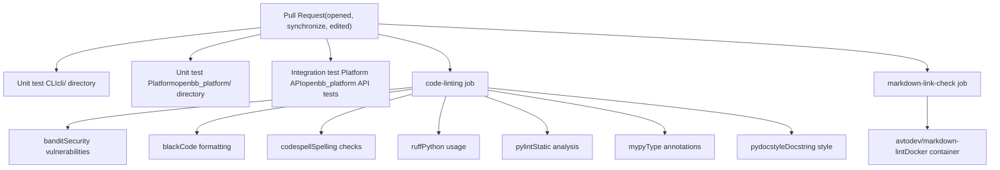
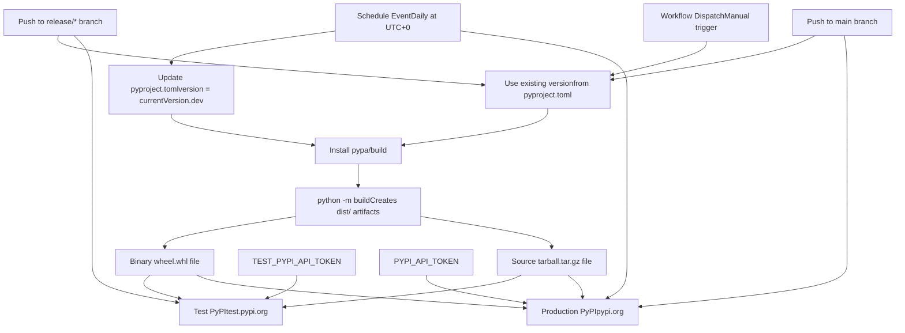

# CI/CD and Distribution

Relevant source files

-   [.github/labeler.yml](https://github.com/OpenBB-finance/OpenBB/blob/dddc3b32/.github/labeler.yml)
-   [.github/platform-drafter.yml](https://github.com/OpenBB-finance/OpenBB/blob/dddc3b32/.github/platform-drafter.yml)
-   [.github/release-drafter.yml](https://github.com/OpenBB-finance/OpenBB/blob/dddc3b32/.github/release-drafter.yml)
-   [.github/workflows/README.md](https://github.com/OpenBB-finance/OpenBB/blob/dddc3b32/.github/workflows/README.md?plain=1)
-   [cli/poetry.lock](https://github.com/OpenBB-finance/OpenBB/blob/dddc3b32/cli/poetry.lock)
-   [openbb\_platform/core/openbb/assets/reference.json](https://github.com/OpenBB-finance/OpenBB/blob/dddc3b32/openbb_platform/core/openbb/assets/reference.json)
-   [openbb\_platform/core/poetry.lock](https://github.com/OpenBB-finance/OpenBB/blob/dddc3b32/openbb_platform/core/poetry.lock)
-   [openbb\_platform/core/pyproject.toml](https://github.com/OpenBB-finance/OpenBB/blob/dddc3b32/openbb_platform/core/pyproject.toml)
-   [openbb\_platform/dev\_install.py](https://github.com/OpenBB-finance/OpenBB/blob/dddc3b32/openbb_platform/dev_install.py)
-   [openbb\_platform/extensions/devtools/poetry.lock](https://github.com/OpenBB-finance/OpenBB/blob/dddc3b32/openbb_platform/extensions/devtools/poetry.lock)
-   [openbb\_platform/extensions/devtools/pyproject.toml](https://github.com/OpenBB-finance/OpenBB/blob/dddc3b32/openbb_platform/extensions/devtools/pyproject.toml)
-   [openbb\_platform/poetry.lock](https://github.com/OpenBB-finance/OpenBB/blob/dddc3b32/openbb_platform/poetry.lock)
-   [openbb\_platform/providers/yfinance/poetry.lock](https://github.com/OpenBB-finance/OpenBB/blob/dddc3b32/openbb_platform/providers/yfinance/poetry.lock)
-   [openbb\_platform/pyproject.toml](https://github.com/OpenBB-finance/OpenBB/blob/dddc3b32/openbb_platform/pyproject.toml)

This document covers the continuous integration, continuous deployment, and distribution systems for the OpenBB Platform. It explains the GitHub Actions workflows that enforce code quality, validate contributions, run automated tests, draft releases, and publish packages to PyPI. For information about local development setup and quality tools, see [Development Setup](/OpenBB-finance/OpenBB/6.1-development-setup). For details on code quality tools and testing frameworks, see [Code Quality and Testing](/OpenBB-finance/OpenBB/6.2-code-quality-and-testing).

## Overview

The OpenBB Platform uses GitHub Actions to automate the entire pipeline from pull request validation through package distribution. The CI/CD system ensures code quality, runs comprehensive test suites, manages release notes, and publishes packages to both Test PyPI and production PyPI with nightly builds for continuous access to latest features.

**Sources:** [.github/workflows/README.md1-101](https://github.com/OpenBB-finance/OpenBB/blob/dddc3b32/.github/workflows/README.md?plain=1#L1-L101)

## Branch Validation

The platform enforces GitFlow naming conventions for all pull requests through the Branch Name Check workflow. This workflow validates branch names before merging to ensure consistency across the codebase.

### GitFlow Branch Patterns

| Branch Type | Pattern | Target Branch | Example |
| --- | --- | --- | --- |
| Feature | `feature/<name>` | `develop` | `feature/add-historical-data` |
| Bugfix | `bugfix/<name>` | `develop` | `bugfix/fix-date-parsing` |
| Hotfix | `hotfix/<name>` | `main` | `hotfix/critical-api-fix` |
| Release | `release/<version>` | `main` | `release/3.2.0` or `release/3.2.0rc1` |

The workflow extracts branch names using `jq` and validates them against regular expressions:

-   For PRs targeting `develop`: accepts `feature/*`, `bugfix/*`, and `hotfix/*`
-   For PRs targeting `main`: accepts only `hotfix/*` and `release/*`

If validation fails, the workflow exits with status code 1, blocking the merge.

**Sources:** [.github/workflows/README.md9-32](https://github.com/OpenBB-finance/OpenBB/blob/dddc3b32/.github/workflows/README.md?plain=1#L9-L32)

## Automated Labeling

The platform automatically labels pull requests based on file paths and branch names using the labeler workflow. This categorization helps with release note generation and issue tracking.

### Label Configuration

```
version: 2appendOnly: true
```
| Label | Trigger Condition |
| --- | --- |
| `platform` | Files match `openbb_platform/.*` |
| `v4` | Files match `openbb_platform/.*` |
| `enhancement` | Branch matches `^feature/.*` |
| `bug` | Branch matches `^hotfix/.*` or `^bugfix/.*` |
| `excel` | Files match `website/content/excel/.*` |
| `breaking_change` | Files match `openbb_platform/core/openbb_core/provider/standard_models/.*` |

The `appendOnly: true` setting prevents removal of manually added labels.

**Sources:** [.github/labeler.yml1-28](https://github.com/OpenBB-finance/OpenBB/blob/dddc3b32/.github/labeler.yml#L1-L28)

## Automated Testing Pipeline

The CI/CD system runs three tiers of tests for pull requests:


### Test Workflow Triggers

The testing workflows activate on:

-   Pull request events: `opened`, `synchronize`, `edited`
-   Push events to branches: `feature/*`, `hotfix/*`, `release/*`

Each workflow uses Python 3.10 and GitHub Actions caching to improve performance.

**Sources:** [.github/workflows/README.md65-100](https://github.com/OpenBB-finance/OpenBB/blob/dddc3b32/.github/workflows/README.md?plain=1#L65-L100)

## Release Drafting System

The platform uses Release Drafter to automatically generate and categorize release notes from pull requests. Two configurations exist: a general release drafter and a platform-specific drafter.

### Release Drafter Configuration

The release drafter generates versions using the template `OpenBB Platform v$NEXT_MINOR_VERSION` and categorizes changes based on PR labels:

| Category | Labels | Description |
| --- | --- | --- |
| 🚨 Breaking Changes | `breaking_change` | Changes to standard models |
| 🦋 Platform Enhancements | `platform`, `v4` | New features and improvements |
| 🐛 Bug Fixes | `bug` | Bug fixes |
| 📚 Documentation | `docs` | Documentation updates |

The configuration template includes:

-   Contributor recognition section (`$CONTRIBUTORS`)
-   Summary section (manually filled)
-   Categorized changes list (`$CHANGES`)
-   Social media links and community engagement prompts

### Change Template Format

```
- $TITLE @$AUTHOR (#$NUMBER)
```
Core team members are excluded from the contributors list to highlight community contributions:

**Sources:** [.github/release-drafter.yml1-49](https://github.com/OpenBB-finance/OpenBB/blob/dddc3b32/.github/release-drafter.yml#L1-L49) [.github/platform-drafter.yml1-49](https://github.com/OpenBB-finance/OpenBB/blob/dddc3b32/.github/platform-drafter.yml#L1-L49)

### Platform-Specific Drafter

The `platform-drafter.yml` includes an additional filter:

```
include-labels:  - 'platform'  - 'v4'
```
This configuration generates platform-only release notes by filtering changes that affect the `openbb_platform/` directory.

**Sources:** [.github/platform-drafter.yml14-16](https://github.com/OpenBB-finance/OpenBB/blob/dddc3b32/.github/platform-drafter.yml#L14-L16)

## PyPI Deployment Pipeline

The platform publishes to PyPI through three deployment workflows: nightly builds, Test PyPI validation, and production PyPI releases.


### Nightly Build Workflow

The nightly build workflow runs daily at UTC+0 and publishes development versions to PyPI:

1.  **Version Update:** Modifies `pyproject.toml` with format `<currentVersion>.dev<YYYYMMDD>`
2.  **Build:** Installs `pypa/build` and runs `python -m build`
3.  **Publish:** Uses `pypa/gh-action-pypi-publish@release/v1` to upload to PyPI

This provides users continuous access to the latest features without waiting for official releases.

**Sources:** [.github/workflows/README.md33-42](https://github.com/OpenBB-finance/OpenBB/blob/dddc3b32/.github/workflows/README.md?plain=1#L33-L42)

### Test PyPI Deployment

The `deploy-test-pypi` job activates when pushing to `release/*` branches:

**Trigger Condition:**

```
if: startsWith(github.ref, 'refs/heads/release/')
```
**Workflow Steps:**

1.  Setup Python environment
2.  Install `build` package via pip
3.  Build binary wheel and source tarball
4.  Publish to Test PyPI using `TEST_PYPI_API_TOKEN` secret

This validates the package distribution before production release.

**Sources:** [.github/workflows/README.md44-58](https://github.com/OpenBB-finance/OpenBB/blob/dddc3b32/.github/workflows/README.md?plain=1#L44-L58)

### Production PyPI Deployment

The `deploy-pypi` job activates when pushing to the `main` branch:

**Trigger Condition:**

```
if: startsWith(github.ref, 'refs/heads/main')
```
**Workflow Steps:**

1.  Setup Python environment
2.  Install `build` package via pip
3.  Build binary wheel and source tarball
4.  Publish to PyPI using `PYPI_API_TOKEN` secret

**Sources:** [.github/workflows/README.md44-58](https://github.com/OpenBB-finance/OpenBB/blob/dddc3b32/.github/workflows/README.md?plain=1#L44-L58)

### Concurrency Control

Both deployment workflows use concurrency settings:

```
concurrency:  group: ${{ github.workflow }}  cancel-in-progress: true
```
This ensures running jobs in the same workflow group are cancelled when a new job triggers, preventing duplicate deployments.

**Sources:** [.github/workflows/README.md51-52](https://github.com/OpenBB-finance/OpenBB/blob/dddc3b32/.github/workflows/README.md?plain=1#L51-L52)

## Complete Release Pipeline

The following diagram shows the end-to-end release pipeline from development through distribution:

> **[Mermaid sequence]**
> *(图表结构无法解析)*

### Release Checklist

| Stage | Actions | Validation |
| --- | --- | --- |
| Development | Create feature branch, implement changes | Pre-commit hooks pass |
| Pull Request | Open PR, automatic labeling | Branch name valid, tests pass |
| Code Review | Team review, address feedback | All checks green |
| Merge | Merge to develop | Draft release updated |
| Release Preparation | Create `release/*` branch | Version bumped |
| Test Deployment | Push to `release/*` | Test PyPI package works |
| Production Release | Merge to `main` | Production PyPI published |
| Distribution | Users install via pip | Package available globally |

**Sources:** [.github/workflows/README.md1-101](https://github.com/OpenBB-finance/OpenBB/blob/dddc3b32/.github/workflows/README.md?plain=1#L1-L101) [.github/release-drafter.yml1-49](https://github.com/OpenBB-finance/OpenBB/blob/dddc3b32/.github/release-drafter.yml#L1-L49)

## Workflow File Locations

The actual workflow definitions are stored in the `.github/workflows/` directory:

| Workflow | File | Trigger |
| --- | --- | --- |
| Branch Name Check | `.github/workflows/branch-name-check.yml` | Pull request to develop/main |
| Auto Labeler | `.github/workflows/labeler.yml` | Pull request events |
| General Linting | `.github/workflows/linting.yml` | Pull request, push to feature/hotfix/release |
| Unit test CLI | `.github/workflows/unit-test-cli.yml` | Pull request events |
| Unit test Platform | `.github/workflows/unit-test-platform.yml` | Pull request events |
| Integration test API | `.github/workflows/integration-test-api.yml` | Pull request events |
| Draft Release | `.github/workflows/release-drafter.yml` | Manual dispatch |
| Deploy Nightly | `.github/workflows/deploy-nightly.yml` | Daily schedule (UTC+0) |
| Deploy to PyPI | `.github/workflows/deploy-pypi.yml` | Push to release/\*, main, manual |

**Sources:** [.github/workflows/README.md1-101](https://github.com/OpenBB-finance/OpenBB/blob/dddc3b32/.github/workflows/README.md?plain=1#L1-L101)

## Package Distribution Artifacts

The build process creates two distribution artifacts in the `dist/` directory:

### Binary Wheel (.whl)

The wheel format provides compiled Python packages for faster installation:

-   Pre-compiled dependencies where applicable
-   Platform-specific optimizations
-   Faster installation compared to source distributions

### Source Tarball (.tar.gz)

The source distribution includes:

-   Raw Python source code
-   `pyproject.toml` with dependencies and metadata
-   README and documentation files
-   Build configuration for platforms without pre-built wheels

Both artifacts are uploaded to PyPI during deployment, allowing pip to choose the optimal format based on the user's platform and Python version.

**Sources:** [.github/workflows/README.md39-41](https://github.com/OpenBB-finance/OpenBB/blob/dddc3b32/.github/workflows/README.md?plain=1#L39-L41) [.github/workflows/README.md55-58](https://github.com/OpenBB-finance/OpenBB/blob/dddc3b32/.github/workflows/README.md?plain=1#L55-L58)
