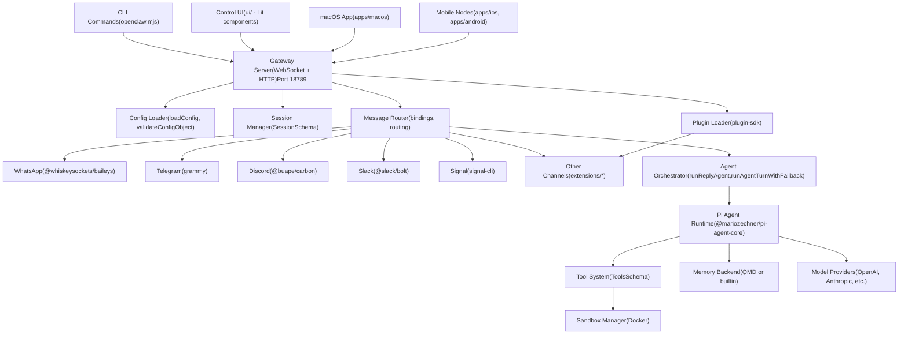
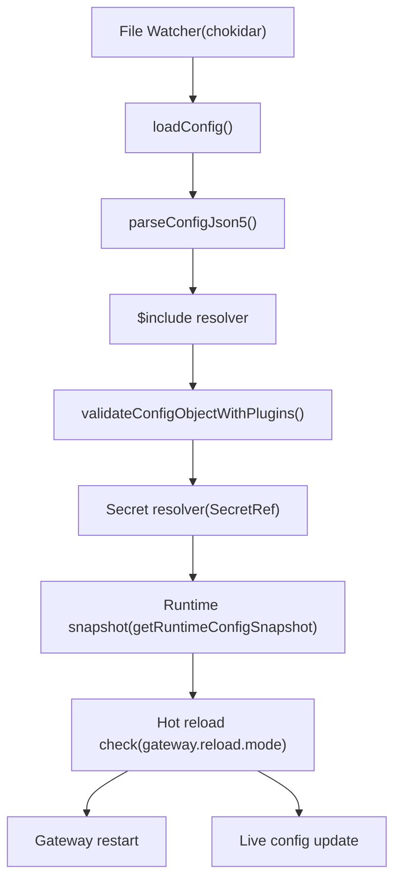
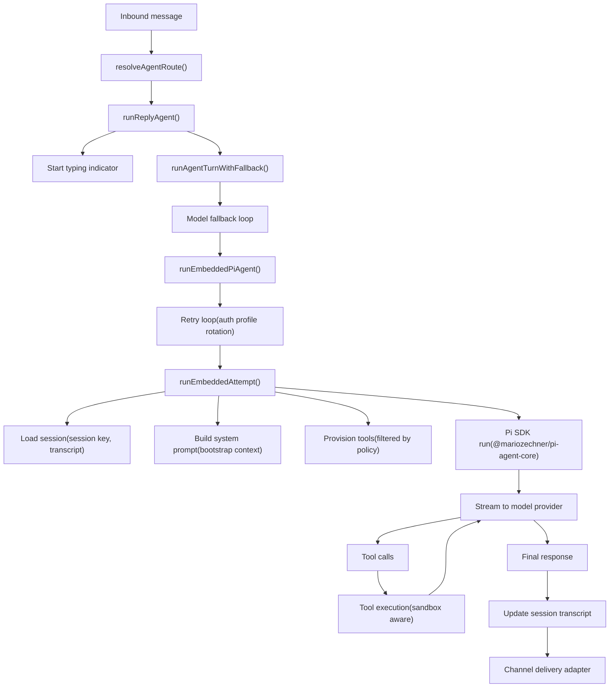
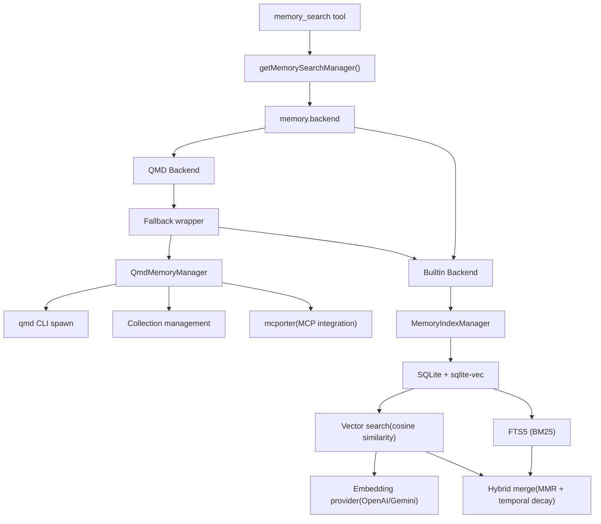
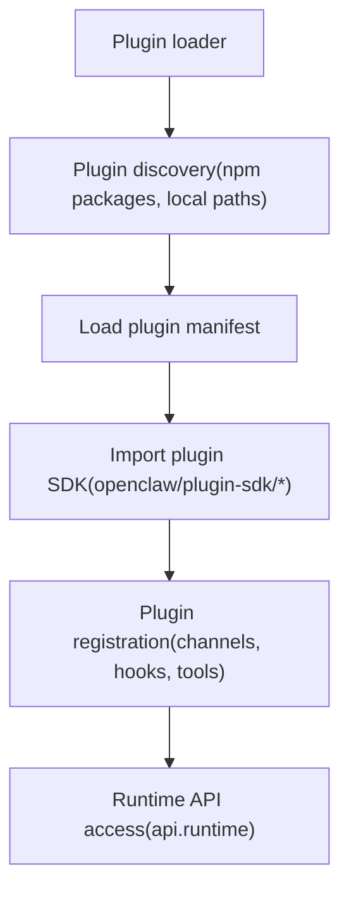

# Overview

Relevant source files

-   [CHANGELOG.md](https://github.com/openclaw/openclaw/blob/8873e13f/CHANGELOG.md)
-   [README.md](https://github.com/openclaw/openclaw/blob/8873e13f/README.md)
-   [apps/android/app/build.gradle.kts](https://github.com/openclaw/openclaw/blob/8873e13f/apps/android/app/build.gradle.kts)
-   [apps/ios/Sources/Info.plist](https://github.com/openclaw/openclaw/blob/8873e13f/apps/ios/Sources/Info.plist)
-   [apps/ios/Tests/Info.plist](https://github.com/openclaw/openclaw/blob/8873e13f/apps/ios/Tests/Info.plist)
-   [apps/ios/project.yml](https://github.com/openclaw/openclaw/blob/8873e13f/apps/ios/project.yml)
-   [apps/macos/Sources/OpenClaw/Resources/Info.plist](https://github.com/openclaw/openclaw/blob/8873e13f/apps/macos/Sources/OpenClaw/Resources/Info.plist)
-   [assets/avatar-placeholder.svg](https://github.com/openclaw/openclaw/blob/8873e13f/assets/avatar-placeholder.svg)
-   [docs/cli/index.md](https://github.com/openclaw/openclaw/blob/8873e13f/docs/cli/index.md)
-   [docs/gateway/configuration.md](https://github.com/openclaw/openclaw/blob/8873e13f/docs/gateway/configuration.md)
-   [docs/gateway/index.md](https://github.com/openclaw/openclaw/blob/8873e13f/docs/gateway/index.md)
-   [docs/gateway/troubleshooting.md](https://github.com/openclaw/openclaw/blob/8873e13f/docs/gateway/troubleshooting.md)
-   [docs/index.md](https://github.com/openclaw/openclaw/blob/8873e13f/docs/index.md)
-   [docs/platforms/mac/release.md](https://github.com/openclaw/openclaw/blob/8873e13f/docs/platforms/mac/release.md)
-   [docs/start/getting-started.md](https://github.com/openclaw/openclaw/blob/8873e13f/docs/start/getting-started.md)
-   [docs/start/wizard.md](https://github.com/openclaw/openclaw/blob/8873e13f/docs/start/wizard.md)
-   [extensions/bluebubbles/src/send-helpers.ts](https://github.com/openclaw/openclaw/blob/8873e13f/extensions/bluebubbles/src/send-helpers.ts)
-   [package.json](https://github.com/openclaw/openclaw/blob/8873e13f/package.json)
-   [pnpm-lock.yaml](https://github.com/openclaw/openclaw/blob/8873e13f/pnpm-lock.yaml)
-   [scripts/clawtributors-map.json](https://github.com/openclaw/openclaw/blob/8873e13f/scripts/clawtributors-map.json)
-   [scripts/update-clawtributors.ts](https://github.com/openclaw/openclaw/blob/8873e13f/scripts/update-clawtributors.ts)
-   [scripts/update-clawtributors.types.ts](https://github.com/openclaw/openclaw/blob/8873e13f/scripts/update-clawtributors.types.ts)
-   [src/agents/subagent-registry-cleanup.test.ts](https://github.com/openclaw/openclaw/blob/8873e13f/src/agents/subagent-registry-cleanup.test.ts)
-   [src/cli/program.ts](https://github.com/openclaw/openclaw/blob/8873e13f/src/cli/program.ts)
-   [src/config/config.ts](https://github.com/openclaw/openclaw/blob/8873e13f/src/config/config.ts)
-   [src/config/types.ts](https://github.com/openclaw/openclaw/blob/8873e13f/src/config/types.ts)
-   [src/config/zod-schema.ts](https://github.com/openclaw/openclaw/blob/8873e13f/src/config/zod-schema.ts)
-   [ui/package.json](https://github.com/openclaw/openclaw/blob/8873e13f/ui/package.json)

This document provides a high-level technical introduction to the OpenClaw codebase, its architecture, and core components. It serves as an entry point for developers who need to understand the system's structure before diving into specific subsystems.

**Purpose**: Introduce the overall system architecture, key code entities, configuration model, and development workflow.

**Scope**: This page covers the architectural layers and major subsystems. For specific implementation details, see:

-   Gateway internals and service lifecycle: [2](/openclaw/openclaw/2-gateway)
-   Agent execution pipeline and runtime: [3](/openclaw/openclaw/3-agents)
-   Channel integrations and messaging: [4](/openclaw/openclaw/4-channels)
-   Web UI and control surfaces: [5](/openclaw/openclaw/5-control-ui)
-   Native client applications (nodes): [6](/openclaw/openclaw/6-native-clients-(nodes))
-   Security model and policies: [7](/openclaw/openclaw/7-security)
-   Development workflows and CI/CD: [8](/openclaw/openclaw/8-development)

## What is OpenClaw?

OpenClaw is a **self-hosted, multi-channel AI agent gateway** that bridges messaging platforms (WhatsApp, Telegram, Discord, Slack, Signal, iMessage, and others) to AI coding agents. It runs as a single persistent process that manages sessions, routes messages, executes tools, and coordinates agent interactions.

**Key characteristics**:

-   Single `gateway` process serves all channels and clients
-   Agent runtime uses Pi SDK (`@mariozechner/pi-agent-core`, `@mariozechner/pi-ai`, `@mariozechner/pi-coding-agent`)
-   Configuration-driven with strict Zod validation (`OpenClawSchema`)
-   Plugin architecture for channel extensions and custom integrations
-   Multi-agent routing with per-agent workspaces and sessions
-   Sandboxing support (Docker-based isolation for untrusted sessions)

Sources: [package.json1-443](https://github.com/openclaw/openclaw/blob/8873e13f/package.json#L1-L443) [README.md1-581](https://github.com/openclaw/openclaw/blob/8873e13f/README.md#L1-L581) [src/config/zod-schema.ts1-694](https://github.com/openclaw/openclaw/blob/8873e13f/src/config/zod-schema.ts#L1-L694)

## Core Architecture


Sources: [package.json1-443](https://github.com/openclaw/openclaw/blob/8873e13f/package.json#L1-L443) [README.md186-202](https://github.com/openclaw/openclaw/blob/8873e13f/README.md#L186-L202) [src/config/types.ts1-36](https://github.com/openclaw/openclaw/blob/8873e13f/src/config/types.ts#L1-L36)

## Configuration System

OpenClaw uses a strict, schema-validated configuration file at `~/.openclaw/openclaw.json` (JSON5 format with comments and trailing commas).

### Core Config Schema

The configuration is defined by `OpenClawSchema` and includes these top-level sections:

| Section | Schema | Purpose |
| --- | --- | --- |
| `gateway` | Gateway settings | Port, bind address, auth mode, reload behavior |
| `agents` | `AgentsSchema` | Agent list, defaults, workspace paths |
| `channels` | `ChannelsSchema` | Channel-specific config (WhatsApp, Telegram, Discord, etc.) |
| `models` | `ModelsConfigSchema` | Model providers, auth profiles, fallbacks |
| `tools` | `ToolsSchema` | Tool policy, sandbox settings, browser config |
| `session` | `SessionSchema` | Session scoping, reset policy, thread bindings |
| `messages` | `MessagesSchema` | Message delivery, chunking, media handling |
| `bindings` | `BindingsSchema` | Multi-agent routing rules |
| `memory` | `MemorySchema` | Memory backend selection (QMD or builtin) |
| `plugins` | Plugin entries | Extension config and hooks |
| `hooks` | `HooksSchema` | Webhook endpoints and mappings |
| `cron` | Cron settings | Job scheduling and execution |
| `browser` | Browser config | Playwright/CDP settings, profiles |
| `secrets` | `SecretsConfigSchema` | SecretRef definitions (env/file/exec) |

### Config Lifecycle


**Key code entities**:

-   `loadConfig()` - Main config loader [src/config/config.ts1-24](https://github.com/openclaw/openclaw/blob/8873e13f/src/config/config.ts#L1-L24)
-   `validateConfigObjectWithPlugins()` - Zod validation with plugin schemas
-   `OpenClawSchema` - Root Zod schema [src/config/zod-schema.ts162-694](https://github.com/openclaw/openclaw/blob/8873e13f/src/config/zod-schema.ts#L162-L694)
-   `gateway.reload.mode` - Controls hot reload behavior (`hybrid`, `hot`, `restart`, `off`)

Sources: [src/config/zod-schema.ts1-694](https://github.com/openclaw/openclaw/blob/8873e13f/src/config/zod-schema.ts#L1-L694) [src/config/config.ts1-24](https://github.com/openclaw/openclaw/blob/8873e13f/src/config/config.ts#L1-L24) [docs/gateway/configuration.md1-489](https://github.com/openclaw/openclaw/blob/8873e13f/docs/gateway/configuration.md#L1-L489)

## Multi-Channel Architecture

OpenClaw supports multiple messaging platforms simultaneously through a provider pattern. Each channel has:

1.  **Monitor** - Listens for inbound events
2.  **Access control** - DM/group policies (`dmPolicy`, `groupPolicy`)
3.  **Send adapter** - Outbound message delivery
4.  **Native command registration** - Platform-specific commands (Discord slash, Telegram bot menu)

### Channel Provider Map

| Channel | Provider Package | Config Key | DM Policy |
| --- | --- | --- | --- |
| WhatsApp | `@whiskeysockets/baileys` | `channels.whatsapp` | `pairing` (default) |
| Telegram | `grammy` | `channels.telegram` | `pairing` (default) |
| Discord | `@buape/carbon` | `channels.discord` | `pairing` (default) |
| Slack | `@slack/bolt` | `channels.slack` | `pairing` (default) |
| Signal | signal-cli | `channels.signal` | `allowlist` |
| iMessage | imsg (legacy) | `channels.imessage` | N/A (macOS only) |
| BlueBubbles | HTTP API | `channels.bluebubbles` | `allowlist` |
| Google Chat | Plugin | `plugins.entries.googlechat` | Via plugin config |
| Mattermost | Plugin | `plugins.entries.mattermost` | Via plugin config |

**Channel loading pattern**:

-   Built-in channels: WhatsApp, Telegram, Discord, Slack, Signal, iMessage
-   Plugin channels: Loaded via `plugins.load.paths` and registered through plugin SDK
-   All channels share common `ChannelMonitor` interface

Sources: [package.json332-384](https://github.com/openclaw/openclaw/blob/8873e13f/package.json#L332-L384) [src/config/zod-schema.ts417-694](https://github.com/openclaw/openclaw/blob/8873e13f/src/config/zod-schema.ts#L417-L694) [README.md152-154](https://github.com/openclaw/openclaw/blob/8873e13f/README.md#L152-L154)

## Agent Execution Pipeline

The agent execution system uses a layered orchestration model:


**Key execution functions** (in order of invocation):

1.  `runReplyAgent()` - Top-level entry point, manages typing indicators and memory flushing
2.  `runAgentTurnWithFallback()` - Implements model fallback logic
3.  `runEmbeddedPiAgent()` - Handles retry/fallback across auth profiles
4.  `runEmbeddedAttempt()` - Single turn execution with Pi SDK

**Tool provisioning**:

-   `ToolsSchema` defines global tool policy
-   Hierarchical filtering: global → agent → group → sandbox
-   Sandbox mode (`agents.defaults.sandbox.mode`): `off`, `non-main`, `all`

Sources: [package.json55-66](https://github.com/openclaw/openclaw/blob/8873e13f/package.json#L55-L66) [src/config/zod-schema.ts3-23](https://github.com/openclaw/openclaw/blob/8873e13f/src/config/zod-schema.ts#L3-L23)

## Memory System Architecture

OpenClaw supports two memory backends via plugin slot selection:


**Memory backend selection**:

-   `memory.backend: "qmd"` - External QMD process (supports MCP via mcporter)
-   `memory.backend: "builtin"` - Embedded SQLite with FTS5 and sqlite-vec
-   Fallback: QMD → Builtin on error

**Config entities**:

-   `MemorySchema` [src/config/zod-schema.ts114-121](https://github.com/openclaw/openclaw/blob/8873e13f/src/config/zod-schema.ts#L114-L121)
-   `MemoryQmdSchema` [src/config/zod-schema.ts100-112](https://github.com/openclaw/openclaw/blob/8873e13f/src/config/zod-schema.ts#L100-L112)
-   `memory.citations` - Controls citation decoration (`auto`, `on`, `off`)

Sources: [src/config/zod-schema.ts44-121](https://github.com/openclaw/openclaw/blob/8873e13f/src/config/zod-schema.ts#L44-L121) [package.json163-165](https://github.com/openclaw/openclaw/blob/8873e13f/package.json#L163-L165)

## Gateway Service Lifecycle

OpenClaw runs as a persistent background service (systemd on Linux, launchd on macOS).

### Service Management Commands

| Command | Purpose |
| --- | --- |
| `openclaw gateway install` | Install systemd/launchd service unit |
| `openclaw gateway start` | Start the service |
| `openclaw gateway stop` | Stop the service |
| `openclaw gateway restart` | Restart the service |
| `openclaw gateway status` | Check service status and RPC probe |
| `openclaw gateway run` | Run gateway in foreground (dev mode) |

### Runtime Paths

| Path | Purpose | Config/Env Override |
| --- | --- | --- |
| `~/.openclaw/openclaw.json` | Main config file | `OPENCLAW_CONFIG_PATH` |
| `~/.openclaw/sessions.json` | Session state | N/A |
| `~/.openclaw/credentials/` | OAuth/API key store | N/A |
| `~/.openclaw/workspace/` | Default agent workspace | `agents.defaults.workspace` |
| `~/.openclaw/logs/` | Log files | `logging.file` |
| `~/.openclaw/.env` | Environment variables | N/A |

**Profile isolation**:

-   `--dev` flag → `~/.openclaw-dev/`
-   `--profile <name>` → `~/.openclaw-<name>/`
-   `OPENCLAW_STATE_DIR` env var for custom state root

Sources: [src/config/paths.ts](https://github.com/openclaw/openclaw/blob/8873e13f/src/config/paths.ts) (referenced but not provided), [docs/cli/index.md63-68](https://github.com/openclaw/openclaw/blob/8873e13f/docs/cli/index.md#L63-L68) [README.md52-90](https://github.com/openclaw/openclaw/blob/8873e13f/README.md#L52-L90)

## Plugin Architecture

OpenClaw uses a plugin system for extensibility:


**Plugin SDK exports** (scoped by subsystem):

-   `openclaw/plugin-sdk/core` - Core plugin utilities
-   `openclaw/plugin-sdk/telegram` - Telegram channel APIs
-   `openclaw/plugin-sdk/discord` - Discord channel APIs
-   `openclaw/plugin-sdk/slack` - Slack channel APIs
-   Plugin-specific subpaths for bundled extensions

**Plugin config**:

-   `plugins.load.paths` - Array of paths to load plugins from
-   `plugins.entries.<id>.enabled` - Enable/disable specific plugins
-   `plugins.entries.<id>.config` - Plugin-specific configuration
-   `plugins.entries.<id>.hooks.allowPromptInjection` - Control prompt-mutating hooks

Sources: [package.json37-215](https://github.com/openclaw/openclaw/blob/8873e13f/package.json#L37-L215) [src/config/zod-schema.ts149-161](https://github.com/openclaw/openclaw/blob/8873e13f/src/config/zod-schema.ts#L149-L161)

## Development Workflow

### Local Development

```
# Clone and installgit clone https://github.com/openclaw/openclaw.gitcd openclawpnpm install # Build UI and main codebasepnpm ui:buildpnpm build # Run onboarding wizardpnpm openclaw onboard --install-daemon # Development mode (auto-reload)pnpm gateway:watch
```
### Mobile Development

| Platform | Build Command | Output |
| --- | --- | --- |
| iOS | `pnpm ios:build` | Xcode project (via xcodegen) |
| Android | `pnpm android:assemble` | APK in `apps/android/app/build/outputs/` |
| macOS | `pnpm mac:package` | Signed `.app` bundle |

**iOS/macOS specifics**:

-   Uses XcodeGen for project generation [apps/ios/project.yml1-200](https://github.com/openclaw/openclaw/blob/8873e13f/apps/ios/project.yml#L1-L200)
-   Swift 6.0 with strict concurrency
-   CFBundleVersion/CFBundleShortVersionString in Info.plist

**Android specifics**:

-   Gradle-based build system [apps/android/app/build.gradle.kts1-169](https://github.com/openclaw/openclaw/blob/8873e13f/apps/android/app/build.gradle.kts#L1-L169)
-   Compose UI with Material 3
-   Multi-ABI support (arm64-v8a, armeabi-v7a, x86, x86\_64)

Sources: [package.json217-330](https://github.com/openclaw/openclaw/blob/8873e13f/package.json#L217-L330) [apps/ios/project.yml1-200](https://github.com/openclaw/openclaw/blob/8873e13f/apps/ios/project.yml#L1-L200) [apps/android/app/build.gradle.kts1-169](https://github.com/openclaw/openclaw/blob/8873e13f/apps/android/app/build.gradle.kts#L1-L169)

## CLI Entry Point

The main CLI entry point is `openclaw.mjs`, which delegates to the command tree built by `buildProgram()`.

**Command structure**:

-   Root: `openclaw [--dev] [--profile <name>] <command>`
-   Subcommands organized by domain (gateway, channels, agents, models, etc.)
-   Global flags: `--dev`, `--profile`, `--no-color`, `--json`, `--version`

**Command domains**:

-   Setup/config: `onboard`, `configure`, `config`, `doctor`
-   Service: `gateway`, `daemon` (legacy alias)
-   Messaging: `message`, `channels`, `pairing`
-   Agents: `agent`, `agents`, `acp`, `sessions`
-   Tools: `models`, `memory`, `browser`, `cron`, `hooks`, `skills`, `plugins`
-   Nodes: `nodes`, `devices`, `node`
-   Security: `security`, `secrets`, `approvals`, `sandbox`

Sources: [src/cli/program.ts1-3](https://github.com/openclaw/openclaw/blob/8873e13f/src/cli/program.ts#L1-L3) [docs/cli/index.md1-547](https://github.com/openclaw/openclaw/blob/8873e13f/docs/cli/index.md#L1-L547)

## Version and Release Information

Current version: **2026.3.2** (build 20260301)

**Version locations**:

-   package.json: `version: "2026.3.3"` [package.json3](https://github.com/openclaw/openclaw/blob/8873e13f/package.json#L3-L3)
-   iOS Info.plist: `CFBundleShortVersionString: "2026.3.2"` [apps/ios/Sources/Info.plist22](https://github.com/openclaw/openclaw/blob/8873e13f/apps/ios/Sources/Info.plist#L22-L22)
-   Android build.gradle.kts: `versionName: "2026.3.2"` [apps/android/app/build.gradle.kts25](https://github.com/openclaw/openclaw/blob/8873e13f/apps/android/app/build.gradle.kts#L25-L25)
-   macOS Info.plist: `CFBundleShortVersionString: "2026.3.2"` [apps/macos/Sources/OpenClaw/Resources/Info.plist18](https://github.com/openclaw/openclaw/blob/8873e13f/apps/macos/Sources/OpenClaw/Resources/Info.plist#L18-L18)
-   CHANGELOG.md: Latest entry `## 2026.3.3` [CHANGELOG.md5](https://github.com/openclaw/openclaw/blob/8873e13f/CHANGELOG.md#L5-L5)

**Release channels**:

-   `stable` - Tagged releases, npm dist-tag `latest`
-   `beta` - Prerelease tags, npm dist-tag `beta`
-   `dev` - Moving head of `main`, npm dist-tag `dev`

Sources: [package.json3](https://github.com/openclaw/openclaw/blob/8873e13f/package.json#L3-L3) [CHANGELOG.md1-605](https://github.com/openclaw/openclaw/blob/8873e13f/CHANGELOG.md#L1-L605) [apps/ios/Sources/Info.plist22](https://github.com/openclaw/openclaw/blob/8873e13f/apps/ios/Sources/Info.plist#L22-L22) [apps/android/app/build.gradle.kts24-25](https://github.com/openclaw/openclaw/blob/8873e13f/apps/android/app/build.gradle.kts#L24-L25)
