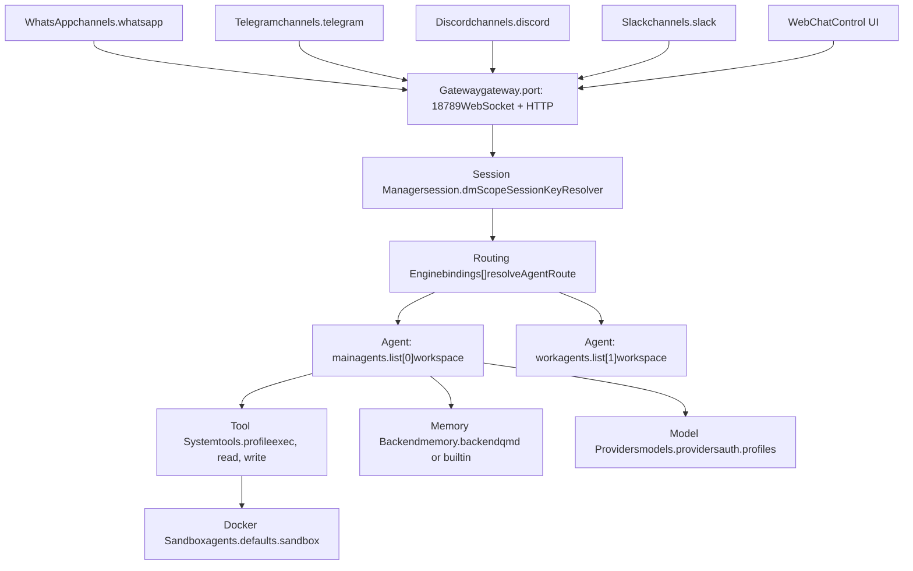
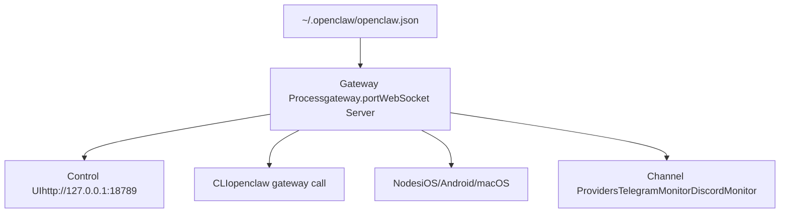
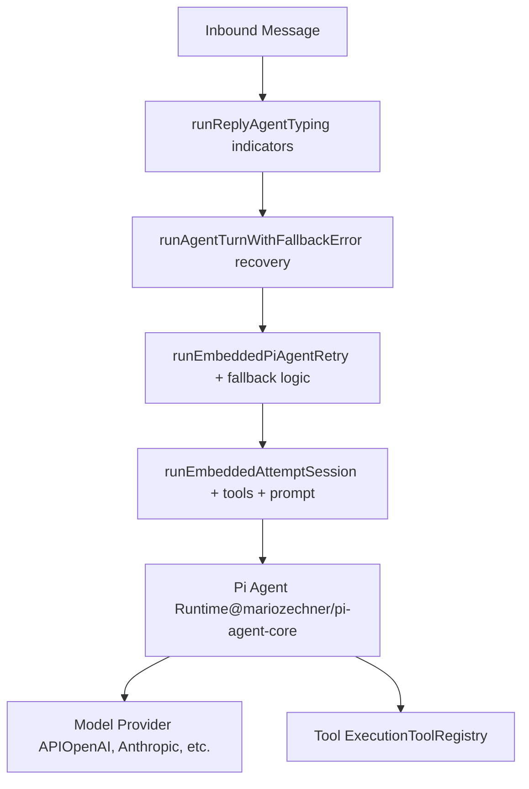
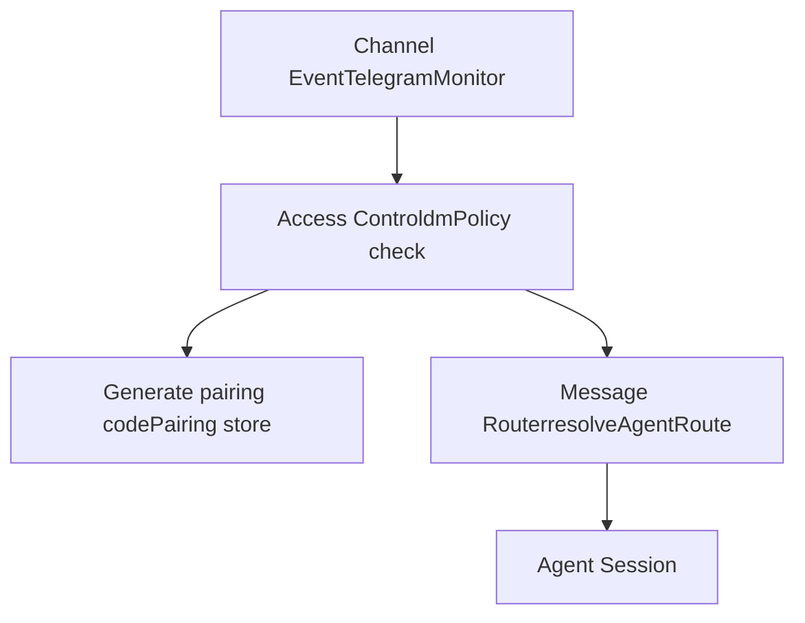
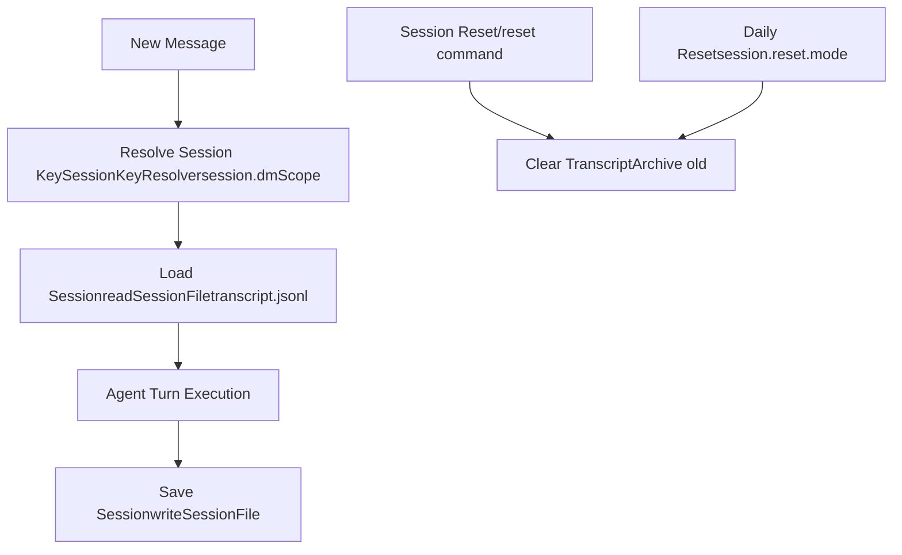
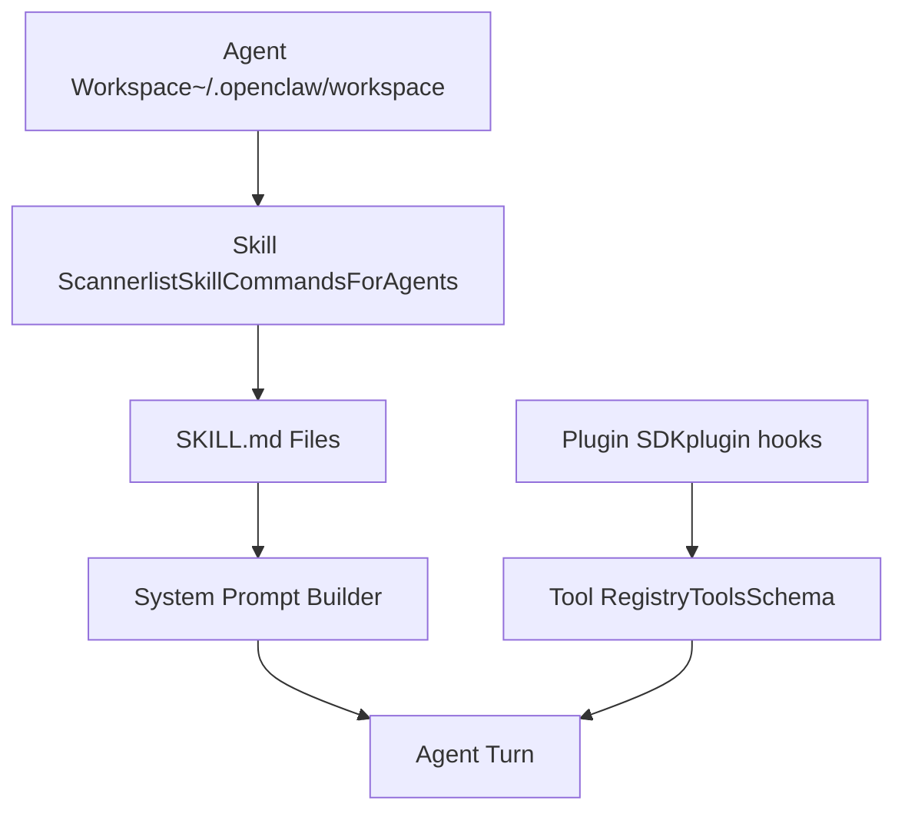
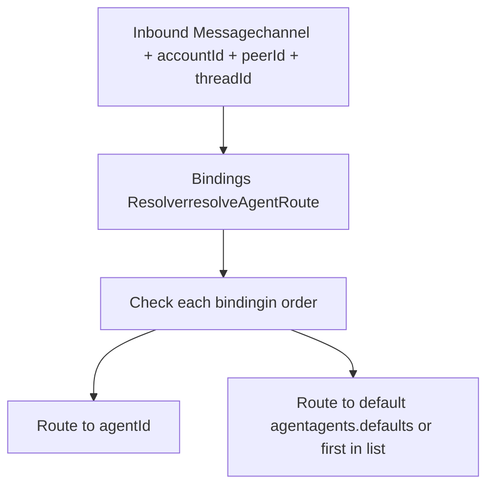
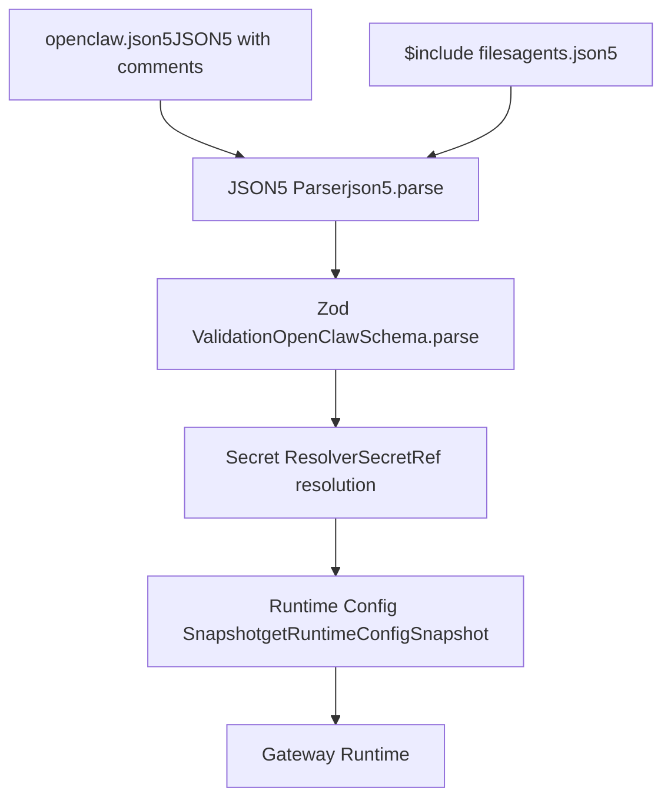

# Core Concepts

Relevant source files

-   [CHANGELOG.md](https://github.com/openclaw/openclaw/blob/8873e13f/CHANGELOG.md)
-   [README.md](https://github.com/openclaw/openclaw/blob/8873e13f/README.md)
-   [apps/android/app/build.gradle.kts](https://github.com/openclaw/openclaw/blob/8873e13f/apps/android/app/build.gradle.kts)
-   [apps/ios/Sources/Info.plist](https://github.com/openclaw/openclaw/blob/8873e13f/apps/ios/Sources/Info.plist)
-   [apps/ios/Tests/Info.plist](https://github.com/openclaw/openclaw/blob/8873e13f/apps/ios/Tests/Info.plist)
-   [apps/ios/project.yml](https://github.com/openclaw/openclaw/blob/8873e13f/apps/ios/project.yml)
-   [apps/macos/Sources/OpenClaw/Resources/Info.plist](https://github.com/openclaw/openclaw/blob/8873e13f/apps/macos/Sources/OpenClaw/Resources/Info.plist)
-   [assets/avatar-placeholder.svg](https://github.com/openclaw/openclaw/blob/8873e13f/assets/avatar-placeholder.svg)
-   [docs/cli/index.md](https://github.com/openclaw/openclaw/blob/8873e13f/docs/cli/index.md)
-   [docs/gateway/configuration.md](https://github.com/openclaw/openclaw/blob/8873e13f/docs/gateway/configuration.md)
-   [docs/gateway/index.md](https://github.com/openclaw/openclaw/blob/8873e13f/docs/gateway/index.md)
-   [docs/gateway/troubleshooting.md](https://github.com/openclaw/openclaw/blob/8873e13f/docs/gateway/troubleshooting.md)
-   [docs/index.md](https://github.com/openclaw/openclaw/blob/8873e13f/docs/index.md)
-   [docs/platforms/mac/release.md](https://github.com/openclaw/openclaw/blob/8873e13f/docs/platforms/mac/release.md)
-   [docs/start/getting-started.md](https://github.com/openclaw/openclaw/blob/8873e13f/docs/start/getting-started.md)
-   [docs/start/wizard.md](https://github.com/openclaw/openclaw/blob/8873e13f/docs/start/wizard.md)
-   [extensions/bluebubbles/src/send-helpers.ts](https://github.com/openclaw/openclaw/blob/8873e13f/extensions/bluebubbles/src/send-helpers.ts)
-   [package.json](https://github.com/openclaw/openclaw/blob/8873e13f/package.json)
-   [pnpm-lock.yaml](https://github.com/openclaw/openclaw/blob/8873e13f/pnpm-lock.yaml)
-   [scripts/clawtributors-map.json](https://github.com/openclaw/openclaw/blob/8873e13f/scripts/clawtributors-map.json)
-   [scripts/update-clawtributors.ts](https://github.com/openclaw/openclaw/blob/8873e13f/scripts/update-clawtributors.ts)
-   [scripts/update-clawtributors.types.ts](https://github.com/openclaw/openclaw/blob/8873e13f/scripts/update-clawtributors.types.ts)
-   [src/agents/subagent-registry-cleanup.test.ts](https://github.com/openclaw/openclaw/blob/8873e13f/src/agents/subagent-registry-cleanup.test.ts)
-   [src/cli/program.ts](https://github.com/openclaw/openclaw/blob/8873e13f/src/cli/program.ts)
-   [src/config/config.ts](https://github.com/openclaw/openclaw/blob/8873e13f/src/config/config.ts)
-   [src/config/types.ts](https://github.com/openclaw/openclaw/blob/8873e13f/src/config/types.ts)
-   [src/config/zod-schema.ts](https://github.com/openclaw/openclaw/blob/8873e13f/src/config/zod-schema.ts)
-   [ui/package.json](https://github.com/openclaw/openclaw/blob/8873e13f/ui/package.json)

This page defines the fundamental building blocks of OpenClaw's architecture. It covers the core entities you'll encounter when working with the system: Gateway, Agents, Channels, Sessions, Nodes, Skills, and Bindings.

For operational details about running the Gateway, see [Gateway Runbook](/openclaw/openclaw/2-gateway). For configuration reference, see [Configuration System](/openclaw/openclaw/2.3-configuration-system) and [Configuration Reference](/openclaw/openclaw/2.3.1-configuration-reference).

---

## System Model Overview

OpenClaw operates as a **multi-layer agent orchestration platform** where a central Gateway process routes messages from various channels to AI agents, managing sessions, tools, and authentication along the way.


**Sources:** [README.md185-202](https://github.com/openclaw/openclaw/blob/8873e13f/README.md#L185-L202) [docs/index.md59-70](https://github.com/openclaw/openclaw/blob/8873e13f/docs/index.md#L59-L70) [src/config/zod-schema.ts162-800](https://github.com/openclaw/openclaw/blob/8873e13f/src/config/zod-schema.ts#L162-L800)

---

## Gateway

The **Gateway** is the central control plane that runs as a single long-lived process. All communication flows through it via WebSocket and HTTP on a unified port (default `18789`).

### Responsibilities

1.  **WebSocket protocol server** — Protocol v3 for clients, TUI, Control UI, and nodes
2.  **Message routing** — Routes inbound messages to the correct agent session via `resolveAgentRoute`
3.  **Session management** — Maintains conversation state using `SessionManager` and transcript files
4.  **Channel coordination** — Manages lifecycle for all configured channel providers
5.  **Configuration hot-reload** — Watches config file and applies changes (see `gateway.reload.mode`)
6.  **Authentication** — Enforces `gateway.auth.mode` (token/password) and device pairing

### Key Configuration Fields

| Field | Purpose | Default |
| --- | --- | --- |
| `gateway.port` | WebSocket + HTTP listener port | `18789` |
| `gateway.bind` | Bind address (`loopback`, `lan`, `tailnet`, `custom`) | `loopback` |
| `gateway.auth.mode` | Authentication mode (`token` or `password`) | Required when non-loopback |
| `gateway.auth.token` | Shared token for RPC access | (required if mode=token) |
| `gateway.reload.mode` | Config reload behavior (`hybrid`, `hot`, `restart`, `off`) | `hybrid` |

**Lifecycle:** Typically runs as a systemd user unit (Linux) or LaunchAgent (macOS). Use `openclaw gateway status` to check health and `openclaw gateway --port 18789` to run in foreground.


**Sources:** [docs/gateway/index.md1-350](https://github.com/openclaw/openclaw/blob/8873e13f/docs/gateway/index.md#L1-L350) [src/config/zod-schema.ts490-560](https://github.com/openclaw/openclaw/blob/8873e13f/src/config/zod-schema.ts#L490-L560) [README.md186-202](https://github.com/openclaw/openclaw/blob/8873e13f/README.md#L186-L202) [package.json1-18](https://github.com/openclaw/openclaw/blob/8873e13f/package.json#L1-L18)

---

## Agents

An **Agent** is an isolated AI execution unit with its own workspace, model configuration, and session scope. Agents run the Pi agent runtime in embedded RPC mode.

### Agent Structure

Each agent is defined in `agents.list[]` and has:

-   **`id`** — Unique identifier (e.g. `"main"`, `"work"`)
-   **`workspace`** — Root directory for agent files (`AGENTS.md`, `SOUL.md`, `TOOLS.md`, skills)
-   **Model configuration** — Primary model and fallbacks via `agents.defaults.model`
-   **Tool policy** — Which tools are available (`tools.profile`, per-agent overrides)
-   **Sandbox settings** — Isolation mode (`agents.defaults.sandbox.mode`)

### Execution Flow

Agent turns are orchestrated through a layered call stack:

1.  **`runReplyAgent`** — Top-level dispatcher (handles typing indicators, memory flush)
2.  **`runAgentTurnWithFallback`** — Error recovery and model fallback logic
3.  **`runEmbeddedPiAgent`** — Retry/fallback across auth profiles and providers
4.  **`runEmbeddedAttempt`** — Single turn execution (assembles tools, builds system prompt, streams model)


### Multi-Agent Routing

Use `bindings[]` to route channels/accounts to specific agents:

```
{  agents: {    list: [      { id: "main", workspace: "~/.openclaw/workspace" },      { id: "work", workspace: "~/.openclaw/workspace-work" }    ]  },  bindings: [    { agentId: "main", match: { channel: "whatsapp", accountId: "personal" } },    { agentId: "work", match: { channel: "telegram" } }  ]}
```
**Sources:** [README.md130-136](https://github.com/openclaw/openclaw/blob/8873e13f/README.md#L130-L136) [docs/gateway/configuration.md302-323](https://github.com/openclaw/openclaw/blob/8873e13f/docs/gateway/configuration.md#L302-L323) [CHANGELOG.md14-26](https://github.com/openclaw/openclaw/blob/8873e13f/CHANGELOG.md#L14-L26) [src/config/zod-schema.ts418-419](https://github.com/openclaw/openclaw/blob/8873e13f/src/config/zod-schema.ts#L418-L419)

---

## Channels

**Channels** are messaging platform integrations that connect the Gateway to external services like WhatsApp, Telegram, Discord, and Slack.

### Channel Architecture

Each channel implements a **monitor provider pattern**:

-   **Provider** — Long-lived connection to the platform (e.g. `TelegramMonitor`, `DiscordMonitor`)
-   **Monitor lifecycle** — Start/stop/restart managed by Gateway
-   **Access control** — `dmPolicy`, `groupPolicy`, `allowFrom`, pairing store
-   **Native commands** — Platform-specific slash commands and interactions

### Built-in Channels

| Channel | Config Key | Notes |
| --- | --- | --- |
| WhatsApp | `channels.whatsapp` | Uses Baileys multi-device |
| Telegram | `channels.telegram` | grammY bot framework |
| Discord | `channels.discord` | @buape/carbon client |
| Slack | `channels.slack` | Bolt SDK |
| Signal | `channels.signal` | signal-cli integration |
| iMessage | `channels.imessage` | macOS-only legacy |
| BlueBubbles | `channels.bluebubbles` | Recommended iMessage (any OS) |
| WebChat | (built-in) | Control UI chat interface |

### Access Control

Channels enforce DM and group policies before routing messages:

```
{  channels: {    telegram: {      dmPolicy: "pairing",      // pairing | allowlist | open | disabled      allowFrom: ["tg:123456"], // allowlist for allowlist/open modes      groups: {        "*": { requireMention: true }      }    }  }}
```

**Sources:** [docs/channels/index.md1-150](https://github.com/openclaw/openclaw/blob/8873e13f/docs/channels/index.md#L1-L150) [README.md151-154](https://github.com/openclaw/openclaw/blob/8873e13f/README.md#L151-L154) [src/config/zod-schema.ts620-730](https://github.com/openclaw/openclaw/blob/8873e13f/src/config/zod-schema.ts#L620-L730) [docs/gateway/configuration.md74-105](https://github.com/openclaw/openclaw/blob/8873e13f/docs/gateway/configuration.md#L74-L105)

---

## Sessions

A **Session** is an isolated conversation context with its own transcript, state, and model usage tracking. Sessions are identified by a **session key** and persist to disk as JSONL transcript files.

### Session Key Structure

Session keys follow a hierarchical format:

-   **`main`** — Shared main session (legacy default)
-   **`agent:<agentId>:main`** — Agent-scoped main session
-   **`agent:<agentId>:<channel>:dm:<peer>`** — DM session (per-channel-peer)
-   **`agent:<agentId>:<channel>:group:<groupId>`** — Group session
-   **`agent:<agentId>:<channel>:thread:<threadId>`** — Thread-bound session

### Session Scoping

The `session.dmScope` setting controls DM isolation:

| `dmScope` | Behavior |
| --- | --- |
| `main` | All DMs share one session (legacy) |
| `per-peer` | Separate session per peer, across channels |
| `per-channel-peer` | Separate session per channel + peer (recommended) |
| `per-account-channel-peer` | Separate per account + channel + peer |

### Session Lifecycle


### Session Tools

Agents can interact with sessions via tools:

-   **`sessions_list`** — Discover active sessions
-   **`sessions_history`** — Fetch transcript logs
-   **`sessions_send`** — Message another session
-   **`sessions_spawn`** — Create subagent (ACP)

**Sources:** [docs/concepts/session.md1-200](https://github.com/openclaw/openclaw/blob/8873e13f/docs/concepts/session.md#L1-L200) [README.md256-262](https://github.com/openclaw/openclaw/blob/8873e13f/README.md#L256-L262) [src/config/zod-schema.ts20-22](https://github.com/openclaw/openclaw/blob/8873e13f/src/config/zod-schema.ts#L20-L22) [docs/gateway/configuration.md176-204](https://github.com/openclaw/openclaw/blob/8873e13f/docs/gateway/configuration.md#L176-L204)

---

## Nodes

**Nodes** are paired devices (iOS, Android, macOS) that expose device-specific capabilities to agents via the Gateway protocol. Nodes authenticate using device pairing and respond to `node.invoke` RPC calls.

### Node Capabilities

| Capability | Command | Notes |
| --- | --- | --- |
| System exec | `system.run` | Bash execution (macOS only with approval) |
| Notifications | `system.notify` | User notifications |
| Camera | `camera.snap`, `camera.clip` | Photo/video capture |
| Screen recording | `screen.record` | Screen capture |
| Location | `location.get` | GPS coordinates |
| Canvas | `canvas.push`, `canvas.reset` | A2UI rendering |

### Pairing Flow

> **[Mermaid sequence]**
> *(图表结构无法解析)*

**Sources:** [docs/nodes/index.md1-200](https://github.com/openclaw/openclaw/blob/8873e13f/docs/nodes/index.md#L1-L200) [README.md158-162](https://github.com/openclaw/openclaw/blob/8873e13f/README.md#L158-L162) [docs/gateway/configuration.md1-100](https://github.com/openclaw/openclaw/blob/8873e13f/docs/gateway/configuration.md#L1-L100) [apps/ios/Sources/Info.plist1-91](https://github.com/openclaw/openclaw/blob/8873e13f/apps/ios/Sources/Info.plist#L1-L91) [apps/android/app/build.gradle.kts1-169](https://github.com/openclaw/openclaw/blob/8873e13f/apps/android/app/build.gradle.kts#L1-L169)

---

## Skills

**Skills** are agent capabilities packaged as workspace files or npm-installed plugins. Skills inject prompt guidance and optional tools into the agent runtime.

### Skill Types

1.  **Workspace skills** — `~/.openclaw/workspace/skills/<name>/SKILL.md`
2.  **Bundled skills** — Shipped with OpenClaw distribution
3.  **Managed skills** — Installed from ClawHub registry

### Skill Configuration

```
{  skills: {    enabled: true,    bundled: { enabled: true },    managed: {      enabled: true,      clawhub: { enabled: true, url: "https://clawhub.com" }    },    entries: {      "diffs": { enabled: true }    }  }}
```
### Skill Loading

Skills are discovered and loaded during agent turn execution:

1.  **Workspace scan** — Load `skills/*/SKILL.md` from agent workspace
2.  **Bundled/managed** — Load from OpenClaw distribution or npm packages
3.  **Tool provisioning** — Skills can register tools via plugin hooks
4.  **Prompt injection** — `SKILL.md` content is injected into system prompt


**Sources:** [README.md312-318](https://github.com/openclaw/openclaw/blob/8873e13f/README.md#L312-L318) [docs/tools/skills.md1-200](https://github.com/openclaw/openclaw/blob/8873e13f/docs/tools/skills.md#L1-L200) [src/config/zod-schema.ts140-148](https://github.com/openclaw/openclaw/blob/8873e13f/src/config/zod-schema.ts#L140-L148) [CHANGELOG.md77-78](https://github.com/openclaw/openclaw/blob/8873e13f/CHANGELOG.md#L77-L78)

---

## Bindings

**Bindings** define routing rules that map inbound messages to specific agents based on channel, account, peer, or thread criteria.

### Binding Structure

Each binding in `bindings[]` specifies:

-   **`agentId`** — Target agent identifier
-   **`match`** — Matching criteria (channel, accountId, peerId, threadId)
-   **Priority** — Bindings are evaluated in order; first match wins

### Example Configuration

```
{  bindings: [    // Route personal WhatsApp to main agent    {      agentId: "main",      match: { channel: "whatsapp", accountId: "personal" }    },    // Route all Telegram to work agent    {      agentId: "work",      match: { channel: "telegram" }    },    // Route specific Discord thread to a dedicated agent    {      agentId: "support",      match: { channel: "discord", threadId: "123456" }    }  ]}
```
### Routing Resolution

The Gateway uses `resolveAgentRoute` to determine which agent handles a message:


**Persistent bindings** are stored for ACP sessions and Discord threads to maintain session continuity across restarts.

**Sources:** [docs/gateway/configuration.md302-323](https://github.com/openclaw/openclaw/blob/8873e13f/docs/gateway/configuration.md#L302-L323) [CHANGELOG.md16-17](https://github.com/openclaw/openclaw/blob/8873e13f/CHANGELOG.md#L16-L17) [src/config/zod-schema.ts420](https://github.com/openclaw/openclaw/blob/8873e13f/src/config/zod-schema.ts#L420-L420)

---

## Configuration Model

OpenClaw reads configuration from `~/.openclaw/openclaw.json` (JSON5 format) and validates it against a strict Zod schema.

### Configuration Pipeline


### Top-Level Schema Structure

| Key | Type | Purpose |
| --- | --- | --- |
| `gateway` | `GatewaySchema` | Port, bind, auth, reload settings |
| `agents` | `AgentsSchema` | Agent list, defaults, workspace |
| `channels` | `ChannelsSchema` | Channel-specific configurations |
| `session` | `SessionSchema` | Session scoping, reset, bindings |
| `tools` | `ToolsSchema` | Tool policy and configuration |
| `models` | `ModelsConfigSchema` | Model catalog and providers |
| `bindings` | `BindingsSchema` | Multi-agent routing rules |
| `skills` | `SkillsSchema` | Skill discovery and management |
| `memory` | `MemorySchema` | Memory backend (qmd or builtin) |
| `cron` | `CronSchema` | Scheduled job configuration |
| `hooks` | `HooksSchema` | Webhook and hook mappings |

### Hot Reload

The Gateway watches the config file and applies changes automatically based on `gateway.reload.mode`:

-   **`hybrid`** (default) — Hot-applies safe changes; restarts for critical ones
-   **`hot`** — Only hot-applies; logs warnings for restart-required changes
-   **`restart`** — Restarts on any config change
-   **`off`** — No file watching

**Sources:** [docs/gateway/configuration.md1-500](https://github.com/openclaw/openclaw/blob/8873e13f/docs/gateway/configuration.md#L1-L500) [src/config/zod-schema.ts162-800](https://github.com/openclaw/openclaw/blob/8873e13f/src/config/zod-schema.ts#L162-L800) [src/config/types.ts1-36](https://github.com/openclaw/openclaw/blob/8873e13f/src/config/types.ts#L1-L36) [src/config/config.ts1-24](https://github.com/openclaw/openclaw/blob/8873e13f/src/config/config.ts#L1-L24)
