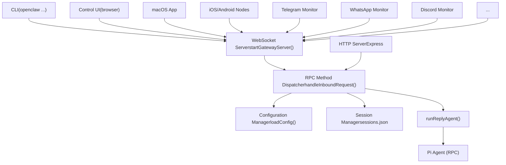
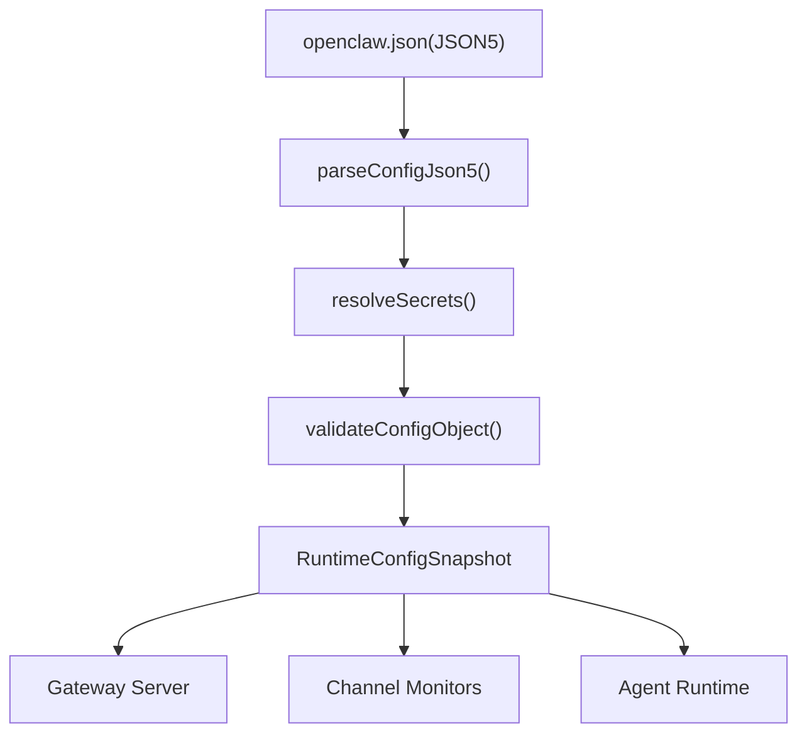

# Gateway

Relevant source files

-   [CHANGELOG.md](https://github.com/openclaw/openclaw/blob/8873e13f/CHANGELOG.md)
-   [README.md](https://github.com/openclaw/openclaw/blob/8873e13f/README.md)
-   [apps/android/app/build.gradle.kts](https://github.com/openclaw/openclaw/blob/8873e13f/apps/android/app/build.gradle.kts)
-   [apps/ios/Sources/Info.plist](https://github.com/openclaw/openclaw/blob/8873e13f/apps/ios/Sources/Info.plist)
-   [apps/ios/Tests/Info.plist](https://github.com/openclaw/openclaw/blob/8873e13f/apps/ios/Tests/Info.plist)
-   [apps/ios/project.yml](https://github.com/openclaw/openclaw/blob/8873e13f/apps/ios/project.yml)
-   [apps/macos/Sources/OpenClaw/Resources/Info.plist](https://github.com/openclaw/openclaw/blob/8873e13f/apps/macos/Sources/OpenClaw/Resources/Info.plist)
-   [apps/macos/Sources/OpenClawProtocol/GatewayModels.swift](https://github.com/openclaw/openclaw/blob/8873e13f/apps/macos/Sources/OpenClawProtocol/GatewayModels.swift)
-   [apps/shared/OpenClawKit/Sources/OpenClawProtocol/GatewayModels.swift](https://github.com/openclaw/openclaw/blob/8873e13f/apps/shared/OpenClawKit/Sources/OpenClawProtocol/GatewayModels.swift)
-   [assets/avatar-placeholder.svg](https://github.com/openclaw/openclaw/blob/8873e13f/assets/avatar-placeholder.svg)
-   [docs/cli/index.md](https://github.com/openclaw/openclaw/blob/8873e13f/docs/cli/index.md)
-   [docs/experiments/onboarding-config-protocol.md](https://github.com/openclaw/openclaw/blob/8873e13f/docs/experiments/onboarding-config-protocol.md)
-   [docs/gateway/configuration.md](https://github.com/openclaw/openclaw/blob/8873e13f/docs/gateway/configuration.md)
-   [docs/gateway/index.md](https://github.com/openclaw/openclaw/blob/8873e13f/docs/gateway/index.md)
-   [docs/gateway/troubleshooting.md](https://github.com/openclaw/openclaw/blob/8873e13f/docs/gateway/troubleshooting.md)
-   [docs/index.md](https://github.com/openclaw/openclaw/blob/8873e13f/docs/index.md)
-   [docs/platforms/mac/release.md](https://github.com/openclaw/openclaw/blob/8873e13f/docs/platforms/mac/release.md)
-   [docs/start/getting-started.md](https://github.com/openclaw/openclaw/blob/8873e13f/docs/start/getting-started.md)
-   [docs/start/wizard.md](https://github.com/openclaw/openclaw/blob/8873e13f/docs/start/wizard.md)
-   [extensions/bluebubbles/src/send-helpers.ts](https://github.com/openclaw/openclaw/blob/8873e13f/extensions/bluebubbles/src/send-helpers.ts)
-   [package.json](https://github.com/openclaw/openclaw/blob/8873e13f/package.json)
-   [pnpm-lock.yaml](https://github.com/openclaw/openclaw/blob/8873e13f/pnpm-lock.yaml)
-   [scripts/clawtributors-map.json](https://github.com/openclaw/openclaw/blob/8873e13f/scripts/clawtributors-map.json)
-   [scripts/protocol-gen-swift.ts](https://github.com/openclaw/openclaw/blob/8873e13f/scripts/protocol-gen-swift.ts)
-   [scripts/update-clawtributors.ts](https://github.com/openclaw/openclaw/blob/8873e13f/scripts/update-clawtributors.ts)
-   [scripts/update-clawtributors.types.ts](https://github.com/openclaw/openclaw/blob/8873e13f/scripts/update-clawtributors.types.ts)
-   [src/agents/openclaw-gateway-tool.test.ts](https://github.com/openclaw/openclaw/blob/8873e13f/src/agents/openclaw-gateway-tool.test.ts)
-   [src/agents/subagent-registry-cleanup.test.ts](https://github.com/openclaw/openclaw/blob/8873e13f/src/agents/subagent-registry-cleanup.test.ts)
-   [src/agents/tools/gateway-tool.ts](https://github.com/openclaw/openclaw/blob/8873e13f/src/agents/tools/gateway-tool.ts)
-   [src/cli/program.ts](https://github.com/openclaw/openclaw/blob/8873e13f/src/cli/program.ts)
-   [src/config/config.ts](https://github.com/openclaw/openclaw/blob/8873e13f/src/config/config.ts)
-   [src/config/schema.test.ts](https://github.com/openclaw/openclaw/blob/8873e13f/src/config/schema.test.ts)
-   [src/config/types.ts](https://github.com/openclaw/openclaw/blob/8873e13f/src/config/types.ts)
-   [src/config/zod-schema.ts](https://github.com/openclaw/openclaw/blob/8873e13f/src/config/zod-schema.ts)
-   [src/discord/monitor/thread-bindings.shared-state.test.ts](https://github.com/openclaw/openclaw/blob/8873e13f/src/discord/monitor/thread-bindings.shared-state.test.ts)
-   [src/gateway/method-scopes.test.ts](https://github.com/openclaw/openclaw/blob/8873e13f/src/gateway/method-scopes.test.ts)
-   [src/gateway/method-scopes.ts](https://github.com/openclaw/openclaw/blob/8873e13f/src/gateway/method-scopes.ts)
-   [src/gateway/protocol/index.ts](https://github.com/openclaw/openclaw/blob/8873e13f/src/gateway/protocol/index.ts)
-   [src/gateway/protocol/schema.ts](https://github.com/openclaw/openclaw/blob/8873e13f/src/gateway/protocol/schema.ts)
-   [src/gateway/protocol/schema/config.ts](https://github.com/openclaw/openclaw/blob/8873e13f/src/gateway/protocol/schema/config.ts)
-   [src/gateway/protocol/schema/protocol-schemas.ts](https://github.com/openclaw/openclaw/blob/8873e13f/src/gateway/protocol/schema/protocol-schemas.ts)
-   [src/gateway/protocol/schema/types.ts](https://github.com/openclaw/openclaw/blob/8873e13f/src/gateway/protocol/schema/types.ts)
-   [src/gateway/server-methods-list.ts](https://github.com/openclaw/openclaw/blob/8873e13f/src/gateway/server-methods-list.ts)
-   [src/gateway/server-methods.ts](https://github.com/openclaw/openclaw/blob/8873e13f/src/gateway/server-methods.ts)
-   [src/gateway/server-methods/config.ts](https://github.com/openclaw/openclaw/blob/8873e13f/src/gateway/server-methods/config.ts)
-   [src/gateway/server-methods/restart-request.ts](https://github.com/openclaw/openclaw/blob/8873e13f/src/gateway/server-methods/restart-request.ts)
-   [src/gateway/server-methods/update.ts](https://github.com/openclaw/openclaw/blob/8873e13f/src/gateway/server-methods/update.ts)
-   [src/gateway/server.config-patch.test.ts](https://github.com/openclaw/openclaw/blob/8873e13f/src/gateway/server.config-patch.test.ts)
-   [src/gateway/server.ts](https://github.com/openclaw/openclaw/blob/8873e13f/src/gateway/server.ts)
-   [ui/package.json](https://github.com/openclaw/openclaw/blob/8873e13f/ui/package.json)

## Purpose and Scope

The Gateway is OpenClaw's **central control plane** — a single process that manages WebSocket and HTTP communication, routes messages between channels and agents, handles sessions and configuration, and coordinates all system components. It runs as a daemon service (launchd on macOS, systemd on Linux/WSL2) and serves as the unified access point for clients (CLI, Control UI, mobile nodes), channels (Telegram, WhatsApp, Discord, etc.), and the agent execution engine.

This page covers the Gateway server implementation, protocol, configuration system, authentication, and service lifecycle. For related topics:

-   **WebSocket protocol specification**: See [WebSocket Protocol & RPC](/openclaw/openclaw/2.1-websocket-protocol-and-rpc)
-   **Authentication and device pairing flows**: See [Authentication & Device Pairing](/openclaw/openclaw/2.2-authentication-and-device-pairing)
-   **Configuration reference and hot reload**: See [Configuration System](/openclaw/openclaw/2.3-configuration-system)
-   **Session routing and isolation**: See [Session Management](/openclaw/openclaw/2.4-session-management)
-   **Service installation and diagnostics**: See [Service Lifecycle & Diagnostics](/openclaw/openclaw/2.5-service-lifecycle-and-diagnostics)

---

## Architecture Overview

The Gateway operates as a unified server that exposes:

1.  **WebSocket endpoint** (protocol v3) for real-time bidirectional communication with clients
2.  **HTTP endpoints** for Control UI, webhooks, health checks, and REST-style operations
3.  **RPC method layer** that handles 50+ methods across config, sessions, agents, channels, cron, and tools
4.  **Configuration system** that validates and hot-reloads `~/.openclaw/openclaw.json`
5.  **Session management** that tracks conversation state and routes messages to agents

**Gateway as Central Control Plane**


Sources: [Diagram 1 (system architecture)](https://github.com/openclaw/openclaw/blob/8873e13f/Diagram 1 (system architecture)) [src/gateway/server.impl.ts1-500](https://github.com/openclaw/openclaw/blob/8873e13f/src/gateway/server.impl.ts#L1-L500) [README.md186-202](https://github.com/openclaw/openclaw/blob/8873e13f/README.md#L186-L202)

---

## Server Implementation

The Gateway server is implemented in [src/gateway/server.impl.ts](https://github.com/openclaw/openclaw/blob/8873e13f/src/gateway/server.impl.ts) and exports the `startGatewayServer()` function, which:

1.  Validates configuration via Zod schemas
2.  Starts the WebSocket server (using `ws` library)
3.  Starts the HTTP server (using Express)
4.  Initializes channel monitors (Telegram, WhatsApp, Discord, etc.)
5.  Sets up hot reload watchers for `openclaw.json`
6.  Registers RPC method handlers via `handleInboundRequest()`

**Key Entry Points**

| Function | File | Purpose |
| --- | --- | --- |
| `startGatewayServer()` | [src/gateway/server.impl.ts](https://github.com/openclaw/openclaw/blob/8873e13f/src/gateway/server.impl.ts) | Main server startup; returns teardown callback |
| `handleInboundRequest()` | [src/gateway/server-methods.ts](https://github.com/openclaw/openclaw/blob/8873e13f/src/gateway/server-methods.ts) | Dispatches RPC frames to method handlers |
| `loadConfig()` | [src/config/io.ts](https://github.com/openclaw/openclaw/blob/8873e13f/src/config/io.ts) | Loads and validates `openclaw.json` with Zod |
| `buildProgram()` | [src/cli/program.ts](https://github.com/openclaw/openclaw/blob/8873e13f/src/cli/program.ts) | CLI entry point that invokes `startGatewayServer()` for `openclaw gateway` |

**Server Startup Sequence**

> **[Mermaid sequence]**
> *(图表结构无法解析)*

Sources: [src/gateway/server.impl.ts100-300](https://github.com/openclaw/openclaw/blob/8873e13f/src/gateway/server.impl.ts#L100-L300) [src/cli/program.ts](https://github.com/openclaw/openclaw/blob/8873e13f/src/cli/program.ts) [src/config/io.ts1-200](https://github.com/openclaw/openclaw/blob/8873e13f/src/config/io.ts#L1-L200)

**Port and Bind Configuration**

The Gateway binds to a port and address specified in config:

```
{  gateway: {    port: 18789,           // default WebSocket/HTTP port    bind: "loopback",      // loopback | lan | tailnet | auto | custom    // custom mode requires explicit host:    host: "192.168.1.100", // only for bind="custom"  }}
```
-   **Loopback** (`127.0.0.1`): Default; only local clients can connect
-   **LAN** (`0.0.0.0`): Listens on all interfaces; requires firewall configuration
-   **Tailnet**: Uses Tailscale Serve/Funnel for secure remote access
-   **Auto**: Detects Tailscale presence and falls back to loopback

Sources: [docs/gateway/configuration.md1-100](https://github.com/openclaw/openclaw/blob/8873e13f/docs/gateway/configuration.md#L1-L100) [src/config/types.gateway.ts](https://github.com/openclaw/openclaw/blob/8873e13f/src/config/types.gateway.ts)

---

## Protocol (v3)

The Gateway uses **protocol version 3** for all WebSocket communication. Clients and the server exchange three frame types: `request`, `response`, and `event`.

**Frame Types**

| Frame Type | Direction | Schema | Purpose |
| --- | --- | --- | --- |
| `request` | Client → Gateway | `RequestFrame` | Invoke an RPC method |
| `response` | Gateway → Client | `ResponseFrame` | Return method result or error |
| `event` | Gateway → Client | `EventFrame` | Push state changes (sessions, chat deltas, etc.) |

**RequestFrame Structure**

```
{  type: "request",  id: "unique-request-id",        // client-generated UUID  method: "chat.send",             // RPC method name  params: { sessionKey: "...", ... } // method-specific parameters}
```
**ResponseFrame Structure**

```
{  type: "response",  id: "matching-request-id",  ok: true,                        // true = success, false = error  payload: { ... },                // result when ok=true  error: {                         // error shape when ok=false    code: "INVALID_REQUEST",    message: "...",    retryAfterMs: 5000             // optional rate-limit backoff  }}
```
**EventFrame Structure**

```
{  type: "event",  event: "chat:delta",             // event name  seq: 123,                        // monotonic sequence number  payload: { sessionKey: "...", content: "..." },  stateVersion: { sessions: 45 }   // optional state version}
```
**Error Codes**

Standard error codes are defined in [src/gateway/protocol/schema/error-codes.ts](https://github.com/openclaw/openclaw/blob/8873e13f/src/gateway/protocol/schema/error-codes.ts):

-   `NOT_LINKED`: Client not authenticated
-   `NOT_PAIRED`: Device pairing required
-   `AGENT_TIMEOUT`: Agent execution exceeded timeout
-   `INVALID_REQUEST`: Malformed request or missing required fields
-   `UNAVAILABLE`: Rate-limited or temporarily unavailable (includes `retryAfterMs`)

Sources: [src/gateway/protocol/schema/frames.ts](https://github.com/openclaw/openclaw/blob/8873e13f/src/gateway/protocol/schema/frames.ts) [src/gateway/protocol/schema/error-codes.ts](https://github.com/openclaw/openclaw/blob/8873e13f/src/gateway/protocol/schema/error-codes.ts) [apps/shared/OpenClawKit/Sources/OpenClawProtocol/GatewayModels.swift1-220](https://github.com/openclaw/openclaw/blob/8873e13f/apps/shared/OpenClawKit/Sources/OpenClawProtocol/GatewayModels.swift#L1-L220)

**Protocol Handshake**

> **[Mermaid sequence]**
> *(图表结构无法解析)*

Sources: [src/gateway/protocol/schema/types.ts1-100](https://github.com/openclaw/openclaw/blob/8873e13f/src/gateway/protocol/schema/types.ts#L1-L100) [src/gateway/server-methods/connect.ts](https://github.com/openclaw/openclaw/blob/8873e13f/src/gateway/server-methods/connect.ts)

---

## Configuration System

Configuration lives in `~/.openclaw/openclaw.json` (JSON5 format with comments and trailing commas). The Gateway validates config on startup and whenever the file changes, using **Zod schemas** defined in [src/config/zod-schema.ts](https://github.com/openclaw/openclaw/blob/8873e13f/src/config/zod-schema.ts)

**Configuration Loading Pipeline**


Sources: [src/config/io.ts1-300](https://github.com/openclaw/openclaw/blob/8873e13f/src/config/io.ts#L1-L300) [src/config/validation.ts](https://github.com/openclaw/openclaw/blob/8873e13f/src/config/validation.ts)

**Hot Reload**

The Gateway watches `openclaw.json` and applies changes automatically based on `gateway.reload.mode`:

| Mode | Behavior |
| --- | --- |
| `hybrid` (default) | Hot-apply safe changes; auto-restart for critical fields |
| `hot` | Hot-apply only; log warning for restart-required changes |
| `restart` | Always restart on any config change |
| `off` | No file watching; manual restart required |

**Hot-Reloadable Fields**

Most config fields hot-apply without downtime:

-   ✅ `channels.*` (all channel configs)
-   ✅ `agents`, `models`, `tools`, `session`, `messages`
-   ✅ `hooks`, `cron`, `browser`, `skills`
-   ❌ `gateway.port`, `gateway.bind`, `gateway.auth` (require restart)
-   ❌ `discovery`, `canvasHost`, `plugins` (require restart)

Sources: [docs/gateway/configuration.md348-388](https://github.com/openclaw/openclaw/blob/8873e13f/docs/gateway/configuration.md#L348-L388) [src/config/io.ts200-400](https://github.com/openclaw/openclaw/blob/8873e13f/src/config/io.ts#L200-L400)

**SecretRef Pattern**

Sensitive values (API keys, tokens, passwords) can be stored as **SecretRefs** instead of plaintext:

```
{  channels: {    telegram: {      botToken: { $ref: { env: "TELEGRAM_BOT_TOKEN" } }    }  },  gateway: {    auth: {      token: { $ref: { file: "~/.openclaw/gateway-token.txt" } }    }  }}
```
SecretRef types:

-   `env`: Read from environment variable
-   `file`: Read from file path
-   `exec`: Execute command and capture stdout

Sources: [src/config/zod-schema.core.ts10-50](https://github.com/openclaw/openclaw/blob/8873e13f/src/config/zod-schema.core.ts#L10-L50) [src/config/types.secrets.ts](https://github.com/openclaw/openclaw/blob/8873e13f/src/config/types.secrets.ts)

---

## Session Management

Sessions track conversation state and route messages to the correct agent. Each session has a **session key** that encodes scope, agent, and delivery context.

**Session Key Format**

```
agent:<agentId>:<scope>:<identifiers>
```
Examples:

-   `agent:main:main` — default main session
-   `agent:main:whatsapp:dm:+15555550123` — WhatsApp DM with specific peer
-   `agent:work:discord:guild:123:channel:456` — Discord channel in multi-agent setup

**Session Isolation (dmScope)**

The `session.dmScope` setting controls per-sender isolation:

| dmScope | Behavior |
| --- | --- |
| `main` | All DMs share one session |
| `per-peer` | Each sender gets isolated session |
| `per-channel-peer` | Isolated by channel + sender |
| `per-account-channel-peer` | Isolated by account + channel + sender |

Sources: [src/config/zod-schema.session.ts](https://github.com/openclaw/openclaw/blob/8873e13f/src/config/zod-schema.session.ts) [docs/gateway/configuration.md178-204](https://github.com/openclaw/openclaw/blob/8873e13f/docs/gateway/configuration.md#L178-L204)

**Session State Persistence**

Sessions are stored in `~/.openclaw/sessions.json` with fields:

```
{  sessionKey: string;  agentId: string;  workspace: string;  model?: string;              // per-session model override  thinkingLevel?: string;      // per-session thinking level  totalTokens?: number;        // accumulated usage  deliveryContext?: { ... };   // routing metadata (channel, peer, etc.)}
```
Transcripts are written to `~/.openclaw/transcripts/<sessionKey>.jsonl` as append-only JSONL.

Sources: [src/gateway/session-utils.types.ts](https://github.com/openclaw/openclaw/blob/8873e13f/src/gateway/session-utils.types.ts) [docs/concepts/session.md](https://github.com/openclaw/openclaw/blob/8873e13f/docs/concepts/session.md)

---

## Authentication & Authorization

The Gateway supports two authentication modes:

1.  **Token mode** (`gateway.auth.mode: "token"`) — clients provide a shared secret token
2.  **Password mode** (`gateway.auth.mode: "password"`) — clients authenticate with username/password

**Token Authentication Flow**

> **[Mermaid sequence]**
> *(图表结构无法解析)*

Sources: [src/gateway/server-methods/connect.ts](https://github.com/openclaw/openclaw/blob/8873e13f/src/gateway/server-methods/connect.ts) [docs/gateway/configuration.md420-450](https://github.com/openclaw/openclaw/blob/8873e13f/docs/gateway/configuration.md#L420-L450)

**Role-Based Access Control**

The Gateway assigns **roles** to clients based on authentication:

| Role | Scopes | Access Level |
| --- | --- | --- |
| `operator` | `admin`, `agent`, `config`, `sessions`, ... | Full admin access |
| `node` | `nodes`, `agent` (limited) | Device node access |
| `user` | `chat`, `sessions` (read-only) | Chat-only access |

Methods are protected by **scope requirements** defined in [src/gateway/method-scopes.ts](https://github.com/openclaw/openclaw/blob/8873e13f/src/gateway/method-scopes.ts):

```
const ADMIN_SCOPE = "admin"; const METHOD_SCOPES: Record<string, string[]> = {  "config.apply": [ADMIN_SCOPE],  "config.patch": [ADMIN_SCOPE],  "gateway.restart": [ADMIN_SCOPE],  "sessions.delete": [ADMIN_SCOPE],  "chat.send": ["chat"],  // ...};
```
Sources: [src/gateway/method-scopes.ts](https://github.com/openclaw/openclaw/blob/8873e13f/src/gateway/method-scopes.ts) [src/gateway/role-policy.ts](https://github.com/openclaw/openclaw/blob/8873e13f/src/gateway/role-policy.ts)

**Control Plane Rate Limiting**

Write operations (`config.apply`, `config.patch`, `update.run`) are rate-limited to **3 requests per 60 seconds** per `(deviceId, clientIp)` pair. Exceeded requests return `UNAVAILABLE` with `retryAfterMs`.

Sources: [src/gateway/control-plane-rate-limit.ts](https://github.com/openclaw/openclaw/blob/8873e13f/src/gateway/control-plane-rate-limit.ts) [docs/gateway/configuration.md389-412](https://github.com/openclaw/openclaw/blob/8873e13f/docs/gateway/configuration.md#L389-L412)

---

## Service Lifecycle

The Gateway runs as a **user daemon** installed via `openclaw onboard --install-daemon` or `openclaw gateway install`:

-   **macOS**: LaunchAgent at `~/Library/LaunchAgents/ai.openclaw.gateway.plist`
-   **Linux/WSL2**: systemd user unit at `~/.config/systemd/user/openclaw-gateway.service`

**Daemon Management Commands**

| Command | Action |
| --- | --- |
| `openclaw gateway install` | Install daemon service |
| `openclaw gateway start` | Start the Gateway |
| `openclaw gateway stop` | Stop the Gateway |
| `openclaw gateway restart` | Restart the Gateway |
| `openclaw gateway status` | Check runtime status + RPC probe |
| `openclaw gateway uninstall` | Remove daemon service |

Sources: [src/cli/program/build-program.ts](https://github.com/openclaw/openclaw/blob/8873e13f/src/cli/program/build-program.ts) [docs/cli/gateway.md](https://github.com/openclaw/openclaw/blob/8873e13f/docs/cli/gateway.md)

**Health Checks**

```
# Check if Gateway is running and respondingopenclaw gateway status # Probe health endpoint (HTTP)curl http://127.0.0.1:18789/health # Check logsopenclaw logs --follow
```
Health check logic validates:

1.  Process is running (via PID file or system query)
2.  WebSocket port is bound and accepting connections
3.  RPC probe succeeds (sends `ping` request, expects `pong` response)

Sources: [src/gateway/health.ts](https://github.com/openclaw/openclaw/blob/8873e13f/src/gateway/health.ts) [src/cli/program/gateway/status.ts](https://github.com/openclaw/openclaw/blob/8873e13f/src/cli/program/gateway/status.ts)

**Restart Management**

When config changes require a restart (e.g., `gateway.port` update), the Gateway:

1.  Writes a **restart sentinel** file to `~/.openclaw/restart.sentinel.json` with metadata (reason, timestamp, session key for wake-up ping)
2.  Shuts down the server gracefully
3.  Daemon supervisor (launchd/systemd) automatically restarts the process
4.  On startup, Gateway reads the sentinel, sends a wake-up ping to the specified session, and cleans up the sentinel

Sources: [src/infra/restart-sentinel.ts](https://github.com/openclaw/openclaw/blob/8873e13f/src/infra/restart-sentinel.ts) [src/gateway/server-methods/config.ts200-400](https://github.com/openclaw/openclaw/blob/8873e13f/src/gateway/server-methods/config.ts#L200-L400)

**Diagnostics: `openclaw doctor`**

The `doctor` command performs automated health checks and repairs:

-   ✅ Validates `openclaw.json` against schema
-   ✅ Checks for legacy config keys and auto-migrates
-   ✅ Verifies daemon installation and runtime status
-   ✅ Probes Gateway RPC availability
-   ✅ Scans for security misconfigurations (open DM policies, missing auth, etc.)
-   ✅ Repairs file permissions and missing directories

Run with `--fix` or `--yes` to apply automatic repairs.

Sources: [src/cli/program/doctor.ts](https://github.com/openclaw/openclaw/blob/8873e13f/src/cli/program/doctor.ts) [docs/cli/doctor.md](https://github.com/openclaw/openclaw/blob/8873e13f/docs/cli/doctor.md)

---

## RPC Methods

The Gateway exposes **50+ RPC methods** organized into categories. Methods are dispatched via `handleInboundRequest()` in [src/gateway/server-methods.ts](https://github.com/openclaw/openclaw/blob/8873e13f/src/gateway/server-methods.ts)

**Method Categories**

| Category | Methods | Purpose |
| --- | --- | --- |
| `connect.*` | `connect` | Initial handshake and authentication |
| `chat.*` | `send`, `inject`, `abort`, `history` | Send messages, abort runs, fetch history |
| `sessions.*` | `list`, `get`, `reset`, `delete`, `patch`, `spawn` | Session CRUD and management |
| `agent.*` | `identity`, `wait` | Agent metadata and synchronization |
| `agents.*` | `list`, `create`, `update`, `delete`, `files.*` | Multi-agent management |
| `config.*` | `get`, `schema`, `apply`, `patch`, `set` | Configuration read/write |
| `models.*` | `list`, `status`, `auth.*`, `scan` | Model catalog and auth profiles |
| `channels.*` | `status`, `logout`, `talk.config` | Channel runtime status |
| `cron.*` | `list`, `add`, `update`, `remove`, `run`, `runs`, `status` | Cron job management |
| `devices.*` | `list`, `pair.*`, `token.*` | Device pairing and token management |
| `nodes.*` | `list`, `describe`, `invoke` | Node capability discovery and invocation |
| `browser.*` | `status`, `start`, `stop`, `tabs`, `navigate`, ... | Browser control (20+ methods) |
| `gateway.*` | `restart`, `status`, `health`, `reload`, `update` | Gateway lifecycle |
| `exec.approvals.*` | `get`, `set`, `request`, `resolve` | Command approval workflows |
| `secrets.*` | `reload`, `status` | Secret resolution and status |
| `push.*` | `subscribe` | Push notification registration |

**Invoking Methods via CLI**

```
# Generic RPC callopenclaw gateway call <method> --params '{ ... }' # Examplesopenclaw gateway call config.get --params '{}'openclaw gateway call chat.send --params '{"sessionKey":"agent:main:main","content":"Hello"}'openclaw gateway call sessions.list --params '{}'
```
Sources: [src/gateway/server-methods-list.ts](https://github.com/openclaw/openclaw/blob/8873e13f/src/gateway/server-methods-list.ts) [src/gateway/server-methods.ts1-100](https://github.com/openclaw/openclaw/blob/8873e13f/src/gateway/server-methods.ts#L1-L100) [docs/cli/gateway.md](https://github.com/openclaw/openclaw/blob/8873e13f/docs/cli/gateway.md)

**Method Handler Registration**

Handlers are organized in `src/gateway/server-methods/<category>.ts` files and registered in [src/gateway/server-methods.ts](https://github.com/openclaw/openclaw/blob/8873e13f/src/gateway/server-methods.ts):

```
export const METHOD_HANDLERS: Record<string, MethodHandler> = {  ...connectHandlers,  ...chatHandlers,  ...sessionsHandlers,  ...agentHandlers,  ...agentsHandlers,  ...configHandlers,  ...cronHandlers,  ...devicesHandlers,  ...browserHandlers,  // ...};
```
Each handler receives:

-   `params`: Validated method parameters
-   `ctx`: Request context (clientId, role, scopes, deviceId, IP address)
-   `server`: Gateway server instance (config, sessions, etc.)

Sources: [src/gateway/server-methods.ts50-150](https://github.com/openclaw/openclaw/blob/8873e13f/src/gateway/server-methods.ts#L50-L150) [src/gateway/server-methods/chat.ts](https://github.com/openclaw/openclaw/blob/8873e13f/src/gateway/server-methods/chat.ts) [src/gateway/server-methods/config.ts](https://github.com/openclaw/openclaw/blob/8873e13f/src/gateway/server-methods/config.ts)

---

## Code Entity Reference

**Key Files and Functions**

| Entity | File | Purpose |
| --- | --- | --- |
| `startGatewayServer()` | [src/gateway/server.impl.ts100-500](https://github.com/openclaw/openclaw/blob/8873e13f/src/gateway/server.impl.ts#L100-L500) | Main server entry point |
| `handleInboundRequest()` | [src/gateway/server-methods.ts200-300](https://github.com/openclaw/openclaw/blob/8873e13f/src/gateway/server-methods.ts#L200-L300) | RPC method dispatcher |
| `loadConfig()` | [src/config/io.ts50-150](https://github.com/openclaw/openclaw/blob/8873e13f/src/config/io.ts#L50-L150) | Load and validate `openclaw.json` |
| `validateConfigObjectWithPlugins()` | [src/config/validation.ts100-200](https://github.com/openclaw/openclaw/blob/8873e13f/src/config/validation.ts#L100-L200) | Zod validation with plugin schema merging |
| `OpenClawSchema` | [src/config/zod-schema.ts162-700](https://github.com/openclaw/openclaw/blob/8873e13f/src/config/zod-schema.ts#L162-L700) | Root Zod schema for config |
| `METHOD_HANDLERS` | [src/gateway/server-methods.ts50-100](https://github.com/openclaw/openclaw/blob/8873e13f/src/gateway/server-methods.ts#L50-L100) | RPC method registry |
| `ErrorCodes` | [src/gateway/protocol/schema/error-codes.ts](https://github.com/openclaw/openclaw/blob/8873e13f/src/gateway/protocol/schema/error-codes.ts) | Standard error code enum |
| `RequestFrame` | [src/gateway/protocol/schema/frames.ts](https://github.com/openclaw/openclaw/blob/8873e13f/src/gateway/protocol/schema/frames.ts) | WebSocket request frame schema |
| `ResponseFrame` | [src/gateway/protocol/schema/frames.ts](https://github.com/openclaw/openclaw/blob/8873e13f/src/gateway/protocol/schema/frames.ts) | WebSocket response frame schema |
| `EventFrame` | [src/gateway/protocol/schema/frames.ts](https://github.com/openclaw/openclaw/blob/8873e13f/src/gateway/protocol/schema/frames.ts) | WebSocket event frame schema |
| `ConnectParams` | [src/gateway/protocol/schema/types.ts](https://github.com/openclaw/openclaw/blob/8873e13f/src/gateway/protocol/schema/types.ts) | Handshake parameters |
| `HelloOk` | [src/gateway/protocol/schema/types.ts](https://github.com/openclaw/openclaw/blob/8873e13f/src/gateway/protocol/schema/types.ts) | Handshake success response |
| `SessionsPatchResult` | [src/gateway/session-utils.types.ts](https://github.com/openclaw/openclaw/blob/8873e13f/src/gateway/session-utils.types.ts) | Session update result type |
| `buildProgram()` | [src/cli/program.ts](https://github.com/openclaw/openclaw/blob/8873e13f/src/cli/program.ts) | CLI program builder (Commander.js) |

**Configuration Types**

| Type | File | Purpose |
| --- | --- | --- |
| `OpenClawConfig` | [src/config/types.openclaw.ts](https://github.com/openclaw/openclaw/blob/8873e13f/src/config/types.openclaw.ts) | Root config type (inferred from Zod) |
| `GatewayConfig` | [src/config/types.gateway.ts](https://github.com/openclaw/openclaw/blob/8873e13f/src/config/types.gateway.ts) | `config.gateway` section |
| `ChannelsConfig` | [src/config/types.channels.ts](https://github.com/openclaw/openclaw/blob/8873e13f/src/config/types.channels.ts) | `config.channels` section |
| `AgentsConfig` | [src/config/types.agents.ts](https://github.com/openclaw/openclaw/blob/8873e13f/src/config/types.agents.ts) | `config.agents` section |
| `SessionConfig` | [src/config/types.base.ts](https://github.com/openclaw/openclaw/blob/8873e13f/src/config/types.base.ts) | `config.session` section |
| `SecretInput` | [src/config/types.secrets.ts](https://github.com/openclaw/openclaw/blob/8873e13f/src/config/types.secrets.ts) | SecretRef input type (plaintext or `$ref`) |

**Protocol Schema Exports**

All protocol schemas are exported from [src/gateway/protocol/index.ts](https://github.com/openclaw/openclaw/blob/8873e13f/src/gateway/protocol/index.ts) and re-exported to Swift in [apps/shared/OpenClawKit/Sources/OpenClawProtocol/GatewayModels.swift](https://github.com/openclaw/openclaw/blob/8873e13f/apps/shared/OpenClawKit/Sources/OpenClawProtocol/GatewayModels.swift) and [apps/macos/Sources/OpenClawProtocol/GatewayModels.swift](https://github.com/openclaw/openclaw/blob/8873e13f/apps/macos/Sources/OpenClawProtocol/GatewayModels.swift)

Sources: [src/gateway/server.ts](https://github.com/openclaw/openclaw/blob/8873e13f/src/gateway/server.ts) [src/gateway/protocol/index.ts1-300](https://github.com/openclaw/openclaw/blob/8873e13f/src/gateway/protocol/index.ts#L1-L300) [src/config/types.ts1-40](https://github.com/openclaw/openclaw/blob/8873e13f/src/config/types.ts#L1-L40)
