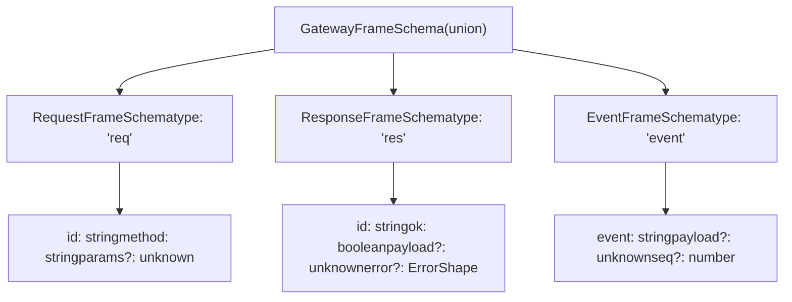
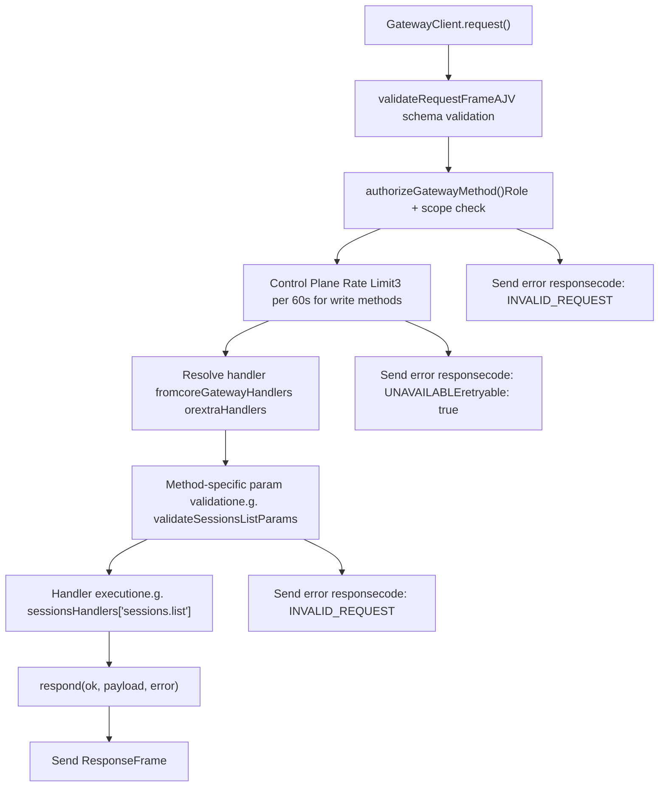
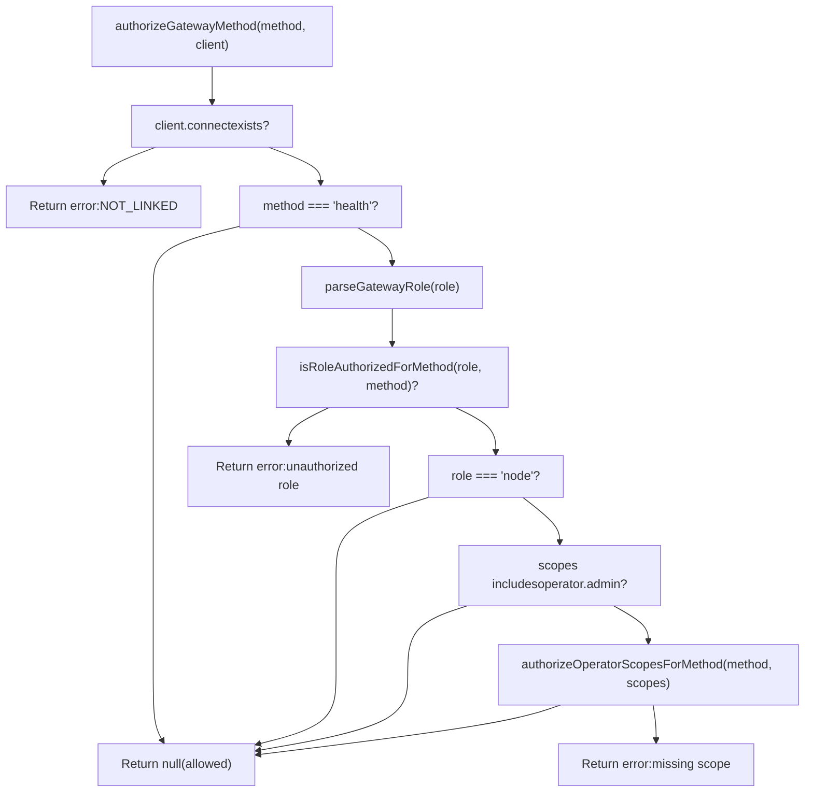
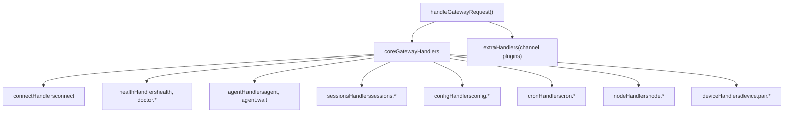
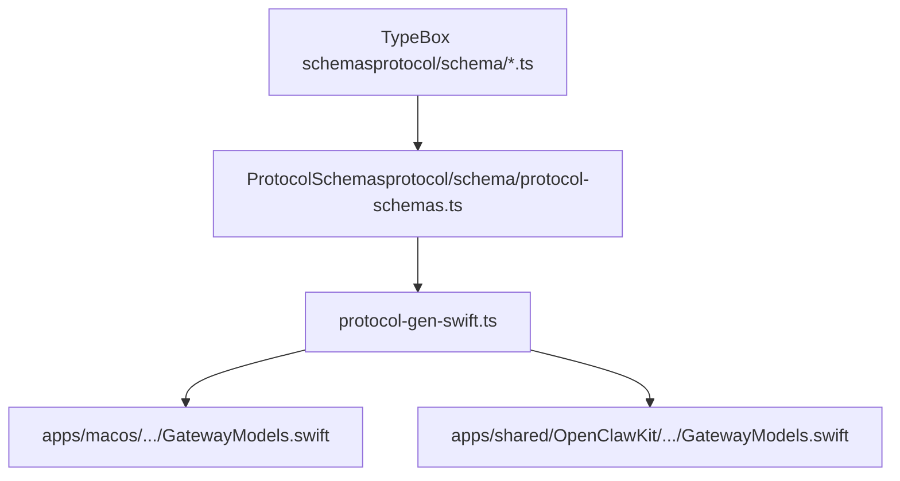

# WebSocket Protocol & RPC

Relevant source files

-   [apps/macos/Sources/OpenClawProtocol/GatewayModels.swift](https://github.com/openclaw/openclaw/blob/8873e13f/apps/macos/Sources/OpenClawProtocol/GatewayModels.swift)
-   [apps/shared/OpenClawKit/Sources/OpenClawProtocol/GatewayModels.swift](https://github.com/openclaw/openclaw/blob/8873e13f/apps/shared/OpenClawKit/Sources/OpenClawProtocol/GatewayModels.swift)
-   [docs/experiments/onboarding-config-protocol.md](https://github.com/openclaw/openclaw/blob/8873e13f/docs/experiments/onboarding-config-protocol.md)
-   [scripts/protocol-gen-swift.ts](https://github.com/openclaw/openclaw/blob/8873e13f/scripts/protocol-gen-swift.ts)
-   [src/agents/openclaw-gateway-tool.test.ts](https://github.com/openclaw/openclaw/blob/8873e13f/src/agents/openclaw-gateway-tool.test.ts)
-   [src/agents/tools/gateway-tool.ts](https://github.com/openclaw/openclaw/blob/8873e13f/src/agents/tools/gateway-tool.ts)
-   [src/config/schema.test.ts](https://github.com/openclaw/openclaw/blob/8873e13f/src/config/schema.test.ts)
-   [src/discord/monitor/thread-bindings.shared-state.test.ts](https://github.com/openclaw/openclaw/blob/8873e13f/src/discord/monitor/thread-bindings.shared-state.test.ts)
-   [src/gateway/method-scopes.test.ts](https://github.com/openclaw/openclaw/blob/8873e13f/src/gateway/method-scopes.test.ts)
-   [src/gateway/method-scopes.ts](https://github.com/openclaw/openclaw/blob/8873e13f/src/gateway/method-scopes.ts)
-   [src/gateway/protocol/index.ts](https://github.com/openclaw/openclaw/blob/8873e13f/src/gateway/protocol/index.ts)
-   [src/gateway/protocol/schema.ts](https://github.com/openclaw/openclaw/blob/8873e13f/src/gateway/protocol/schema.ts)
-   [src/gateway/protocol/schema/config.ts](https://github.com/openclaw/openclaw/blob/8873e13f/src/gateway/protocol/schema/config.ts)
-   [src/gateway/protocol/schema/protocol-schemas.ts](https://github.com/openclaw/openclaw/blob/8873e13f/src/gateway/protocol/schema/protocol-schemas.ts)
-   [src/gateway/protocol/schema/types.ts](https://github.com/openclaw/openclaw/blob/8873e13f/src/gateway/protocol/schema/types.ts)
-   [src/gateway/server-methods-list.ts](https://github.com/openclaw/openclaw/blob/8873e13f/src/gateway/server-methods-list.ts)
-   [src/gateway/server-methods.ts](https://github.com/openclaw/openclaw/blob/8873e13f/src/gateway/server-methods.ts)
-   [src/gateway/server-methods/config.ts](https://github.com/openclaw/openclaw/blob/8873e13f/src/gateway/server-methods/config.ts)
-   [src/gateway/server-methods/restart-request.ts](https://github.com/openclaw/openclaw/blob/8873e13f/src/gateway/server-methods/restart-request.ts)
-   [src/gateway/server-methods/update.ts](https://github.com/openclaw/openclaw/blob/8873e13f/src/gateway/server-methods/update.ts)
-   [src/gateway/server.config-patch.test.ts](https://github.com/openclaw/openclaw/blob/8873e13f/src/gateway/server.config-patch.test.ts)
-   [src/gateway/server.ts](https://github.com/openclaw/openclaw/blob/8873e13f/src/gateway/server.ts)

This page documents the Gateway WebSocket protocol and RPC layer: frame types, connection handshake, request/response semantics, method authorization, server-push event semantics, protocol versioning, and the complete method and event reference.

Authentication mechanisms (token, password, Tailscale, device keypairs) are covered in [Authentication & Device Pairing](/openclaw/openclaw/2.2-authentication-and-device-pairing). Gateway configuration (`openclaw.json`) is in [Configuration](/openclaw/openclaw/2.3-configuration-system). The HTTP surface (`POST /tools/invoke`) is a separate channel and is not part of this protocol.

---

## Transport

The Gateway listens on `ws://127.0.0.1:18789` by default. TLS (`wss://`) is supported for remote access. All messages are **text frames carrying UTF-8 JSON**. Binary frames are not used.

Size limits enforced server-side are defined in `src/gateway/server-constants.ts` as `MAX_PAYLOAD_BYTES` (max inbound message size) and `MAX_BUFFERED_BYTES` (max write-queue backpressure before a slow-client close). The client sets `maxPayload: 25 * 1024 * 1024` (25 MiB) to accommodate large node canvas snapshots.

Sources: [src/gateway/client.ts139-141](https://github.com/openclaw/openclaw/blob/8873e13f/src/gateway/client.ts#L139-L141) [src/gateway/server/ws-connection/message-handler.ts65](https://github.com/openclaw/openclaw/blob/8873e13f/src/gateway/server/ws-connection/message-handler.ts#L65-L65)

---

## Protocol Version

`PROTOCOL_VERSION` is exported from `src/gateway/protocol/index.ts` (currently `3`). Every `connect` request carries `minProtocol` and `maxProtocol`. The server rejects a connection when:

```
maxProtocol < PROTOCOL_VERSION  OR  minProtocol > PROTOCOL_VERSION
```
A version mismatch causes WebSocket close code `1002` with reason `"protocol mismatch"` and an error response carrying `details: { expectedProtocol: PROTOCOL_VERSION }`.

Sources: [src/gateway/protocol/index.ts159](https://github.com/openclaw/openclaw/blob/8873e13f/src/gateway/protocol/index.ts#L159-L159) [src/gateway/server/ws-connection/message-handler.ts435-450](https://github.com/openclaw/openclaw/blob/8873e13f/src/gateway/server/ws-connection/message-handler.ts#L435-L450)

---

## Frame Types

All frame schemas are defined in `src/gateway/protocol/schema/frames.ts` and re-exported through `src/gateway/protocol/schema.ts` and `src/gateway/protocol/index.ts`. Runtime AJV validators are compiled in `src/gateway/protocol/index.ts`.

**Frame type hierarchy:**


Sources: [src/gateway/protocol/schema/frames.ts1-120](https://github.com/openclaw/openclaw/blob/8873e13f/src/gateway/protocol/schema/frames.ts#L1-L120) [src/gateway/protocol/index.ts241-244](https://github.com/openclaw/openclaw/blob/8873e13f/src/gateway/protocol/index.ts#L241-L244)

| Frame | Direction | Validator | Key Fields |
| --- | --- | --- | --- |
| `RequestFrame` | Client → Server | `validateRequestFrame` | `type: "req"`, `id`, `method`, `params?` |
| `ResponseFrame` | Server → Client | `validateResponseFrame` | `type: "res"`, `id`, `ok`, `payload?`, `error?` |
| `EventFrame` | Server → Client | `validateEventFrame` | `type: "event"`, `event`, `payload?`, `seq?` |

Sources: [src/gateway/protocol/index.ts241-244](https://github.com/openclaw/openclaw/blob/8873e13f/src/gateway/protocol/index.ts#L241-L244)

---

## Connection Handshake

The first message a client sends **must** be a `connect` request. Before the client can send that request, the server emits a `connect.challenge` event. The `nonce` from that event must be included in the `connect` request (and in the device signature if device auth is used).

**Handshake sequence:**

Sources: [src/gateway/client.ts356-368](https://github.com/openclaw/openclaw/blob/8873e13f/src/gateway/client.ts#L356-L368) [src/gateway/server/ws-connection/message-handler.ts364-406](https://github.com/openclaw/openclaw/blob/8873e13f/src/gateway/server/ws-connection/message-handler.ts#L364-L406)

If the first message is not a valid `connect` request, the server responds with an error and closes the connection with code `1008`.

### connect.challenge

Sent by the server immediately after the socket opens, before any client message arrives:

```
{  "type": "event",  "event": "connect.challenge",  "payload": { "nonce": "<uuid>", "ts": 1737264000000 }}
```
The `nonce` must be included verbatim as `device.nonce` in `ConnectParams`, and it must be incorporated into the device signature payload. The server enforces a clock-skew tolerance of 2 minutes (`DEVICE_SIGNATURE_SKEW_MS`). A missing or mismatched nonce returns a structured error with detail codes from `ConnectErrorDetailCodes`.

Sources: [src/gateway/server/ws-connection/message-handler.ts91](https://github.com/openclaw/openclaw/blob/8873e13f/src/gateway/server/ws-connection/message-handler.ts#L91-L91) [src/gateway/server/ws-connection/message-handler.ts654-676](https://github.com/openclaw/openclaw/blob/8873e13f/src/gateway/server/ws-connection/message-handler.ts#L654-L676)

### ConnectParams

The `connect` method's parameter schema is `ConnectParamsSchema` in `src/gateway/protocol/schema/frames.ts`. The client builds and sends this via `GatewayClient.sendConnect()`.

| Field | Type | Notes |
| --- | --- | --- |
| `minProtocol` | `number` | Minimum protocol version the client supports |
| `maxProtocol` | `number` | Maximum protocol version the client supports |
| `client.id` | `string` | Well-known client identifier (e.g. `"cli"`, `"control-ui"`, `"node-host"`) |
| `client.version` | `string` | Client software version |
| `client.platform` | `string` | OS platform string (e.g. `"macos"`, `"ios"`, `"linux"`) |
| `client.mode` | `string` | Operational mode (e.g. `"cli"`, `"webchat"`, `"node"`) |
| `client.displayName?` | `string` | Human-readable name shown in presence list |
| `client.instanceId?` | `string` | Unique instance UUID for presence tracking |
| `role` | `"operator"` | `"node"` | Requested connection role |
| `scopes` | `string[]` | Requested operator scopes (e.g. `["operator.admin"]`) |
| `caps` | `string[]` | Declared client capabilities |
| `commands?` | `string[]` | Node role only: declared executable command names |
| `auth?` | `object` | `{ token?, deviceToken?, password? }` |
| `device?` | `object` | `{ id, publicKey, signature, signedAt, nonce }` — device keypair identity |
| `permissions?` | `object` | Capability key/boolean map |
| `pathEnv?` | `string` | PATH override (node role) |

Sources: [src/gateway/client.ts266-318](https://github.com/openclaw/openclaw/blob/8873e13f/src/gateway/client.ts#L266-L318) [src/gateway/server/ws-connection/message-handler.ts408-466](https://github.com/openclaw/openclaw/blob/8873e13f/src/gateway/server/ws-connection/message-handler.ts#L408-L466)

### HelloOk Response

On a successful `connect`, the server responds with `ok: true` and a `HelloOk` payload (`HelloOkSchema`):

```
{  "type": "res",  "id": "<connect-request-id>",  "ok": true,  "payload": {    "type": "hello-ok",    "server": { "version": "1.2.3" },    "snapshot": { "configPath": "/...", "stateDir": "/...", "presence": [...] },    "auth": { "deviceToken": "...", "role": "operator", "scopes": ["operator.admin"] },    "policy": { "tickIntervalMs": 30000 },    "methods": ["health", "status", ...],    "events": ["connect.challenge", "agent", ...],    "caps": []  }}
```
| Field | Description |
| --- | --- |
| `server.version` | Gateway software version string |
| `snapshot` | Initial state snapshot — `SnapshotSchema` (presence, config path, state dir) |
| `auth.deviceToken` | Issued per-device token; stored by `GatewayClient` via `storeDeviceAuthToken` for future reconnects |
| `auth.role` / `auth.scopes` | Confirmed role and scopes for this connection |
| `policy.tickIntervalMs` | Interval between `tick` events; used to configure the tick watchdog |
| `methods` | RPC methods available on this connection |
| `events` | Server-push events that may be received |

Sources: [src/gateway/client.ts321-338](https://github.com/openclaw/openclaw/blob/8873e13f/src/gateway/client.ts#L321-L338) [docs/gateway/protocol.md69-100](https://github.com/openclaw/openclaw/blob/8873e13f/docs/gateway/protocol.md#L69-L100)

---

## RPC Architecture

### Request / Response Flow

Every RPC call uses a `RequestFrame` with a caller-generated UUID `id`. The server sends back a matching `ResponseFrame`. The full request lifecycle includes validation, authorization, rate limiting, handler dispatch, and response serialization.

**RPC request processing pipeline:**


Sources: [src/gateway/server-methods.ts98-155](https://github.com/openclaw/openclaw/blob/8873e13f/src/gateway/server-methods.ts#L98-L155) [src/gateway/server/ws-connection/message-handler.ts236-262](https://github.com/openclaw/openclaw/blob/8873e13f/src/gateway/server/ws-connection/message-handler.ts#L236-L262)

**Client-side request tracking:**

```
// Request{ "type": "req", "id": "550e8400-e29b-41d4-a716-446655440000", "method": "sessions.list", "params": {} } // Success{ "type": "res", "id": "550e8400-e29b-41d4-a716-446655440000", "ok": true, "payload": { "sessions": [...] } } // Failure{ "type": "res", "id": "550e8400-e29b-41d4-a716-446655440000", "ok": false, "error": { "code": "INVALID_REQUEST", "message": "missing scope: operator.read" } }
```
`GatewayClient` maintains a `pending` map keyed by request `id`. When a `ResponseFrame` arrives, the corresponding `Promise` is resolved or rejected.

Sources: [src/gateway/client.ts496-520](https://github.com/openclaw/openclaw/blob/8873e13f/src/gateway/client.ts#L496-L520)

### Method Authorization

All RPC methods (except `health` and `connect`) require authorization based on the connection's `role` and `scopes`. The `authorizeGatewayMethod()` function enforces these rules before handler dispatch.

**Authorization flow:**


Sources: [src/gateway/server-methods.ts38-65](https://github.com/openclaw/openclaw/blob/8873e13f/src/gateway/server-methods.ts#L38-L65) [src/gateway/method-scopes.ts187-205](https://github.com/openclaw/openclaw/blob/8873e13f/src/gateway/method-scopes.ts#L187-L205)

**Role and scope hierarchy:**

| Role | Scope | Methods Allowed |
| --- | --- | --- |
| `operator` | `operator.admin` | All methods |
| `operator` | `operator.read` | Read-only methods (e.g., `health`, `sessions.list`, `config.get`) |
| `operator` | `operator.write` | Write methods (e.g., `send`, `agent`, `chat.send`) |
| `operator` | `operator.approvals` | Exec approval methods (e.g., `exec.approval.resolve`) |
| `operator` | `operator.pairing` | Device/node pairing methods (e.g., `node.pair.approve`) |
| `node` | N/A | Node-specific methods (e.g., `node.invoke.result`, `node.event`) |

The scope classification is defined in `METHOD_SCOPE_GROUPS` and `ADMIN_METHOD_PREFIXES` in `src/gateway/method-scopes.ts`. Methods prefixed with `config.`, `wizard.`, `update.`, or `exec.approvals.` automatically require `operator.admin`.

Sources: [src/gateway/method-scopes.ts29-148](https://github.com/openclaw/openclaw/blob/8873e13f/src/gateway/method-scopes.ts#L29-L148)

### Rate Limiting

Control plane write methods (`config.apply`, `config.patch`, `update.run`) are rate-limited to prevent abuse. The `CONTROL_PLANE_WRITE_METHODS` set in `src/gateway/server-methods.ts` defines which methods are subject to the limit. The rate limit is 3 requests per 60 seconds per client, enforced by `consumeControlPlaneWriteBudget()`.

When rate-limited, the server returns an error with:

-   `code: "UNAVAILABLE"`
-   `retryable: true`
-   `retryAfterMs: <milliseconds until limit resets>`

Sources: [src/gateway/server-methods.ts37-132](https://github.com/openclaw/openclaw/blob/8873e13f/src/gateway/server-methods.ts#L37-L132)

### Handler Dispatch

RPC method handlers are organized by subsystem in `src/gateway/server-methods/*.ts` and aggregated in `coreGatewayHandlers`. Channel plugins can inject additional handlers via `extraHandlers`. The `handleGatewayRequest()` function resolves the handler from these sources and invokes it within a plugin runtime request scope.

**Handler organization:**


Sources: [src/gateway/server-methods.ts67-96](https://github.com/openclaw/openclaw/blob/8873e13f/src/gateway/server-methods.ts#L67-L96) [src/gateway/server-methods.ts98-155](https://github.com/openclaw/openclaw/blob/8873e13f/src/gateway/server-methods.ts#L98-L155)

### Param Validation

Each RPC method has a dedicated Zod-based validator compiled with AJV (e.g., `validateSessionsListParams`, `validateConfigApplyParams`). These validators are defined in `src/gateway/protocol/index.ts` and referenced by handlers. Invalid params result in a response with `code: "INVALID_REQUEST"` and a formatted validation error message.

Sources: [src/gateway/protocol/index.ts249-402](https://github.com/openclaw/openclaw/blob/8873e13f/src/gateway/protocol/index.ts#L249-L402) [src/gateway/protocol/index.ts404-438](https://github.com/openclaw/openclaw/blob/8873e13f/src/gateway/protocol/index.ts#L404-L438)

### Accepted / Final Pattern

Some long-running operations (e.g., agent runs) return an intermediate acknowledgement before the final result. Callers signal this with `expectFinal: true` in `GatewayClient.request()`.

```
// Intermediate ack — caller keeps waiting{ "type": "res", "id": "...", "ok": true, "payload": { "status": "accepted" } } // Final response — caller resolves{ "type": "res", "id": "...", "ok": true, "payload": { <final result> } }
```
Sources: [src/gateway/client.ts388-393](https://github.com/openclaw/openclaw/blob/8873e13f/src/gateway/client.ts#L388-L393) [src/gateway/client.ts510-511](https://github.com/openclaw/openclaw/blob/8873e13f/src/gateway/client.ts#L510-L511)

---

## Event Semantics

`EventFrame` messages are server-pushed and not tied to any request. Events carry a monotonically increasing `seq` integer. `GatewayClient` tracks `lastSeq` and fires the `onGap` callback when a gap is detected between consecutive sequence numbers.

```
{ "type": "event", "event": "agent", "seq": 42, "payload": { ... } }
```
The `tick` event is a mandatory heartbeat. `GatewayClient.startTickWatch()` closes the socket with code `4000` (`"tick timeout"`) if no tick is received within `tickIntervalMs × 2`. The `tickIntervalMs` value is set from `HelloOk.policy.tickIntervalMs`.

Sources: [src/gateway/client.ts369-380](https://github.com/openclaw/openclaw/blob/8873e13f/src/gateway/client.ts#L369-L380) [src/gateway/client.ts445-467](https://github.com/openclaw/openclaw/blob/8873e13f/src/gateway/client.ts#L445-L467)

---

## Error Shape

All error responses carry an `ErrorShape` (`ErrorShapeSchema`):

```
{  "code": "INVALID_REQUEST",  "message": "device nonce mismatch",  "details": { "code": "DEVICE_AUTH_NONCE_MISMATCH", "reason": "device-nonce-mismatch" }}
```
`errorShape()` is a factory function exported from `src/gateway/protocol/index.ts` for constructing these objects server-side.

| `ErrorCodes` value | When used |
| --- | --- |
| `INVALID_REQUEST` | Malformed request, auth failure, unknown method, scope check failure |
| `NOT_PAIRED` | Device identity required but device is not paired |
| `UNAVAILABLE` | Rate limit exceeded or service temporarily unavailable |

Sources: [src/gateway/protocol/index.ts515-516](https://github.com/openclaw/openclaw/blob/8873e13f/src/gateway/protocol/index.ts#L515-L516) [src/gateway/server/ws-connection/message-handler.ts374-404](https://github.com/openclaw/openclaw/blob/8873e13f/src/gateway/server/ws-connection/message-handler.ts#L374-L404)

---

## WebSocket Close Codes

| Code | Meaning |
| --- | --- |
| `1000` | Normal closure |
| `1002` | Protocol version mismatch |
| `1006` | Abnormal closure (no close frame — network drop) |
| `1008` | Policy violation (auth failure, invalid handshake) |
| `1012` | Service restart |
| `4000` | Tick heartbeat timeout (client-side watchdog) |

Sources: [src/gateway/client.ts74-79](https://github.com/openclaw/openclaw/blob/8873e13f/src/gateway/client.ts#L74-L79) [src/gateway/server/ws-connection/message-handler.ts447-448](https://github.com/openclaw/openclaw/blob/8873e13f/src/gateway/server/ws-connection/message-handler.ts#L447-L448)

---

## Method Reference

Methods are assembled in `coreGatewayHandlers` in `src/gateway/server-methods.ts` and dispatched by `handleGatewayRequest()`. Channel plugins can inject additional methods via `extraHandlers`. The full base method list is `BASE_METHODS` in `src/gateway/server-methods-list.ts`.

**Handler modules and exported method groups:**

| Handler Module | Exported Constant | Methods |
| --- | --- | --- |
| `server-methods/connect.ts` | `connectHandlers` | `connect` |
| `server-methods/health.ts` | `healthHandlers` | `health` |
| `server-methods/agent.ts` | `agentHandlers` | `agent`, `agent.identity.get`, `agent.wait` |
| `server-methods/agents.ts` | `agentsHandlers` | `agents.list`, `agents.create`, `agents.update`, `agents.delete`, `agents.files.*` |
| `server-methods/chat.ts` | `chatHandlers` | `chat.history`, `chat.send`, `chat.abort`, `chat.inject` |
| `server-methods/sessions.ts` | `sessionsHandlers` | `sessions.list`, `sessions.patch`, `sessions.reset`, `sessions.delete`, `sessions.compact`, `sessions.preview`, `sessions.resolve`, `sessions.usage` |
| `server-methods/config.ts` | `configHandlers` | `config.get`, `config.set`, `config.apply`, `config.patch`, `config.schema`, `config.schema.lookup` |
| `server-methods/cron.ts` | `cronHandlers` | `cron.list`, `cron.status`, `cron.add`, `cron.update`, `cron.remove`, `cron.run`, `cron.runs` |
| `server-methods/nodes.ts` | `nodeHandlers` | `node.pair.*`, `node.rename`, `node.list`, `node.describe`, `node.invoke`, `node.invoke.result`, `node.event` |
| `server-methods/devices.ts` | `deviceHandlers` | `device.pair.*`, `device.token.*` |
| `server-methods/exec-approvals.ts` | `execApprovalsHandlers` | `exec.approvals.*`, `exec.approval.request`, `exec.approval.resolve` |
| `server-methods/skills.ts` | `skillsHandlers` | `skills.status`, `skills.bins`, `skills.install`, `skills.update` |
| `server-methods/models.ts` | `modelsHandlers` | `models.list` |
| `server-methods/send.ts` | `sendHandlers` | `send`, `poll` |
| `server-methods/update.ts` | `updateHandlers` | `update.run` |
| `server-methods/wizard.ts` | `wizardHandlers` | `wizard.start`, `wizard.next`, `wizard.cancel`, `wizard.status` |

Sources: [src/gateway/server-methods.ts7-95](https://github.com/openclaw/openclaw/blob/8873e13f/src/gateway/server-methods.ts#L7-L95) [src/gateway/server-methods-list.ts4-101](https://github.com/openclaw/openclaw/blob/8873e13f/src/gateway/server-methods-list.ts#L4-L101)

### System & Health

| Method | Description |
| --- | --- |
| `health` | Liveness check — no scope required |
| `status` | Gateway and agent status |
| `usage.status` | Token usage summary |
| `usage.cost` | Cost breakdown |
| `doctor.memory.status` | Memory subsystem diagnostics |
| `logs.tail` | Stream recent log entries |
| `secrets.reload` | Hot-reload secret references |
| `update.run` | Trigger a software update check |

### Agent

| Method | Description |
| --- | --- |
| `agent` | Run an agent turn |
| `agent.identity.get` | Get the agent's identity info |
| `agent.wait` | Wait for an in-progress agent run to complete |
| `send` | Send a message to an agent (non-streaming) |
| `wake` | Trigger an agent wake (heartbeat / cron) |
| `last-heartbeat` | Get the last heartbeat timestamp |
| `set-heartbeats` | Configure heartbeat schedule |

### Chat (WebChat / Control UI)

| Method | Description |
| --- | --- |
| `chat.history` | Retrieve chat transcript |
| `chat.send` | Send a chat message |
| `chat.abort` | Abort an in-progress streaming response |

### Sessions

| Method | Description |
| --- | --- |
| `sessions.list` | List sessions |
| `sessions.preview` | Preview a session transcript |
| `sessions.patch` | Update session metadata |
| `sessions.reset` | Reset (clear) a session |
| `sessions.delete` | Delete a session and its transcript |
| `sessions.compact` | Compact session context manually |

### Configuration

| Method | Description | Required Scope |
| --- | --- | --- |
| `config.get` | Read the current configuration snapshot (redacted) | `operator.read` |
| `config.set` | Overwrite the configuration (requires baseHash) | `operator.admin` |
| `config.apply` | Apply configuration from raw JSON5, then schedule restart | `operator.admin` |
| `config.patch` | Merge-patch specific configuration fields, then schedule restart | `operator.admin` |
| `config.schema` | Retrieve the config schema with UI hints and tags | `operator.admin` |
| `config.schema.lookup` | Look up a specific config path with child summaries | `operator.read` |

The `config.apply` and `config.patch` methods write the config file, then call `scheduleGatewaySigusr1Restart()` to trigger a gateway restart. They accept optional `sessionKey`, `note`, and `restartDelayMs` params to control restart behavior and post-restart message delivery. Both methods require a `baseHash` param (obtained from `config.get`) to prevent concurrent write conflicts. The `config.patch` method uses `applyMergePatch()` to merge changes into the existing config, while `config.apply` replaces the entire config.

Sources: [src/gateway/server-methods/config.ts262-513](https://github.com/openclaw/openclaw/blob/8873e13f/src/gateway/server-methods/config.ts#L262-L513)

### Cron

| Method | Description |
| --- | --- |
| `cron.list` | List scheduled jobs |
| `cron.status` | Get cron service status |
| `cron.add` | Create a new cron job |
| `cron.update` | Update an existing cron job |
| `cron.remove` | Delete a cron job |
| `cron.run` | Immediately trigger a cron job |
| `cron.runs` | Retrieve run history for a job |

### Nodes

| Method | Description |
| --- | --- |
| `node.pair.request` | Initiate a node pairing |
| `node.pair.list` | List node pairings |
| `node.pair.approve` / `reject` / `verify` | Manage node pairings |
| `node.rename` | Rename a paired node |
| `node.list` | List connected nodes |
| `node.describe` | Describe node capabilities |
| `node.invoke` | Invoke a command on a node |
| `node.invoke.result` | Report the result of a node invocation (node role) |
| `node.event` | Deliver an event from a node (node role) |
| `node.canvas.capability.refresh` | Refresh a Canvas capability token |

### Devices

| Method | Description |
| --- | --- |
| `device.pair.list` | List device pairings |
| `device.pair.approve` / `reject` / `remove` | Manage device pairings |
| `device.token.rotate` | Rotate a device auth token |
| `device.token.revoke` | Revoke a device auth token |

### Exec Approvals

| Method | Description |
| --- | --- |
| `exec.approvals.get` / `.set` | Get/set gateway exec approval policy |
| `exec.approvals.node.get` / `.set` | Get/set node exec approval policy |
| `exec.approval.request` | Request an exec approval |
| `exec.approval.waitDecision` | Long-poll for approval decision |
| `exec.approval.resolve` | Resolve an approval request |

### Agents Management

| Method | Description |
| --- | --- |
| `agents.list` | List configured agents |
| `agents.create` / `update` / `delete` | Manage agent definitions |
| `agents.files.list` / `get` / `set` | Read and write agent workspace files |

### Other

| Method | Description |
| --- | --- |
| `channels.status` / `channels.logout` | Channel integration status and logout |
| `models.list` | List available AI models |
| `skills.status` / `bins` / `install` / `update` | Skill management |
| `tools.catalog` | List available agent tools |
| `wizard.start` / `next` / `cancel` / `status` | Interactive onboarding wizard |
| `talk.config` / `talk.mode` | Voice talk mode configuration |
| `tts.*` | Text-to-speech provider controls |
| `voicewake.get` / `.set` | Voice wake-word configuration |
| `push.test` | Test push notification delivery |
| `browser.request` | Browser automation control |
| `system-presence` / `system-event` | Internal system presence and event delivery |

Sources: [src/gateway/server-methods-list.ts4-103](https://github.com/openclaw/openclaw/blob/8873e13f/src/gateway/server-methods-list.ts#L4-L103)

---

## Event Reference

Server-push events are declared in `GATEWAY_EVENTS` in `src/gateway/server-methods-list.ts`. The payload schemas are in `src/gateway/protocol/schema/`.

| Event | Schema | Description |
| --- | --- | --- |
| `connect.challenge` | — | Nonce challenge sent on socket open (before `connect`) |
| `tick` | `TickEventSchema` | Periodic heartbeat carrying a timestamp |
| `shutdown` | `ShutdownEventSchema` | Gateway is shutting down |
| `agent` | `AgentEventSchema` | Streaming agent reply fragment or run status update |
| `chat` | `ChatEventSchema` | Chat transcript update pushed to webchat clients |
| `presence` | `PresenceEntrySchema` | Connected client presence list update |
| `health` | — | Health snapshot push |
| `heartbeat` | — | Agent heartbeat tick |
| `cron` | — | Cron job run status update |
| `talk.mode` | — | Voice talk mode state change |
| `node.pair.requested` | — | A node pairing request has been initiated |
| `node.pair.resolved` | — | A node pairing request was approved or rejected |
| `node.invoke.request` | — | A command invocation has been dispatched to a node |
| `device.pair.requested` | — | A device pairing request has been initiated |
| `device.pair.resolved` | — | A device pairing request was approved or rejected |

Sources: [src/gateway/server-methods-list.ts106-140](https://github.com/openclaw/openclaw/blob/8873e13f/src/gateway/server-methods-list.ts#L106-L140)

---

## Protocol Schema Generation

`ProtocolSchemas` (a named map of all TypeBox schemas) is exported from `src/gateway/protocol/index.ts`. The script `scripts/protocol-gen-swift.ts` reads `ProtocolSchemas`, `PROTOCOL_VERSION`, and `ErrorCodes` from the compiled gateway module and emits `GatewayModels.swift` for both the macOS and iOS native clients, keeping Swift types in sync with TypeScript schema definitions.

**Schema generation pipeline:**


Sources: [scripts/protocol-gen-swift.ts1-5](https://github.com/openclaw/openclaw/blob/8873e13f/scripts/protocol-gen-swift.ts#L1-L5) [src/gateway/protocol/schema/protocol-schemas.ts1-50](https://github.com/openclaw/openclaw/blob/8873e13f/src/gateway/protocol/schema/protocol-schemas.ts#L1-L50)
