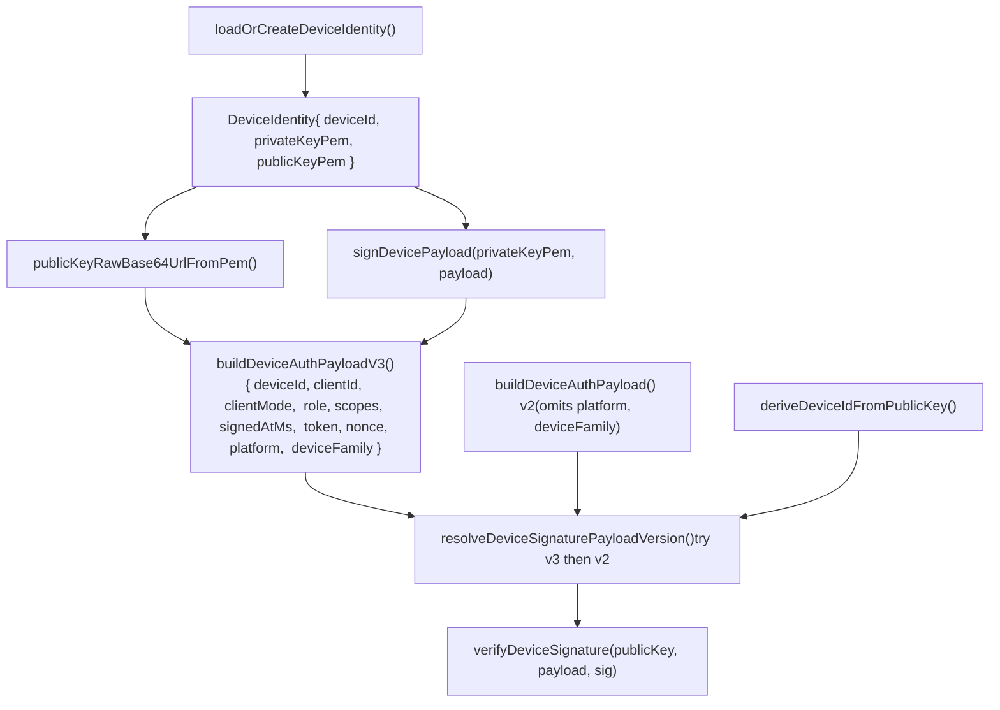
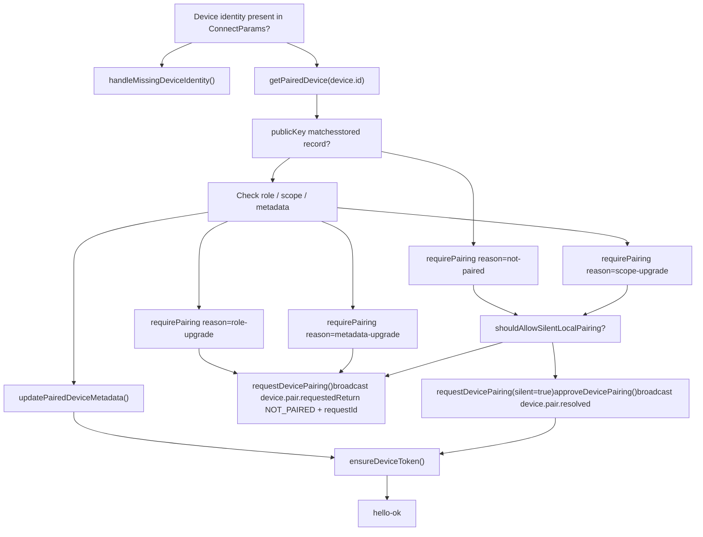

# Authentication & Device Pairing

Relevant source files

-   [CHANGELOG.md](https://github.com/openclaw/openclaw/blob/8873e13f/CHANGELOG.md)
-   [README.md](https://github.com/openclaw/openclaw/blob/8873e13f/README.md)
-   [apps/android/app/build.gradle.kts](https://github.com/openclaw/openclaw/blob/8873e13f/apps/android/app/build.gradle.kts)
-   [apps/ios/Sources/Info.plist](https://github.com/openclaw/openclaw/blob/8873e13f/apps/ios/Sources/Info.plist)
-   [apps/ios/Tests/Info.plist](https://github.com/openclaw/openclaw/blob/8873e13f/apps/ios/Tests/Info.plist)
-   [apps/ios/project.yml](https://github.com/openclaw/openclaw/blob/8873e13f/apps/ios/project.yml)
-   [apps/macos/Sources/OpenClaw/Resources/Info.plist](https://github.com/openclaw/openclaw/blob/8873e13f/apps/macos/Sources/OpenClaw/Resources/Info.plist)
-   [apps/macos/Sources/OpenClawProtocol/GatewayModels.swift](https://github.com/openclaw/openclaw/blob/8873e13f/apps/macos/Sources/OpenClawProtocol/GatewayModels.swift)
-   [apps/shared/OpenClawKit/Sources/OpenClawProtocol/GatewayModels.swift](https://github.com/openclaw/openclaw/blob/8873e13f/apps/shared/OpenClawKit/Sources/OpenClawProtocol/GatewayModels.swift)
-   [assets/avatar-placeholder.svg](https://github.com/openclaw/openclaw/blob/8873e13f/assets/avatar-placeholder.svg)
-   [docs/cli/index.md](https://github.com/openclaw/openclaw/blob/8873e13f/docs/cli/index.md)
-   [docs/experiments/onboarding-config-protocol.md](https://github.com/openclaw/openclaw/blob/8873e13f/docs/experiments/onboarding-config-protocol.md)
-   [docs/gateway/configuration.md](https://github.com/openclaw/openclaw/blob/8873e13f/docs/gateway/configuration.md)
-   [docs/gateway/index.md](https://github.com/openclaw/openclaw/blob/8873e13f/docs/gateway/index.md)
-   [docs/gateway/troubleshooting.md](https://github.com/openclaw/openclaw/blob/8873e13f/docs/gateway/troubleshooting.md)
-   [docs/index.md](https://github.com/openclaw/openclaw/blob/8873e13f/docs/index.md)
-   [docs/platforms/mac/release.md](https://github.com/openclaw/openclaw/blob/8873e13f/docs/platforms/mac/release.md)
-   [docs/start/getting-started.md](https://github.com/openclaw/openclaw/blob/8873e13f/docs/start/getting-started.md)
-   [docs/start/wizard.md](https://github.com/openclaw/openclaw/blob/8873e13f/docs/start/wizard.md)
-   [extensions/bluebubbles/src/send-helpers.ts](https://github.com/openclaw/openclaw/blob/8873e13f/extensions/bluebubbles/src/send-helpers.ts)
-   [package.json](https://github.com/openclaw/openclaw/blob/8873e13f/package.json)
-   [pnpm-lock.yaml](https://github.com/openclaw/openclaw/blob/8873e13f/pnpm-lock.yaml)
-   [scripts/clawtributors-map.json](https://github.com/openclaw/openclaw/blob/8873e13f/scripts/clawtributors-map.json)
-   [scripts/protocol-gen-swift.ts](https://github.com/openclaw/openclaw/blob/8873e13f/scripts/protocol-gen-swift.ts)
-   [scripts/update-clawtributors.ts](https://github.com/openclaw/openclaw/blob/8873e13f/scripts/update-clawtributors.ts)
-   [scripts/update-clawtributors.types.ts](https://github.com/openclaw/openclaw/blob/8873e13f/scripts/update-clawtributors.types.ts)
-   [src/agents/openclaw-gateway-tool.test.ts](https://github.com/openclaw/openclaw/blob/8873e13f/src/agents/openclaw-gateway-tool.test.ts)
-   [src/agents/subagent-registry-cleanup.test.ts](https://github.com/openclaw/openclaw/blob/8873e13f/src/agents/subagent-registry-cleanup.test.ts)
-   [src/agents/tools/gateway-tool.ts](https://github.com/openclaw/openclaw/blob/8873e13f/src/agents/tools/gateway-tool.ts)
-   [src/cli/program.ts](https://github.com/openclaw/openclaw/blob/8873e13f/src/cli/program.ts)
-   [src/config/config.ts](https://github.com/openclaw/openclaw/blob/8873e13f/src/config/config.ts)
-   [src/config/schema.test.ts](https://github.com/openclaw/openclaw/blob/8873e13f/src/config/schema.test.ts)
-   [src/config/types.ts](https://github.com/openclaw/openclaw/blob/8873e13f/src/config/types.ts)
-   [src/config/zod-schema.ts](https://github.com/openclaw/openclaw/blob/8873e13f/src/config/zod-schema.ts)
-   [src/discord/monitor/thread-bindings.shared-state.test.ts](https://github.com/openclaw/openclaw/blob/8873e13f/src/discord/monitor/thread-bindings.shared-state.test.ts)
-   [src/gateway/method-scopes.test.ts](https://github.com/openclaw/openclaw/blob/8873e13f/src/gateway/method-scopes.test.ts)
-   [src/gateway/method-scopes.ts](https://github.com/openclaw/openclaw/blob/8873e13f/src/gateway/method-scopes.ts)
-   [src/gateway/protocol/index.ts](https://github.com/openclaw/openclaw/blob/8873e13f/src/gateway/protocol/index.ts)
-   [src/gateway/protocol/schema.ts](https://github.com/openclaw/openclaw/blob/8873e13f/src/gateway/protocol/schema.ts)
-   [src/gateway/protocol/schema/config.ts](https://github.com/openclaw/openclaw/blob/8873e13f/src/gateway/protocol/schema/config.ts)
-   [src/gateway/protocol/schema/protocol-schemas.ts](https://github.com/openclaw/openclaw/blob/8873e13f/src/gateway/protocol/schema/protocol-schemas.ts)
-   [src/gateway/protocol/schema/types.ts](https://github.com/openclaw/openclaw/blob/8873e13f/src/gateway/protocol/schema/types.ts)
-   [src/gateway/server-methods-list.ts](https://github.com/openclaw/openclaw/blob/8873e13f/src/gateway/server-methods-list.ts)
-   [src/gateway/server-methods.ts](https://github.com/openclaw/openclaw/blob/8873e13f/src/gateway/server-methods.ts)
-   [src/gateway/server-methods/config.ts](https://github.com/openclaw/openclaw/blob/8873e13f/src/gateway/server-methods/config.ts)
-   [src/gateway/server-methods/restart-request.ts](https://github.com/openclaw/openclaw/blob/8873e13f/src/gateway/server-methods/restart-request.ts)
-   [src/gateway/server-methods/update.ts](https://github.com/openclaw/openclaw/blob/8873e13f/src/gateway/server-methods/update.ts)
-   [src/gateway/server.config-patch.test.ts](https://github.com/openclaw/openclaw/blob/8873e13f/src/gateway/server.config-patch.test.ts)
-   [src/gateway/server.ts](https://github.com/openclaw/openclaw/blob/8873e13f/src/gateway/server.ts)
-   [ui/package.json](https://github.com/openclaw/openclaw/blob/8873e13f/ui/package.json)

This page covers the Gateway's authentication system, the cryptographic device identity mechanism, the device pairing approval workflow, and the role/scope permission model.

For the WebSocket frame structures that wrap the connect handshake, see [WebSocket Protocol](/openclaw/openclaw/2.1-websocket-protocol-and-rpc). For configuring `gateway.auth` fields in `openclaw.json`, see [Configuration](/openclaw/openclaw/2.3-configuration-system). For how native node apps use the pairing mechanism, see [Native Clients (Nodes)](/openclaw/openclaw/6-native-clients-(nodes)).

---

## Authentication Modes

At startup, the gateway resolves a single `ResolvedGatewayAuth` object from config and environment. Every subsequent auth check reads from this object.

**Defined in:** `src/gateway/auth.ts` — `ResolvedGatewayAuth` type [\`src/gateway/auth.ts30-37](https://github.com/openclaw/openclaw/blob/8873e13f/`src/gateway/auth.ts#L30-L37)

| Mode (`ResolvedGatewayAuthMode`) | Credential | Typical use |
| --- | --- | --- |
| `"token"` | Shared secret string; `OPENCLAW_GATEWAY_TOKEN` env or `gateway.auth.token` | Default |
| `"password"` | Gateway password; `gateway.auth.password` | Alternative to token |
| `"trusted-proxy"` | Identity injected via HTTP header by a reverse proxy | SSO / Tailscale Serve |
| `"none"` | No credential required | Loopback-only, development |

Tailscale peer authentication is a separate overlay controlled by `allowTailscale: boolean` on `ResolvedGatewayAuth`. It is only available on the WS Control UI surface (`authorizeWsControlUiGatewayConnect`), not HTTP.

The `GatewayAuthResult.method` field reports how auth actually resolved:

```
"none" | "token" | "password" | "tailscale" | "device-token" | "trusted-proxy"
```
**Auth surface functions** [\`src/gateway/auth.ts\`](https://github.com/openclaw/openclaw/blob/8873e13f/`src/gateway/auth.ts`):

| Function | Surface |
| --- | --- |
| `resolveGatewayAuth` | Resolves `ResolvedGatewayAuth` from config/env at startup |
| `authorizeGatewayConnect` | Core shared-secret check used internally |
| `authorizeHttpGatewayConnect` | Used by `POST /tools/invoke` |
| `authorizeWsControlUiGatewayConnect` | WS variant; enables Tailscale header auth |

Sources: [\`src/gateway/auth.ts1-47](https://github.com/openclaw/openclaw/blob/8873e13f/`src/gateway/auth.ts#L1-L47) [\`src/gateway/auth.test.ts1-50](https://github.com/openclaw/openclaw/blob/8873e13f/`src/gateway/auth.test.ts#L1-L50)

---

## The Connect Handshake

Every WebSocket client must complete a `connect` handshake as its first message. The handshake:

1.  Binds the client to a server-issued nonce (replay-attack prevention)
2.  Validates credentials (shared token, password, or device token)
3.  Validates device identity (Ed25519 keypair signature)
4.  Verifies or initiates device pairing

**Connect Handshake Sequence**

> **[Mermaid sequence]**
> *(图表结构无法解析)*

Sources: [\`src/gateway/server/ws-connection/message-handler.ts335-970](https://github.com/openclaw/openclaw/blob/8873e13f/`src/gateway/server/ws-connection/message-handler.ts#L335-L970) [\`src/gateway/test-helpers.server.ts254-274](https://github.com/openclaw/openclaw/blob/8873e13f/`src/gateway/test-helpers.server.ts#L254-L274)

### connect.challenge Event

Immediately on WebSocket open — before the client sends anything — the server emits a `connect.challenge` EventFrame:

```
{ "type": "event", "event": "connect.challenge", "payload": { "nonce": "<uuid>" } }
```
The nonce is per-connection and must be included in the device's cryptographic signature. A missing or blank nonce returns error detail code `DEVICE_AUTH_NONCE_REQUIRED`; a nonce that does not match the challenge returns `DEVICE_AUTH_NONCE_MISMATCH`.

Sources: [\`src/gateway/server.auth.test.ts564-576](https://github.com/openclaw/openclaw/blob/8873e13f/`src/gateway/server.auth.test.ts#L564-L576) [\`src/gateway/server/ws-connection/message-handler.ts654-662](https://github.com/openclaw/openclaw/blob/8873e13f/`src/gateway/server/ws-connection/message-handler.ts#L654-L662)

### ConnectParams Structure

The client sends a request frame `{ type: "req", method: "connect", params: ConnectParams }`. Key fields:

| Field | Type | Notes |
| --- | --- | --- |
| `minProtocol` / `maxProtocol` | `number` | Must bracket the server's `PROTOCOL_VERSION` |
| `client.id` | `string` | From `GATEWAY_CLIENT_IDS` / `GATEWAY_CLIENT_NAMES` |
| `client.mode` | `GatewayClientMode` | `"cli"`, `"node"`, `"webchat"`, etc. |
| `client.platform` | `string?` | Pinned after first approved pairing |
| `client.deviceFamily` | `string?` | Pinned after first approved pairing |
| `auth.token` | `string?` | Shared gateway token or device token |
| `auth.deviceToken` | `string?` | Explicit device token |
| `auth.password` | `string?` | Gateway password |
| `role` | `"operator" | "node"` | Requested role; committed to in device signature |
| `scopes` | `string[]` | Requested scopes; committed to in device signature |
| `device.id` | `string` | Must equal `deriveDeviceIdFromPublicKey(device.publicKey)` |
| `device.publicKey` | `string` | Base64url Ed25519 public key |
| `device.signature` | `string` | Ed25519 signature over auth payload |
| `device.signedAt` | `number` | Unix ms; must be within ±2 min of server time |
| `device.nonce` | `string` | Must match `connect.challenge` nonce |

Sources: [\`src/gateway/client.ts270-318](https://github.com/openclaw/openclaw/blob/8873e13f/`src/gateway/client.ts#L270-L318) [\`src/gateway/server/ws-connection/message-handler.ts434-467](https://github.com/openclaw/openclaw/blob/8873e13f/`src/gateway/server/ws-connection/message-handler.ts#L434-L467)

### Protocol Version Negotiation

The server rejects connections where `maxProtocol < PROTOCOL_VERSION || minProtocol > PROTOCOL_VERSION`, returning an `INVALID_REQUEST` error with `{ expectedProtocol }` in the details. `PROTOCOL_VERSION` is a numeric constant in [\`src/gateway/protocol/index.ts\`](https://github.com/openclaw/openclaw/blob/8873e13f/`src/gateway/protocol/index.ts`)

Sources: [\`src/gateway/server/ws-connection/message-handler.ts435-450](https://github.com/openclaw/openclaw/blob/8873e13f/`src/gateway/server/ws-connection/message-handler.ts#L435-L450)

### Origin Check

For connections that carry a browser `Origin` header, or for `CONTROL_UI` and webchat clients, `checkBrowserOrigin` validates that the origin matches the request host or an allowlist from `gateway.controlUi.allowedOrigins`. Failed origin checks close the connection before auth is attempted.

Sources: [\`src/gateway/server/ws-connection/message-handler.ts471-491](https://github.com/openclaw/openclaw/blob/8873e13f/`src/gateway/server/ws-connection/message-handler.ts#L471-L491) [\`src/gateway/origin-check.ts\`](https://github.com/openclaw/openclaw/blob/8873e13f/`src/gateway/origin-check.ts`)

---

## Device Identity

Each client that uses device-based auth maintains a persistent Ed25519 keypair on disk. The keypair is created by `loadOrCreateDeviceIdentity()` on first run and is never transmitted — only the public key and a signature over a request-specific payload leave the client.

**Device Identity and Signing — Code Entity Map**


Sources: [\`src/gateway/server/ws-connection/message-handler.ts139-181](https://github.com/openclaw/openclaw/blob/8873e13f/`src/gateway/server/ws-connection/message-handler.ts#L139-L181) [\`src/gateway/client.ts270-294](https://github.com/openclaw/openclaw/blob/8873e13f/`src/gateway/client.ts#L270-L294) [\`src/gateway/device-auth.ts\`](https://github.com/openclaw/openclaw/blob/8873e13f/`src/gateway/device-auth.ts`)

### Device ID Derivation

`device.id` in `ConnectParams` must equal `deriveDeviceIdFromPublicKey(device.publicKey)`. The server computes this independently and rejects mismatches (`device-id-mismatch`) before any pairing check.

### Signature Payload Versions

`resolveDeviceSignaturePayloadVersion` tries the **v3 payload** first (includes `platform` and `deviceFamily`), then falls back to **v2**. If neither verifies, the connection is rejected with `device-signature-invalid` (detail code `DEVICE_AUTH_SIGNATURE_INVALID`).

Because `scopes` are included in the signed payload, a client cannot present different scopes in `ConnectParams` than those it signed over — any mismatch fails signature verification.

### Clock Skew Tolerance

`device.signedAt` must be within `DEVICE_SIGNATURE_SKEW_MS` (2 minutes) of the server clock. Stale timestamps are rejected with `device-signature-stale`.

Sources: [\`src/gateway/server/ws-connection/message-handler.ts91](https://github.com/openclaw/openclaw/blob/8873e13f/`src/gateway/server/ws-connection/message-handler.ts#L91-L91) [\`src/gateway/server/ws-connection/message-handler.ts646-662](https://github.com/openclaw/openclaw/blob/8873e13f/`src/gateway/server/ws-connection/message-handler.ts#L646-L662)

---

## Device Pairing

Pairing associates a device's public key with an approved set of roles and scopes in the gateway's persistent store (`infra/device-pairing.js`). All device connections go through a pairing check; unrecognized devices must be approved by an operator.

### Pairing Decision Flow


Sources: [\`src/gateway/server/ws-connection/message-handler.ts764-912](https://github.com/openclaw/openclaw/blob/8873e13f/`src/gateway/server/ws-connection/message-handler.ts#L764-L912) [\`src/gateway/server/ws-connection/message-handler.ts125-137](https://github.com/openclaw/openclaw/blob/8873e13f/`src/gateway/server/ws-connection/message-handler.ts#L125-L137)

### Silent vs. Manual Pairing

`shouldAllowSilentLocalPairing` returns `true` when all of the following hold:

-   The connection originates from a **loopback address** (`isLocalClient = true`)
-   No untrusted `Origin` header is present, *or* the client is Control UI or webchat
-   The pairing reason is `"not-paired"` or `"scope-upgrade"` (not `"role-upgrade"` or `"metadata-upgrade"`)

Silent pairing auto-approves the request within the same handshake. This covers the typical CLI and local Control UI cases.

Manual pairing causes the gateway to:

1.  Call `requestDevicePairing()` and broadcast `device.pair.requested` to all connected operators
2.  Return `ErrorCodes.NOT_PAIRED` with `{ requestId, reason }` in error details
3.  Close the connection

The client must display the pairing request and wait for an operator to approve it (via channel command, Control UI, or CLI), then reconnect.

Sources: [\`src/gateway/server/ws-connection/message-handler.ts764-824](https://github.com/openclaw/openclaw/blob/8873e13f/`src/gateway/server/ws-connection/message-handler.ts#L764-L824)

### Pairing Upgrade Triggers

When a device is already paired but the new connection requests more access, a fresh pairing approval is required:

| Trigger | Reason code | Allows silent? |
| --- | --- | --- |
| Public key not found in pairing store | `"not-paired"` | Yes (local client) |
| Requested `role` not in `pairedRoles` | `"role-upgrade"` | No |
| Requested `scopes` not covered by `pairedScopes` | `"scope-upgrade"` | Yes (local client) |
| Claimed `platform` or `deviceFamily` differs from pinned value | `"metadata-upgrade"` | No |

Role and metadata upgrades always require manual operator approval regardless of connection locality.

Sources: [\`src/gateway/server/ws-connection/message-handler.ts861-906](https://github.com/openclaw/openclaw/blob/8873e13f/`src/gateway/server/ws-connection/message-handler.ts#L861-L906)

### Platform and Device Family Pinning

On first approved pairing, the device's `platform` and `deviceFamily` values are stored. On subsequent connections:

-   If stored value is set and the claimed value differs → `metadata-upgrade` required
-   If stored value is set and claims match → the stored value is written back to `connectParams.client`, preventing drift

This makes it harder for a stolen public key to be used from a different device type.

Sources: [\`src/gateway/server/ws-connection/message-handler.ts833-860](https://github.com/openclaw/openclaw/blob/8873e13f/`src/gateway/server/ws-connection/message-handler.ts#L833-L860)

### Device Tokens

After a successful pairing and handshake, `ensureDeviceToken({ deviceId, role, scopes })` generates a per-device, per-role secret token. This token:

-   Is returned in the `hello-ok` response as `auth.deviceToken`
-   Is cached by `GatewayClient` via `storeDeviceAuthToken` ([\`src/infra/device-auth-store.js\`](https://github.com/openclaw/openclaw/blob/8873e13f/`src/infra/device-auth-store.js`))
-   Can substitute for the shared gateway token in future `ConnectParams.auth.deviceToken`
-   Is included in the device signature payload, so it is cryptographically bound to the keypair

When the gateway closes with code `1008` and reason `"device token mismatch"`, `GatewayClient` automatically clears the cached token and pairing record via `clearDeviceAuthToken` and `clearDevicePairing`.

Token resolution priority in `GatewayClient.sendConnect()`:

1.  Explicit `opts.token` (shared gateway token)
2.  Explicit `opts.deviceToken`
3.  Stored device token from `loadDeviceAuthToken` (only when no explicit shared token)

Sources: [\`src/gateway/client.ts244-254](https://github.com/openclaw/openclaw/blob/8873e13f/`src/gateway/client.ts#L244-L254) [\`src/gateway/client.ts183-210](https://github.com/openclaw/openclaw/blob/8873e13f/`src/gateway/client.ts#L183-L210) [\`src/gateway/server/ws-connection/message-handler.ts915-917](https://github.com/openclaw/openclaw/blob/8873e13f/`src/gateway/server/ws-connection/message-handler.ts#L915-L917)

---

## Roles and Scopes

### Roles

| Role | Purpose |
| --- | --- |
| `"operator"` | Full gateway control: chat, config, agent management, sessions |
| `"node"` | Device capability provider: camera, location, exec. Used by native apps. |

`node` role requires a device identity — connections requesting `role: "node"` without a `device` block are rejected immediately.

Sources: [\`src/gateway/server/ws-connection/message-handler.ts452-461](https://github.com/openclaw/openclaw/blob/8873e13f/`src/gateway/server/ws-connection/message-handler.ts#L452-L461) [\`src/gateway/server/ws-connection/message-handler.ts919-929](https://github.com/openclaw/openclaw/blob/8873e13f/`src/gateway/server/ws-connection/message-handler.ts#L919-L929)

### Scopes

Scopes are declared in `ConnectParams.scopes`, committed to by the device signature, and verified against the pairing record via `roleScopesAllow`. They follow a **default-deny** model: omitting scopes produces a connected session with access only to unscopeced methods like `health`.

| Scope | Access granted |
| --- | --- |
| `operator.admin` | All admin operations |
| `operator.read` | Read-only (health, config read, session history) |
| `operator.write` | Write operations (send message, config apply) |
| `operator.approvals` | Exec approval handling |
| `operator.pairing` | Device pairing management |

The CLI (`callGatewayCli`) requests all five scopes by default (`CLI_DEFAULT_OPERATOR_SCOPES`). Internal gateway-to-gateway callers use `resolveLeastPrivilegeOperatorScopesForMethod`, which returns only the minimum scope for each RPC method.

**Scope stripping:** When no device identity is present and shared auth did not succeed, `clearUnboundScopes` removes any scopes claimed in `ConnectParams`. This prevents self-declared privilege escalation on connections that cannot be bound to a pairing record.

Sources: [\`src/gateway/call.ts22-25](https://github.com/openclaw/openclaw/blob/8873e13f/`src/gateway/call.ts#L22-L25) [\`src/gateway/server/ws-connection/message-handler.ts462-465](https://github.com/openclaw/openclaw/blob/8873e13f/`src/gateway/server/ws-connection/message-handler.ts#L462-L465) [\`src/gateway/server/ws-connection/message-handler.ts560-565](https://github.com/openclaw/openclaw/blob/8873e13f/`src/gateway/server/ws-connection/message-handler.ts#L560-L565) [\`src/gateway/call.test.ts185-200](https://github.com/openclaw/openclaw/blob/8873e13f/`src/gateway/call.test.ts#L185-L200)

---

## Tailscale Authentication

When `allowTailscale: true` is configured, `authorizeWsControlUiGatewayConnect` inspects Tailscale-forwarded HTTP headers:

-   `tailscale-user-login` — authenticated Tailscale user login name
-   `tailscale-user-name` — display name

Alternatively, `readTailscaleWhoisIdentity(clientIp)` queries `tailscaled` locally to resolve the peer. A successful lookup sets `method: "tailscale"` on `GatewayAuthResult`.

Tailscale auth is **not available** on `POST /tools/invoke`. It requires `gateway.trustedProxies` to be set so that forwarded headers from Tailscale Serve are accepted.

Sources: [\`src/gateway/auth.ts\`](https://github.com/openclaw/openclaw/blob/8873e13f/`src/gateway/auth.ts`) [\`src/gateway/server.auth.test.ts63-77](https://github.com/openclaw/openclaw/blob/8873e13f/`src/gateway/server.auth.test.ts#L63-L77)

---

## Trusted Proxy Authentication

When `gateway.auth.mode = "trusted-proxy"`:

-   `gateway.auth.trustedProxy.userHeader` — header name injected by the proxy (e.g., `"x-forwarded-user"`)
-   `gateway.auth.trustedProxy.requiredHeaders` — headers that must be present for the auth to be considered valid
-   `gateway.trustedProxies` — list of upstream proxy IPs allowed to inject these headers

For the Control UI, a successful trusted-proxy auth bypasses device pairing entirely via `shouldSkipControlUiPairing` and `isTrustedProxyControlUiOperatorAuth`.

Sources: [\`src/gateway/auth.ts22-48](https://github.com/openclaw/openclaw/blob/8873e13f/`src/gateway/auth.ts#L22-L48) [\`src/gateway/server/ws-connection/message-handler.ts708-719](https://github.com/openclaw/openclaw/blob/8873e13f/`src/gateway/server/ws-connection/message-handler.ts#L708-L719) [\`src/gateway/server.auth.test.ts200-215](https://github.com/openclaw/openclaw/blob/8873e13f/`src/gateway/server.auth.test.ts#L200-L215)

---

## Control UI Auth Policy

The Control UI (`client.id === GATEWAY_CLIENT_IDS.CONTROL_UI`) has a distinct auth policy resolved by `resolveControlUiAuthPolicy` in [\`src/gateway/server/ws-connection/connect-policy.ts\`](https://github.com/openclaw/openclaw/blob/8873e13f/`src/gateway/server/ws-connection/connect-policy.ts`):

-   Over a non-secure context (non-HTTPS, non-localhost), device identity is **required** to prevent credential interception. Missing device identity returns error code `CONTROL_UI_DEVICE_IDENTITY_REQUIRED`.
-   If shared auth (token or password) succeeds, device pairing is **skipped** entirely (`shouldSkipControlUiPairing`).
-   If trusted-proxy auth succeeds, pairing is also skipped.

This allows the Control UI to connect with just a shared token, without going through the device pairing workflow.

Sources: [\`src/gateway/server/ws-connection/message-handler.ts499-503](https://github.com/openclaw/openclaw/blob/8873e13f/`src/gateway/server/ws-connection/message-handler.ts#L499-L503) [\`src/gateway/server/ws-connection/message-handler.ts714-719](https://github.com/openclaw/openclaw/blob/8873e13f/`src/gateway/server/ws-connection/message-handler.ts#L714-L719)

---

## iOS Dual-Session Pattern

The iOS Clawdis app (and similarly macOS/Android) maintains **two simultaneous WebSocket connections** to the gateway:

| Session | `NodeAppModel` field | Role | Purpose |
| --- | --- | --- | --- |
| `nodeGateway` | `GatewayNodeSession` | `"node"` | Device capabilities: camera, location, exec, push |
| `operatorGateway` | `GatewayNodeSession` | `"operator"` | Chat, config, voicewake, agent RPCs |

Both sessions use the same Ed25519 keypair but request different roles. Both go through the full device identity and pairing flow.

`gatewayPairingPaused: Bool` on `NodeAppModel` suppresses reconnect attempts while a pairing request is pending, preventing duplicate pairing requests from reconnect churn.

Sources: [\`apps/ios/Sources/Model/NodeAppModel.swift94-99](https://github.com/openclaw/openclaw/blob/8873e13f/`apps/ios/Sources/Model/NodeAppModel.swift#L94-L99) [\`apps/ios/Sources/Model/NodeAppModel.swift83-84](https://github.com/openclaw/openclaw/blob/8873e13f/`apps/ios/Sources/Model/NodeAppModel.swift#L83-L84)

### TLS Trust Prompt

When a native client connects over `wss://` to a self-signed gateway certificate, `GatewayConnectionController` presents a `TrustPrompt` to the user showing the host, port, and SHA-256 fingerprint. After the user confirms, the fingerprint is persisted and used to validate the certificate on all future connections.

Sources: [\`apps/ios/Sources/Gateway/GatewayConnectionController.swift21-57](https://github.com/openclaw/openclaw/blob/8873e13f/`apps/ios/Sources/Gateway/GatewayConnectionController.swift#L21-L57)

### Setup Code Onboarding

The iOS app provides a setup code flow that bundles gateway URL and token into a single transferable string issued by a Telegram channel command:

1.  User sends `/pair` to their Telegram bot
2.  Bot returns a setup code encoding the gateway URL and a shared token
3.  User pastes the setup code into the iOS Settings tab and taps **Connect**
4.  App extracts the URL and token, connects to the gateway, and presents its device identity
5.  User sends `/pair approve` in Telegram; this calls `approveDevicePairing` on the gateway
6.  Gateway broadcasts `device.pair.resolved`; the iOS app's next reconnect succeeds

This flow is the channel-based path to `approveDevicePairing`. The underlying cryptographic device pairing mechanism is the same regardless of how approval is delivered.

Sources: [\`apps/ios/Sources/Settings/SettingsTab.swift67-99](https://github.com/openclaw/openclaw/blob/8873e13f/`apps/ios/Sources/Settings/SettingsTab.swift#L67-L99) [\`apps/ios/Sources/Onboarding/OnboardingWizardView.swift\`](https://github.com/openclaw/openclaw/blob/8873e13f/`apps/ios/Sources/Onboarding/OnboardingWizardView.swift`)
