# Configuration System

Relevant source files

-   [CHANGELOG.md](https://github.com/openclaw/openclaw/blob/8873e13f/CHANGELOG.md)
-   [README.md](https://github.com/openclaw/openclaw/blob/8873e13f/README.md)
-   [apps/android/app/build.gradle.kts](https://github.com/openclaw/openclaw/blob/8873e13f/apps/android/app/build.gradle.kts)
-   [apps/ios/Sources/Info.plist](https://github.com/openclaw/openclaw/blob/8873e13f/apps/ios/Sources/Info.plist)
-   [apps/ios/Tests/Info.plist](https://github.com/openclaw/openclaw/blob/8873e13f/apps/ios/Tests/Info.plist)
-   [apps/ios/project.yml](https://github.com/openclaw/openclaw/blob/8873e13f/apps/ios/project.yml)
-   [apps/macos/Sources/OpenClaw/Resources/Info.plist](https://github.com/openclaw/openclaw/blob/8873e13f/apps/macos/Sources/OpenClaw/Resources/Info.plist)
-   [assets/avatar-placeholder.svg](https://github.com/openclaw/openclaw/blob/8873e13f/assets/avatar-placeholder.svg)
-   [docs/channels/discord.md](https://github.com/openclaw/openclaw/blob/8873e13f/docs/channels/discord.md)
-   [docs/channels/telegram.md](https://github.com/openclaw/openclaw/blob/8873e13f/docs/channels/telegram.md)
-   [docs/cli/index.md](https://github.com/openclaw/openclaw/blob/8873e13f/docs/cli/index.md)
-   [docs/gateway/configuration-reference.md](https://github.com/openclaw/openclaw/blob/8873e13f/docs/gateway/configuration-reference.md)
-   [docs/gateway/configuration.md](https://github.com/openclaw/openclaw/blob/8873e13f/docs/gateway/configuration.md)
-   [docs/gateway/index.md](https://github.com/openclaw/openclaw/blob/8873e13f/docs/gateway/index.md)
-   [docs/gateway/troubleshooting.md](https://github.com/openclaw/openclaw/blob/8873e13f/docs/gateway/troubleshooting.md)
-   [docs/index.md](https://github.com/openclaw/openclaw/blob/8873e13f/docs/index.md)
-   [docs/platforms/mac/release.md](https://github.com/openclaw/openclaw/blob/8873e13f/docs/platforms/mac/release.md)
-   [docs/start/getting-started.md](https://github.com/openclaw/openclaw/blob/8873e13f/docs/start/getting-started.md)
-   [docs/start/wizard.md](https://github.com/openclaw/openclaw/blob/8873e13f/docs/start/wizard.md)
-   [extensions/bluebubbles/src/send-helpers.ts](https://github.com/openclaw/openclaw/blob/8873e13f/extensions/bluebubbles/src/send-helpers.ts)
-   [package.json](https://github.com/openclaw/openclaw/blob/8873e13f/package.json)
-   [pnpm-lock.yaml](https://github.com/openclaw/openclaw/blob/8873e13f/pnpm-lock.yaml)
-   [scripts/clawtributors-map.json](https://github.com/openclaw/openclaw/blob/8873e13f/scripts/clawtributors-map.json)
-   [scripts/update-clawtributors.ts](https://github.com/openclaw/openclaw/blob/8873e13f/scripts/update-clawtributors.ts)
-   [scripts/update-clawtributors.types.ts](https://github.com/openclaw/openclaw/blob/8873e13f/scripts/update-clawtributors.types.ts)
-   [src/acp/control-plane/manager.core.ts](https://github.com/openclaw/openclaw/blob/8873e13f/src/acp/control-plane/manager.core.ts)
-   [src/agents/pi-embedded-runner/tool-result-char-estimator.ts](https://github.com/openclaw/openclaw/blob/8873e13f/src/agents/pi-embedded-runner/tool-result-char-estimator.ts)
-   [src/agents/pi-embedded-runner/tool-result-context-guard.ts](https://github.com/openclaw/openclaw/blob/8873e13f/src/agents/pi-embedded-runner/tool-result-context-guard.ts)
-   [src/agents/subagent-registry-cleanup.test.ts](https://github.com/openclaw/openclaw/blob/8873e13f/src/agents/subagent-registry-cleanup.test.ts)
-   [src/agents/tools/telegram-actions.test.ts](https://github.com/openclaw/openclaw/blob/8873e13f/src/agents/tools/telegram-actions.test.ts)
-   [src/agents/tools/telegram-actions.ts](https://github.com/openclaw/openclaw/blob/8873e13f/src/agents/tools/telegram-actions.ts)
-   [src/auto-reply/skill-commands.test.ts](https://github.com/openclaw/openclaw/blob/8873e13f/src/auto-reply/skill-commands.test.ts)
-   [src/auto-reply/skill-commands.ts](https://github.com/openclaw/openclaw/blob/8873e13f/src/auto-reply/skill-commands.ts)
-   [src/channels/allowlists/resolve-utils.test.ts](https://github.com/openclaw/openclaw/blob/8873e13f/src/channels/allowlists/resolve-utils.test.ts)
-   [src/channels/allowlists/resolve-utils.ts](https://github.com/openclaw/openclaw/blob/8873e13f/src/channels/allowlists/resolve-utils.ts)
-   [src/channels/plugins/actions/actions.test.ts](https://github.com/openclaw/openclaw/blob/8873e13f/src/channels/plugins/actions/actions.test.ts)
-   [src/channels/plugins/actions/telegram.ts](https://github.com/openclaw/openclaw/blob/8873e13f/src/channels/plugins/actions/telegram.ts)
-   [src/cli/program.ts](https://github.com/openclaw/openclaw/blob/8873e13f/src/cli/program.ts)
-   [src/config/config.ts](https://github.com/openclaw/openclaw/blob/8873e13f/src/config/config.ts)
-   [src/config/schema.help.quality.test.ts](https://github.com/openclaw/openclaw/blob/8873e13f/src/config/schema.help.quality.test.ts)
-   [src/config/schema.help.ts](https://github.com/openclaw/openclaw/blob/8873e13f/src/config/schema.help.ts)
-   [src/config/schema.labels.ts](https://github.com/openclaw/openclaw/blob/8873e13f/src/config/schema.labels.ts)
-   [src/config/types.agent-defaults.ts](https://github.com/openclaw/openclaw/blob/8873e13f/src/config/types.agent-defaults.ts)
-   [src/config/types.discord.ts](https://github.com/openclaw/openclaw/blob/8873e13f/src/config/types.discord.ts)
-   [src/config/types.telegram.ts](https://github.com/openclaw/openclaw/blob/8873e13f/src/config/types.telegram.ts)
-   [src/config/types.ts](https://github.com/openclaw/openclaw/blob/8873e13f/src/config/types.ts)
-   [src/config/zod-schema.agent-defaults.ts](https://github.com/openclaw/openclaw/blob/8873e13f/src/config/zod-schema.agent-defaults.ts)
-   [src/config/zod-schema.providers-core.ts](https://github.com/openclaw/openclaw/blob/8873e13f/src/config/zod-schema.providers-core.ts)
-   [src/config/zod-schema.ts](https://github.com/openclaw/openclaw/blob/8873e13f/src/config/zod-schema.ts)
-   [src/discord/monitor.test.ts](https://github.com/openclaw/openclaw/blob/8873e13f/src/discord/monitor.test.ts)
-   [src/discord/monitor/listeners.test.ts](https://github.com/openclaw/openclaw/blob/8873e13f/src/discord/monitor/listeners.test.ts)
-   [src/discord/monitor/listeners.ts](https://github.com/openclaw/openclaw/blob/8873e13f/src/discord/monitor/listeners.ts)
-   [src/discord/monitor/provider.allowlist.test.ts](https://github.com/openclaw/openclaw/blob/8873e13f/src/discord/monitor/provider.allowlist.test.ts)
-   [src/discord/monitor/provider.allowlist.ts](https://github.com/openclaw/openclaw/blob/8873e13f/src/discord/monitor/provider.allowlist.ts)
-   [src/discord/monitor/provider.skill-dedupe.test.ts](https://github.com/openclaw/openclaw/blob/8873e13f/src/discord/monitor/provider.skill-dedupe.test.ts)
-   [src/discord/monitor/provider.test.ts](https://github.com/openclaw/openclaw/blob/8873e13f/src/discord/monitor/provider.test.ts)
-   [src/discord/monitor/provider.ts](https://github.com/openclaw/openclaw/blob/8873e13f/src/discord/monitor/provider.ts)
-   [src/slack/monitor/provider.ts](https://github.com/openclaw/openclaw/blob/8873e13f/src/slack/monitor/provider.ts)
-   [src/telegram/send.test.ts](https://github.com/openclaw/openclaw/blob/8873e13f/src/telegram/send.test.ts)
-   [src/telegram/send.ts](https://github.com/openclaw/openclaw/blob/8873e13f/src/telegram/send.ts)
-   [ui/package.json](https://github.com/openclaw/openclaw/blob/8873e13f/ui/package.json)

The Configuration System provides runtime configuration loading, validation, hot-reload, and management for the OpenClaw gateway and all its subsystems (channels, agents, tools, models, etc.). It reads configuration from `~/.openclaw/openclaw.json` in JSON5 format, validates it against a strict Zod schema, resolves secrets and includes, and exposes a runtime snapshot to all gateway components. The system supports multiple reload modes, programmatic updates via RPC, and automatic migration from legacy formats.

For channel-specific configuration patterns, see [Channels](/openclaw/openclaw/4-channels). For agent and model configuration, see [Agents](/openclaw/openclaw/3-agents). For the complete field reference, see page [2.3.1](/openclaw/openclaw/2.3.1-configuration-reference).

---

## Architecture Overview

The configuration system operates as a multi-stage pipeline that transforms raw JSON5 files into a validated, resolved runtime snapshot consumed by all gateway subsystems.

### Configuration Loading Pipeline

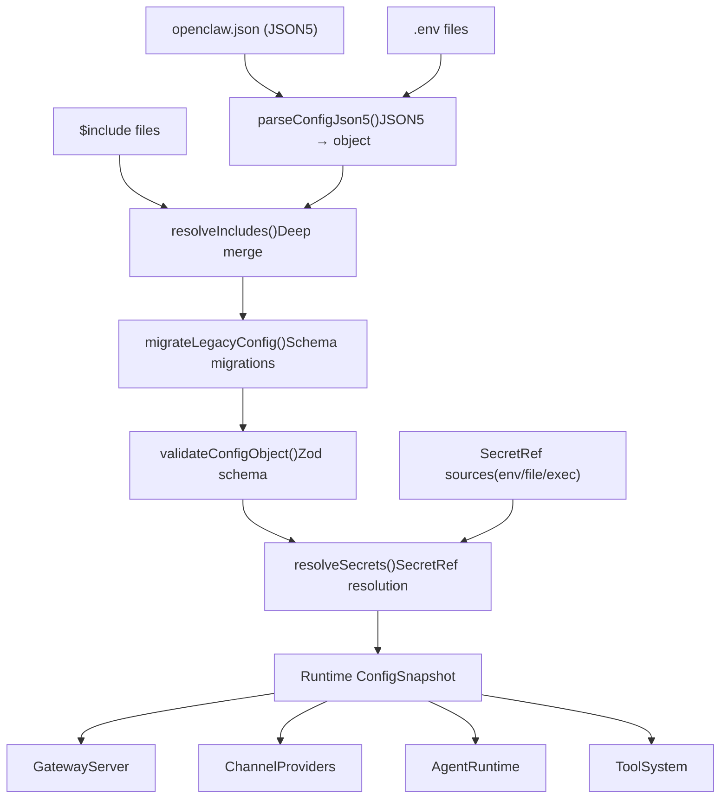
**Sources:** [src/config/io.ts1-500](https://github.com/openclaw/openclaw/blob/8873e13f/src/config/io.ts#L1-L500) [src/config/validation.ts1-300](https://github.com/openclaw/openclaw/blob/8873e13f/src/config/validation.ts#L1-L300) [src/config/legacy-migrate.ts1-400](https://github.com/openclaw/openclaw/blob/8873e13f/src/config/legacy-migrate.ts#L1-L400)

---

## Core Configuration Modules

### Config I/O and Loading

The `createConfigIO()` function factory returns isolated config I/O operations for a given profile. The primary entry point is `loadConfig()`, which orchestrates the full pipeline:

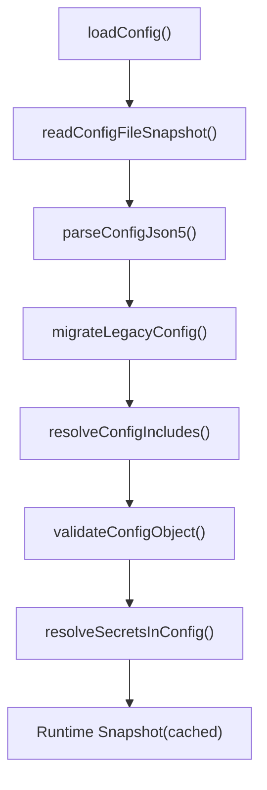
| Function | Purpose | Location |
| --- | --- | --- |
| `loadConfig()` | Full config load + cache | [src/config/io.ts200-250](https://github.com/openclaw/openclaw/blob/8873e13f/src/config/io.ts#L200-L250) |
| `readConfigFileSnapshot()` | Read raw file + hash | [src/config/io.ts100-150](https://github.com/openclaw/openclaw/blob/8873e13f/src/config/io.ts#L100-L150) |
| `parseConfigJson5()` | JSON5 parse + env substitution | [src/config/io.ts50-100](https://github.com/openclaw/openclaw/blob/8873e13f/src/config/io.ts#L50-L100) |
| `validateConfigObject()` | Zod validation + plugins | [src/config/validation.ts50-100](https://github.com/openclaw/openclaw/blob/8873e13f/src/config/validation.ts#L50-L100) |
| `migrateLegacyConfig()` | Schema migrations | [src/config/legacy-migrate.ts1-400](https://github.com/openclaw/openclaw/blob/8873e13f/src/config/legacy-migrate.ts#L1-L400) |
| `resolveConfigIncludes()` | $include merge | [src/config/includes.ts1-200](https://github.com/openclaw/openclaw/blob/8873e13f/src/config/includes.ts#L1-L200) |
| `resolveSecretsInConfig()` | SecretRef resolution | [src/config/secrets/resolver.ts1-300](https://github.com/openclaw/openclaw/blob/8873e13f/src/config/secrets/resolver.ts#L1-L300) |

**Sources:** [src/config/io.ts1-500](https://github.com/openclaw/openclaw/blob/8873e13f/src/config/io.ts#L1-L500) [src/config/validation.ts1-300](https://github.com/openclaw/openclaw/blob/8873e13f/src/config/validation.ts#L1-L300)

### Validation with Zod

All configuration is validated against `OpenClawSchema`, a comprehensive Zod schema defined in [src/config/zod-schema.ts162-700](https://github.com/openclaw/openclaw/blob/8873e13f/src/config/zod-schema.ts#L162-L700) The schema is strict by default—unknown keys cause validation failures, and all field types are enforced at parse time.

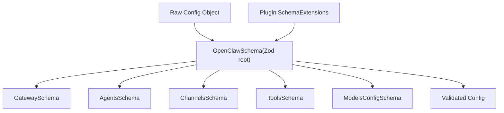
**Key Schema Characteristics:**

-   **Strict mode**: `.strict()` on all object schemas rejects unknown keys
-   **Optional by default**: Most fields have `.optional()` to support partial configs
-   **Custom transforms**: Fields like `meta.lastTouchedAt` auto-coerce timestamps to ISO strings [src/config/zod-schema.ts169-182](https://github.com/openclaw/openclaw/blob/8873e13f/src/config/zod-schema.ts#L169-L182)
-   **Cross-field refinements**: Complex validation like `dmPolicy: "allowlist"` requiring non-empty `allowFrom` [src/config/zod-schema.core.ts100-150](https://github.com/openclaw/openclaw/blob/8873e13f/src/config/zod-schema.core.ts#L100-L150)
-   **Plugin schema merging**: `validateConfigObjectWithPlugins()` merges plugin Zod schemas dynamically [src/config/validation.ts80-120](https://github.com/openclaw/openclaw/blob/8873e13f/src/config/validation.ts#L80-L120)

**Sources:** [src/config/zod-schema.ts162-700](https://github.com/openclaw/openclaw/blob/8873e13f/src/config/zod-schema.ts#L162-L700) [src/config/validation.ts1-300](https://github.com/openclaw/openclaw/blob/8873e13f/src/config/validation.ts#L1-L300) [src/config/zod-schema.core.ts1-400](https://github.com/openclaw/openclaw/blob/8873e13f/src/config/zod-schema.core.ts#L1-L400)

### SecretRef Pattern

The SecretRef system allows config values to reference secrets stored outside the config file (environment variables, files, or executable output). References use the syntax:

```
{  gateway: {    auth: {      token: { $ref: "env:OPENCLAW_GATEWAY_TOKEN" }    }  }}
```
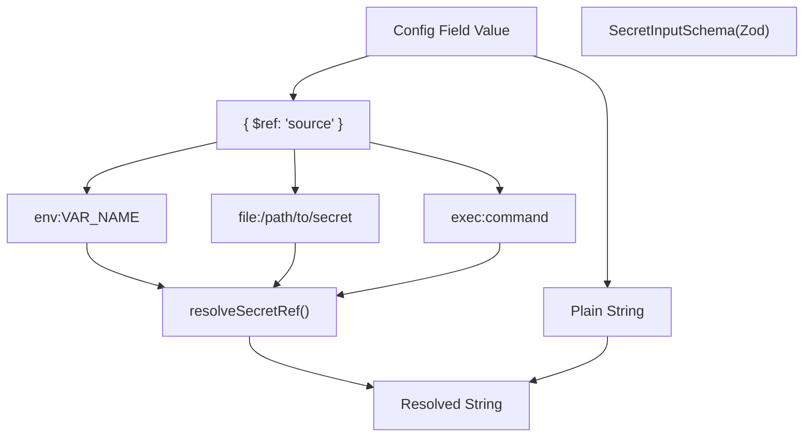
| Ref Type | Format | Resolution |
| --- | --- | --- |
| Environment | `env:VAR_NAME` | `process.env.VAR_NAME` |
| File | `file:/absolute/path` | Read file content, trim whitespace |
| Executable | `exec:command args` | Run command, capture stdout, trim |

**Resolution flow:**

1.  `SecretInputSchema` validates the shape [src/config/zod-schema.core.ts50-100](https://github.com/openclaw/openclaw/blob/8873e13f/src/config/zod-schema.core.ts#L50-L100)
2.  `resolveSecretRef()` performs runtime resolution [src/config/secrets/resolver.ts50-150](https://github.com/openclaw/openclaw/blob/8873e13f/src/config/secrets/resolver.ts#L50-L150)
3.  Sensitive fields marked with `.register(sensitive)` are redacted in logs [src/config/zod-schema.sensitive.ts1-50](https://github.com/openclaw/openclaw/blob/8873e13f/src/config/zod-schema.sensitive.ts#L1-L50)

**Sources:** [src/config/zod-schema.core.ts50-100](https://github.com/openclaw/openclaw/blob/8873e13f/src/config/zod-schema.core.ts#L50-L100) [src/config/secrets/resolver.ts1-300](https://github.com/openclaw/openclaw/blob/8873e13f/src/config/secrets/resolver.ts#L1-L300) [src/config/zod-schema.sensitive.ts1-50](https://github.com/openclaw/openclaw/blob/8873e13f/src/config/zod-schema.sensitive.ts#L1-L50)

---

## Hot Reload System

The gateway watches `~/.openclaw/openclaw.json` and applies changes automatically without manual restarts, based on the configured reload mode.

### Reload Modes

> **[Mermaid stateDiagram]**
> *(图表结构无法解析)*

| Mode | Behavior | When to use |
| --- | --- | --- |
| **`hybrid`** (default) | Hot-apply safe changes instantly; auto-restart for critical ones | Production (safest) |
| **`hot`** | Hot-apply safe changes only; log warnings for critical ones | Manual restart control |
| **`restart`** | Restart on any config change | Testing/development |
| **`off`** | Disable file watching entirely | External orchestration |

**Configuration:**

```
{  gateway: {    reload: {      mode: "hybrid",        // hot | restart | hybrid | off      debounceMs: 300        // Coalesce rapid edits    }  }}
```
### Hot vs Restart Fields

The system classifies config fields into "hot-apply" and "restart-required" categories:

| Category | Fields | Restart? |
| --- | --- | --- |
| Channels | `channels.*`, `web.*` | No |
| Agents & Models | `agents.*`, `models.*`, `bindings.*` | No |
| Automation | `hooks.*`, `cron.*` | No |
| Sessions & Messages | `session.*`, `messages.*` | No |
| Tools & Media | `tools.*`, `browser.*`, `skills.*` | No |
| **Gateway Server** | `gateway.port`, `gateway.bind`, `gateway.auth.*` | **Yes** |
| **Infrastructure** | `discovery.*`, `plugins.*` | **Yes** |

**Exceptions:** `gateway.reload` and `gateway.remote` do **not** trigger restarts when changed [docs/gateway/configuration.md380-390](https://github.com/openclaw/openclaw/blob/8873e13f/docs/gateway/configuration.md#L380-L390)

**Implementation:**

-   Field classification logic: [src/gateway/config-reload.ts100-200](https://github.com/openclaw/openclaw/blob/8873e13f/src/gateway/config-reload.ts#L100-L200)
-   Hot-reload orchestration: [src/gateway/config-reload.ts200-400](https://github.com/openclaw/openclaw/blob/8873e13f/src/gateway/config-reload.ts#L200-L400)
-   Restart coordination: [src/gateway/restart.ts1-300](https://github.com/openclaw/openclaw/blob/8873e13f/src/gateway/restart.ts#L1-L300)

**Sources:** [src/gateway/config-reload.ts1-500](https://github.com/openclaw/openclaw/blob/8873e13f/src/gateway/config-reload.ts#L1-L500) [src/gateway/restart.ts1-300](https://github.com/openclaw/openclaw/blob/8873e13f/src/gateway/restart.ts#L1-L300) [docs/gateway/configuration.md348-388](https://github.com/openclaw/openclaw/blob/8873e13f/docs/gateway/configuration.md#L348-L388)

---

## $include Directives

Config files can be split and composed using `$include` directives, which support both single-file replacement and multi-file deep merging.

### Include Resolution

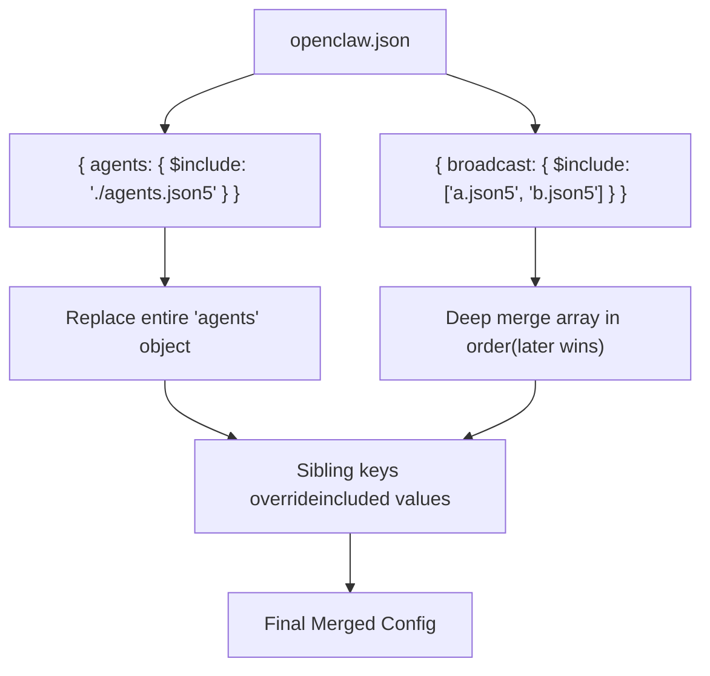
**Semantics:**

-   **Single file**: `{ $include: "./file.json5" }` replaces the containing object
-   **Array of files**: `{ $include: ["a.json5", "b.json5"] }` deep-merges in order (later wins)
-   **Sibling keys**: Merged after includes, overriding included values
-   **Nested includes**: Supported up to 10 levels deep
-   **Relative paths**: Resolved relative to the including file

**Example:**

```
// ~/.openclaw/openclaw.json{  gateway: { port: 18789 },  agents: { $include: "./agents.json5" },  broadcast: {    $include: ["./clients/a.json5", "./clients/b.json5"]  }}
```
**Error handling:**

-   Missing files, parse errors, and circular includes produce clear diagnostics
-   Validation happens **after** full include resolution

**Sources:** [src/config/includes.ts1-200](https://github.com/openclaw/openclaw/blob/8873e13f/src/config/includes.ts#L1-L200) [docs/gateway/configuration.md325-347](https://github.com/openclaw/openclaw/blob/8873e13f/docs/gateway/configuration.md#L325-L347)

---

## Config RPC (Programmatic Updates)

The gateway exposes WebSocket RPC methods for programmatic config updates, supporting both full replacement (`config.apply`) and partial updates (`config.patch`).

### RPC Methods

> **[Mermaid sequence]**
> *(图表结构无法解析)*

**Rate Limiting:**

-   Control-plane writes (`config.apply`, `config.patch`, `update.run`) are limited to **3 requests per 60 seconds** per `deviceId+clientIp`
-   When limited, RPC returns `UNAVAILABLE` with `retryAfterMs`

| Method | Purpose | Key Params |
| --- | --- | --- |
| `config.get` | Fetch current config + hash | — |
| `config.apply` | Full config replacement | `raw`, `baseHash`, `sessionKey?` |
| `config.patch` | Partial update (JSON merge patch) | `raw`, `baseHash`, `sessionKey?` |
| `config.schema.lookup` | Inspect single config path | `path` |

**Restart coordination:**

-   Pending restart requests are coalesced while one is in-flight
-   30-second cooldown applies between restart cycles
-   Optional `sessionKey` param enables post-restart wake-up ping

**Sources:** [src/gateway/rpc/config.ts1-400](https://github.com/openclaw/openclaw/blob/8873e13f/src/gateway/rpc/config.ts#L1-L400) [src/gateway/restart.ts1-300](https://github.com/openclaw/openclaw/blob/8873e13f/src/gateway/restart.ts#L1-L300) [docs/gateway/configuration.md389-448](https://github.com/openclaw/openclaw/blob/8873e13f/docs/gateway/configuration.md#L389-L448)

---

## Environment Variables

The config system integrates environment variables through multiple layers:

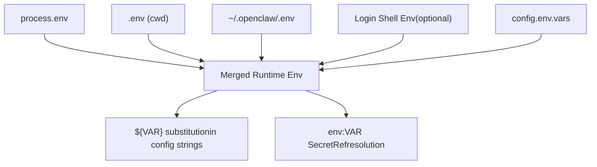
**Load order (no override):**

1.  `process.env` (highest precedence)
2.  `.env` from current working directory
3.  `~/.openclaw/.env` (global fallback)
4.  Shell environment import (if `env.shellEnv.enabled: true`)
5.  `config.env.vars` (inline config vars)

**Shell environment import:**

```
{  env: {    shellEnv: {      enabled: true,      // Run login shell to import missing vars      timeoutMs: 15000    // Shell resolution timeout    },    vars: {      GROQ_API_KEY: "gsk-..."  // Inline var injection    }  }}
```
**Substitution syntax:**

```
{  gateway: {    auth: { token: "${OPENCLAW_GATEWAY_TOKEN}" }  }}
```
**Sources:** [src/config/env.ts1-300](https://github.com/openclaw/openclaw/blob/8873e13f/src/config/env.ts#L1-L300) [src/config/io.ts50-100](https://github.com/openclaw/openclaw/blob/8873e13f/src/config/io.ts#L50-L100) [docs/gateway/configuration.md449-488](https://github.com/openclaw/openclaw/blob/8873e13f/docs/gateway/configuration.md#L449-L488)

---

## Legacy Migration System

The config system includes automatic migrations from legacy config formats, triggered during validation:

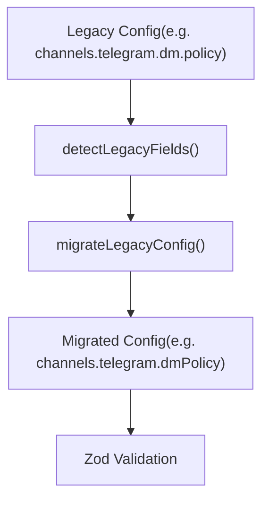
**Migration examples:**

| Legacy Field | New Field | Notes |
| --- | --- | --- |
| `channels.telegram.dm.policy` | `channels.telegram.dmPolicy` | DM policy flattening |
| `channels.discord.dm.allowFrom` | `channels.discord.allowFrom` | DM allowlist flattening |
| `heartbeat` (root) | `agents.defaults.heartbeat` | Agent-scoped heartbeat |
| `channels.telegram.groups."*".requireMention: false` | `requireMention: true` (new default) | Mention gating flip |

**Behavior:**

-   Migrations run **before** Zod validation
-   Legacy fields are removed after successful migration
-   Migration failures block startup; run `openclaw doctor --fix` to repair
-   Non-migratable legacy entries produce detailed errors [src/config/legacy-migrate.ts300-400](https://github.com/openclaw/openclaw/blob/8873e13f/src/config/legacy-migrate.ts#L300-L400)

**Sources:** [src/config/legacy-migrate.ts1-400](https://github.com/openclaw/openclaw/blob/8873e13f/src/config/legacy-migrate.ts#L1-L400) [CHANGELOG.md118](https://github.com/openclaw/openclaw/blob/8873e13f/CHANGELOG.md#L118-L118)

---

## Runtime Config Snapshot

The validated, resolved config is cached as a runtime snapshot accessible via `getRuntimeConfigSnapshot()`. All gateway subsystems consume this snapshot rather than re-parsing config files.

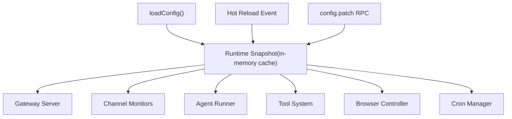
**Key functions:**

| Function | Purpose | Location |
| --- | --- | --- |
| `getRuntimeConfigSnapshot()` | Retrieve cached config | [src/config/io.ts400-420](https://github.com/openclaw/openclaw/blob/8873e13f/src/config/io.ts#L400-L420) |
| `setRuntimeConfigSnapshot()` | Update cache (hot reload) | [src/config/io.ts420-440](https://github.com/openclaw/openclaw/blob/8873e13f/src/config/io.ts#L420-L440) |
| `clearRuntimeConfigSnapshot()` | Invalidate cache | [src/config/io.ts440-460](https://github.com/openclaw/openclaw/blob/8873e13f/src/config/io.ts#L440-L460) |
| `resolveConfigSnapshotHash()` | Compute config hash | [src/config/io.ts460-480](https://github.com/openclaw/openclaw/blob/8873e13f/src/config/io.ts#L460-L480) |

**Cache invalidation:**

-   Hot reload: `setRuntimeConfigSnapshot()` swaps the snapshot atomically
-   Gateway restart: Cache cleared on process start
-   Manual: `clearRuntimeConfigSnapshot()` used by test harnesses

**Sources:** [src/config/io.ts400-500](https://github.com/openclaw/openclaw/blob/8873e13f/src/config/io.ts#L400-L500) [src/gateway/config-reload.ts200-400](https://github.com/openclaw/openclaw/blob/8873e13f/src/gateway/config-reload.ts#L200-L400)

---

## Config Schema Metadata

The config system includes rich metadata for Control UI rendering, CLI help text, and validation diagnostics.

### Field Metadata System

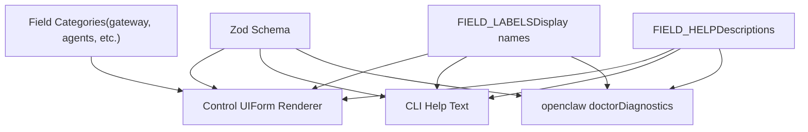
**Metadata sources:**

-   **Field labels**: [src/config/schema.labels.ts1-500](https://github.com/openclaw/openclaw/blob/8873e13f/src/config/schema.labels.ts#L1-L500) — Human-readable field names
-   **Field help**: [src/config/schema.help.ts1-500](https://github.com/openclaw/openclaw/blob/8873e13f/src/config/schema.help.ts#L1-L500) — Detailed descriptions and guidance
-   **Schema documentation**: Inline Zod `.describe()` calls for machine-readable metadata

**Usage:**

-   **Control UI**: Renders forms with labels and help tooltips [ui/src/components/config-form.ts1-300](https://github.com/openclaw/openclaw/blob/8873e13f/ui/src/components/config-form.ts#L1-L300)
-   **CLI**: `openclaw config get/set` uses labels for output formatting [src/cli/commands/config.ts1-400](https://github.com/openclaw/openclaw/blob/8873e13f/src/cli/commands/config.ts#L1-L400)
-   **Doctor**: Field-specific diagnostics and repair suggestions [src/cli/commands/doctor.ts1-800](https://github.com/openclaw/openclaw/blob/8873e13f/src/cli/commands/doctor.ts#L1-L800)

**Sources:** [src/config/schema.labels.ts1-500](https://github.com/openclaw/openclaw/blob/8873e13f/src/config/schema.labels.ts#L1-L500) [src/config/schema.help.ts1-500](https://github.com/openclaw/openclaw/blob/8873e13f/src/config/schema.help.ts#L1-L500) [ui/src/components/config-form.ts1-300](https://github.com/openclaw/openclaw/blob/8873e13f/ui/src/components/config-form.ts#L1-L300)

---

## Config Validation Error Handling

Validation failures produce structured error messages with exact field paths and actionable guidance:

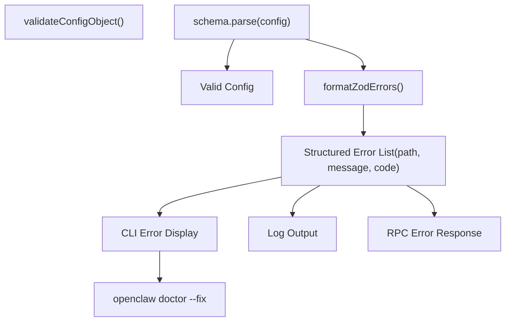
**Error structure:**

```
{  path: ["channels", "telegram", "dmPolicy"],  message: "Invalid enum value. Expected 'pairing' | 'allowlist' | 'open' | 'disabled', received 'public'",  code: "invalid_enum_value"}
```
**Error handling paths:**

-   **Startup**: Gateway refuses to boot; only diagnostic commands work (`doctor`, `logs`, `health`, `status`)
-   **Hot reload**: Changes rejected; gateway continues with old config
-   **RPC**: `config.apply`/`config.patch` return detailed validation errors
-   **CLI**: `openclaw doctor` lists issues; `openclaw doctor --fix` applies repairs when possible

**Sources:** [src/config/validation.ts150-250](https://github.com/openclaw/openclaw/blob/8873e13f/src/config/validation.ts#L150-L250) [src/cli/commands/doctor.ts1-800](https://github.com/openclaw/openclaw/blob/8873e13f/src/cli/commands/doctor.ts#L1-L800) [docs/gateway/configuration.md61-74](https://github.com/openclaw/openclaw/blob/8873e13f/docs/gateway/configuration.md#L61-L74)

---

## Configuration File Locations

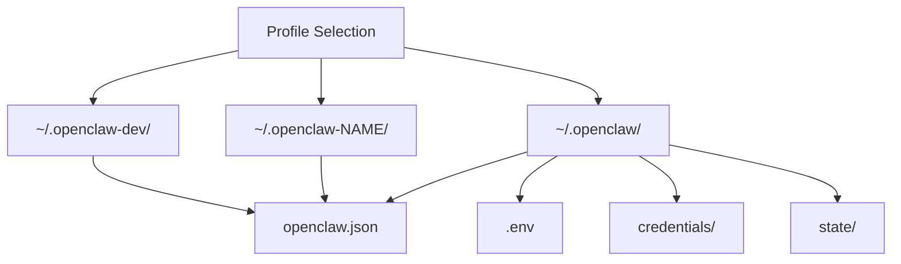
**Standard paths:**

-   **Config file**: `~/.openclaw/openclaw.json` (JSON5 format)
-   **Global env**: `~/.openclaw/.env`
-   **Credentials**: `~/.openclaw/credentials/` (channel auth, OAuth tokens)
-   **State**: `~/.openclaw/state/` (sessions, cron, pairing store)

**Profile isolation:**

-   `--dev`: Shifts all paths to `~/.openclaw-dev/` and default ports (+100 offset)
-   `--profile NAME`: Shifts all paths to `~/.openclaw-NAME/`
-   Profiles are fully isolated; no shared state

**Sources:** [src/config/paths.ts1-200](https://github.com/openclaw/openclaw/blob/8873e13f/src/config/paths.ts#L1-L200) [src/cli/profile.ts1-150](https://github.com/openclaw/openclaw/blob/8873e13f/src/cli/profile.ts#L1-L150)

---

## Key Takeaways

1.  **Strict validation**: Config must fully match Zod schema; unknown keys fail startup
2.  **Hot reload by default**: `hybrid` mode auto-restarts only when necessary
3.  **SecretRef everywhere**: Keep secrets out of config files using `{ $ref: "env:VAR" }`
4.  **$include composition**: Split large configs into focused files with deep merge
5.  **RPC-driven updates**: Control UI and CLI update config via WebSocket RPC
6.  **Migration safety**: Legacy configs auto-migrate; `openclaw doctor --fix` repairs issues
7.  **Runtime snapshot**: All subsystems consume cached, validated config—no file I/O in hot path

**Sources:** [src/config/io.ts1-500](https://github.com/openclaw/openclaw/blob/8873e13f/src/config/io.ts#L1-L500) [src/config/validation.ts1-300](https://github.com/openclaw/openclaw/blob/8873e13f/src/config/validation.ts#L1-L300) [src/config/zod-schema.ts162-700](https://github.com/openclaw/openclaw/blob/8873e13f/src/config/zod-schema.ts#L162-L700) [src/gateway/config-reload.ts1-500](https://github.com/openclaw/openclaw/blob/8873e13f/src/gateway/config-reload.ts#L1-L500) [docs/gateway/configuration.md1-500](https://github.com/openclaw/openclaw/blob/8873e13f/docs/gateway/configuration.md#L1-L500)
