# Configuration Reference

Relevant source files

-   [docs/channels/discord.md](https://github.com/openclaw/openclaw/blob/8873e13f/docs/channels/discord.md)
-   [docs/channels/telegram.md](https://github.com/openclaw/openclaw/blob/8873e13f/docs/channels/telegram.md)
-   [docs/gateway/configuration-reference.md](https://github.com/openclaw/openclaw/blob/8873e13f/docs/gateway/configuration-reference.md)
-   [src/acp/control-plane/manager.core.ts](https://github.com/openclaw/openclaw/blob/8873e13f/src/acp/control-plane/manager.core.ts)
-   [src/agents/pi-embedded-runner/tool-result-char-estimator.ts](https://github.com/openclaw/openclaw/blob/8873e13f/src/agents/pi-embedded-runner/tool-result-char-estimator.ts)
-   [src/agents/pi-embedded-runner/tool-result-context-guard.ts](https://github.com/openclaw/openclaw/blob/8873e13f/src/agents/pi-embedded-runner/tool-result-context-guard.ts)
-   [src/agents/tools/telegram-actions.test.ts](https://github.com/openclaw/openclaw/blob/8873e13f/src/agents/tools/telegram-actions.test.ts)
-   [src/agents/tools/telegram-actions.ts](https://github.com/openclaw/openclaw/blob/8873e13f/src/agents/tools/telegram-actions.ts)
-   [src/auto-reply/skill-commands.test.ts](https://github.com/openclaw/openclaw/blob/8873e13f/src/auto-reply/skill-commands.test.ts)
-   [src/auto-reply/skill-commands.ts](https://github.com/openclaw/openclaw/blob/8873e13f/src/auto-reply/skill-commands.ts)
-   [src/channels/allowlists/resolve-utils.test.ts](https://github.com/openclaw/openclaw/blob/8873e13f/src/channels/allowlists/resolve-utils.test.ts)
-   [src/channels/allowlists/resolve-utils.ts](https://github.com/openclaw/openclaw/blob/8873e13f/src/channels/allowlists/resolve-utils.ts)
-   [src/channels/plugins/actions/actions.test.ts](https://github.com/openclaw/openclaw/blob/8873e13f/src/channels/plugins/actions/actions.test.ts)
-   [src/channels/plugins/actions/telegram.ts](https://github.com/openclaw/openclaw/blob/8873e13f/src/channels/plugins/actions/telegram.ts)
-   [src/config/schema.help.quality.test.ts](https://github.com/openclaw/openclaw/blob/8873e13f/src/config/schema.help.quality.test.ts)
-   [src/config/schema.help.ts](https://github.com/openclaw/openclaw/blob/8873e13f/src/config/schema.help.ts)
-   [src/config/schema.labels.ts](https://github.com/openclaw/openclaw/blob/8873e13f/src/config/schema.labels.ts)
-   [src/config/types.agent-defaults.ts](https://github.com/openclaw/openclaw/blob/8873e13f/src/config/types.agent-defaults.ts)
-   [src/config/types.discord.ts](https://github.com/openclaw/openclaw/blob/8873e13f/src/config/types.discord.ts)
-   [src/config/types.telegram.ts](https://github.com/openclaw/openclaw/blob/8873e13f/src/config/types.telegram.ts)
-   [src/config/zod-schema.agent-defaults.ts](https://github.com/openclaw/openclaw/blob/8873e13f/src/config/zod-schema.agent-defaults.ts)
-   [src/config/zod-schema.providers-core.ts](https://github.com/openclaw/openclaw/blob/8873e13f/src/config/zod-schema.providers-core.ts)
-   [src/discord/monitor.test.ts](https://github.com/openclaw/openclaw/blob/8873e13f/src/discord/monitor.test.ts)
-   [src/discord/monitor/listeners.test.ts](https://github.com/openclaw/openclaw/blob/8873e13f/src/discord/monitor/listeners.test.ts)
-   [src/discord/monitor/listeners.ts](https://github.com/openclaw/openclaw/blob/8873e13f/src/discord/monitor/listeners.ts)
-   [src/discord/monitor/provider.allowlist.test.ts](https://github.com/openclaw/openclaw/blob/8873e13f/src/discord/monitor/provider.allowlist.test.ts)
-   [src/discord/monitor/provider.allowlist.ts](https://github.com/openclaw/openclaw/blob/8873e13f/src/discord/monitor/provider.allowlist.ts)
-   [src/discord/monitor/provider.skill-dedupe.test.ts](https://github.com/openclaw/openclaw/blob/8873e13f/src/discord/monitor/provider.skill-dedupe.test.ts)
-   [src/discord/monitor/provider.test.ts](https://github.com/openclaw/openclaw/blob/8873e13f/src/discord/monitor/provider.test.ts)
-   [src/discord/monitor/provider.ts](https://github.com/openclaw/openclaw/blob/8873e13f/src/discord/monitor/provider.ts)
-   [src/slack/monitor/provider.ts](https://github.com/openclaw/openclaw/blob/8873e13f/src/slack/monitor/provider.ts)
-   [src/telegram/send.test.ts](https://github.com/openclaw/openclaw/blob/8873e13f/src/telegram/send.test.ts)
-   [src/telegram/send.ts](https://github.com/openclaw/openclaw/blob/8873e13f/src/telegram/send.ts)

This page provides comprehensive field-by-field documentation of the `~/.openclaw/openclaw.json` configuration file structure. For an overview of the configuration loading pipeline, validation, and hot reload behavior, see [Configuration System](/openclaw/openclaw/2.3-configuration-system).

All configuration fields are optional unless explicitly stated otherwise. OpenClaw uses safe defaults when fields are omitted. The config format is **JSON5**, which supports comments and trailing commas.

**Sources:** [docs/gateway/configuration-reference.md1-15](https://github.com/openclaw/openclaw/blob/8873e13f/docs/gateway/configuration-reference.md#L1-L15)

---

## Configuration Schema Overview

The root configuration object is validated by `ConfigSchema` in the codebase and contains these top-level sections:

```mermaid
flowchart TD
    Root["ConfigSchema (root)"]
    Meta["meta: MetaSchema"]
    Env["env: EnvSchema"]
    Wizard["wizard: WizardSchema"]
    Diagnostics["diagnostics: DiagnosticsSchema"]
    Logging["logging: LoggingSchema"]
    CLI["cli: CliSchema"]
    Update["update: UpdateSchema"]
    Gateway["gateway: GatewaySchema"]
    Channels["channels: ChannelsSchema"]
    Agents["agents: AgentsSchema"]
    Tools["tools: ToolsSchema"]
    Browser["browser: BrowserSchema"]
    Web["web: WebSchema"]
    Discovery["discovery: DiscoverySchema"]
    Session["session: SessionSchema"]
    Messages["messages: MessagesSchema"]
    Commands["commands: CommandsSchema"]
    Approvals["approvals: ApprovalsSchema"]
    ACP["acp: AcpSchema"]
    Talk["talk: TalkSchema"]
    Bindings["bindings: BindingsSchema[]"]

    Root --> Meta
    Root --> Env
    Root --> Wizard
    Root --> Diagnostics
    Root --> Logging
    Root --> CLI
    Root --> Update
    Root --> Gateway
    Root --> Channels
    Root --> Agents
    Root --> Tools
    Root --> Browser
    Root --> Web
    Root --> Discovery
    Root --> Session
    Root --> Messages
    Root --> Commands
    Root --> Approvals
    Root --> ACP
    Root --> Talk
    Root --> Bindings
```
**Configuration Validation Path:**

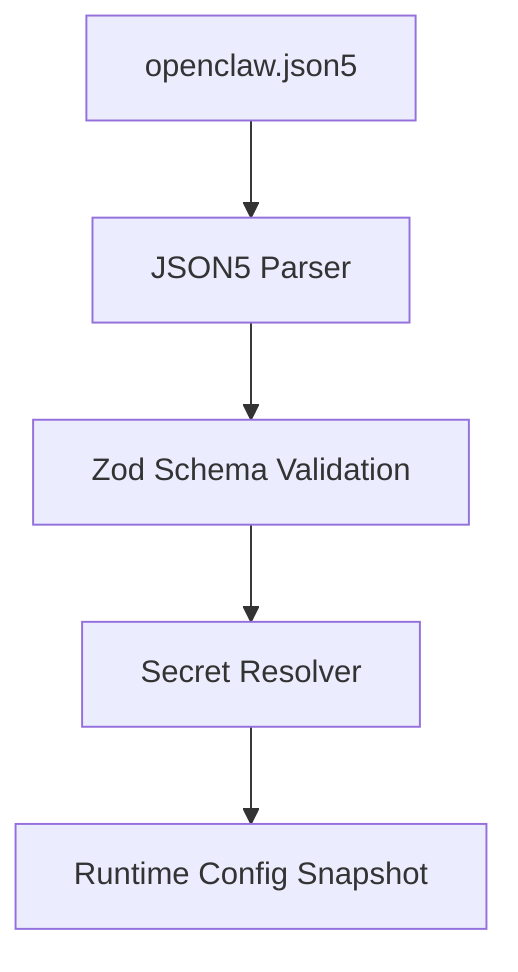
**Sources:** [src/config/zod-schema.providers-core.ts1-50](https://github.com/openclaw/openclaw/blob/8873e13f/src/config/zod-schema.providers-core.ts#L1-L50) [src/config/schema.help.ts1-350](https://github.com/openclaw/openclaw/blob/8873e13f/src/config/schema.help.ts#L1-L350)

---

## Meta Section

System-managed metadata fields that record config write and version history:

| Field | Type | Description |
| --- | --- | --- |
| `meta.lastTouchedVersion` | `string` | OpenClaw version that last wrote this config |
| `meta.lastTouchedAt` | `string` | ISO timestamp of last config write |

**Example:**

```
{  meta: {    lastTouchedVersion: "2026.2.25",    lastTouchedAt: "2026-02-25T10:30:00.000Z"  }}
```
**Sources:** [src/config/schema.help.ts9-11](https://github.com/openclaw/openclaw/blob/8873e13f/src/config/schema.help.ts#L9-L11)

---

## Environment Section

Controls environment variable import and runtime variable injection:

| Field | Type | Default | Description |
| --- | --- | --- | --- |
| `env.shellEnv.enabled` | `boolean` | `true` | Load variables from user shell profile during startup |
| `env.shellEnv.timeoutMs` | `number` | `5000` | Maximum time for shell environment resolution |
| `env.vars` | `Record<string, string>` | `{}` | Explicit key/value environment overrides |

**Example:**

```
{  env: {    shellEnv: {      enabled: true,      timeoutMs: 5000    },    vars: {      NODE_ENV: "production",      LOG_LEVEL: "info"    }  }}
```
**Sources:** [src/config/schema.help.ts12-20](https://github.com/openclaw/openclaw/blob/8873e13f/src/config/schema.help.ts#L12-L20)

---

## Gateway Section

Gateway runtime configuration for bind mode, authentication, control UI, and operational controls.

### Core Gateway Fields

```mermaid
flowchart TD
    Gateway["gateway"]
    Port["port: number (18789)"]
    Mode["mode: 'local' | 'remote'"]
    Bind["bind: 'auto' | 'lan' | 'loopback' | 'custom' | 'tailnet'"]
    CustomBindHost["customBindHost: string"]
    ControlUi["controlUi: ControlUiSchema"]
    Auth["auth: GatewayAuthSchema"]
    Tools["tools: GatewayToolsSchema"]
    Remote["remote: RemoteGatewaySchema"]
    Reload["reload: ReloadSchema"]
    TLS["tls: TlsSchema"]
    HTTP["http: HttpSchema"]
    Tailscale["tailscale: TailscaleSchema"]

    Gateway --> Port
    Gateway --> Mode
    Gateway --> Bind
    Gateway --> CustomBindHost
    Gateway --> ControlUi
    Gateway --> Auth
    Gateway --> Tools
    Gateway --> Remote
    Gateway --> Reload
    Gateway --> TLS
    Gateway --> HTTP
    Gateway --> Tailscale
```
| Field | Type | Default | Description |
| --- | --- | --- | --- |
| `gateway.port` | `number` | `18789` | TCP port for gateway listener (API, Control UI, channel ingress) |
| `gateway.mode` | `"local"` | `"remote"` | `"local"` | Operation mode: local runs channels and agents on this host; remote connects through remote transport |
| `gateway.bind` | `"auto"` | `"lan"` | `"loopback"` | `"custom"` | `"tailnet"` | `"auto"` | Network bind profile controlling interface exposure |
| `gateway.customBindHost` | `string` | \- | Explicit bind host/IP when `bind` is `"custom"` |
| `gateway.channelHealthCheckMinutes` | `number` | `5` | Interval in minutes for automatic channel health probing |

**Sources:** [src/config/schema.help.ts68-110](https://github.com/openclaw/openclaw/blob/8873e13f/src/config/schema.help.ts#L68-L110) [docs/gateway/configuration-reference.md68-126](https://github.com/openclaw/openclaw/blob/8873e13f/docs/gateway/configuration-reference.md#L68-L126)

### Gateway Authentication

The `gateway.auth` object controls HTTP/WebSocket access authentication:

| Field | Type | Default | Description |
| --- | --- | --- | --- |
| `gateway.auth.mode` | `"none"` | `"token"` | `"password"` | `"trusted-proxy"` | `"none"` | Authentication mode |
| `gateway.auth.token` | `SecretInput` | \- | Bearer token for token auth mode |
| `gateway.auth.password` | `SecretInput` | \- | Password for password auth mode |
| `gateway.auth.allowTailscale` | `boolean` | `false` | Allow Tailscale identity paths to satisfy auth checks |
| `gateway.auth.rateLimit` | `RateLimitSchema` | \- | Login/auth attempt throttling controls |
| `gateway.auth.trustedProxy` | `TrustedProxyAuthSchema` | \- | Trusted-proxy auth header mapping |

**Example:**

```
{  gateway: {    port: 18789,    bind: "loopback",    auth: {      mode: "token",      token: "${GATEWAY_TOKEN}"    }  }}
```
**Sources:** [src/config/schema.help.ts82-96](https://github.com/openclaw/openclaw/blob/8873e13f/src/config/schema.help.ts#L82-L96) [docs/gateway/configuration-reference.md68-126](https://github.com/openclaw/openclaw/blob/8873e13f/docs/gateway/configuration-reference.md#L68-L126)

### Gateway TLS

| Field | Type | Default | Description |
| --- | --- | --- | --- |
| `gateway.tls.enabled` | `boolean` | `false` | Enable TLS termination at gateway listener |
| `gateway.tls.autoGenerate` | `boolean` | `false` | Auto-generate local TLS certificate/key pair |
| `gateway.tls.certPath` | `string` | \- | Filesystem path to TLS certificate file |
| `gateway.tls.keyPath` | `string` | \- | Filesystem path to TLS private key file |
| `gateway.tls.caPath` | `string` | \- | Optional CA bundle path for client verification |

**Sources:** [src/config/schema.help.ts116-127](https://github.com/openclaw/openclaw/blob/8873e13f/src/config/schema.help.ts#L116-L127)

### Remote Gateway

For split-host operation where this instance proxies to another runtime:

| Field | Type | Default | Description |
| --- | --- | --- | --- |
| `gateway.remote.transport` | `"direct"` | `"ssh"` | `"direct"` | Connection transport |
| `gateway.remote.url` | `string` | \- | Remote Gateway WebSocket URL (`ws://` or `wss://`) |
| `gateway.remote.token` | `SecretInput` | \- | Bearer token for remote gateway authentication |
| `gateway.remote.password` | `SecretInput` | \- | Password credential for remote gateway |
| `gateway.remote.tlsFingerprint` | `string` | \- | Expected sha256 TLS fingerprint (pin to avoid MITM) |
| `gateway.remote.sshTarget` | `string` | \- | SSH tunnel target (format: `user@host` or `user@host:port`) |
| `gateway.remote.sshIdentity` | `string` | \- | Optional SSH identity file path |

**Sources:** [src/config/schema.help.ts112-145](https://github.com/openclaw/openclaw/blob/8873e13f/src/config/schema.help.ts#L112-L145)

---

## Channels Section

Multi-channel messaging integration configuration. Each channel starts automatically when its config section exists unless `enabled: false`.

### Channel Defaults and Shared Settings

```mermaid
flowchart TD
    Channels["channels"]
    Defaults["defaults: ChannelDefaultsSchema"]
    ModelByChannel["modelByChannel: Record>"]
    Telegram["telegram: TelegramConfigSchema"]
    Discord["discord: DiscordConfigSchema"]
    Slack["slack: SlackConfigSchema"]
    WhatsApp["whatsapp: WhatsAppConfigSchema"]
    Signal["signal: SignalConfigSchema"]
    GoogleChat["googlechat: GoogleChatConfigSchema"]
    Mattermost["mattermost: MattermostConfigSchema"]
    IMessage["imessage: IMessageConfigSchema"]
    BlueBubbles["bluebubbles: BlueBubblesConfigSchema"]
    IRC["irc: IrcConfigSchema"]
    MSTeams["msteams: MSTeamsConfigSchema"]

    Channels --> Defaults
    Channels --> ModelByChannel
    Channels --> Telegram
    Channels --> Discord
    Channels --> Slack
    Channels --> WhatsApp
    Channels --> Signal
    Channels --> GoogleChat
    Channels --> Mattermost
    Channels --> IMessage
    Channels --> BlueBubbles
    Channels --> IRC
    Channels --> MSTeams
```
| Field | Type | Default | Description |
| --- | --- | --- | --- |
| `channels.defaults.groupPolicy` | `"open"` | `"allowlist"` | `"disabled"` | `"allowlist"` | Fallback group policy when provider-level `groupPolicy` is unset |
| `channels.defaults.heartbeat.showOk` | `boolean` | `false` | Include healthy channel statuses in heartbeat output |
| `channels.defaults.heartbeat.showAlerts` | `boolean` | `true` | Include degraded/error statuses in heartbeat output |
| `channels.defaults.heartbeat.useIndicator` | `boolean` | `true` | Render compact indicator-style heartbeat output |

**Channel Model Override Mapping:**

Use `channels.modelByChannel` to pin specific channel IDs to a model. Values accept `provider/model` or configured model aliases.

```
{  channels: {    modelByChannel: {      discord: {        "123456789012345678": "anthropic/claude-opus-4-6"      },      slack: {        "C1234567890": "openai/gpt-4.1"      },      telegram: {        "-1001234567890": "openai/gpt-4.1-mini",        "-1001234567890:topic:99": "anthropic/claude-sonnet-4-6"      }    }  }}
```
**Sources:** [docs/gateway/configuration-reference.md68-90](https://github.com/openclaw/openclaw/blob/8873e13f/docs/gateway/configuration-reference.md#L68-L90) [src/config/zod-schema.providers-core.ts1-100](https://github.com/openclaw/openclaw/blob/8873e13f/src/config/zod-schema.providers-core.ts#L1-L100)

### DM and Group Access Policies

All channels support DM policies and group policies:

**DM Policy Values:**

| Policy | Behavior |
| --- | --- |
| `"pairing"` (default) | Unknown senders get a one-time pairing code; owner must approve |
| `"allowlist"` | Only senders in `allowFrom` (or paired allow store) |
| `"open"` | Allow all inbound DMs (requires `allowFrom: ["*"]`) |
| `"disabled"` | Ignore all inbound DMs |

**Group Policy Values:**

| Policy | Behavior |
| --- | --- |
| `"allowlist"` (default) | Only groups matching the configured allowlist |
| `"open"` | Bypass group allowlists (mention-gating still applies) |
| `"disabled"` | Block all group/room messages |

**Sources:** [docs/gateway/configuration-reference.md22-43](https://github.com/openclaw/openclaw/blob/8873e13f/docs/gateway/configuration-reference.md#L22-L43)

### Telegram Configuration

**Schema Path:** `TelegramConfigSchema` in [src/config/zod-schema.providers-core.ts152-344](https://github.com/openclaw/openclaw/blob/8873e13f/src/config/zod-schema.providers-core.ts#L152-L344)

**Core Fields:**

| Field | Type | Default | Description |
| --- | --- | --- | --- |
| `channels.telegram.enabled` | `boolean` | `true` | Enable Telegram channel |
| `channels.telegram.botToken` | `SecretInput` | \- | Telegram bot token (env: `TELEGRAM_BOT_TOKEN` for default account) |
| `channels.telegram.tokenFile` | `string` | \- | Alternative: path to file containing bot token |
| `channels.telegram.dmPolicy` | `DmPolicy` | `"pairing"` | Direct message access policy |
| `channels.telegram.groupPolicy` | `GroupPolicy` | `"allowlist"` | Group message access policy |
| `channels.telegram.allowFrom` | `Array<string | number>` | \- | Allowlist for DM senders (numeric Telegram user IDs) |
| `channels.telegram.groupAllowFrom` | `Array<string | number>` | \- | Allowlist for group senders (falls back to `allowFrom`) |
| `channels.telegram.historyLimit` | `number` | `50` | Group chat history limit |
| `channels.telegram.dmHistoryLimit` | `number` | \- | DM history limit (falls back to unlimited) |
| `channels.telegram.textChunkLimit` | `number` | `4000` | Max text chars before splitting |
| `channels.telegram.chunkMode` | `"length"` | `"newline"` | `"length"` | Text splitting strategy |
| `channels.telegram.streaming` | `"off"` | `"partial"` | `"block"` | `"progress"` | `"partial"` | Live stream preview mode |
| `channels.telegram.mediaMaxMb` | `number` | `100` | Max media file size in MB |
| `channels.telegram.linkPreview` | `boolean` | `true` | Enable link preview in messages |

**Group Configuration:**

```
{  channels: {    telegram: {      groups: {        "-1001234567890": {          requireMention: true,          allowFrom: ["123456789"],          systemPrompt: "Keep answers brief.",          topics: {            "99": {              requireMention: false,              skills: ["search"],              agentId: "research"            }          }        }      }    }  }}
```
**Multi-Account Configuration:**

```
{  channels: {    telegram: {      accounts: {        default: {          name: "Primary bot",          botToken: "123456:ABC..."        },        alerts: {          name: "Alerts bot",          botToken: "987654:XYZ..."        }      },      defaultAccount: "default"    }  }}
```
**Sources:** [docs/gateway/configuration-reference.md152-212](https://github.com/openclaw/openclaw/blob/8873e13f/docs/gateway/configuration-reference.md#L152-L212) [src/config/zod-schema.providers-core.ts152-344](https://github.com/openclaw/openclaw/blob/8873e13f/src/config/zod-schema.providers-core.ts#L152-L344) [docs/channels/telegram.md1-100](https://github.com/openclaw/openclaw/blob/8873e13f/docs/channels/telegram.md#L1-L100)

### Discord Configuration

**Schema Path:** `DiscordConfigSchema` in [src/config/zod-schema.providers-core.ts417-580](https://github.com/openclaw/openclaw/blob/8873e13f/src/config/zod-schema.providers-core.ts#L417-L580)

**Core Fields:**

| Field | Type | Default | Description |
| --- | --- | --- | --- |
| `channels.discord.enabled` | `boolean` | `true` | Enable Discord channel |
| `channels.discord.token` | `SecretInput` | \- | Discord bot token (env: `DISCORD_BOT_TOKEN` for default account) |
| `channels.discord.dmPolicy` | `DmPolicy` | `"pairing"` | Direct message access policy |
| `channels.discord.groupPolicy` | `GroupPolicy` | `"allowlist"` | Guild access policy |
| `channels.discord.allowFrom` | `Array<string>` | \- | Allowlist for DM senders (Discord IDs as strings) |
| `channels.discord.historyLimit` | `number` | `20` | Guild channel history limit |
| `channels.discord.dmHistoryLimit` | `number` | \- | DM history limit |
| `channels.discord.textChunkLimit` | `number` | `2000` | Max text chars before splitting |
| `channels.discord.chunkMode` | `"length"` | `"newline"` | `"length"` | Text splitting strategy |
| `channels.discord.streaming` | `"off"` | `"partial"` | `"block"` | `"progress"` | `"off"` | Stream preview mode |
| `channels.discord.maxLinesPerMessage` | `number` | `17` | Max lines before splitting tall messages |
| `channels.discord.mediaMaxMb` | `number` | `8` | Max media file size in MB |
| `channels.discord.allowBots` | `boolean` | `"mentions"` | `false` | Allow bot-authored messages |
| `channels.discord.replyToMode` | `"off"` | `"first"` | `"all"` | `"off"` | Reply threading mode |

**Guild Configuration:**

```
{  channels: {    discord: {      guilds: {        "123456789012345678": {          slug: "friends-of-openclaw",          requireMention: false,          ignoreOtherMentions: true,          users: ["987654321098765432"],          channels: {            "general": { allow: true },            "help": {              allow: true,              requireMention: true,              skills: ["docs"],              systemPrompt: "Short answers only."            }          }        }      }    }  }}
```
**Thread Bindings Configuration:**

| Field | Type | Default | Description |
| --- | --- | --- | --- |
| `channels.discord.threadBindings.enabled` | `boolean` | \- | Discord override for thread-bound session features |
| `channels.discord.threadBindings.idleHours` | `number` | `24` | Inactivity auto-unfocus timeout in hours (0 disables) |
| `channels.discord.threadBindings.maxAgeHours` | `number` | `0` | Hard max age in hours (0 disables) |
| `channels.discord.threadBindings.spawnSubagentSessions` | `boolean` | `false` | Opt-in for `sessions_spawn({ thread: true })` auto thread creation |

**Voice Configuration:**

```
{  channels: {    discord: {      voice: {        enabled: true,        autoJoin: [          {            guildId: "123456789012345678",            channelId: "234567890123456789"          }        ],        daveEncryption: true,        decryptionFailureTolerance: 24,        tts: {          provider: "openai",          openai: { voice: "alloy" }        }      }    }  }}
```
**Sources:** [docs/gateway/configuration-reference.md215-326](https://github.com/openclaw/openclaw/blob/8873e13f/docs/gateway/configuration-reference.md#L215-L326) [src/config/zod-schema.providers-core.ts417-580](https://github.com/openclaw/openclaw/blob/8873e13f/src/config/zod-schema.providers-core.ts#L417-L580) [docs/channels/discord.md1-300](https://github.com/openclaw/openclaw/blob/8873e13f/docs/channels/discord.md#L1-L300)

### Slack Configuration

**Schema Path:** `SlackConfigSchema` in [src/config/zod-schema.providers-core.ts655-850](https://github.com/openclaw/openclaw/blob/8873e13f/src/config/zod-schema.providers-core.ts#L655-L850)

**Core Fields:**

| Field | Type | Default | Description |
| --- | --- | --- | --- |
| `channels.slack.enabled` | `boolean` | `true` | Enable Slack channel |
| `channels.slack.botToken` | `SecretInput` | \- | Slack bot token (env: `SLACK_BOT_TOKEN` for default account) |
| `channels.slack.appToken` | `SecretInput` | \- | Slack app token for socket mode (env: `SLACK_APP_TOKEN` for default) |
| `channels.slack.signingSecret` | `SecretInput` | \- | Slack signing secret for HTTP mode |
| `channels.slack.mode` | `"socket"` | `"http"` | `"socket"` | Connection mode |
| `channels.slack.dmPolicy` | `DmPolicy` | `"pairing"` | Direct message access policy |
| `channels.slack.groupPolicy` | `GroupPolicy` | `"allowlist"` | Channel access policy |
| `channels.slack.allowFrom` | `Array<string>` | \- | Allowlist for DM senders (Slack user IDs) |
| `channels.slack.historyLimit` | `number` | `50` | Channel history limit |
| `channels.slack.textChunkLimit` | `number` | `4000` | Max text chars before splitting |
| `channels.slack.streaming` | `"off"` | `"partial"` | `"block"` | `"progress"` | `"partial"` | Stream mode |
| `channels.slack.nativeStreaming` | `boolean` | `true` | Use Slack native streaming API when streaming is enabled |
| `channels.slack.reactionNotifications` | `"off"` | `"own"` | `"all"` | `"allowlist"` | `"own"` | Reaction notification mode |
| `channels.slack.replyToMode` | `"off"` | `"first"` | `"all"` | `"off"` | Reply threading mode |

**Channel Configuration:**

```
{  channels: {    slack: {      channels: {        "C123": {          allow: true,          requireMention: true,          users: ["U123"],          skills: ["docs"],          systemPrompt: "Short answers only."        }      }    }  }}
```
**Thread Configuration:**

| Field | Type | Default | Description |
| --- | --- | --- | --- |
| `channels.slack.thread.historyScope` | `"thread"` | `"channel"` | `"thread"` | Per-thread or shared across channel |
| `channels.slack.thread.inheritParent` | `boolean` | `false` | Copy parent channel transcript to new threads |

**Sources:** [docs/gateway/configuration-reference.md365-440](https://github.com/openclaw/openclaw/blob/8873e13f/docs/gateway/configuration-reference.md#L365-L440) [src/slack/monitor/provider.ts1-300](https://github.com/openclaw/openclaw/blob/8873e13f/src/slack/monitor/provider.ts#L1-L300)

### WhatsApp Configuration

**Schema Path:** `WhatsAppConfigSchema` (implicit in gateway channels)

WhatsApp runs through the gateway's web channel (Baileys Web). It starts automatically when a linked session exists.

| Field | Type | Default | Description |
| --- | --- | --- | --- |
| `channels.whatsapp.dmPolicy` | `DmPolicy` | `"pairing"` | Direct message access policy |
| `channels.whatsapp.groupPolicy` | `GroupPolicy` | `"allowlist"` | Group access policy |
| `channels.whatsapp.allowFrom` | `Array<string>` | \- | Allowlist for DM senders (phone numbers) |
| `channels.whatsapp.groupAllowFrom` | `Array<string>` | \- | Allowlist for group senders |
| `channels.whatsapp.textChunkLimit` | `number` | `4000` | Max text chars before splitting |
| `channels.whatsapp.chunkMode` | `"length"` | `"newline"` | `"length"` | Text splitting strategy |
| `channels.whatsapp.mediaMaxMb` | `number` | `50` | Max media file size in MB |
| `channels.whatsapp.sendReadReceipts` | `boolean` | `true` | Send blue ticks (false in self-chat mode) |

**Multi-Account Configuration:**

```
{  channels: {    whatsapp: {      accounts: {        default: {},        personal: {},        biz: {          // authDir: "~/.openclaw/credentials/whatsapp/biz"        }      },      defaultAccount: "default"    }  }}
```
**Sources:** [docs/gateway/configuration-reference.md92-150](https://github.com/openclaw/openclaw/blob/8873e13f/docs/gateway/configuration-reference.md#L92-L150)

### Signal Configuration

**Schema Path:** Signal integration via signal-cli

| Field | Type | Default | Description |
| --- | --- | --- | --- |
| `channels.signal.enabled` | `boolean` | `true` | Enable Signal channel |
| `channels.signal.account` | `string` | \- | Optional account binding (phone number) |
| `channels.signal.dmPolicy` | `DmPolicy` | `"pairing"` | Direct message access policy |
| `channels.signal.allowFrom` | `Array<string>` | \- | Allowlist (phone numbers or UUIDs) |
| `channels.signal.reactionNotifications` | `"off"` | `"own"` | `"all"` | `"allowlist"` | `"own"` | Reaction notification mode |
| `channels.signal.reactionAllowlist` | `Array<string>` | \- | Allowlist for reaction notifications |
| `channels.signal.historyLimit` | `number` | `50` | History limit |

**Sources:** [docs/gateway/configuration-reference.md484-506](https://github.com/openclaw/openclaw/blob/8873e13f/docs/gateway/configuration-reference.md#L484-L506)

### Other Channels

Additional channels are configured similarly under their respective keys:

-   **Google Chat**: `channels.googlechat` (service account + webhook)
-   **Mattermost**: `channels.mattermost` (bot token + base URL)
-   **iMessage**: `channels.imessage` (imsg CLI + DB path)
-   **BlueBubbles**: `channels.bluebubbles` (server URL + password)
-   **IRC**: `channels.irc` (server + channels + NickServ)
-   **Microsoft Teams**: `channels.msteams` (app credentials + webhook)

See [Channels](/openclaw/openclaw/4-channels) for detailed channel-specific documentation.

**Sources:** [docs/gateway/configuration-reference.md329-653](https://github.com/openclaw/openclaw/blob/8873e13f/docs/gateway/configuration-reference.md#L329-L653)

---

## Agents Section

Agent runtime configuration covering defaults and explicit agent entries used for routing and execution context.

### Agent Configuration Structure

```mermaid
flowchart TD
    Agents["agents"]
    Defaults["defaults: AgentDefaultsSchema"]
    List["list: AgentSchema[]"]
    Model["model: AgentModelSchema"]
    ImageModel["imageModel: AgentModelSchema"]
    PdfModel["pdfModel: AgentModelSchema"]
    Models["models: Record"]
    Workspace["workspace: string"]
    Heartbeat["heartbeat: HeartbeatSchema"]
    Compaction["compaction: CompactionSchema"]
    ContextPruning["contextPruning: ContextPruningSchema"]
    MemorySearch["memorySearch: MemorySearchSchema"]
    AgentId["id: string"]
    AgentRuntime["runtime: AgentRuntimeSchema"]
    AgentModel["model: AgentModelSchema"]
    AgentTools["tools: ToolPolicySchema"]
    AgentIdentity["identity: IdentitySchema"]
    AgentWorkspace["workspace: string"]

    Agents --> Defaults
    Agents --> List
    Defaults --> Model
    Defaults --> ImageModel
    Defaults --> PdfModel
    Defaults --> Models
    Defaults --> Workspace
    Defaults --> Heartbeat
    Defaults --> Compaction
    Defaults --> ContextPruning
    Defaults --> MemorySearch
    List --> AgentId
    List --> AgentRuntime
    List --> AgentModel
    List --> AgentTools
    List --> AgentIdentity
    List --> AgentWorkspace
```
**Sources:** [src/config/zod-schema.agent-defaults.ts1-150](https://github.com/openclaw/openclaw/blob/8873e13f/src/config/zod-schema.agent-defaults.ts#L1-L150)

### Agent Defaults

**Workspace and Bootstrap:**

| Field | Type | Default | Description |
| --- | --- | --- | --- |
| `agents.defaults.workspace` | `string` | `~/.openclaw/workspace` | Default workspace directory |
| `agents.defaults.repoRoot` | `string` | (auto-detected) | Repository root shown in system prompt Runtime line |
| `agents.defaults.skipBootstrap` | `boolean` | `false` | Disable automatic creation of workspace bootstrap files |
| `agents.defaults.bootstrapMaxChars` | `number` | `20000` | Max chars per workspace bootstrap file before truncation |
| `agents.defaults.bootstrapTotalMaxChars` | `number` | `150000` | Max total chars across all bootstrap files |
| `agents.defaults.bootstrapPromptTruncationWarning` | `"off"` | `"once"` | `"always"` | `"once"` | Controls agent-visible warning text when bootstrap context is truncated |

**Model Configuration:**

| Field | Type | Default | Description |
| --- | --- | --- | --- |
| `agents.defaults.model` | `string` | `AgentModelListConfig` | \- | Primary model (string) or model with fallbacks (object) |
| `agents.defaults.imageModel` | `string` | `AgentModelListConfig` | \- | Vision model config |
| `agents.defaults.pdfModel` | `string` | `AgentModelListConfig` | \- | PDF tool model config |
| `agents.defaults.models` | `Record<string, AgentModelEntryConfig>` | \- | Model catalog and allowlist for `/model` command |
| `agents.defaults.contextTokens` | `number` | `200000` | Context token limit |
| `agents.defaults.timeoutSeconds` | `number` | `600` | Agent turn timeout |
| `agents.defaults.maxConcurrent` | `number` | `1` | Max parallel agent runs across sessions |

**Model Entry Configuration:**

```
{  agents: {    defaults: {      models: {        "anthropic/claude-opus-4-6": {          alias: "opus",          params: {            temperature: 0.7,            cacheRetention: "auto"          }        },        "openai/gpt-5.2": {          alias: "gpt"        }      },      model: {        primary: "anthropic/claude-opus-4-6",        fallbacks: ["openai/gpt-5.2"]      }    }  }}
```
**Built-in Model Aliases:**

| Alias | Model |
| --- | --- |
| `opus` | `anthropic/claude-opus-4-6` |
| `sonnet` | `anthropic/claude-sonnet-4-5` |
| `gpt` | `openai/gpt-5.2` |
| `gpt-mini` | `openai/gpt-5-mini` |
| `gemini` | `google/gemini-3-pro-preview` |
| `gemini-flash` | `google/gemini-3-flash-preview` |

**Sources:** [docs/gateway/configuration-reference.md756-926](https://github.com/openclaw/openclaw/blob/8873e13f/docs/gateway/configuration-reference.md#L756-L926)

### Agent List

Each agent entry in `agents.list[]` defines an agent with explicit routing and execution config:

| Field | Type | Default | Description |
| --- | --- | --- | --- |
| `agents.list[].id` | `string` | (required) | Unique agent ID for routing and bindings |
| `agents.list[].runtime.type` | `"embedded"` | `"acp"` | `"embedded"` | Runtime type |
| `agents.list[].runtime.acp` | `AcpRuntimeConfig` | \- | ACP runtime defaults when `type=acp` |
| `agents.list[].model` | `string` | `AgentModelListConfig` | (inherits) | Agent-specific model override |
| `agents.list[].workspace` | `string` | (inherits) | Agent-specific workspace |
| `agents.list[].tools` | `ToolPolicySchema` | (inherits) | Agent-specific tool policy |
| `agents.list[].identity.name` | `string` | \- | Agent display name |
| `agents.list[].identity.avatar` | `string` | \- | Avatar image path or URL |
| `agents.list[].skills` | `Array<string>` | (all skills) | Allowlist of skills for this agent |

**Example:**

```
{  agents: {    list: [      {        id: "main",        identity: {          name: "OpenClaw",          avatar: "avatar.png"        }      },      {        id: "research",        model: "anthropic/claude-sonnet-4-5",        skills: ["web_search", "memory"],        workspace: "~/research-workspace"      },      {        id: "codex",        runtime: {          type: "acp",          acp: {            agent: "codex",            backend: "acpx",            mode: "persistent"          }        }      }    ]  }}
```
**Sources:** [docs/gateway/configuration-reference.md201-230](https://github.com/openclaw/openclaw/blob/8873e13f/docs/gateway/configuration-reference.md#L201-L230) [src/config/types.agent-defaults.ts1-200](https://github.com/openclaw/openclaw/blob/8873e13f/src/config/types.agent-defaults.ts#L1-L200)

### Heartbeat Configuration

Periodic heartbeat runs for proactive agent activity:

| Field | Type | Default | Description |
| --- | --- | --- | --- |
| `agents.defaults.heartbeat.every` | `string` | `"30m"` | Duration string (ms/s/m/h), 0m disables |
| `agents.defaults.heartbeat.model` | `string` | (inherits) | Model for heartbeat runs |
| `agents.defaults.heartbeat.includeReasoning` | `boolean` | `false` | Include reasoning in heartbeat output |
| `agents.defaults.heartbeat.lightContext` | `boolean` | `false` | Keep only `HEARTBEAT.md` from bootstrap files |
| `agents.defaults.heartbeat.session` | `string` | `"main"` | Session key for heartbeat |
| `agents.defaults.heartbeat.to` | `string` | \- | Target channel for heartbeat delivery |
| `agents.defaults.heartbeat.target` | `"none"` | `"last"` | channel | `"none"` | Heartbeat delivery target |
| `agents.defaults.heartbeat.prompt` | `string` | \- | Custom prompt for heartbeat runs |
| `agents.defaults.heartbeat.suppressToolErrorWarnings` | `boolean` | `false` | Suppress tool error warnings in heartbeat |

**Sources:** [docs/gateway/configuration-reference.md963-994](https://github.com/openclaw/openclaw/blob/8873e13f/docs/gateway/configuration-reference.md#L963-L994)

### Compaction Configuration

Context compaction controls for long-running sessions:

| Field | Type | Default | Description |
| --- | --- | --- | --- |
| `agents.defaults.compaction.mode` | `"default"` | `"safeguard"` | `"safeguard"` | Compaction strategy |
| `agents.defaults.compaction.reserveTokensFloor` | `number` | `24000` | Reserve token floor before compaction |
| `agents.defaults.compaction.identifierPolicy` | `"strict"` | `"off"` | `"custom"` | `"strict"` | Identifier preservation policy |
| `agents.defaults.compaction.identifierInstructions` | `string` | \- | Custom identifier-preservation text when `policy=custom` |
| `agents.defaults.compaction.postCompactionSections` | `Array<string>` | `["Session Startup", "Red Lines"]` | AGENTS.md sections to re-inject after compaction |
| `agents.defaults.compaction.memoryFlush.enabled` | `boolean` | `true` | Silent agentic turn before compaction to store durable memories |
| `agents.defaults.compaction.memoryFlush.softThresholdTokens` | `number` | `6000` | Token threshold for memory flush trigger |

**Sources:** [docs/gateway/configuration-reference.md996-1024](https://github.com/openclaw/openclaw/blob/8873e13f/docs/gateway/configuration-reference.md#L996-L1024)

### Context Pruning Configuration

| Field | Type | Default | Description |
| --- | --- | --- | --- |
| `agents.defaults.contextPruning.mode` | `"off"` | `"cache-ttl"` | `"off"` | Context pruning mode |
| `agents.defaults.contextPruning.ttl` | `string` | `"60m"` | Cache TTL duration string |
| `agents.defaults.contextPruning.keepLastAssistants` | `number` | `3` | Keep N most recent assistant messages |
| `agents.defaults.contextPruning.softTrimRatio` | `number` | `0.7` | Context size ratio to trigger soft trim |
| `agents.defaults.contextPruning.hardClearRatio` | `number` | `0.9` | Context size ratio to trigger hard clear |

**Sources:** [docs/gateway/configuration-reference.md1025-1110](https://github.com/openclaw/openclaw/blob/8873e13f/docs/gateway/configuration-reference.md#L1025-L1110)

---

## Tools Section

Global tool access policy and capability configuration.

### Tool Policy Structure

```mermaid
flowchart TD
    Tools["tools"]
    Allow["allow: string[]"]
    Deny["deny: string[]"]
    Profile["profile: string"]
    AlsoAllow["alsoAllow: string[]"]
    Web["web: WebToolsSchema"]
    Exec["exec: ExecToolSchema"]
    Media["media: MediaToolsSchema"]
    Links["links: LinksToolSchema"]
    AgentToAgent["agentToAgent: AgentToAgentSchema"]
    Elevated["elevated: ElevatedToolsSchema"]
    Subagents["subagents: SubagentToolPolicySchema"]
    Sandbox["sandbox: SandboxToolPolicySchema"]
    FS["fs: FsToolsSchema"]
    Sessions["sessions: SessionsToolSchema"]
    Message["message: MessageToolSchema"]
    LoopDetection["loopDetection: LoopDetectionSchema"]

    Tools --> Allow
    Tools --> Deny
    Tools --> Profile
    Tools --> AlsoAllow
    Tools --> Web
    Tools --> Exec
    Tools --> Media
    Tools --> Links
    Tools --> AgentToAgent
    Tools --> Elevated
    Tools --> Subagents
    Tools --> Sandbox
    Tools --> FS
    Tools --> Sessions
    Tools --> Message
    Tools --> LoopDetection
```
**Sources:** [src/config/schema.help.ts293-330](https://github.com/openclaw/openclaw/blob/8873e13f/src/config/schema.help.ts#L293-L330)

### Global Tool Policy

| Field | Type | Default | Description |
| --- | --- | --- | --- |
| `tools.allow` | `Array<string>` | \- | Absolute tool allowlist (replaces profile defaults) |
| `tools.deny` | `Array<string>` | \- | Global tool denylist (blocks even if profile allows) |
| `tools.profile` | `string` | \- | Named tool profile (e.g., `"default"`, `"minimal"`, `"full"`) |
| `tools.alsoAllow` | `Array<string>` | \- | Additional tools to allow beyond profile |

**Sources:** [src/config/schema.help.ts295-299](https://github.com/openclaw/openclaw/blob/8873e13f/src/config/schema.help.ts#L295-L299)

### Web Tools

| Field | Type | Default | Description |
| --- | --- | --- | --- |
| `tools.web.search.enabled` | `boolean` | `true` | Enable web search tool |
| `tools.web.search.provider` | `"brave"` | `"perplexity"` | `"gemini"` | `"grok"` | `"kimi"` | `"brave"` | Search provider |
| `tools.web.search.apiKey` | `SecretInput` | \- | API key for search provider |
| `tools.web.search.maxResults` | `number` | `10` | Max search results to return |
| `tools.web.search.timeoutSeconds` | `number` | `30` | Search timeout |
| `tools.web.search.cacheTtlMinutes` | `number` | `60` | Search result cache TTL |
| `tools.web.fetch.enabled` | `boolean` | `true` | Enable web fetch tool |
| `tools.web.fetch.maxChars` | `number` | `50000` | Max chars to extract from fetched pages |
| `tools.web.fetch.timeoutSeconds` | `number` | `30` | Fetch timeout |

**Sources:** [docs/gateway/configuration-reference.md1315-1420](https://github.com/openclaw/openclaw/blob/8873e13f/docs/gateway/configuration-reference.md#L1315-L1420)

### Exec Tool

| Field | Type | Default | Description |
| --- | --- | --- | --- |
| `tools.exec.host` | `"local"` | `"node"` | `"local"` | Execution host strategy |
| `tools.exec.security` | `"strict"` | `"permissive"` | `"strict"` | Security posture |
| `tools.exec.ask` | `"always"` | `"auto"` | `"never"` | `"auto"` | Approval strategy |
| `tools.exec.node` | `NodeBindingSchema` | \- | Node binding for delegated execution |
| `tools.exec.notifyOnExit` | `boolean` | `true` | Notify agent when process exits |
| `tools.exec.approvalRunningNoticeMs` | `number` | `5000` | Delay before showing "running" notice during approval |

**Sources:** [src/config/schema.help.ts302-310](https://github.com/openclaw/openclaw/blob/8873e13f/src/config/schema.help.ts#L302-L310)

### Media Tools

| Field | Type | Default | Description |
| --- | --- | --- | --- |
| `tools.media.image.enabled` | `boolean` | `true` | Enable image understanding |
| `tools.media.image.maxBytes` | `number` | `string` | `"10MB"` | Max image size |
| `tools.media.image.maxChars` | `number` | `10000` | Max output chars |
| `tools.media.image.models` | `Array<string>` | \- | Image understanding models |
| `tools.media.audio.enabled` | `boolean` | `true` | Enable audio transcription |
| `tools.media.video.enabled` | `boolean` | `true` | Enable video understanding |
| `tools.media.concurrency` | `number` | `3` | Max concurrent media processing |

**Sources:** [src/config/schema.help.ts132-150](https://github.com/openclaw/openclaw/blob/8873e13f/src/config/schema.help.ts#L132-L150)

### Agent-to-Agent Tool

| Field | Type | Default | Description |
| --- | --- | --- | --- |
| `tools.agentToAgent.enabled` | `boolean` | `false` | Enable agent-to-agent tool surface |
| `tools.agentToAgent.allow` | `Array<string>` | \- | Allowlist of target agent IDs permitted for cross-agent calls |

**Sources:** [src/config/schema.help.ts311-316](https://github.com/openclaw/openclaw/blob/8873e13f/src/config/schema.help.ts#L311-L316)

### Elevated Tools

| Field | Type | Default | Description |
| --- | --- | --- | --- |
| `tools.elevated.enabled` | `boolean` | `false` | Enable elevated tool execution path |
| `tools.elevated.allowFrom` | `Record<string, Array<string>>` | \- | Sender allow rules by channel/provider identity |

**Example:**

```
{  tools: {    elevated: {      enabled: true,      allowFrom: {        telegram: ["123456789"],        discord: ["user:987654321098765432"]      }    }  }}
```
**Sources:** [src/config/schema.help.ts317-322](https://github.com/openclaw/openclaw/blob/8873e13f/src/config/schema.help.ts#L317-L322)

---

## Browser Section

Browser runtime controls for local or remote CDP attachment, profile routing, and automation behavior.

| Field | Type | Default | Description |
| --- | --- | --- | --- |
| `browser.enabled` | `boolean` | `true` | Enable browser capability wiring |
| `browser.cdpUrl` | `string` | \- | Remote CDP websocket URL |
| `browser.executablePath` | `string` | (auto) | Explicit browser executable path |
| `browser.headless` | `boolean` | `true` | Force browser launch in headless mode |
| `browser.noSandbox` | `boolean` | `false` | Disable Chromium sandbox isolation flags |
| `browser.attachOnly` | `boolean` | `false` | Restrict to attach-only mode (no local browser launch) |
| `browser.cdpPortRangeStart` | `number` | `9222` | Starting local CDP port for auto-allocated profiles |
| `browser.defaultProfile` | `string` | \- | Default profile name when not explicitly chosen |
| `browser.profiles` | `Record<string, BrowserProfileConfig>` | \- | Named browser profile connection map |

**Profile Configuration:**

| Field | Type | Description |
| --- | --- | --- |
| `browser.profiles.*.cdpPort` | `number` | Per-profile local CDP port |
| `browser.profiles.*.cdpUrl` | `string` | Per-profile CDP websocket URL |
| `browser.profiles.*.driver` | `"clawd"` | `"extension"` | Browser driver mode |
| `browser.profiles.*.attachOnly` | `boolean` | Per-profile attach-only override |
| `browser.profiles.*.color` | `string` | Accent color for visual differentiation |

**Sources:** [src/config/schema.help.ts231-282](https://github.com/openclaw/openclaw/blob/8873e13f/src/config/schema.help.ts#L231-L282)

---

## Discovery Section

Service discovery settings for local mDNS advertisement and optional wide-area signaling.

| Field | Type | Default | Description |
| --- | --- | --- | --- |
| `discovery.mdns.mode` | `"minimal"` | `"full"` | `"off"` | `"minimal"` | mDNS broadcast mode |
| `discovery.wideArea.enabled` | `boolean` | `false` | Enable wide-area discovery signaling |

**Sources:** [src/config/schema.help.ts283-292](https://github.com/openclaw/openclaw/blob/8873e13f/src/config/schema.help.ts#L283-L292)

---

## Session Section

Session management configuration for scope, keys, and thread bindings.

| Field | Type | Default | Description |
| --- | --- | --- | --- |
| `session.scope` | `"per-sender"` | `"per-channel"` | `"main"` | `"per-sender"` | Session isolation scope |
| `session.mainKey` | `string` | `"main"` | Session key for main session |
| `session.dmScope` | `"per-sender"` | `"main"` | `"main"` | DM session scope |
| `session.threadBindings.enabled` | `boolean` | \- | Global thread-binding feature gate |
| `session.threadBindings.idleHours` | `number` | `24` | Idle timeout in hours |
| `session.threadBindings.maxAgeHours` | `number` | `0` | Hard max age in hours (0 disables) |

**Sources:** [src/config/types.base.ts1-100](https://github.com/openclaw/openclaw/blob/8873e13f/src/config/types.base.ts#L1-L100)

---

## Commands Section

Chat command handling configuration for native and text commands.

| Field | Type | Default | Description |
| --- | --- | --- | --- |
| `commands.native` | `boolean` | `"auto"` | `"auto"` | Register native commands when supported |
| `commands.text` | `boolean` | `true` | Parse `/commands` in chat messages |
| `commands.bash` | `boolean` | `false` | Allow `!` (alias: `/bash`) |
| `commands.bashForegroundMs` | `number` | `2000` | Bash command foreground timeout |
| `commands.config` | `boolean` | `false` | Allow `/config` command |
| `commands.debug` | `boolean` | `false` | Allow `/debug` command |
| `commands.restart` | `boolean` | `false` | Allow `/restart` + gateway restart tool |
| `commands.allowFrom` | `Record<string, Array<string>>` | \- | Per-provider command authorization |
| `commands.useAccessGroups` | `boolean` | `true` | Use access-group policies for command authorization |

**Sources:** [docs/gateway/configuration-reference.md720-753](https://github.com/openclaw/openclaw/blob/8873e13f/docs/gateway/configuration-reference.md#L720-L753)

---

## ACP Section

ACP runtime controls for enabling dispatch, selecting backends, and constraining allowed agent targets.

| Field | Type | Default | Description |
| --- | --- | --- | --- |
| `acp.enabled` | `boolean` | `false` | Global ACP feature gate |
| `acp.dispatch.enabled` | `boolean` | `true` | Independent dispatch gate for ACP session turns |
| `acp.backend` | `string` | \- | Default ACP runtime backend id (e.g., `"acpx"`) |
| `acp.defaultAgent` | `string` | \- | Fallback ACP target agent id when spawns don't specify explicit target |
| `acp.allowedAgents` | `Array<string>` | \- | Allowlist of ACP target agent ids permitted for runtime sessions |
| `acp.maxConcurrentSessions` | `number` | \- | Maximum concurrently active ACP sessions |

**Stream Configuration:**

| Field | Type | Default | Description |
| --- | --- | --- | --- |
| `acp.stream.coalesceIdleMs` | `number` | \- | Coalescer idle flush window in ms for streamed text |
| `acp.stream.maxChunkChars` | `number` | \- | Max chunk size for streamed block projection |
| `acp.stream.repeatSuppression` | `boolean` | `true` | Suppress repeated status/tool projection lines |
| `acp.stream.deliveryMode` | `"live"` | `"final_only"` | `"live"` | Stream output incrementally or buffer until terminal |
| `acp.stream.maxOutputChars` | `number` | \- | Max assistant output chars per ACP turn before truncation |

**Sources:** [src/config/schema.help.ts166-201](https://github.com/openclaw/openclaw/blob/8873e13f/src/config/schema.help.ts#L166-L201)

---

## Configuration Resolution Flow

The configuration loading and validation flow follows this pipeline:

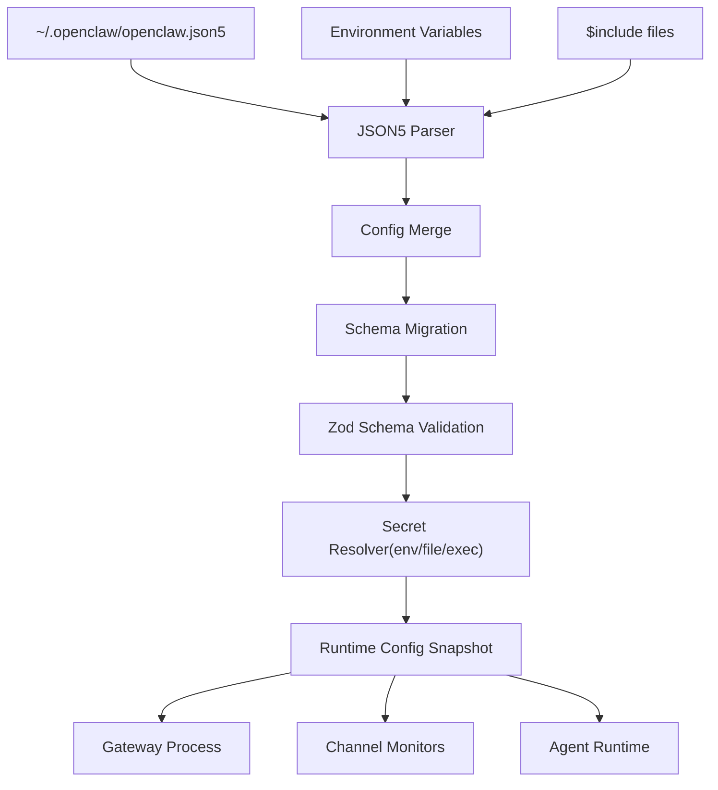
**Key Code Paths:**

-   Config loading: [src/config/config.ts](https://github.com/openclaw/openclaw/blob/8873e13f/src/config/config.ts)
-   Schema validation: [src/config/zod-schema.providers-core.ts](https://github.com/openclaw/openclaw/blob/8873e13f/src/config/zod-schema.providers-core.ts)
-   Secret resolution: [src/config/types.secrets.ts](https://github.com/openclaw/openclaw/blob/8873e13f/src/config/types.secrets.ts)
-   Hot reload: [src/gateway/reload.ts](https://github.com/openclaw/openclaw/blob/8873e13f/src/gateway/reload.ts)

**Sources:** [src/config/config.ts1-100](https://github.com/openclaw/openclaw/blob/8873e13f/src/config/config.ts#L1-L100) [src/config/zod-schema.providers-core.ts1-100](https://github.com/openclaw/openclaw/blob/8873e13f/src/config/zod-schema.providers-core.ts#L1-L100)

---

## Channel-Specific Configuration Deep Dive

### Telegram Configuration Code Mapping

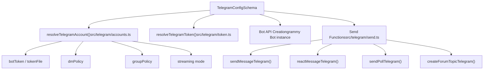
**Sources:** [src/telegram/send.ts1-100](https://github.com/openclaw/openclaw/blob/8873e13f/src/telegram/send.ts#L1-L100) [src/telegram/accounts.ts1-50](https://github.com/openclaw/openclaw/blob/8873e13f/src/telegram/accounts.ts#L1-L50)

### Discord Configuration Code Mapping

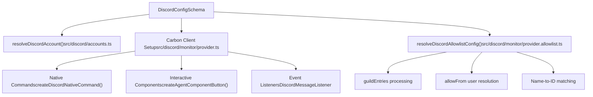
**Sources:** [src/discord/monitor/provider.ts1-300](https://github.com/openclaw/openclaw/blob/8873e13f/src/discord/monitor/provider.ts#L1-L300) [src/discord/accounts.ts1-50](https://github.com/openclaw/openclaw/blob/8873e13f/src/discord/accounts.ts#L1-L50)

### Slack Configuration Code Mapping

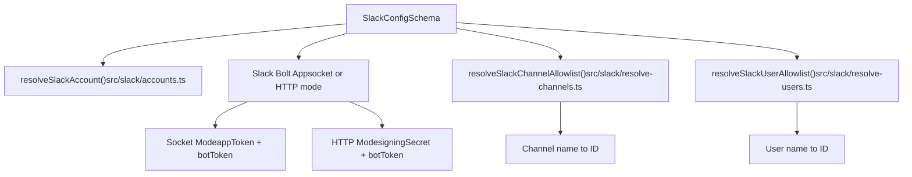
**Sources:** [src/slack/monitor/provider.ts1-200](https://github.com/openclaw/openclaw/blob/8873e13f/src/slack/monitor/provider.ts#L1-L200) [src/slack/accounts.ts1-50](https://github.com/openclaw/openclaw/blob/8873e13f/src/slack/accounts.ts#L1-L50)

---

## Tool Configuration Code Mapping

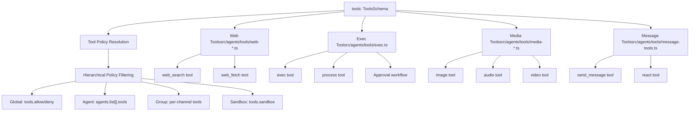
**Sources:** [src/agents/tools/web-search.ts1-50](https://github.com/openclaw/openclaw/blob/8873e13f/src/agents/tools/web-search.ts#L1-L50) [src/agents/tools/exec.ts1-100](https://github.com/openclaw/openclaw/blob/8873e13f/src/agents/tools/exec.ts#L1-L100)

---

## Multi-Account Configuration Pattern

All channels support multi-account configuration following this pattern:

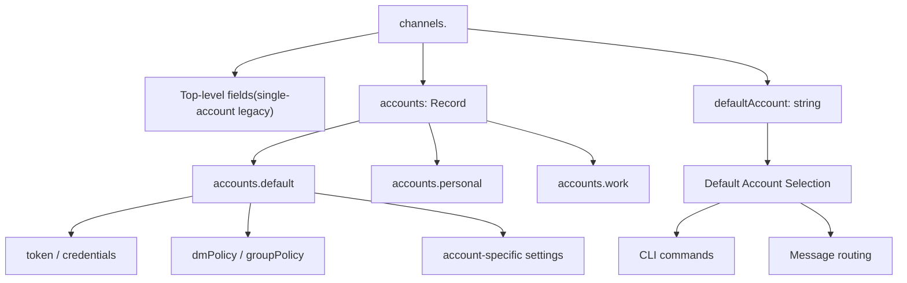
**Account Resolution Order:**

1.  Explicit `accountId` parameter in CLI/API
2.  Configured `channels.<provider>.defaultAccount`
3.  Account named `"default"` in `channels.<provider>.accounts`
4.  First account (alphabetically sorted) in `channels.<provider>.accounts`
5.  Top-level single-account config (legacy path)

**Sources:** [src/telegram/accounts.ts1-100](https://github.com/openclaw/openclaw/blob/8873e13f/src/telegram/accounts.ts#L1-L100) [src/discord/accounts.ts1-100](https://github.com/openclaw/openclaw/blob/8873e13f/src/discord/accounts.ts#L1-L100) [src/slack/accounts.ts1-100](https://github.com/openclaw/openclaw/blob/8873e13f/src/slack/accounts.ts#L1-L100)

---

## Field-Level Help and Labels

The codebase maintains comprehensive metadata for all config fields:

-   **Help Text**: [src/config/schema.help.ts1-1000](https://github.com/openclaw/openclaw/blob/8873e13f/src/config/schema.help.ts#L1-L1000) - Detailed descriptions for each field
-   **Field Labels**: [src/config/schema.labels.ts1-1000](https://github.com/openclaw/openclaw/blob/8873e13f/src/config/schema.labels.ts#L1-L1000) - Human-readable labels for UI/CLI display
-   **Zod Schemas**: [src/config/zod-schema.\*.ts](https://github.com/openclaw/openclaw/blob/8873e13f/src/config/zod-schema.*.ts) - Type-safe validation schemas

**Example Field Documentation Pattern:**

```
// From schema.help.tsexport const FIELD_HELP: Record<string, string> = {  "channels.telegram.streaming":     "Live stream preview mode: 'off' disables streaming, 'partial' streams " +    "text in real-time via draft API or message edits, 'block' uses block " +    "streaming with coalesced chunks, 'progress' maps to 'partial' on Telegram.",    "channels.discord.threadBindings.idleHours":    "Discord override for inactivity auto-unfocus in hours (0 disables). " +    "When a thread-bound session is idle for this duration, the binding is " +    "automatically removed."};
```
**Sources:** [src/config/schema.help.ts1-1000](https://github.com/openclaw/openclaw/blob/8873e13f/src/config/schema.help.ts#L1-L1000) [src/config/schema.labels.ts1-1000](https://github.com/openclaw/openclaw/blob/8873e13f/src/config/schema.labels.ts#L1-L1000)

---

This configuration reference covers all major sections and fields in the OpenClaw configuration file. For runtime behavior and validation pipeline details, see [Configuration System](/openclaw/openclaw/2.3-configuration-system). For channel-specific setup and behavior, see [Channels](/openclaw/openclaw/4-channels).
