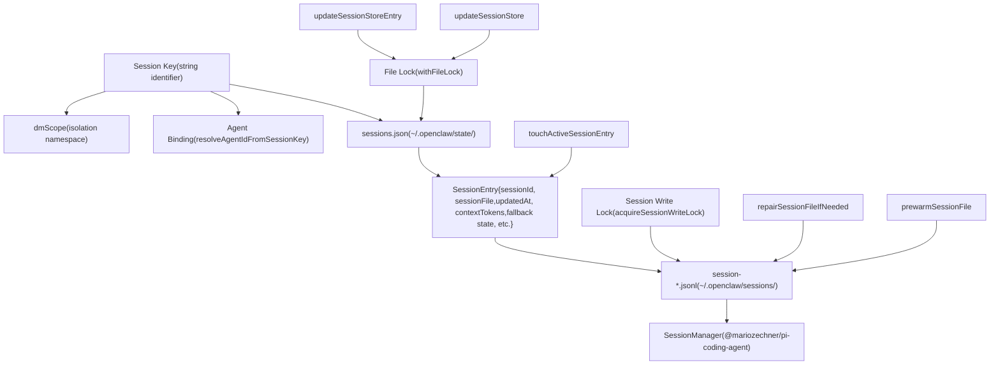
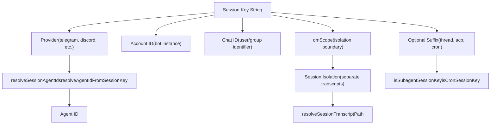
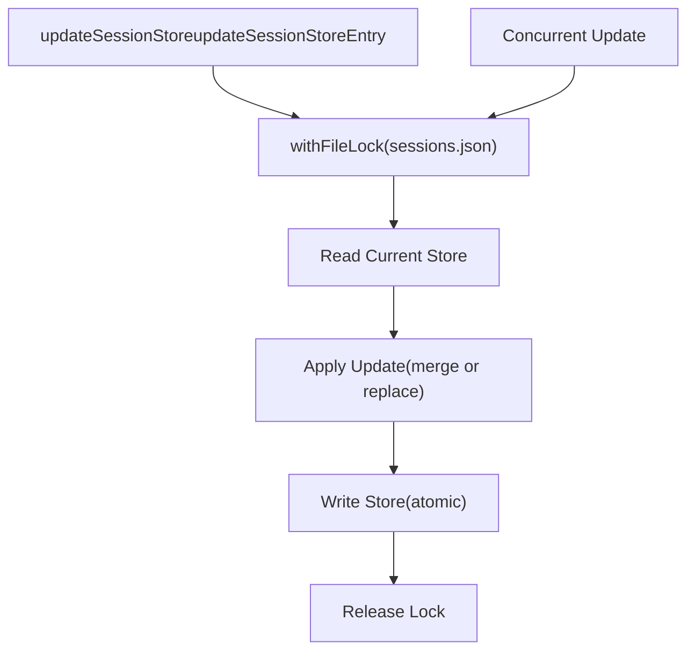
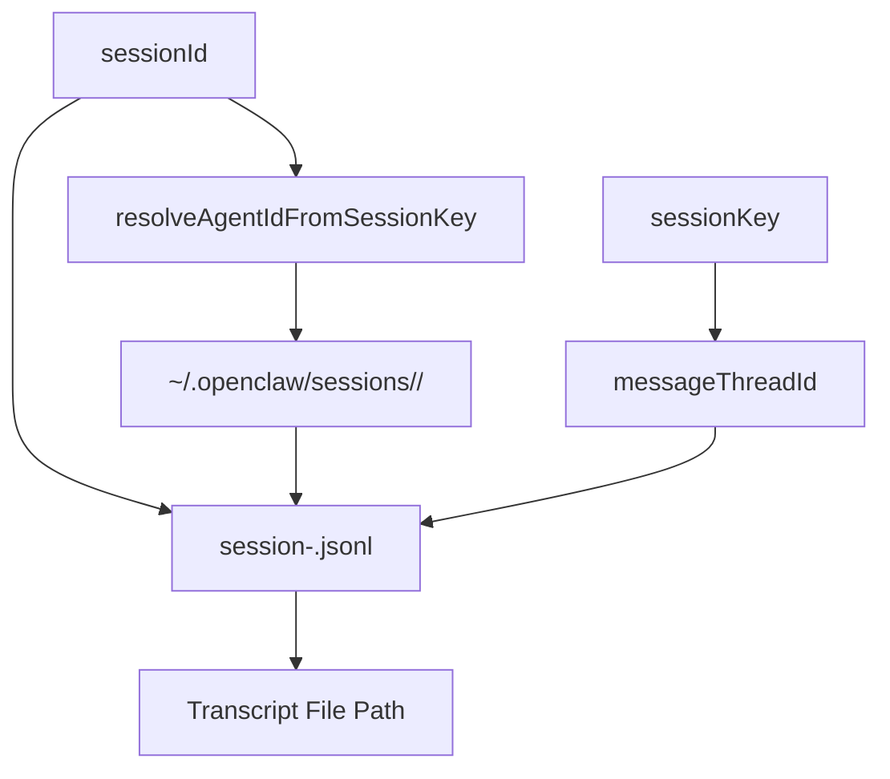
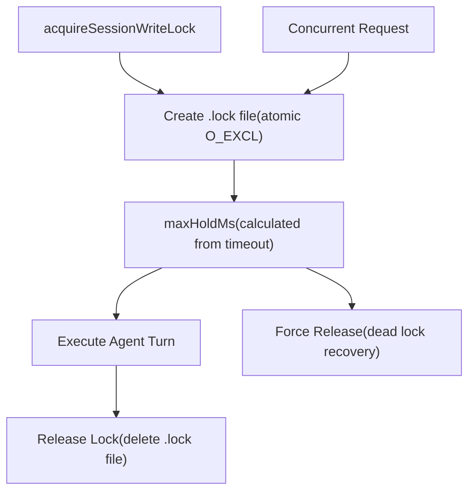
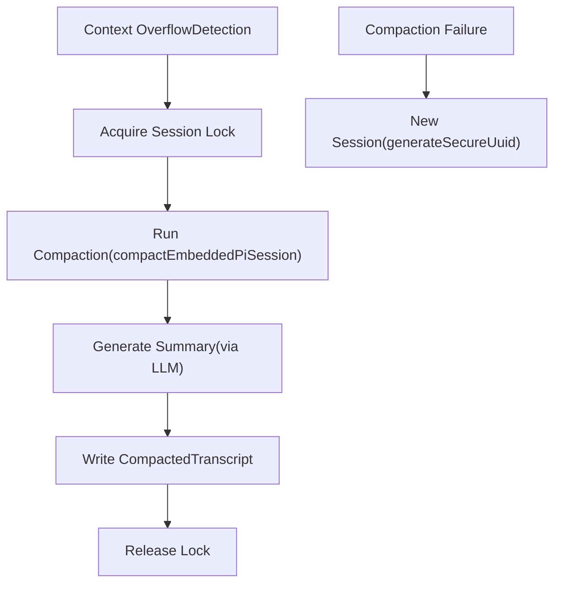
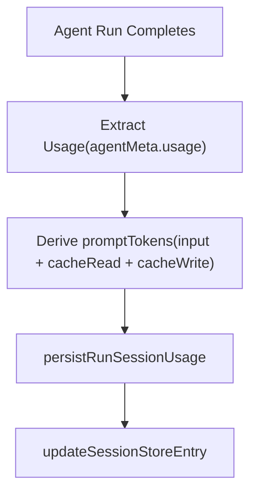

# Session Management

Relevant source files

-   [apps/macos/Sources/OpenClawProtocol/GatewayModels.swift](https://github.com/openclaw/openclaw/blob/8873e13f/apps/macos/Sources/OpenClawProtocol/GatewayModels.swift)
-   [apps/shared/OpenClawKit/Sources/OpenClawProtocol/GatewayModels.swift](https://github.com/openclaw/openclaw/blob/8873e13f/apps/shared/OpenClawKit/Sources/OpenClawProtocol/GatewayModels.swift)
-   [docs/concepts/typing-indicators.md](https://github.com/openclaw/openclaw/blob/8873e13f/docs/concepts/typing-indicators.md)
-   [docs/experiments/onboarding-config-protocol.md](https://github.com/openclaw/openclaw/blob/8873e13f/docs/experiments/onboarding-config-protocol.md)
-   [scripts/protocol-gen-swift.ts](https://github.com/openclaw/openclaw/blob/8873e13f/scripts/protocol-gen-swift.ts)
-   [src/agents/auth-profiles.runtime-snapshot-save.test.ts](https://github.com/openclaw/openclaw/blob/8873e13f/src/agents/auth-profiles.runtime-snapshot-save.test.ts)
-   [src/agents/auth-profiles/oauth.openai-codex-refresh-fallback.test.ts](https://github.com/openclaw/openclaw/blob/8873e13f/src/agents/auth-profiles/oauth.openai-codex-refresh-fallback.test.ts)
-   [src/agents/auth-profiles/oauth.test.ts](https://github.com/openclaw/openclaw/blob/8873e13f/src/agents/auth-profiles/oauth.test.ts)
-   [src/agents/auth-profiles/oauth.ts](https://github.com/openclaw/openclaw/blob/8873e13f/src/agents/auth-profiles/oauth.ts)
-   [src/agents/openclaw-gateway-tool.test.ts](https://github.com/openclaw/openclaw/blob/8873e13f/src/agents/openclaw-gateway-tool.test.ts)
-   [src/agents/pi-embedded-runner/compact.ts](https://github.com/openclaw/openclaw/blob/8873e13f/src/agents/pi-embedded-runner/compact.ts)
-   [src/agents/pi-embedded-runner/run.ts](https://github.com/openclaw/openclaw/blob/8873e13f/src/agents/pi-embedded-runner/run.ts)
-   [src/agents/pi-embedded-runner/run/attempt.ts](https://github.com/openclaw/openclaw/blob/8873e13f/src/agents/pi-embedded-runner/run/attempt.ts)
-   [src/agents/pi-embedded-runner/run/params.ts](https://github.com/openclaw/openclaw/blob/8873e13f/src/agents/pi-embedded-runner/run/params.ts)
-   [src/agents/pi-embedded-runner/run/types.ts](https://github.com/openclaw/openclaw/blob/8873e13f/src/agents/pi-embedded-runner/run/types.ts)
-   [src/agents/pi-embedded-runner/system-prompt.ts](https://github.com/openclaw/openclaw/blob/8873e13f/src/agents/pi-embedded-runner/system-prompt.ts)
-   [src/agents/tools/gateway-tool.ts](https://github.com/openclaw/openclaw/blob/8873e13f/src/agents/tools/gateway-tool.ts)
-   [src/auto-reply/reply/agent-runner-execution.ts](https://github.com/openclaw/openclaw/blob/8873e13f/src/auto-reply/reply/agent-runner-execution.ts)
-   [src/auto-reply/reply/agent-runner-memory.ts](https://github.com/openclaw/openclaw/blob/8873e13f/src/auto-reply/reply/agent-runner-memory.ts)
-   [src/auto-reply/reply/agent-runner-utils.test.ts](https://github.com/openclaw/openclaw/blob/8873e13f/src/auto-reply/reply/agent-runner-utils.test.ts)
-   [src/auto-reply/reply/agent-runner-utils.ts](https://github.com/openclaw/openclaw/blob/8873e13f/src/auto-reply/reply/agent-runner-utils.ts)
-   [src/auto-reply/reply/agent-runner.ts](https://github.com/openclaw/openclaw/blob/8873e13f/src/auto-reply/reply/agent-runner.ts)
-   [src/auto-reply/reply/followup-runner.ts](https://github.com/openclaw/openclaw/blob/8873e13f/src/auto-reply/reply/followup-runner.ts)
-   [src/auto-reply/reply/test-helpers.ts](https://github.com/openclaw/openclaw/blob/8873e13f/src/auto-reply/reply/test-helpers.ts)
-   [src/auto-reply/reply/typing-mode.ts](https://github.com/openclaw/openclaw/blob/8873e13f/src/auto-reply/reply/typing-mode.ts)
-   [src/browser/control-auth.auto-token.test.ts](https://github.com/openclaw/openclaw/blob/8873e13f/src/browser/control-auth.auto-token.test.ts)
-   [src/browser/control-auth.test.ts](https://github.com/openclaw/openclaw/blob/8873e13f/src/browser/control-auth.test.ts)
-   [src/browser/control-auth.ts](https://github.com/openclaw/openclaw/blob/8873e13f/src/browser/control-auth.ts)
-   [src/config/schema.test.ts](https://github.com/openclaw/openclaw/blob/8873e13f/src/config/schema.test.ts)
-   [src/discord/monitor/thread-bindings.shared-state.test.ts](https://github.com/openclaw/openclaw/blob/8873e13f/src/discord/monitor/thread-bindings.shared-state.test.ts)
-   [src/gateway/method-scopes.test.ts](https://github.com/openclaw/openclaw/blob/8873e13f/src/gateway/method-scopes.test.ts)
-   [src/gateway/method-scopes.ts](https://github.com/openclaw/openclaw/blob/8873e13f/src/gateway/method-scopes.ts)
-   [src/gateway/protocol/index.ts](https://github.com/openclaw/openclaw/blob/8873e13f/src/gateway/protocol/index.ts)
-   [src/gateway/protocol/schema.ts](https://github.com/openclaw/openclaw/blob/8873e13f/src/gateway/protocol/schema.ts)
-   [src/gateway/protocol/schema/config.ts](https://github.com/openclaw/openclaw/blob/8873e13f/src/gateway/protocol/schema/config.ts)
-   [src/gateway/protocol/schema/protocol-schemas.ts](https://github.com/openclaw/openclaw/blob/8873e13f/src/gateway/protocol/schema/protocol-schemas.ts)
-   [src/gateway/protocol/schema/types.ts](https://github.com/openclaw/openclaw/blob/8873e13f/src/gateway/protocol/schema/types.ts)
-   [src/gateway/server-methods-list.ts](https://github.com/openclaw/openclaw/blob/8873e13f/src/gateway/server-methods-list.ts)
-   [src/gateway/server-methods.ts](https://github.com/openclaw/openclaw/blob/8873e13f/src/gateway/server-methods.ts)
-   [src/gateway/server-methods/config.ts](https://github.com/openclaw/openclaw/blob/8873e13f/src/gateway/server-methods/config.ts)
-   [src/gateway/server-methods/restart-request.ts](https://github.com/openclaw/openclaw/blob/8873e13f/src/gateway/server-methods/restart-request.ts)
-   [src/gateway/server-methods/update.ts](https://github.com/openclaw/openclaw/blob/8873e13f/src/gateway/server-methods/update.ts)
-   [src/gateway/server.config-patch.test.ts](https://github.com/openclaw/openclaw/blob/8873e13f/src/gateway/server.config-patch.test.ts)
-   [src/gateway/server.ts](https://github.com/openclaw/openclaw/blob/8873e13f/src/gateway/server.ts)
-   [src/gateway/startup-auth.test.ts](https://github.com/openclaw/openclaw/blob/8873e13f/src/gateway/startup-auth.test.ts)
-   [src/gateway/startup-auth.ts](https://github.com/openclaw/openclaw/blob/8873e13f/src/gateway/startup-auth.ts)

## Purpose and Scope

This document describes OpenClaw's session management system: how conversations are identified, isolated, persisted, and synchronized across the Gateway and Agent execution layers. Sessions maintain conversation history, track agent state, and ensure safe concurrent access through file-based locking.

For information about how sessions are created and routed from inbound channel messages, see [Message Flow and Agent Turn Execution](/openclaw/openclaw/2-gateway). For details on the session storage format and repair mechanisms, see the transcript sections below.

---

## Session Architecture Overview

Sessions are the fundamental unit of conversation state in OpenClaw. Each session represents a distinct conversation thread (DM, group chat, or internal interaction) and maintains its own transcript, metadata, and execution context.


**Sources:** [src/config/sessions.ts](https://github.com/openclaw/openclaw/blob/8873e13f/src/config/sessions.ts) [src/agents/session-write-lock.ts](https://github.com/openclaw/openclaw/blob/8873e13f/src/agents/session-write-lock.ts) [src/agents/pi-embedded-runner/run/attempt.ts536-541](https://github.com/openclaw/openclaw/blob/8873e13f/src/agents/pi-embedded-runner/run/attempt.ts#L536-L541) [src/auto-reply/reply/agent-runner.ts181-195](https://github.com/openclaw/openclaw/blob/8873e13f/src/auto-reply/reply/agent-runner.ts#L181-L195)

---

## Session Keys and Identification

### Session Key Format

Session keys are structured string identifiers that encode the routing and isolation context for a conversation:

```
<provider>:<accountId>:<chatId>:<dmScope>
```
Additional suffixes may be appended for specialized session types:

-   **Thread sessions:** `:thread:<threadId>` or `:topic:<topicId>`
-   **Subagent sessions:** `:acp:<subagentName>`
-   **Cron sessions:** `:cron:<jobId>`


**Sources:** [src/routing/session-key.ts](https://github.com/openclaw/openclaw/blob/8873e13f/src/routing/session-key.ts) [src/agents/agent-scope.ts](https://github.com/openclaw/openclaw/blob/8873e13f/src/agents/agent-scope.ts#LNaN-LNaN) [src/config/sessions.ts](https://github.com/openclaw/openclaw/blob/8873e13f/src/config/sessions.ts#LNaN-LNaN)

### dmScope Isolation

The `dmScope` component isolates sessions to prevent cross-contamination. Different dmScope values create entirely separate conversation contexts even for the same user and provider:

| dmScope Value | Purpose |
| --- | --- |
| `dm` | Standard direct message sessions |
| `group` | Group chat sessions |
| `internal` | Internal system sessions (Control UI, CLI) |
| `cron` | Scheduled job sessions |
| `acp` | Agent Control Plane (subagent) sessions |

**Sources:** [src/routing/session-key.ts](https://github.com/openclaw/openclaw/blob/8873e13f/src/routing/session-key.ts) [src/agents/pi-embedded-runner/run/attempt.ts606-611](https://github.com/openclaw/openclaw/blob/8873e13f/src/agents/pi-embedded-runner/run/attempt.ts#L606-L611)

---

## Session Store and Registry

### SessionEntry Structure

The session store maintains a registry mapping session keys to their metadata. Each `SessionEntry` contains:

```
type SessionEntry = {  sessionId: string;              // Unique session UUID  sessionFile: string;            // Path to JSONL transcript  updatedAt: number;              // Last activity timestamp (ms)  createdAt?: number;             // Session creation timestamp  contextTokens?: number;         // Model context window size  systemSent?: boolean;           // Whether system intro was sent  abortedLastRun?: boolean;       // Last run was aborted  totalTokens?: number;           // Cumulative usage tokens  promptTokens?: number;          // Last prompt tokens  fallbackNoticeSelectedModel?: string;  // Fallback tracking  fallbackNoticeActiveModel?: string;  fallbackNoticeReason?: string;  compactionCount?: number;       // Auto-compaction counter  groupActivationNeedsSystemIntro?: boolean;  systemPromptReport?: object;    // Last system prompt metadata  cliSessionId?: string;          // CLI provider session tracking};
```
**Sources:** [src/config/sessions.ts](https://github.com/openclaw/openclaw/blob/8873e13f/src/config/sessions.ts) [src/auto-reply/reply/agent-runner.ts256-284](https://github.com/openclaw/openclaw/blob/8873e13f/src/auto-reply/reply/agent-runner.ts#L256-L284)

### Persistent Store File

The session store is persisted to `~/.openclaw/state/sessions.json`. All updates acquire a file lock to ensure atomicity:


**Sources:** [src/config/sessions.ts](https://github.com/openclaw/openclaw/blob/8873e13f/src/config/sessions.ts#LNaN-LNaN) [src/auto-reply/reply/agent-runner.ts189-194](https://github.com/openclaw/openclaw/blob/8873e13f/src/auto-reply/reply/agent-runner.ts#L189-L194) [src/infra/file-lock.ts](https://github.com/openclaw/openclaw/blob/8873e13f/src/infra/file-lock.ts)

### Session Store Operations

| Function | Purpose |
| --- | --- |
| `updateSessionStore` | Update entire store with atomic callback |
| `updateSessionStoreEntry` | Update single session entry |
| `touchActiveSessionEntry` | Update `updatedAt` timestamp |
| `resolveSessionFilePath` | Resolve transcript file path from entry |
| `resolveSessionTranscriptPath` | Generate transcript path from sessionId |

**Sources:** [src/config/sessions.ts](https://github.com/openclaw/openclaw/blob/8873e13f/src/config/sessions.ts) [src/auto-reply/reply/agent-runner.ts181-195](https://github.com/openclaw/openclaw/blob/8873e13f/src/auto-reply/reply/agent-runner.ts#L181-L195)

---

## Session Transcripts

### JSONL Format

Session transcripts are stored as newline-delimited JSON (JSONL) files in `~/.openclaw/sessions/`. Each line represents a message in the conversation history:

```
{"sessionId":"uuid","role":"user","content":"Hello","timestamp":1234567890}{"sessionId":"uuid","role":"assistant","content":"Hi there","timestamp":1234567891}{"sessionId":"uuid","role":"toolCall","name":"exec","arguments":{"command":"ls"},"timestamp":1234567892}{"sessionId":"uuid","role":"toolResult","name":"exec","content":"file1.txt","timestamp":1234567893}
```
The transcript format follows the Pi agent message schema with OpenClaw-specific extensions for tool execution metadata.

**Sources:** [src/agents/pi-embedded-runner/run/attempt.ts](https://github.com/openclaw/openclaw/blob/8873e13f/src/agents/pi-embedded-runner/run/attempt.ts) [@mariozechner/pi-coding-agent SessionManager](https://github.com/openclaw/openclaw/blob/8873e13f/@mariozechner/pi-coding-agent SessionManager)

### Transcript Paths and Resolution


**Sources:** [src/config/sessions.ts](https://github.com/openclaw/openclaw/blob/8873e13f/src/config/sessions.ts#LNaN-LNaN) [src/agents/agent-paths.ts](https://github.com/openclaw/openclaw/blob/8873e13f/src/agents/agent-paths.ts)

### Transcript Repair

The system automatically repairs corrupted transcript files before opening them:

> **[Mermaid sequence]**
> *(图表结构无法解析)*

**Sources:** [src/agents/session-file-repair.ts](https://github.com/openclaw/openclaw/blob/8873e13f/src/agents/session-file-repair.ts) [src/agents/pi-embedded-runner/run/attempt.ts543-546](https://github.com/openclaw/openclaw/blob/8873e13f/src/agents/pi-embedded-runner/run/attempt.ts#L543-L546)

---

## File-Based Locking

### Lock Acquisition and Hold Time

OpenClaw uses file-based locking to serialize access to session transcripts during agent turns. This prevents race conditions when multiple requests target the same session:


**Lock hold time calculation:**

```
maxHoldMs = timeoutMs + LOCK_HOLD_BUFFER_MS
```
Where `LOCK_HOLD_BUFFER_MS` provides additional margin to prevent premature lock expiration during slow operations (compaction, tool execution).

**Sources:** [src/agents/session-write-lock.ts](https://github.com/openclaw/openclaw/blob/8873e13f/src/agents/session-write-lock.ts#LNaN-LNaN) [src/agents/session-write-lock.ts](https://github.com/openclaw/openclaw/blob/8873e13f/src/agents/session-write-lock.ts#LNaN-LNaN) [src/agents/pi-embedded-runner/run/attempt.ts536-541](https://github.com/openclaw/openclaw/blob/8873e13f/src/agents/pi-embedded-runner/run/attempt.ts#L536-L541)

### Lock Scope and Guarantees

Session write locks guarantee:

-   **Mutual exclusion:** Only one agent turn executes per session at a time
-   **Deadlock prevention:** Lock expiration with configurable `maxHoldMs`
-   **Transcript consistency:** Prevents interleaved message writes

The lock file path is derived from the transcript path:

```
<transcript-path>.lock
```
**Sources:** [src/agents/session-write-lock.ts](https://github.com/openclaw/openclaw/blob/8873e13f/src/agents/session-write-lock.ts) [src/infra/file-lock.ts](https://github.com/openclaw/openclaw/blob/8873e13f/src/infra/file-lock.ts)

---

## Session Lifecycle

### Creation and Initialization

Sessions are created lazily when the first message arrives for a new session key:

> **[Mermaid sequence]**
> *(图表结构无法解析)*

**Sources:** [src/auto-reply/reply/agent-runner.ts63-93](https://github.com/openclaw/openclaw/blob/8873e13f/src/auto-reply/reply/agent-runner.ts#L63-L93) [src/config/sessions.ts](https://github.com/openclaw/openclaw/blob/8873e13f/src/config/sessions.ts)

### Active Session Updates

During an agent turn, the session entry is updated to track:

```
// Touch session to update activity timestampawait updateSessionStoreEntry({  storePath,  sessionKey,  update: async () => ({ updatedAt: Date.now() }),}); // Persist usage after turn completionawait persistRunSessionUsage({  storePath,  sessionKey,  usage,  lastCallUsage,  promptTokens,  modelUsed,  providerUsed,  contextTokensUsed,  systemPromptReport,});
```
**Sources:** [src/auto-reply/reply/agent-runner.ts189-194](https://github.com/openclaw/openclaw/blob/8873e13f/src/auto-reply/reply/agent-runner.ts#L189-L194) [src/auto-reply/reply/session-run-accounting.ts](https://github.com/openclaw/openclaw/blob/8873e13f/src/auto-reply/reply/session-run-accounting.ts#LNaN-LNaN)

### Session Compaction

When conversation history exceeds the model's context window, auto-compaction triggers to summarize older messages:


**Compaction triggers auto-increment of `compactionCount` in the session entry.**

**Sources:** [src/agents/pi-embedded-runner/compact.ts](https://github.com/openclaw/openclaw/blob/8873e13f/src/agents/pi-embedded-runner/compact.ts) [src/auto-reply/reply/agent-runner.ts328-340](https://github.com/openclaw/openclaw/blob/8873e13f/src/auto-reply/reply/agent-runner.ts#L328-L340) [src/auto-reply/reply/session-run-accounting.ts](https://github.com/openclaw/openclaw/blob/8873e13f/src/auto-reply/reply/session-run-accounting.ts#LNaN-LNaN)

### Session Reset and Deletion

Sessions can be reset (new transcript, same key) or deleted entirely:

| Operation | Effect | API Method |
| --- | --- | --- |
| **Reset** | Generates new `sessionId`, preserves key | `sessions.reset` |
| **Delete** | Removes entry and transcript file | `sessions.delete` |
| **Cleanup** | Removes orphaned/expired sessions | Auto-cleanup on store load |

**Reset implementation:**

```
const nextSessionId = generateSecureUuid();const nextEntry: SessionEntry = {  ...prevEntry,  sessionId: nextSessionId,  updatedAt: Date.now(),  systemSent: false,  abortedLastRun: false,  fallbackNotice* fields cleared};
```
**Sources:** [src/auto-reply/reply/agent-runner.ts256-340](https://github.com/openclaw/openclaw/blob/8873e13f/src/auto-reply/reply/agent-runner.ts#L256-L340) [src/gateway/server-methods/sessions.ts](https://github.com/openclaw/openclaw/blob/8873e13f/src/gateway/server-methods/sessions.ts)

---

## Session Operations (RPC Methods)

The Gateway exposes session management through RPC methods accessible via WebSocket protocol:

### sessions.list

**Request:**

```
{  method: "sessions.list",  params: {    agentId?: string;    dmScope?: string;    limit?: number;    offset?: number;  }}
```
**Response:**

```
{  sessions: Array<{    sessionKey: string;    sessionId: string;    updatedAt: number;    totalTokens?: number;    agentId: string;    messageChannel?: string;  }>;  total: number;}
```
**Sources:** [src/gateway/protocol/schema/sessions.ts](https://github.com/openclaw/openclaw/blob/8873e13f/src/gateway/protocol/schema/sessions.ts) [src/gateway/server-methods/sessions.ts](https://github.com/openclaw/openclaw/blob/8873e13f/src/gateway/server-methods/sessions.ts)

### sessions.preview

Retrieves the last N messages from a session transcript without loading the full history:

```
{  method: "sessions.preview",  params: {    sessionKey: string;    limit?: number;  // Default: 10  }}
```
**Sources:** [src/gateway/server-methods/sessions.ts](https://github.com/openclaw/openclaw/blob/8873e13f/src/gateway/server-methods/sessions.ts)

### sessions.patch

Updates session metadata without modifying the transcript:

```
{  method: "sessions.patch",  params: {    sessionKey: string;    updates: {      contextTokens?: number;      totalTokens?: number;      responseUsage?: "off" | "minimal" | "full";      // ... other SessionEntry fields    }  }}
```
**Returns:** `SessionsPatchResult` with updated entry.

**Sources:** [src/gateway/protocol/schema/sessions.ts](https://github.com/openclaw/openclaw/blob/8873e13f/src/gateway/protocol/schema/sessions.ts) [src/gateway/session-utils.types.ts](https://github.com/openclaw/openclaw/blob/8873e13f/src/gateway/session-utils.types.ts)

### sessions.reset

Resets a session by generating a new `sessionId` and creating a fresh transcript:

```
{  method: "sessions.reset",  params: {    sessionKey: string;    preserveMetadata?: boolean;  }}
```
**Cleanup behavior:** Optionally deletes the old transcript file.

**Sources:** [src/gateway/server-methods/sessions.ts](https://github.com/openclaw/openclaw/blob/8873e13f/src/gateway/server-methods/sessions.ts) [src/auto-reply/reply/agent-runner.ts261-327](https://github.com/openclaw/openclaw/blob/8873e13f/src/auto-reply/reply/agent-runner.ts#L261-L327)

### sessions.delete

Permanently removes a session entry and its transcript file:

```
{  method: "sessions.delete",  params: {    sessionKey: string;  }}
```
**Sources:** [src/gateway/server-methods/sessions.ts](https://github.com/openclaw/openclaw/blob/8873e13f/src/gateway/server-methods/sessions.ts)

### sessions.compact

Manually triggers compaction for a session (normally happens automatically):

```
{  method: "sessions.compact",  params: {    sessionKey: string;    force?: boolean;    tokenBudget?: number;  }}
```
**Response:**

```
{  ok: boolean;  compacted: boolean;  reason?: string;  messagesBefore?: number;  messagesAfter?: number;}
```
**Sources:** [src/gateway/protocol/schema/sessions.ts](https://github.com/openclaw/openclaw/blob/8873e13f/src/gateway/protocol/schema/sessions.ts) [src/gateway/server-methods/sessions.ts](https://github.com/openclaw/openclaw/blob/8873e13f/src/gateway/server-methods/sessions.ts)

---

## Session Metadata and State Tracking

### Usage Accounting

Sessions track token usage across turns to enable accurate context window management:

```
type UsageSnapshot = {  totalTokens: number;        // Cumulative usage  promptTokens: number;       // Last call prompt tokens  contextTokens: number;      // Model context window size};
```
**Usage persistence flow:**


**Sources:** [src/auto-reply/reply/session-run-accounting.ts](https://github.com/openclaw/openclaw/blob/8873e13f/src/auto-reply/reply/session-run-accounting.ts#LNaN-LNaN) [src/agents/usage.ts](https://github.com/openclaw/openclaw/blob/8873e13f/src/agents/usage.ts)

### Fallback State

When model fallback occurs (provider unavailable, rate limit, etc.), the session tracks the transition:

```
{  fallbackNoticeSelectedModel: "anthropic/claude-3-5-sonnet",  fallbackNoticeActiveModel: "openai/gpt-4o",  fallbackNoticeReason: "rate_limit"}
```
This state persists until the selected model becomes available again, allowing the system to display informative notices to users.

**Sources:** [src/auto-reply/reply/agent-runner.ts422-454](https://github.com/openclaw/openclaw/blob/8873e13f/src/auto-reply/reply/agent-runner.ts#L422-L454) [src/auto-reply/fallback-state.ts](https://github.com/openclaw/openclaw/blob/8873e13f/src/auto-reply/fallback-state.ts)

### System Prompt Reporting

The `systemPromptReport` field stores metadata about the system prompt used in the last turn:

```
type SessionSystemPromptReport = {  promptCharacters: number;  bootstrapFilesInjected: number;  skillsPromptIncluded: boolean;  contextFilesInjected: number;  truncationWarnings?: string[];  // ... additional metadata};
```
This enables diagnostics and debugging of context window budget issues.

**Sources:** [src/config/sessions/types.ts](https://github.com/openclaw/openclaw/blob/8873e13f/src/config/sessions/types.ts) [src/agents/system-prompt-report.ts](https://github.com/openclaw/openclaw/blob/8873e13f/src/agents/system-prompt-report.ts)

---

## Session Manager Integration

### SessionManager Lifecycle

The `SessionManager` class from `@mariozechner/pi-coding-agent` provides the low-level interface to transcript files:

> **[Mermaid sequence]**
> *(图表结构无法解析)*

**Sources:** [src/agents/pi-embedded-runner/run/attempt.ts536-605](https://github.com/openclaw/openclaw/blob/8873e13f/src/agents/pi-embedded-runner/run/attempt.ts#L536-L605) [@mariozechner/pi-coding-agent](https://github.com/openclaw/openclaw/blob/8873e13f/@mariozechner/pi-coding-agent)

### Guard Wrappers

The `guardSessionManager` wrapper adds OpenClaw-specific safety checks:

```
const sessionManager = guardSessionManager(  SessionManager.open(sessionFile),  {    agentId: sessionAgentId,    sessionKey: params.sessionKey,    allowSyntheticToolResults: transcriptPolicy.allowSyntheticToolResults,    allowedToolNames,  });
```
Guards enforce:

-   Tool name allowlists (prevent unauthorized tool injection)
-   Synthetic tool result policies (some providers require real tool calls)
-   Transcript repair and validation

**Sources:** [src/agents/session-tool-result-guard-wrapper.ts](https://github.com/openclaw/openclaw/blob/8873e13f/src/agents/session-tool-result-guard-wrapper.ts) [src/agents/pi-embedded-runner/run/attempt.ts554-558](https://github.com/openclaw/openclaw/blob/8873e13f/src/agents/pi-embedded-runner/run/attempt.ts#L554-L558)

### Session Manager Caching

The `prewarmSessionFile` function implements an LRU cache to avoid redundant file reads:

```
const SESSION_CACHE_SIZE = 32;const sessionCache = new Map<string, { content: string; mtime: number }>(); async function prewarmSessionFile(path: string): Promise<void> {  const stats = await fs.stat(path);  const cached = sessionCache.get(path);  if (cached && cached.mtime === stats.mtimeMs) {    return; // Cache hit  }  const content = await fs.readFile(path, "utf-8");  sessionCache.set(path, { content, mtime: stats.mtimeMs });  // Evict oldest entries if cache exceeds size}
```
**Sources:** [src/agents/pi-embedded-runner/session-manager-cache.ts](https://github.com/openclaw/openclaw/blob/8873e13f/src/agents/pi-embedded-runner/session-manager-cache.ts) [src/agents/pi-embedded-runner/run/attempt.ts547](https://github.com/openclaw/openclaw/blob/8873e13f/src/agents/pi-embedded-runner/run/attempt.ts#L547-L547)

---

## Session Isolation and Security

### dmScope Boundaries

Sessions with different `dmScope` values are completely isolated:

| Scenario | Session Key Pattern | Isolation |
| --- | --- | --- |
| User DMs bot on Telegram | `telegram:bot1:user123:dm` | Separate from groups |
| Same user in group chat | `telegram:bot1:user123:group:chat456` | Separate transcript |
| Control UI interaction | `internal:webchat:session789:internal` | Separate from channels |
| Subagent spawned in DM | `telegram:bot1:user123:dm:acp:researcher` | Nested session |

**Access control:** The Gateway's routing layer enforces dmPolicy and groupPolicy before resolving session keys, preventing unauthorized cross-scope access.

**Sources:** [src/routing/session-key.ts](https://github.com/openclaw/openclaw/blob/8873e13f/src/routing/session-key.ts) [src/gateway/server.impl.ts](https://github.com/openclaw/openclaw/blob/8873e13f/src/gateway/server.impl.ts)

### Subagent Session Nesting

ACP (Agent Control Plane) subagents create nested sessions under their parent:

```
Parent:  telegram:bot1:user123:dm
Subagent: telegram:bot1:user123:dm:acp:researcher
```
The `isSubagentSessionKey` predicate identifies these sessions for special handling (minimal system prompts, thread binding persistence).

**Sources:** [src/routing/session-key.ts](https://github.com/openclaw/openclaw/blob/8873e13f/src/routing/session-key.ts#LNaN-LNaN) [src/agents/pi-embedded-runner/run/attempt.ts606-611](https://github.com/openclaw/openclaw/blob/8873e13f/src/agents/pi-embedded-runner/run/attempt.ts#L606-L611)

---

## Performance Considerations

### Lock Contention

High-frequency requests to the same session can cause lock contention. The system mitigates this through:

-   **Queue policies:** `mode: "enqueue"` defers followup turns until the active turn completes
-   **Lock timeouts:** Expired locks are force-released to prevent permanent deadlock
-   **Typing indicators:** Provide user feedback during long-running turns

**Sources:** [src/auto-reply/reply/queue-policy.ts](https://github.com/openclaw/openclaw/blob/8873e13f/src/auto-reply/reply/queue-policy.ts) [src/auto-reply/reply/agent-runner.ts206-223](https://github.com/openclaw/openclaw/blob/8873e13f/src/auto-reply/reply/agent-runner.ts#L206-L223)

### Transcript Size Growth

Large transcripts impact performance. OpenClaw manages this through:

-   **Auto-compaction:** Triggered when `estimateMessagesTokens()` exceeds context window
-   **History limits:** `dmHistoryLimit` configuration caps message retention
-   **Tool result truncation:** Oversized tool outputs are truncated before persistence

**Sources:** [src/agents/compaction.ts](https://github.com/openclaw/openclaw/blob/8873e13f/src/agents/compaction.ts) [src/agents/pi-embedded-runner/history.ts](https://github.com/openclaw/openclaw/blob/8873e13f/src/agents/pi-embedded-runner/history.ts) [src/agents/pi-embedded-runner/tool-result-truncation.ts](https://github.com/openclaw/openclaw/blob/8873e13f/src/agents/pi-embedded-runner/tool-result-truncation.ts)

### Session Store Size

The global `sessions.json` file can grow large with many active sessions. Cleanup strategies:

-   **Auto-expiry:** Sessions inactive beyond configured TTL are removed on load
-   **Manual deletion:** `sessions.delete` RPC method
-   **Agent-scoped isolation:** Each agent maintains separate session subdirectories

**Sources:** [src/config/sessions.ts](https://github.com/openclaw/openclaw/blob/8873e13f/src/config/sessions.ts)
