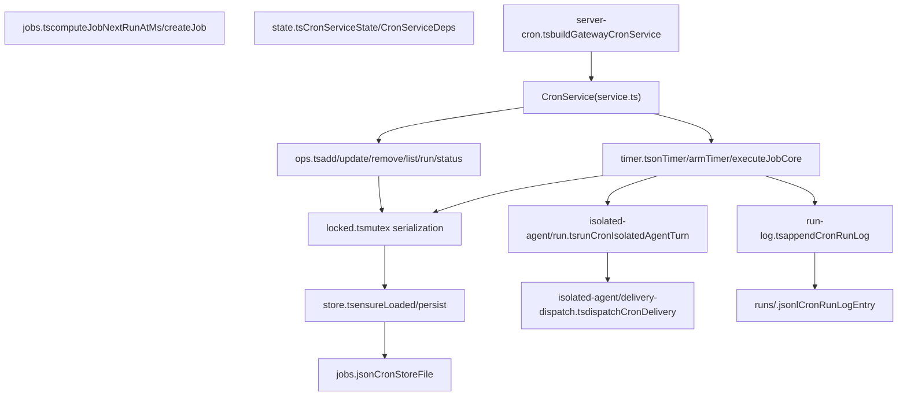
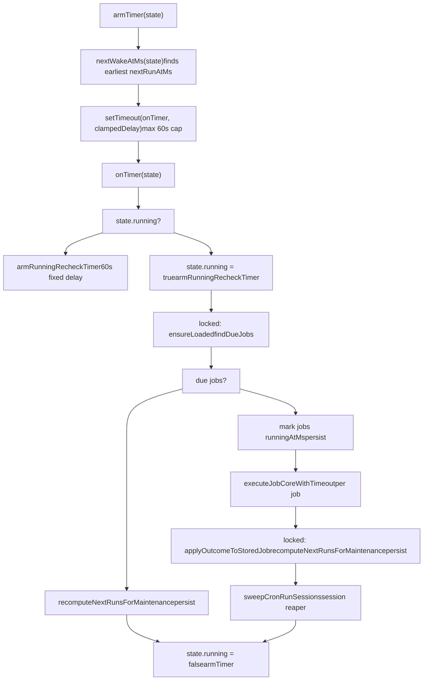
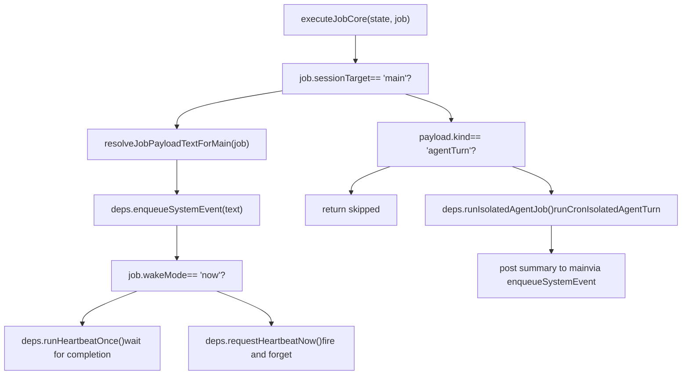
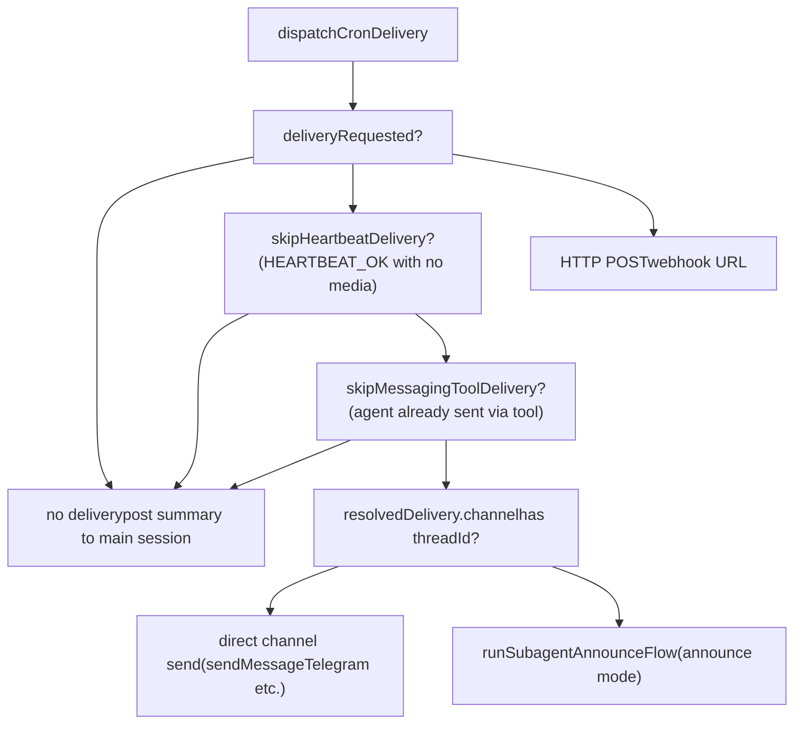

# Cron Service

Relevant source files

-   [CHANGELOG.md](https://github.com/openclaw/openclaw/blob/8873e13f/CHANGELOG.md)
-   [README.md](https://github.com/openclaw/openclaw/blob/8873e13f/README.md)
-   [apps/android/app/build.gradle.kts](https://github.com/openclaw/openclaw/blob/8873e13f/apps/android/app/build.gradle.kts)
-   [apps/ios/Sources/Info.plist](https://github.com/openclaw/openclaw/blob/8873e13f/apps/ios/Sources/Info.plist)
-   [apps/ios/Tests/Info.plist](https://github.com/openclaw/openclaw/blob/8873e13f/apps/ios/Tests/Info.plist)
-   [apps/ios/project.yml](https://github.com/openclaw/openclaw/blob/8873e13f/apps/ios/project.yml)
-   [apps/macos/Sources/OpenClaw/Resources/Info.plist](https://github.com/openclaw/openclaw/blob/8873e13f/apps/macos/Sources/OpenClaw/Resources/Info.plist)
-   [assets/avatar-placeholder.svg](https://github.com/openclaw/openclaw/blob/8873e13f/assets/avatar-placeholder.svg)
-   [docs/cli/index.md](https://github.com/openclaw/openclaw/blob/8873e13f/docs/cli/index.md)
-   [docs/gateway/configuration.md](https://github.com/openclaw/openclaw/blob/8873e13f/docs/gateway/configuration.md)
-   [docs/gateway/doctor.md](https://github.com/openclaw/openclaw/blob/8873e13f/docs/gateway/doctor.md)
-   [docs/gateway/index.md](https://github.com/openclaw/openclaw/blob/8873e13f/docs/gateway/index.md)
-   [docs/gateway/troubleshooting.md](https://github.com/openclaw/openclaw/blob/8873e13f/docs/gateway/troubleshooting.md)
-   [docs/index.md](https://github.com/openclaw/openclaw/blob/8873e13f/docs/index.md)
-   [docs/platforms/mac/release.md](https://github.com/openclaw/openclaw/blob/8873e13f/docs/platforms/mac/release.md)
-   [docs/start/getting-started.md](https://github.com/openclaw/openclaw/blob/8873e13f/docs/start/getting-started.md)
-   [docs/start/wizard.md](https://github.com/openclaw/openclaw/blob/8873e13f/docs/start/wizard.md)
-   [extensions/bluebubbles/src/send-helpers.ts](https://github.com/openclaw/openclaw/blob/8873e13f/extensions/bluebubbles/src/send-helpers.ts)
-   [package.json](https://github.com/openclaw/openclaw/blob/8873e13f/package.json)
-   [pnpm-lock.yaml](https://github.com/openclaw/openclaw/blob/8873e13f/pnpm-lock.yaml)
-   [scripts/clawtributors-map.json](https://github.com/openclaw/openclaw/blob/8873e13f/scripts/clawtributors-map.json)
-   [scripts/update-clawtributors.ts](https://github.com/openclaw/openclaw/blob/8873e13f/scripts/update-clawtributors.ts)
-   [scripts/update-clawtributors.types.ts](https://github.com/openclaw/openclaw/blob/8873e13f/scripts/update-clawtributors.types.ts)
-   [src/agents/bash-tools.test.ts](https://github.com/openclaw/openclaw/blob/8873e13f/src/agents/bash-tools.test.ts)
-   [src/agents/model-auth.ts](https://github.com/openclaw/openclaw/blob/8873e13f/src/agents/model-auth.ts)
-   [src/agents/models-config.providers.ts](https://github.com/openclaw/openclaw/blob/8873e13f/src/agents/models-config.providers.ts)
-   [src/agents/pi-tools-agent-config.test.ts](https://github.com/openclaw/openclaw/blob/8873e13f/src/agents/pi-tools-agent-config.test.ts)
-   [src/agents/subagent-registry-cleanup.test.ts](https://github.com/openclaw/openclaw/blob/8873e13f/src/agents/subagent-registry-cleanup.test.ts)
-   [src/cli/program.ts](https://github.com/openclaw/openclaw/blob/8873e13f/src/cli/program.ts)
-   [src/cli/program/register.onboard.ts](https://github.com/openclaw/openclaw/blob/8873e13f/src/cli/program/register.onboard.ts)
-   [src/commands/auth-choice-options.test.ts](https://github.com/openclaw/openclaw/blob/8873e13f/src/commands/auth-choice-options.test.ts)
-   [src/commands/auth-choice-options.ts](https://github.com/openclaw/openclaw/blob/8873e13f/src/commands/auth-choice-options.ts)
-   [src/commands/auth-choice.apply.api-providers.ts](https://github.com/openclaw/openclaw/blob/8873e13f/src/commands/auth-choice.apply.api-providers.ts)
-   [src/commands/auth-choice.preferred-provider.ts](https://github.com/openclaw/openclaw/blob/8873e13f/src/commands/auth-choice.preferred-provider.ts)
-   [src/commands/auth-choice.test.ts](https://github.com/openclaw/openclaw/blob/8873e13f/src/commands/auth-choice.test.ts)
-   [src/commands/auth-choice.ts](https://github.com/openclaw/openclaw/blob/8873e13f/src/commands/auth-choice.ts)
-   [src/commands/configure.ts](https://github.com/openclaw/openclaw/blob/8873e13f/src/commands/configure.ts)
-   [src/commands/doctor.ts](https://github.com/openclaw/openclaw/blob/8873e13f/src/commands/doctor.ts)
-   [src/commands/onboard-auth.config-core.ts](https://github.com/openclaw/openclaw/blob/8873e13f/src/commands/onboard-auth.config-core.ts)
-   [src/commands/onboard-auth.credentials.ts](https://github.com/openclaw/openclaw/blob/8873e13f/src/commands/onboard-auth.credentials.ts)
-   [src/commands/onboard-auth.models.ts](https://github.com/openclaw/openclaw/blob/8873e13f/src/commands/onboard-auth.models.ts)
-   [src/commands/onboard-auth.test.ts](https://github.com/openclaw/openclaw/blob/8873e13f/src/commands/onboard-auth.test.ts)
-   [src/commands/onboard-auth.ts](https://github.com/openclaw/openclaw/blob/8873e13f/src/commands/onboard-auth.ts)
-   [src/commands/onboard-non-interactive.ts](https://github.com/openclaw/openclaw/blob/8873e13f/src/commands/onboard-non-interactive.ts)
-   [src/commands/onboard-non-interactive/local/auth-choice.ts](https://github.com/openclaw/openclaw/blob/8873e13f/src/commands/onboard-non-interactive/local/auth-choice.ts)
-   [src/commands/onboard-types.ts](https://github.com/openclaw/openclaw/blob/8873e13f/src/commands/onboard-types.ts)
-   [src/config/config.ts](https://github.com/openclaw/openclaw/blob/8873e13f/src/config/config.ts)
-   [src/config/types.ts](https://github.com/openclaw/openclaw/blob/8873e13f/src/config/types.ts)
-   [src/config/zod-schema.ts](https://github.com/openclaw/openclaw/blob/8873e13f/src/config/zod-schema.ts)
-   [src/wizard/onboarding.ts](https://github.com/openclaw/openclaw/blob/8873e13f/src/wizard/onboarding.ts)
-   [ui/package.json](https://github.com/openclaw/openclaw/blob/8873e13f/ui/package.json)

The Cron Service is an internal scheduler embedded in the Gateway that runs time-triggered jobs. It supports one-shot and recurring schedules, two execution modes (injecting into a main session or running a full isolated agent turn), and optional outbound delivery of results to messaging channels.

This page covers the scheduler internals, job data structures, execution pipeline, delivery system, run log, and the `cron.*` RPC methods exposed over the Gateway WebSocket protocol. For the overall Gateway architecture see page [2](https://github.com/openclaw/openclaw/blob/8873e13f/2) and for the Agent execution pipeline that isolated cron jobs invoke see page [3.1](https://github.com/openclaw/openclaw/blob/8873e13f/3.1)

---

## Core Data Model

### CronJob

A `CronJob` is the central record. Its type is defined in [src/cron/types.ts111-128](https://github.com/openclaw/openclaw/blob/8873e13f/src/cron/types.ts#L111-L128)

| Field | Type | Description |
| --- | --- | --- |
| `id` | `string` | Unique job identifier |
| `name` | `string` | Human-readable label |
| `agentId` | `string?` | Target agent; falls back to default agent |
| `sessionKey` | `string?` | Origin session namespace for wake routing |
| `enabled` | `boolean` | Whether the job participates in scheduling |
| `deleteAfterRun` | `boolean?` | Delete the job after a successful run |
| `schedule` | `CronSchedule` | When to fire |
| `sessionTarget` | `CronSessionTarget` | `"main"` or `"isolated"` |
| `wakeMode` | `CronWakeMode` | `"now"` or `"next-heartbeat"` |
| `payload` | `CronPayload` | What to do when fired |
| `delivery` | `CronDelivery?` | How to deliver results to a channel |
| `state` | `CronJobState` | Runtime tracking fields |

### Schedule Types

Defined in [src/cron/types.ts3-12](https://github.com/openclaw/openclaw/blob/8873e13f/src/cron/types.ts#L3-L12)

| `kind` | Fields | Behavior |
| --- | --- | --- |
| `at` | `at: string` (ISO 8601) | One-shot: fires once at the specified time |
| `every` | `everyMs: number`, `anchorMs?: number` | Interval: fires repeatedly with a fixed gap from an anchor point |
| `cron` | `expr: string`, `tz?: string`, `staggerMs?: number` | Cron expression (supports seconds-level); optional timezone and deterministic stagger window |

The `staggerMs` field on `cron` schedules introduces a deterministic per-job offset derived from the job ID (via SHA-256 hash) to avoid all jobs firing exactly at the top of the hour.

### Payload Kinds

Defined in [src/cron/types.ts58-72](https://github.com/openclaw/openclaw/blob/8873e13f/src/cron/types.ts#L58-L72)

| `kind` | Fields | Behavior |
| --- | --- | --- |
| `systemEvent` | `text: string` | Injects `text` as a system event into the main session |
| `agentTurn` | `message`, `model?`, `thinking?`, `timeoutSeconds?`, `allowUnsafeExternalContent?` | Runs a full isolated agent turn with the given message |

### Session Targets

| Value | Description |
| --- | --- |
| `"main"` | The payload text is enqueued as a system event on the main session; no separate agent context is created |
| `"isolated"` | A dedicated session is created (or reused) for this job; the agent runs independently |

### Delivery Modes

Defined in [src/cron/types.ts19-27](https://github.com/openclaw/openclaw/blob/8873e13f/src/cron/types.ts#L19-L27)

| Mode | Behavior |
| --- | --- |
| `"none"` | No outbound delivery; result is only available in the run log |
| `"announce"` | After the isolated run, dispatch output to the specified channel via the subagent announce flow or a direct channel send |
| `"webhook"` | POST the result summary to an HTTP URL |

---

## Service Architecture

**Title: CronService internal structure**


Sources: [src/cron/service/state.ts](https://github.com/openclaw/openclaw/blob/8873e13f/src/cron/service/state.ts) [src/cron/service/ops.ts](https://github.com/openclaw/openclaw/blob/8873e13f/src/cron/service/ops.ts) [src/cron/service/timer.ts](https://github.com/openclaw/openclaw/blob/8873e13f/src/cron/service/timer.ts) [src/cron/run-log.ts](https://github.com/openclaw/openclaw/blob/8873e13f/src/cron/run-log.ts) [src/gateway/server-cron.ts](https://github.com/openclaw/openclaw/blob/8873e13f/src/gateway/server-cron.ts)

---

### CronServiceDeps

The `CronServiceDeps` interface ([src/cron/service/state.ts37-92](https://github.com/openclaw/openclaw/blob/8873e13f/src/cron/service/state.ts#L37-L92)) wires the scheduler to the rest of the Gateway:

| Dep | Signature | Purpose |
| --- | --- | --- |
| `enqueueSystemEvent` | `(text, opts?) => void` | Inject text into a main-session event queue |
| `requestHeartbeatNow` | `(opts?) => void` | Trigger the heartbeat runner without waiting |
| `runHeartbeatOnce` | `(opts?) => Promise<HeartbeatRunResult>` | Wait for a single heartbeat cycle to complete |
| `runIsolatedAgentJob` | `(params) => Promise<...>` | Run a full isolated agent turn for a cron job |
| `onEvent` | `(evt: CronEvent) => void` | Receive job lifecycle events (added/started/finished/removed) |
| `cronConfig` | `CronConfig?` | Session retention and run log settings |
| `resolveSessionStorePath` | `(agentId?) => string` | Look up sessions.json path per agent |

---

### CronServiceState

`CronServiceState` ([src/cron/service/state.ts98-107](https://github.com/openclaw/openclaw/blob/8873e13f/src/cron/service/state.ts#L98-L107)) is the runtime state object threaded through all internal operations:

| Field | Type | Description |
| --- | --- | --- |
| `deps` | `CronServiceDepsInternal` | All wired-in dependencies |
| `store` | `CronStoreFile | null` | In-memory copy of `jobs.json` |
| `timer` | `NodeJS.Timeout | null` | Active `setTimeout` handle |
| `running` | `boolean` | `true` while a timer tick is executing |
| `storeLoadedAtMs` | `number | null` | When the store was last loaded |
| `storeFileMtimeMs` | `number | null` | Mtime of the store file at last load; used for change detection |

---

## Scheduling & Timer Loop

**Title: Timer tick and job execution flow**


Sources: [src/cron/service/timer.ts239-278](https://github.com/openclaw/openclaw/blob/8873e13f/src/cron/service/timer.ts#L239-L278) [src/cron/service/timer.ts291-443](https://github.com/openclaw/openclaw/blob/8873e13f/src/cron/service/timer.ts#L291-L443)

#### Key Invariants

-   The timer delay is clamped to `MAX_TIMER_DELAY_MS = 60_000` ms. Even jobs scheduled years away will cause a tick every 60 seconds.
-   If `state.running` is already `true` when the timer fires (a job is still running), a new 60 s recheck timer is armed and the tick exits immediately. This prevents the scheduler from going silent during long-running jobs (issue #12025).
-   After every tick, the store is force-reloaded before writing results so that concurrent disk writes (e.g., from isolated delivery paths) are not overwritten.

#### Startup Catch-up

On `start()` ([src/cron/service/ops.ts89-128](https://github.com/openclaw/openclaw/blob/8873e13f/src/cron/service/ops.ts#L89-L128)), the service:

1.  Clears any stale `runningAtMs` markers left from a previous crash.
2.  Calls `runMissedJobs` ([src/cron/service/timer.ts500-578](https://github.com/openclaw/openclaw/blob/8873e13f/src/cron/service/timer.ts#L500-L578)) to immediately execute any jobs whose `nextRunAtMs` is in the past and that have not yet run since the last terminal status (guarded by `skipAtIfAlreadyRan`).
3.  Recomputes all `nextRunAtMs` values and arms the timer.

---

## Job Execution

**Title: executeJobCore branching by sessionTarget and payload kind**


Sources: [src/cron/service/timer.ts591-765](https://github.com/openclaw/openclaw/blob/8873e13f/src/cron/service/timer.ts#L591-L765)

### Main Session Jobs

When `sessionTarget === "main"`:

-   The payload `text` is passed to `enqueueSystemEvent`, which places it into the system-event queue for the appropriate session.
-   With `wakeMode === "now"`: `runHeartbeatOnce` is awaited. If the main lane is busy (returns `reason: "requests-in-flight"`), the service retries up to `wakeNowHeartbeatBusyMaxWaitMs` (default 2 min) before falling back to `requestHeartbeatNow`.
-   With `wakeMode === "next-heartbeat"`: `requestHeartbeatNow` is called non-blocking.

### Isolated Agent Jobs

When `sessionTarget === "isolated"` and `payload.kind === "agentTurn"`:

1.  `runIsolatedAgentJob` is called, which delegates to `runCronIsolatedAgentTurn` ([src/cron/isolated-agent/run.ts90-646](https://github.com/openclaw/openclaw/blob/8873e13f/src/cron/isolated-agent/run.ts#L90-L646)).
2.  The isolated run resolves the agent config, model, auth profile, and session; then calls `runEmbeddedPiAgent` (or `runCliAgent` for CLI-backed providers).
3.  After the run completes, if delivery was not already handled and a summary is available, the summary is enqueued as a system event on the main session.

#### Security: External Hook Content

If the session key marks the job as an external hook (e.g., `hook:gmail:`), `runCronIsolatedAgentTurn` wraps the message in security boundaries using `buildSafeExternalPrompt` to prevent prompt injection, unless `allowUnsafeExternalContent: true` is set on the payload ([src/cron/isolated-agent/run.ts327-362](https://github.com/openclaw/openclaw/blob/8873e13f/src/cron/isolated-agent/run.ts#L327-L362)).

---

## Error Backoff

Defined in [src/cron/service/timer.ts94-105](https://github.com/openclaw/openclaw/blob/8873e13f/src/cron/service/timer.ts#L94-L105)

When a recurring job errors, its next run is delayed by an exponential backoff. The natural next-run time and the backoff time are compared and the later one wins:

| Consecutive Errors | Delay |
| --- | --- |
| 1 | 30 seconds |
| 2 | 1 minute |
| 3 | 5 minutes |
| 4 | 15 minutes |
| 5+ | 60 minutes |

The `consecutiveErrors` counter resets to `0` on a successful run.

### One-shot Jobs

For `schedule.kind === "at"` jobs ([src/cron/service/timer.ts153-167](https://github.com/openclaw/openclaw/blob/8873e13f/src/cron/service/timer.ts#L153-L167)):

-   After any terminal status (`ok`, `error`, or `skipped`), the job is disabled (`enabled = false`) and `nextRunAtMs` is cleared.
-   If `deleteAfterRun === true` **and** the status is `ok`, the job is deleted from the store entirely.

---

## Delivery

After an isolated run completes, `dispatchCronDelivery` ([src/cron/isolated-agent/delivery-dispatch.ts](https://github.com/openclaw/openclaw/blob/8873e13f/src/cron/isolated-agent/delivery-dispatch.ts)) routes the output based on the job's `delivery` configuration.

**Title: Delivery dispatch decision tree**


Sources: [src/cron/isolated-agent/run.ts585-645](https://github.com/openclaw/openclaw/blob/8873e13f/src/cron/isolated-agent/run.ts#L585-L645) [src/gateway/server-cron.ts52-70](https://github.com/openclaw/openclaw/blob/8873e13f/src/gateway/server-cron.ts#L52-L70)

**Delivery modes in detail:**

| `delivery.mode` | Behavior |
| --- | --- |
| `"none"` | Output is only available in run log; no outbound send |
| `"announce"` | Calls `runSubagentAnnounceFlow` (or direct channel send for threaded targets). If `bestEffort: true`, delivery failures downgrade the run status from `error` to `ok` |
| `"webhook"` | POSTs the run summary to `delivery.to` as JSON; timeout is 10 seconds |

The `delivery.channel` field accepts any `ChannelId` (e.g., `"telegram"`, `"discord"`) or the special value `"last"` which resolves to the channel used in the most recent conversation in that session.

---

## Run Log

Every completed job execution is appended to a per-job JSONL file. The relevant code is in [src/cron/run-log.ts](https://github.com/openclaw/openclaw/blob/8873e13f/src/cron/run-log.ts)

**Storage layout:**

```
~/.openclaw/cron/
  jobs.json              # CronStoreFile (all job definitions + state)
  runs/
    <jobId>.jsonl        # CronRunLogEntry per completed execution
```
`CronRunLogEntry` fields ([src/cron/run-log.ts7-23](https://github.com/openclaw/openclaw/blob/8873e13f/src/cron/run-log.ts#L7-L23)):

| Field | Description |
| --- | --- |
| `ts` | Unix timestamp of log write |
| `jobId` | Job identifier |
| `status` | `ok` / `error` / `skipped` |
| `error` | Error message if applicable |
| `summary` | Agent output summary |
| `delivered` | Whether output was delivered to a channel |
| `deliveryStatus` | `delivered` / `not-delivered` / `unknown` / `not-requested` |
| `durationMs` | Wall-clock duration of the run |
| `model` / `provider` | Model used for the run |
| `usage` | Token usage telemetry |

Log files are pruned automatically: default cap is **2 MB** and **2000 lines** (`DEFAULT_CRON_RUN_LOG_MAX_BYTES`, `DEFAULT_CRON_RUN_LOG_KEEP_LINES`). These limits are configurable via `cron.runLog.maxBytes` and `cron.runLog.keepLines` in `openclaw.json` (see page [2.3.1](https://github.com/openclaw/openclaw/blob/8873e13f/2.3.1)).

---

## Store Persistence

Defined in [src/cron/store.ts](https://github.com/openclaw/openclaw/blob/8873e13f/src/cron/store.ts)

| Symbol | Value |
| --- | --- |
| `DEFAULT_CRON_STORE_PATH` | `~/.openclaw/cron/jobs.json` |
| `resolveCronStorePath(cfg?)` | Resolves store path from config or default |
| `loadCronStore(storePath)` | Reads and parses; returns empty store on `ENOENT` |
| `saveCronStore(storePath, store)` | Atomic write via tmp-file rename |

The store is hot-reloaded on each timer tick (force-reload) and on each mutation operation. The service tracks `storeFileMtimeMs` to skip unnecessary disk reads when the file has not changed.

---

## RPC Methods

The `cron.*` methods are available to authenticated operator clients over the Gateway WebSocket protocol (see page [2.1](https://github.com/openclaw/openclaw/blob/8873e13f/2.1)). Schemas are defined in [src/gateway/protocol/schema/cron.ts](https://github.com/openclaw/openclaw/blob/8873e13f/src/gateway/protocol/schema/cron.ts)

**Title: cron.* RPC surface mapped to internal operations*\*

```mermaid
flowchart TD
    add["cron.addCronAddParamsSchema"]
    update["cron.updateCronJobPatchSchema"]
    remove["cron.remove"]
    list["cron.listCronListParamsSchema"]
    listPage["cron.listPage"]
    status["cron.status"]
    run["cron.runmode: force | due"]
    runsRead["cron.runs.readcron.runs.listcron.runs.page"]
    addOp["add(state, input)"]
    updateOp["update(state, id, patch)"]
    removeOp["remove(state, id)"]
    listOp["list(state, opts)"]
    listPageOp["listPage(state, opts)"]
    statusOp["status(state)"]
    runOp["run(state, id, mode)"]
    readLog["readCronRunLogEntries"]
    readLogPage["readCronRunLogEntriesPage"]

    add --> addOp
    update --> updateOp
    remove --> removeOp
    list --> listOp
    listPage --> listPageOp
    status --> statusOp
    run --> runOp
    runsRead --> readLog
    runsRead --> readLogPage
```


Sources: [src/cron/service/ops.ts](https://github.com/openclaw/openclaw/blob/8873e13f/src/cron/service/ops.ts) [src/gateway/protocol/schema/cron.ts](https://github.com/openclaw/openclaw/blob/8873e13f/src/gateway/protocol/schema/cron.ts) [src/cron/run-log.ts](https://github.com/openclaw/openclaw/blob/8873e13f/src/cron/run-log.ts)

### Method Reference

| Method | Parameters | Returns |
| --- | --- | --- |
| `cron.add` | `CronAddParamsSchema` | `CronJob` |
| `cron.update` | `id`, `CronJobPatchSchema` | `CronJob` |
| `cron.remove` | `id` | `{ ok, removed }` |
| `cron.list` | `includeDisabled?`, `limit?`, `offset?`, `query?`, `enabled?`, `sortBy?`, `sortDir?` | `CronJob[]` |
| `cron.listPage` | Same as list | `CronListPageResult` |
| `cron.status` | — | `{ enabled, storePath, jobs, nextWakeAtMs }` |
| `cron.run` | `id`, `mode: "force" | "due"` | `CronRunResult` |
| `cron.runs.read` | `jobId`, `limit?` | `CronRunLogEntry[]` |
| `cron.runs.page` | `jobId`, `offset?`, `limit?`, `status?`, `sortDir?` | `CronRunLogPageResult` |

The `cron.run` method with `mode: "force"` bypasses the schedule check and runs the job immediately. If the job is already running (`runningAtMs` is set), it returns `{ ok: true, ran: false, reason: "already-running" }` without executing a second instance.

---

## Gateway Integration

`buildGatewayCronService` in [src/gateway/server-cron.ts72](https://github.com/openclaw/openclaw/blob/8873e13f/src/gateway/server-cron.ts#L72-LNaN) instantiates the `CronService` and wires it into the running Gateway:

-   **Store path** is resolved from `cfg.cron?.store` via `resolveCronStorePath`.
-   **Enabled flag**: disabled by either `OPENCLAW_SKIP_CRON=1` env var or `cron.enabled: false` in config.
-   **Agent/session resolution**: `enqueueSystemEvent` and `requestHeartbeatNow` callbacks resolve the target `agentId` and `sessionKey` at call time by re-reading the live config (hot-reload safe).
-   **Webhook delivery**: Handled in the `onEvent` callback inside `buildGatewayCronService`; fires HTTP POSTs using `fetchWithSsrFGuard` (SSRF-protected) with a 10 s timeout.
-   **WebSocket broadcast**: Every `CronEvent` (added / updated / started / finished / removed) is broadcast to all connected operator clients via the Gateway's `broadcast` function.

Sources: [src/gateway/server-cron.ts](https://github.com/openclaw/openclaw/blob/8873e13f/src/gateway/server-cron.ts)

---

## Concurrency

The service serializes mutations through an async mutex (`locked` in [src/cron/service/locked.ts](https://github.com/openclaw/openclaw/blob/8873e13f/src/cron/service/locked.ts)). Read operations (`list`, `status`, `listPage`) acquire the same lock but use a maintenance-only recompute path that never advances a past-due `nextRunAtMs` without executing the job, so they remain non-blocking even during long-running isolated turns.

Concurrent job execution is controlled by `cronConfig.maxConcurrentRuns` (resolved in `resolveRunConcurrency` in [src/cron/service/timer.ts73-79](https://github.com/openclaw/openclaw/blob/8873e13f/src/cron/service/timer.ts#L73-L79)). It defaults to `1` (sequential). When greater than 1, the timer tick fans out across a worker pool up to `min(maxConcurrentRuns, dueJobCount)`.
