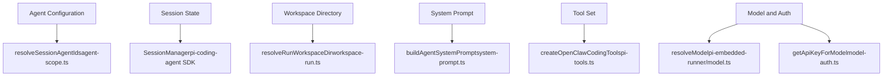
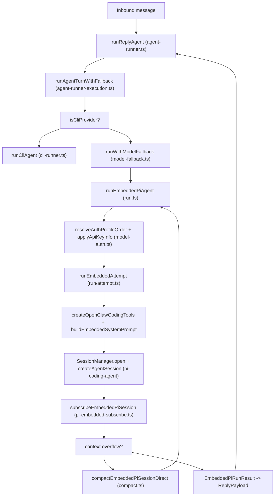

# Agents

Relevant source files

-   [docs/concepts/system-prompt.md](https://github.com/openclaw/openclaw/blob/8873e13f/docs/concepts/system-prompt.md)
-   [docs/concepts/typing-indicators.md](https://github.com/openclaw/openclaw/blob/8873e13f/docs/concepts/typing-indicators.md)
-   [docs/gateway/background-process.md](https://github.com/openclaw/openclaw/blob/8873e13f/docs/gateway/background-process.md)
-   [src/agents/auth-profiles.runtime-snapshot-save.test.ts](https://github.com/openclaw/openclaw/blob/8873e13f/src/agents/auth-profiles.runtime-snapshot-save.test.ts)
-   [src/agents/auth-profiles/oauth.openai-codex-refresh-fallback.test.ts](https://github.com/openclaw/openclaw/blob/8873e13f/src/agents/auth-profiles/oauth.openai-codex-refresh-fallback.test.ts)
-   [src/agents/auth-profiles/oauth.test.ts](https://github.com/openclaw/openclaw/blob/8873e13f/src/agents/auth-profiles/oauth.test.ts)
-   [src/agents/auth-profiles/oauth.ts](https://github.com/openclaw/openclaw/blob/8873e13f/src/agents/auth-profiles/oauth.ts)
-   [src/agents/bash-process-registry.test.ts](https://github.com/openclaw/openclaw/blob/8873e13f/src/agents/bash-process-registry.test.ts)
-   [src/agents/bash-process-registry.ts](https://github.com/openclaw/openclaw/blob/8873e13f/src/agents/bash-process-registry.ts)
-   [src/agents/bash-tools.ts](https://github.com/openclaw/openclaw/blob/8873e13f/src/agents/bash-tools.ts)
-   [src/agents/pi-embedded-helpers.ts](https://github.com/openclaw/openclaw/blob/8873e13f/src/agents/pi-embedded-helpers.ts)
-   [src/agents/pi-embedded-runner.ts](https://github.com/openclaw/openclaw/blob/8873e13f/src/agents/pi-embedded-runner.ts)
-   [src/agents/pi-embedded-runner/compact.ts](https://github.com/openclaw/openclaw/blob/8873e13f/src/agents/pi-embedded-runner/compact.ts)
-   [src/agents/pi-embedded-runner/run.ts](https://github.com/openclaw/openclaw/blob/8873e13f/src/agents/pi-embedded-runner/run.ts)
-   [src/agents/pi-embedded-runner/run/attempt.ts](https://github.com/openclaw/openclaw/blob/8873e13f/src/agents/pi-embedded-runner/run/attempt.ts)
-   [src/agents/pi-embedded-runner/run/params.ts](https://github.com/openclaw/openclaw/blob/8873e13f/src/agents/pi-embedded-runner/run/params.ts)
-   [src/agents/pi-embedded-runner/run/types.ts](https://github.com/openclaw/openclaw/blob/8873e13f/src/agents/pi-embedded-runner/run/types.ts)
-   [src/agents/pi-embedded-runner/system-prompt.ts](https://github.com/openclaw/openclaw/blob/8873e13f/src/agents/pi-embedded-runner/system-prompt.ts)
-   [src/agents/pi-embedded-subscribe.ts](https://github.com/openclaw/openclaw/blob/8873e13f/src/agents/pi-embedded-subscribe.ts)
-   [src/agents/pi-tools.ts](https://github.com/openclaw/openclaw/blob/8873e13f/src/agents/pi-tools.ts)
-   [src/agents/system-prompt.test.ts](https://github.com/openclaw/openclaw/blob/8873e13f/src/agents/system-prompt.test.ts)
-   [src/agents/system-prompt.ts](https://github.com/openclaw/openclaw/blob/8873e13f/src/agents/system-prompt.ts)
-   [src/auto-reply/reply/agent-runner-execution.ts](https://github.com/openclaw/openclaw/blob/8873e13f/src/auto-reply/reply/agent-runner-execution.ts)
-   [src/auto-reply/reply/agent-runner-memory.ts](https://github.com/openclaw/openclaw/blob/8873e13f/src/auto-reply/reply/agent-runner-memory.ts)
-   [src/auto-reply/reply/agent-runner-utils.test.ts](https://github.com/openclaw/openclaw/blob/8873e13f/src/auto-reply/reply/agent-runner-utils.test.ts)
-   [src/auto-reply/reply/agent-runner-utils.ts](https://github.com/openclaw/openclaw/blob/8873e13f/src/auto-reply/reply/agent-runner-utils.ts)
-   [src/auto-reply/reply/agent-runner.ts](https://github.com/openclaw/openclaw/blob/8873e13f/src/auto-reply/reply/agent-runner.ts)
-   [src/auto-reply/reply/followup-runner.ts](https://github.com/openclaw/openclaw/blob/8873e13f/src/auto-reply/reply/followup-runner.ts)
-   [src/auto-reply/reply/test-helpers.ts](https://github.com/openclaw/openclaw/blob/8873e13f/src/auto-reply/reply/test-helpers.ts)
-   [src/auto-reply/reply/typing-mode.ts](https://github.com/openclaw/openclaw/blob/8873e13f/src/auto-reply/reply/typing-mode.ts)
-   [src/browser/control-auth.auto-token.test.ts](https://github.com/openclaw/openclaw/blob/8873e13f/src/browser/control-auth.auto-token.test.ts)
-   [src/browser/control-auth.test.ts](https://github.com/openclaw/openclaw/blob/8873e13f/src/browser/control-auth.test.ts)
-   [src/browser/control-auth.ts](https://github.com/openclaw/openclaw/blob/8873e13f/src/browser/control-auth.ts)
-   [src/gateway/startup-auth.test.ts](https://github.com/openclaw/openclaw/blob/8873e13f/src/gateway/startup-auth.test.ts)
-   [src/gateway/startup-auth.ts](https://github.com/openclaw/openclaw/blob/8873e13f/src/gateway/startup-auth.ts)

This page covers what an agent is in OpenClaw, how multiple agents are configured and isolated from each other, how workspace directories are resolved, and how the embedded runner orchestrates a conversational turn. For a detailed end-to-end execution trace, see [Agent Execution Pipeline](/openclaw/openclaw/3.1-agent-execution-pipeline). For system prompt construction, see [System Prompt](/openclaw/openclaw/3.2-system-prompt-and-context). For model and API key configuration, see [Model Configuration & Authentication](/openclaw/openclaw/3.3-model-providers-and-authentication). For the tool system, see [Tools](/openclaw/openclaw/3.4-tools-system). For the command processing layer that sits above the agent, see [Commands & Auto-Reply](/openclaw/openclaw/3.5-commands-and-directives).

---

## What is an Agent

An agent is a named AI assistant configuration that processes inbound messages and produces replies. Each agent:

-   Has a unique **agent ID** — a key in `openclaw.json` under `agents`, with `"default"` as the baseline fallback.
-   Owns a **workspace directory** on disk where it reads and writes files.
-   Is assigned a primary **AI model and provider** (with optional fallbacks).
-   Has a **tool policy** controlling which tools it can invoke and which filesystem paths it can access.
-   Maintains **conversation history** in per-session JSONL transcript files.

An agent is distinct from a session. A single agent can have many concurrent sessions (one per Telegram chat, one per Discord thread, one per cron job, etc.). The agent defines the configuration; the session holds the conversational state.

The primary runtime is the **embedded runner** — an in-process engine built on the `@mariozechner/pi-coding-agent` SDK (`createAgentSession`, `SessionManager`). A separate **CLI runner** path (`runCliAgent`) exists for providers that expose their own agentic CLI (Claude Code, Codex CLI, Gemini CLI, etc.).

---

## Agent Configuration

Agents are declared in `openclaw.json` under `agents.defaults` (baseline, always applied) and `agents.<agentId>` (per-agent overrides). For the full field reference, see [Configuration Reference](/openclaw/openclaw/2.3.1-configuration-reference).

| Config path | Purpose |
| --- | --- |
| `agents.defaults.workspace` | Workspace root directory for file operations |
| `agents.defaults.userTimezone` | Timezone string injected into the system prompt |
| `agents.defaults.timeFormat` | `auto` / `12` / `24` — time display format |
| `agents.defaults.heartbeat.prompt` | Periodic heartbeat poll message sent by the cron service |
| `agents.defaults.bootstrapMaxChars` | Per-file size limit for injected workspace context files (default: 20,000) |
| `agents.defaults.bootstrapTotalMaxChars` | Total size cap across all injected workspace files (default: 150,000) |

The function `resolveSessionAgentIds` (in `src/agents/agent-scope.ts`) maps a session key and config to `{ defaultAgentId, sessionAgentId }`. The `sessionAgentId` drives all per-session decisions: workspace resolution, tool policy, model selection, and prompt mode. `isDefaultAgent` (when `sessionAgentId === defaultAgentId`) is checked to conditionally include features like heartbeats that apply only to the primary agent.

---

## Session Isolation

Each session is independently isolated from others through several mechanisms:

| Isolation axis | Mechanism |
| --- | --- |
| Conversation history | Unique `sessionFile` (`.jsonl` JSONL transcript) per session, opened by `SessionManager.open(sessionFile)` |
| File access | Per-agent `workspaceDir` resolved by `resolveRunWorkspaceDir` using agent ID and session key |
| Concurrency | Per-session command lane via `resolveSessionLane(sessionKey)` — concurrent messages to the same session are serialized; a global lane via `resolveGlobalLane` provides a shared execution queue |
| Subagents | Detected via `isSubagentSessionKey(sessionKey)`; automatically assigned `promptMode: "minimal"` and filtered bootstrap files |

Session keys are structured strings that encode agent routing context. They serve as stable identifiers for workspace resolution, session file paths, command-lane routing, and tool policy lookups.

---

## Workspace Directory

The workspace is the agent's root for all file operations. It is resolved by `resolveRunWorkspaceDir` (in `src/agents/workspace-run.ts`) using the agent ID, session key, and config. The process working directory is `chdir`'d to this path at the start of every run attempt [src/agents/pi-embedded-runner/run/attempt.ts454](https://github.com/openclaw/openclaw/blob/8873e13f/src/agents/pi-embedded-runner/run/attempt.ts#L454-L454)

When Docker sandbox mode is active (see [Sandboxing](/openclaw/openclaw/7.2-sandboxing)), the workspace splits into two paths:

-   **Host path** (`workspaceDir`) — used by file tools (`read`, `write`, `edit`) that bridge the host filesystem into the sandbox.
-   **Container path** (`containerWorkspaceDir`) — the path inside Docker where `exec` commands run; injected into the system prompt as the working directory guidance.

Workspace context files (`AGENTS.md`, `SOUL.md`, `MEMORY.md`, etc.) are read and injected into the system prompt on every turn via `resolveBootstrapContextForRun`. Their sizes are capped by `bootstrapMaxChars` and `bootstrapTotalMaxChars`. See [System Prompt](/openclaw/openclaw/3.2-system-prompt-and-context) for the full list of injected files and truncation behavior.

---

## Agent System Architecture

The diagram below maps the key agent system concepts to their implementing code entities.

**Agent System: Concept-to-Code Entity Map**

Sources: [src/agents/pi-embedded-runner/run/attempt.ts](https://github.com/openclaw/openclaw/blob/8873e13f/src/agents/pi-embedded-runner/run/attempt.ts) [src/agents/system-prompt.ts](https://github.com/openclaw/openclaw/blob/8873e13f/src/agents/system-prompt.ts) [src/agents/pi-embedded-runner/run.ts](https://github.com/openclaw/openclaw/blob/8873e13f/src/agents/pi-embedded-runner/run.ts)

---

## The Embedded Runner

The embedded runner is organized as a layered call stack. Each layer has a distinct responsibility:

| Layer | Function | File |
| --- | --- | --- |
| 1\. Turn orchestration | `runReplyAgent` | `src/auto-reply/reply/agent-runner.ts` |
| 2\. Fallback loop wrapper | `runAgentTurnWithFallback` | `src/auto-reply/reply/agent-runner-execution.ts` |
| 3\. Model fallback | `runWithModelFallback` | `src/agents/model-fallback.ts` |
| 4\. Auth and retry loop | `runEmbeddedPiAgent` | `src/agents/pi-embedded-runner/run.ts` |
| 5\. Single attempt | `runEmbeddedAttempt` | `src/agents/pi-embedded-runner/run/attempt.ts` |
| 6\. Streaming event handler | `subscribeEmbeddedPiSession` | `src/agents/pi-embedded-subscribe.ts` |

**`runEmbeddedPiAgent`** is responsible for:

-   Resolving the model object (`resolveModel`) and enforcing context window minimums (`evaluateContextWindowGuard`)
-   Resolving auth profiles in priority order (`resolveAuthProfileOrder`) and rotating through them on failure (`advanceAuthProfile`)
-   Running the per-attempt retry loop with thinking-level fallback and compaction retries

**`runEmbeddedAttempt`** is responsible for:

-   Loading workspace skills (`loadWorkspaceSkillEntries`, `resolveSkillsPromptForRun`)
-   Loading and size-capping bootstrap files (`resolveBootstrapContextForRun`)
-   Assembling the tool set (`createOpenClawCodingTools`, `sanitizeToolsForGoogle`, `splitSdkTools`)
-   Building the system prompt (`buildEmbeddedSystemPrompt`)
-   Acquiring a session write lock (`acquireSessionWriteLock`)
-   Opening the session file and initializing the SDK session (`SessionManager.open`, `createAgentSession`)
-   Subscribing to streaming model events (`subscribeEmbeddedPiSession`)

**Turn Execution Call Chain**

Sources: [src/auto-reply/reply/agent-runner.ts](https://github.com/openclaw/openclaw/blob/8873e13f/src/auto-reply/reply/agent-runner.ts) [src/auto-reply/reply/agent-runner-execution.ts](https://github.com/openclaw/openclaw/blob/8873e13f/src/auto-reply/reply/agent-runner-execution.ts) [src/agents/pi-embedded-runner/run.ts](https://github.com/openclaw/openclaw/blob/8873e13f/src/agents/pi-embedded-runner/run.ts) [src/agents/pi-embedded-runner/run/attempt.ts](https://github.com/openclaw/openclaw/blob/8873e13f/src/agents/pi-embedded-runner/run/attempt.ts) [src/agents/pi-embedded-subscribe.ts](https://github.com/openclaw/openclaw/blob/8873e13f/src/agents/pi-embedded-subscribe.ts)

---

## Session & Transcript Management

Conversation history is stored in JSONL files — one JSON object per line, one file per session. The `SessionManager` class (from `@mariozechner/pi-coding-agent`) reads and appends messages to these files.

Key operations performed around the session file:

| Operation | Function | File |
| --- | --- | --- |
| Resolve file path | `resolveSessionTranscriptPath` | `src/config/sessions.ts` |
| Prevent concurrent writes | `acquireSessionWriteLock` | `src/agents/session-write-lock.ts` |
| Fix orphaned user messages | `repairSessionFileIfNeeded` | `src/agents/session-file-repair.ts` |
| Remove unpaired tool entries | `sanitizeToolUseResultPairing` | `src/agents/session-transcript-repair.ts` |
| Warm file into read cache | `prewarmSessionFile` | `src/agents/pi-embedded-runner/session-manager-cache.ts` |
| Enforce tool-name allowlist | `guardSessionManager` | `src/agents/session-tool-result-guard-wrapper.ts` |

Session write locks prevent a race condition where two concurrent messages to the same session produce interleaved transcript entries. The lock's max hold time is derived from the run's `timeoutMs` via `resolveSessionLockMaxHoldFromTimeout`.

Sources: [src/agents/pi-embedded-runner/run/attempt.ts707-741](https://github.com/openclaw/openclaw/blob/8873e13f/src/agents/pi-embedded-runner/run/attempt.ts#L707-L741)

---

## System Prompt Modes

`buildAgentSystemPrompt` in [src/agents/system-prompt.ts](https://github.com/openclaw/openclaw/blob/8873e13f/src/agents/system-prompt.ts) assembles the system prompt from injected context files, tool lists, skills, heartbeat config, runtime info, and safety guardrails. The `promptMode` parameter controls the scope of included content:

| Mode | Trigger | What is omitted relative to `"full"` |
| --- | --- | --- |
| `"full"` | All normal agent sessions | Nothing |
| `"minimal"` | Subagent sessions (`isSubagentSessionKey` → `true`) | Authorized Senders, Reply Tags, Messaging, Memory Recall, Heartbeats, Silent Replies, Model Aliases, OpenClaw Self-Update |
| `"none"` | Bare identity only | All sections; returns the single identity line |

The mode is selected automatically by `resolvePromptModeForSession(sessionKey)` [src/agents/pi-embedded-runner/run/attempt.ts347-352](https://github.com/openclaw/openclaw/blob/8873e13f/src/agents/pi-embedded-runner/run/attempt.ts#L347-L352) Subagent sessions also receive a `"Subagent Context"` header for any `extraSystemPrompt` injection, instead of the `"Group Chat Context"` header used in full mode.

For complete details on prompt structure and workspace file injection, see [System Prompt](/openclaw/openclaw/3.2-system-prompt-and-context).

Sources: [src/agents/system-prompt.ts11-17](https://github.com/openclaw/openclaw/blob/8873e13f/src/agents/system-prompt.ts#L11-L17) [src/agents/pi-embedded-runner/run/attempt.ts347-352](https://github.com/openclaw/openclaw/blob/8873e13f/src/agents/pi-embedded-runner/run/attempt.ts#L347-L352)

---

## Context Compaction

When conversation history approaches the model's context window limit, the runner triggers automatic compaction:

1.  **Detect overflow** — `isContextOverflowError` or `isLikelyContextOverflowError` (in `src/agents/pi-embedded-helpers/errors.ts`) identifies the condition.
2.  **Compact** — `compactEmbeddedPiSessionDirect` in [src/agents/pi-embedded-runner/compact.ts](https://github.com/openclaw/openclaw/blob/8873e13f/src/agents/pi-embedded-runner/compact.ts) runs a summarization pass using the same configured model, condensing the session history.
3.  **Inject context** — `readPostCompactionContext` injects a post-compaction workspace snapshot as a system event for the next turn.
4.  **Retry** — the outer loop in `runEmbeddedPiAgent` retries the original prompt with the compacted history.
5.  **Reset on failure** — if compaction itself fails (too many retries), the session is reset: a new `sessionId` is generated, the transcript is discarded, and the run restarts from scratch.

The compaction count is tracked in `EmbeddedPiAgentMeta.compactionCount` and persisted in the session store via `persistRunSessionUsage`.

Sources: [src/agents/pi-embedded-runner/compact.ts](https://github.com/openclaw/openclaw/blob/8873e13f/src/agents/pi-embedded-runner/compact.ts) [src/agents/pi-embedded-runner/run.ts](https://github.com/openclaw/openclaw/blob/8873e13f/src/agents/pi-embedded-runner/run.ts) [src/auto-reply/reply/agent-runner.ts676-704](https://github.com/openclaw/openclaw/blob/8873e13f/src/auto-reply/reply/agent-runner.ts#L676-L704)

---

## Key Types Reference

| Type | File | Purpose |
| --- | --- | --- |
| `EmbeddedPiRunResult` | `src/agents/pi-embedded-runner/types.ts` | Return value of `runEmbeddedPiAgent` — reply payloads, metadata, messaging tool sent-texts |
| `EmbeddedPiRunMeta` | `src/agents/pi-embedded-runner/types.ts` | Duration, agent metadata, error kind (`context_overflow`, `compaction_failure`, `role_ordering`, `retry_limit`), stop reason |
| `EmbeddedPiAgentMeta` | `src/agents/pi-embedded-runner/types.ts` | Session ID, provider, model, token usage breakdown, `lastCallUsage`, compaction count |
| `EmbeddedRunAttemptParams` | `src/agents/pi-embedded-runner/run/types.ts` | Full parameter set passed into `runEmbeddedAttempt`, extends `RunEmbeddedPiAgentParams` with resolved model/auth |
| `EmbeddedRunAttemptResult` | `src/agents/pi-embedded-runner/run/types.ts` | Per-attempt result: assistant texts, tool metas, usage, error flags, messaging tool state, client tool call |
| `RunEmbeddedPiAgentParams` | `src/agents/pi-embedded-runner/run/params.ts` | Top-level parameters for `runEmbeddedPiAgent` — session, workspace, config, prompt, streaming callbacks |
| `PromptMode` | `src/agents/system-prompt.ts` | `"full"` / `"minimal"` / `"none"` — controls system prompt scope |
| `CompactEmbeddedPiSessionParams` | `src/agents/pi-embedded-runner/compact.ts` | Parameters for the compaction operation — session, model, provider, workspace, skills snapshot |

Sources: [src/agents/pi-embedded-runner/types.ts](https://github.com/openclaw/openclaw/blob/8873e13f/src/agents/pi-embedded-runner/types.ts) [src/agents/pi-embedded-runner/run/types.ts](https://github.com/openclaw/openclaw/blob/8873e13f/src/agents/pi-embedded-runner/run/types.ts) [src/agents/pi-embedded-runner/run/params.ts](https://github.com/openclaw/openclaw/blob/8873e13f/src/agents/pi-embedded-runner/run/params.ts) [src/agents/system-prompt.ts11-17](https://github.com/openclaw/openclaw/blob/8873e13f/src/agents/system-prompt.ts#L11-L17) [src/agents/pi-embedded-runner/compact.ts88-125](https://github.com/openclaw/openclaw/blob/8873e13f/src/agents/pi-embedded-runner/compact.ts#L88-L125)
