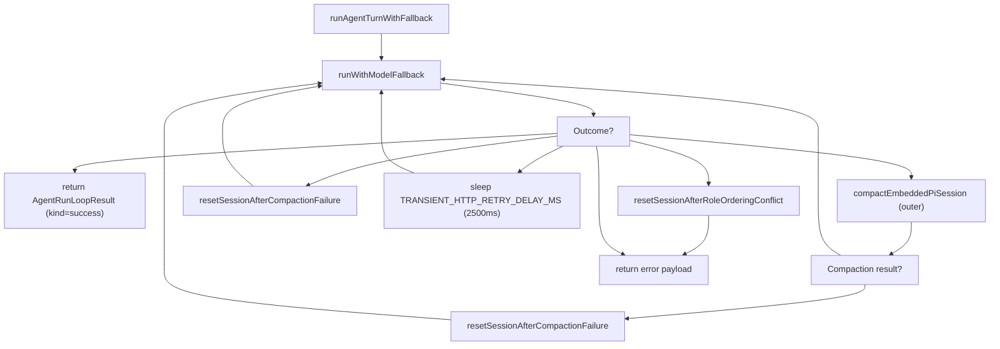
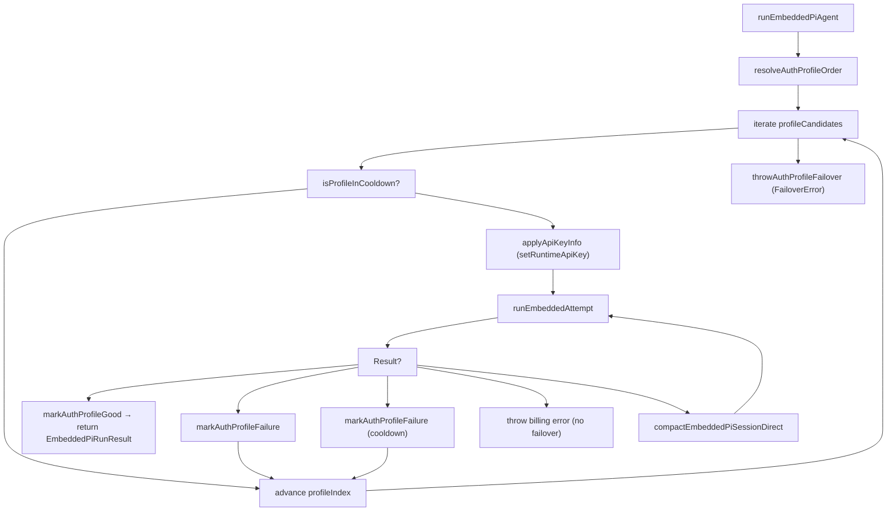
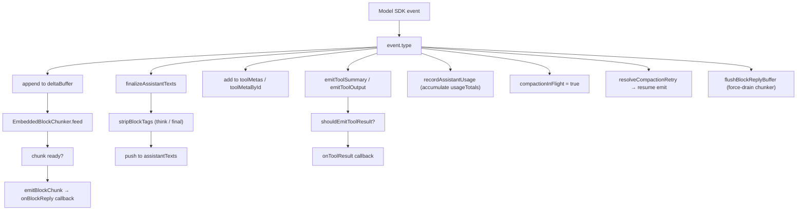
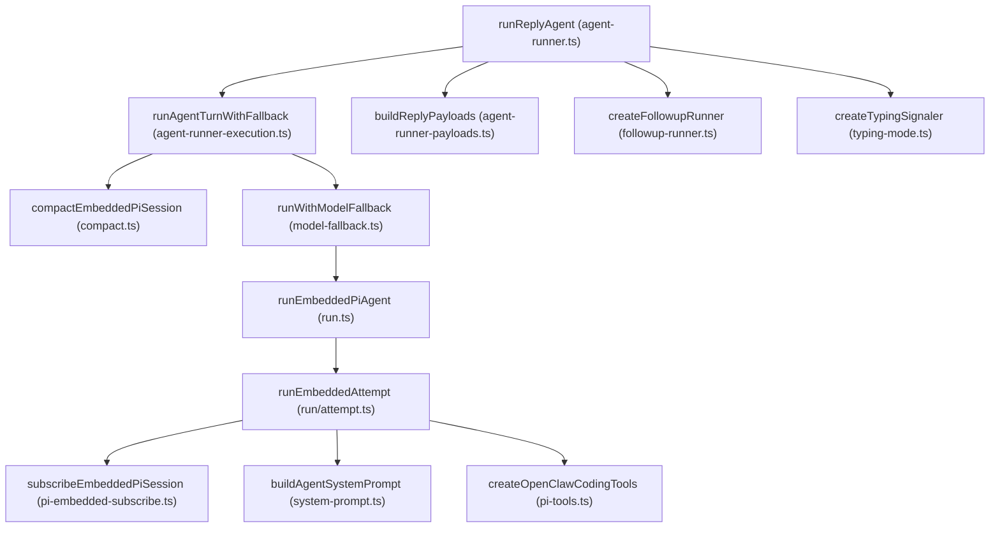

# Agent Execution Pipeline

Relevant source files

-   [docs/concepts/typing-indicators.md](https://github.com/openclaw/openclaw/blob/8873e13f/docs/concepts/typing-indicators.md)
-   [src/agents/auth-profiles.runtime-snapshot-save.test.ts](https://github.com/openclaw/openclaw/blob/8873e13f/src/agents/auth-profiles.runtime-snapshot-save.test.ts)
-   [src/agents/auth-profiles/oauth.openai-codex-refresh-fallback.test.ts](https://github.com/openclaw/openclaw/blob/8873e13f/src/agents/auth-profiles/oauth.openai-codex-refresh-fallback.test.ts)
-   [src/agents/auth-profiles/oauth.test.ts](https://github.com/openclaw/openclaw/blob/8873e13f/src/agents/auth-profiles/oauth.test.ts)
-   [src/agents/auth-profiles/oauth.ts](https://github.com/openclaw/openclaw/blob/8873e13f/src/agents/auth-profiles/oauth.ts)
-   [src/agents/pi-embedded-runner/compact.ts](https://github.com/openclaw/openclaw/blob/8873e13f/src/agents/pi-embedded-runner/compact.ts)
-   [src/agents/pi-embedded-runner/run.ts](https://github.com/openclaw/openclaw/blob/8873e13f/src/agents/pi-embedded-runner/run.ts)
-   [src/agents/pi-embedded-runner/run/attempt.ts](https://github.com/openclaw/openclaw/blob/8873e13f/src/agents/pi-embedded-runner/run/attempt.ts)
-   [src/agents/pi-embedded-runner/run/params.ts](https://github.com/openclaw/openclaw/blob/8873e13f/src/agents/pi-embedded-runner/run/params.ts)
-   [src/agents/pi-embedded-runner/run/types.ts](https://github.com/openclaw/openclaw/blob/8873e13f/src/agents/pi-embedded-runner/run/types.ts)
-   [src/agents/pi-embedded-runner/system-prompt.ts](https://github.com/openclaw/openclaw/blob/8873e13f/src/agents/pi-embedded-runner/system-prompt.ts)
-   [src/auto-reply/reply/agent-runner-execution.ts](https://github.com/openclaw/openclaw/blob/8873e13f/src/auto-reply/reply/agent-runner-execution.ts)
-   [src/auto-reply/reply/agent-runner-memory.ts](https://github.com/openclaw/openclaw/blob/8873e13f/src/auto-reply/reply/agent-runner-memory.ts)
-   [src/auto-reply/reply/agent-runner-utils.test.ts](https://github.com/openclaw/openclaw/blob/8873e13f/src/auto-reply/reply/agent-runner-utils.test.ts)
-   [src/auto-reply/reply/agent-runner-utils.ts](https://github.com/openclaw/openclaw/blob/8873e13f/src/auto-reply/reply/agent-runner-utils.ts)
-   [src/auto-reply/reply/agent-runner.ts](https://github.com/openclaw/openclaw/blob/8873e13f/src/auto-reply/reply/agent-runner.ts)
-   [src/auto-reply/reply/followup-runner.ts](https://github.com/openclaw/openclaw/blob/8873e13f/src/auto-reply/reply/followup-runner.ts)
-   [src/auto-reply/reply/test-helpers.ts](https://github.com/openclaw/openclaw/blob/8873e13f/src/auto-reply/reply/test-helpers.ts)
-   [src/auto-reply/reply/typing-mode.ts](https://github.com/openclaw/openclaw/blob/8873e13f/src/auto-reply/reply/typing-mode.ts)
-   [src/browser/control-auth.auto-token.test.ts](https://github.com/openclaw/openclaw/blob/8873e13f/src/browser/control-auth.auto-token.test.ts)
-   [src/browser/control-auth.test.ts](https://github.com/openclaw/openclaw/blob/8873e13f/src/browser/control-auth.test.ts)
-   [src/browser/control-auth.ts](https://github.com/openclaw/openclaw/blob/8873e13f/src/browser/control-auth.ts)
-   [src/gateway/startup-auth.test.ts](https://github.com/openclaw/openclaw/blob/8873e13f/src/gateway/startup-auth.test.ts)
-   [src/gateway/startup-auth.ts](https://github.com/openclaw/openclaw/blob/8873e13f/src/gateway/startup-auth.ts)

This page traces a message end-to-end: from when a processed message body arrives at the agent layer, through model invocation, streaming, and reply delivery. It covers the function call chain, lane queuing, model resolution, auth profile failover, session initialization, streaming partial replies, compaction on context overflow, and typing indicators.

For how commands and directives are detected and dispatched *before* the agent is invoked, see [Commands & Auto-Reply](/openclaw/openclaw/3.5-commands-and-directives). For the contents of the system prompt built on each turn, see [System Prompt](/openclaw/openclaw/3.2-system-prompt-and-context). For how tools are assembled and policy-enforced, see [Tools](/openclaw/openclaw/3.4-tools-system). For session storage and lifecycle management, see [Session Management](/openclaw/openclaw/2.4-session-management).

---

## Pipeline Layers

A single agent turn passes through four named function layers before reaching the model API.

| Layer | Function | File | Primary Concern |
| --- | --- | --- | --- |
| 1 | `runReplyAgent` | `src/auto-reply/reply/agent-runner.ts` | Queue policy, steer/inject, typing, post-processing |
| 2 | `runAgentTurnWithFallback` | `src/auto-reply/reply/agent-runner-execution.ts` | Retry loops (compaction, transient errors, role ordering conflicts) |
| 3 | `runEmbeddedPiAgent` | `src/agents/pi-embedded-runner/run.ts` | Lane queuing, model resolution, auth profile iteration |
| 4 | `runEmbeddedAttempt` | `src/agents/pi-embedded-runner/run/attempt.ts` | Workspace setup, tool creation, session init, single attempt |
| — | `subscribeEmbeddedPiSession` | `src/agents/pi-embedded-subscribe.ts` | Streaming events, block chunking, tag stripping, tool callbacks |

Sources: [src/auto-reply/reply/agent-runner.ts92-122](https://github.com/openclaw/openclaw/blob/8873e13f/src/auto-reply/reply/agent-runner.ts#L92-L122) [src/auto-reply/reply/agent-runner-execution.ts72-99](https://github.com/openclaw/openclaw/blob/8873e13f/src/auto-reply/reply/agent-runner-execution.ts#L72-L99) [src/agents/pi-embedded-runner/run.ts192-212](https://github.com/openclaw/openclaw/blob/8873e13f/src/agents/pi-embedded-runner/run.ts#L192-L212) [src/agents/pi-embedded-runner/run/attempt.ts427-440](https://github.com/openclaw/openclaw/blob/8873e13f/src/agents/pi-embedded-runner/run/attempt.ts#L427-L440) [src/agents/pi-embedded-subscribe.ts34-82](https://github.com/openclaw/openclaw/blob/8873e13f/src/agents/pi-embedded-subscribe.ts#L34-L82)

---

**Pipeline call chain and primary data flow**

> **[Mermaid sequence]**
> *(图表结构无法解析)*

Sources: [src/auto-reply/reply/agent-runner.ts92-728](https://github.com/openclaw/openclaw/blob/8873e13f/src/auto-reply/reply/agent-runner.ts#L92-L728) [src/auto-reply/reply/agent-runner-execution.ts72-380](https://github.com/openclaw/openclaw/blob/8873e13f/src/auto-reply/reply/agent-runner-execution.ts#L72-L380) [src/agents/pi-embedded-runner/run.ts192](https://github.com/openclaw/openclaw/blob/8873e13f/src/agents/pi-embedded-runner/run.ts#L192-LNaN) [src/agents/pi-embedded-runner/run/attempt.ts427](https://github.com/openclaw/openclaw/blob/8873e13f/src/agents/pi-embedded-runner/run/attempt.ts#L427-LNaN) [src/agents/pi-embedded-subscribe.ts34](https://github.com/openclaw/openclaw/blob/8873e13f/src/agents/pi-embedded-subscribe.ts#L34-LNaN)

---

## Layer 1: runReplyAgent

`runReplyAgent` [src/auto-reply/reply/agent-runner.ts92-728](https://github.com/openclaw/openclaw/blob/8873e13f/src/auto-reply/reply/agent-runner.ts#L92-L728) is the first function in the agent path. It receives:

-   `commandBody` – the processed message text (after directive stripping)
-   `followupRun` – a `FollowupRun` struct containing the `run` object (`sessionId`, `sessionFile`, `provider`, `model`, `config`, `prompt`, etc.)
-   `sessionCtx` – a `TemplateContext` with sender/channel metadata
-   `typing` – a `TypingController` for typing indicator lifecycle
-   Queue, session store, and verbose-level parameters

### Queue and Steer Checks

Before invoking the model, two early-exit checks run:

**Steer check** – If `shouldSteer && isStreaming` is true, `queueEmbeddedPiMessage` is called to inject the new message into the currently-active streaming run for the same session. If the injection succeeds, the function returns early without starting a new turn.

**Queue policy** – `resolveActiveRunQueueAction` [src/auto-reply/reply/queue-policy.ts](https://github.com/openclaw/openclaw/blob/8873e13f/src/auto-reply/reply/queue-policy.ts) returns one of:

-   `"drop"` – silently discard the message
-   `"enqueue-followup"` – save the run to a follow-up queue via `enqueueFollowupRun`
-   `"proceed"` – continue to model invocation

### Post-Processing

After `runAgentTurnWithFallback` completes, `runReplyAgent` performs:

| Action | Function |
| --- | --- |
| Fallback state tracking | `resolveFallbackTransition` → updates `fallbackNotice*` fields in session store |
| Compaction count | `incrementRunCompactionCount` (if compaction ran) |
| Usage persistence | `persistRunSessionUsage` |
| Diagnostic event | `emitDiagnosticEvent` (`type: "model.usage"`) |
| Response usage line | `formatResponseUsageLine` (appended if `/usage` is enabled) |
| Verbose notices | Prepend notices for new sessions, fallback, and compaction events |
| Unscheduled reminder note | `appendUnscheduledReminderNote` if agent promised a reminder but created no cron job |

Sources: [src/auto-reply/reply/agent-runner.ts154-248](https://github.com/openclaw/openclaw/blob/8873e13f/src/auto-reply/reply/agent-runner.ts#L154-L248) [src/auto-reply/reply/agent-runner.ts362-716](https://github.com/openclaw/openclaw/blob/8873e13f/src/auto-reply/reply/agent-runner.ts#L362-L716) [src/auto-reply/reply/session-run-accounting.ts](https://github.com/openclaw/openclaw/blob/8873e13f/src/auto-reply/reply/session-run-accounting.ts)

---

## Layer 2: runAgentTurnWithFallback

`runAgentTurnWithFallback` [src/auto-reply/reply/agent-runner-execution.ts72-380](https://github.com/openclaw/openclaw/blob/8873e13f/src/auto-reply/reply/agent-runner-execution.ts#L72-L380) wraps the model invocation in a retry loop that handles several failure modes.

**Retry loop in runAgentTurnWithFallback**


Key failure classifications used:

| Classifier | Source | Action |
| --- | --- | --- |
| `isContextOverflowError` | `pi-embedded-helpers.ts` | Trigger compaction then retry |
| `isLikelyContextOverflowError` | `pi-embedded-helpers.ts` | Same as above |
| `isCompactionFailureError` | `pi-embedded-helpers.ts` | Reset session ID, retry |
| `isTransientHttpError` | `pi-embedded-helpers.ts` | Wait 2,500 ms, retry once |
| Role ordering conflict | Google/Gemini-specific | Reset session + delete transcript |

`resetSessionAfterCompactionFailure` generates a new `sessionId` and `sessionFile` via `generateSecureUuid`, updates the session store, and points the `followupRun` at the new file.

`resetSessionAfterRoleOrderingConflict` does the same but also deletes the old transcript file.

This layer also manages the `blockReplyPipeline` (`createBlockReplyPipeline`) for streaming partial replies. `createBlockReplyDeliveryHandler` routes flushed chunks directly to the channel during the turn.

Sources: [src/auto-reply/reply/agent-runner-execution.ts100-380](https://github.com/openclaw/openclaw/blob/8873e13f/src/auto-reply/reply/agent-runner-execution.ts#L100-L380) [src/agents/pi-embedded-helpers.ts](https://github.com/openclaw/openclaw/blob/8873e13f/src/agents/pi-embedded-helpers.ts) [src/auto-reply/reply/block-reply-pipeline.ts](https://github.com/openclaw/openclaw/blob/8873e13f/src/auto-reply/reply/block-reply-pipeline.ts)

---

## Layer 3: runEmbeddedPiAgent

`runEmbeddedPiAgent` [src/agents/pi-embedded-runner/run.ts192](https://github.com/openclaw/openclaw/blob/8873e13f/src/agents/pi-embedded-runner/run.ts#L192-LNaN) handles concurrency, model resolution, and auth profile iteration.

### Lane Queuing

Every call is serialized through two lanes:

```
enqueueSession(() =>
  enqueueGlobal(async () => { ... })
)
```
-   **Session lane** – keyed on `sessionKey` (or `sessionId`), serialized via `resolveSessionLane`. Prevents concurrent writes to the same session file.
-   **Global lane** – keyed on the configured `lane` name (or a default), serialized via `resolveGlobalLane`. Bounds total parallel model calls across all sessions.

Both use `enqueueCommandInLane` from `src/process/command-queue.ts`.

### Model Resolution

`resolveModel(provider, modelId, agentDir, config)` [src/agents/pi-embedded-runner/model.ts](https://github.com/openclaw/openclaw/blob/8873e13f/src/agents/pi-embedded-runner/model.ts) looks up the model definition (API type, context window, input modalities, cost) from the `openclaw-models.json` registry. If the model is not found, a `FailoverError` is thrown with `reason: "model_not_found"`.

`evaluateContextWindowGuard` then checks the resolved context window:

-   Below `CONTEXT_WINDOW_WARN_BELOW_TOKENS` → logs a warning
-   Below `CONTEXT_WINDOW_HARD_MIN_TOKENS` → throws `FailoverError` and blocks the run

### Auth Profile Iteration

**Auth profile iteration and fallover within runEmbeddedPiAgent**


`authStore` (an `AuthProfileStore`) is loaded from `auth-profiles.json` in `agentDir`. `resolveAuthProfileOrder` sorts profiles by priority. A locked `authProfileId` (set by the user via `/model ... @profile`) bypasses the iteration and uses only that profile.

When a profile fails temporarily (rate limit), `markAuthProfileFailure` sets a cooldown timestamp. `isProfileInCooldown` skips it on future iterations.

Sources: [src/agents/pi-embedded-runner/run.ts192-480](https://github.com/openclaw/openclaw/blob/8873e13f/src/agents/pi-embedded-runner/run.ts#L192-L480) [src/agents/pi-embedded-runner/run.ts354-480](https://github.com/openclaw/openclaw/blob/8873e13f/src/agents/pi-embedded-runner/run.ts#L354-L480) [src/agents/pi-embedded-runner/lanes.ts](https://github.com/openclaw/openclaw/blob/8873e13f/src/agents/pi-embedded-runner/lanes.ts) [src/agents/auth-profiles.ts](https://github.com/openclaw/openclaw/blob/8873e13f/src/agents/auth-profiles.ts)

---

## Layer 4: runEmbeddedAttempt

`runEmbeddedAttempt` [src/agents/pi-embedded-runner/run/attempt.ts427](https://github.com/openclaw/openclaw/blob/8873e13f/src/agents/pi-embedded-runner/run/attempt.ts#L427-LNaN) executes a single model invocation attempt and sets up the full execution environment.

### Execution Environment Setup

| Step | Key Function / Class | Purpose |
| --- | --- | --- |
| Workspace | `resolveUserPath`, `fs.mkdir` | Resolve and create workspace directory |
| Sandbox | `resolveSandboxContext` | Detect Docker sandbox; determine effective workspace |
| Skills | `loadWorkspaceSkillEntries`, `resolveSkillsPromptForRun` | Load skill definitions from workspace |
| Bootstrap files | `resolveBootstrapContextForRun` | Load `AGENTS.md`, `SOUL.md`, `MEMORY.md`, etc. as `EmbeddedContextFile[]` |
| Agent IDs | `resolveSessionAgentIds` | Determine `sessionAgentId` and `defaultAgentId` |
| Tools | `createOpenClawCodingTools` | Build the full tool set for this agent and session |
| Google sanitization | `sanitizeToolsForGoogle` | Adjust tool schemas for Gemini API compatibility |
| System prompt | `buildEmbeddedSystemPrompt` | Delegate to `buildAgentSystemPrompt` with all resolved params |
| Session lock | `acquireSessionWriteLock` | Prevent concurrent writes to the JSONL transcript |
| Session repair | `repairSessionFileIfNeeded` | Fix corrupted or incomplete session transcripts |
| Session open | `SessionManager.open` + `guardSessionManager` | Open the session file with tool-use pairing guards |
| Session init | `prepareSessionManagerForRun` | Initialize cwd, inject session header if needed |
| Extensions | `buildEmbeddedExtensionFactories` | Register compaction and context-pruning extensions |
| Tool split | `splitSdkTools` | Partition tools into `builtInTools` and `customTools` |
| Agent session | `createAgentSession` (pi-coding-agent SDK) | Create the `AgentSession` with model, tools, and session manager |
| System prompt inject | `applySystemPromptOverrideToSession` | Write the computed system prompt into the session |
| Tool result guard | `installToolResultContextGuard` | Guard against tool results that would overflow context |

Sources: [src/agents/pi-embedded-runner/run/attempt.ts427-820](https://github.com/openclaw/openclaw/blob/8873e13f/src/agents/pi-embedded-runner/run/attempt.ts#L427-L820) [src/agents/pi-embedded-runner/system-prompt.ts](https://github.com/openclaw/openclaw/blob/8873e13f/src/agents/pi-embedded-runner/system-prompt.ts) [src/agents/pi-tools.ts](https://github.com/openclaw/openclaw/blob/8873e13f/src/agents/pi-tools.ts)

### System Prompt Construction

`buildEmbeddedSystemPrompt` [src/agents/pi-embedded-runner/system-prompt.ts](https://github.com/openclaw/openclaw/blob/8873e13f/src/agents/pi-embedded-runner/system-prompt.ts) calls `buildAgentSystemPrompt` [src/agents/system-prompt.ts189-664](https://github.com/openclaw/openclaw/blob/8873e13f/src/agents/system-prompt.ts#L189-L664) with all resolved parameters including tools, runtime info, context files, skills prompt, timezone, sandbox info, and reaction guidance.

The `promptMode` is resolved by `resolvePromptModeForSession` [src/agents/pi-embedded-runner/run/attempt.ts347-352](https://github.com/openclaw/openclaw/blob/8873e13f/src/agents/pi-embedded-runner/run/attempt.ts#L347-L352): sessions with a subagent key use `"minimal"` mode; all others use `"full"` mode. Minimal mode omits sections like `## Authorized Senders`, `## Heartbeats`, `## Silent Replies`, and `## Messaging`.

---

## Streaming: subscribeEmbeddedPiSession

`subscribeEmbeddedPiSession` [src/agents/pi-embedded-subscribe.ts34-640](https://github.com/openclaw/openclaw/blob/8873e13f/src/agents/pi-embedded-subscribe.ts#L34-L640) is called before the agent turn begins. It returns an event handler object that the pi-coding-agent SDK calls as the model streams output.

### Internal State

| Field | Type | Purpose |
| --- | --- | --- |
| `assistantTexts` | `string[]` | Collected assistant text segments → final `ReplyPayload` |
| `toolMetas` | array | Tool call metadata for verbose/tool-result display |
| `deltaBuffer` | `string` | In-progress text delta accumulation |
| `blockBuffer` | `string` | Text buffered for block reply chunking |
| `blockState` | `{thinking, final, inlineCode}` | Stateful tag-stripping context (crosses chunk boundaries) |
| `messagingToolSentTexts` | `string[]` | Texts already sent via the `message` tool (deduplication) |
| `compactionInFlight` | `boolean` | Pauses chunk emission during compaction |
| `pendingCompactionRetry` | `number` | Counts pending compactions to resolve after all complete |

### Tag Stripping

`stripBlockTags` [src/agents/pi-embedded-subscribe.ts355-443](https://github.com/openclaw/openclaw/blob/8873e13f/src/agents/pi-embedded-subscribe.ts#L355-L443) handles two tag families across chunk boundaries:

-   **`<think>` / `<thinking>` / `<thought>` / `<antthinking>`** — Content inside is stripped from the user-visible reply. Tracks open/close state across chunks via `blockState.thinking`.
-   **`<final>`** — When `enforceFinalTag` is true (reasoning-tag providers), only content inside `<final>` is emitted; all other text is discarded.

Code-span detection (`buildCodeSpanIndex`) prevents tag matches inside backtick code spans.

### Block Reply Streaming

When the `onBlockReply` callback is provided, text is delivered incrementally. The `EmbeddedBlockChunker` [src/agents/pi-embedded-block-chunker.ts](https://github.com/openclaw/openclaw/blob/8873e13f/src/agents/pi-embedded-block-chunker.ts) splits the stream into delivery-sized pieces based on `blockReplyChunking` config (`minChars`, `maxChars`, `breakPreference`).

`emitBlockChunk` [src/agents/pi-embedded-subscribe.ts465-521](https://github.com/openclaw/openclaw/blob/8873e13f/src/agents/pi-embedded-subscribe.ts#L465-L521) is called for each chunk. It:

1.  Strips `<think>` / `<final>` tags via `stripBlockTags`
2.  Strips downgraded tool call text via `stripDowngradedToolCallText`
3.  Checks normalized text against `messagingToolSentTextsNormalized` to suppress duplicates already sent via the `message` tool
4.  Calls `onBlockReply` with `{text, mediaUrls, audioAsVoice, replyToId, replyToCurrent}`

**Event flow within subscribeEmbeddedPiSession**


### Reasoning Stream

When `reasoningMode === "stream"`, thinking block content is forwarded to `emitReasoningStream` [src/agents/pi-embedded-subscribe.ts543-573](https://github.com/openclaw/openclaw/blob/8873e13f/src/agents/pi-embedded-subscribe.ts#L543-L573) which:

-   Computes a delta from the previously-sent reasoning text
-   Calls `emitAgentEvent` with `stream: "thinking"` (broadcast to WebSocket clients)
-   Calls the `onReasoningStream` callback

Sources: [src/agents/pi-embedded-subscribe.ts34-640](https://github.com/openclaw/openclaw/blob/8873e13f/src/agents/pi-embedded-subscribe.ts#L34-L640) [src/agents/pi-embedded-block-chunker.ts](https://github.com/openclaw/openclaw/blob/8873e13f/src/agents/pi-embedded-block-chunker.ts)

---

## Compaction on Context Overflow

When the model reports context overflow, compaction condenses the conversation history to free up context space. It can be triggered at two layers:

| Trigger Site | When | Function Called |
| --- | --- | --- |
| Inside `runEmbeddedPiAgent` | Overflow detected within a running attempt | `compactEmbeddedPiSessionDirect` |
| Inside `runAgentTurnWithFallback` | Overflow propagates out of `runEmbeddedPiAgent` | `compactEmbeddedPiSession` |

Both ultimately execute logic in [src/agents/pi-embedded-runner/compact.ts](https://github.com/openclaw/openclaw/blob/8873e13f/src/agents/pi-embedded-runner/compact.ts) which:

1.  Opens the session transcript with `SessionManager.open`
2.  Constructs a compaction-specific system prompt and tool set
3.  Runs a dedicated agent turn that summarizes the transcript into a compact form
4.  Replaces the original transcript entries with the summary
5.  Returns `EmbeddedPiCompactResult` with the new message count and token estimate

After compaction, the interrupted run is retried. `incrementRunCompactionCount` [src/auto-reply/reply/session-run-accounting.ts](https://github.com/openclaw/openclaw/blob/8873e13f/src/auto-reply/reply/session-run-accounting.ts) updates the session store so `/status` reports the compaction count. A post-compaction workspace context snapshot (`readPostCompactionContext`) is injected as a system event for the next turn.

Detection helpers used: `isContextOverflowError`, `isLikelyContextOverflowError`, `isCompactionFailureError` from [src/agents/pi-embedded-helpers.ts](https://github.com/openclaw/openclaw/blob/8873e13f/src/agents/pi-embedded-helpers.ts)

Sources: [src/agents/pi-embedded-runner/compact.ts88](https://github.com/openclaw/openclaw/blob/8873e13f/src/agents/pi-embedded-runner/compact.ts#L88-LNaN) [src/agents/pi-embedded-runner/run.ts53-57](https://github.com/openclaw/openclaw/blob/8873e13f/src/agents/pi-embedded-runner/run.ts#L53-L57) [src/auto-reply/reply/agent-runner-execution.ts90-130](https://github.com/openclaw/openclaw/blob/8873e13f/src/auto-reply/reply/agent-runner-execution.ts#L90-L130) [src/auto-reply/reply/agent-runner.ts676-703](https://github.com/openclaw/openclaw/blob/8873e13f/src/auto-reply/reply/agent-runner.ts#L676-L703)

---

## Model Fallback

`runWithModelFallback` [src/agents/model-fallback.ts](https://github.com/openclaw/openclaw/blob/8873e13f/src/agents/model-fallback.ts) attempts the configured primary model. On `FailoverError`, it tries configured fallback models in sequence.

`FailoverError` carries a `reason` field:

| Reason | Meaning |
| --- | --- |
| `"rate_limit"` | Rate limited; try next profile or model |
| `"auth"` | Auth failure; try next profile |
| `"context_overflow"` | Context window exceeded |
| `"model_not_found"` | Model not in registry |
| `"billing"` | Billing issue; do not failover |
| `"unknown"` | Generic failure |

When a fallback transition occurs, `runReplyAgent` records it in the session store via `fallbackNoticeSelectedModel`, `fallbackNoticeActiveModel`, `fallbackNoticeReason`, and emits a `phase: "fallback"` agent event. If verbose mode is on, a notice is prepended to the reply payloads.

When the primary model becomes available again on a subsequent turn, `fallbackCleared` is detected and a `phase: "fallback_cleared"` event is emitted.

Sources: [src/agents/model-fallback.ts](https://github.com/openclaw/openclaw/blob/8873e13f/src/agents/model-fallback.ts) [src/agents/pi-embedded-runner/run.ts232-240](https://github.com/openclaw/openclaw/blob/8873e13f/src/agents/pi-embedded-runner/run.ts#L232-L240) [src/auto-reply/reply/agent-runner.ts444-674](https://github.com/openclaw/openclaw/blob/8873e13f/src/auto-reply/reply/agent-runner.ts#L444-L674) [src/auto-reply/fallback-state.ts](https://github.com/openclaw/openclaw/blob/8873e13f/src/auto-reply/fallback-state.ts)

---

## Typing Indicators

Typing indicators are managed by a `TypingController` passed into `runReplyAgent`. The `createTypingSignaler` factory [src/auto-reply/reply/typing-mode.ts](https://github.com/openclaw/openclaw/blob/8873e13f/src/auto-reply/reply/typing-mode.ts) wraps it and controls when signals are sent based on `typingMode` config.

| Signal method | When called |
| --- | --- |
| `signalRunStart` | After queue check passes, before model invocation |
| `signalTextDelta(text)` | During streaming, for each partial text chunk |
| `markRunComplete` | In `finally` block of `runReplyAgent` |
| `markDispatchIdle` | Also in `finally` block (safety net for stuck keepalive loops) |

Heartbeat turns (`isHeartbeat === true`) skip the typing indicator. The `TypingMode` values (`"off"`, `"pre-reply"`, `"streaming"`, etc.) determine which signals are suppressed.

Sources: [src/auto-reply/reply/agent-runner.ts154-159](https://github.com/openclaw/openclaw/blob/8873e13f/src/auto-reply/reply/agent-runner.ts#L154-L159) [src/auto-reply/reply/typing-mode.ts](https://github.com/openclaw/openclaw/blob/8873e13f/src/auto-reply/reply/typing-mode.ts) [src/auto-reply/reply/agent-runner.ts717-727](https://github.com/openclaw/openclaw/blob/8873e13f/src/auto-reply/reply/agent-runner.ts#L717-L727)

---

## Reply Payload Assembly

After the model turn completes, `buildReplyPayloads` [src/auto-reply/reply/agent-runner-payloads.ts](https://github.com/openclaw/openclaw/blob/8873e13f/src/auto-reply/reply/agent-runner-payloads.ts) assembles the final `ReplyPayload[]` from the collected `assistantTexts` and tool-related payloads.

Key transformations applied:

| Transformation | Detail |
| --- | --- |
| Silent reply filtering | Payloads whose full text is `SILENT_REPLY_TOKEN` are dropped |
| `HEARTBEAT_OK` stripping | `stripHeartbeatToken` removes the token from non-heartbeat replies |
| Messaging tool deduplication | Texts matching `messagingToolSentTexts` are filtered out |
| Reply-to threading | `applyReplyToMode` applies `[[reply_to_current]]` or `[[reply_to:<id>]]` per channel config |
| Media URL attachment | Tool result screenshots and images are attached to payloads |
| Block-stream deduplication | Chunks already sent via `blockReplyPipeline` are excluded from final delivery |

`finalizeWithFollowup` then checks for queued follow-up runs and, if present, dispatches them via `createFollowupRunner` [src/auto-reply/reply/followup-runner.ts](https://github.com/openclaw/openclaw/blob/8873e13f/src/auto-reply/reply/followup-runner.ts)

Sources: [src/auto-reply/reply/agent-runner-payloads.ts](https://github.com/openclaw/openclaw/blob/8873e13f/src/auto-reply/reply/agent-runner-payloads.ts) [src/auto-reply/reply/agent-runner.ts506-534](https://github.com/openclaw/openclaw/blob/8873e13f/src/auto-reply/reply/agent-runner.ts#L506-L534) [src/auto-reply/reply/followup-runner.ts35-45](https://github.com/openclaw/openclaw/blob/8873e13f/src/auto-reply/reply/followup-runner.ts#L35-L45)

---

## Code Entity Reference

**Key functions and their file locations**


Sources: [src/auto-reply/reply/agent-runner.ts](https://github.com/openclaw/openclaw/blob/8873e13f/src/auto-reply/reply/agent-runner.ts) [src/auto-reply/reply/agent-runner-execution.ts](https://github.com/openclaw/openclaw/blob/8873e13f/src/auto-reply/reply/agent-runner-execution.ts) [src/auto-reply/reply/agent-runner-payloads.ts](https://github.com/openclaw/openclaw/blob/8873e13f/src/auto-reply/reply/agent-runner-payloads.ts) [src/auto-reply/reply/followup-runner.ts](https://github.com/openclaw/openclaw/blob/8873e13f/src/auto-reply/reply/followup-runner.ts) [src/auto-reply/reply/typing-mode.ts](https://github.com/openclaw/openclaw/blob/8873e13f/src/auto-reply/reply/typing-mode.ts) [src/agents/pi-embedded-runner/run.ts](https://github.com/openclaw/openclaw/blob/8873e13f/src/agents/pi-embedded-runner/run.ts) [src/agents/pi-embedded-runner/run/attempt.ts](https://github.com/openclaw/openclaw/blob/8873e13f/src/agents/pi-embedded-runner/run/attempt.ts) [src/agents/pi-embedded-runner/compact.ts](https://github.com/openclaw/openclaw/blob/8873e13f/src/agents/pi-embedded-runner/compact.ts) [src/agents/pi-embedded-subscribe.ts](https://github.com/openclaw/openclaw/blob/8873e13f/src/agents/pi-embedded-subscribe.ts) [src/agents/system-prompt.ts](https://github.com/openclaw/openclaw/blob/8873e13f/src/agents/system-prompt.ts) [src/agents/pi-tools.ts](https://github.com/openclaw/openclaw/blob/8873e13f/src/agents/pi-tools.ts) [src/agents/model-fallback.ts](https://github.com/openclaw/openclaw/blob/8873e13f/src/agents/model-fallback.ts)
