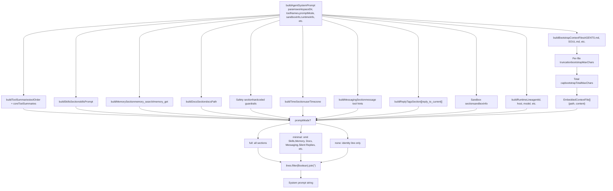
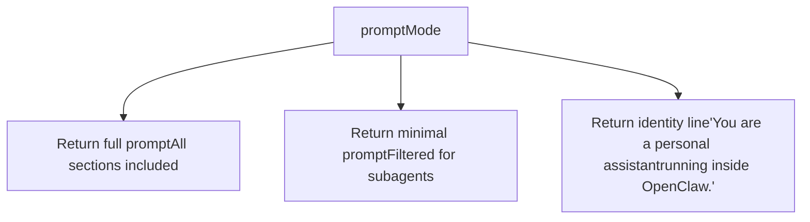
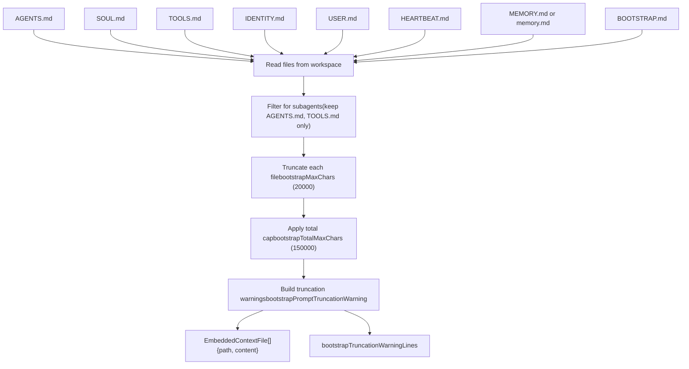
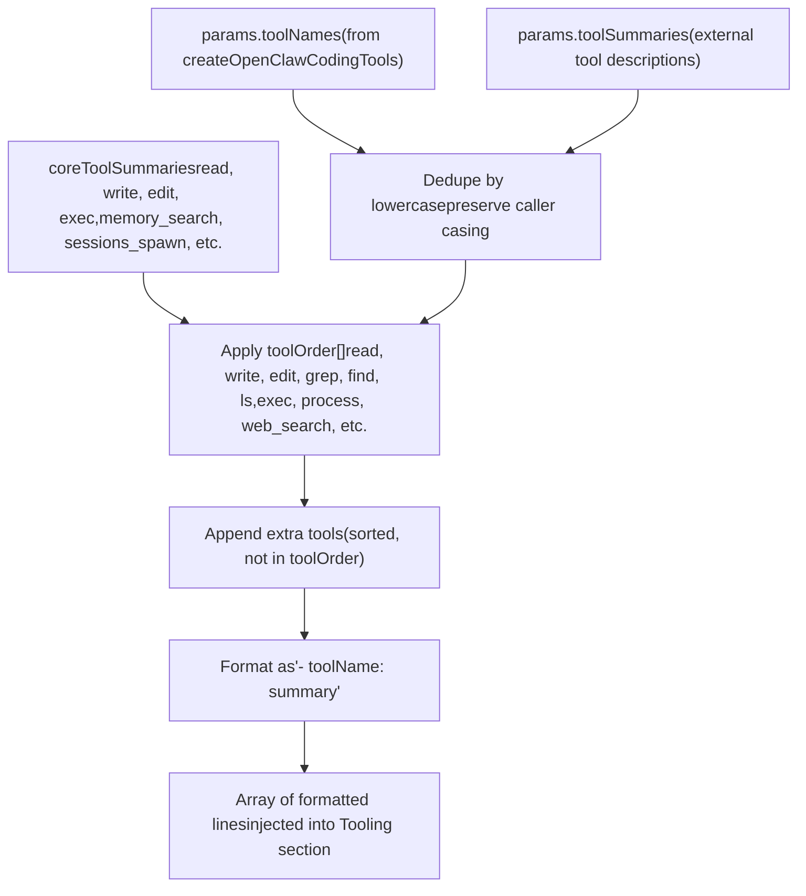

# System Prompt & Context

Relevant source files

-   [docs/concepts/system-prompt.md](https://github.com/openclaw/openclaw/blob/8873e13f/docs/concepts/system-prompt.md)
-   [docs/gateway/background-process.md](https://github.com/openclaw/openclaw/blob/8873e13f/docs/gateway/background-process.md)
-   [src/agents/bash-process-registry.test.ts](https://github.com/openclaw/openclaw/blob/8873e13f/src/agents/bash-process-registry.test.ts)
-   [src/agents/bash-process-registry.ts](https://github.com/openclaw/openclaw/blob/8873e13f/src/agents/bash-process-registry.ts)
-   [src/agents/bash-tools.ts](https://github.com/openclaw/openclaw/blob/8873e13f/src/agents/bash-tools.ts)
-   [src/agents/pi-embedded-helpers.ts](https://github.com/openclaw/openclaw/blob/8873e13f/src/agents/pi-embedded-helpers.ts)
-   [src/agents/pi-embedded-runner.ts](https://github.com/openclaw/openclaw/blob/8873e13f/src/agents/pi-embedded-runner.ts)
-   [src/agents/pi-embedded-subscribe.ts](https://github.com/openclaw/openclaw/blob/8873e13f/src/agents/pi-embedded-subscribe.ts)
-   [src/agents/pi-tools.ts](https://github.com/openclaw/openclaw/blob/8873e13f/src/agents/pi-tools.ts)
-   [src/agents/system-prompt.test.ts](https://github.com/openclaw/openclaw/blob/8873e13f/src/agents/system-prompt.test.ts)
-   [src/agents/system-prompt.ts](https://github.com/openclaw/openclaw/blob/8873e13f/src/agents/system-prompt.ts)

This page documents how OpenClaw assembles the system prompt for each agent run, including hardcoded sections, bootstrap context injection, and runtime metadata. The system prompt is built dynamically per-turn and injected into the agent's context window before model invocation.

For agent execution flow and tool provisioning, see [Agent Execution Pipeline](/openclaw/openclaw/3.1-agent-execution-pipeline). For configuration of bootstrap files and limits, see [Configuration Reference](/openclaw/openclaw/2.3.1-configuration-reference).

---

## Overview

OpenClaw owns the system prompt entirely—it does not use the default pi-coding-agent prompt. The prompt is assembled by [\`buildAgentSystemPrompt()\`](https://github.com/openclaw/openclaw/blob/8873e13f/`buildAgentSystemPrompt()`)() and includes:

-   **Hardcoded sections**: Tooling, Safety, OpenClaw CLI, Workspace, Runtime, etc.
-   **Dynamic content**: Tool summaries, runtime capabilities, model info, time zone
-   **Injected bootstrap files**: `AGENTS.md`, `SOUL.md`, `TOOLS.md`, `IDENTITY.md`, `USER.md`, `HEARTBEAT.md`, `MEMORY.md`, `BOOTSTRAP.md` (when present in workspace)
-   **Prompt mode filtering**: `full`, `minimal`, or `none` to control verbosity (subagents use `minimal`)

The assembled prompt is passed to the agent runtime as the system message in the conversation history.

**Sources:** [src/agents/system-prompt.ts189-686](https://github.com/openclaw/openclaw/blob/8873e13f/src/agents/system-prompt.ts#L189-L686) [docs/concepts/system-prompt.md1-133](https://github.com/openclaw/openclaw/blob/8873e13f/docs/concepts/system-prompt.md#L1-L133)

---

## System Prompt Assembly Pipeline


**Prompt Assembly Flow**

The system prompt is built by assembling sections conditionally based on `promptMode` and available data. Each section builder checks preconditions (e.g., `isMinimal`, tool availability) before contributing lines to the final prompt array.

**Sources:** [src/agents/system-prompt.ts189-686](https://github.com/openclaw/openclaw/blob/8873e13f/src/agents/system-prompt.ts#L189-L686) [src/agents/system-prompt.ts422-684](https://github.com/openclaw/openclaw/blob/8873e13f/src/agents/system-prompt.ts#L422-L684)

---

## Prompt Modes

OpenClaw supports three prompt modes, controlled by the `promptMode` parameter passed to [\`buildAgentSystemPrompt()\`](https://github.com/openclaw/openclaw/blob/8873e13f/`buildAgentSystemPrompt()`)():

| Mode | Used For | Included Sections | Omitted Sections |
| --- | --- | --- | --- |
| `full` | Main agent runs | All sections | None |
| `minimal` | Subagents, isolated sessions | Tooling, Safety, Workspace, Sandbox, Runtime, Skills (if provided), Subagent Context | Memory Recall, Documentation, User Identity, Reply Tags, Messaging, Silent Replies, Heartbeats, Model Aliases, OpenClaw Self-Update |
| `none` | Rare/experimental | Identity line only | All sections |

**Mode Selection Logic:**


**Minimal Mode Rationale:** Subagents inherit context from the parent session and don't need user identity, heartbeats, or messaging guidance. Skills are still included when `skillsPrompt` is provided (for cron sessions). The `extraSystemPrompt` parameter is labeled as "Subagent Context" instead of "Group Chat Context" when `promptMode="minimal"`.

**Sources:** [src/agents/system-prompt.ts16-17](https://github.com/openclaw/openclaw/blob/8873e13f/src/agents/system-prompt.ts#L16-L17) [src/agents/system-prompt.ts379-420](https://github.com/openclaw/openclaw/blob/8873e13f/src/agents/system-prompt.ts#L379-L420) [src/agents/system-prompt.test.ts96-133](https://github.com/openclaw/openclaw/blob/8873e13f/src/agents/system-prompt.test.ts#L96-L133) [docs/concepts/system-prompt.md35-50](https://github.com/openclaw/openclaw/blob/8873e13f/docs/concepts/system-prompt.md#L35-L50)

---

## System Prompt Sections

The following table lists all hardcoded sections that may appear in the system prompt, their conditions, and the builder function responsible for each.

| Section | Condition | Builder / Lines | Description |
| --- | --- | --- | --- |
| **Identity** | Always | Hardcoded line | "You are a personal assistant running inside OpenClaw." |
| **Tooling** | Always (except `none`) | [system-prompt.ts422-448](https://github.com/openclaw/openclaw/blob/8873e13f/system-prompt.ts#L422-L448) | Lists available tools + summaries (filtered by policy) |
| **Tool Call Style** | Not `minimal` | [system-prompt.ts461-467](https://github.com/openclaw/openclaw/blob/8873e13f/system-prompt.ts#L461-L467) | Default: don't narrate routine tool calls |
| **Safety** | Always (except `none`) | [system-prompt.ts394-400](https://github.com/openclaw/openclaw/blob/8873e13f/system-prompt.ts#L394-L400) | "You have no independent goals..." guardrails |
| **OpenClaw CLI Quick Reference** | Not `minimal` | [system-prompt.ts469-477](https://github.com/openclaw/openclaw/blob/8873e13f/system-prompt.ts#L469-L477) | `openclaw gateway start/stop/restart` |
| **Skills** | `skillsPrompt` provided | [\`buildSkillsSection\`](https://github.com/openclaw/openclaw/blob/8873e13f/`buildSkillsSection`)() | Available skills list + read-on-demand instructions |
| **Memory Recall** | `memory_search` or `memory_get` available, not `minimal` | [\`buildMemorySection\`](https://github.com/openclaw/openclaw/blob/8873e13f/`buildMemorySection`)() | Guidance on using memory tools + citations mode |
| **OpenClaw Self-Update** | `gateway` tool + not `minimal` | [system-prompt.ts481-491](https://github.com/openclaw/openclaw/blob/8873e13f/system-prompt.ts#L481-L491) | `config.apply`, `config.patch`, `update.run` guidance |
| **Model Aliases** | `modelAliasLines` provided, not `minimal` | [system-prompt.ts494-503](https://github.com/openclaw/openclaw/blob/8873e13f/system-prompt.ts#L494-L503) | Prefer aliases like "opus" over full provider/model |
| **Workspace** | Always (except `none`) | [system-prompt.ts507-511](https://github.com/openclaw/openclaw/blob/8873e13f/system-prompt.ts#L507-L511) | Working directory + sandbox path distinction |
| **Documentation** | `docsPath` provided, not `minimal` | [\`buildDocsSection\`](https://github.com/openclaw/openclaw/blob/8873e13f/`buildDocsSection`)() | Local docs path, mirror, community links |
| **Sandbox** | `sandboxInfo.enabled` | [system-prompt.ts513-560](https://github.com/openclaw/openclaw/blob/8873e13f/system-prompt.ts#L513-L560) | Container workdir, elevated exec, browser bridge |
| **Authorized Senders** | `ownerNumbers` provided, not `minimal` | [\`buildUserIdentitySection\`](https://github.com/openclaw/openclaw/blob/8873e13f/`buildUserIdentitySection`)() | Hashed or raw owner IDs |
| **Current Date & Time** | `userTimezone` provided | [\`buildTimeSection\`](https://github.com/openclaw/openclaw/blob/8873e13f/`buildTimeSection`)() | Time zone only (not current time, for cache stability) |
| **Workspace Files (injected)** | Always (except `none`) | [system-prompt.ts565-567](https://github.com/openclaw/openclaw/blob/8873e13f/system-prompt.ts#L565-L567) | Header for bootstrap context |
| **Reply Tags** | Not `minimal` | [\`buildReplyTagsSection\`](https://github.com/openclaw/openclaw/blob/8873e13f/`buildReplyTagsSection`)() | `[[reply_to_current]]` syntax |
| **Messaging** | Not `minimal` | [\`buildMessagingSection\`](https://github.com/openclaw/openclaw/blob/8873e13f/`buildMessagingSection`)() | `message` tool usage, inline buttons, cross-session sends |
| **Voice (TTS)** | `ttsHint` provided, not `minimal` | [\`buildVoiceSection\`](https://github.com/openclaw/openclaw/blob/8873e13f/`buildVoiceSection`)() | TTS guidance |
| **Group Chat Context** / **Subagent Context** | `extraSystemPrompt` provided | [system-prompt.ts580-585](https://github.com/openclaw/openclaw/blob/8873e13f/system-prompt.ts#L580-L585) | Custom injected context (header varies by mode) |
| **Reactions** | `reactionGuidance` provided | [system-prompt.ts586-608](https://github.com/openclaw/openclaw/blob/8873e13f/system-prompt.ts#L586-L608) | Minimal or extensive reaction frequency |
| **Reasoning Format** | `reasoningTagHint` enabled | [system-prompt.ts352-363](https://github.com/openclaw/openclaw/blob/8873e13f/system-prompt.ts#L352-L363) [system-prompt.ts609-611](https://github.com/openclaw/openclaw/blob/8873e13f/system-prompt.ts#L609-L611) | \`\` + `<final>...</final>` tags |
| **Project Context** | `contextFiles` present or truncation warnings | [system-prompt.ts613-646](https://github.com/openclaw/openclaw/blob/8873e13f/system-prompt.ts#L613-L646) | Injected bootstrap files (AGENTS.md, SOUL.md, etc.) |
| **Silent Replies** | Not `minimal` | [system-prompt.ts649-664](https://github.com/openclaw/openclaw/blob/8873e13f/system-prompt.ts#L649-L664) | `[SILENT_REPLY_TOKEN]` rules |
| **Heartbeats** | Not `minimal` | [system-prompt.ts666-677](https://github.com/openclaw/openclaw/blob/8873e13f/system-prompt.ts#L666-L677) | Heartbeat ack behavior |
| **Runtime** | Always (except `none`) | [\`buildRuntimeLine\`](https://github.com/openclaw/openclaw/blob/8873e13f/`buildRuntimeLine`)() | \`agent=X |

**Sources:** [src/agents/system-prompt.ts189-686](https://github.com/openclaw/openclaw/blob/8873e13f/src/agents/system-prompt.ts#L189-L686) [src/agents/system-prompt.ts20-187](https://github.com/openclaw/openclaw/blob/8873e13f/src/agents/system-prompt.ts#L20-L187)

---

## Bootstrap Context Injection

Bootstrap files are workspace files that are automatically loaded and injected into the **Project Context** section of the system prompt. This allows the agent to see identity, preferences, and memory without requiring explicit `read` tool calls.

### Bootstrap File Loading


**Bootstrap File Rules:**

1.  **Main sessions** inject all bootstrap files found in workspace
2.  **Subagent sessions** only inject `AGENTS.md` and `TOOLS.md` (filtered via [\`buildBootstrapContextFiles\`](https://github.com/openclaw/openclaw/blob/8873e13f/`buildBootstrapContextFiles`)())
3.  **Per-file cap**: Each file is truncated to `bootstrapMaxChars` (default 20,000 characters)
4.  **Total cap**: All injected content combined is capped at `bootstrapTotalMaxChars` (default 150,000 characters)
5.  **Truncation warnings**: When `bootstrapPromptTruncationWarning` is enabled (`once` or `always`), a warning block is injected into Project Context showing which files were truncated and by how much

**Special Handling:**

-   **SOUL.md**: When detected (case-insensitive basename check), the prompt includes: *"If SOUL.md is present, embody its persona and tone. Avoid stiff, generic replies; follow its guidance unless higher-priority instructions override it."* ([system-prompt.ts623-633](https://github.com/openclaw/openclaw/blob/8873e13f/system-prompt.ts#L623-L633))
-   **MEMORY.md**: Both `MEMORY.md` and `memory.md` are injected if present (case-sensitive check)
-   **BOOTSTRAP.md**: Only injected for brand-new workspaces (not re-injected after initial setup)
-   **memory/\*.md daily files**: **Not** injected automatically; accessed on-demand via `memory_search` and `memory_get` tools

**Configuration:**

```
agents.defaults.bootstrapMaxChars          // Default: 20000agents.defaults.bootstrapTotalMaxChars     // Default: 150000agents.defaults.bootstrapPromptTruncationWarning  // "off" | "once" | "always"
```
**Sources:** [src/agents/pi-embedded-helpers/bootstrap.ts1-11](https://github.com/openclaw/openclaw/blob/8873e13f/src/agents/pi-embedded-helpers/bootstrap.ts#L1-L11) [docs/concepts/system-prompt.md51-88](https://github.com/openclaw/openclaw/blob/8873e13f/docs/concepts/system-prompt.md#L51-L88) [src/agents/system-prompt.ts613-646](https://github.com/openclaw/openclaw/blob/8873e13f/src/agents/system-prompt.ts#L613-L646)

---

## Tool Summaries

The **Tooling** section lists all tools available to the agent, filtered by policy (global, agent-level, group-level, sandbox, subagent). Tool names are case-sensitive and displayed exactly as provisioned.

### Tool Summary Assembly


**Core Tool Summaries** ([system-prompt.ts240-272](https://github.com/openclaw/openclaw/blob/8873e13f/system-prompt.ts#L240-L272)):

-   `read`: "Read file contents"
-   `write`: "Create or overwrite files"
-   `edit`: "Make precise edits to files"
-   `apply_patch`: "Apply multi-file patches"
-   `exec`: "Run shell commands (pty available for TTY-required CLIs)"
-   `process`: "Manage background exec sessions"
-   `memory_search`: Varies based on ACP runtime state
-   `sessions_spawn`: Varies based on ACP runtime state
-   `subagents`: "List, steer, or kill sub-agent runs for this requester session"
-   `session_status`: "Show a /status-equivalent status card..."
-   `image`: "Analyze an image with the configured image model"
-   ... (see full map in [system-prompt.ts240-272](https://github.com/openclaw/openclaw/blob/8873e13f/system-prompt.ts#L240-L272))

**ACP-Aware Summaries:** When `acpSpawnRuntimeEnabled` is true (not sandboxed + ACP enabled), tool summaries for `agents_list`, `sessions_spawn`, and related tools include ACP harness guidance. When sandboxed, ACP spawn references are omitted and a sandbox blocking note is added.

**Tool Ordering:** Tools are sorted by `toolOrder` array for consistent display. Extra tools (not in `toolOrder`) are appended alphabetically.

**Sources:** [src/agents/system-prompt.ts240-339](https://github.com/openclaw/openclaw/blob/8873e13f/src/agents/system-prompt.ts#L240-L339) [src/agents/system-prompt.ts422-448](https://github.com/openclaw/openclaw/blob/8873e13f/src/agents/system-prompt.ts#L422-L448)

---

## Runtime Information

The **Runtime** section is a single-line summary of the current execution context, built by [\`buildRuntimeLine()\`](https://github.com/openclaw/openclaw/blob/8873e13f/`buildRuntimeLine()`)().

**Format:**

```
Runtime: agent=<agentId> | host=<hostname> | repo=<repoRoot> | os=<os> (<arch>) | node=<version> | model=<modelId> | default_model=<defaultModel> | shell=<shell> | channel=<channel> | capabilities=<cap1,cap2,...> | thinking=<thinkLevel>
```
**Components:**

| Field | Source | Example |
| --- | --- | --- |
| `agent` | `runtimeInfo.agentId` | `agent=work` |
| `host` | `runtimeInfo.host` | `host=macbook-pro.local` |
| `repo` | `runtimeInfo.repoRoot` | `repo=/Users/me/openclaw` |
| `os` | `runtimeInfo.os` + `runtimeInfo.arch` | `os=macOS (arm64)` |
| `node` | `runtimeInfo.node` | `node=v20.11.0` |
| `model` | `runtimeInfo.model` | `model=anthropic/claude-sonnet-4` |
| `default_model` | `runtimeInfo.defaultModel` | `default_model=anthropic/claude-sonnet-3-5` |
| `shell` | `runtimeInfo.shell` | `shell=/bin/zsh` |
| `channel` | `runtimeInfo.channel` | `channel=telegram` |
| `capabilities` | `runtimeInfo.capabilities` | `capabilities=inlineButtons,reactions` |
| `thinking` | `defaultThinkLevel` | `thinking=off` |

All fields are optional; only non-empty values appear in the final line.

**Additional Runtime Context:**

The **Reasoning** line follows the Runtime line and shows the current reasoning visibility level:

```
Reasoning: <reasoningLevel> (hidden unless on/stream). Toggle /reasoning; /status shows Reasoning when enabled.
```
**Sources:** [src/agents/system-prompt.ts688-725](https://github.com/openclaw/openclaw/blob/8873e13f/src/agents/system-prompt.ts#L688-L725) [src/agents/system-prompt.ts679-684](https://github.com/openclaw/openclaw/blob/8873e13f/src/agents/system-prompt.ts#L679-L684)

---

## Configuration Parameters

The `buildAgentSystemPrompt()` function accepts extensive configuration through its parameters. Key parameters:

| Parameter | Type | Purpose |
| --- | --- | --- |
| `workspaceDir` | `string` | Required. Agent workspace directory. |
| `promptMode` | `PromptMode` | `"full"` | `"minimal"` | `"none"`. Default: `"full"`. |
| `toolNames` | `string[]` | Available tool names (case-sensitive). |
| `toolSummaries` | `Record<string, string>` | External tool descriptions. |
| `contextFiles` | `EmbeddedContextFile[]` | Bootstrap files to inject. |
| `sandboxInfo` | `EmbeddedSandboxInfo` | Sandbox runtime details (enabled, paths, browser, elevated). |
| `runtimeInfo` | `{agentId, host, os, arch, node, model, shell, channel, capabilities}` | Runtime metadata for Runtime line. |
| `skillsPrompt` | `string` | Available skills XML block. |
| `docsPath` | `string` | Local OpenClaw docs directory path. |
| `userTimezone` | `string` | User timezone (e.g., `"America/Chicago"`). |
| `ownerNumbers` | `string[]` | Authorized sender IDs (phone numbers, etc.). |
| `ownerDisplay` | `"raw"` | `"hash"` | Display mode for owner IDs. |
| `ownerDisplaySecret` | `string` | HMAC secret for hashing owner IDs. |
| `modelAliasLines` | `string[]` | Model alias display lines. |
| `reasoningTagHint` | `boolean` | Enable `<think>/<final>` tag instructions. |
| `reasoningLevel` | `ReasoningLevel` | `"off"` | `"on"` | `"stream"`. |
| `defaultThinkLevel` | `ThinkLevel` | Thinking level for Runtime line. |
| `extraSystemPrompt` | `string` | Custom context (Group Chat Context or Subagent Context). |
| `workspaceNotes` | `string[]` | Additional workspace guidance lines. |
| `ttsHint` | `string` | Voice (TTS) guidance. |
| `messageToolHints` | `string[]` | Additional message tool guidance. |
| `reactionGuidance` | `{level, channel}` | Reaction frequency guidance. |
| `memoryCitationsMode` | `MemoryCitationsMode` | `"on"` | `"off"`. Controls citation display. |
| `acpEnabled` | `boolean` | Include ACP harness guidance. Default: `true`. |
| `bootstrapTruncationWarningLines` | `string[]` | Truncation warning lines. |

**Sources:** [src/agents/system-prompt.ts189-236](https://github.com/openclaw/openclaw/blob/8873e13f/src/agents/system-prompt.ts#L189-L236)

---

## Context Injection Hook

The bootstrap file loading step can be intercepted by internal hooks via the `agent:bootstrap` hook. This allows plugins or runtime logic to:

-   Replace `SOUL.md` with an alternate persona
-   Inject additional context files not in the workspace
-   Mutate or filter loaded files before injection

**Hook Invocation:** The hook is called by [\`buildBootstrapContextFiles()\`](https://github.com/openclaw/openclaw/blob/8873e13f/`buildBootstrapContextFiles()`)() (implementation exported from [src/agents/pi-embedded-runner.ts2](https://github.com/openclaw/openclaw/blob/8873e13f/src/agents/pi-embedded-runner.ts#L2-L2)).

**Sources:** [docs/concepts/system-prompt.md84-86](https://github.com/openclaw/openclaw/blob/8873e13f/docs/concepts/system-prompt.md#L84-L86)

---

## Time Zone Handling

The system prompt includes **only the time zone** in the "Current Date & Time" section, not the current time or date. This design choice preserves **prompt cache stability**—including dynamic timestamps would invalidate the cache on every request.

**Guidance to Agent:**

```
If you need the current date, time, or day of week, run session_status (📊 session_status).
```
The `session_status` tool returns a status card that includes a timestamp line with the current date/time formatted according to `agents.defaults.timeFormat` (`auto`, `12`, or `24`).

**Why no timestamp in system prompt?**

-   Prompt caching (especially Anthropic's) relies on stable system prompts
-   Dynamic content (like timestamps) invalidates the cache every turn
-   Gateway-level timestamp injection into messages is the preferred approach (see issue references in test comments)

**Sources:** [src/agents/system-prompt.ts97-102](https://github.com/openclaw/openclaw/blob/8873e13f/src/agents/system-prompt.ts#L97-L102) [src/agents/system-prompt.test.ts409-426](https://github.com/openclaw/openclaw/blob/8873e13f/src/agents/system-prompt.test.ts#L409-L426) [docs/concepts/system-prompt.md89-104](https://github.com/openclaw/openclaw/blob/8873e13f/docs/concepts/system-prompt.md#L89-L104)
