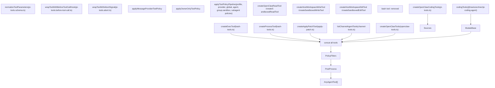
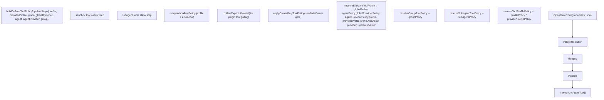

# Tools

Relevant source files

-   [docs/concepts/system-prompt.md](https://github.com/openclaw/openclaw/blob/8873e13f/docs/concepts/system-prompt.md)
-   [docs/gateway/background-process.md](https://github.com/openclaw/openclaw/blob/8873e13f/docs/gateway/background-process.md)
-   [src/agents/bash-process-registry.test.ts](https://github.com/openclaw/openclaw/blob/8873e13f/src/agents/bash-process-registry.test.ts)
-   [src/agents/bash-process-registry.ts](https://github.com/openclaw/openclaw/blob/8873e13f/src/agents/bash-process-registry.ts)
-   [src/agents/bash-tools.ts](https://github.com/openclaw/openclaw/blob/8873e13f/src/agents/bash-tools.ts)
-   [src/agents/pi-embedded-helpers.ts](https://github.com/openclaw/openclaw/blob/8873e13f/src/agents/pi-embedded-helpers.ts)
-   [src/agents/pi-embedded-runner.ts](https://github.com/openclaw/openclaw/blob/8873e13f/src/agents/pi-embedded-runner.ts)
-   [src/agents/pi-embedded-subscribe.ts](https://github.com/openclaw/openclaw/blob/8873e13f/src/agents/pi-embedded-subscribe.ts)
-   [src/agents/pi-tools.ts](https://github.com/openclaw/openclaw/blob/8873e13f/src/agents/pi-tools.ts)
-   [src/agents/system-prompt.test.ts](https://github.com/openclaw/openclaw/blob/8873e13f/src/agents/system-prompt.test.ts)
-   [src/agents/system-prompt.ts](https://github.com/openclaw/openclaw/blob/8873e13f/src/agents/system-prompt.ts)

This page covers the agent tool system: how tools are assembled for each agent turn, the policy enforcement pipeline that filters and guards them, workspace root protection, schema normalization, and the full inventory of available tools.

For details on specific tool subsystems, see:

-   Exec tool, exec approvals, and PTY support: [3.4.1](/openclaw/openclaw/3.4.1-exec-tool-and-background-processes)
-   Memory tools (`memory_search`, `memory_get`): [3.4.2](/openclaw/openclaw/3.4.2-memory-and-search)
-   Subagent spawning via `sessions_spawn`: [3.4.3](/openclaw/openclaw/3.4.3-subagents-and-acp)
-   How tools are injected into the system prompt: [3.2](/openclaw/openclaw/3.2-system-prompt-and-context)
-   Sandbox interaction with tools: [7.2](/openclaw/openclaw/7.2-sandboxing)

---

## Tool Assembly Entry Point

Every agent turn begins by calling `createOpenClawCodingTools` in [src/agents/pi-tools.ts182-544](https://github.com/openclaw/openclaw/blob/8873e13f/src/agents/pi-tools.ts#L182-L544) This function constructs and returns the complete `AnyAgentTool[]` list that is passed to the model API. It accepts a rich `options` object covering agent identity, model provider, sandbox context, filesystem policy, message routing, and policy overrides.

The assembled list is the result of several sequential operations:

**Tool assembly diagram**


Sources: [src/agents/pi-tools.ts331-543](https://github.com/openclaw/openclaw/blob/8873e13f/src/agents/pi-tools.ts#L331-L543)

---

## Tool Categories

Tools come from two origins: the upstream `codingTools` set (from `@mariozechner/pi-coding-agent`) and OpenClaw-native tools created in `createOpenClawTools` ([src/agents/openclaw-tools.ts](https://github.com/openclaw/openclaw/blob/8873e13f/src/agents/openclaw-tools.ts)).

### Base Coding Tools

The `codingTools` array from `@mariozechner/pi-coding-agent` provides the core filesystem tools. OpenClaw replaces several of these in-place during assembly:

| Tool name | Replacement in `createOpenClawCodingTools` | Source |
| --- | --- | --- |
| `read` | `createOpenClawReadTool` or `createSandboxedReadTool` | `pi-tools.read.ts` |
| `write` | `createHostWorkspaceWriteTool` or `createSandboxedWriteTool` | `pi-tools.read.ts` |
| `edit` | `createHostWorkspaceEditTool` or `createSandboxedEditTool` | `pi-tools.read.ts` |
| `bash` | **Removed entirely** | — |
| `exec` | **Removed from base, re-added via `createExecTool`** | `bash-tools.ts` |

Sources: [src/agents/pi-tools.ts331-373](https://github.com/openclaw/openclaw/blob/8873e13f/src/agents/pi-tools.ts#L331-L373)

### OpenClaw-Native Tools

`createOpenClawTools` ([src/agents/openclaw-tools.ts](https://github.com/openclaw/openclaw/blob/8873e13f/src/agents/openclaw-tools.ts)) adds the following tool groups. These are documented in [docs/tools/index.md](https://github.com/openclaw/openclaw/blob/8873e13f/docs/tools/index.md):

| Tool group shorthand | Tools included |
| --- | --- |
| `group:runtime` | `exec`, `bash`, `process` |
| `group:fs` | `read`, `write`, `edit`, `apply_patch` |
| `group:sessions` | `sessions_list`, `sessions_history`, `sessions_send`, `sessions_spawn`, `session_status` |
| `group:memory` | `memory_search`, `memory_get` |
| `group:web` | `web_search`, `web_fetch` |
| `group:ui` | `browser`, `canvas` |
| `group:automation` | `cron`, `gateway` |
| `group:messaging` | `message` |
| `group:nodes` | `nodes` |
| `group:openclaw` | All built-in tools |

Additional tools: `image`, `agents_list`, `tts` (voice; excluded when `messageProvider=voice`).

Channel plugins may also contribute tools via `listChannelAgentTools` ([src/agents/channel-tools.ts](https://github.com/openclaw/openclaw/blob/8873e13f/src/agents/channel-tools.ts)).

Sources: [docs/tools/index.md141-164](https://github.com/openclaw/openclaw/blob/8873e13f/docs/tools/index.md#L141-L164) [src/agents/pi-tools.ts454-496](https://github.com/openclaw/openclaw/blob/8873e13f/src/agents/pi-tools.ts#L454-L496)

---

## Tool Policy Pipeline

Policy enforcement is the most complex part of tool assembly. Multiple independent policy layers are resolved and then applied in sequence via `applyToolPolicyPipeline` ([src/agents/tool-policy-pipeline.ts](https://github.com/openclaw/openclaw/blob/8873e13f/src/agents/tool-policy-pipeline.ts)).

### Policy Layers

**Tool policy resolution diagram**


Sources: [src/agents/pi-tools.ts244-521](https://github.com/openclaw/openclaw/blob/8873e13f/src/agents/pi-tools.ts#L244-L521) [src/agents/pi-tools.policy.ts](https://github.com/openclaw/openclaw/blob/8873e13f/src/agents/pi-tools.policy.ts) [src/agents/tool-policy-pipeline.ts](https://github.com/openclaw/openclaw/blob/8873e13f/src/agents/tool-policy-pipeline.ts) [src/agents/tool-policy.ts](https://github.com/openclaw/openclaw/blob/8873e13f/src/agents/tool-policy.ts)

### Policy Precedence

The pipeline applies policies as ordered steps. Within each step, `deny` wins over `allow`. The effective precedence (from broadest to narrowest) is:

1.  **Profile policy** (`tools.profile`) — base allowlist before explicit allow/deny
2.  **Provider profile policy** (`tools.byProvider[provider].profile`) — further narrows for a specific model provider or `provider/model`
3.  **Global policy** (`tools.allow` / `tools.deny`)
4.  **Global provider policy** (`tools.byProvider[provider].allow/deny`)
5.  **Agent policy** (`agents.list[].tools.allow/deny`)
6.  **Agent provider policy** (`agents.list[].tools.byProvider`)
7.  **Group policy** — channel-level restrictions (resolved by `resolveGroupToolPolicy`)
8.  **Sandbox tools policy** (`sandbox.tools.allow/deny`)
9.  **Subagent policy** — depth-based restrictions (resolved by `resolveSubagentToolPolicy`)

Additionally:

-   **Owner-only policy** (`applyOwnerOnlyToolPolicy`): certain tools are gated on `senderIsOwner === true`
-   **Message provider policy** (`applyMessageProviderToolPolicy`): e.g., `tts` is excluded when `messageProvider=voice`

Sources: [src/agents/pi-tools.ts259-522](https://github.com/openclaw/openclaw/blob/8873e13f/src/agents/pi-tools.ts#L259-L522) [docs/tools/index.md34-136](https://github.com/openclaw/openclaw/blob/8873e13f/docs/tools/index.md#L34-L136)

### Tool Profiles

The `tools.profile` setting establishes a base allowlist before explicit `allow`/`deny` lists:

| Profile | Included tools |
| --- | --- |
| `minimal` | `session_status` only |
| `coding` | `group:fs`, `group:runtime`, `group:sessions`, `group:memory`, `image` |
| `messaging` | `group:messaging`, `sessions_list`, `sessions_history`, `sessions_send`, `session_status` |
| `full` | No restriction (same as unset) |

Per-agent override: `agents.list[].tools.profile`. Provider override: `tools.byProvider[key].profile`.

Sources: [docs/tools/index.md34-80](https://github.com/openclaw/openclaw/blob/8873e13f/docs/tools/index.md#L34-L80)

---

## Workspace Root Guards

When `tools.fs.workspaceOnly` is `true` (or the agent is sandboxed), filesystem tools are wrapped with guards that enforce path containment. This is done via wrappers defined in [src/agents/pi-tools.read.ts](https://github.com/openclaw/openclaw/blob/8873e13f/src/agents/pi-tools.read.ts):

| Wrapper | When applied | Purpose |
| --- | --- | --- |
| `wrapToolWorkspaceRootGuard` | Host (non-sandbox) mode + `workspaceOnly` | Rejects paths outside `workspaceRoot` |
| `wrapToolWorkspaceRootGuardWithOptions` | Sandbox mode + `workspaceOnly` | Same, but also maps container paths via `containerWorkdir` |

**Workspace guard flow diagram**

```mermaid
flowchart TD
    read_tool["read tool(base)"]
    sandbox_check["sandboxenabled?"]
    wo_check["workspaceOnly= true?"]
    sandboxed_read["createSandboxedReadTool(root=sandboxRoot, bridge=sandboxFsBridge)"]
    sandboxed_guarded["wrapToolWorkspaceRootGuardWithOptions(containerWorkdir mapping)"]
    fresh_read["createReadTool(workspaceRoot)(@mariozechner/pi-coding-agent)"]
    openclaw_read["createOpenClawReadTool(adds image sanitization + context window budget)"]
    host_guarded["wrapToolWorkspaceRootGuard(workspaceRoot)"]
    sandboxed_result["sandboxed read (unguarded)"]
    wo_check2["workspaceOnly?"]
    host_result["host read (unguarded)"]

    read --> tool_sandbox_check
    sandbox --> check_sandboxed_read
    sandboxed --> read_wo_check
    wo --> check_sandboxed_guarded
    wo --> check_sandboxed_result
    sandbox --> check_fresh_read
    fresh --> read_openclaw_read
    openclaw --> read_wo_check2
    wo --> check2_host_guarded
    wo --> check2_host_result
```


Sources: [src/agents/pi-tools.ts331-373](https://github.com/openclaw/openclaw/blob/8873e13f/src/agents/pi-tools.ts#L331-L373) [src/agents/pi-tools.read.ts](https://github.com/openclaw/openclaw/blob/8873e13f/src/agents/pi-tools.read.ts)

The `workspaceRoot` is resolved via `resolveWorkspaceRoot` ([src/agents/workspace-dir.ts](https://github.com/openclaw/openclaw/blob/8873e13f/src/agents/workspace-dir.ts)), which uses `options.workspaceDir` or falls back to the configured agent workspace. The filesystem policy itself is created by `createToolFsPolicy` in [src/agents/tool-fs-policy.ts](https://github.com/openclaw/openclaw/blob/8873e13f/src/agents/tool-fs-policy.ts)

For `apply_patch`, an analogous flag `applyPatchConfig.workspaceOnly` defaults to `true` and is checked independently:

```
applyPatchWorkspaceOnly = workspaceOnly || applyPatchConfig?.workspaceOnly !== false
```
Sources: [src/agents/pi-tools.ts311-323](https://github.com/openclaw/openclaw/blob/8873e13f/src/agents/pi-tools.ts#L311-L323)

---

## Exec Tool Configuration

The `exec` tool is constructed via `createExecTool` from [src/agents/bash-tools.ts](https://github.com/openclaw/openclaw/blob/8873e13f/src/agents/bash-tools.ts) which merges configuration from:

1.  Inline `options.exec` overrides (passed directly by the caller)
2.  Per-agent exec config (`agents.list[id].tools.exec`)
3.  Global exec config (`tools.exec`)

This merging is done by `resolveExecConfig` in [src/agents/pi-tools.ts118-145](https://github.com/openclaw/openclaw/blob/8873e13f/src/agents/pi-tools.ts#L118-L145) The resulting `execTool` is always included in the assembled list, regardless of policy (policy filtering happens afterward).

The `process` tool (for managing background exec sessions) is created via `createProcessTool` from [src/agents/bash-tools.ts](https://github.com/openclaw/openclaw/blob/8873e13f/src/agents/bash-tools.ts) with its own `cleanupMs` and `scopeKey`. When `process` is disallowed by policy, `exec` runs synchronously and ignores `yieldMs`/`background` parameters.

Sources: [src/agents/pi-tools.ts374-413](https://github.com/openclaw/openclaw/blob/8873e13f/src/agents/pi-tools.ts#L374-L413) [docs/tools/index.md188-226](https://github.com/openclaw/openclaw/blob/8873e13f/docs/tools/index.md#L188-L226)

---

## Schema Normalization and Provider Quirks

After policy filtering, every tool in the list is passed through `normalizeToolParameters` from [src/agents/pi-tools.schema.ts](https://github.com/openclaw/openclaw/blob/8873e13f/src/agents/pi-tools.schema.ts):

-   **OpenAI and most providers**: strips root-level union schemas that would be rejected
-   **Gemini**: applies `cleanToolSchemaForGemini`, which removes constraint keywords (e.g., `minLength`, `pattern`) that the Gemini API rejects

This is applied uniformly to prevent provider-specific schema rejections at the API layer.

Additionally, two provider-specific gating rules exist in `createOpenClawCodingTools`:

-   `apply_patch` is only enabled for OpenAI-family providers (`isOpenAIProvider` check at [src/agents/pi-tools.ts60-63](https://github.com/openclaw/openclaw/blob/8873e13f/src/agents/pi-tools.ts#L60-L63))
-   Anthropic OAuth transport remaps tool names to Claude Code–style names on the wire (handled in `pi-ai`, not in this layer)

Sources: [src/agents/pi-tools.ts524-528](https://github.com/openclaw/openclaw/blob/8873e13f/src/agents/pi-tools.ts#L524-L528) [src/agents/pi-tools.schema.ts](https://github.com/openclaw/openclaw/blob/8873e13f/src/agents/pi-tools.schema.ts)

---

## Tool Lifecycle Wrappers

After schema normalization, each tool receives two additional wrappers applied in order:

**`wrapToolWithBeforeToolCallHook`** ([src/agents/pi-tools.before-tool-call.ts](https://github.com/openclaw/openclaw/blob/8873e13f/src/agents/pi-tools.before-tool-call.ts)):

-   Intercepts every tool call before execution
-   Runs loop detection logic (see below)
-   Receives `agentId`, `sessionKey`, and `loopDetection` config

**`wrapToolWithAbortSignal`** ([src/agents/pi-tools.abort.ts](https://github.com/openclaw/openclaw/blob/8873e13f/src/agents/pi-tools.abort.ts)):

-   Wraps tool execution with an `AbortSignal`
-   Only applied when `options.abortSignal` is provided
-   Throws on signal abort before or during tool execution

Sources: [src/agents/pi-tools.ts529-541](https://github.com/openclaw/openclaw/blob/8873e13f/src/agents/pi-tools.ts#L529-L541)

---

## Tool-Call Loop Detection

Loop detection is configured via `tools.loopDetection` in `openclaw.json` and resolved per-agent by `resolveToolLoopDetectionConfig` in [src/agents/pi-tools.ts147-172](https://github.com/openclaw/openclaw/blob/8873e13f/src/agents/pi-tools.ts#L147-L172):

```
{  tools: {    loopDetection: {      enabled: true,      warningThreshold: 10,      criticalThreshold: 20,      globalCircuitBreakerThreshold: 30,      historySize: 30,      detectors: {        genericRepeat: true,        knownPollNoProgress: true,        pingPong: true,      },    },  },}
```
| Detector | Description |
| --- | --- |
| `genericRepeat` | Same tool + same params called repeatedly |
| `knownPollNoProgress` | Poll-like tools returning identical output |
| `pingPong` | Alternating A/B/A/B patterns with no progress |

The per-agent config is merged over the global config when both exist, with `detectors` merged shallowly. Per-agent override: `agents.list[].tools.loopDetection`.

Sources: [src/agents/pi-tools.ts147-172](https://github.com/openclaw/openclaw/blob/8873e13f/src/agents/pi-tools.ts#L147-L172) [docs/tools/index.md228-255](https://github.com/openclaw/openclaw/blob/8873e13f/docs/tools/index.md#L228-L255)

---

## Sandbox Integration

When `options.sandbox` is provided and `sandbox.enabled` is `true`, tool assembly adapts in several ways:

-   `read`, `write`, `edit` use sandboxed variants that route through `sandboxFsBridge`
-   The filesystem root for path guards becomes `sandboxRoot` (the container workspace path)
-   `exec` receives a `sandbox` object with `containerName`, `workspaceDir`, `containerWorkdir`, and Docker env
-   `apply_patch` is only created when `allowWorkspaceWrites` (i.e., `sandbox.workspaceAccess !== "ro"`)
-   Plugin tool allowlist is computed from `sandbox.tools.allow` as an additional pipeline step

The `SandboxContext` type is defined in [src/agents/sandbox.ts](https://github.com/openclaw/openclaw/blob/8873e13f/src/agents/sandbox.ts)

Sources: [src/agents/pi-tools.ts241-328](https://github.com/openclaw/openclaw/blob/8873e13f/src/agents/pi-tools.ts#L241-L328) [src/agents/pi-tools.ts400-450](https://github.com/openclaw/openclaw/blob/8873e13f/src/agents/pi-tools.ts#L400-L450)

---

## Tool Display Metadata

Tool call display in the Control UI is driven by [src/agents/tool-display.json](https://github.com/openclaw/openclaw/blob/8873e13f/src/agents/tool-display.json) which maps tool names to emoji, display titles, and which parameter keys to extract for the detail label. For example:

| Tool | Emoji | Detail keys |
| --- | --- | --- |
| `exec` | 🛠️ | `command` |
| `read` | 📖 | `path` |
| `browser` | 🌐 | action-specific (e.g., `targetUrl`) |
| `nodes` | 📱 | action-specific (e.g., `node`, `facing`) |
| `cron` | ⏰ | action-specific |
| `sessions_spawn` | 🤖 | `task`, `agentId`, `mode` |

A `fallback` entry handles any tool not explicitly listed.

Sources: [src/agents/tool-display.json1-50](https://github.com/openclaw/openclaw/blob/8873e13f/src/agents/tool-display.json#L1-L50)

---

## Key Types and Files Reference

| Symbol | File | Role |
| --- | --- | --- |
| `createOpenClawCodingTools` | [src/agents/pi-tools.ts](https://github.com/openclaw/openclaw/blob/8873e13f/src/agents/pi-tools.ts) | Main tool assembly entry point |
| `AnyAgentTool` | `src/agents/pi-tools.types.ts` | Union type for all tool objects |
| `resolveEffectiveToolPolicy` | `src/agents/pi-tools.policy.ts` | Resolves global/agent/provider policies |
| `resolveGroupToolPolicy` | `src/agents/pi-tools.policy.ts` | Resolves channel-level group restrictions |
| `resolveSubagentToolPolicy` | `src/agents/pi-tools.policy.ts` | Depth-based subagent tool restrictions |
| `applyToolPolicyPipeline` | `src/agents/tool-policy-pipeline.ts` | Applies ordered policy steps to tool list |
| `applyOwnerOnlyToolPolicy` | `src/agents/tool-policy.ts` | Gates owner-only tools on `senderIsOwner` |
| `resolveToolProfilePolicy` | `src/agents/tool-policy.ts` | Converts a profile string to an allow set |
| `mergeAlsoAllowPolicy` | `src/agents/tool-policy.ts` | Merges `alsoAllow` extension into a profile policy |
| `wrapToolWorkspaceRootGuard` | `src/agents/pi-tools.read.ts` | Enforces path containment (host mode) |
| `createToolFsPolicy` | `src/agents/tool-fs-policy.ts` | Creates the fs policy object from config |
| `resolveWorkspaceRoot` | `src/agents/workspace-dir.ts` | Resolves the effective workspace root path |
| `normalizeToolParameters` | `src/agents/pi-tools.schema.ts` | Provider-aware JSON Schema normalization |
| `cleanToolSchemaForGemini` | `src/agents/pi-tools.schema.ts` | Removes Gemini-incompatible schema keywords |
| `wrapToolWithBeforeToolCallHook` | `src/agents/pi-tools.before-tool-call.ts` | Loop detection intercept |
| `wrapToolWithAbortSignal` | `src/agents/pi-tools.abort.ts` | Abort signal wrapper |
| `createExecTool` | `src/agents/bash-tools.ts` | Creates the `exec` tool |
| `createProcessTool` | `src/agents/bash-tools.ts` | Creates the `process` tool |
| `createApplyPatchTool` | `src/agents/apply-patch.ts` | Creates the `apply_patch` tool |
| `createOpenClawTools` | `src/agents/openclaw-tools.ts` | Creates all OpenClaw-native tools |
| `listChannelAgentTools` | `src/agents/channel-tools.ts` | Returns channel plugin–contributed tools |
| `resolveExecConfig` | [src/agents/pi-tools.ts118-145](https://github.com/openclaw/openclaw/blob/8873e13f/src/agents/pi-tools.ts#L118-L145) | Merges global + agent exec configuration |
| `resolveToolLoopDetectionConfig` | [src/agents/pi-tools.ts147-172](https://github.com/openclaw/openclaw/blob/8873e13f/src/agents/pi-tools.ts#L147-L172) | Merges global + agent loop detection config |
