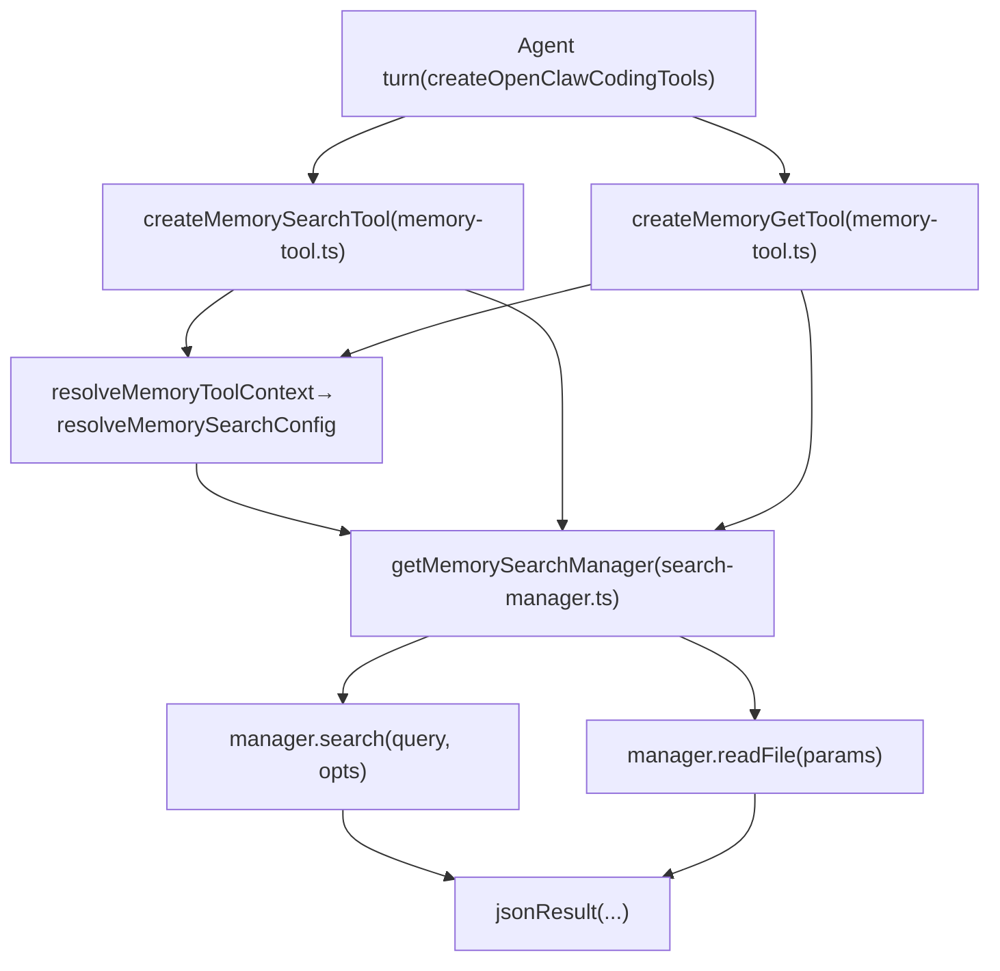
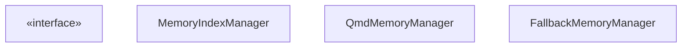
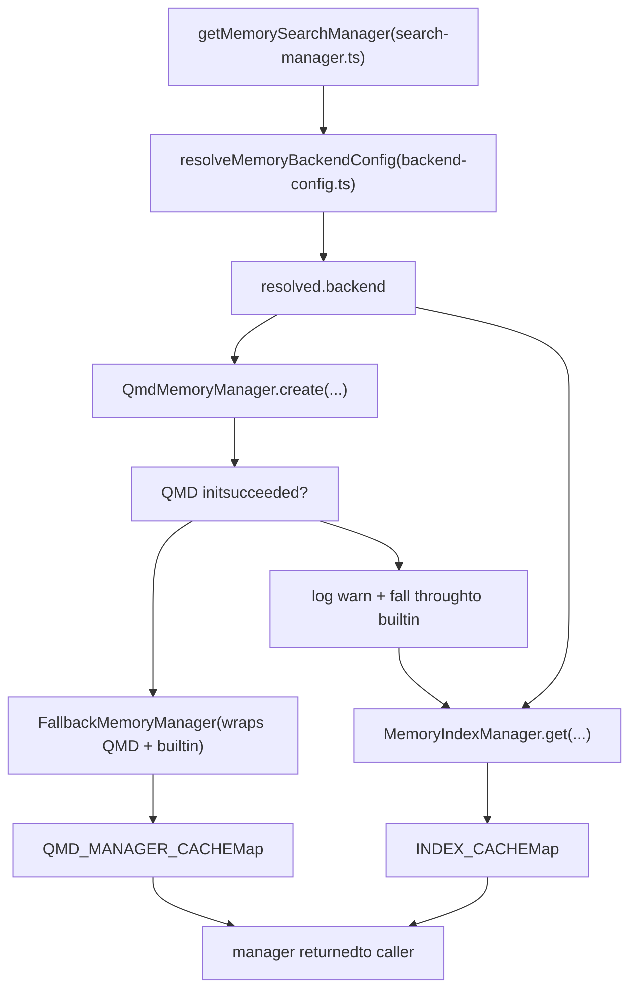
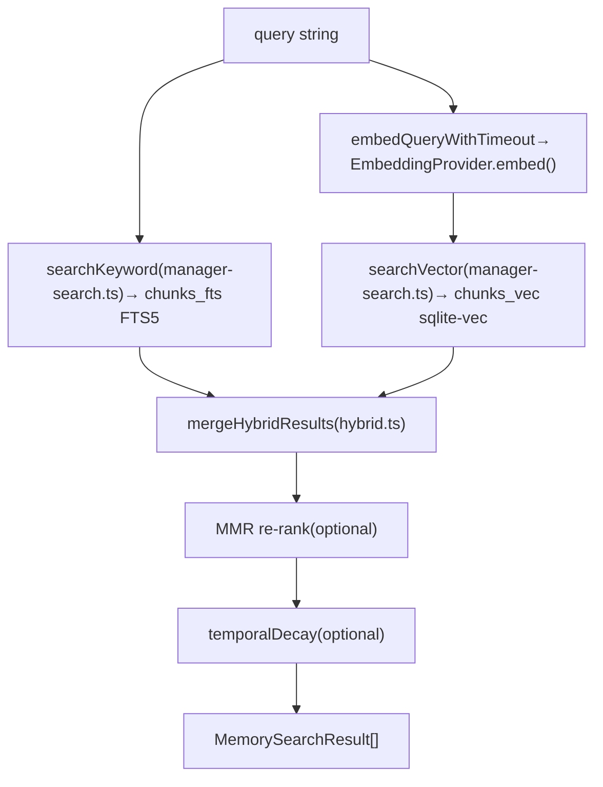
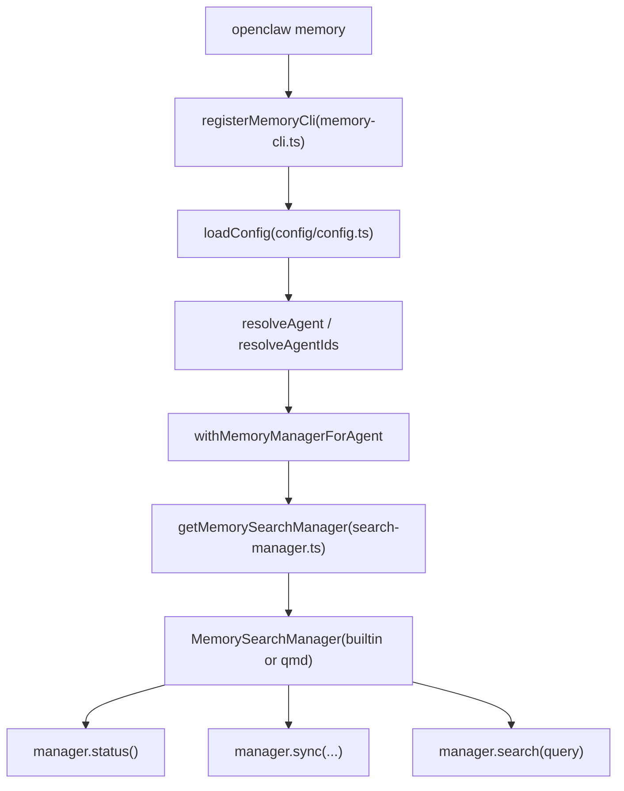

# Memory Tools

Relevant source files

-   [docs/cli/memory.md](https://github.com/openclaw/openclaw/blob/8873e13f/docs/cli/memory.md)
-   [docs/concepts/memory.md](https://github.com/openclaw/openclaw/blob/8873e13f/docs/concepts/memory.md)
-   [src/agents/memory-search.test.ts](https://github.com/openclaw/openclaw/blob/8873e13f/src/agents/memory-search.test.ts)
-   [src/agents/memory-search.ts](https://github.com/openclaw/openclaw/blob/8873e13f/src/agents/memory-search.ts)
-   [src/agents/tools/memory-tool.ts](https://github.com/openclaw/openclaw/blob/8873e13f/src/agents/tools/memory-tool.ts)
-   [src/cli/memory-cli.test.ts](https://github.com/openclaw/openclaw/blob/8873e13f/src/cli/memory-cli.test.ts)
-   [src/cli/memory-cli.ts](https://github.com/openclaw/openclaw/blob/8873e13f/src/cli/memory-cli.ts)
-   [src/config/schema.ts](https://github.com/openclaw/openclaw/blob/8873e13f/src/config/schema.ts)
-   [src/config/types.memory.ts](https://github.com/openclaw/openclaw/blob/8873e13f/src/config/types.memory.ts)
-   [src/config/types.tools.ts](https://github.com/openclaw/openclaw/blob/8873e13f/src/config/types.tools.ts)
-   [src/config/zod-schema.agent-runtime.ts](https://github.com/openclaw/openclaw/blob/8873e13f/src/config/zod-schema.agent-runtime.ts)
-   [src/memory/backend-config.test.ts](https://github.com/openclaw/openclaw/blob/8873e13f/src/memory/backend-config.test.ts)
-   [src/memory/backend-config.ts](https://github.com/openclaw/openclaw/blob/8873e13f/src/memory/backend-config.ts)
-   [src/memory/manager.ts](https://github.com/openclaw/openclaw/blob/8873e13f/src/memory/manager.ts)
-   [src/memory/qmd-manager.test.ts](https://github.com/openclaw/openclaw/blob/8873e13f/src/memory/qmd-manager.test.ts)
-   [src/memory/qmd-manager.ts](https://github.com/openclaw/openclaw/blob/8873e13f/src/memory/qmd-manager.ts)
-   [src/memory/search-manager.test.ts](https://github.com/openclaw/openclaw/blob/8873e13f/src/memory/search-manager.test.ts)
-   [src/memory/search-manager.ts](https://github.com/openclaw/openclaw/blob/8873e13f/src/memory/search-manager.ts)

This page covers the `memory_search` and `memory_get` agent tools, the `MemorySearchManager` interface and its two backend implementations (`MemoryIndexManager` and `QmdMemoryManager`), embedding provider selection, vector/BM25/hybrid search mechanics, and the `openclaw memory` CLI commands.

For the broader concept of what memory files are, where they live in the agent workspace, and how the pre-compaction memory flush works, see the Memory concept documentation. For how these tools are assembled into the full tool set presented to the agent, see page [3.4](https://github.com/openclaw/openclaw/blob/8873e13f/3.4)

---

## Agent-Facing Tools

Two tools are registered when memory search is enabled for an agent:

| Tool name | Creator function | Description |
| --- | --- | --- |
| `memory_search` | `createMemorySearchTool` | Semantically searches `MEMORY.md` + `memory/*.md` (and optional session transcripts). Returns top snippets with path and line ranges. |
| `memory_get` | `createMemoryGetTool` | Reads a specific memory Markdown file by workspace-relative path, optionally from a start line for N lines. |

Both functions live in [src/agents/tools/memory-tool.ts](https://github.com/openclaw/openclaw/blob/8873e13f/src/agents/tools/memory-tool.ts) and share a common context resolver, `resolveMemoryToolContext`, which checks that `resolveMemorySearchConfig` returns a non-null result before registering either tool. If memory search is disabled for the agent, neither tool is added.

**Tool parameters:**

`memory_search` (`MemorySearchSchema`):

-   `query` (string, required)
-   `maxResults` (number, optional)
-   `minScore` (number, optional)

`memory_get` (`MemoryGetSchema`):

-   `path` (string, required) — workspace-relative path; must be within `MEMORY.md` or `memory/`
-   `from` (integer, optional) — 1-based start line
-   `lines` (integer, optional) — number of lines to return

**`memory_search` return shape:**

```
{  "results": [ { "path": "MEMORY.md", "startLine": 1, "endLine": 20, "score": 0.87, "snippet": "..." } ],  "provider": "openai",  "model": "text-embedding-3-small",  "fallback": false,  "citations": "auto",  "mode": "search"}
```
If the manager is unavailable (embedding not configured, index error), `memory_search` returns `{ "disabled": true }` instead of throwing so the agent can surface the issue gracefully.

`memory_get` on a missing file returns `{ "text": "", "path": "<relpath>" }` rather than throwing `ENOENT`.

**Diagram: Tool dispatch to manager**


Sources: [src/agents/tools/memory-tool.ts1-170](https://github.com/openclaw/openclaw/blob/8873e13f/src/agents/tools/memory-tool.ts#L1-L170)

---

## `MemorySearchManager` Interface

Both backends implement the `MemorySearchManager` interface (defined in `src/memory/types.ts`):

| Method | Purpose |
| --- | --- |
| `search(query, opts?)` | Returns `MemorySearchResult[]` |
| `readFile(params)` | Returns `{ text, path }` |
| `sync(params?)` | Triggers index refresh |
| `status()` | Returns `MemoryProviderStatus` |
| `close()` | Releases resources |
| `probeVectorAvailability()` | Checks sqlite-vec extension (builtin only) |
| `probeEmbeddingAvailability()` | Checks embedding provider connectivity |

`MemorySearchResult` fields: `path`, `startLine`, `endLine`, `score`, `snippet`, `source` (`"memory"` | `"sessions"`).

**Diagram: MemorySearchManager implementations**


Sources: [src/memory/manager.ts44-212](https://github.com/openclaw/openclaw/blob/8873e13f/src/memory/manager.ts#L44-L212) [src/memory/qmd-manager.ts141-242](https://github.com/openclaw/openclaw/blob/8873e13f/src/memory/qmd-manager.ts#L141-L242) [src/memory/search-manager.ts75-180](https://github.com/openclaw/openclaw/blob/8873e13f/src/memory/search-manager.ts#L75-L180)

---

## Backend Selection

`getMemorySearchManager` in [src/memory/search-manager.ts](https://github.com/openclaw/openclaw/blob/8873e13f/src/memory/search-manager.ts) is the single entry point for both tools and the CLI. It reads `resolveMemoryBackendConfig` and routes to the correct implementation.

**Diagram: Backend selection flow**


`resolveMemoryBackendConfig` reads `cfg.memory.backend` (default: `"builtin"`) and produces a `ResolvedMemoryBackendConfig`. For the QMD path it also resolves collections, update intervals, and limits into `ResolvedQmdConfig`.

When `purpose = "status"` (used by the CLI), `getMemorySearchManager` skips the `FallbackMemoryManager` wrapper and skips the cache — it creates a lightweight instance that doesn't start timers or run boot updates.

Sources: [src/memory/search-manager.ts19-73](https://github.com/openclaw/openclaw/blob/8873e13f/src/memory/search-manager.ts#L19-L73) [src/memory/backend-config.ts1-72](https://github.com/openclaw/openclaw/blob/8873e13f/src/memory/backend-config.ts#L1-L72)

---

## Builtin Backend — `MemoryIndexManager`

`MemoryIndexManager` in [src/memory/manager.ts](https://github.com/openclaw/openclaw/blob/8873e13f/src/memory/manager.ts) uses Node.js's built-in `DatabaseSync` (SQLite) with optional extensions for vector search.

### SQLite Schema

| Table | Purpose |
| --- | --- |
| `files` | One row per indexed Markdown file; stores path, mtime, hash, source |
| `chunks` | Text chunks derived from each file (~`DEFAULT_CHUNK_TOKENS` = 400 tokens, `DEFAULT_CHUNK_OVERLAP` = 80 overlap) |
| `chunks_vec` (`VECTOR_TABLE`) | sqlite-vec virtual table; embedding vectors per chunk |
| `chunks_fts` (`FTS_TABLE`) | FTS5 virtual table for BM25 keyword search |
| `embedding_cache` (`EMBEDDING_CACHE_TABLE`) | Caches embedding vectors keyed by content hash |

The database is stored at `~/.openclaw/memory/<agentId>.sqlite` by default (configurable via `agents.defaults.memorySearch.store.path`, supports `{agentId}` token).

### Embedding Providers

`createEmbeddingProvider` in `src/memory/embeddings.ts` selects and initialises the embedding client. Provider auto-selection order when `memorySearch.provider = "auto"`:

1.  `local` — if `memorySearch.local.modelPath` exists on disk
2.  `openai` — if an OpenAI API key can be resolved
3.  `gemini` — if a Gemini API key is available
4.  `voyage` — if a Voyage API key is available
5.  `mistral` — if a Mistral API key is available
6.  No provider — FTS-only mode (BM25 without vectors)

| Provider | Default model | Key source |
| --- | --- | --- |
| `openai` | `text-embedding-3-small` | auth profiles / `OPENAI_API_KEY` |
| `gemini` | `gemini-embedding-001` | `GEMINI_API_KEY` / `models.providers.google.apiKey` |
| `voyage` | `voyage-4-large` | `VOYAGE_API_KEY` / `models.providers.voyage.apiKey` |
| `mistral` | `mistral-embed` | `MISTRAL_API_KEY` / `models.providers.mistral.apiKey` |
| `local` | user-specified GGUF | `memorySearch.local.modelPath` |

Sources: [src/agents/memory-search.ts81-100](https://github.com/openclaw/openclaw/blob/8873e13f/src/agents/memory-search.ts#L81-L100) [src/memory/manager.ts128-212](https://github.com/openclaw/openclaw/blob/8873e13f/src/memory/manager.ts#L128-L212)

### Sync and Indexing

The manager watches `MEMORY.md` and `memory/` with `chokidar` (debounced, default 1500 ms). Sync can also be triggered:

-   On session start (`sync.onSessionStart = true`)
-   On each search call when the index is dirty (`sync.onSearch = true`)
-   On a periodic timer (`sync.intervalMinutes`)
-   Via `memory index` CLI command

Session transcript indexing is gated by `delta` thresholds (`sync.sessions.deltaBytes`, `sync.sessions.deltaMessages`) to avoid re-indexing on every turn.

If the SQLite handle becomes read-only (e.g. after a filesystem remount), `runSyncWithReadonlyRecovery` reopens the database and retries once before surfacing the error.

### Hybrid Search Pipeline

**Diagram: `MemoryIndexManager.search()` execution**


Score combination (from [src/memory/hybrid.ts](https://github.com/openclaw/openclaw/blob/8873e13f/src/memory/hybrid.ts)):

```
textScore  = 1 / (1 + max(0, bm25Rank))
finalScore = vectorWeight * vectorScore + textWeight * textScore
```
Defaults: `vectorWeight = 0.7`, `textWeight = 0.3`, `candidateMultiplier = 4`, `maxResults = 6`, `minScore = 0.35`.

If the embedding provider returns a zero vector, only keyword results are used. If FTS5 is unavailable, only vector results are used.

Optional post-processing:

-   **MMR** (Maximal Marginal Relevance): reduces redundancy by penalising chunks similar to already-selected ones. Default: disabled. Controlled by `memorySearch.query.hybrid.mmr`.
-   **Temporal decay**: down-weights older chunks. Default: disabled. Half-life default: 30 days.

Sources: [src/memory/manager.ts230-316](https://github.com/openclaw/openclaw/blob/8873e13f/src/memory/manager.ts#L230-L316) [src/memory/hybrid.ts](https://github.com/openclaw/openclaw/blob/8873e13f/src/memory/hybrid.ts) [src/memory/manager-search.ts](https://github.com/openclaw/openclaw/blob/8873e13f/src/memory/manager-search.ts) [src/agents/memory-search.ts91-99](https://github.com/openclaw/openclaw/blob/8873e13f/src/agents/memory-search.ts#L91-L99)

---

## QMD Backend — `QmdMemoryManager`

`QmdMemoryManager` in [src/memory/qmd-manager.ts](https://github.com/openclaw/openclaw/blob/8873e13f/src/memory/qmd-manager.ts) shells out to the `qmd` CLI binary for all indexing and retrieval. The Markdown files remain the source of truth; QMD manages its own SQLite index internally.

### XDG Isolation

Each agent gets a self-contained QMD home:

```
~/.openclaw/agents/<agentId>/qmd/
  xdg-config/   ← XDG_CONFIG_HOME
  xdg-cache/    ← XDG_CACHE_HOME
    qmd/
      index.sqlite   ← QMD's SQLite database (indexPath)
      models/        ← symlinked from ~/.cache/qmd/models/ to share downloads
  sessions/     ← session transcript exports (if enabled)
```
The `env` object passed to every `spawn` call includes `XDG_CONFIG_HOME`, `XDG_CACHE_HOME`, and `NO_COLOR=1`.

### Collection Management

QMD collections map collection names to filesystem paths + glob patterns. `QmdMemoryManager.ensureCollections()` runs at startup:

1.  Lists existing collections via `qmd collection list --json`
2.  Migrates legacy unscoped collection names (e.g. `memory-root` → `memory-root-main`) via `migrateLegacyUnscopedCollections`
3.  Rebinds any collection whose path points to a different agent's directory
4.  Adds missing collections via `qmd collection add <path> --name <name> --mask <pattern>`

Default collections when `memory.qmd.includeDefaultMemory = true`:

| Collection name | Path | Pattern |
| --- | --- | --- |
| `memory-root-<agentId>` | workspace | `MEMORY.md` |
| `memory-alt-<agentId>` | workspace | `memory.md` |
| `memory-dir-<agentId>` | workspace/memory | `**/*.md` |

Additional collections from `memory.qmd.paths[]` are added with stable user-supplied names.

When `memory.qmd.sessions.enabled = true`, a `sessions-<agentId>` collection is added pointing to the sessions export directory.

### Search Modes

The `memory.qmd.searchMode` setting (default: `"search"`) controls which subcommand is used:

| `searchMode` | QMD command used |
| --- | --- |
| `"search"` | `qmd search <query> --json -n <maxResults> -c <collection>` |
| `"vsearch"` | `qmd vsearch <query> --json -n <maxResults> -c <collection>` |
| `"query"` | `qmd query <query> --json -n <maxResults> -c <collection>` |

If the selected mode fails with an unsupported-flag error, the manager retries with `qmd query`.

### Update Cycle

`runUpdate` shells out in sequence:

1.  `qmd update` — re-ingests changed documents
2.  `qmd embed` — regenerates embeddings (runs via a global serialize lock `runWithQmdEmbedLock` so concurrent agents don't race)

**Timers:**

-   Boot update: optional, runs in background by default (`memory.qmd.update.waitForBootSync = false`)
-   Periodic: `setInterval` at `memory.qmd.update.intervalMs` (default 5 min)
-   Debounce: `memory.qmd.update.debounceMs` prevents repeated syncs (default 60 s)

### Null-byte Recovery

If `qmd update` fails with an error message matching `NUL_MARKER_RE` (patterns like `^@`, `\0`, `null byte`), the manager assumes corrupted collection metadata, removes and re-adds all managed collections, and retries the update once. Non-null-byte failures propagate as-is.

### Fallback Behaviour

`getMemorySearchManager` wraps `QmdMemoryManager` in a `FallbackMemoryManager`. On the first `search()` failure, `FallbackMemoryManager`:

1.  Marks `primaryFailed = true`
2.  Closes the QMD manager
3.  Evicts the `QMD_MANAGER_CACHE` entry
4.  Activates `MemoryIndexManager` as the fallback for subsequent calls

Sources: [src/memory/qmd-manager.ts141-300](https://github.com/openclaw/openclaw/blob/8873e13f/src/memory/qmd-manager.ts#L141-L300) [src/memory/search-manager.ts75-140](https://github.com/openclaw/openclaw/blob/8873e13f/src/memory/search-manager.ts#L75-L140) [src/memory/backend-config.ts60-160](https://github.com/openclaw/openclaw/blob/8873e13f/src/memory/backend-config.ts#L60-L160)

---

## Configuration Reference

### Builtin backend (`agents.defaults.memorySearch`)

Configured per-agent at `agents.defaults.memorySearch` (and per-agent overrides at `agents.list[*].memorySearch`). Resolved by `resolveMemorySearchConfig` in [src/agents/memory-search.ts](https://github.com/openclaw/openclaw/blob/8873e13f/src/agents/memory-search.ts)

| Field | Default | Description |
| --- | --- | --- |
| `enabled` | `true` | Enable/disable memory tools |
| `provider` | `"auto"` | Embedding provider |
| `model` | provider default | Embedding model id |
| `fallback` | `"none"` | Fallback provider on primary failure |
| `store.path` | `~/.openclaw/memory/<agentId>.sqlite` | SQLite database path |
| `store.vector.enabled` | `true` | Enable sqlite-vec vector index |
| `store.vector.extensionPath` | — | Path to `sqlite-vec` shared library |
| `chunking.tokens` | `400` | Target tokens per chunk |
| `chunking.overlap` | `80` | Overlap tokens between chunks |
| `query.maxResults` | `6` | Max search results |
| `query.minScore` | `0.35` | Minimum similarity score |
| `query.hybrid.enabled` | `true` | Enable BM25 + vector hybrid |
| `query.hybrid.vectorWeight` | `0.7` | Vector score weight |
| `query.hybrid.textWeight` | `0.3` | BM25 score weight |
| `query.hybrid.candidateMultiplier` | `4` | Candidate pool multiplier |
| `query.hybrid.mmr.enabled` | `false` | Enable MMR re-ranking |
| `query.hybrid.temporalDecay.enabled` | `false` | Enable temporal decay |
| `sync.watch` | `true` | Watch files for changes |
| `sync.watchDebounceMs` | `1500` | Watch debounce delay |
| `sync.onSessionStart` | `true` | Sync on each session start |
| `sync.onSearch` | `false` | Sync before each search |
| `cache.enabled` | `true` | Enable embedding vector cache |
| `extraPaths` | `[]` | Additional directories/files to index |

### QMD backend (`memory.qmd.*`)

Activated by `memory.backend = "qmd"`. Schema defined in [src/config/zod-schema.ts100-112](https://github.com/openclaw/openclaw/blob/8873e13f/src/config/zod-schema.ts#L100-L112) (`MemoryQmdSchema`). Types in [src/config/types.memory.ts](https://github.com/openclaw/openclaw/blob/8873e13f/src/config/types.memory.ts)

| Field | Default | Description |
| --- | --- | --- |
| `memory.backend` | `"builtin"` | `"builtin"` or `"qmd"` |
| `memory.citations` | `"auto"` | `"auto"`, `"on"`, `"off"` — controls `Source:` footer in snippets |
| `memory.qmd.command` | `"qmd"` | Path/name of the QMD binary |
| `memory.qmd.searchMode` | `"search"` | `"search"`, `"vsearch"`, `"query"` |
| `memory.qmd.includeDefaultMemory` | `true` | Auto-add `MEMORY.md` + `memory/**` collections |
| `memory.qmd.paths[]` | `[]` | Extra collections: `{ path, name?, pattern? }` |
| `memory.qmd.sessions.enabled` | `false` | Export session transcripts for indexing |
| `memory.qmd.sessions.retentionDays` | — | Prune session exports older than N days |
| `memory.qmd.update.interval` | `"5m"` | Periodic update interval |
| `memory.qmd.update.debounceMs` | `60000` | Minimum ms between updates |
| `memory.qmd.update.onBoot` | `true` | Run update on Gateway start |
| `memory.qmd.update.waitForBootSync` | `false` | Block startup until boot update completes |
| `memory.qmd.update.commandTimeoutMs` | `30000` | Timeout for bootstrap QMD commands |
| `memory.qmd.update.updateTimeoutMs` | `120000` | Timeout for `qmd update` |
| `memory.qmd.update.embedTimeoutMs` | `120000` | Timeout for `qmd embed` |
| `memory.qmd.limits.maxResults` | `6` | Max search results returned |
| `memory.qmd.limits.maxSnippetChars` | — | Truncate each snippet |
| `memory.qmd.limits.maxInjectedChars` | — | Total character budget across all results |
| `memory.qmd.limits.timeoutMs` | — | Timeout for search subprocess |
| `memory.qmd.scope` | DM-only | `SessionSendPolicyConfig` — controls which sessions can use QMD results |

Example minimum QMD config:

```
{  memory: {    backend: "qmd",    citations: "auto",    qmd: {      includeDefaultMemory: true,      update: { interval: "5m", debounceMs: 15000 },      limits: { maxResults: 6, timeoutMs: 4000 }    }  }}
```
Sources: [src/config/zod-schema.ts44-121](https://github.com/openclaw/openclaw/blob/8873e13f/src/config/zod-schema.ts#L44-L121) [src/config/types.memory.ts1-68](https://github.com/openclaw/openclaw/blob/8873e13f/src/config/types.memory.ts#L1-L68) [src/memory/backend-config.ts72-160](https://github.com/openclaw/openclaw/blob/8873e13f/src/memory/backend-config.ts#L72-L160)

---

## `openclaw memory` CLI

Registered by `registerMemoryCli` in [src/cli/memory-cli.ts](https://github.com/openclaw/openclaw/blob/8873e13f/src/cli/memory-cli.ts) All commands call `getMemorySearchManager` internally.

| Command | What it does |
| --- | --- |
| `openclaw memory status` | Shows provider, model, file/chunk counts, vector availability, FTS status, cache info |
| `openclaw memory status --deep` | Also probes embedding API connectivity (`probeEmbeddingAvailability`) |
| `openclaw memory status --deep --index` | Runs `sync({ reason: "cli", force: false })` if the index is dirty |
| `openclaw memory index` | Forces `sync({ reason: "cli", force: false })` with progress output |
| `openclaw memory index --force` | Forces a full reindex regardless of dirty flag |
| `openclaw memory search <query>` | Calls `manager.search()` and prints results |

Common flags:

-   `--agent <id>` — scope to a specific agent (defaults to all configured agents for `status`, default agent for other commands)
-   `--verbose` — enables verbose logging via `setVerbose(true)`
-   `--json` — emits JSON output

**Diagram: CLI → manager chain**


Sources: [src/cli/memory-cli.ts86-109](https://github.com/openclaw/openclaw/blob/8873e13f/src/cli/memory-cli.ts#L86-L109) [src/cli/memory-cli.ts1-50](https://github.com/openclaw/openclaw/blob/8873e13f/src/cli/memory-cli.ts#L1-L50)

---

## Path Access Guards

`memory_get` enforces that `relPath` resolves to a file inside the workspace memory area. The allowed set is:

-   Files matching `isMemoryPath(relPath)` — paths starting with `MEMORY.md`, `memory.md`, or `memory/`
-   Files within directories listed in `memorySearch.extraPaths` (for the builtin backend)
-   Paths with the `qmd/<collection>/` prefix (for the QMD backend; `memory_get` maps these back to the collection's filesystem root)

Symlinks are always rejected. Only `.md` files are permitted. Absolute paths are resolved then checked with `path.relative` to confirm they stay within the allowed roots.

Sources: [src/memory/manager.ts505-576](https://github.com/openclaw/openclaw/blob/8873e13f/src/memory/manager.ts#L505-L576) [src/agents/tools/memory-tool.ts101-130](https://github.com/openclaw/openclaw/blob/8873e13f/src/agents/tools/memory-tool.ts#L101-L130)
