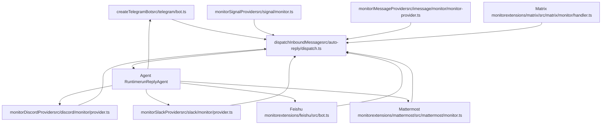

# Channel Architecture & Plugin SDK

Relevant source files

-   [docs/channels/discord.md](https://github.com/openclaw/openclaw/blob/8873e13f/docs/channels/discord.md)
-   [docs/channels/telegram.md](https://github.com/openclaw/openclaw/blob/8873e13f/docs/channels/telegram.md)
-   [docs/gateway/configuration-reference.md](https://github.com/openclaw/openclaw/blob/8873e13f/docs/gateway/configuration-reference.md)
-   [src/acp/control-plane/manager.core.ts](https://github.com/openclaw/openclaw/blob/8873e13f/src/acp/control-plane/manager.core.ts)
-   [src/agents/pi-embedded-runner/tool-result-char-estimator.ts](https://github.com/openclaw/openclaw/blob/8873e13f/src/agents/pi-embedded-runner/tool-result-char-estimator.ts)
-   [src/agents/pi-embedded-runner/tool-result-context-guard.ts](https://github.com/openclaw/openclaw/blob/8873e13f/src/agents/pi-embedded-runner/tool-result-context-guard.ts)
-   [src/agents/tools/telegram-actions.test.ts](https://github.com/openclaw/openclaw/blob/8873e13f/src/agents/tools/telegram-actions.test.ts)
-   [src/agents/tools/telegram-actions.ts](https://github.com/openclaw/openclaw/blob/8873e13f/src/agents/tools/telegram-actions.ts)
-   [src/auto-reply/reply/agent-runner.runreplyagent.e2e.test.ts](https://github.com/openclaw/openclaw/blob/8873e13f/src/auto-reply/reply/agent-runner.runreplyagent.e2e.test.ts)
-   [src/auto-reply/reply/normalize-reply.ts](https://github.com/openclaw/openclaw/blob/8873e13f/src/auto-reply/reply/normalize-reply.ts)
-   [src/auto-reply/skill-commands.test.ts](https://github.com/openclaw/openclaw/blob/8873e13f/src/auto-reply/skill-commands.test.ts)
-   [src/auto-reply/skill-commands.ts](https://github.com/openclaw/openclaw/blob/8873e13f/src/auto-reply/skill-commands.ts)
-   [src/auto-reply/tokens.test.ts](https://github.com/openclaw/openclaw/blob/8873e13f/src/auto-reply/tokens.test.ts)
-   [src/auto-reply/tokens.ts](https://github.com/openclaw/openclaw/blob/8873e13f/src/auto-reply/tokens.ts)
-   [src/channels/allowlists/resolve-utils.test.ts](https://github.com/openclaw/openclaw/blob/8873e13f/src/channels/allowlists/resolve-utils.test.ts)
-   [src/channels/allowlists/resolve-utils.ts](https://github.com/openclaw/openclaw/blob/8873e13f/src/channels/allowlists/resolve-utils.ts)
-   [src/channels/draft-stream-loop.ts](https://github.com/openclaw/openclaw/blob/8873e13f/src/channels/draft-stream-loop.ts)
-   [src/channels/plugins/actions/actions.test.ts](https://github.com/openclaw/openclaw/blob/8873e13f/src/channels/plugins/actions/actions.test.ts)
-   [src/channels/plugins/actions/telegram.ts](https://github.com/openclaw/openclaw/blob/8873e13f/src/channels/plugins/actions/telegram.ts)
-   [src/config/schema.help.quality.test.ts](https://github.com/openclaw/openclaw/blob/8873e13f/src/config/schema.help.quality.test.ts)
-   [src/config/schema.help.ts](https://github.com/openclaw/openclaw/blob/8873e13f/src/config/schema.help.ts)
-   [src/config/schema.labels.ts](https://github.com/openclaw/openclaw/blob/8873e13f/src/config/schema.labels.ts)
-   [src/config/types.agent-defaults.ts](https://github.com/openclaw/openclaw/blob/8873e13f/src/config/types.agent-defaults.ts)
-   [src/config/types.discord.ts](https://github.com/openclaw/openclaw/blob/8873e13f/src/config/types.discord.ts)
-   [src/config/types.telegram.ts](https://github.com/openclaw/openclaw/blob/8873e13f/src/config/types.telegram.ts)
-   [src/config/zod-schema.agent-defaults.ts](https://github.com/openclaw/openclaw/blob/8873e13f/src/config/zod-schema.agent-defaults.ts)
-   [src/config/zod-schema.providers-core.ts](https://github.com/openclaw/openclaw/blob/8873e13f/src/config/zod-schema.providers-core.ts)
-   [src/discord/monitor.test.ts](https://github.com/openclaw/openclaw/blob/8873e13f/src/discord/monitor.test.ts)
-   [src/discord/monitor.ts](https://github.com/openclaw/openclaw/blob/8873e13f/src/discord/monitor.ts)
-   [src/discord/monitor/listeners.test.ts](https://github.com/openclaw/openclaw/blob/8873e13f/src/discord/monitor/listeners.test.ts)
-   [src/discord/monitor/listeners.ts](https://github.com/openclaw/openclaw/blob/8873e13f/src/discord/monitor/listeners.ts)
-   [src/discord/monitor/provider.allowlist.test.ts](https://github.com/openclaw/openclaw/blob/8873e13f/src/discord/monitor/provider.allowlist.test.ts)
-   [src/discord/monitor/provider.allowlist.ts](https://github.com/openclaw/openclaw/blob/8873e13f/src/discord/monitor/provider.allowlist.ts)
-   [src/discord/monitor/provider.skill-dedupe.test.ts](https://github.com/openclaw/openclaw/blob/8873e13f/src/discord/monitor/provider.skill-dedupe.test.ts)
-   [src/discord/monitor/provider.test.ts](https://github.com/openclaw/openclaw/blob/8873e13f/src/discord/monitor/provider.test.ts)
-   [src/discord/monitor/provider.ts](https://github.com/openclaw/openclaw/blob/8873e13f/src/discord/monitor/provider.ts)
-   [src/imessage/monitor.ts](https://github.com/openclaw/openclaw/blob/8873e13f/src/imessage/monitor.ts)
-   [src/signal/monitor.ts](https://github.com/openclaw/openclaw/blob/8873e13f/src/signal/monitor.ts)
-   [src/slack/monitor.tool-result.test.ts](https://github.com/openclaw/openclaw/blob/8873e13f/src/slack/monitor.tool-result.test.ts)
-   [src/slack/monitor.ts](https://github.com/openclaw/openclaw/blob/8873e13f/src/slack/monitor.ts)
-   [src/slack/monitor/provider.ts](https://github.com/openclaw/openclaw/blob/8873e13f/src/slack/monitor/provider.ts)
-   [src/telegram/bot-handlers.ts](https://github.com/openclaw/openclaw/blob/8873e13f/src/telegram/bot-handlers.ts)
-   [src/telegram/bot-message-context.dm-threads.test.ts](https://github.com/openclaw/openclaw/blob/8873e13f/src/telegram/bot-message-context.dm-threads.test.ts)
-   [src/telegram/bot-message-context.ts](https://github.com/openclaw/openclaw/blob/8873e13f/src/telegram/bot-message-context.ts)
-   [src/telegram/bot-message-dispatch.test.ts](https://github.com/openclaw/openclaw/blob/8873e13f/src/telegram/bot-message-dispatch.test.ts)
-   [src/telegram/bot-message-dispatch.ts](https://github.com/openclaw/openclaw/blob/8873e13f/src/telegram/bot-message-dispatch.ts)
-   [src/telegram/bot-native-commands.ts](https://github.com/openclaw/openclaw/blob/8873e13f/src/telegram/bot-native-commands.ts)
-   [src/telegram/bot.test.ts](https://github.com/openclaw/openclaw/blob/8873e13f/src/telegram/bot.test.ts)
-   [src/telegram/bot.ts](https://github.com/openclaw/openclaw/blob/8873e13f/src/telegram/bot.ts)
-   [src/telegram/bot/delivery.replies.ts](https://github.com/openclaw/openclaw/blob/8873e13f/src/telegram/bot/delivery.replies.ts)
-   [src/telegram/bot/delivery.test.ts](https://github.com/openclaw/openclaw/blob/8873e13f/src/telegram/bot/delivery.test.ts)
-   [src/telegram/bot/delivery.ts](https://github.com/openclaw/openclaw/blob/8873e13f/src/telegram/bot/delivery.ts)
-   [src/telegram/bot/helpers.test.ts](https://github.com/openclaw/openclaw/blob/8873e13f/src/telegram/bot/helpers.test.ts)
-   [src/telegram/bot/helpers.ts](https://github.com/openclaw/openclaw/blob/8873e13f/src/telegram/bot/helpers.ts)
-   [src/telegram/draft-stream.test-helpers.ts](https://github.com/openclaw/openclaw/blob/8873e13f/src/telegram/draft-stream.test-helpers.ts)
-   [src/telegram/draft-stream.test.ts](https://github.com/openclaw/openclaw/blob/8873e13f/src/telegram/draft-stream.test.ts)
-   [src/telegram/draft-stream.ts](https://github.com/openclaw/openclaw/blob/8873e13f/src/telegram/draft-stream.ts)
-   [src/telegram/lane-delivery.test.ts](https://github.com/openclaw/openclaw/blob/8873e13f/src/telegram/lane-delivery.test.ts)
-   [src/telegram/lane-delivery.ts](https://github.com/openclaw/openclaw/blob/8873e13f/src/telegram/lane-delivery.ts)
-   [src/telegram/send.test.ts](https://github.com/openclaw/openclaw/blob/8873e13f/src/telegram/send.test.ts)
-   [src/telegram/send.ts](https://github.com/openclaw/openclaw/blob/8873e13f/src/telegram/send.ts)
-   [src/web/auto-reply.ts](https://github.com/openclaw/openclaw/blob/8873e13f/src/web/auto-reply.ts)
-   [src/web/inbound.test.ts](https://github.com/openclaw/openclaw/blob/8873e13f/src/web/inbound.test.ts)
-   [src/web/inbound.ts](https://github.com/openclaw/openclaw/blob/8873e13f/src/web/inbound.ts)
-   [src/web/vcard.ts](https://github.com/openclaw/openclaw/blob/8873e13f/src/web/vcard.ts)

This page describes how channel integrations are structured: the **monitor pattern** shared by all channels, the **Plugin SDK** (`openclaw/plugin-sdk`) that extension plugins import, the **`ChannelPlugin` interface** that declares channel capabilities, and the utility helpers for common tasks such as typing indicators, pairing challenges, access decisions, and webhook registration.

For Telegram-specific behavior, see [4.2](/openclaw/openclaw/4.2-telegram-integration). For Discord, see [4.3](/openclaw/openclaw/4.3-discord-integration). For other platforms, see [4.4](/openclaw/openclaw/4.4-other-channels). For how dispatched messages flow through the agent pipeline, see [3.1](/openclaw/openclaw/3.1-agent-execution-pipeline).

---

## Channel Architecture Overview

Every messaging channel runs a long-lived **monitor** process that owns its connection to an external platform. All monitors normalize inbound events into a common context object and call `dispatchInboundMessage` to route them to the agent runtime. Replies are delivered back through the monitor's send helpers.

Two categories of channels exist:

| Category | Location | Imports from |
| --- | --- | --- |
| Built-in | `src/{telegram,discord,slack,signal,imessage,web}/` | Internal modules |
| Extension plugin | `extensions/{feishu,matrix,mattermost,msteams,zalo}/` | `openclaw/plugin-sdk` |

**Diagram: Channel Monitor Code Entities**


Sources: [src/telegram/bot.ts116-427](https://github.com/openclaw/openclaw/blob/8873e13f/src/telegram/bot.ts#L116-L427) [src/discord/monitor/provider.ts249-662](https://github.com/openclaw/openclaw/blob/8873e13f/src/discord/monitor/provider.ts#L249-L662) [src/slack/monitor/provider.ts59-200](https://github.com/openclaw/openclaw/blob/8873e13f/src/slack/monitor/provider.ts#L59-L200) [src/signal/monitor.ts1-51](https://github.com/openclaw/openclaw/blob/8873e13f/src/signal/monitor.ts#L1-L51) [src/imessage/monitor/monitor-provider.ts84-200](https://github.com/openclaw/openclaw/blob/8873e13f/src/imessage/monitor/monitor-provider.ts#L84-L200) [extensions/feishu/src/bot.ts1-50](https://github.com/openclaw/openclaw/blob/8873e13f/extensions/feishu/src/bot.ts#L1-L50) [extensions/mattermost/src/mattermost/monitor.ts1-65](https://github.com/openclaw/openclaw/blob/8873e13f/extensions/mattermost/src/mattermost/monitor.ts#L1-L65)

---

### The Monitor Function Pattern

Each monitor function follows the same lifecycle:

1.  Call `loadConfig()` and resolve the account via the channel's `resolveXxxAccount` helper.
2.  Construct the platform client (bot API, WebSocket connection, HTTP listener, etc.).
3.  Register per-event handlers (message, reaction, presence, etc.).
4.  Run the event loop. For long-polling channels this is a `while (true)` loop; for WebSocket channels this means connecting and awaiting disconnect.
5.  On each inbound event, run preflight access checks, build the inbound context, and call `dispatchInboundMessage`.

Extension plugins follow the same pattern but import all helpers from `openclaw/plugin-sdk` rather than internal modules.

---

## Inbound Message Flow

The sequence below applies to both built-in and extension channels.

**Diagram: Inbound Message Processing Sequence**

> **[Mermaid sequence]**
> *(图表结构无法解析)*

Sources: [src/discord/monitor/message-handler.process.ts60-580](https://github.com/openclaw/openclaw/blob/8873e13f/src/discord/monitor/message-handler.process.ts#L60-L580) [src/discord/monitor/message-handler.preflight.ts1-200](https://github.com/openclaw/openclaw/blob/8873e13f/src/discord/monitor/message-handler.preflight.ts#L1-L200) [src/signal/monitor/event-handler.ts55-200](https://github.com/openclaw/openclaw/blob/8873e13f/src/signal/monitor/event-handler.ts#L55-L200) [src/imessage/monitor/monitor-provider.ts84-400](https://github.com/openclaw/openclaw/blob/8873e13f/src/imessage/monitor/monitor-provider.ts#L84-L400)

### Preflight Access Control

Before dispatch, each channel evaluates access with these shared helpers (all importable from `openclaw/plugin-sdk`):

| Helper | Source | Purpose |
| --- | --- | --- |
| `resolveDmGroupAccessWithLists` | `src/security/dm-policy-shared.ts` | DM policy + allowFrom check |
| `createScopedPairingAccess` | `src/plugin-sdk/pairing-access.ts` | Scoped pairing state per channel/account |
| `issuePairingChallenge` | `src/pairing/pairing-challenge.ts` | Generate and store pairing code |
| `evaluateSenderGroupAccess` | `src/plugin-sdk/group-access.ts` | Group sender access decision |
| `resolveMentionGatingWithBypass` | `src/channels/mention-gating.ts` | `requireMention` + bypass logic |
| `resolveControlCommandGate` | `src/channels/command-gating.ts` | Command authorization gate |

### Inbound Context Fields

`finalizeInboundContext` (from `src/auto-reply/reply/inbound-context.ts`) assembles the canonical payload:

| Field | Description |
| --- | --- |
| `Body` | Formatted envelope: `[Channel / from / timestamp]\ntext` |
| `BodyForAgent` | Raw message text without envelope decoration |
| `From` | Sender ID (e.g. `discord:1234`, `telegram:5678`) |
| `To` | Reply target |
| `SessionKey` | Resolved session key for this conversation |
| `ChatType` | `"direct"`, `"group"`, or `"channel"` |
| `Provider` | Channel name string |
| `MediaUrls` | Paths to downloaded media |
| `CommandAuthorized` | Whether sender may run slash commands |
| `WasMentioned` | Whether the bot was @-mentioned |

Sources: [src/discord/monitor/message-handler.process.ts337-378](https://github.com/openclaw/openclaw/blob/8873e13f/src/discord/monitor/message-handler.process.ts#L337-L378) [src/signal/monitor/event-handler.ts55-200](https://github.com/openclaw/openclaw/blob/8873e13f/src/signal/monitor/event-handler.ts#L55-L200)

---

## Plugin SDK

### Entry Point

`src/plugin-sdk/index.ts` is the single stable API surface for all extension channel plugins. It is published under the import path `openclaw/plugin-sdk`. Extension plugins must not import from internal package paths.

Sources: [src/plugin-sdk/index.ts1-450](https://github.com/openclaw/openclaw/blob/8873e13f/src/plugin-sdk/index.ts#L1-L450)

### Plugin Package Shape: `OpenClawPluginApi`

A plugin package's root export must conform to `OpenClawPluginApi` (from `src/plugins/types.ts`):

| Field | Type | Description |
| --- | --- | --- |
| `configSchema` | `OpenClawPluginConfigSchema` (optional) | Zod schema for `openclaw.json` config section |
| `services` | `OpenClawPluginService[]` | Services that run inside the gateway process |
| `channels` | `ChannelPlugin[]` (optional) | Channel plugin registrations |

`OpenClawPluginService` is a factory function receiving `OpenClawPluginServiceContext` and returning lifecycle hooks (`start`, `stop`) plus optional HTTP route registrations.

Sources: [src/plugin-sdk/index.ts97-114](https://github.com/openclaw/openclaw/blob/8873e13f/src/plugin-sdk/index.ts#L97-L114)

---

## ChannelPlugin Interface

`ChannelPlugin` (from `src/channels/plugins/types.plugin.ts`) declares a channel's identity and capabilities through a set of optional adapter objects. Each adapter covers one capability area.

**Diagram: ChannelPlugin Adapters → Source Files**

```mermaid
flowchart TD
    CP["ChannelPluginsrc/channels/plugins/types.plugin.ts"]
    AUTH["ChannelAuthAdapter(login / logout / QR)"]
    SETUP["ChannelSetupAdapter(onboarding wizard)"]
    PAIR["ChannelPairingAdapter(DM pairing challenge)"]
    MSG["ChannelMessagingAdapter(send text/media)"]
    OUT["ChannelOutboundAdapter(targeted delivery)"]
    STREAM["ChannelStreamingAdapter(draft/partial reply)"]
    STATUS["ChannelStatusAdapter(health + issues)"]
    THREAD["ChannelThreadingAdapter(thread session keys)"]
    GROUP["ChannelGroupAdapter(group membership)"]
    MENTION["ChannelMentionAdapter(mention patterns)"]
    CMD["ChannelCommandAdapter(native commands)"]
    CFG["ChannelConfigAdapter(in-channel config writes)"]
    DIR["ChannelDirectoryAdapter(contact/group listing)"]
    HB["ChannelHeartbeatAdapter(proactive heartbeat)"]
    SEC["ChannelSecurityAdapter(audit checks)"]
    GW["ChannelGatewayAdapter(gateway event callbacks)"]
    ACT["ChannelMessageActionAdapter(message action tools)"]
    RES["ChannelResolverAdapter(ID-to-address resolution)"]

    CP --> AUTH
    CP --> SETUP
    CP --> PAIR
    CP --> MSG
    CP --> OUT
    CP --> STREAM
    CP --> STATUS
    CP --> THREAD
    CP --> GROUP
    CP --> MENTION
    CP --> CMD
    CP --> CFG
    CP --> DIR
    CP --> HB
    CP --> SEC
    CP --> GW
    CP --> ACT
    CP --> RES
```


Sources: [src/plugin-sdk/index.ts8-63](https://github.com/openclaw/openclaw/blob/8873e13f/src/plugin-sdk/index.ts#L8-L63)

### Adapter Interface Reference

| Adapter | Key Methods / Purpose |
| --- | --- |
| `ChannelAuthAdapter` | OAuth login, QR login start/wait, logout |
| `ChannelSetupAdapter` | Wizard `promptSetup` steps, initial config write |
| `ChannelPairingAdapter` | Handle pairing code exchange for `dmPolicy: "pairing"` |
| `ChannelMessagingAdapter` | `sendMessage`, `sendTyping` |
| `ChannelOutboundAdapter` | Delivery to explicit targets (`ChannelOutboundContext`) |
| `ChannelStreamingAdapter` | Progressive reply streaming (edit-based draft) |
| `ChannelStatusAdapter` | `getStatus()` → `ChannelAccountSnapshot` + `ChannelStatusIssue[]` |
| `ChannelThreadingAdapter` | Thread session key derivation, tool context for agents |
| `ChannelGroupAdapter` | Group allowlist resolution, `ChannelGroupContext` |
| `ChannelMentionAdapter` | Custom mention regex patterns for group activation |
| `ChannelCommandAdapter` | Register and handle native slash commands |
| `ChannelConfigAdapter` | Handle runtime config writes triggered by channel events |
| `ChannelDirectoryAdapter` | `listPeers`, `listGroups` → `ChannelDirectoryEntry[]` |
| `ChannelHeartbeatAdapter` | Send heartbeat pings to configured recipients |
| `ChannelSecurityAdapter` | Contribute findings to `openclaw security audit` |
| `ChannelGatewayAdapter` | Receive gateway-level lifecycle events |
| `ChannelMessageActionAdapter` | Expose platform actions as agent tools |
| `ChannelResolverAdapter` | Resolve human-readable targets to platform IDs |

Sources: [src/plugin-sdk/index.ts8-62](https://github.com/openclaw/openclaw/blob/8873e13f/src/plugin-sdk/index.ts#L8-L62)

---

## PluginRuntime

`PluginRuntime` (from `src/plugins/runtime/types.ts`) is injected into plugin service context objects. It provides:

| Namespace | Description |
| --- | --- |
| `channel.media.*` | Save/load/detect media buffers |
| `agent.*` | Dispatch inbound messages, start agent turns |
| `session.*` | Read and write session metadata |
| `log` / `error` | Runtime logger |
| Config access | Read the resolved `OpenClawConfig` |

The implementation is built in `src/plugins/runtime/index.ts` and re-exports many internal utilities pre-bound to the gateway's running context.

Sources: [src/plugins/runtime/types.ts1-50](https://github.com/openclaw/openclaw/blob/8873e13f/src/plugins/runtime/types.ts#L1-L50) [src/plugins/runtime/index.ts1-50](https://github.com/openclaw/openclaw/blob/8873e13f/src/plugins/runtime/index.ts#L1-L50)

---

## Common SDK Utilities

The table below lists frequently used utilities and their source paths within `src/plugin-sdk/`.

### Typing Indicators

`createTypingCallbacks` (from `src/channels/typing.ts`) wraps a channel-specific `sendTyping` function in a self-managing keepalive loop. It is called before `dispatchInboundMessage` and torn down after reply delivery.

```
const typingCallbacks = createTypingCallbacks({
  start: () => sendTypingPlatformCall(channelId),
  onStartError: (err) => logTypingFailure({ channel: "myChannel", ... }),
});
```
Sources: [src/channels/typing.ts1-50](https://github.com/openclaw/openclaw/blob/8873e13f/src/channels/typing.ts#L1-L50) [src/discord/monitor/message-handler.process.ts419-429](https://github.com/openclaw/openclaw/blob/8873e13f/src/discord/monitor/message-handler.process.ts#L419-L429)

### Pairing Challenge Flow

For `dmPolicy: "pairing"`, the standard flow is:

1.  `createScopedPairingAccess` wraps per-account pairing state.
2.  `issuePairingChallenge` creates a one-time code and returns a reply string to send back to the user.
3.  The operator runs `openclaw pairing approve <channel> <code>`.
4.  Subsequent messages from the approved sender are allowed through.

Sources: [src/plugin-sdk/index.ts219-221](https://github.com/openclaw/openclaw/blob/8873e13f/src/plugin-sdk/index.ts#L219-L221)

### Group History Context

Channels that support group history inject recent messages into the inbound envelope using:

-   `recordPendingHistoryEntryIfEnabled` — append an entry to the in-memory history map
-   `buildPendingHistoryContextFromMap` — prepend the history window to the current `Body`
-   `clearHistoryEntriesIfEnabled` — evict entries after reply

Sources: [src/plugin-sdk/index.ts309-317](https://github.com/openclaw/openclaw/blob/8873e13f/src/plugin-sdk/index.ts#L309-L317)

### Allowlist and Access Decisions

| Function | Purpose |
| --- | --- |
| `isAllowedParsedChatSender` | Check a sender ID/name against an `allowFrom` list |
| `formatAllowFromLowercase` | Normalize `allowFrom` entries for comparison |
| `evaluateSenderGroupAccess` | Full group access decision (`SenderGroupAccessDecision`) |
| `resolveDmGroupAccessWithLists` | DM policy check combining `allowFrom` + pairing store |
| `readStoreAllowFromForDmPolicy` | Read approved senders from the pairing store file |
| `resolveRuntimeGroupPolicy` | Resolve the effective `GroupPolicy` for a channel account |

Sources: [src/plugin-sdk/index.ts207-422](https://github.com/openclaw/openclaw/blob/8873e13f/src/plugin-sdk/index.ts#L207-L422)

### Text Chunking

`chunkTextForOutbound` (from `src/plugin-sdk/text-chunking.ts`) splits reply text into platform-appropriate chunks using `textChunkLimit` and `chunkMode` (`"length"` or `"newline"`). Per-channel limits are accessed via `resolveTextChunkLimit` (from `src/auto-reply/chunk.ts`).

Sources: [src/plugin-sdk/index.ts235](https://github.com/openclaw/openclaw/blob/8873e13f/src/plugin-sdk/index.ts#L235-L235)

### Reply Delivery Helpers

| Function | Source | Purpose |
| --- | --- | --- |
| `createNormalizedOutboundDeliverer` | `src/plugin-sdk/reply-payload.ts` | Normalize `ReplyPayload` for send |
| `normalizeOutboundReplyPayload` | `src/plugin-sdk/reply-payload.ts` | Resolve media URLs and metadata |
| `sendMediaWithLeadingCaption` | `src/plugin-sdk/reply-payload.ts` | Send text + media together |
| `formatTextWithAttachmentLinks` | `src/plugin-sdk/reply-payload.ts` | Append attachment URLs to text |

Sources: [src/plugin-sdk/index.ts224-230](https://github.com/openclaw/openclaw/blob/8873e13f/src/plugin-sdk/index.ts#L224-L230)

### Media Handling

| Function | Source | Purpose |
| --- | --- | --- |
| `buildAgentMediaPayload` | `src/plugin-sdk/agent-media-payload.ts` | Convert downloaded files to `AgentMediaPayload` |
| `buildMediaPayload` | `src/channels/plugins/media-payload.ts` | Low-level media payload builder |
| `resolveChannelMediaMaxBytes` | `src/channels/plugins/media-limits.ts` | Resolve configured byte size limit |
| `loadWebMedia` | `src/web/media.ts` | Download media from a URL |

Sources: [src/plugin-sdk/index.ts132-136](https://github.com/openclaw/openclaw/blob/8873e13f/src/plugin-sdk/index.ts#L132-L136) [extensions/feishu/src/bot.ts336-395](https://github.com/openclaw/openclaw/blob/8873e13f/extensions/feishu/src/bot.ts#L336-L395)

### Webhook Registration

HTTP-based channels register with the gateway's HTTP listener at startup:

| Function | Source | Purpose |
| --- | --- | --- |
| `registerPluginHttpRoute` | `src/plugins/http-registry.ts` | Register an HTTP route with the gateway |
| `normalizePluginHttpPath` | `src/plugins/http-path.ts` | Normalize the route path |
| `registerWebhookTarget` | `src/plugin-sdk/webhook-targets.ts` | Register a webhook recipient by account |
| `resolveSingleWebhookTarget` | `src/plugin-sdk/webhook-targets.ts` | Look up webhook registration |
| `rejectNonPostWebhookRequest` | `src/plugin-sdk/webhook-targets.ts` | Validate HTTP method |

Sources: [src/plugin-sdk/index.ts113-130](https://github.com/openclaw/openclaw/blob/8873e13f/src/plugin-sdk/index.ts#L113-L130)

### Ack Reactions

Channels that support reactions use `createStatusReactionController` (from `src/channels/status-reactions.ts`) and `shouldAckReaction` (from `src/channels/ack-reactions.ts`) to set an acknowledgement emoji while processing and clear or update it on reply delivery. The initial emoji is resolved by `resolveAckReaction` (from `src/agents/identity.ts`).

Sources: [src/discord/monitor/message-handler.process.ts124-173](https://github.com/openclaw/openclaw/blob/8873e13f/src/discord/monitor/message-handler.process.ts#L124-L173)

### Miscellaneous SDK Utilities

| Function | Purpose |
| --- | --- |
| `createDedupeCache` / `createPersistentDedupe` | Deduplication for inbound message IDs |
| `readJsonFileWithFallback` / `writeJsonFileAtomically` | Safe JSON file I/O for plugin state |
| `buildRandomTempFilePath` / `withTempDownloadPath` | Temp file management for media downloads |
| `acquireFileLock` / `withFileLock` | File-based locking for shared state |
| `runPluginCommandWithTimeout` | Run a CLI subprocess with timeout from plugin code |
| `recordInboundSession` | Update session metadata and `lastRoute` after processing |
| `formatInboundFromLabel` | Format human-readable from-label for envelopes |

Sources: [src/plugin-sdk/index.ts234-445](https://github.com/openclaw/openclaw/blob/8873e13f/src/plugin-sdk/index.ts#L234-L445)

---

## Channel Configuration Schemas

Each channel's configuration block in `openclaw.json` is validated by a Zod schema. Built-in schemas live in `src/config/zod-schema.providers-core.ts`:

| `channels.*` key | Zod Schema | File |
| --- | --- | --- |
| `telegram` | `TelegramConfigSchema` | `zod-schema.providers-core.ts` |
| `discord` | `DiscordConfigSchema` | `zod-schema.providers-core.ts` |
| `slack` | `SlackConfigSchema` | `zod-schema.providers-core.ts` |
| `signal` | `SignalConfigSchema` | `zod-schema.providers-core.ts` |
| `imessage` | `IMessageConfigSchema` | `zod-schema.providers-core.ts` |
| `googlechat` | `GoogleChatConfigSchema` | `zod-schema.providers-core.ts` |
| `whatsapp` | `WhatsAppConfigSchema` | `zod-schema.providers-whatsapp.ts` |

Extension plugins define their own Zod schema and register it as the `ChannelConfigSchema` field on their `ChannelPlugin`. The helper `buildChannelConfigSchema` (from `src/channels/plugins/config-schema.ts`) provides scaffolding for common fields.

Sensitive fields (tokens, secrets) use `.register(sensitive)` from `src/config/zod-schema.sensitive.ts`. This causes the field to be redacted from logs and config API responses.

Multi-account patterns: each schema has a root account section plus an optional `accounts` record keyed by account ID. Runtime resolution always calls the channel's `resolveXxxAccount` helper, which performs shallow-merge of root + account-level config.

Sources: [src/config/zod-schema.providers-core.ts1-900](https://github.com/openclaw/openclaw/blob/8873e13f/src/config/zod-schema.providers-core.ts#L1-L900) [src/plugin-sdk/index.ts176-200](https://github.com/openclaw/openclaw/blob/8873e13f/src/plugin-sdk/index.ts#L176-L200)

---

## Diagram: SDK Utility Categories and Source Paths

**Diagram: Plugin SDK Utility Modules**

```mermaid
flowchart TD
    SDK["openclaw/plugin-sdksrc/plugin-sdk/index.ts"]
    ACCESS["Access Controlsrc/plugin-sdk/allow-from.tssrc/plugin-sdk/group-access.tssrc/security/dm-policy-shared.ts"]
    PAIRING["Pairingsrc/plugin-sdk/pairing-access.tssrc/pairing/pairing-challenge.ts"]
    TYPING["Typing Indicatorssrc/channels/typing.ts"]
    HISTORY["Group Historysrc/auto-reply/reply/history.ts"]
    CHUNK["Text Chunkingsrc/plugin-sdk/text-chunking.tssrc/auto-reply/chunk.ts"]
    MEDIA["Media Handlingsrc/plugin-sdk/agent-media-payload.tssrc/channels/plugins/media-payload.ts"]
    REPLY["Reply Deliverysrc/plugin-sdk/reply-payload.ts"]
    WEBHOOK["Webhook Registrationsrc/plugins/http-registry.tssrc/plugin-sdk/webhook-targets.ts"]
    SCHEMAS["Config Schemassrc/config/zod-schema.providers-core.tssrc/channels/plugins/config-schema.ts"]
    PLUGIN["Plugin Typessrc/plugins/types.tssrc/channels/plugins/types.plugin.tssrc/channels/plugins/types.ts"]
    RUNTIME["PluginRuntimesrc/plugins/runtime/types.tssrc/plugins/runtime/index.ts"]

    SDK --> ACCESS
    SDK --> PAIRING
    SDK --> TYPING
    SDK --> HISTORY
    SDK --> CHUNK
    SDK --> MEDIA
    SDK --> REPLY
    SDK --> WEBHOOK
    SDK --> SCHEMAS
    SDK --> PLUGIN
    SDK --> RUNTIME
```


Sources: [src/plugin-sdk/index.ts1-450](https://github.com/openclaw/openclaw/blob/8873e13f/src/plugin-sdk/index.ts#L1-L450)
