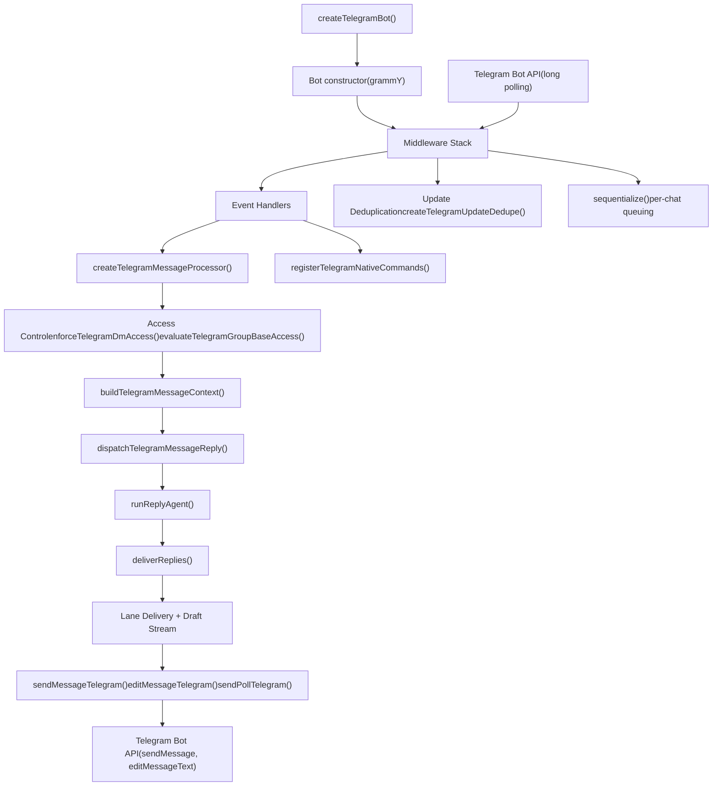
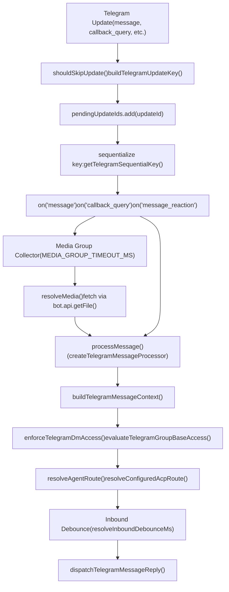
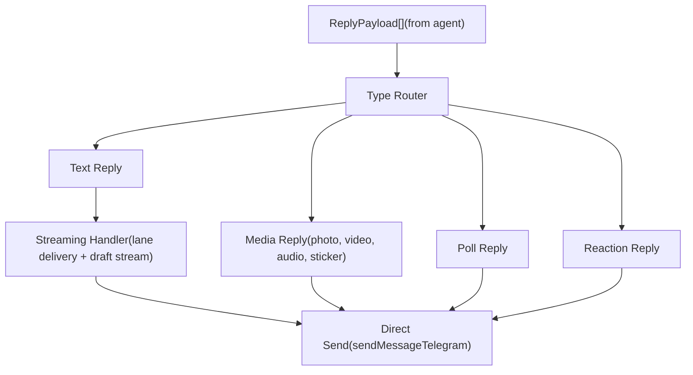

# Telegram Integration

Relevant source files

-   [docs/channels/discord.md](https://github.com/openclaw/openclaw/blob/8873e13f/docs/channels/discord.md)
-   [docs/channels/telegram.md](https://github.com/openclaw/openclaw/blob/8873e13f/docs/channels/telegram.md)
-   [docs/gateway/configuration-reference.md](https://github.com/openclaw/openclaw/blob/8873e13f/docs/gateway/configuration-reference.md)
-   [src/acp/control-plane/manager.core.ts](https://github.com/openclaw/openclaw/blob/8873e13f/src/acp/control-plane/manager.core.ts)
-   [src/agents/pi-embedded-runner/tool-result-char-estimator.ts](https://github.com/openclaw/openclaw/blob/8873e13f/src/agents/pi-embedded-runner/tool-result-char-estimator.ts)
-   [src/agents/pi-embedded-runner/tool-result-context-guard.ts](https://github.com/openclaw/openclaw/blob/8873e13f/src/agents/pi-embedded-runner/tool-result-context-guard.ts)
-   [src/agents/tools/telegram-actions.test.ts](https://github.com/openclaw/openclaw/blob/8873e13f/src/agents/tools/telegram-actions.test.ts)
-   [src/agents/tools/telegram-actions.ts](https://github.com/openclaw/openclaw/blob/8873e13f/src/agents/tools/telegram-actions.ts)
-   [src/auto-reply/reply/agent-runner.runreplyagent.e2e.test.ts](https://github.com/openclaw/openclaw/blob/8873e13f/src/auto-reply/reply/agent-runner.runreplyagent.e2e.test.ts)
-   [src/auto-reply/reply/normalize-reply.ts](https://github.com/openclaw/openclaw/blob/8873e13f/src/auto-reply/reply/normalize-reply.ts)
-   [src/auto-reply/skill-commands.test.ts](https://github.com/openclaw/openclaw/blob/8873e13f/src/auto-reply/skill-commands.test.ts)
-   [src/auto-reply/skill-commands.ts](https://github.com/openclaw/openclaw/blob/8873e13f/src/auto-reply/skill-commands.ts)
-   [src/auto-reply/tokens.test.ts](https://github.com/openclaw/openclaw/blob/8873e13f/src/auto-reply/tokens.test.ts)
-   [src/auto-reply/tokens.ts](https://github.com/openclaw/openclaw/blob/8873e13f/src/auto-reply/tokens.ts)
-   [src/channels/allowlists/resolve-utils.test.ts](https://github.com/openclaw/openclaw/blob/8873e13f/src/channels/allowlists/resolve-utils.test.ts)
-   [src/channels/allowlists/resolve-utils.ts](https://github.com/openclaw/openclaw/blob/8873e13f/src/channels/allowlists/resolve-utils.ts)
-   [src/channels/draft-stream-loop.ts](https://github.com/openclaw/openclaw/blob/8873e13f/src/channels/draft-stream-loop.ts)
-   [src/channels/plugins/actions/actions.test.ts](https://github.com/openclaw/openclaw/blob/8873e13f/src/channels/plugins/actions/actions.test.ts)
-   [src/channels/plugins/actions/telegram.ts](https://github.com/openclaw/openclaw/blob/8873e13f/src/channels/plugins/actions/telegram.ts)
-   [src/config/schema.help.quality.test.ts](https://github.com/openclaw/openclaw/blob/8873e13f/src/config/schema.help.quality.test.ts)
-   [src/config/schema.help.ts](https://github.com/openclaw/openclaw/blob/8873e13f/src/config/schema.help.ts)
-   [src/config/schema.labels.ts](https://github.com/openclaw/openclaw/blob/8873e13f/src/config/schema.labels.ts)
-   [src/config/types.agent-defaults.ts](https://github.com/openclaw/openclaw/blob/8873e13f/src/config/types.agent-defaults.ts)
-   [src/config/types.discord.ts](https://github.com/openclaw/openclaw/blob/8873e13f/src/config/types.discord.ts)
-   [src/config/types.telegram.ts](https://github.com/openclaw/openclaw/blob/8873e13f/src/config/types.telegram.ts)
-   [src/config/zod-schema.agent-defaults.ts](https://github.com/openclaw/openclaw/blob/8873e13f/src/config/zod-schema.agent-defaults.ts)
-   [src/config/zod-schema.providers-core.ts](https://github.com/openclaw/openclaw/blob/8873e13f/src/config/zod-schema.providers-core.ts)
-   [src/discord/monitor.test.ts](https://github.com/openclaw/openclaw/blob/8873e13f/src/discord/monitor.test.ts)
-   [src/discord/monitor.ts](https://github.com/openclaw/openclaw/blob/8873e13f/src/discord/monitor.ts)
-   [src/discord/monitor/listeners.test.ts](https://github.com/openclaw/openclaw/blob/8873e13f/src/discord/monitor/listeners.test.ts)
-   [src/discord/monitor/listeners.ts](https://github.com/openclaw/openclaw/blob/8873e13f/src/discord/monitor/listeners.ts)
-   [src/discord/monitor/provider.allowlist.test.ts](https://github.com/openclaw/openclaw/blob/8873e13f/src/discord/monitor/provider.allowlist.test.ts)
-   [src/discord/monitor/provider.allowlist.ts](https://github.com/openclaw/openclaw/blob/8873e13f/src/discord/monitor/provider.allowlist.ts)
-   [src/discord/monitor/provider.skill-dedupe.test.ts](https://github.com/openclaw/openclaw/blob/8873e13f/src/discord/monitor/provider.skill-dedupe.test.ts)
-   [src/discord/monitor/provider.test.ts](https://github.com/openclaw/openclaw/blob/8873e13f/src/discord/monitor/provider.test.ts)
-   [src/discord/monitor/provider.ts](https://github.com/openclaw/openclaw/blob/8873e13f/src/discord/monitor/provider.ts)
-   [src/imessage/monitor.ts](https://github.com/openclaw/openclaw/blob/8873e13f/src/imessage/monitor.ts)
-   [src/signal/monitor.ts](https://github.com/openclaw/openclaw/blob/8873e13f/src/signal/monitor.ts)
-   [src/slack/monitor.tool-result.test.ts](https://github.com/openclaw/openclaw/blob/8873e13f/src/slack/monitor.tool-result.test.ts)
-   [src/slack/monitor.ts](https://github.com/openclaw/openclaw/blob/8873e13f/src/slack/monitor.ts)
-   [src/slack/monitor/provider.ts](https://github.com/openclaw/openclaw/blob/8873e13f/src/slack/monitor/provider.ts)
-   [src/telegram/bot-handlers.ts](https://github.com/openclaw/openclaw/blob/8873e13f/src/telegram/bot-handlers.ts)
-   [src/telegram/bot-message-context.dm-threads.test.ts](https://github.com/openclaw/openclaw/blob/8873e13f/src/telegram/bot-message-context.dm-threads.test.ts)
-   [src/telegram/bot-message-context.ts](https://github.com/openclaw/openclaw/blob/8873e13f/src/telegram/bot-message-context.ts)
-   [src/telegram/bot-message-dispatch.test.ts](https://github.com/openclaw/openclaw/blob/8873e13f/src/telegram/bot-message-dispatch.test.ts)
-   [src/telegram/bot-message-dispatch.ts](https://github.com/openclaw/openclaw/blob/8873e13f/src/telegram/bot-message-dispatch.ts)
-   [src/telegram/bot-native-commands.ts](https://github.com/openclaw/openclaw/blob/8873e13f/src/telegram/bot-native-commands.ts)
-   [src/telegram/bot.test.ts](https://github.com/openclaw/openclaw/blob/8873e13f/src/telegram/bot.test.ts)
-   [src/telegram/bot.ts](https://github.com/openclaw/openclaw/blob/8873e13f/src/telegram/bot.ts)
-   [src/telegram/bot/delivery.replies.ts](https://github.com/openclaw/openclaw/blob/8873e13f/src/telegram/bot/delivery.replies.ts)
-   [src/telegram/bot/delivery.test.ts](https://github.com/openclaw/openclaw/blob/8873e13f/src/telegram/bot/delivery.test.ts)
-   [src/telegram/bot/delivery.ts](https://github.com/openclaw/openclaw/blob/8873e13f/src/telegram/bot/delivery.ts)
-   [src/telegram/bot/helpers.test.ts](https://github.com/openclaw/openclaw/blob/8873e13f/src/telegram/bot/helpers.test.ts)
-   [src/telegram/bot/helpers.ts](https://github.com/openclaw/openclaw/blob/8873e13f/src/telegram/bot/helpers.ts)
-   [src/telegram/draft-stream.test-helpers.ts](https://github.com/openclaw/openclaw/blob/8873e13f/src/telegram/draft-stream.test-helpers.ts)
-   [src/telegram/draft-stream.test.ts](https://github.com/openclaw/openclaw/blob/8873e13f/src/telegram/draft-stream.test.ts)
-   [src/telegram/draft-stream.ts](https://github.com/openclaw/openclaw/blob/8873e13f/src/telegram/draft-stream.ts)
-   [src/telegram/lane-delivery.test.ts](https://github.com/openclaw/openclaw/blob/8873e13f/src/telegram/lane-delivery.test.ts)
-   [src/telegram/lane-delivery.ts](https://github.com/openclaw/openclaw/blob/8873e13f/src/telegram/lane-delivery.ts)
-   [src/telegram/send.test.ts](https://github.com/openclaw/openclaw/blob/8873e13f/src/telegram/send.test.ts)
-   [src/telegram/send.ts](https://github.com/openclaw/openclaw/blob/8873e13f/src/telegram/send.ts)
-   [src/web/auto-reply.ts](https://github.com/openclaw/openclaw/blob/8873e13f/src/web/auto-reply.ts)
-   [src/web/inbound.test.ts](https://github.com/openclaw/openclaw/blob/8873e13f/src/web/inbound.test.ts)
-   [src/web/inbound.ts](https://github.com/openclaw/openclaw/blob/8873e13f/src/web/inbound.ts)
-   [src/web/vcard.ts](https://github.com/openclaw/openclaw/blob/8873e13f/src/web/vcard.ts)

## Purpose and Scope

This document covers the Telegram Bot API integration in OpenClaw, including bot initialization, message processing pipelines, access control enforcement, native command handling, and streaming delivery mechanisms. For general channel architecture patterns, see [Channel Architecture](/openclaw/openclaw/4.1-channel-architecture). For access control policy configuration, see [Access Control Policies](/openclaw/openclaw/7.1-access-control-policies). For configuration field reference, see [Configuration Reference](/openclaw/openclaw/2.3.1-configuration-reference).

---

## Architecture Overview

The Telegram integration uses the grammY bot library with custom middleware for access control, message deduplication, media handling, and streaming delivery. The gateway owns the Telegram bot lifecycle and routes inbound messages through dedicated processing pipelines.

**Sources**: [src/telegram/bot.ts1-417](https://github.com/openclaw/openclaw/blob/8873e13f/src/telegram/bot.ts#L1-L417) [src/telegram/bot-message.ts1](https://github.com/openclaw/openclaw/blob/8873e13f/src/telegram/bot-message.ts#L1-LNaN) [src/telegram/bot-message-dispatch.ts1](https://github.com/openclaw/openclaw/blob/8873e13f/src/telegram/bot-message-dispatch.ts#L1-LNaN) [src/telegram/send.ts1](https://github.com/openclaw/openclaw/blob/8873e13f/src/telegram/send.ts#L1-LNaN)

---

## Bot Initialization and Lifecycle

### Factory Function: `createTelegramBot`

The entry point for Telegram integration is `createTelegramBot` in [src/telegram/bot.ts69-416](https://github.com/openclaw/openclaw/blob/8873e13f/src/telegram/bot.ts#L69-L416) It accepts `TelegramBotOptions` and returns a configured grammY `Bot` instance.

| Initialization Step | Function/Module | Purpose |
| --- | --- | --- |
| Account resolution | `resolveTelegramAccount` | Resolves token, config, and account settings |
| Thread binding setup | `createTelegramThreadBindingManager` | Creates forum topic / DM topic session binding manager |
| Update tracking | `createTelegramUpdateDedupe` | Deduplicates updates by key |
| Sequentialization | `sequentialize(getTelegramSequentialKey)` | Enforces per-chat/per-thread message ordering |
| SendChatAction handler | `createTelegramSendChatActionHandler` | Wraps typing indicators with 401 backoff/circuit breaker |
| Message processor | `createTelegramMessageProcessor` | Main inbound message → reply pipeline |
| Native commands | `registerTelegramNativeCommands` | Registers slash commands with Telegram |
| Event handlers | `registerTelegramHandlers` | Callback queries, media groups, reactions |

**Update watermark persistence**: The bot tracks `highestCompletedUpdateId` and persists safe watermarks only below the minimum pending update ID to avoid skipping queued updates after restart [src/telegram/bot.ts126-160](https://github.com/openclaw/openclaw/blob/8873e13f/src/telegram/bot.ts#L126-L160)

**Sources**: [src/telegram/bot.ts69-416](https://github.com/openclaw/openclaw/blob/8873e13f/src/telegram/bot.ts#L69-L416) [src/telegram/accounts.ts1](https://github.com/openclaw/openclaw/blob/8873e13f/src/telegram/accounts.ts#L1-LNaN) [src/telegram/thread-bindings.ts1](https://github.com/openclaw/openclaw/blob/8873e13f/src/telegram/thread-bindings.ts#L1-LNaN) [src/telegram/bot-updates.ts1](https://github.com/openclaw/openclaw/blob/8873e13f/src/telegram/bot-updates.ts#L1-LNaN) [src/telegram/sendchataction-401-backoff.ts1](https://github.com/openclaw/openclaw/blob/8873e13f/src/telegram/sendchataction-401-backoff.ts#L1-LNaN)

---

## Inbound Message Processing Pipeline

### Update Flow: Telegram API → Context → Dispatch

**Sources**: [src/telegram/bot.ts162-234](https://github.com/openclaw/openclaw/blob/8873e13f/src/telegram/bot.ts#L162-L234) [src/telegram/bot-updates.ts1](https://github.com/openclaw/openclaw/blob/8873e13f/src/telegram/bot-updates.ts#L1-LNaN) [src/telegram/bot-message.ts1](https://github.com/openclaw/openclaw/blob/8873e13f/src/telegram/bot-message.ts#L1-LNaN) [src/telegram/bot-handlers.ts107](https://github.com/openclaw/openclaw/blob/8873e13f/src/telegram/bot-handlers.ts#L107-LNaN)

### Context Building: `buildTelegramMessageContext`

Located in [src/telegram/bot-message-context.ts170](https://github.com/openclaw/openclaw/blob/8873e13f/src/telegram/bot-message-context.ts#L170-LNaN) this function transforms a raw Telegram update into a normalized `TelegramMessageContext` with:

-   **Session routing**: Resolves `agentId`, `sessionKey`, `mainSessionKey` via `resolveAgentRoute` and configured ACP bindings
-   **Thread isolation**: DM topics and forum topics append `:topic:<threadId>` to session keys
-   **Access enforcement**: Checks DM policy, group policy, sender allowlists
-   **Mention detection**: Evaluates `requireMention` and `mentionRegexes` for group activation
-   **Media placeholders**: Constructs `MediaPath` / `MediaPaths` for attachments, stickers, and reply media
-   **Reply metadata**: Extracts `ReplyToId`, `ReplyToBody`, `ReplyToSender`, quote text, and forwarding context
-   **Envelope formatting**: Builds `Body` with timestamp, sender name, group label, and message text/captions

**DM topic handling**: When `message_thread_id` is present in DMs, OpenClaw generates thread-scoped session keys [src/telegram/bot-message-context.ts426-430](https://github.com/openclaw/openclaw/blob/8873e13f/src/telegram/bot-message-context.ts#L426-L430) and preserves thread ID for reply delivery.

**Sources**: [src/telegram/bot-message-context.ts170](https://github.com/openclaw/openclaw/blob/8873e13f/src/telegram/bot-message-context.ts#L170-LNaN) [src/telegram/bot/helpers.ts1](https://github.com/openclaw/openclaw/blob/8873e13f/src/telegram/bot/helpers.ts#L1-LNaN) [src/routing/resolve-route.ts1](https://github.com/openclaw/openclaw/blob/8873e13f/src/routing/resolve-route.ts#L1-LNaN)

---

## Access Control System

### DM Policy Enforcement

`enforceTelegramDmAccess` in [src/telegram/dm-access.ts1](https://github.com/openclaw/openclaw/blob/8873e13f/src/telegram/dm-access.ts#L1-LNaN) implements pairing-based DM access:

| `dmPolicy` Mode | Behavior |
| --- | --- |
| `pairing` | Unknown senders receive pairing code; requires approval via `openclaw pairing approve telegram <CODE>` |
| `allowlist` | Only senders in `allowFrom` (or paired allowlist store) |
| `open` | Requires `allowFrom` to include `"*"` |
| `disabled` | All DMs blocked |

**Pairing flow**:

1.  Unknown sender DMs bot → `sendMessageTelegram` sends pairing code [src/telegram/dm-access.ts53-88](https://github.com/openclaw/openclaw/blob/8873e13f/src/telegram/dm-access.ts#L53-L88)
2.  Operator approves via CLI or agent command → updates allowlist store
3.  Subsequent messages from sender pass access checks

**Sources**: [src/telegram/dm-access.ts1](https://github.com/openclaw/openclaw/blob/8873e13f/src/telegram/dm-access.ts#L1-LNaN) [src/telegram/bot-access.ts1](https://github.com/openclaw/openclaw/blob/8873e13f/src/telegram/bot-access.ts#L1-LNaN) [src/pairing/pairing-store.ts1](https://github.com/openclaw/openclaw/blob/8873e13f/src/pairing/pairing-store.ts#L1-LNaN)

### Group Policy and Sender Authorization

`evaluateTelegramGroupBaseAccess` in [src/telegram/group-access.ts1](https://github.com/openclaw/openclaw/blob/8873e13f/src/telegram/group-access.ts#L1-LNaN) enforces group-level access:

1.  **Group ID authorization**: Checks `channels.telegram.groups` config (explicit ID or wildcard `"*"`)
2.  **Topic-level overrides**: `groups.<groupId>.topics.<topicId>` can override `enabled`, `allowFrom`, `requireMention`
3.  **Sender authorization**: If `allowFrom` is present (group or topic level), sender must match

**Group policy modes**:

-   `allowlist` (default): Only groups in `channels.telegram.groups` config
-   `open`: Bypass group allowlist (mention gating still applies)
-   `disabled`: Block all group messages

**Per-topic agent routing**: `topicConfig.agentId` overrides agent selection for specific forum topics [src/telegram/bot-message-context.ts228-253](https://github.com/openclaw/openclaw/blob/8873e13f/src/telegram/bot-message-context.ts#L228-L253)

**Sources**: [src/telegram/group-access.ts1](https://github.com/openclaw/openclaw/blob/8873e13f/src/telegram/group-access.ts#L1-LNaN) [src/telegram/bot-message-context.ts206-253](https://github.com/openclaw/openclaw/blob/8873e13f/src/telegram/bot-message-context.ts#L206-L253) [src/config/group-policy.ts1](https://github.com/openclaw/openclaw/blob/8873e13f/src/config/group-policy.ts#L1-LNaN)

### Allowlist Resolution

`normalizeDmAllowFromWithStore` and `normalizeAllowFrom` in [src/telegram/bot-access.ts1](https://github.com/openclaw/openclaw/blob/8873e13f/src/telegram/bot-access.ts#L1-LNaN) normalize allowlist inputs:

-   Numeric Telegram user IDs (e.g. `123456789`)
-   Prefixed IDs (e.g. `telegram:123456789`, `tg:123456789`)
-   Wildcard `"*"` for open access
-   Pairing store entries (DM mode only)

`isSenderAllowed` checks if a sender ID or username matches the normalized allowlist [src/telegram/bot-access.ts68-91](https://github.com/openclaw/openclaw/blob/8873e13f/src/telegram/bot-access.ts#L68-L91)

**Sources**: [src/telegram/bot-access.ts1](https://github.com/openclaw/openclaw/blob/8873e13f/src/telegram/bot-access.ts#L1-LNaN) [src/telegram/bot-message-context.ts309-316](https://github.com/openclaw/openclaw/blob/8873e13f/src/telegram/bot-message-context.ts#L309-L316)

---

## Native Command System

### Command Registration: `registerTelegramNativeCommands`

Located in [src/telegram/bot-native-commands.ts1](https://github.com/openclaw/openclaw/blob/8873e13f/src/telegram/bot-native-commands.ts#L1-LNaN) this module registers Telegram slash commands with `bot.api.setMyCommands`.

**Command catalog assembly**:

1.  Native commands from `listNativeCommandSpecsForConfig` (e.g. `/status`, `/model`, `/help`)
2.  Skill commands from `listSkillCommandsForAgents` (if `nativeSkills` enabled)
3.  Custom commands from `channels.telegram.customCommands`
4.  Plugin commands from `getPluginCommandSpecs`

**Collision detection**: Custom/plugin commands that collide with native names are skipped with error logs [src/telegram/bot.test.ts94-138](https://github.com/openclaw/openclaw/blob/8873e13f/src/telegram/bot.test.ts#L94-L138)

**Menu sync**: `syncTelegramMenuCommands` in [src/telegram/bot-native-command-menu.ts1](https://github.com/openclaw/openclaw/blob/8873e13f/src/telegram/bot-native-command-menu.ts#L1-LNaN) caps total commands at 100 (Telegram limit) and merges command groups.

**Sources**: [src/telegram/bot-native-commands.ts1](https://github.com/openclaw/openclaw/blob/8873e13f/src/telegram/bot-native-commands.ts#L1-LNaN) [src/telegram/bot-native-command-menu.ts1](https://github.com/openclaw/openclaw/blob/8873e13f/src/telegram/bot-native-command-menu.ts#L1-LNaN) [src/telegram/bot.test.ts59-170](https://github.com/openclaw/openclaw/blob/8873e13f/src/telegram/bot.test.ts#L59-L170)

### Command Execution

Native commands are handled by `bot.command(...)` handlers [src/telegram/bot-native-commands.ts398](https://github.com/openclaw/openclaw/blob/8873e13f/src/telegram/bot-native-commands.ts#L398-LNaN) Each handler:

1.  Authorizes sender via `resolveCommandAuthorizedFromAuthorizers`
2.  Parses command args via `parseCommandArgs`
3.  Builds inbound context with `buildCommandInboundContext`
4.  Dispatches to agent via `dispatchReplyWithBufferedBlockDispatcher`
5.  Delivers reply via `deliverReplies`

**Slash command routing**: Uses `channels.telegram.slashCommand.sessionPrefix` to isolate slash command sessions from regular message sessions.

**Sources**: [src/telegram/bot-native-commands.ts398](https://github.com/openclaw/openclaw/blob/8873e13f/src/telegram/bot-native-commands.ts#L398-LNaN) [src/auto-reply/commands-registry.ts1](https://github.com/openclaw/openclaw/blob/8873e13f/src/auto-reply/commands-registry.ts#L1-LNaN)

---

## Outbound Message Delivery

### Delivery Orchestrator: `deliverReplies`

Located in [src/telegram/bot/delivery.ts1](https://github.com/openclaw/openclaw/blob/8873e13f/src/telegram/bot/delivery.ts#L1-LNaN) this function processes `ReplyPayload[]` and dispatches to Telegram:

**Message chunking**: Text exceeding `textLimit` (default 4096 chars) is split via `chunkTextWithMode` [src/auto-reply/chunk.ts1](https://github.com/openclaw/openclaw/blob/8873e13f/src/auto-reply/chunk.ts#L1-LNaN)

**Button attachment**: `TelegramInlineButtons` are converted to `InlineKeyboardMarkup` via `buildInlineKeyboard` [src/telegram/send.ts92-171](https://github.com/openclaw/openclaw/blob/8873e13f/src/telegram/send.ts#L92-L171)

**Sources**: [src/telegram/bot/delivery.ts1](https://github.com/openclaw/openclaw/blob/8873e13f/src/telegram/bot/delivery.ts#L1-LNaN) [src/telegram/bot/delivery.replies.ts1](https://github.com/openclaw/openclaw/blob/8873e13f/src/telegram/bot/delivery.replies.ts#L1-LNaN) [src/telegram/send.ts1](https://github.com/openclaw/openclaw/blob/8873e13f/src/telegram/send.ts#L1-LNaN)

### Send Functions

Core send operations in [src/telegram/send.ts1](https://github.com/openclaw/openclaw/blob/8873e13f/src/telegram/send.ts#L1-LNaN):

| Function | Purpose | Telegram API Method |
| --- | --- | --- |
| `sendMessageTelegram` | Send text messages | `sendMessage` |
| `editMessageTelegram` | Edit existing messages | `editMessageText` |
| `sendPollTelegram` | Send polls | `sendPoll` |
| `sendStickerTelegram` | Send stickers | `sendSticker` |
| `reactMessageTelegram` | React to messages | `setMessageReaction` |
| `createForumTopicTelegram` | Create forum topics | `createForumTopic` |

**Thread parameter injection**: `buildTelegramThreadReplyParams` in [src/telegram/send.ts262-292](https://github.com/openclaw/openclaw/blob/8873e13f/src/telegram/send.ts#L262-L292) adds `message_thread_id` and `reply_to_message_id` / `reply_parameters` for threading.

**Thread-not-found fallback**: If Telegram returns "message thread not found", OpenClaw retries without `message_thread_id` [src/telegram/send.ts395-417](https://github.com/openclaw/openclaw/blob/8873e13f/src/telegram/send.ts#L395-L417)

**HTML parse fallback**: If Telegram rejects HTML parse mode, OpenClaw retries as plain text [src/telegram/send.ts294-315](https://github.com/openclaw/openclaw/blob/8873e13f/src/telegram/send.ts#L294-L315)

**Sources**: [src/telegram/send.ts1](https://github.com/openclaw/openclaw/blob/8873e13f/src/telegram/send.ts#L1-LNaN) [src/telegram/send.test.ts1](https://github.com/openclaw/openclaw/blob/8873e13f/src/telegram/send.test.ts#L1-LNaN)

---

## Streaming and Draft Updates

### Streaming Modes

`channels.telegram.streaming` controls live preview behavior:

| Mode | DM Behavior | Group/Topic Behavior |
| --- | --- | --- |
| `off` | No streaming | No streaming |
| `partial` | `sendMessageDraft` + updates | Preview message + `editMessageText` |
| `block` | Block streaming (separate messages) | Block streaming |
| `progress` | Maps to `partial` | Maps to `partial` |

**Draft streaming (DM only)**: Uses Telegram's `sendMessageDraft` API (Bot API 9.5+) to update drafts in place without sending separate preview messages [src/telegram/draft-stream.ts1](https://github.com/openclaw/openclaw/blob/8873e13f/src/telegram/draft-stream.ts#L1-LNaN)

**Group preview streaming**: Sends a preview message with 🔄 indicator, then edits in place as text accumulates [src/telegram/lane-delivery.ts1](https://github.com/openclaw/openclaw/blob/8873e13f/src/telegram/lane-delivery.ts#L1-LNaN)

**Sources**: [src/telegram/bot-message-dispatch.ts1](https://github.com/openclaw/openclaw/blob/8873e13f/src/telegram/bot-message-dispatch.ts#L1-LNaN) [src/telegram/draft-stream.ts1](https://github.com/openclaw/openclaw/blob/8873e13f/src/telegram/draft-stream.ts#L1-LNaN) [src/telegram/lane-delivery.ts1](https://github.com/openclaw/openclaw/blob/8873e13f/src/telegram/lane-delivery.ts#L1-LNaN) [src/config/discord-preview-streaming.ts1](https://github.com/openclaw/openclaw/blob/8873e13f/src/config/discord-preview-streaming.ts#L1-LNaN)

### Lane Delivery Coordinator

`createLaneDeliveryStateTracker` in [src/telegram/lane-delivery.ts1](https://github.com/openclaw/openclaw/blob/8873e13f/src/telegram/lane-delivery.ts#L1-LNaN) manages multi-lane streaming:

-   **Main lane**: Assistant text
-   **Reasoning lane**: Optional reasoning stream (`/reasoning stream`)
-   **Status lane**: Tool/command status

Each lane maintains its own `DraftLaneState` with message ID, archived previews, and text buffer. `createLaneTextDeliverer` flushes lanes via `editMessageTelegram` when buffer exceeds thresholds.

**Reasoning stream splitting**: `splitTelegramReasoningText` in [src/telegram/reasoning-lane-coordinator.ts1](https://github.com/openclaw/openclaw/blob/8873e13f/src/telegram/reasoning-lane-coordinator.ts#L1-LNaN) separates reasoning from final answer and routes them to separate lanes.

**Sources**: [src/telegram/lane-delivery.ts1](https://github.com/openclaw/openclaw/blob/8873e13f/src/telegram/lane-delivery.ts#L1-LNaN) [src/telegram/reasoning-lane-coordinator.ts1](https://github.com/openclaw/openclaw/blob/8873e13f/src/telegram/reasoning-lane-coordinator.ts#L1-LNaN) [src/telegram/bot-message-dispatch.ts1](https://github.com/openclaw/openclaw/blob/8873e13f/src/telegram/bot-message-dispatch.ts#L1-LNaN)

---

## Media Handling

### Inbound Media Resolution

`resolveMedia` in [src/telegram/bot/delivery.resolve-media.ts1](https://github.com/openclaw/openclaw/blob/8873e13f/src/telegram/bot/delivery.resolve-media.ts#L1-LNaN) fetches media via `bot.api.getFile()` and downloads via Telegram CDN:

1.  **File ID resolution**: Extract `file_id` from photo, video, document, audio, voice, sticker
2.  **File metadata fetch**: `bot.api.getFile(fileId)` → `file_path`
3.  **Download**: Fetch from `https://api.telegram.org/file/bot<token>/<file_path>`
4.  **Save to disk**: `saveMediaBuffer` writes to `~/.openclaw/media`

**Media group handling**: Updates with the same `media_group_id` are collected for `MEDIA_GROUP_TIMEOUT_MS` (default 1000ms), then processed as a batch [src/telegram/bot-handlers.ts107](https://github.com/openclaw/openclaw/blob/8873e13f/src/telegram/bot-handlers.ts#L107-LNaN)

**Sticker caching**: `cacheSticker` in [src/telegram/sticker-cache.ts1](https://github.com/openclaw/openclaw/blob/8873e13f/src/telegram/sticker-cache.ts#L1-LNaN) stores sticker image descriptions so repeated sticker sends can reuse cached descriptions instead of re-analyzing.

**Sources**: [src/telegram/bot/delivery.resolve-media.ts1](https://github.com/openclaw/openclaw/blob/8873e13f/src/telegram/bot/delivery.resolve-media.ts#L1-LNaN) [src/telegram/bot-handlers.ts107](https://github.com/openclaw/openclaw/blob/8873e13f/src/telegram/bot-handlers.ts#L107-LNaN) [src/telegram/bot-updates.ts1](https://github.com/openclaw/openclaw/blob/8873e13f/src/telegram/bot-updates.ts#L1-LNaN) [src/telegram/sticker-cache.ts1](https://github.com/openclaw/openclaw/blob/8873e13f/src/telegram/sticker-cache.ts#L1-LNaN)

### Outbound Media Delivery

`sendMessageTelegram` handles media delivery [src/telegram/send.ts600](https://github.com/openclaw/openclaw/blob/8873e13f/src/telegram/send.ts#L600-LNaN):

-   **Photo**: `sendPhoto` with caption
-   **Video**: `sendVideo` with caption
-   **Audio**: `sendAudio` (or `sendVoice` if `asVoice: true`)
-   **Document**: `sendDocument` with caption
-   **Sticker**: Via `sendStickerTelegram`

**Media loading**: `loadWebMedia` in [src/web/media.ts1](https://github.com/openclaw/openclaw/blob/8873e13f/src/web/media.ts#L1-LNaN) fetches media from URLs or local paths based on `mediaUrl` / `mediaLocalRoots` options.

**Caption splitting**: `splitTelegramCaption` in [src/telegram/caption.ts1](https://github.com/openclaw/openclaw/blob/8873e13f/src/telegram/caption.ts#L1-LNaN) splits captions exceeding 1024 chars into separate text messages.

**Sources**: [src/telegram/send.ts600](https://github.com/openclaw/openclaw/blob/8873e13f/src/telegram/send.ts#L600-LNaN) [src/web/media.ts1](https://github.com/openclaw/openclaw/blob/8873e13f/src/web/media.ts#L1-LNaN) [src/telegram/caption.ts1](https://github.com/openclaw/openclaw/blob/8873e13f/src/telegram/caption.ts#L1-LNaN)

---

## Configuration Schema

### Account-Level Schema: `TelegramAccountSchema`

Defined in [src/config/zod-schema.providers-core.ts152-260](https://github.com/openclaw/openclaw/blob/8873e13f/src/config/zod-schema.providers-core.ts#L152-L260):

| Field | Type | Purpose |
| --- | --- | --- |
| `botToken` | `SecretInputSchema` | Bot token (or `tokenFile`, or `TELEGRAM_BOT_TOKEN` env) |
| `dmPolicy` | `DmPolicySchema` | `pairing` | `allowlist` | `open` | `disabled` |
| `allowFrom` | `Array<string | number>` | DM sender allowlist (numeric IDs or prefixed) |
| `groups` | `Record<string, TelegramGroupSchema>` | Per-group config (ID or `"*"`) |
| `groupPolicy` | `GroupPolicySchema` | `allowlist` | `open` | `disabled` |
| `groupAllowFrom` | `Array<string | number>` | Group sender allowlist |
| `streaming` | `boolean | enum` | `off` | `partial` | `block` | `progress` |
| `customCommands` | `Array<TelegramCustomCommandSchema>` | Custom bot menu commands |
| `historyLimit` | `number` | Group history message count |
| `dmHistoryLimit` | `number` | DM history message count |
| `direct` | `Record<string, TelegramDirectSchema>` | Per-DM config overrides |
| `threadBindings` | `object` | Thread binding policy (enabled, idleHours, maxAgeHours) |

**Group schema**: `TelegramGroupSchema` supports `requireMention`, `allowFrom`, `skills`, `systemPrompt`, and nested `topics` [src/config/zod-schema.providers-core.ts75-88](https://github.com/openclaw/openclaw/blob/8873e13f/src/config/zod-schema.providers-core.ts#L75-L88)

**Topic schema**: `TelegramTopicSchema` allows per-topic overrides of `requireMention`, `allowFrom`, `skills`, `systemPrompt`, and `agentId` [src/config/zod-schema.providers-core.ts62-73](https://github.com/openclaw/openclaw/blob/8873e13f/src/config/zod-schema.providers-core.ts#L62-L73)

**Sources**: [src/config/zod-schema.providers-core.ts152-315](https://github.com/openclaw/openclaw/blob/8873e13f/src/config/zod-schema.providers-core.ts#L152-L315) [src/config/types.telegram.ts1](https://github.com/openclaw/openclaw/blob/8873e13f/src/config/types.telegram.ts#L1-LNaN)

### Top-Level Schema: `TelegramConfigSchema`

Defined in [src/config/zod-schema.providers-core.ts262-315](https://github.com/openclaw/openclaw/blob/8873e13f/src/config/zod-schema.providers-core.ts#L262-L315) extends `TelegramAccountSchemaBase` with:

-   `accounts`: `Record<string, TelegramAccountSchema>` for multi-account setups
-   `defaultAccount`: `string` for default account selection

**Validation refinements**:

-   `requireOpenAllowFrom`: `dmPolicy="open"` requires `allowFrom` to include `"*"`
-   `requireAllowlistAllowFrom`: `dmPolicy="allowlist"` requires at least one sender in `allowFrom`
-   `validateTelegramCustomCommands`: Checks for command name collisions and invalid patterns
-   Per-account validation: Applies same validation to each account entry

**Sources**: [src/config/zod-schema.providers-core.ts262-315](https://github.com/openclaw/openclaw/blob/8873e13f/src/config/zod-schema.providers-core.ts#L262-L315) [src/config/telegram-custom-commands.ts1](https://github.com/openclaw/openclaw/blob/8873e13f/src/config/telegram-custom-commands.ts#L1-LNaN)
