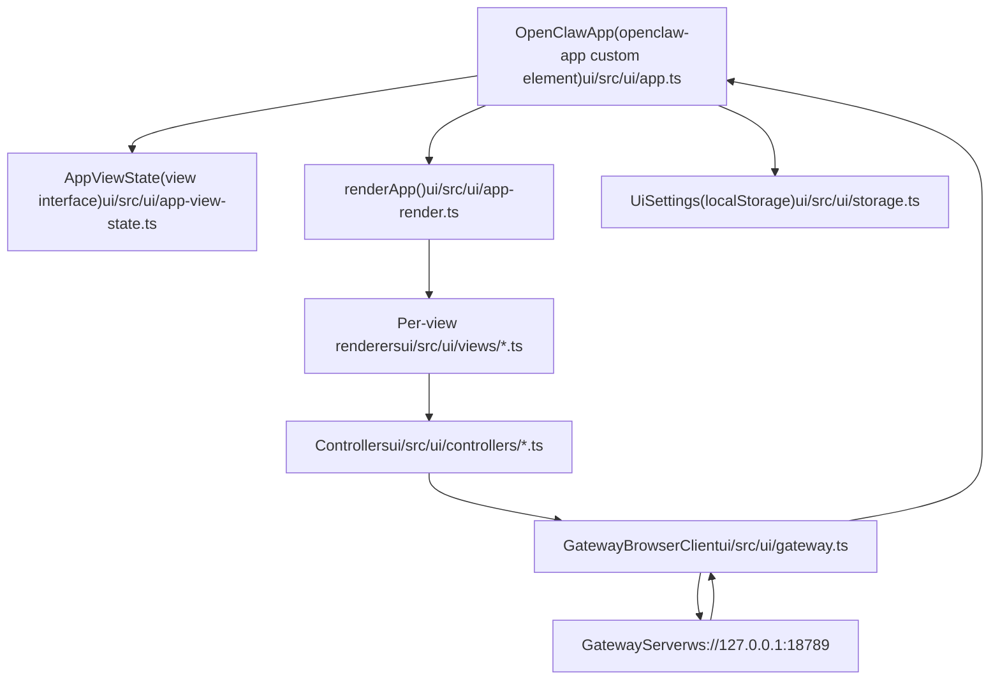
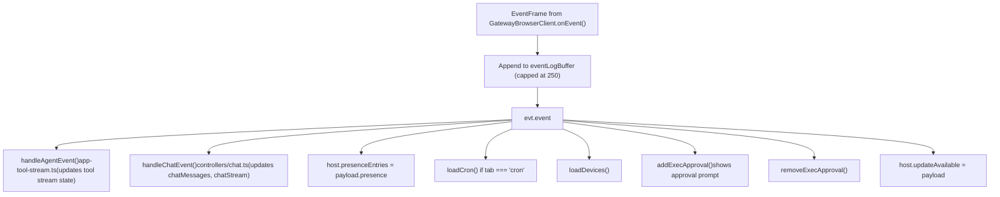

# Control UI

Relevant source files

-   [CHANGELOG.md](https://github.com/openclaw/openclaw/blob/8873e13f/CHANGELOG.md)
-   [README.md](https://github.com/openclaw/openclaw/blob/8873e13f/README.md)
-   [apps/android/app/build.gradle.kts](https://github.com/openclaw/openclaw/blob/8873e13f/apps/android/app/build.gradle.kts)
-   [apps/ios/Sources/Info.plist](https://github.com/openclaw/openclaw/blob/8873e13f/apps/ios/Sources/Info.plist)
-   [apps/ios/Tests/Info.plist](https://github.com/openclaw/openclaw/blob/8873e13f/apps/ios/Tests/Info.plist)
-   [apps/ios/project.yml](https://github.com/openclaw/openclaw/blob/8873e13f/apps/ios/project.yml)
-   [apps/macos/Sources/OpenClaw/Resources/Info.plist](https://github.com/openclaw/openclaw/blob/8873e13f/apps/macos/Sources/OpenClaw/Resources/Info.plist)
-   [apps/macos/Sources/OpenClawProtocol/GatewayModels.swift](https://github.com/openclaw/openclaw/blob/8873e13f/apps/macos/Sources/OpenClawProtocol/GatewayModels.swift)
-   [apps/shared/OpenClawKit/Sources/OpenClawProtocol/GatewayModels.swift](https://github.com/openclaw/openclaw/blob/8873e13f/apps/shared/OpenClawKit/Sources/OpenClawProtocol/GatewayModels.swift)
-   [assets/avatar-placeholder.svg](https://github.com/openclaw/openclaw/blob/8873e13f/assets/avatar-placeholder.svg)
-   [docs/cli/index.md](https://github.com/openclaw/openclaw/blob/8873e13f/docs/cli/index.md)
-   [docs/experiments/onboarding-config-protocol.md](https://github.com/openclaw/openclaw/blob/8873e13f/docs/experiments/onboarding-config-protocol.md)
-   [docs/gateway/configuration.md](https://github.com/openclaw/openclaw/blob/8873e13f/docs/gateway/configuration.md)
-   [docs/gateway/index.md](https://github.com/openclaw/openclaw/blob/8873e13f/docs/gateway/index.md)
-   [docs/gateway/troubleshooting.md](https://github.com/openclaw/openclaw/blob/8873e13f/docs/gateway/troubleshooting.md)
-   [docs/index.md](https://github.com/openclaw/openclaw/blob/8873e13f/docs/index.md)
-   [docs/platforms/mac/release.md](https://github.com/openclaw/openclaw/blob/8873e13f/docs/platforms/mac/release.md)
-   [docs/start/getting-started.md](https://github.com/openclaw/openclaw/blob/8873e13f/docs/start/getting-started.md)
-   [docs/start/wizard.md](https://github.com/openclaw/openclaw/blob/8873e13f/docs/start/wizard.md)
-   [extensions/bluebubbles/src/send-helpers.ts](https://github.com/openclaw/openclaw/blob/8873e13f/extensions/bluebubbles/src/send-helpers.ts)
-   [package.json](https://github.com/openclaw/openclaw/blob/8873e13f/package.json)
-   [pnpm-lock.yaml](https://github.com/openclaw/openclaw/blob/8873e13f/pnpm-lock.yaml)
-   [scripts/clawtributors-map.json](https://github.com/openclaw/openclaw/blob/8873e13f/scripts/clawtributors-map.json)
-   [scripts/protocol-gen-swift.ts](https://github.com/openclaw/openclaw/blob/8873e13f/scripts/protocol-gen-swift.ts)
-   [scripts/update-clawtributors.ts](https://github.com/openclaw/openclaw/blob/8873e13f/scripts/update-clawtributors.ts)
-   [scripts/update-clawtributors.types.ts](https://github.com/openclaw/openclaw/blob/8873e13f/scripts/update-clawtributors.types.ts)
-   [src/agents/openclaw-gateway-tool.test.ts](https://github.com/openclaw/openclaw/blob/8873e13f/src/agents/openclaw-gateway-tool.test.ts)
-   [src/agents/subagent-registry-cleanup.test.ts](https://github.com/openclaw/openclaw/blob/8873e13f/src/agents/subagent-registry-cleanup.test.ts)
-   [src/agents/tools/gateway-tool.ts](https://github.com/openclaw/openclaw/blob/8873e13f/src/agents/tools/gateway-tool.ts)
-   [src/cli/program.ts](https://github.com/openclaw/openclaw/blob/8873e13f/src/cli/program.ts)
-   [src/config/config.ts](https://github.com/openclaw/openclaw/blob/8873e13f/src/config/config.ts)
-   [src/config/schema.test.ts](https://github.com/openclaw/openclaw/blob/8873e13f/src/config/schema.test.ts)
-   [src/config/types.ts](https://github.com/openclaw/openclaw/blob/8873e13f/src/config/types.ts)
-   [src/config/zod-schema.ts](https://github.com/openclaw/openclaw/blob/8873e13f/src/config/zod-schema.ts)
-   [src/discord/monitor/thread-bindings.shared-state.test.ts](https://github.com/openclaw/openclaw/blob/8873e13f/src/discord/monitor/thread-bindings.shared-state.test.ts)
-   [src/gateway/method-scopes.test.ts](https://github.com/openclaw/openclaw/blob/8873e13f/src/gateway/method-scopes.test.ts)
-   [src/gateway/method-scopes.ts](https://github.com/openclaw/openclaw/blob/8873e13f/src/gateway/method-scopes.ts)
-   [src/gateway/protocol/index.ts](https://github.com/openclaw/openclaw/blob/8873e13f/src/gateway/protocol/index.ts)
-   [src/gateway/protocol/schema.ts](https://github.com/openclaw/openclaw/blob/8873e13f/src/gateway/protocol/schema.ts)
-   [src/gateway/protocol/schema/config.ts](https://github.com/openclaw/openclaw/blob/8873e13f/src/gateway/protocol/schema/config.ts)
-   [src/gateway/protocol/schema/protocol-schemas.ts](https://github.com/openclaw/openclaw/blob/8873e13f/src/gateway/protocol/schema/protocol-schemas.ts)
-   [src/gateway/protocol/schema/types.ts](https://github.com/openclaw/openclaw/blob/8873e13f/src/gateway/protocol/schema/types.ts)
-   [src/gateway/server-methods-list.ts](https://github.com/openclaw/openclaw/blob/8873e13f/src/gateway/server-methods-list.ts)
-   [src/gateway/server-methods.ts](https://github.com/openclaw/openclaw/blob/8873e13f/src/gateway/server-methods.ts)
-   [src/gateway/server-methods/config.ts](https://github.com/openclaw/openclaw/blob/8873e13f/src/gateway/server-methods/config.ts)
-   [src/gateway/server-methods/restart-request.ts](https://github.com/openclaw/openclaw/blob/8873e13f/src/gateway/server-methods/restart-request.ts)
-   [src/gateway/server-methods/update.ts](https://github.com/openclaw/openclaw/blob/8873e13f/src/gateway/server-methods/update.ts)
-   [src/gateway/server.config-patch.test.ts](https://github.com/openclaw/openclaw/blob/8873e13f/src/gateway/server.config-patch.test.ts)
-   [src/gateway/server.ts](https://github.com/openclaw/openclaw/blob/8873e13f/src/gateway/server.ts)
-   [ui/package.json](https://github.com/openclaw/openclaw/blob/8873e13f/ui/package.json)

The Control UI is the browser-based single-page application (SPA) that provides a dashboard for the OpenClaw Gateway. It runs in a standard web browser and communicates with the Gateway exclusively over a WebSocket connection. This page covers the SPA's component architecture, state management, Gateway client, view routing, settings persistence, and theming system.

For information about the Gateway WebSocket protocol the UI connects to, see [WebSocket Protocol](/openclaw/openclaw/2.1-websocket-protocol-and-rpc). For details on authentication modes used during the connect handshake, see [Authentication & Device Pairing](/openclaw/openclaw/2.2-authentication-and-device-pairing). For the native iOS/macOS/Android node clients (which are a distinct type of Gateway client), see [Native Clients (Nodes)](/openclaw/openclaw/6-native-clients-(nodes)).

---

## Architecture Overview

The UI is a LitElement SPA served by the Gateway's HTTP server. All data flows through a single WebSocket connection managed by `GatewayBrowserClient`.

**Component and Data Flow Diagram**


Sources: [ui/src/ui/app.ts1-616](https://github.com/openclaw/openclaw/blob/8873e13f/ui/src/ui/app.ts#L1-L616) [ui/src/ui/app-view-state.ts1-50](https://github.com/openclaw/openclaw/blob/8873e13f/ui/src/ui/app-view-state.ts#L1-L50) [ui/src/ui/app-render.ts1-100](https://github.com/openclaw/openclaw/blob/8873e13f/ui/src/ui/app-render.ts#L1-L100) [ui/src/ui/gateway.ts1-100](https://github.com/openclaw/openclaw/blob/8873e13f/ui/src/ui/gateway.ts#L1-L100) [ui/src/ui/storage.ts1-50](https://github.com/openclaw/openclaw/blob/8873e13f/ui/src/ui/storage.ts#L1-L50)

---

## `OpenClawApp` Component

`OpenClawApp` is the root LitElement custom element registered as `openclaw-app` [ui/src/ui/app.ts110-616](https://github.com/openclaw/openclaw/blob/8873e13f/ui/src/ui/app.ts#L110-L616) It is the single instance of the application and holds all reactive state as `@state()` decorated properties.

It **does not** use Shadow DOM — `createRenderRoot()` returns `this` [ui/src/ui/app.ts392-394](https://github.com/openclaw/openclaw/blob/8873e13f/ui/src/ui/app.ts#L392-L394) — so styles are applied globally.

### Lifecycle

| Lifecycle Method | Handler |
| --- | --- |
| `connectedCallback` | `handleConnected` in `app-lifecycle.ts` |
| `firstUpdated` | `handleFirstUpdated` in `app-lifecycle.ts` |
| `updated` | `handleUpdated` in `app-lifecycle.ts` |
| `disconnectedCallback` | `handleDisconnected` in `app-lifecycle.ts` |

The `firstUpdated` hook is where the Gateway connection is initiated and URL-based settings (`token`, `session`, `gatewayUrl` query params) are consumed via `applySettingsFromUrl` [ui/src/ui/app-settings.ts89-149](https://github.com/openclaw/openclaw/blob/8873e13f/ui/src/ui/app-settings.ts#L89-L149)

### `AppViewState` Interface

Rather than passing `this` (the `OpenClawApp` instance) directly to rendering and controller functions, the code casts to `AppViewState` [ui/src/ui/app-view-state.ts47](https://github.com/openclaw/openclaw/blob/8873e13f/ui/src/ui/app-view-state.ts#L47-LNaN) a structural type that describes only the fields and methods needed for rendering and data loading. This pattern decouples the view layer from the component class.

`renderApp` is called as `renderApp(this as unknown as AppViewState)` [ui/src/ui/app.ts613-615](https://github.com/openclaw/openclaw/blob/8873e13f/ui/src/ui/app.ts#L613-L615)

---

## State Management

### Reactive State (`@state()`)

`OpenClawApp` declares all UI state as `@state()` properties, grouped by feature domain:

| Domain | Key Properties |
| --- | --- |
| **Connection** | `connected`, `hello`, `lastError`, `lastErrorCode`, `client` |
| **Chat** | `chatMessages`, `chatStream`, `chatStreamStartedAt`, `chatSending`, `chatRunId`, `chatQueue`, `chatAttachments` |
| **Sessions** | `sessionsResult`, `sessionsLoading`, `sessionsFilterActive`, `sessionsFilterLimit` |
| **Agents** | `agentsList`, `agentsSelectedId`, `agentsPanel`, `agentFilesList`, `agentIdentityById` |
| **Cron** | `cronJobs`, `cronStatus`, `cronForm`, `cronRuns`, `cronFieldErrors` |
| **Config** | `configSnapshot`, `configSchema`, `configForm`, `configFormDirty` |
| **Nodes/Devices** | `nodes`, `devicesList`, `execApprovalsForm`, `execApprovalQueue` |
| **Logs** | `logsEntries`, `logsLevelFilters`, `logsAtBottom` |
| **Skills** | `skillsReport`, `skillEdits`, `skillMessages` |
| **Usage** | `usageResult`, `usageCostSummary`, `usageTimeSeries` |
| **UI** | `tab`, `theme`, `themeResolved`, `settings`, `onboarding`, `sidebarOpen`, `splitRatio` |

Sources: [ui/src/ui/app.ts113-385](https://github.com/openclaw/openclaw/blob/8873e13f/ui/src/ui/app.ts#L113-L385)

### Settings Persistence (`UiSettings`)

Settings that survive page reloads are persisted to `localStorage` under the key `openclaw.control.settings.v1`. The `UiSettings` type is:

```
type UiSettings = {  gatewayUrl: string;           // ws:// or wss:// URL of the Gateway  token: string;                // shared auth token  sessionKey: string;           // last selected chat session key  lastActiveSessionKey: string; // most recently active chat session key  theme: ThemeMode;             // "dark" | "light" | "system"  chatFocusMode: boolean;       // hides nav/header in chat view  chatShowThinking: boolean;    // shows tool result messages  splitRatio: number;           // sidebar split ratio (0.4–0.7)  navCollapsed: boolean;        // whether the sidebar nav is hidden  navGroupsCollapsed: Record<string, boolean>; // per-group collapse state  locale?: string;              // UI language code};
```
`loadSettings()` is called at component construction time. `saveSettings()` is called by `applySettings()` on every settings mutation [ui/src/ui/storage.ts20](https://github.com/openclaw/openclaw/blob/8873e13f/ui/src/ui/storage.ts#L20-LNaN) [ui/src/ui/app-settings.ts64-76](https://github.com/openclaw/openclaw/blob/8873e13f/ui/src/ui/app-settings.ts#L64-L76)

---

## `GatewayBrowserClient`

`GatewayBrowserClient` [ui/src/ui/gateway.ts94](https://github.com/openclaw/openclaw/blob/8873e13f/ui/src/ui/gateway.ts#L94-LNaN) is the WebSocket client class. Each call to `connectGateway()` [ui/src/ui/app-gateway.ts139-214](https://github.com/openclaw/openclaw/blob/8873e13f/ui/src/ui/app-gateway.ts#L139-L214) creates a new instance and stops the previous one.

### Connection Lifecycle

> **[Mermaid sequence]**
> *(图表结构无法解析)*

### Authentication

The client sends one of:

-   **Shared token**: `auth.token` from `UiSettings.token`
-   **Device token**: Rotated token derived from a browser-generated ECDSA keypair stored in `IndexedDB` (only in secure contexts where `crypto.subtle` is available)
-   **Password**: `auth.password`

The device identity is managed by `loadOrCreateDeviceIdentity()` and `signDevicePayload()` [ui/src/ui/gateway.ts161-213](https://github.com/openclaw/openclaw/blob/8873e13f/ui/src/ui/gateway.ts#L161-L213) The device token received in the `hello-ok` response is stored locally via `storeDeviceAuthToken()` for future connections.

### Reconnection

`GatewayBrowserClient` reconnects automatically on close, with exponential backoff starting at 800ms and capping at 15 seconds [ui/src/ui/gateway.ts145-152](https://github.com/openclaw/openclaw/blob/8873e13f/ui/src/ui/gateway.ts#L145-L152)

Sources: [ui/src/ui/gateway.ts94-330](https://github.com/openclaw/openclaw/blob/8873e13f/ui/src/ui/gateway.ts#L94-L330) [ui/src/ui/app-gateway.ts139-214](https://github.com/openclaw/openclaw/blob/8873e13f/ui/src/ui/app-gateway.ts#L139-L214)

---

## Navigation and Views

Navigation is URL-path-based. The current tab is derived from `window.location.pathname` on load and updated via `history.pushState` when tabs are switched. The `onPopState` handler keeps tab state synchronized with browser history [ui/src/ui/app-settings.ts151-170](https://github.com/openclaw/openclaw/blob/8873e13f/ui/src/ui/app-settings.ts#L151-L170)

**Tab-to-View Mapping**

```mermaid
flowchart TD
    T1["chat"]
    T2["overview"]
    T3["channels"]
    T4["instances"]
    T5["sessions"]
    T6["usage"]
    T7["cron"]
    T8["agents"]
    T9["skills"]
    T10["nodes"]
    T11["logs"]
    T12["debug"]
    V1["renderChat()chat.ts"]
    V2["renderOverview()overview.ts"]
    V3["renderChannels()channels.ts"]
    V4["renderInstances()instances.ts"]
    V5["renderSessions()sessions.ts"]
    V6["renderUsageTab()app-render-usage-tab.ts"]
    V7["renderCron()cron.ts"]
    V8["renderAgents()agents.ts"]
    V9["renderSkills()skills.ts"]
    V10["renderNodes()nodes.ts"]
    V11["renderLogs()logs.ts"]
    V12["renderDebug()debug.ts"]

    T1 --> V1
    T2 --> V2
    T3 --> V3
    T4 --> V4
    T5 --> V5
    T6 --> V6
    T7 --> V7
    T8 --> V8
    T9 --> V9
    T10 --> V10
    T11 --> V11
    T12 --> V12
```


Sources: [ui/src/ui/app-render.ts328-950](https://github.com/openclaw/openclaw/blob/8873e13f/ui/src/ui/app-render.ts#L328-L950) [ui/src/ui/app-settings.ts186-244](https://github.com/openclaw/openclaw/blob/8873e13f/ui/src/ui/app-settings.ts#L186-L244)

### Tab Groups

The navigation sidebar organizes tabs into collapsible groups via `TAB_GROUPS` from `navigation.ts`. Each group label maps to a `navGroupsCollapsed` entry in `UiSettings`, so collapse state survives page reloads [ui/src/ui/app-render.ts259-302](https://github.com/openclaw/openclaw/blob/8873e13f/ui/src/ui/app-render.ts#L259-L302)

### Data Loading on Tab Switch

When `setTab()` is called, `refreshActiveTab()` [ui/src/ui/app-settings.ts186-244](https://github.com/openclaw/openclaw/blob/8873e13f/ui/src/ui/app-settings.ts#L186-L244) loads the relevant data for the newly active tab:

| Tab | Data Loaded |
| --- | --- |
| `overview` | `loadOverview()` (presence count, sessions count, cron status) |
| `channels` | `loadChannels()` |
| `instances` | `loadPresence()` |
| `sessions` | `loadSessions()` |
| `cron` | `loadCronStatus()`, `loadCronJobs()`, `loadCronRuns()` |
| `agents` | `loadAgents()`, `loadToolsCatalog()`, `loadConfig()`, `loadAgentIdentities()` |
| `nodes` | `loadNodes()`, `loadDevices()`, `loadConfig()`, `loadExecApprovals()` |
| `chat` | `refreshChat()`, scroll to bottom |
| `logs` | `loadLogs()`, starts polling interval |
| `debug` | `loadDebug()`, starts polling interval |
| `skills` | `loadSkills()` |

---

## Shell Layout

The UI uses a CSS Grid shell defined in [ui/src/styles/layout.css1-50](https://github.com/openclaw/openclaw/blob/8873e13f/ui/src/styles/layout.css#L1-L50) The top-level structure is:

```
┌────────────────────────────────────────────┐
│  .topbar   (56px, spans full width)        │
├───────────────┬────────────────────────────┤
│  .nav         │  .content                  │
│  (220px wide) │  (fills remaining width)   │
│               │                            │
└───────────────┴────────────────────────────┘
```
CSS class modifiers on `.shell`:

| Class | Effect |
| --- | --- |
| `.shell--nav-collapsed` | Sets `grid-template-columns: 0px 1fr`, hides nav |
| `.shell--chat-focus` | Collapses nav and topbar; full-screen chat |
| `.shell--chat` | Prevents overflow scrolling on the shell |
| `.shell--onboarding` | Hides topbar row (`grid-template-rows: 0 1fr`) |

Sources: [ui/src/styles/layout.css1-622](https://github.com/openclaw/openclaw/blob/8873e13f/ui/src/styles/layout.css#L1-L622)

### Chat View Layout

When `tab === "chat"`, the main content area switches to a flex column layout (`.content--chat`). The chat view itself [ui/src/ui/views/chat.ts240-480](https://github.com/openclaw/openclaw/blob/8873e13f/ui/src/ui/views/chat.ts#L240-L480) contains:

-   **`.chat-thread`** — scrollable message history
-   **`.chat-split-container`** — optional side-by-side markdown sidebar (resizable with `resizable-divider` custom element)
-   **`.chat-compose`** — sticky compose area with textarea and send/abort buttons
-   **Compaction/fallback indicators** — transient status toasts rendered by `renderCompactionIndicator()` and `renderFallbackIndicator()`

The sidebar split ratio is user-adjustable (range 0.4–0.7) and stored in `UiSettings.splitRatio` [ui/src/ui/app.ts607-611](https://github.com/openclaw/openclaw/blob/8873e13f/ui/src/ui/app.ts#L607-L611)

---

## Gateway Event Handling

Incoming events from the Gateway are handled by `handleGatewayEvent()` in `app-gateway.ts` [ui/src/ui/app-gateway.ts216-328](https://github.com/openclaw/openclaw/blob/8873e13f/ui/src/ui/app-gateway.ts#L216-L328)

**Event dispatch diagram:**


Sources: [ui/src/ui/app-gateway.ts260-328](https://github.com/openclaw/openclaw/blob/8873e13f/ui/src/ui/app-gateway.ts#L260-L328)

### Chat Event States

`handleChatEvent()` [ui/src/ui/controllers/chat.ts220-285](https://github.com/openclaw/openclaw/blob/8873e13f/ui/src/ui/controllers/chat.ts#L220-L285) processes `ChatEventPayload` with these state values:

| `payload.state` | Effect on UI |
| --- | --- |
| `"delta"` | Appends streamed text to `chatStream` |
| `"final"` | Moves final message to `chatMessages`, clears `chatStream` |
| `"aborted"` | Moves aborted message content to `chatMessages`, clears stream |
| `"error"` | Sets `lastError`, clears stream |

After a terminal event (`final`, `error`, `aborted`), `resetToolStream()` is called and any queued chat messages are flushed via `flushChatQueueForEvent()` [ui/src/ui/app-gateway.ts224-244](https://github.com/openclaw/openclaw/blob/8873e13f/ui/src/ui/app-gateway.ts#L224-L244)

---

## Theming

The theme system supports three modes defined in `ThemeMode` [ui/src/ui/theme.ts1](https://github.com/openclaw/openclaw/blob/8873e13f/ui/src/ui/theme.ts#L1-LNaN): `"dark"`, `"light"`, and `"system"`. The resolved theme (`"dark"` or `"light"`) is written as a `data-theme` attribute on `:root`, which switches between two CSS variable sets defined in `base.css` [ui/src/styles/base.css1](https://github.com/openclaw/openclaw/blob/8873e13f/ui/src/styles/base.css#L1-LNaN)

-   Dark mode uses `--bg: #12141a`, `--accent: #ff5c5c` (red)
-   Light mode overrides are declared under `:root[data-theme="light"]`

The theme toggle widget (three-button dark/light/system selector) is rendered by `renderThemeToggle()` in `app-render.helpers.ts` and displayed in the topbar. When "system" is selected, a `MediaQueryList` listener on `prefers-color-scheme` drives automatic switching [ui/src/ui/app-settings.ts172-184](https://github.com/openclaw/openclaw/blob/8873e13f/ui/src/ui/app-settings.ts#L172-L184)

Theme changes are animated via `startThemeTransition()` [ui/src/ui/app-lifecycle.ts1](https://github.com/openclaw/openclaw/blob/8873e13f/ui/src/ui/app-lifecycle.ts#L1-LNaN)

---

## Agents View — Sub-panel Structure

The Agents tab is more complex than other tabs: it has an internal panel switcher within the view. The `agentsPanel` state field selects among:

| Panel | Contents |
| --- | --- |
| `"overview"` | Agent identity, model selection, model fallbacks |
| `"files"` | Agent workspace files (AGENTS.md, SOUL.md, etc.) editor |
| `"tools"` | Tools catalog and tool policy controls |
| `"skills"` | Installed skills with enable/disable toggles |
| `"channels"` | Channel status filtered to the selected agent |
| `"cron"` | Cron jobs for the selected agent |

Config mutations from the agents view (model changes, tool profile, skill enable/disable) use `updateConfigFormValue()` / `removeConfigFormValue()` to patch `configForm` in memory, then call `saveConfig()` to persist via the Gateway's `config.patch` RPC [ui/src/ui/app-render.ts639-869](https://github.com/openclaw/openclaw/blob/8873e13f/ui/src/ui/app-render.ts#L639-L869)

Sources: [ui/src/ui/app-render.ts513-871](https://github.com/openclaw/openclaw/blob/8873e13f/ui/src/ui/app-render.ts#L513-L871) [ui/src/ui/app.ts224-239](https://github.com/openclaw/openclaw/blob/8873e13f/ui/src/ui/app.ts#L224-L239)

---

## Exec Approval Prompt

When an agent requests exec approval (e.g., before running a shell command), the Gateway emits `exec.approval.requested`. The UI queues these in `execApprovalQueue` [ui/src/ui/app.ts174-175](https://github.com/openclaw/openclaw/blob/8873e13f/ui/src/ui/app.ts#L174-L175) and renders a modal prompt via `renderExecApprovalPrompt()` [ui/src/ui/app-render.ts74](https://github.com/openclaw/openclaw/blob/8873e13f/ui/src/ui/app-render.ts#L74-L74)

The operator can respond with `allow-once`, `allow-always`, or `deny`. This calls the `exec.approval.resolve` RPC method [ui/src/ui/app.ts543-561](https://github.com/openclaw/openclaw/blob/8873e13f/ui/src/ui/app.ts#L543-L561) Approvals expire automatically — a `setTimeout` removes them from the queue at their `expiresAtMs` [ui/src/ui/app-gateway.ts306-313](https://github.com/openclaw/openclaw/blob/8873e13f/ui/src/ui/app-gateway.ts#L306-L313)

---

## URL-Based Configuration Injection

On initial load, the app reads the following query parameters (then strips them from the URL):

| Parameter | Effect |
| --- | --- |
| `token` | Sets `UiSettings.token` |
| `session` | Sets the active session key |
| `gatewayUrl` | Prompts the user to confirm switching gateway URLs |
| `password` | Stripped only (never persisted) |
| `onboarding=1` | Activates onboarding mode (hides topbar, collapses nav) |

Sources: [ui/src/ui/app-settings.ts89-149](https://github.com/openclaw/openclaw/blob/8873e13f/ui/src/ui/app-settings.ts#L89-L149) [ui/src/ui/app.ts97-108](https://github.com/openclaw/openclaw/blob/8873e13f/ui/src/ui/app.ts#L97-L108)

---

## Key File Index

| File | Role |
| --- | --- |
| `ui/src/ui/app.ts` | `OpenClawApp` LitElement root component |
| `ui/src/ui/app-view-state.ts` | `AppViewState` structural type for rendering |
| `ui/src/ui/app-render.ts` | `renderApp()` — top-level render function |
| `ui/src/ui/app-gateway.ts` | `connectGateway()`, `handleGatewayEvent()` |
| `ui/src/ui/gateway.ts` | `GatewayBrowserClient` WebSocket client |
| `ui/src/ui/storage.ts` | `UiSettings`, `loadSettings()`, `saveSettings()` |
| `ui/src/ui/app-settings.ts` | `setTab()`, `applySettings()`, `refreshActiveTab()` |
| `ui/src/ui/app-lifecycle.ts` | LitElement lifecycle handlers |
| `ui/src/ui/app-chat.ts` | Chat message sending/queueing logic |
| `ui/src/ui/navigation.ts` | `TAB_GROUPS`, `pathForTab()`, `tabFromPath()` |
| `ui/src/ui/views/*.ts` | Per-tab view renderers |
| `ui/src/ui/controllers/*.ts` | Data-loading functions calling `GatewayBrowserClient` |
| `ui/src/styles/base.css` | CSS design tokens (colors, typography, spacing) |
| `ui/src/styles/layout.css` | Shell grid and topbar/nav/content layout |
| `ui/src/styles/components.css` | Shared components (buttons, cards, forms, pills) |
| `ui/src/styles/chat/layout.css` | Chat-specific layout |
