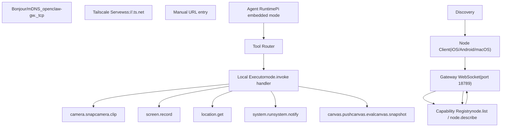
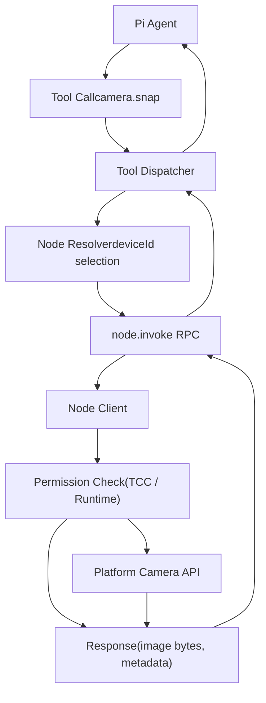
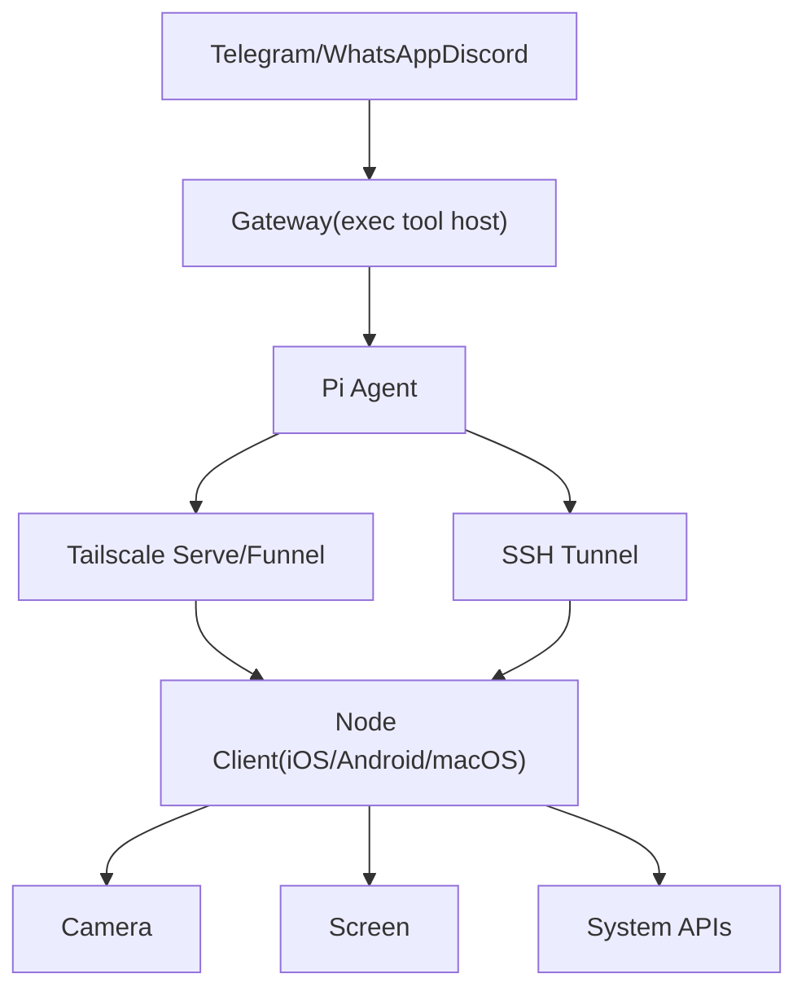

# Native Clients (Nodes)

Relevant source files

-   [CHANGELOG.md](https://github.com/openclaw/openclaw/blob/8873e13f/CHANGELOG.md)
-   [README.md](https://github.com/openclaw/openclaw/blob/8873e13f/README.md)
-   [apps/android/app/build.gradle.kts](https://github.com/openclaw/openclaw/blob/8873e13f/apps/android/app/build.gradle.kts)
-   [apps/ios/Sources/Info.plist](https://github.com/openclaw/openclaw/blob/8873e13f/apps/ios/Sources/Info.plist)
-   [apps/ios/Tests/Info.plist](https://github.com/openclaw/openclaw/blob/8873e13f/apps/ios/Tests/Info.plist)
-   [apps/ios/project.yml](https://github.com/openclaw/openclaw/blob/8873e13f/apps/ios/project.yml)
-   [apps/macos/Sources/OpenClaw/Resources/Info.plist](https://github.com/openclaw/openclaw/blob/8873e13f/apps/macos/Sources/OpenClaw/Resources/Info.plist)
-   [assets/avatar-placeholder.svg](https://github.com/openclaw/openclaw/blob/8873e13f/assets/avatar-placeholder.svg)
-   [docs/cli/index.md](https://github.com/openclaw/openclaw/blob/8873e13f/docs/cli/index.md)
-   [docs/gateway/configuration.md](https://github.com/openclaw/openclaw/blob/8873e13f/docs/gateway/configuration.md)
-   [docs/gateway/index.md](https://github.com/openclaw/openclaw/blob/8873e13f/docs/gateway/index.md)
-   [docs/gateway/troubleshooting.md](https://github.com/openclaw/openclaw/blob/8873e13f/docs/gateway/troubleshooting.md)
-   [docs/index.md](https://github.com/openclaw/openclaw/blob/8873e13f/docs/index.md)
-   [docs/platforms/mac/release.md](https://github.com/openclaw/openclaw/blob/8873e13f/docs/platforms/mac/release.md)
-   [docs/start/getting-started.md](https://github.com/openclaw/openclaw/blob/8873e13f/docs/start/getting-started.md)
-   [docs/start/wizard.md](https://github.com/openclaw/openclaw/blob/8873e13f/docs/start/wizard.md)
-   [extensions/bluebubbles/src/send-helpers.ts](https://github.com/openclaw/openclaw/blob/8873e13f/extensions/bluebubbles/src/send-helpers.ts)
-   [package.json](https://github.com/openclaw/openclaw/blob/8873e13f/package.json)
-   [pnpm-lock.yaml](https://github.com/openclaw/openclaw/blob/8873e13f/pnpm-lock.yaml)
-   [scripts/clawtributors-map.json](https://github.com/openclaw/openclaw/blob/8873e13f/scripts/clawtributors-map.json)
-   [scripts/update-clawtributors.ts](https://github.com/openclaw/openclaw/blob/8873e13f/scripts/update-clawtributors.ts)
-   [scripts/update-clawtributors.types.ts](https://github.com/openclaw/openclaw/blob/8873e13f/scripts/update-clawtributors.types.ts)
-   [src/agents/subagent-registry-cleanup.test.ts](https://github.com/openclaw/openclaw/blob/8873e13f/src/agents/subagent-registry-cleanup.test.ts)
-   [src/cli/program.ts](https://github.com/openclaw/openclaw/blob/8873e13f/src/cli/program.ts)
-   [src/config/config.ts](https://github.com/openclaw/openclaw/blob/8873e13f/src/config/config.ts)
-   [src/config/types.ts](https://github.com/openclaw/openclaw/blob/8873e13f/src/config/types.ts)
-   [src/config/zod-schema.ts](https://github.com/openclaw/openclaw/blob/8873e13f/src/config/zod-schema.ts)
-   [ui/package.json](https://github.com/openclaw/openclaw/blob/8873e13f/ui/package.json)

## Purpose and scope

This page describes **native clients** (referred to as **nodes** in the Gateway protocol) that pair with the OpenClaw Gateway to provide device-specific capabilities. Nodes are mobile or desktop applications (iOS, Android, macOS) that connect via WebSocket, advertise their capabilities, and execute local actions when invoked by agents or tools.

For platform-specific features and setup instructions, see:

-   [iOS Client](/openclaw/openclaw/6.1-ios-client) - Canvas, Voice Wake, Talk Mode, camera, screen recording
-   [macOS Client](/openclaw/openclaw/6.2-macos-client) - Menu bar app, PTT, WebChat, remote gateway control
-   [Android Client](/openclaw/openclaw/6.3-android-client) - Connect/Chat/Voice tabs, Canvas, Camera, Screen capture, device commands

For node discovery and connection mechanisms, see [Gateway Discovery](https://github.com/openclaw/openclaw/blob/8873e13f/Gateway Discovery) (page not yet written). For security aspects of device pairing, see [Authentication & Device Pairing](/openclaw/openclaw/2.2-authentication-and-device-pairing).

---

## What is a node?

A **node** is a native client application that connects to the Gateway over WebSocket and exposes device-specific capabilities. Unlike channels (which route messages from chat platforms), nodes provide **tool execution surfaces** for local device actions.

Key characteristics:

-   **Device-local execution**: Nodes run commands on the device they're installed on (camera access, notifications, file operations, screen recording)
-   **Capability-based**: Each node advertises what it can do via the Gateway protocol
-   **Permission-aware**: Nodes enforce platform permissions (TCC on macOS/iOS, runtime permissions on Android)
-   **Paired authentication**: Nodes authenticate via device pairing before gaining access to the Gateway

**Sources:** [README.md240-253](https://github.com/openclaw/openclaw/blob/8873e13f/README.md#L240-L253) [README.md156-161](https://github.com/openclaw/openclaw/blob/8873e13f/README.md#L156-L161)

---

## Node architecture


**Diagram: Node-Gateway Integration Architecture**

**Sources:** [README.md240-253](https://github.com/openclaw/openclaw/blob/8873e13f/README.md#L240-L253) [README.md206-211](https://github.com/openclaw/openclaw/blob/8873e13f/README.md#L206-L211)

---

## Device pairing flow

Nodes authenticate with the Gateway via a **device pairing** flow before they can execute commands. The Gateway issues a pairing code, the node submits it, and upon approval, receives a persistent credential.

> **[Mermaid sequence]**
> *(图表结构无法解析)*

**Diagram: Device Pairing Sequence**

The pairing flow uses **challenge-based device authentication** (introduced in device auth v2):

1.  Gateway sends a `connect.challenge` with a random nonce
2.  Node signs the challenge with its private key
3.  Node includes the signed payload in `connect` params
4.  Gateway validates the signature before allowing pairing or RPC access

**Sources:** [CHANGELOG.md111-117](https://github.com/openclaw/openclaw/blob/8873e13f/CHANGELOG.md#L111-L117) [README.md240-253](https://github.com/openclaw/openclaw/blob/8873e13f/README.md#L240-L253) [docs/gateway/troubleshooting.md93-136](https://github.com/openclaw/openclaw/blob/8873e13f/docs/gateway/troubleshooting.md#L93-L136)

---

## Capability discovery and invocation

Nodes advertise their capabilities to the Gateway using two RPC methods:

-   **`node.list`**: Returns a list of all registered nodes with basic metadata (deviceId, hostname, platform)
-   **`node.describe`**: Returns detailed capability metadata for a specific node (available commands, permission status)

The Gateway routes tool invocations to nodes via **`node.invoke`**, which specifies the target deviceId, command ID, and parameters.


**Diagram: Node Tool Invocation Flow**

**Permission enforcement**: Nodes return error codes when permissions are missing:

-   `PERMISSION_MISSING` - Permission not granted (e.g., camera access denied)
-   `PERMISSION_DENIED` - Permission explicitly denied by user
-   `UNSUPPORTED` - Command not available on this platform

**Sources:** [README.md240-253](https://github.com/openclaw/openclaw/blob/8873e13f/README.md#L240-L253) [CHANGELOG.md95-97](https://github.com/openclaw/openclaw/blob/8873e13f/CHANGELOG.md#L95-L97)

---

## Discovery mechanisms

Nodes discover the Gateway using multiple methods:

| Method | Protocol | Use case |
| --- | --- | --- |
| **Bonjour/mDNS** | `_openclaw-gw._tcp` | Local network discovery (default) |
| **Wide-Area DNS-SD** | Unicast DNS-SD | Tailscale tailnet discovery |
| **Tailscale Serve** | `wss://<peer>.ts.net` | Remote gateway over Tailscale |
| **Manual URL** | WebSocket URL entry | Direct connection to known endpoint |

**Bonjour discovery** advertises the Gateway on the local network:

-   Service type: `_openclaw-gw._tcp`
-   TXT records include: version, auth mode, capabilities

**Tailscale discovery** probes for gateways on the tailnet:

1.  Node queries wide-area DNS-SD for `_openclaw-gw._tcp` records
2.  Falls back to direct Tailscale peer probe (`wss://<peer>.ts.net`)
3.  Connects to discovered gateway and authenticates

**Sources:** [CHANGELOG.md160-161](https://github.com/openclaw/openclaw/blob/8873e13f/CHANGELOG.md#L160-L161) [apps/android/app/build.gradle.kts154-155](https://github.com/openclaw/openclaw/blob/8873e13f/apps/android/app/build.gradle.kts#L154-L155) [README.md230-238](https://github.com/openclaw/openclaw/blob/8873e13f/README.md#L230-L238)

---

## Platform support matrix

| Feature | iOS | Android | macOS |
| --- | --- | --- | --- |
| **Device pairing** | ✅ | ✅ | ✅ |
| **Canvas (A2UI)** | ✅ | ✅ | ✅ |
| **Camera snap** | ✅ | ✅ | ✅ |
| **Camera clip (video)** | ✅ | ✅ | ❌ |
| **Screen recording** | ✅ | ✅ | ✅ |
| **Voice Wake** | ✅ | ❌ | ✅ |
| **Talk Mode** | ✅ | ✅ (Voice tab) | ✅ |
| **Location** | ✅ | ✅ | ❌ |
| **Notifications** | ✅ | ✅ | ✅ (system.notify) |
| **System run** | ❌ | ❌ | ✅ (system.run) |
| **App management** | ❌ | ✅ (APK update) | ❌ |
| **SMS/Contacts/Calendar** | ❌ | ✅ | ❌ |

**Sources:** [README.md156-161](https://github.com/openclaw/openclaw/blob/8873e13f/README.md#L156-L161) [README.md240-253](https://github.com/openclaw/openclaw/blob/8873e13f/README.md#L240-L253) [README.md307-310](https://github.com/openclaw/openclaw/blob/8873e13f/README.md#L307-L310)

---

## Node command families

### Common commands (all platforms)

-   **`camera.snap`**: Capture still image
-   **`camera.clip`**: Record video clip (iOS/Android only)
-   **`screen.record`**: Record screen video
-   **`canvas.push`**: Update Canvas UI (A2UI)
-   **`canvas.eval`**: Execute Canvas JavaScript
-   **`canvas.snapshot`**: Capture Canvas screenshot

### macOS-specific commands

-   **`system.run`**: Execute shell command (with permission checks)
-   **`system.notify`**: Post system notification

### Android-specific commands

-   **`location.get`**: Get device location
-   **`notifications.send`**: Send notification
-   **`sms.send`**: Send SMS message
-   **`contacts.list`**: List contacts
-   **`calendar.events`**: Query calendar events
-   **`motion.status`**: Get motion sensor data
-   **`app.update`**: Install APK update

**Sources:** [README.md240-253](https://github.com/openclaw/openclaw/blob/8873e13f/README.md#L240-L253) [README.md167-168](https://github.com/openclaw/openclaw/blob/8873e13f/README.md#L167-L168) [README.md307-310](https://github.com/openclaw/openclaw/blob/8873e13f/README.md#L307-L310)

---

## Permission model

Nodes enforce platform-specific permissions and report status to the Gateway:

**macOS/iOS (TCC - Transparency, Consent, and Control)**:

-   Camera: `NSCameraUsageDescription`
-   Microphone: `NSMicrophoneUsageDescription`
-   Location: `NSLocationWhenInUseUsageDescription`
-   Screen Recording: System Preferences → Privacy & Security → Screen Recording
-   Notifications: System Preferences → Notifications

**Android (Runtime Permissions)**:

-   Camera: `android.permission.CAMERA`
-   Location: `android.permission.ACCESS_FINE_LOCATION`
-   Microphone: `android.permission.RECORD_AUDIO`
-   Notifications: `android.permission.POST_NOTIFICATIONS` (API 33+)
-   SMS: `android.permission.SEND_SMS`

**Permission status in node.describe**:

```
{  "capabilities": {    "camera.snap": {      "available": true,      "permission": "granted"    },    "screen.record": {      "available": true,      "permission": "denied"    }  }}
```
**Sources:** [apps/ios/Sources/Info.plist45-57](https://github.com/openclaw/openclaw/blob/8873e13f/apps/ios/Sources/Info.plist#L45-L57) [README.md240-253](https://github.com/openclaw/openclaw/blob/8873e13f/README.md#L240-L253)

---

## Node configuration

Nodes are configured primarily through their native app settings. Gateway-side configuration is minimal:

**Gateway config (optional)**:

```
{  gateway: {    nodes: {      denyCommands: ["system.run"], // Block specific commands      approvals: {        // Approval workflow for sensitive commands      }    }  }}
```
**Node-side configuration**:

-   **iOS/Android**: Settings UI for gateway URL, credentials, Canvas preferences
-   **macOS**: Menu bar → Preferences for gateway connection, node mode toggle

**Sources:** [CHANGELOG.md126-127](https://github.com/openclaw/openclaw/blob/8873e13f/CHANGELOG.md#L126-L127) [README.md240-253](https://github.com/openclaw/openclaw/blob/8873e13f/README.md#L240-L253)

---

## Remote gateway usage

Nodes can connect to remote gateways (running on VPS or home server) while executing commands locally:


**Diagram: Remote Gateway with Local Node Execution**

**Use case**: Run the Gateway on a Linux VPS for 24/7 availability, while nodes provide device-local actions (camera, notifications) on demand.

**Connection modes**:

-   **Tailscale Serve**: Gateway binds to loopback, Tailscale exposes via HTTPS on tailnet
-   **Tailscale Funnel**: Public HTTPS with password auth
-   **SSH tunnel**: Forward local port to remote gateway port

**Sources:** [README.md230-238](https://github.com/openclaw/openclaw/blob/8873e13f/README.md#L230-L238) [docs/gateway/configuration.md214-228](https://github.com/openclaw/openclaw/blob/8873e13f/docs/gateway/configuration.md#L214-L228)

---

## Common troubleshooting

**Node won't connect**:

1.  Check gateway status: `openclaw gateway status`
2.  Verify discovery method (Bonjour, Tailscale, manual URL)
3.  Check firewall rules (allow port 18789 inbound)
4.  Review logs: `openclaw logs --follow`

**Permission denied errors**:

1.  Check node.describe response for permission status
2.  Grant permissions in System Settings (iOS/macOS) or App Info (Android)
3.  Restart node app after granting permissions

**Device pairing fails**:

1.  Verify gateway auth mode matches client expectations
2.  Check pairing store: `openclaw pairing list`
3.  Approve pending requests: `openclaw pairing approve <channel> <code>`

**Sources:** [docs/gateway/troubleshooting.md142-189](https://github.com/openclaw/openclaw/blob/8873e13f/docs/gateway/troubleshooting.md#L142-L189) [CHANGELOG.md95-97](https://github.com/openclaw/openclaw/blob/8873e13f/CHANGELOG.md#L95-L97)

---

## Related CLI commands

| Command | Purpose |
| --- | --- |
| `openclaw nodes` | List registered nodes |
| `openclaw devices` | Alias for `openclaw nodes` |
| `openclaw node run <deviceId> <command>` | Execute node command directly |
| `openclaw pairing list` | Show device pairing status |
| `openclaw pairing approve <channel> <code>` | Approve pairing request |

**Sources:** [docs/cli/index.md38-40](https://github.com/openclaw/openclaw/blob/8873e13f/docs/cli/index.md#L38-L40) [docs/cli/index.md250-253](https://github.com/openclaw/openclaw/blob/8873e13f/docs/cli/index.md#L250-L253)

---

## See also

-   [iOS Client](/openclaw/openclaw/6.1-ios-client) - iOS-specific features and setup
-   [macOS Client](/openclaw/openclaw/6.2-macos-client) - macOS menu bar app and node mode
-   [Android Client](/openclaw/openclaw/6.3-android-client) - Android node capabilities
-   [Authentication & Device Pairing](/openclaw/openclaw/2.2-authentication-and-device-pairing) - Gateway authentication and device auth v2
-   [Gateway Configuration](/openclaw/openclaw/2.3-configuration-system) - Node-related config options
