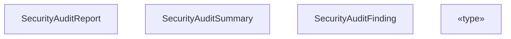
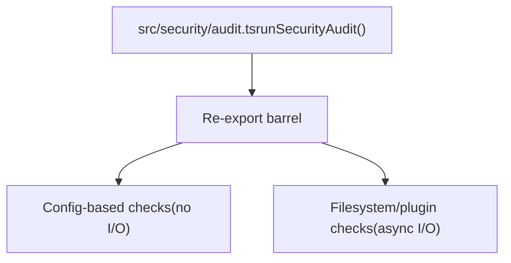

# Security Audit

Relevant source files

-   [docs/channels/discord.md](https://github.com/openclaw/openclaw/blob/8873e13f/docs/channels/discord.md)
-   [docs/channels/telegram.md](https://github.com/openclaw/openclaw/blob/8873e13f/docs/channels/telegram.md)
-   [docs/gateway/configuration-reference.md](https://github.com/openclaw/openclaw/blob/8873e13f/docs/gateway/configuration-reference.md)
-   [src/acp/control-plane/manager.core.ts](https://github.com/openclaw/openclaw/blob/8873e13f/src/acp/control-plane/manager.core.ts)
-   [src/agents/pi-embedded-runner/tool-result-char-estimator.ts](https://github.com/openclaw/openclaw/blob/8873e13f/src/agents/pi-embedded-runner/tool-result-char-estimator.ts)
-   [src/agents/pi-embedded-runner/tool-result-context-guard.ts](https://github.com/openclaw/openclaw/blob/8873e13f/src/agents/pi-embedded-runner/tool-result-context-guard.ts)
-   [src/agents/tools/telegram-actions.test.ts](https://github.com/openclaw/openclaw/blob/8873e13f/src/agents/tools/telegram-actions.test.ts)
-   [src/agents/tools/telegram-actions.ts](https://github.com/openclaw/openclaw/blob/8873e13f/src/agents/tools/telegram-actions.ts)
-   [src/auto-reply/reply/agent-runner.runreplyagent.e2e.test.ts](https://github.com/openclaw/openclaw/blob/8873e13f/src/auto-reply/reply/agent-runner.runreplyagent.e2e.test.ts)
-   [src/auto-reply/reply/normalize-reply.ts](https://github.com/openclaw/openclaw/blob/8873e13f/src/auto-reply/reply/normalize-reply.ts)
-   [src/auto-reply/skill-commands.test.ts](https://github.com/openclaw/openclaw/blob/8873e13f/src/auto-reply/skill-commands.test.ts)
-   [src/auto-reply/skill-commands.ts](https://github.com/openclaw/openclaw/blob/8873e13f/src/auto-reply/skill-commands.ts)
-   [src/auto-reply/tokens.test.ts](https://github.com/openclaw/openclaw/blob/8873e13f/src/auto-reply/tokens.test.ts)
-   [src/auto-reply/tokens.ts](https://github.com/openclaw/openclaw/blob/8873e13f/src/auto-reply/tokens.ts)
-   [src/channels/allowlists/resolve-utils.test.ts](https://github.com/openclaw/openclaw/blob/8873e13f/src/channels/allowlists/resolve-utils.test.ts)
-   [src/channels/allowlists/resolve-utils.ts](https://github.com/openclaw/openclaw/blob/8873e13f/src/channels/allowlists/resolve-utils.ts)
-   [src/channels/draft-stream-loop.ts](https://github.com/openclaw/openclaw/blob/8873e13f/src/channels/draft-stream-loop.ts)
-   [src/channels/plugins/actions/actions.test.ts](https://github.com/openclaw/openclaw/blob/8873e13f/src/channels/plugins/actions/actions.test.ts)
-   [src/channels/plugins/actions/telegram.ts](https://github.com/openclaw/openclaw/blob/8873e13f/src/channels/plugins/actions/telegram.ts)
-   [src/config/schema.help.quality.test.ts](https://github.com/openclaw/openclaw/blob/8873e13f/src/config/schema.help.quality.test.ts)
-   [src/config/schema.help.ts](https://github.com/openclaw/openclaw/blob/8873e13f/src/config/schema.help.ts)
-   [src/config/schema.labels.ts](https://github.com/openclaw/openclaw/blob/8873e13f/src/config/schema.labels.ts)
-   [src/config/types.agent-defaults.ts](https://github.com/openclaw/openclaw/blob/8873e13f/src/config/types.agent-defaults.ts)
-   [src/config/types.discord.ts](https://github.com/openclaw/openclaw/blob/8873e13f/src/config/types.discord.ts)
-   [src/config/types.telegram.ts](https://github.com/openclaw/openclaw/blob/8873e13f/src/config/types.telegram.ts)
-   [src/config/zod-schema.agent-defaults.ts](https://github.com/openclaw/openclaw/blob/8873e13f/src/config/zod-schema.agent-defaults.ts)
-   [src/config/zod-schema.providers-core.ts](https://github.com/openclaw/openclaw/blob/8873e13f/src/config/zod-schema.providers-core.ts)
-   [src/discord/monitor.test.ts](https://github.com/openclaw/openclaw/blob/8873e13f/src/discord/monitor.test.ts)
-   [src/discord/monitor.ts](https://github.com/openclaw/openclaw/blob/8873e13f/src/discord/monitor.ts)
-   [src/discord/monitor/listeners.test.ts](https://github.com/openclaw/openclaw/blob/8873e13f/src/discord/monitor/listeners.test.ts)
-   [src/discord/monitor/listeners.ts](https://github.com/openclaw/openclaw/blob/8873e13f/src/discord/monitor/listeners.ts)
-   [src/discord/monitor/provider.allowlist.test.ts](https://github.com/openclaw/openclaw/blob/8873e13f/src/discord/monitor/provider.allowlist.test.ts)
-   [src/discord/monitor/provider.allowlist.ts](https://github.com/openclaw/openclaw/blob/8873e13f/src/discord/monitor/provider.allowlist.ts)
-   [src/discord/monitor/provider.skill-dedupe.test.ts](https://github.com/openclaw/openclaw/blob/8873e13f/src/discord/monitor/provider.skill-dedupe.test.ts)
-   [src/discord/monitor/provider.test.ts](https://github.com/openclaw/openclaw/blob/8873e13f/src/discord/monitor/provider.test.ts)
-   [src/discord/monitor/provider.ts](https://github.com/openclaw/openclaw/blob/8873e13f/src/discord/monitor/provider.ts)
-   [src/imessage/monitor.ts](https://github.com/openclaw/openclaw/blob/8873e13f/src/imessage/monitor.ts)
-   [src/signal/monitor.ts](https://github.com/openclaw/openclaw/blob/8873e13f/src/signal/monitor.ts)
-   [src/slack/monitor.tool-result.test.ts](https://github.com/openclaw/openclaw/blob/8873e13f/src/slack/monitor.tool-result.test.ts)
-   [src/slack/monitor.ts](https://github.com/openclaw/openclaw/blob/8873e13f/src/slack/monitor.ts)
-   [src/slack/monitor/provider.ts](https://github.com/openclaw/openclaw/blob/8873e13f/src/slack/monitor/provider.ts)
-   [src/telegram/bot-handlers.ts](https://github.com/openclaw/openclaw/blob/8873e13f/src/telegram/bot-handlers.ts)
-   [src/telegram/bot-message-context.dm-threads.test.ts](https://github.com/openclaw/openclaw/blob/8873e13f/src/telegram/bot-message-context.dm-threads.test.ts)
-   [src/telegram/bot-message-context.ts](https://github.com/openclaw/openclaw/blob/8873e13f/src/telegram/bot-message-context.ts)
-   [src/telegram/bot-message-dispatch.test.ts](https://github.com/openclaw/openclaw/blob/8873e13f/src/telegram/bot-message-dispatch.test.ts)
-   [src/telegram/bot-message-dispatch.ts](https://github.com/openclaw/openclaw/blob/8873e13f/src/telegram/bot-message-dispatch.ts)
-   [src/telegram/bot-native-commands.ts](https://github.com/openclaw/openclaw/blob/8873e13f/src/telegram/bot-native-commands.ts)
-   [src/telegram/bot.test.ts](https://github.com/openclaw/openclaw/blob/8873e13f/src/telegram/bot.test.ts)
-   [src/telegram/bot.ts](https://github.com/openclaw/openclaw/blob/8873e13f/src/telegram/bot.ts)
-   [src/telegram/bot/delivery.replies.ts](https://github.com/openclaw/openclaw/blob/8873e13f/src/telegram/bot/delivery.replies.ts)
-   [src/telegram/bot/delivery.test.ts](https://github.com/openclaw/openclaw/blob/8873e13f/src/telegram/bot/delivery.test.ts)
-   [src/telegram/bot/delivery.ts](https://github.com/openclaw/openclaw/blob/8873e13f/src/telegram/bot/delivery.ts)
-   [src/telegram/bot/helpers.test.ts](https://github.com/openclaw/openclaw/blob/8873e13f/src/telegram/bot/helpers.test.ts)
-   [src/telegram/bot/helpers.ts](https://github.com/openclaw/openclaw/blob/8873e13f/src/telegram/bot/helpers.ts)
-   [src/telegram/draft-stream.test-helpers.ts](https://github.com/openclaw/openclaw/blob/8873e13f/src/telegram/draft-stream.test-helpers.ts)
-   [src/telegram/draft-stream.test.ts](https://github.com/openclaw/openclaw/blob/8873e13f/src/telegram/draft-stream.test.ts)
-   [src/telegram/draft-stream.ts](https://github.com/openclaw/openclaw/blob/8873e13f/src/telegram/draft-stream.ts)
-   [src/telegram/lane-delivery.test.ts](https://github.com/openclaw/openclaw/blob/8873e13f/src/telegram/lane-delivery.test.ts)
-   [src/telegram/lane-delivery.ts](https://github.com/openclaw/openclaw/blob/8873e13f/src/telegram/lane-delivery.ts)
-   [src/telegram/send.test.ts](https://github.com/openclaw/openclaw/blob/8873e13f/src/telegram/send.test.ts)
-   [src/telegram/send.ts](https://github.com/openclaw/openclaw/blob/8873e13f/src/telegram/send.ts)
-   [src/web/auto-reply.ts](https://github.com/openclaw/openclaw/blob/8873e13f/src/web/auto-reply.ts)
-   [src/web/inbound.test.ts](https://github.com/openclaw/openclaw/blob/8873e13f/src/web/inbound.test.ts)
-   [src/web/inbound.ts](https://github.com/openclaw/openclaw/blob/8873e13f/src/web/inbound.ts)
-   [src/web/vcard.ts](https://github.com/openclaw/openclaw/blob/8873e13f/src/web/vcard.ts)

This page covers the `openclaw security audit` command and the `runSecurityAudit` function — their data types, check categories, collector architecture, and remediation behavior. For the broader security model and trust boundaries, see [Security](/openclaw/openclaw/7-security). For sandboxing specifics referenced by the audit, see [Sandboxing](/openclaw/openclaw/7.2-sandboxing).

---

## CLI Usage

```
openclaw security audit          # standard config + filesystem checksopenclaw security audit --deep   # also live-probes the running Gatewayopenclaw security audit --fix    # applies safe remediationsopenclaw security audit --json   # machine-readable output
```
Combining flags is valid:

```
openclaw security audit --fix --json | jq '{fix: .fix.ok, summary: .report.summary}'openclaw security audit --deep --json | jq '.findings[] | select(.severity=="critical") | .checkId'
```
Sources: [docs/cli/security.md1-73](https://github.com/openclaw/openclaw/blob/8873e13f/docs/cli/security.md#L1-L73)

---

## Core Data Types

**Audit report hierarchy:**


Sources: [src/security/audit.ts54-83](https://github.com/openclaw/openclaw/blob/8873e13f/src/security/audit.ts#L54-L83)

### `SecurityAuditOptions`

`runSecurityAudit` accepts a `SecurityAuditOptions` object:

| Field | Type | Purpose |
| --- | --- | --- |
| `config` | `OpenClawConfig` | Parsed gateway config |
| `env` | `NodeJS.ProcessEnv` | Environment variables (for token/secret resolution) |
| `platform` | `NodeJS.Platform` | Platform override (default: `process.platform`) |
| `deep` | `boolean` | Enable live Gateway probe |
| `includeFilesystem` | `boolean` | Run filesystem permission checks |
| `includeChannelSecurity` | `boolean` | Run channel allowlist security checks |
| `stateDir` | `string` | Override default state directory path |
| `configPath` | `string` | Override default config file path |
| `deepTimeoutMs` | `number` | Timeout for deep Gateway probe |
| `plugins` | `ChannelPlugin[]` | DI for tests |
| `probeGatewayFn` | `typeof probeGateway` | DI for tests |
| `execIcacls` | `ExecFn` | DI for Windows ACL checks |
| `execDockerRawFn` | `typeof execDockerRaw` | DI for Docker label checks |

Sources: [src/security/audit.ts85-106](https://github.com/openclaw/openclaw/blob/8873e13f/src/security/audit.ts#L85-L106)

---

## Architecture

### `runSecurityAudit` Execution Flow

**Diagram: runSecurityAudit execution flow**

```mermaid
flowchart TD
    A["runSecurityAudit(SecurityAuditOptions)"]
    B["collectGatewayConfigFindings(cfg, env)"]
    C["collectBrowserControlFindings(cfg, env)"]
    D["collectFilesystemFindings(stateDir, configPath)"]
    E["collectAttackSurfaceSummaryFindings(cfg)"]
    F["collectExposureMatrixFindings(cfg, env)"]
    G["collectHooksHardeningFindings(cfg, env)"]
    H["collectNodeDenyCommandPatternFindings(cfg)"]
    I["collectNodeDangerousAllowCommandFindings(cfg)"]
    J["collectSandboxDangerousConfigFindings(cfg)"]
    K["collectSandboxDockerNoopFindings(cfg)"]
    L["collectSmallModelRiskFindings(cfg, env)"]
    M["collectModelHygieneFindings(cfg)"]
    N["collectSecretsInConfigFindings(cfg)"]
    O["collectMinimalProfileOverrideFindings(cfg)"]
    P["collectLikelyMultiUserSetupFindings(cfg)"]
    Q["collectGatewayHttpNoAuthFindings(cfg, env)"]
    R["collectGatewayHttpSessionKeyOverrideFindings(cfg)"]
    S["collectSandboxBrowserHashLabelFindings(...)"]
    T["collectIncludeFilePermFindings(cfg, stateDir)"]
    U["collectPluginsTrustFindings(cfg)"]
    V["collectPluginsCodeSafetyFindings(cfg, plugins)"]
    W["collectChannelSecurityFindings(cfg, plugins)"]
    X["probeGateway(...)"]
    Y["countBySeverity(findings)"]
    Z["SecurityAuditReport"]

    A --> B
    A --> C
    A --> E
    A --> F
    A --> G
    A --> H
    A --> I
    A --> J
    A --> K
    A --> L
    A --> M
    A --> N
    A --> O
    A --> P
    A --> Q
    A --> R
    A --> D
    A --> S
    A --> T
    A --> W
    A --> U
    A --> V
    A --> X
    B --> Y
    C --> Y
    D --> Y
    E --> Y
    F --> Y
    G --> Y
    H --> Y
    I --> Y
    J --> Y
    K --> Y
    L --> Y
    M --> Y
    N --> Y
    O --> Y
    P --> Y
    Q --> Y
    R --> Y
    S --> Y
    T --> Y
    U --> Y
    V --> Y
    W --> Y
    Y --> Z
```


Sources: [src/security/audit.ts1-52](https://github.com/openclaw/openclaw/blob/8873e13f/src/security/audit.ts#L1-L52) [src/security/audit-extra.ts1-39](https://github.com/openclaw/openclaw/blob/8873e13f/src/security/audit-extra.ts#L1-L39)

### Collector Module Split

The collector functions are split into two files based on whether they require I/O:


Sources: [src/security/audit-extra.ts1-39](https://github.com/openclaw/openclaw/blob/8873e13f/src/security/audit-extra.ts#L1-L39) [src/security/audit-extra.sync.ts1-15](https://github.com/openclaw/openclaw/blob/8873e13f/src/security/audit-extra.sync.ts#L1-L15)

---

## Check Categories

Each finding has a `checkId` that follows a dot-separated namespace. The following table covers all checkId categories, their source collector functions, and typical severities.

### Gateway Configuration Checks

Produced by `collectGatewayConfigFindings` in [src/security/audit.ts262-551](https://github.com/openclaw/openclaw/blob/8873e13f/src/security/audit.ts#L262-L551)

| `checkId` | Severity | Condition |
| --- | --- | --- |
| `gateway.bind_no_auth` | critical | Non-loopback bind with no auth token/password |
| `gateway.loopback_no_auth` | critical | Loopback bind + Control UI enabled + no auth configured |
| `gateway.trusted_proxies_missing` | warn | Loopback bind + Control UI enabled + `trustedProxies` is empty |
| `gateway.auth_no_rate_limit` | warn | Non-loopback bind with no `auth.rateLimit` configured |
| `gateway.tools_invoke_http.dangerous_allow` | warn / critical | `gateway.tools.allow` re-enables tools from the default HTTP deny list |
| `gateway.token_too_short` | warn | Auth token length < 24 characters |
| `gateway.control_ui.allowed_origins_required` | critical | Non-loopback Control UI without explicit `allowedOrigins` |
| `gateway.control_ui.host_header_origin_fallback` | warn / critical | `dangerouslyAllowHostHeaderOriginFallback=true` |
| `gateway.control_ui.insecure_auth` | warn | `allowInsecureAuth=true` |
| `gateway.control_ui.device_auth_disabled` | critical | `dangerouslyDisableDeviceAuth=true` |
| `gateway.real_ip_fallback_enabled` | warn / critical | `allowRealIpFallback=true` |
| `gateway.tailscale_funnel` | critical | `tailscale.mode="funnel"` |
| `gateway.tailscale_serve` | info | `tailscale.mode="serve"` |
| `gateway.trusted_proxy_auth` | critical | `auth.mode="trusted-proxy"` (informational reminder) |
| `gateway.trusted_proxy_no_proxies` | critical | Trusted-proxy mode with empty `trustedProxies` |
| `gateway.trusted_proxy_no_user_header` | critical | Trusted-proxy mode without `userHeader` |
| `gateway.trusted_proxy_no_allowlist` | warn | Trusted-proxy mode with empty `allowUsers` |
| `discovery.mdns_full_mode` | warn / critical | `discovery.mdns.mode="full"` |
| `config.insecure_or_dangerous_flags` | warn | Any enabled `dangerous*`/`dangerously*` config flag |

The severity of several gateway checks escalates from `warn` to `critical` when `gateway.bind` is not `loopback` or when Tailscale Funnel is active.

Sources: [src/security/audit.ts262-551](https://github.com/openclaw/openclaw/blob/8873e13f/src/security/audit.ts#L262-L551)

### Filesystem Permission Checks

Produced by `collectFilesystemFindings`, enabled only when `includeFilesystem=true`.

| `checkId` | Severity | Condition |
| --- | --- | --- |
| `fs.state_dir.symlink` | warn | State directory is a symlink |
| `fs.state_dir.perms_world_writable` | critical | State dir world-writable |
| `fs.state_dir.perms_group_writable` | warn | State dir group-writable |
| `fs.state_dir.perms_readable` | warn | State dir group- or world-readable |
| `fs.config.symlink` | warn | Config file is a symlink |
| `fs.config.perms_writable` | critical | Config file world- or group-writable |
| `fs.config.perms_world_readable` | critical | Config file world-readable |
| `fs.config.perms_group_readable` | warn | Config file group-readable |
| `fs.synced_dir` | warn | State or config path looks like a cloud-synced folder |

On Windows, filesystem permissions are evaluated using `icacls` via the injected `execIcacls` function rather than POSIX mode bits. Symlink targets are resolved before evaluating config file permissions; if the config is a symlink, readable-permission warnings are suppressed since the target path is responsible.

Sources: [src/security/audit.ts131-260](https://github.com/openclaw/openclaw/blob/8873e13f/src/security/audit.ts#L131-L260) [src/security/audit-extra.sync.ts507-522](https://github.com/openclaw/openclaw/blob/8873e13f/src/security/audit-extra.sync.ts#L507-L522)

### Browser Control Checks

Produced by `collectBrowserControlFindings` in [src/security/audit.ts582-706](https://github.com/openclaw/openclaw/blob/8873e13f/src/security/audit.ts#L582-L706)

| `checkId` | Severity | Condition |
| --- | --- | --- |
| `browser.control_invalid_config` | warn | `resolveBrowserConfig` throws |
| `browser.control_no_auth` | critical | Browser enabled, no gateway auth token/password |
| `browser.remote_cdp_http` | warn | Remote CDP URL uses `http://` instead of `https://` |

### Attack Surface Summary

Produced by `collectAttackSurfaceSummaryFindings` in [src/security/audit-extra.sync.ts477-505](https://github.com/openclaw/openclaw/blob/8873e13f/src/security/audit-extra.sync.ts#L477-L505)

| `checkId` | Severity | Always emitted? |
| --- | --- | --- |
| `summary.attack_surface` | info | Yes |

The detail field includes counts of open/allowlist group policies, `tools.elevated` state, hooks state, browser control state, and a reminder of the personal-assistant trust model.

### Exposure Matrix Checks

Produced by `collectExposureMatrixFindings` in [src/security/audit-extra.sync.ts](https://github.com/openclaw/openclaw/blob/8873e13f/src/security/audit-extra.sync.ts)

| `checkId` | Severity | Condition |
| --- | --- | --- |
| `security.exposure.open_groups_with_elevated` | critical | Open group policies with elevated tools enabled |
| `security.exposure.open_groups_with_runtime_or_fs` | critical / warn | Open groups with exec/fs tools accessible without sandbox/workspace guards |
| `security.trust_model.multi_user_heuristic` | warn | Config signals suggest likely multi-user ingress |

### Tool Policy Checks

Produced by `collectMinimalProfileOverrideFindings` and related collectors.

| `checkId` | Severity | Condition |
| --- | --- | --- |
| `tools.profile_minimal_overridden` | warn | Global `tools.profile="minimal"` overridden by per-agent profile |
| `tools.elevated.allowFrom.<channel>.wildcard` | critical | `tools.elevated.allowFrom` contains `"*"` for a channel |
| `tools.exec.host_sandbox_no_sandbox_defaults` | warn | `tools.exec.host="sandbox"` but default sandbox mode is `off` |
| `tools.exec.host_sandbox_no_sandbox_agents` | warn | Per-agent `exec.host="sandbox"` but that agent's sandbox mode is `off` |
| `tools.exec.safe_bins_interpreter_unprofiled` | warn | Interpreter-like bins in `safeBins` without explicit `safeBinProfiles` |
| `tools.exec.safe_bin_trusted_dirs_risky` | warn | `safeBinTrustedDirs` contains user-writable or world-writable paths |

Sources: [src/security/audit-extra.sync.ts243-272](https://github.com/openclaw/openclaw/blob/8873e13f/src/security/audit-extra.sync.ts#L243-L272) [src/security/audit.test.ts304-487](https://github.com/openclaw/openclaw/blob/8873e13f/src/security/audit.test.ts#L304-L487)

### Sandbox Configuration Checks

| `checkId` | Severity | Condition |
| --- | --- | --- |
| `sandbox.docker_config_mode_off` | warn | Docker config is set but `sandbox.mode="off"` on all agents |
| `sandbox.dangerous_bind_mount` | critical | `binds` contains paths from `BLOCKED_HOST_PATHS` (e.g. `/etc`, `/proc`, Docker socket) |
| `sandbox.dangerous_network_mode` | critical | `network="host"` or `"container:<id>"` namespace join |
| `sandbox.dangerous_seccomp_profile` | critical | `seccompProfile="unconfined"` |
| `sandbox.dangerous_apparmor_profile` | critical | `apparmorProfile="unconfined"` |
| `sandbox.browser_container.hash_label_missing` | warn | Running sandbox browser container missing `openclaw.browserConfigEpoch` label |
| `sandbox.browser_container.hash_epoch_stale` | warn | Browser container has an outdated security epoch label |
| `sandbox.browser_container.non_loopback_publish` | critical | Browser container published port is bound to non-loopback address |
| `sandbox.browser_cdp_bridge_unrestricted` | warn | Sandbox browser uses Docker `bridge` network without `cdpSourceRange` |

The sandbox Docker validation constants (`BLOCKED_HOST_PATHS`) are defined in [src/agents/sandbox/validate-sandbox-security.ts18-33](https://github.com/openclaw/openclaw/blob/8873e13f/src/agents/sandbox/validate-sandbox-security.ts#L18-L33) and shared between the runtime sandbox creation code and the audit collectors.

Sources: [src/security/audit.test.ts618-985](https://github.com/openclaw/openclaw/blob/8873e13f/src/security/audit.test.ts#L618-L985) [src/security/audit-extra.sync.ts](https://github.com/openclaw/openclaw/blob/8873e13f/src/security/audit-extra.sync.ts)

### Hooks Hardening Checks

Produced by `collectHooksHardeningFindings`.

| `checkId` | Severity | Condition |
| --- | --- | --- |
| `hooks.token_too_short` | warn | `hooks.token` length < 24 |
| `hooks.request_session_key_enabled` | warn / critical | `hooks.allowRequestSessionKey=true` |
| `hooks.request_session_key_prefixes_missing` | warn / critical | Session key override enabled without `allowedSessionKeyPrefixes` |

Sources: [src/security/audit-extra.sync.ts554-552](https://github.com/openclaw/openclaw/blob/8873e13f/src/security/audit-extra.sync.ts#L554-L552)

### Model Hygiene Checks

| `checkId` | Severity | Condition |
| --- | --- | --- |
| `models.small_params` | critical / info | Model has ≤ 300B inferred parameters with web/browser tools enabled; severity degrades to `info` when sandbox mode is `all` |
| `models.legacy` | warn | Model matches legacy patterns (GPT-3.5, Claude 2, etc.) |

Sources: [src/security/audit-extra.sync.ts154-159](https://github.com/openclaw/openclaw/blob/8873e13f/src/security/audit-extra.sync.ts#L154-L159) [src/security/audit.test.ts780-820](https://github.com/openclaw/openclaw/blob/8873e13f/src/security/audit.test.ts#L780-L820)

### Node Command Policy Checks

| `checkId` | Severity | Condition |
| --- | --- | --- |
| `gateway.nodes.deny_commands_ineffective` | warn | `denyCommands` entries use glob patterns or unknown command names (matching is exact) |
| `gateway.nodes.allow_commands_dangerous` | warn / critical | `allowCommands` enables sensitive commands (camera, screen, contacts, etc.) |

Sources: [src/security/audit.test.ts987-1059](https://github.com/openclaw/openclaw/blob/8873e13f/src/security/audit.test.ts#L987-L1059)

### Secrets and Config Flag Checks

| `checkId` | Severity | Condition |
| --- | --- | --- |
| `config.secrets.gateway_password_in_config` | warn | `gateway.auth.password` set in config file (not env ref) |
| `config.secrets.hooks_token_in_config` | info | `hooks.token` set in config file |
| `config.insecure_or_dangerous_flags` | warn | Any known insecure/dangerous debug flag is `true` |
| `logging.redact_off` | warn | `logging.redactSensitive="off"` |

Sources: [src/security/audit-extra.sync.ts524-552](https://github.com/openclaw/openclaw/blob/8873e13f/src/security/audit-extra.sync.ts#L524-L552) [src/security/audit.test.ts1189-1212](https://github.com/openclaw/openclaw/blob/8873e13f/src/security/audit.test.ts#L1189-L1212)

### Plugin and Skill Checks

| `checkId` | Severity | Condition |
| --- | --- | --- |
| `plugins.tools_reachable_permissive_policy` | warn | Extension plugin tools reachable under permissive tool policy |

Sources: [src/security/audit-extra.ts31-39](https://github.com/openclaw/openclaw/blob/8873e13f/src/security/audit-extra.ts#L31-L39)

---

## Collector Module Map

**Diagram: collectors and the modules they live in**

```mermaid
flowchart TD
    runSecurityAudit["runSecurityAudit()"]
    collectGatewayConfigFindings["collectGatewayConfigFindings()"]
    collectFilesystemFindings["collectFilesystemFindings()"]
    collectBrowserControlFindings["collectBrowserControlFindings()"]
    countBySeverity["countBySeverity()"]
    collectAttackSurfaceSummaryFindings["collectAttackSurfaceSummaryFindings()"]
    collectExposureMatrixFindings["collectExposureMatrixFindings()"]
    collectGatewayHttpNoAuthFindings["collectGatewayHttpNoAuthFindings()"]
    collectGatewayHttpSessionKeyOverrideFindings["collectGatewayHttpSessionKeyOverrideFindings()"]
    collectHooksHardeningFindings["collectHooksHardeningFindings()"]
    collectLikelyMultiUserSetupFindings["collectLikelyMultiUserSetupFindings()"]
    collectMinimalProfileOverrideFindings["collectMinimalProfileOverrideFindings()"]
    collectModelHygieneFindings["collectModelHygieneFindings()"]
    collectNodeDangerousAllowCommandFindings["collectNodeDangerousAllowCommandFindings()"]
    collectNodeDenyCommandPatternFindings["collectNodeDenyCommandPatternFindings()"]
    collectSandboxDangerousConfigFindings["collectSandboxDangerousConfigFindings()"]
    collectSandboxDockerNoopFindings["collectSandboxDockerNoopFindings()"]
    collectSecretsInConfigFindings["collectSecretsInConfigFindings()"]
    collectSmallModelRiskFindings["collectSmallModelRiskFindings()"]
    collectSyncedFolderFindings["collectSyncedFolderFindings()"]
    collectSandboxBrowserHashLabelFindings["collectSandboxBrowserHashLabelFindings()"]
    collectIncludeFilePermFindings["collectIncludeFilePermFindings()"]
    collectInstalledSkillsCodeSafetyFindings["collectInstalledSkillsCodeSafetyFindings()"]
    collectPluginsCodeSafetyFindings["collectPluginsCodeSafetyFindings()"]
    collectPluginsTrustFindings["collectPluginsTrustFindings()"]
    collectStateDeepFilesystemFindings["collectStateDeepFilesystemFindings()"]
    readConfigSnapshotForAudit["readConfigSnapshotForAudit()"]
    collectChannelSecurityFindings["collectChannelSecurityFindings()"]
    collectNodeDanyCommandPatternFindings["collectNodeDanyCommandPatternFindings"]

    runSecurityAudit --> collectGatewayConfigFindings
    runSecurityAudit --> collectFilesystemFindings
    runSecurityAudit --> collectBrowserControlFindings
    runSecurityAudit --> collectAttackSurfaceSummaryFindings
    runSecurityAudit --> collectExposureMatrixFindings
    runSecurityAudit --> collectHooksHardeningFindings
    runSecurityAudit --> collectNodeDanyCommandPatternFindings
    runSecurityAudit --> collectSandboxDangerousConfigFindings
    runSecurityAudit --> collectSandboxDockerNoopFindings
    runSecurityAudit --> collectSmallModelRiskFindings
    runSecurityAudit --> collectSecretsInConfigFindings
    runSecurityAudit --> collectSandboxBrowserHashLabelFindings
    runSecurityAudit --> collectPluginsTrustFindings
    runSecurityAudit --> collectChannelSecurityFindings
    runSecurityAudit --> countBySeverity
```


Sources: [src/security/audit.ts1-52](https://github.com/openclaw/openclaw/blob/8873e13f/src/security/audit.ts#L1-L52) [src/security/audit-extra.ts1-39](https://github.com/openclaw/openclaw/blob/8873e13f/src/security/audit-extra.ts#L1-L39)

---

## Severity Escalation Logic

Several checks use the gateway's network exposure to decide between `warn` and `critical`. The `isGatewayRemotelyExposed` helper in [src/security/audit-extra.sync.ts90-97](https://github.com/openclaw/openclaw/blob/8873e13f/src/security/audit-extra.sync.ts#L90-L97) returns `true` when:

-   `gateway.bind` is not `loopback`, **or**
-   `gateway.tailscale.mode` is `"serve"` or `"funnel"`

The `isStrictLoopbackTrustedProxyEntry` helper in [src/security/audit.ts555-580](https://github.com/openclaw/openclaw/blob/8873e13f/src/security/audit.ts#L555-L580) provides a stricter check for trusted proxy entries, treating only `127.0.0.1` and `::1` (with full /32 or /128 prefix) as loopback.

---

## Deep Mode

When `deep=true` is passed, `runSecurityAudit` calls `probeGateway` (or the injected `probeGatewayFn`) against the running Gateway. The result is included in `SecurityAuditReport.deep.gateway`:

```
deep?: {  gateway?: {    attempted: boolean;    url: string | null;    ok: boolean;    error: string | null;    close?: { code: number; reason: string } | null;  };}
```
The auth for the probe is resolved via `resolveGatewayProbeAuth` from [src/gateway/probe-auth.ts](https://github.com/openclaw/openclaw/blob/8873e13f/src/gateway/probe-auth.ts)

Sources: [src/security/audit.ts74-83](https://github.com/openclaw/openclaw/blob/8873e13f/src/security/audit.ts#L74-L83)

---

## `--fix` Behavior

`--fix` applies deterministic, safe remediations. It does **not** touch secrets, tokens, or network binding settings.

**What `--fix` changes:**

-   Flips `groupPolicy="open"` to `groupPolicy="allowlist"` in config (including per-account variants)
-   Sets `logging.redactSensitive` from `"off"` to `"tools"`
-   Tightens filesystem permissions on state directory, config file, `credentials/*.json`, `auth-profiles.json`, `sessions.json`, and session `*.jsonl` files

**What `--fix` does not change:**

-   Token/password rotation
-   Tool policy (`gateway`, `cron`, `exec`, etc.)
-   Gateway bind or auth mode changes
-   Plugin or skill removal

Sources: [docs/cli/security.md58-73](https://github.com/openclaw/openclaw/blob/8873e13f/docs/cli/security.md#L58-L73)

---

## Finding Prioritization

The audit report's `summary` field counts findings by severity. When remediating, the documentation recommends the following priority order:

1.  **Critical + open access + tools enabled** — lock down DM/group policies first
2.  **Public network exposure** — LAN bind, Tailscale Funnel, missing auth
3.  **Browser control remote exposure** — treat as equivalent to operator access
4.  **Filesystem permissions** — state dir, config, credentials, session files
5.  **Plugins/extensions** — load only trusted, explicitly allowlisted plugins
6.  **Model choice** — prefer instruction-hardened models for tool-enabled agents

Sources: [docs/gateway/security/index.md212-220](https://github.com/openclaw/openclaw/blob/8873e13f/docs/gateway/security/index.md#L212-L220)

---

## checkId Quick Reference

The table below consolidates the high-signal `checkId` values with their associated config keys for remediation.

| `checkId` | Severity | Config key to fix |
| --- | --- | --- |
| `fs.state_dir.perms_world_writable` | critical | filesystem perms on `~/.openclaw` |
| `fs.config.perms_writable` | critical | filesystem perms on `openclaw.json` |
| `fs.config.perms_world_readable` | critical | filesystem perms on `openclaw.json` |
| `gateway.bind_no_auth` | critical | `gateway.bind`, `gateway.auth.*` |
| `gateway.loopback_no_auth` | critical | `gateway.auth.*` |
| `gateway.tools_invoke_http.dangerous_allow` | warn/critical | `gateway.tools.allow` |
| `gateway.nodes.allow_commands_dangerous` | warn/critical | `gateway.nodes.allowCommands` |
| `gateway.tailscale_funnel` | critical | `gateway.tailscale.mode` |
| `gateway.control_ui.allowed_origins_required` | critical | `gateway.controlUi.allowedOrigins` |
| `gateway.control_ui.device_auth_disabled` | critical | `gateway.controlUi.dangerouslyDisableDeviceAuth` |
| `gateway.real_ip_fallback_enabled` | warn/critical | `gateway.allowRealIpFallback` |
| `discovery.mdns_full_mode` | warn/critical | `discovery.mdns.mode` |
| `config.insecure_or_dangerous_flags` | warn | multiple keys (see finding detail) |
| `hooks.token_too_short` | warn | `hooks.token` |
| `hooks.request_session_key_enabled` | warn/critical | `hooks.allowRequestSessionKey` |
| `logging.redact_off` | warn | `logging.redactSensitive` |
| `sandbox.docker_config_mode_off` | warn | `agents.*.sandbox.mode` |
| `sandbox.dangerous_network_mode` | critical | `agents.*.sandbox.docker.network` |
| `sandbox.dangerous_bind_mount` | critical | `agents.*.sandbox.docker.binds` |
| `sandbox.browser_container.non_loopback_publish` | critical | port binding in browser container |
| `tools.exec.host_sandbox_no_sandbox_defaults` | warn | `tools.exec.host`, `agents.defaults.sandbox.mode` |
| `tools.exec.safe_bins_interpreter_unprofiled` | warn | `tools.exec.safeBins`, `tools.exec.safeBinProfiles` |
| `security.exposure.open_groups_with_elevated` | critical | `channels.*.groupPolicy`, `tools.elevated.*` |
| `security.trust_model.multi_user_heuristic` | warn | split trust boundaries or add sandbox/workspace scoping |
| `tools.profile_minimal_overridden` | warn | `agents.list[].tools.profile` |
| `models.small_params` | critical/info | model choice + sandbox/tool policy |

Sources: [docs/gateway/security/index.md227-259](https://github.com/openclaw/openclaw/blob/8873e13f/docs/gateway/security/index.md#L227-L259) [src/security/audit.test.ts1-1300](https://github.com/openclaw/openclaw/blob/8873e13f/src/security/audit.test.ts#L1-L1300)
