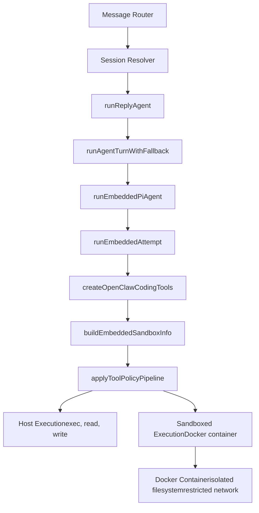
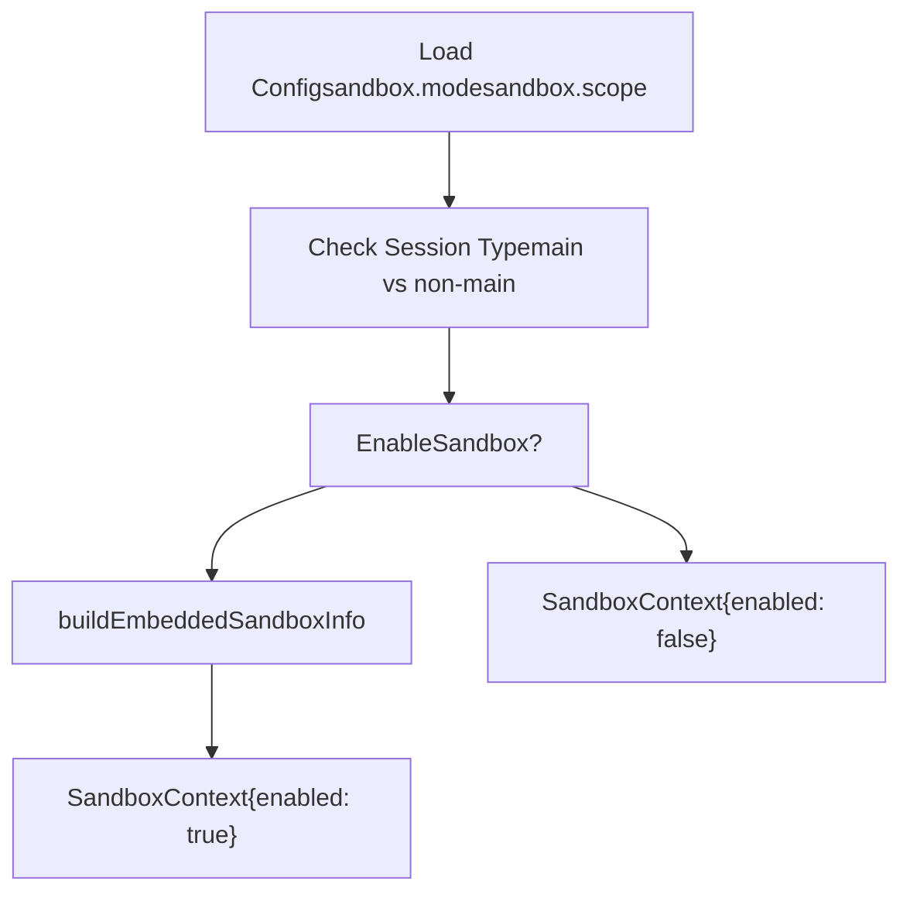
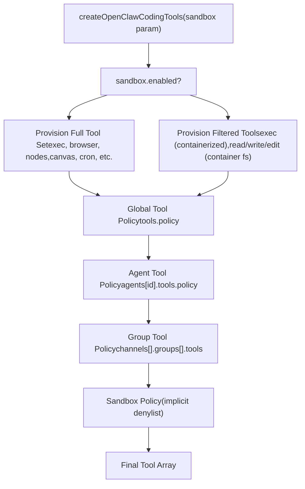
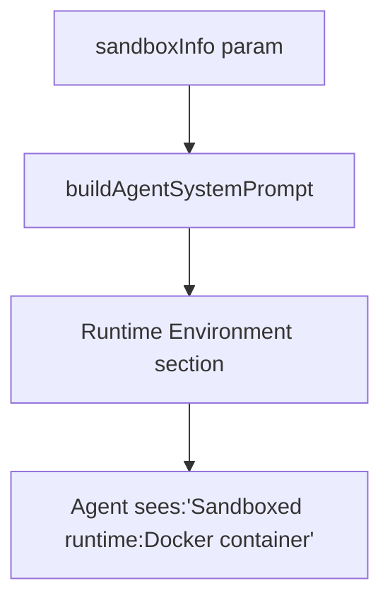

# Sandboxing

Relevant source files

-   [CHANGELOG.md](https://github.com/openclaw/openclaw/blob/8873e13f/CHANGELOG.md)
-   [README.md](https://github.com/openclaw/openclaw/blob/8873e13f/README.md)
-   [apps/android/app/build.gradle.kts](https://github.com/openclaw/openclaw/blob/8873e13f/apps/android/app/build.gradle.kts)
-   [apps/ios/Sources/Info.plist](https://github.com/openclaw/openclaw/blob/8873e13f/apps/ios/Sources/Info.plist)
-   [apps/ios/Tests/Info.plist](https://github.com/openclaw/openclaw/blob/8873e13f/apps/ios/Tests/Info.plist)
-   [apps/ios/project.yml](https://github.com/openclaw/openclaw/blob/8873e13f/apps/ios/project.yml)
-   [apps/macos/Sources/OpenClaw/Resources/Info.plist](https://github.com/openclaw/openclaw/blob/8873e13f/apps/macos/Sources/OpenClaw/Resources/Info.plist)
-   [assets/avatar-placeholder.svg](https://github.com/openclaw/openclaw/blob/8873e13f/assets/avatar-placeholder.svg)
-   [docs/cli/index.md](https://github.com/openclaw/openclaw/blob/8873e13f/docs/cli/index.md)
-   [docs/concepts/system-prompt.md](https://github.com/openclaw/openclaw/blob/8873e13f/docs/concepts/system-prompt.md)
-   [docs/gateway/background-process.md](https://github.com/openclaw/openclaw/blob/8873e13f/docs/gateway/background-process.md)
-   [docs/gateway/configuration.md](https://github.com/openclaw/openclaw/blob/8873e13f/docs/gateway/configuration.md)
-   [docs/gateway/index.md](https://github.com/openclaw/openclaw/blob/8873e13f/docs/gateway/index.md)
-   [docs/gateway/troubleshooting.md](https://github.com/openclaw/openclaw/blob/8873e13f/docs/gateway/troubleshooting.md)
-   [docs/index.md](https://github.com/openclaw/openclaw/blob/8873e13f/docs/index.md)
-   [docs/platforms/mac/release.md](https://github.com/openclaw/openclaw/blob/8873e13f/docs/platforms/mac/release.md)
-   [docs/start/getting-started.md](https://github.com/openclaw/openclaw/blob/8873e13f/docs/start/getting-started.md)
-   [docs/start/wizard.md](https://github.com/openclaw/openclaw/blob/8873e13f/docs/start/wizard.md)
-   [extensions/bluebubbles/src/send-helpers.ts](https://github.com/openclaw/openclaw/blob/8873e13f/extensions/bluebubbles/src/send-helpers.ts)
-   [package.json](https://github.com/openclaw/openclaw/blob/8873e13f/package.json)
-   [pnpm-lock.yaml](https://github.com/openclaw/openclaw/blob/8873e13f/pnpm-lock.yaml)
-   [scripts/clawtributors-map.json](https://github.com/openclaw/openclaw/blob/8873e13f/scripts/clawtributors-map.json)
-   [scripts/update-clawtributors.ts](https://github.com/openclaw/openclaw/blob/8873e13f/scripts/update-clawtributors.ts)
-   [scripts/update-clawtributors.types.ts](https://github.com/openclaw/openclaw/blob/8873e13f/scripts/update-clawtributors.types.ts)
-   [src/agents/bash-process-registry.test.ts](https://github.com/openclaw/openclaw/blob/8873e13f/src/agents/bash-process-registry.test.ts)
-   [src/agents/bash-process-registry.ts](https://github.com/openclaw/openclaw/blob/8873e13f/src/agents/bash-process-registry.ts)
-   [src/agents/bash-tools.ts](https://github.com/openclaw/openclaw/blob/8873e13f/src/agents/bash-tools.ts)
-   [src/agents/pi-embedded-helpers.ts](https://github.com/openclaw/openclaw/blob/8873e13f/src/agents/pi-embedded-helpers.ts)
-   [src/agents/pi-embedded-runner.ts](https://github.com/openclaw/openclaw/blob/8873e13f/src/agents/pi-embedded-runner.ts)
-   [src/agents/pi-embedded-subscribe.ts](https://github.com/openclaw/openclaw/blob/8873e13f/src/agents/pi-embedded-subscribe.ts)
-   [src/agents/pi-tools.ts](https://github.com/openclaw/openclaw/blob/8873e13f/src/agents/pi-tools.ts)
-   [src/agents/subagent-registry-cleanup.test.ts](https://github.com/openclaw/openclaw/blob/8873e13f/src/agents/subagent-registry-cleanup.test.ts)
-   [src/agents/system-prompt.test.ts](https://github.com/openclaw/openclaw/blob/8873e13f/src/agents/system-prompt.test.ts)
-   [src/agents/system-prompt.ts](https://github.com/openclaw/openclaw/blob/8873e13f/src/agents/system-prompt.ts)
-   [src/cli/program.ts](https://github.com/openclaw/openclaw/blob/8873e13f/src/cli/program.ts)
-   [src/config/config.ts](https://github.com/openclaw/openclaw/blob/8873e13f/src/config/config.ts)
-   [src/config/types.ts](https://github.com/openclaw/openclaw/blob/8873e13f/src/config/types.ts)
-   [src/config/zod-schema.ts](https://github.com/openclaw/openclaw/blob/8873e13f/src/config/zod-schema.ts)
-   [ui/package.json](https://github.com/openclaw/openclaw/blob/8873e13f/ui/package.json)

**Purpose**: OpenClaw provides Docker-based sandboxing for tool execution to isolate untrusted agent sessions from the host system. Sandboxing prevents arbitrary code execution on the host for group chat sessions, external hook triggers, or any scenario where you want to restrict agent access to host resources.

**Scope**: This page covers sandbox configuration, architecture, tool filtering, setup procedures, and security guarantees. For broader security policies including DM/group access control, see [Access Control Policies](/openclaw/openclaw/7.1-access-control-policies). For configuration reference, see the [Configuration Reference](https://github.com/openclaw/openclaw/blob/8873e13f/Configuration Reference)

---

## Sandbox Configuration

Sandboxing is controlled via `agents.defaults.sandbox` (or per-agent overrides). The sandbox system uses Docker containers to execute tools in isolated environments.

### Sandbox Modes

| Mode | Behavior |
| --- | --- |
| `off` (default) | All sessions run on the host. No isolation. |
| `non-main` | Group chats, hook-driven sessions, and non-DM sessions run in Docker. Main DM sessions run on host. |
| `all` | All agent sessions run in Docker, including main DM sessions. |

### Sandbox Scope

| Scope | Container Lifecycle |
| --- | --- |
| `session` | One container per session key. Container persists for session duration. |
| `agent` | One container per agent ID. All sessions for that agent share the container. |
| `shared` | Single shared container for all sandboxed sessions. |

### Configuration Example

```
{  agents: {    defaults: {      sandbox: {        mode: "non-main",        scope: "agent",      },    },  },}
```
**Sources**: [src/config/zod-schema.ts209-219](https://github.com/openclaw/openclaw/blob/8873e13f/src/config/zod-schema.ts#L209-L219) [docs/gateway/configuration.md206-225](https://github.com/openclaw/openclaw/blob/8873e13f/docs/gateway/configuration.md#L206-L225) [README.md333-338](https://github.com/openclaw/openclaw/blob/8873e13f/README.md#L333-L338)

---

## Sandbox Architecture

### High-Level Integration


**Sources**: [src/agents/pi-embedded-runner.ts1-29](https://github.com/openclaw/openclaw/blob/8873e13f/src/agents/pi-embedded-runner.ts#L1-L29) [src/agents/pi-tools.ts258-262](https://github.com/openclaw/openclaw/blob/8873e13f/src/agents/pi-tools.ts#L258-L262)

### Sandbox Context Resolution Flow


**Sources**: [src/agents/pi-embedded-runner.ts20](https://github.com/openclaw/openclaw/blob/8873e13f/src/agents/pi-embedded-runner.ts#L20-L20) [src/agents/pi-tools.ts260](https://github.com/openclaw/openclaw/blob/8873e13f/src/agents/pi-tools.ts#L260-L260)

---

## Tool Filtering and Policy

When sandboxing is enabled, tools are filtered through a hierarchical policy system that restricts access to host-only capabilities.

### Default Sandbox Tool Policy

**Allowed tools** (safe in containers):

-   `bash` / `exec` - Command execution inside container
-   `process` - Process management within container
-   `read` - File reads (container filesystem)
-   `write` - File writes (container filesystem)
-   `edit` - File edits (container filesystem)
-   `apply_patch` - Multi-file patches (container filesystem)
-   `sessions_list`, `sessions_history`, `sessions_send`, `sessions_spawn` - Session coordination tools

**Denied tools** (require host access):

-   `browser` - Requires host Chrome/CDP connection
-   `canvas` - Requires host window manager
-   `nodes` - Requires paired physical devices
-   `cron` - Requires host cron scheduler
-   `discord`, `slack`, `telegram` - Require host channel connections
-   `gateway` - Requires host Gateway RPC access

### Tool Provisioning Logic


**Sources**: [src/agents/pi-tools.ts258-311](https://github.com/openclaw/openclaw/blob/8873e13f/src/agents/pi-tools.ts#L258-L311) [src/agents/pi-tools.policy.ts1-28](https://github.com/openclaw/openclaw/blob/8873e13f/src/agents/pi-tools.policy.ts#L1-L28) [src/agents/tool-policy-pipeline.ts1-52](https://github.com/openclaw/openclaw/blob/8873e13f/src/agents/tool-policy-pipeline.ts#L1-L52)

### Tool Policy Resolution

Tool policy is evaluated in this order:

1.  **Global policy** (`tools.policy` or `tools.allowTools`/`denyTools`)
2.  **Agent policy** (`agents[id].tools.policy`)
3.  **Provider-specific policy** (`agents[id].models[provider].tools`)
4.  **Group policy** (`channels[].groups[].tools`)
5.  **Subagent policy** (depth-based restrictions)
6.  **Sandbox policy** (implicit deny for host-only tools)

Each layer can further restrict tools but cannot grant tools denied by an earlier layer.

**Sources**: [src/agents/pi-tools.ts261-310](https://github.com/openclaw/openclaw/blob/8873e13f/src/agents/pi-tools.ts#L261-L310) [src/agents/tool-policy.ts1-58](https://github.com/openclaw/openclaw/blob/8873e13f/src/agents/tool-policy.ts#L1-L58)

---

## Sandbox Setup and Operations

### Building the Sandbox Image

Before enabling sandboxing, you must build the Docker image:

```
scripts/sandbox-setup.sh
```
This script:

1.  Creates a Dockerfile with Node.js, Git, and common dev tools
2.  Builds the image tagged as `openclaw-sandbox`
3.  Verifies the image is ready

The image includes:

-   Node.js (matching your host version)
-   Git, curl, jq, and other common CLI tools
-   Workspace directory structure

### CLI Commands

```
# List active sandbox containersopenclaw sandbox list # Recreate sandbox container for a sessionopenclaw sandbox recreate --session agent:main:whatsapp:group:123 # Explain sandbox status for current configopenclaw sandbox explain
```
### Container Lifecycle

Containers are created on-demand when the first sandboxed tool is executed for a session. Container behavior depends on `sandbox.scope`:

-   **`session` scope**: Container is destroyed when the session is reset or deleted
-   **`agent` scope**: Container persists across session resets, destroyed only when agent is removed
-   **`shared` scope**: Single container persists indefinitely (manual cleanup required)

**Sources**: [docs/cli/index.md42-43](https://github.com/openclaw/openclaw/blob/8873e13f/docs/cli/index.md#L42-L43) [README.md333-338](https://github.com/openclaw/openclaw/blob/8873e13f/README.md#L333-L338)

---

## Security Model and Guarantees

### What Sandboxing Protects

✅ **File system isolation**: Tools cannot access host files outside the container ✅ **Process isolation**: Agent code runs in a separate process namespace ✅ **Network isolation**: Docker networking rules can restrict outbound connections ✅ **Resource limits**: Docker can enforce CPU/memory limits per container

### What Sandboxing Does Not Protect

❌ **Network exfiltration**: By default, containers have network access (can call external APIs) ❌ **Model prompt injection**: Sandboxing does not prevent prompt injection attacks ❌ **Gateway RPC abuse**: Sandboxed sessions can still call Gateway RPC methods (if `gateway` tool is enabled) ❌ **Side-channel attacks**: Container escape exploits or kernel vulnerabilities

### Recommended Security Posture

For untrusted input scenarios (groups, webhooks, public bots):

1.  **Enable sandboxing**: Set `sandbox.mode: "non-main"` or `"all"`
2.  **Restrict tools**: Use explicit tool allowlists, deny `gateway` tool
3.  **Network isolation**: Configure Docker network policies to block egress
4.  **Monitor sessions**: Review `openclaw sessions` output for suspicious activity
5.  **Use strong models**: Stronger models are more resistant to prompt injection

**Sources**: [README.md333-338](https://github.com/openclaw/openclaw/blob/8873e13f/README.md#L333-L338) [docs/gateway/configuration.md206-225](https://github.com/openclaw/openclaw/blob/8873e13f/docs/gateway/configuration.md#L206-L225)

---

## Sandbox Information in System Prompt

When a session runs in a sandbox, the system prompt includes sandbox metadata so the agent knows it's running in a restricted environment:


This allows the agent to adjust behavior (e.g., not attempt browser or node tool use).

**Sources**: [src/agents/system-prompt.ts229](https://github.com/openclaw/openclaw/blob/8873e13f/src/agents/system-prompt.ts#L229-L229) [src/agents/system-prompt.ts238](https://github.com/openclaw/openclaw/blob/8873e13f/src/agents/system-prompt.ts#L238-L238)

---

## Summary

OpenClaw's sandboxing system provides Docker-based isolation for tool execution, protecting the host from untrusted agent code in group chats, webhooks, and other scenarios. Sandboxing is configured via `agents.defaults.sandbox.mode` (`off`/`non-main`/`all`) and `scope` (`session`/`agent`/`shared`), with tool filtering applied automatically to deny host-only capabilities like browser control and device access. Setup requires building the `openclaw-sandbox` Docker image via `scripts/sandbox-setup.sh`, and sandboxed sessions are managed through the `openclaw sandbox` CLI commands. While sandboxing provides strong file system and process isolation, it does not prevent network exfiltration or prompt injection attacks, so additional tool restrictions and network policies are recommended for untrusted input scenarios.
