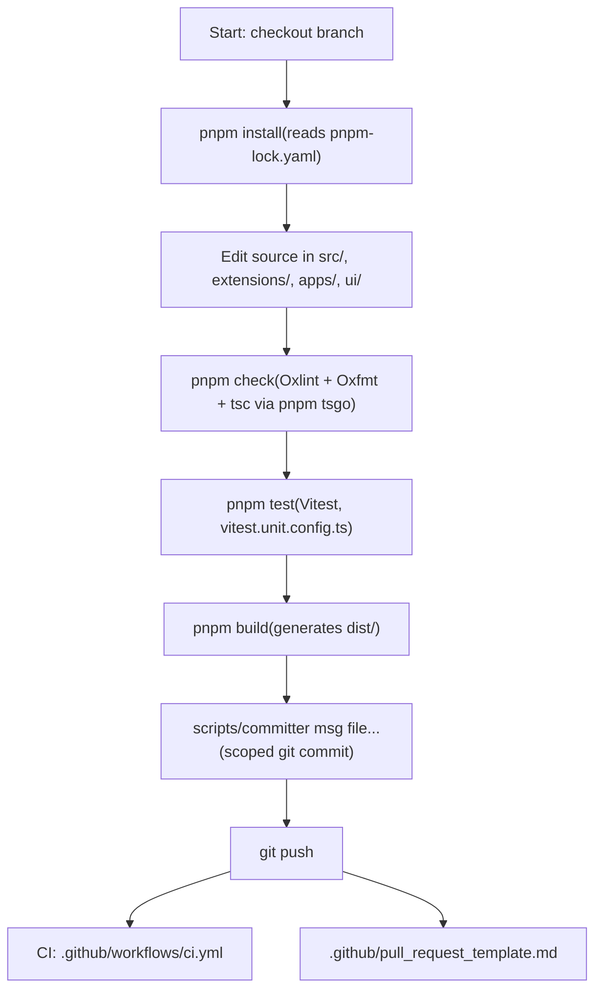

# Development Guide

Relevant source files

-   [.github/actionlint.yaml](https://github.com/openclaw/openclaw/blob/8873e13f/.github/actionlint.yaml)
-   [.github/actions/setup-node-env/action.yml](https://github.com/openclaw/openclaw/blob/8873e13f/.github/actions/setup-node-env/action.yml)
-   [.github/actions/setup-pnpm-store-cache/action.yml](https://github.com/openclaw/openclaw/blob/8873e13f/.github/actions/setup-pnpm-store-cache/action.yml)
-   [.github/workflows/ci.yml](https://github.com/openclaw/openclaw/blob/8873e13f/.github/workflows/ci.yml)
-   [.shellcheckrc](https://github.com/openclaw/openclaw/blob/8873e13f/.shellcheckrc)
-   [CHANGELOG.md](https://github.com/openclaw/openclaw/blob/8873e13f/CHANGELOG.md)
-   [README.md](https://github.com/openclaw/openclaw/blob/8873e13f/README.md)
-   [apps/android/app/build.gradle.kts](https://github.com/openclaw/openclaw/blob/8873e13f/apps/android/app/build.gradle.kts)
-   [apps/ios/Sources/Info.plist](https://github.com/openclaw/openclaw/blob/8873e13f/apps/ios/Sources/Info.plist)
-   [apps/ios/Tests/Info.plist](https://github.com/openclaw/openclaw/blob/8873e13f/apps/ios/Tests/Info.plist)
-   [apps/ios/project.yml](https://github.com/openclaw/openclaw/blob/8873e13f/apps/ios/project.yml)
-   [apps/macos/Sources/OpenClaw/Resources/Info.plist](https://github.com/openclaw/openclaw/blob/8873e13f/apps/macos/Sources/OpenClaw/Resources/Info.plist)
-   [assets/avatar-placeholder.svg](https://github.com/openclaw/openclaw/blob/8873e13f/assets/avatar-placeholder.svg)
-   [docs/channels/irc.md](https://github.com/openclaw/openclaw/blob/8873e13f/docs/channels/irc.md)
-   [docs/ci.md](https://github.com/openclaw/openclaw/blob/8873e13f/docs/ci.md)
-   [docs/cli/index.md](https://github.com/openclaw/openclaw/blob/8873e13f/docs/cli/index.md)
-   [docs/gateway/configuration.md](https://github.com/openclaw/openclaw/blob/8873e13f/docs/gateway/configuration.md)
-   [docs/gateway/index.md](https://github.com/openclaw/openclaw/blob/8873e13f/docs/gateway/index.md)
-   [docs/gateway/troubleshooting.md](https://github.com/openclaw/openclaw/blob/8873e13f/docs/gateway/troubleshooting.md)
-   [docs/index.md](https://github.com/openclaw/openclaw/blob/8873e13f/docs/index.md)
-   [docs/platforms/mac/release.md](https://github.com/openclaw/openclaw/blob/8873e13f/docs/platforms/mac/release.md)
-   [docs/start/getting-started.md](https://github.com/openclaw/openclaw/blob/8873e13f/docs/start/getting-started.md)
-   [docs/start/wizard.md](https://github.com/openclaw/openclaw/blob/8873e13f/docs/start/wizard.md)
-   [docs/tools/creating-skills.md](https://github.com/openclaw/openclaw/blob/8873e13f/docs/tools/creating-skills.md)
-   [extensions/bluebubbles/src/send-helpers.ts](https://github.com/openclaw/openclaw/blob/8873e13f/extensions/bluebubbles/src/send-helpers.ts)
-   [package.json](https://github.com/openclaw/openclaw/blob/8873e13f/package.json)
-   [pnpm-lock.yaml](https://github.com/openclaw/openclaw/blob/8873e13f/pnpm-lock.yaml)
-   [scripts/check-composite-action-input-interpolation.py](https://github.com/openclaw/openclaw/blob/8873e13f/scripts/check-composite-action-input-interpolation.py)
-   [scripts/ci-changed-scope.mjs](https://github.com/openclaw/openclaw/blob/8873e13f/scripts/ci-changed-scope.mjs)
-   [scripts/clawtributors-map.json](https://github.com/openclaw/openclaw/blob/8873e13f/scripts/clawtributors-map.json)
-   [scripts/update-clawtributors.ts](https://github.com/openclaw/openclaw/blob/8873e13f/scripts/update-clawtributors.ts)
-   [scripts/update-clawtributors.types.ts](https://github.com/openclaw/openclaw/blob/8873e13f/scripts/update-clawtributors.types.ts)
-   [src/agents/subagent-registry-cleanup.test.ts](https://github.com/openclaw/openclaw/blob/8873e13f/src/agents/subagent-registry-cleanup.test.ts)
-   [src/cli/program.ts](https://github.com/openclaw/openclaw/blob/8873e13f/src/cli/program.ts)
-   [src/config/config.ts](https://github.com/openclaw/openclaw/blob/8873e13f/src/config/config.ts)
-   [src/config/types.ts](https://github.com/openclaw/openclaw/blob/8873e13f/src/config/types.ts)
-   [src/config/zod-schema.ts](https://github.com/openclaw/openclaw/blob/8873e13f/src/config/zod-schema.ts)
-   [src/infra/outbound/abort.ts](https://github.com/openclaw/openclaw/blob/8873e13f/src/infra/outbound/abort.ts)
-   [src/plugins/source-display.test.ts](https://github.com/openclaw/openclaw/blob/8873e13f/src/plugins/source-display.test.ts)
-   [src/plugins/source-display.ts](https://github.com/openclaw/openclaw/blob/8873e13f/src/plugins/source-display.ts)
-   [src/scripts/ci-changed-scope.test.ts](https://github.com/openclaw/openclaw/blob/8873e13f/src/scripts/ci-changed-scope.test.ts)
-   [ui/package.json](https://github.com/openclaw/openclaw/blob/8873e13f/ui/package.json)

This page covers the contributor and maintainer workflow for the OpenClaw monorepo: repository structure, toolchain setup, coding conventions, testing, commit and PR conventions, and local development commands. For CI/CD pipeline details see page [8.1](/openclaw/openclaw/8.1-cicd-pipeline). For release steps see page [8.2](/openclaw/openclaw/8.2-release-process).

---

## Repository Structure

OpenClaw uses **pnpm workspaces** to organize a TypeScript-first monorepo. The table below maps the top-level directories to their roles.

| Directory | Role |
| --- | --- |
| `src/` | Core Gateway, CLI, agents, channels, infra |
| `src/cli/` | CLI command wiring |
| `src/commands/` | Individual CLI commands |
| `src/gateway/` | GatewayServer, protocol, server methods |
| `src/agents/` | Agent runtime, tools, sandbox |
| `src/telegram/`, `src/discord/`, `src/slack/`, etc. | Built-in channel integrations |
| `src/infra/` | Shared infrastructure utilities |
| `src/media/` | Media pipeline |
| `extensions/` | Extension/plugin workspace packages |
| `apps/ios/` | iOS Clawdis app (Swift) |
| `apps/macos/` | macOS Clawdis app (Swift) |
| `apps/android/` | Android Clawdis app (Kotlin/Gradle) |
| `apps/shared/` | Shared native code (Swift packages) |
| `ui/` | Control UI (LitElement SPA) |
| `packages/` | Shared TypeScript packages |
| `skills/` | Python skill scripts |
| `scripts/` | Build, release, and utility scripts |
| `docs/` | Mintlify documentation source |
| `dist/` | Built output (generated, not committed) |
| `.github/` | CI workflows, actions, issue/PR templates |

The repository structure, as described in `AGENTS.md`, keeps plugin-only dependencies in the extension's own `package.json`. Core `package.json` dependencies should only include things the core uses directly.

**Monorepo structure diagram:**

```mermaid
flowchart TD
    root["openclaw (repo root)"]
    src["src/(TypeScript core)"]
    extensions["extensions/(workspace plugin packages)"]
    apps["apps/(native clients)"]
    ui["ui/(Control UI SPA)"]
    packages["packages/(shared TS packages)"]
    skills["skills/(Python skill scripts)"]
    scripts["scripts/(build & release scripts)"]
    docs["docs/(Mintlify docs source)"]
    dist["dist/(build output, generated)"]
    src_cli["src/cli/(CLI wiring)"]
    src_commands["src/commands/(CLI commands)"]
    src_gateway["src/gateway/(GatewayServer, protocol)"]
    src_agents["src/agents/(agent runtime, tools)"]
    src_channels["src/telegram/, src/discord/, ...(built-in channels)"]
    src_infra["src/infra/(shared utilities)"]
    apps_ios["apps/ios/(Clawdis iOS)"]
    apps_macos["apps/macos/(Clawdis macOS)"]
    apps_android["apps/android/(Clawdis Android)"]
    apps_shared["apps/shared/(shared native)"]

    root --> src
    root --> extensions
    root --> apps
    root --> ui
    root --> packages
    root --> skills
    root --> scripts
    root --> docs
    root --> dist
    src --> src_cli
    src --> src_commands
    src --> src_gateway
    src --> src_agents
    src --> src_channels
    src --> src_infra
    apps --> apps_ios
    apps --> apps_macos
    apps --> apps_android
    apps --> apps_shared
```


Sources: [AGENTS.md10-22](https://github.com/openclaw/openclaw/blob/8873e13f/AGENTS.md#L10-L22)

---

## Toolchain & Prerequisites

| Tool | Minimum Version | Notes |
| --- | --- | --- |
| Node.js | 22+ | Required runtime baseline |
| pnpm | 10.23.0 | Primary package manager; use lockfile |
| Bun | 1.3.9+ | Preferred for TypeScript execution and tests |
| Python | 3.12 | Used for skill scripts (`skills/`) and CI tooling |

Both Node and Bun paths must stay functional. `pnpm-lock.yaml` and Bun patching must be kept in sync when touching deps.

Sources: [AGENTS.md57-64](https://github.com/openclaw/openclaw/blob/8873e13f/AGENTS.md#L57-L64)

---

## Local Development Commands

These are the primary commands used during development. All commands run from the repo root.

| Command | Purpose |
| --- | --- |
| `pnpm install` | Install all dependencies (uses lockfile) |
| `pnpm openclaw ...` | Run CLI in dev mode (via Bun) |
| `pnpm dev` | Alias for dev CLI run |
| `pnpm build` | Type-check and build `dist/` |
| `pnpm tsgo` | TypeScript checks only |
| `pnpm check` | Types + lint + format (Oxlint + Oxfmt) |
| `pnpm format` | Check formatting only (oxfmt --check) |
| `pnpm format:fix` | Fix formatting in place (oxfmt --write) |
| `pnpm test` | Run all tests (Vitest) |
| `pnpm test:coverage` | Tests with V8 coverage report |
| `pnpm release:check` | Validate npm pack contents |
| `prek install` | Install pre-commit hooks (same checks as CI) |

The `pnpm check` command must pass before commits. It runs the same type/lint/format checks as the CI `check` job.

**Key dev scripts:**

-   Mac packaging: `scripts/package-mac-app.sh` (defaults to current arch)
-   Commit helper: `scripts/committer "<msg>" <file...>` (scopes staging correctly)
-   Release validation: `node --import tsx scripts/release-check.ts`

Sources: [AGENTS.md55-71](https://github.com/openclaw/openclaw/blob/8873e13f/AGENTS.md#L55-L71) [docs/reference/RELEASING.md44-56](https://github.com/openclaw/openclaw/blob/8873e13f/docs/reference/RELEASING.md#L44-L56)

---

## Coding Conventions

### Language & Tooling

-   **TypeScript (ESM)** throughout. Strict typing; avoid `any`.
-   Formatting and linting via **Oxlint** and **Oxfmt**. Run `pnpm check` before commits.
-   Never add `@ts-nocheck`. Never disable `no-explicit-any`. Fix root causes.

### Class & Composition Rules

-   Do **not** share behavior via prototype mutation (`applyPrototypeMixins`, `Object.defineProperty` on `.prototype`). Use explicit inheritance or helper composition so TypeScript can typecheck.
-   In tests, prefer per-instance stubs over `SomeClass.prototype.method = ...` unless prototype-level patching is explicitly documented.

### File Size & Structure

-   Aim to keep files under ~700 LOC (guideline, not a hard limit). Split or refactor when it improves clarity or testability.
-   Extract helpers rather than creating "V2" copies of files.
-   Use existing patterns for CLI options and dependency injection via `createDefaultDeps`.

### Naming Conventions

-   **OpenClaw** (capitalized) for product/app/docs headings.
-   `openclaw` (lowercase) for the CLI command, package/binary, paths, and config keys.

### Comments

Add brief comments for tricky or non-obvious logic. Keep comments focused on the *why*, not the *what*.

### UI and Progress Output

-   CLI progress: use `src/cli/progress.ts` (`osc-progress` + `@clack/prompts` spinner). Do not hand-roll spinners or bars.
-   Status output: use `src/terminal/table.ts` for tables with ANSI-safe wrapping.
-   Color palette: use `src/terminal/palette.ts` (no hardcoded colors).

### Plugin/Extension Dependencies

-   Keep plugin-only deps in the extension `package.json`. Do not add them to root `package.json` unless core uses them.
-   `workspace:*` in `dependencies` breaks `npm install`. Use `devDependencies` or `peerDependencies` instead. The runtime resolves `openclaw/plugin-sdk` via a jiti alias.
-   Plugin runtime deps must be in `dependencies`, not `devDependencies`.

Sources: [AGENTS.md73-84](https://github.com/openclaw/openclaw/blob/8873e13f/AGENTS.md#L73-L84) [AGENTS.md14-18](https://github.com/openclaw/openclaw/blob/8873e13f/AGENTS.md#L14-L18)

---

## Testing Guidelines

### Framework

-   **Vitest** with V8 coverage thresholds: 70% lines, branches, functions, and statements.
-   Test files are colocated with source: `*.test.ts` next to the source file.
-   End-to-end tests: `*.e2e.test.ts`.

### Running Tests

```
# Standard test runpnpm test # With coveragepnpm test:coverage # Low-memory profile (for constrained hosts)OPENCLAW_TEST_PROFILE=low OPENCLAW_TEST_SERIAL_GATEWAY=1 pnpm test # Unit tests only via Bunbunx vitest run --config vitest.unit.config.ts # Live tests (requires real API keys)CLAWDBOT_LIVE_TEST=1 pnpm test:liveLIVE=1 pnpm test:live  # includes provider live tests # Docker-based live testspnpm test:docker:live-modelspnpm test:docker:live-gateway # Onboarding E2Epnpm test:docker:onboard
```
Do not set test workers above 16. The CI sets `OPENCLAW_TEST_WORKERS=2` on Linux runners to prevent V8 OOM.

### Changelog and Test Additions

Pure test additions or fixes generally do **not** need a changelog entry unless they alter user-facing behavior or the operator asks for one.

Sources: [AGENTS.md94-104](https://github.com/openclaw/openclaw/blob/8873e13f/AGENTS.md#L94-L104) [.github/workflows/ci.yml186-241](https://github.com/openclaw/openclaw/blob/8873e13f/.github/workflows/ci.yml#L186-L241)

---

## Commit & Pull Request Guidelines

### Committing

Use `scripts/committer "<msg>" <file...>` to create commits. This keeps staging scoped to the intended files and avoids accidental inclusion of unrelated changes.

Do not use manual `git add` / `git commit` outside the helper.

### Commit Message Format

-   Concise, action-oriented: `CLI: add verbose flag to send`
-   Group related changes; do not bundle unrelated refactors.
-   Prefix with the subsystem affected: `CLI:`, `Gateway:`, `Telegram:`, `Android:`, etc.

### Pull Requests

The canonical PR template is at `.github/pull_request_template.md`. The full maintainer PR workflow (triage order, quality bar, rebase rules, changelog conventions) is at `.agents/skills/PR_WORKFLOW.md`.

For PR submission, follow the `review-pr` → `prepare-pr` → `merge-pr` pipeline described in that skill.

**PR size labels** are applied automatically based on changed line count (excluding lockfiles and docs):

| Lines changed | Label |
| --- | --- |
| < 50 | `size: XS` |
| 50–199 | `size: S` |
| 200–499 | `size: M` |
| 500–999 | `size: L` |
| 1000+ | `size: XL` |

Contributor labels are also applied automatically: `trusted-contributor` (≥4 merged PRs), `experienced-contributor` (≥10 merged PRs), `maintainer` (team member).

Sources: [AGENTS.md106-114](https://github.com/openclaw/openclaw/blob/8873e13f/AGENTS.md#L106-L114) [.github/workflows/labeler.yml39-127](https://github.com/openclaw/openclaw/blob/8873e13f/.github/workflows/labeler.yml#L39-L127)

---

## Multi-Agent Safety Rules

When multiple agents work the same repository simultaneously:

-   Do **not** create, apply, or drop `git stash` entries unless explicitly requested (this includes `git pull --rebase --autostash`).
-   Do **not** create, remove, or modify `git worktree` checkouts.
-   Do **not** switch branches unless explicitly requested.
-   When told "push", you may `git pull --rebase` to integrate latest changes; never discard other agents' work.
-   When told "commit", scope to your changes only. When told "commit all", commit in grouped chunks.
-   Running multiple agents is fine as long as each has its own session.

Sources: [AGENTS.md187-198](https://github.com/openclaw/openclaw/blob/8873e13f/AGENTS.md#L187-L198)

---

## Adding Channels or Extensions

When adding a new channel, extension, or app:

1.  Add it to `.github/labeler.yml` with a matching glob pattern.
2.  Create the matching GitHub label (match the color of existing channel/extension labels).
3.  Use `scripts/sync-labels.ts` to create missing labels from `labeler.yml`.
4.  Update all UI surfaces and docs that enumerate providers (macOS app, web UI, mobile if applicable, onboarding docs).
5.  Add matching status and configuration forms so provider lists stay in sync.

**Channel label color assignments** (from `scripts/sync-labels.ts`):

| Prefix | Color |
| --- | --- |
| `channel:` | `1d76db` |
| `app:` | `6f42c1` |
| `extensions:` | `0e8a16` |
| `docs:` | `0075ca` |
| `cli:` | `f9d0c4` |
| `gateway:` | `d4c5f9` |
| `size:` | `fbca04` |

Sources: [AGENTS.md22](https://github.com/openclaw/openclaw/blob/8873e13f/AGENTS.md#L22-L22) [.github/labeler.yml1-20](https://github.com/openclaw/openclaw/blob/8873e13f/.github/labeler.yml#L1-L20) [scripts/sync-labels.ts10-18](https://github.com/openclaw/openclaw/blob/8873e13f/scripts/sync-labels.ts#L10-L18)

---

## Version Locations

When bumping a version, update **all** of the following locations (never update `appcast.xml` unless cutting a new macOS Sparkle release):

| File | Field |
| --- | --- |
| `package.json` | `version` |
| `apps/android/app/build.gradle.kts` | `versionName`, `versionCode` |
| `apps/ios/Sources/Info.plist` | `CFBundleShortVersionString`, `CFBundleVersion` |
| `apps/ios/Tests/Info.plist` | `CFBundleShortVersionString`, `CFBundleVersion` |
| `apps/macos/Sources/OpenClaw/Resources/Info.plist` | `CFBundleShortVersionString`, `CFBundleVersion` |
| `docs/install/updating.md` | Pinned npm version |

Sources: [AGENTS.md179-180](https://github.com/openclaw/openclaw/blob/8873e13f/AGENTS.md#L179-L180)

---

## Release Channels

| Channel | Tag Format | npm dist-tag | Notes |
| --- | --- | --- | --- |
| `stable` | `vYYYY.M.D` | `latest` | Tagged releases only |
| `beta` | `vYYYY.M.D-beta.N` | `beta` | May ship without macOS app |
| `dev` | (none) | — | Moving HEAD on `main` |

For beta releases: publish npm with a matching beta version suffix (e.g., `YYYY.M.D-beta.N`), not just `--tag beta` with a plain version number.

Sources: [AGENTS.md87-91](https://github.com/openclaw/openclaw/blob/8873e13f/AGENTS.md#L87-L91)

---

## Development Workflow Diagram

This diagram maps the standard contributor workflow to the concrete commands and files involved.


Sources: [AGENTS.md55-115](https://github.com/openclaw/openclaw/blob/8873e13f/AGENTS.md#L55-L115) [.github/workflows/ci.yml1-30](https://github.com/openclaw/openclaw/blob/8873e13f/.github/workflows/ci.yml#L1-L30)

---

## Code Entity Map

This diagram maps the major development toolchain touchpoints to the concrete files and scripts that implement them.

```mermaid
flowchart TD
    progress_ts["src/cli/progress.ts(osc-progress + @clack/prompts)"]
    table_ts["src/terminal/table.ts(ANSI-safe tables)"]
    palette_ts["src/terminal/palette.ts(shared color palette)"]
    committer["scripts/committer(scoped git commit)"]
    release_check["scripts/release-check.ts(pnpm release:check)"]
    prek["prek install(pre-commit hooks)"]
    pnpm_build["pnpm build"]
    tsdown_config["tsdown.config.ts"]
    dist["dist/(built output)"]
    pnpm_test["pnpm test"]
    test_parallel["scripts/test-parallel.mjs"]
    vitest_config["vitest*.ts(vitest configs)"]
    pnpm_check["pnpm check"]
    oxlint[".oxlintrc.json(Oxlint rules)"]
    oxfmt[".oxfmtrc.jsonc(Oxfmt rules)"]
    tsgo["pnpm tsgo(TypeScript checks)"]
    tsconfig["tsconfig*.json"]
    pnpm_openclaw["pnpm openclaw(dev CLI via Bun)"]
    openclaw_mjs["openclaw.mjs(CLI entrypoint)"]
    pnpm_dev["pnpm dev"]

    pnpm --> build_tsdown_config
    tsdown --> config_dist
    pnpm --> test_test_parallel
    test --> parallel_vitest_config
    pnpm --> check_oxlint
    pnpm --> check_oxfmt
    pnpm --> check_tsgo
    tsgo --> tsconfig
    pnpm --> openclaw_openclaw_mjs
    pnpm --> dev_openclaw_mjs
```


Sources: [AGENTS.md55-84](https://github.com/openclaw/openclaw/blob/8873e13f/AGENTS.md#L55-L84) [AGENTS.md172-173](https://github.com/openclaw/openclaw/blob/8873e13f/AGENTS.md#L172-L173) [.github/workflows/ci.yml127-150](https://github.com/openclaw/openclaw/blob/8873e13f/.github/workflows/ci.yml#L127-L150)

---

## Shorthand Commands

| Shorthand | Behavior |
| --- | --- |
| `sync` | If working tree dirty, commit all changes with a Conventional Commit message, then `git pull --rebase`. If rebase conflicts cannot be resolved, stop. Otherwise `git push`. |

### Git Notes

-   If `git branch -d/-D <branch>` is policy-blocked, delete the local ref directly:
    `git update-ref -d refs/heads/<branch>`
-   Bulk PR close/reopen safety: if a close action would affect more than 5 PRs, ask for explicit confirmation with the exact count and target scope before proceeding.

Sources: [AGENTS.md117-123](https://github.com/openclaw/openclaw/blob/8873e13f/AGENTS.md#L117-L123)

---

## Documentation Guidelines

Docs live in `docs/` and are hosted on Mintlify at `docs.openclaw.ai`.

-   Internal doc links: root-relative, no `.md`/`.mdx` extension. Example: `<FileRef file-url="https://github.com/openclaw/openclaw/blob/8873e13f/Config" undefined file-path="Config">Hii</FileRef>`
-   Anchors: root-relative path with anchor. Example: `<FileRef file-url="https://github.com/openclaw/openclaw/blob/8873e13f/Hooks" undefined file-path="Hooks">Hii</FileRef>`
-   Avoid em dashes (`—`) and apostrophes in headings — they break Mintlify anchor links.
-   README (GitHub): use absolute `https://docs.openclaw.ai/...` URLs so links work on GitHub.
-   Content must be generic: no personal device names, hostnames, or paths. Use placeholders like `user@gateway-host`.
-   `docs/zh-CN/**` is auto-generated. Do not edit unless explicitly asked.

Sources: [AGENTS.md24-43](https://github.com/openclaw/openclaw/blob/8873e13f/AGENTS.md#L24-L43)

---

## Secret Scanning & Security

-   Secrets are scanned on every CI run using `detect-secrets` against `.secrets.baseline`.
-   Private keys are detected by `pre-commit run --all-files detect-private-key`.
-   Changed GitHub workflows are audited with `zizmor`.
-   Production dependencies are audited with `pnpm-audit-prod`.
-   Never commit real phone numbers, videos, or live config values. Use obviously fake placeholders in docs, tests, and examples.

For the full security model and audit tooling, see page [7](/openclaw/openclaw/7-security) and page [7.1](/openclaw/openclaw/7.1-access-control-policies).

Sources: [.github/workflows/ci.yml349-401](https://github.com/openclaw/openclaw/blob/8873e13f/.github/workflows/ci.yml#L349-L401) [AGENTS.md134-140](https://github.com/openclaw/openclaw/blob/8873e13f/AGENTS.md#L134-L140)
