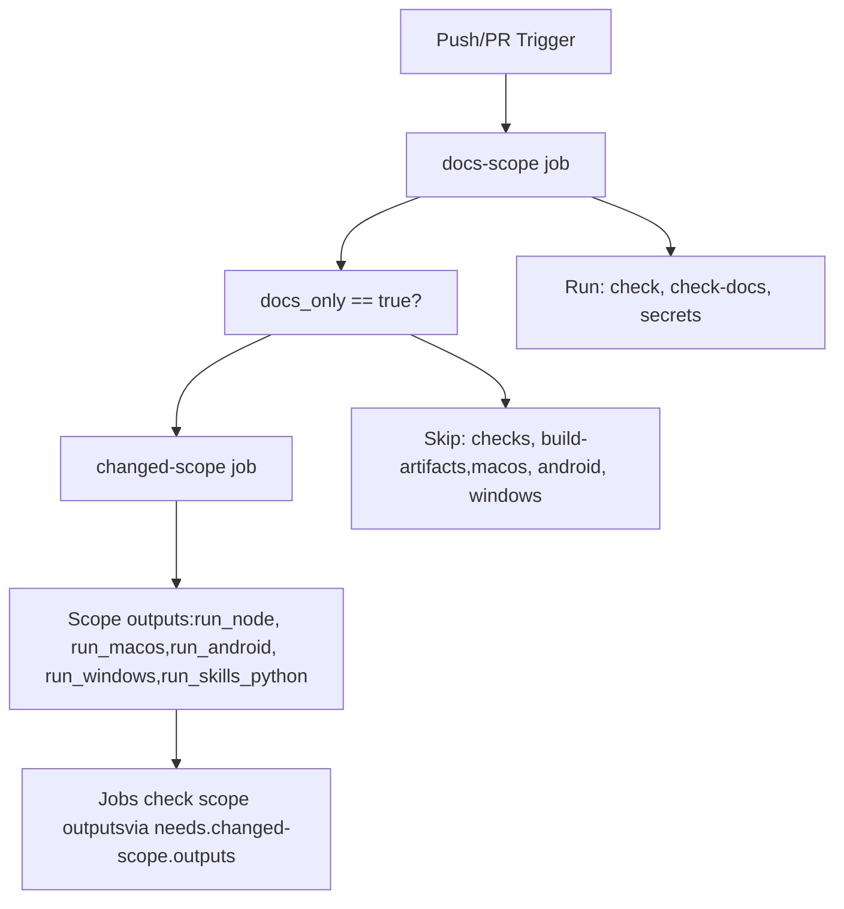
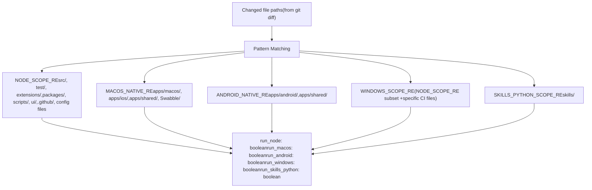
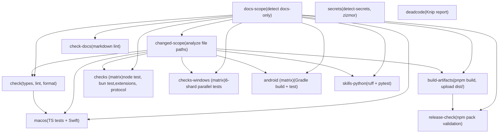
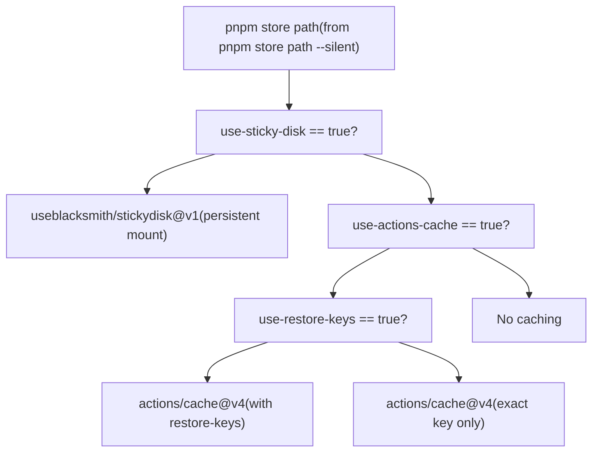

# CI/CD Pipeline

Relevant source files

-   [.github/actionlint.yaml](https://github.com/openclaw/openclaw/blob/8873e13f/.github/actionlint.yaml)
-   [.github/actions/setup-node-env/action.yml](https://github.com/openclaw/openclaw/blob/8873e13f/.github/actions/setup-node-env/action.yml)
-   [.github/actions/setup-pnpm-store-cache/action.yml](https://github.com/openclaw/openclaw/blob/8873e13f/.github/actions/setup-pnpm-store-cache/action.yml)
-   [.github/workflows/ci.yml](https://github.com/openclaw/openclaw/blob/8873e13f/.github/workflows/ci.yml)
-   [.shellcheckrc](https://github.com/openclaw/openclaw/blob/8873e13f/.shellcheckrc)
-   [docs/channels/irc.md](https://github.com/openclaw/openclaw/blob/8873e13f/docs/channels/irc.md)
-   [docs/ci.md](https://github.com/openclaw/openclaw/blob/8873e13f/docs/ci.md)
-   [docs/tools/creating-skills.md](https://github.com/openclaw/openclaw/blob/8873e13f/docs/tools/creating-skills.md)
-   [scripts/check-composite-action-input-interpolation.py](https://github.com/openclaw/openclaw/blob/8873e13f/scripts/check-composite-action-input-interpolation.py)
-   [scripts/ci-changed-scope.mjs](https://github.com/openclaw/openclaw/blob/8873e13f/scripts/ci-changed-scope.mjs)
-   [src/infra/outbound/abort.ts](https://github.com/openclaw/openclaw/blob/8873e13f/src/infra/outbound/abort.ts)
-   [src/plugins/source-display.test.ts](https://github.com/openclaw/openclaw/blob/8873e13f/src/plugins/source-display.test.ts)
-   [src/plugins/source-display.ts](https://github.com/openclaw/openclaw/blob/8873e13f/src/plugins/source-display.ts)
-   [src/scripts/ci-changed-scope.test.ts](https://github.com/openclaw/openclaw/blob/8873e13f/src/scripts/ci-changed-scope.test.ts)

## Purpose and Scope

This document describes the OpenClaw continuous integration and deployment infrastructure, including the GitHub Actions workflow orchestration, intelligent scope detection that optimizes job execution, platform-specific test strategies, and caching mechanisms. For information about the release process itself (versioning, changelogs, distribution), see [Release Process](/openclaw/openclaw/8.2-release-process).

**Sources:** [.github/workflows/ci.yml1-776](https://github.com/openclaw/openclaw/blob/8873e13f/.github/workflows/ci.yml#L1-L776) [docs/ci.md1-57](https://github.com/openclaw/openclaw/blob/8873e13f/docs/ci.md#L1-L57)

## Overview

The OpenClaw CI pipeline executes on every push to `main` and every pull request. The workflow uses a two-phase scope detection system to skip expensive jobs when only documentation or platform-specific code has changed. This optimization reduces CI time for most PRs while maintaining full coverage for `main` branch pushes.

The pipeline is defined in `.github/workflows/ci.yml` and consists of:

-   Early scope detection gates (`docs-scope`, `changed-scope`)
-   Static analysis jobs (`check`, `check-docs`, `deadcode`, `secrets`)
-   Platform-specific test suites (`checks`, `checks-windows`, `macos`, `android`)
-   Build and release validation (`build-artifacts`, `release-check`)
-   Python skill validation (`skills-python`)

**Sources:** [.github/workflows/ci.yml1-12](https://github.com/openclaw/openclaw/blob/8873e13f/.github/workflows/ci.yml#L1-L12) [.github/workflows/ci.yml139-776](https://github.com/openclaw/openclaw/blob/8873e13f/.github/workflows/ci.yml#L139-L776)

## Scope Detection System

### Two-Phase Detection

The CI uses a two-stage detection system to determine which jobs should run:


**Phase 1: docs-scope**

The `docs-scope` job ([.github/workflows/ci.yml15-36](https://github.com/openclaw/openclaw/blob/8873e13f/.github/workflows/ci.yml#L15-L36)) runs first and detects if all changes are documentation-only using the `detect-docs-changes` action. It outputs `docs_only` and `docs_changed` flags that downstream jobs reference.

**Phase 2: changed-scope**

If not docs-only, the `changed-scope` job ([.github/workflows/ci.yml41-77](https://github.com/openclaw/openclaw/blob/8873e13f/.github/workflows/ci.yml#L41-L77)) analyzes the git diff to determine which platform-specific jobs should run. It invokes `scripts/ci-changed-scope.mjs` with the base and head commits.

**Sources:** [.github/workflows/ci.yml15-77](https://github.com/openclaw/openclaw/blob/8873e13f/.github/workflows/ci.yml#L15-L77) [scripts/ci-changed-scope.mjs1-167](https://github.com/openclaw/openclaw/blob/8873e13f/scripts/ci-changed-scope.mjs#L1-L167)

### Scope Detection Logic

The `detectChangedScope` function in `scripts/ci-changed-scope.mjs` examines changed file paths against regex patterns to set boolean flags:


Key patterns defined in [scripts/ci-changed-scope.mjs6-17](https://github.com/openclaw/openclaw/blob/8873e13f/scripts/ci-changed-scope.mjs#L6-L17):

-   `DOCS_PATH_RE`: matches `docs/` and `*.md` files
-   `NODE_SCOPE_RE`: matches Node/TypeScript source, tests, extensions, config files
-   `WINDOWS_SCOPE_RE`: narrower subset of Node scope plus CI workflow files
-   `MACOS_NATIVE_RE`: matches macOS/iOS Swift code
-   `ANDROID_NATIVE_RE`: matches Android Kotlin code and shared Swift code
-   `SKILLS_PYTHON_SCOPE_RE`: matches `skills/` directory

The function includes special logic ([scripts/ci-changed-scope.mjs79-81](https://github.com/openclaw/openclaw/blob/8873e13f/scripts/ci-changed-scope.mjs#L79-L81)):

-   Sets `runNode=true` as a fallback if non-docs, non-native files changed
-   Excludes generated protocol files from triggering macOS builds ([scripts/ci-changed-scope.mjs58-60](https://github.com/openclaw/openclaw/blob/8873e13f/scripts/ci-changed-scope.mjs#L58-L60))

**Fail-safe behavior:** If no changed paths are detected or an error occurs, all scope flags default to `true` ([scripts/ci-changed-scope.mjs24-31](https://github.com/openclaw/openclaw/blob/8873e13f/scripts/ci-changed-scope.mjs#L24-L31) [scripts/ci-changed-scope.mjs158-165](https://github.com/openclaw/openclaw/blob/8873e13f/scripts/ci-changed-scope.mjs#L158-L165)).

**Sources:** [scripts/ci-changed-scope.mjs19-167](https://github.com/openclaw/openclaw/blob/8873e13f/scripts/ci-changed-scope.mjs#L19-L167) [src/scripts/ci-changed-scope.test.ts1-143](https://github.com/openclaw/openclaw/blob/8873e13f/src/scripts/ci-changed-scope.test.ts#L1-L143)

### Scope Output Consumption

Jobs declare dependencies and conditionals using the scope outputs:

```
needs: [docs-scope, changed-scope]if: needs.docs-scope.outputs.docs_only != 'true' &&     (github.event_name == 'push' || needs.changed-scope.outputs.run_node == 'true')
```
This pattern appears in the `checks`, `check`, `build-artifacts`, and other jobs. Push events to `main` bypass PR optimizations to ensure full coverage ([.github/workflows/ci.yml82](https://github.com/openclaw/openclaw/blob/8873e13f/.github/workflows/ci.yml#L82-L82) [.github/workflows/ci.yml141](https://github.com/openclaw/openclaw/blob/8873e13f/.github/workflows/ci.yml#L141-L141)).

**Sources:** [.github/workflows/ci.yml80-82](https://github.com/openclaw/openclaw/blob/8873e13f/.github/workflows/ci.yml#L80-L82) [.github/workflows/ci.yml139-141](https://github.com/openclaw/openclaw/blob/8873e13f/.github/workflows/ci.yml#L139-L141)

## Job Orchestration and Dependencies

### Job Dependency Graph


The pipeline enforces a fail-fast order where cheap checks complete before expensive platform tests run. The `check` job must pass before the `macos` job starts ([.github/workflows/ci.yml498](https://github.com/openclaw/openclaw/blob/8873e13f/.github/workflows/ci.yml#L498-L498)).

**Concurrency:** The workflow uses a concurrency group to cancel in-progress PR runs when new commits are pushed ([.github/workflows/ci.yml8-10](https://github.com/openclaw/openclaw/blob/8873e13f/.github/workflows/ci.yml#L8-L10)):

```
concurrency:  group: ci-${{ github.workflow }}-${{ github.event.pull_request.number || github.ref }}  cancel-in-progress: ${{ github.event_name == 'pull_request' }}
```
**Sources:** [.github/workflows/ci.yml8-10](https://github.com/openclaw/openclaw/blob/8873e13f/.github/workflows/ci.yml#L8-L10) [.github/workflows/ci.yml139-776](https://github.com/openclaw/openclaw/blob/8873e13f/.github/workflows/ci.yml#L139-L776) [docs/ci.md31-38](https://github.com/openclaw/openclaw/blob/8873e13f/docs/ci.md#L31-L38)

## Platform-Specific Jobs

### Node/Bun Checks

The `checks` job ([.github/workflows/ci.yml139-188](https://github.com/openclaw/openclaw/blob/8873e13f/.github/workflows/ci.yml#L139-L188)) runs a matrix of Node and Bun test suites:

| Runtime | Task | Command |
| --- | --- | --- |
| node | test | `pnpm canvas:a2ui:bundle && pnpm test` |
| node | extensions | `pnpm test:extensions` |
| node | protocol | `pnpm protocol:check` |
| bun | test | `pnpm canvas:a2ui:bundle && bunx vitest run` |

The Bun lane is skipped on push to `main` ([.github/workflows/ci.yml160-162](https://github.com/openclaw/openclaw/blob/8873e13f/.github/workflows/ci.yml#L160-L162)) to reduce queue time while still validating Bun compatibility on PRs.

**Test worker configuration:** Node tests configure parallel worker limits and heap size via environment variables ([.github/workflows/ci.yml177-183](https://github.com/openclaw/openclaw/blob/8873e13f/.github/workflows/ci.yml#L177-L183)):

```
OPENCLAW_TEST_WORKERS=2OPENCLAW_TEST_MAX_OLD_SPACE_SIZE_MB=6144
```
**Sources:** [.github/workflows/ci.yml139-188](https://github.com/openclaw/openclaw/blob/8873e13f/.github/workflows/ci.yml#L139-L188)

### Windows Tests with Sharding

The `checks-windows` job ([.github/workflows/ci.yml372-492](https://github.com/openclaw/openclaw/blob/8873e13f/.github/workflows/ci.yml#L372-L492)) runs on `blacksmith-32vcpu-windows-2025` with aggressive 6-way sharding to manage the large test suite:

```
strategy:  fail-fast: false  matrix:    include:      - runtime: node        task: test        shard_index: 1        shard_count: 6        command: pnpm test      # ... repeated for shards 2-6
```
Each shard runs independently with environment variables set by the matrix ([.github/workflows/ci.yml480-484](https://github.com/openclaw/openclaw/blob/8873e13f/.github/workflows/ci.yml#L480-L484)):

```
OPENCLAW_TEST_SHARDS=${{ matrix.shard_count }}OPENCLAW_TEST_SHARD_INDEX=${{ matrix.shard_index }}
```
**Windows Defender exclusions:** The workflow attempts to exclude the workspace from Windows Defender scanning ([.github/workflows/ci.yml425-442](https://github.com/openclaw/openclaw/blob/8873e13f/.github/workflows/ci.yml#L425-L442)) to improve process spawning performance for Vitest workers. This is best-effort and continues on failure.

**Cache configuration:** Windows shards disable sticky disk and restore keys ([.github/workflows/ci.yml457-459](https://github.com/openclaw/openclaw/blob/8873e13f/.github/workflows/ci.yml#L457-L459)) because they caused retries and added ~50s per shard without improving pnpm store reuse.

**Sources:** [.github/workflows/ci.yml372-492](https://github.com/openclaw/openclaw/blob/8873e13f/.github/workflows/ci.yml#L372-L492)

### macOS Consolidated Job

The `macos` job ([.github/workflows/ci.yml493-569](https://github.com/openclaw/openclaw/blob/8873e13f/.github/workflows/ci.yml#L493-L569)) runs all macOS validation sequentially on a single runner to avoid starving GitHub's 5-concurrent-macOS-job limit:

**Execution order:**

1.  TypeScript tests (`pnpm test`)
2.  Swift lint (`swiftlint`, `swiftformat`)
3.  Swift release build (`swift build --configuration release`)
4.  Swift tests with coverage (`swift test --enable-code-coverage`)

The job uses Xcode 26.1 ([.github/workflows/ci.yml519-522](https://github.com/openclaw/openclaw/blob/8873e13f/.github/workflows/ci.yml#L519-L522)) and includes retry logic for Swift build/test commands ([.github/workflows/ci.yml546-568](https://github.com/openclaw/openclaw/blob/8873e13f/.github/workflows/ci.yml#L546-L568)) to handle transient network failures in SwiftPM dependency resolution.

**SwiftPM caching:** The job caches `~/Library/Caches/org.swift.swiftpm` keyed by `Package.resolved` ([.github/workflows/ci.yml538-544](https://github.com/openclaw/openclaw/blob/8873e13f/.github/workflows/ci.yml#L538-L544)).

**Sources:** [.github/workflows/ci.yml493-569](https://github.com/openclaw/openclaw/blob/8873e13f/.github/workflows/ci.yml#L493-L569)

### Android Jobs

The `android` job ([.github/workflows/ci.yml730-776](https://github.com/openclaw/openclaw/blob/8873e13f/.github/workflows/ci.yml#L730-L776)) runs a matrix of Gradle tasks:

| Task | Command |
| --- | --- |
| test | `./gradlew --no-daemon :app:testDebugUnitTest` |
| build | `./gradlew --no-daemon :app:assembleDebug` |

The job sets up Java 17 (JDK 21 causes sdkmanager crashes in CI, [.github/workflows/ci.yml752-753](https://github.com/openclaw/openclaw/blob/8873e13f/.github/workflows/ci.yml#L752-L753)), Android SDK packages, and Gradle 8.11.1.

**Sources:** [.github/workflows/ci.yml730-776](https://github.com/openclaw/openclaw/blob/8873e13f/.github/workflows/ci.yml#L730-L776)

### Python Skills

The `skills-python` job ([.github/workflows/ci.yml264-288](https://github.com/openclaw/openclaw/blob/8873e13f/.github/workflows/ci.yml#L264-L288)) validates Python skill scripts:

```
python -m ruff check skillspython -m pytest -q skills
```
This job runs when `run_skills_python` scope is active or on push to `main` ([.github/workflows/ci.yml265-266](https://github.com/openclaw/openclaw/blob/8873e13f/.github/workflows/ci.yml#L265-L266)).

**Sources:** [.github/workflows/ci.yml264-288](https://github.com/openclaw/openclaw/blob/8873e13f/.github/workflows/ci.yml#L264-L288)

## Build Artifacts and Caching

### Build Artifacts Job

The `build-artifacts` job ([.github/workflows/ci.yml80-111](https://github.com/openclaw/openclaw/blob/8873e13f/.github/workflows/ci.yml#L80-L111)) runs once per workflow and shares the built `dist/` directory with downstream jobs:

```
pnpm build
```
The job uploads the `dist/` directory as an artifact named `dist-build` with 1-day retention ([.github/workflows/ci.yml106-111](https://github.com/openclaw/openclaw/blob/8873e13f/.github/workflows/ci.yml#L106-L111)). The `release-check` job downloads this artifact to validate npm pack contents ([.github/workflows/ci.yml130-137](https://github.com/openclaw/openclaw/blob/8873e13f/.github/workflows/ci.yml#L130-L137)).

**Sources:** [.github/workflows/ci.yml80-111](https://github.com/openclaw/openclaw/blob/8873e13f/.github/workflows/ci.yml#L80-L111) [.github/workflows/ci.yml114-137](https://github.com/openclaw/openclaw/blob/8873e13f/.github/workflows/ci.yml#L114-L137)

### pnpm Store Caching

Most jobs use the `setup-node-env` composite action ([.github/actions/setup-node-env/action.yml1-110](https://github.com/openclaw/openclaw/blob/8873e13f/.github/actions/setup-node-env/action.yml#L1-L110)) which delegates to `setup-pnpm-store-cache` ([.github/actions/setup-pnpm-store-cache/action.yml1-75](https://github.com/openclaw/openclaw/blob/8873e13f/.github/actions/setup-pnpm-store-cache/action.yml#L1-L75)) for store management.

**Cache strategies:**


**Sticky disks** ([.github/actions/setup-pnpm-store-cache/action.yml53-58](https://github.com/openclaw/openclaw/blob/8873e13f/.github/actions/setup-pnpm-store-cache/action.yml#L53-L58)): Blacksmith runners support persistent disk mounts keyed by repository and runner OS. This provides faster cache hits than `actions/cache` but is currently disabled for Windows shards ([.github/workflows/ci.yml457](https://github.com/openclaw/openclaw/blob/8873e13f/.github/workflows/ci.yml#L457-L457)).

**Cache keys** ([.github/actions/setup-pnpm-store-cache/action.yml65](https://github.com/openclaw/openclaw/blob/8873e13f/.github/actions/setup-pnpm-store-cache/action.yml#L65-L65) [.github/actions/setup-pnpm-store-cache/action.yml72](https://github.com/openclaw/openclaw/blob/8873e13f/.github/actions/setup-pnpm-store-cache/action.yml#L72-L72)):

```
${{ runner.os }}-pnpm-store-${{ inputs.cache-key-suffix }}-${{ hashFiles('pnpm-lock.yaml') }}
```
The `cache-key-suffix` input (default `"node22"`) allows cache invalidation when Node versions change.

**Sources:** [.github/actions/setup-node-env/action.yml1-110](https://github.com/openclaw/openclaw/blob/8873e13f/.github/actions/setup-node-env/action.yml#L1-L110) [.github/actions/setup-pnpm-store-cache/action.yml1-75](https://github.com/openclaw/openclaw/blob/8873e13f/.github/actions/setup-pnpm-store-cache/action.yml#L1-L75)

### Submodule Initialization

The `setup-node-env` action includes retry logic for submodule checkout ([.github/actions/setup-node-env/action.yml33-45](https://github.com/openclaw/openclaw/blob/8873e13f/.github/actions/setup-node-env/action.yml#L33-L45)):

```
for attempt in 1 2 3 4 5; do  if git -c protocol.version=2 submodule update --init --force --depth=1 --recursive; then    exit 0  fi  echo "Submodule update failed (attempt $attempt/5). Retrying…"  sleep $((attempt * 10))done
```
This handles transient network failures when fetching submodules.

**Sources:** [.github/actions/setup-node-env/action.yml33-45](https://github.com/openclaw/openclaw/blob/8873e13f/.github/actions/setup-node-env/action.yml#L33-L45)

## Security Checks

### Secrets Job

The `secrets` job ([.github/workflows/ci.yml290-371](https://github.com/openclaw/openclaw/blob/8873e13f/.github/workflows/ci.yml#L290-L371)) runs security scans independently of scope detection to ensure they always execute:

**Pre-commit hooks executed:**

1.  `detect-secrets`: Scans for leaked API keys, tokens, and credentials
2.  `detect-private-key`: Detects committed SSH/PGP private keys
3.  `zizmor`: Audits GitHub Actions workflows for security issues
4.  `pnpm-audit-prod`: Checks production dependencies for vulnerabilities

**Scan optimization:** On pull requests, `detect-secrets` runs only on changed files ([.github/workflows/ci.yml330-346](https://github.com/openclaw/openclaw/blob/8873e13f/.github/workflows/ci.yml#L330-L346)). On push to `main`, it's currently skipped pending allowlist cleanup ([.github/workflows/ci.yml319-322](https://github.com/openclaw/openclaw/blob/8873e13f/.github/workflows/ci.yml#L319-L322)).

**Zizmor workflow audit:** Only runs when `.github/workflows/*.yml` files change ([.github/workflows/ci.yml351-367](https://github.com/openclaw/openclaw/blob/8873e13f/.github/workflows/ci.yml#L351-L367)):

```
mapfile -t workflow_files < <(git diff --name-only "$BASE" HEAD -- '.github/workflows/*.yml' '.github/workflows/*.yaml')if [ "${#workflow_files[@]}" -eq 0 ]; then  echo "No workflow changes detected; skipping zizmor."  exit 0fipre-commit run zizmor --files "${workflow_files[@]}"
```
**Sources:** [.github/workflows/ci.yml290-371](https://github.com/openclaw/openclaw/blob/8873e13f/.github/workflows/ci.yml#L290-L371)

### Input Interpolation Policy

A Python script enforces a security policy against direct input interpolation in composite action `run` blocks ([scripts/check-composite-action-input-interpolation.py1-82](https://github.com/openclaw/openclaw/blob/8873e13f/scripts/check-composite-action-input-interpolation.py#L1-L82)):

```
INPUT_INTERPOLATION_RE = re.compile(r"\$\{\{\s*inputs\.")
```
This prevents injection vulnerabilities where untrusted inputs could be expanded in shell scripts. The policy requires using `env:` declarations and referencing shell variables instead.

**Sources:** [scripts/check-composite-action-input-interpolation.py1-82](https://github.com/openclaw/openclaw/blob/8873e13f/scripts/check-composite-action-input-interpolation.py#L1-L82)

## Static Analysis Jobs

### Check Job

The `check` job ([.github/workflows/ci.yml190-215](https://github.com/openclaw/openclaw/blob/8873e13f/.github/workflows/ci.yml#L190-L215)) runs static analysis on Node code:

```
pnpm check               # TypeScript types, ESLint, oxfmtpnpm build:strict-smoke  # Strict TypeScript compilationpnpm lint:ui:no-raw-window-open  # Enforce safe URL opening policy
```
The `pnpm check` command internally runs type checking, linting, and formatting validation ([.github/workflows/ci.yml208](https://github.com/openclaw/openclaw/blob/8873e13f/.github/workflows/ci.yml#L208-L208)).

**Sources:** [.github/workflows/ci.yml190-215](https://github.com/openclaw/openclaw/blob/8873e13f/.github/workflows/ci.yml#L190-L215)

### Dead Code Report

The `deadcode` job ([.github/workflows/ci.yml217-243](https://github.com/openclaw/openclaw/blob/8873e13f/.github/workflows/ci.yml#L217-L243)) runs Knip to detect unused exports, dependencies, and configuration:

```
pnpm deadcode:report:ci:knip
```
This is currently report-only ([.github/workflows/ci.yml219](https://github.com/openclaw/openclaw/blob/8873e13f/.github/workflows/ci.yml#L219-L219)) and stores results as an artifact for manual triage ([.github/workflows/ci.yml238-242](https://github.com/openclaw/openclaw/blob/8873e13f/.github/workflows/ci.yml#L238-L242)) rather than failing the build.

**Sources:** [.github/workflows/ci.yml217-243](https://github.com/openclaw/openclaw/blob/8873e13f/.github/workflows/ci.yml#L217-L243)

### Documentation Validation

When documentation files change, the `check-docs` job ([.github/workflows/ci.yml245-262](https://github.com/openclaw/openclaw/blob/8873e13f/.github/workflows/ci.yml#L245-L262)) validates:

```
pnpm check:docs  # Markdown format, lint, broken link detection
```
This job is conditional on `docs_changed == 'true'` ([.github/workflows/ci.yml247](https://github.com/openclaw/openclaw/blob/8873e13f/.github/workflows/ci.yml#L247-L247)) rather than the broader `docs_only` flag.

**Sources:** [.github/workflows/ci.yml245-262](https://github.com/openclaw/openclaw/blob/8873e13f/.github/workflows/ci.yml#L245-L262)

## Runner Infrastructure

### Runner Types

| Runner | CPU | Jobs | Notes |
| --- | --- | --- | --- |
| `blacksmith-16vcpu-ubuntu-2404` | 16 vCPU | scope detection, checks, build-artifacts, android, python | Blacksmith optimized Linux |
| `blacksmith-32vcpu-windows-2025` | 32 vCPU | checks-windows (6 shards) | High concurrency for parallel tests |
| `macos-latest` | varies | macos, ios (disabled) | GitHub-hosted macOS runner |

**Blacksmith runners** provide faster network, disk I/O, and better cache performance compared to standard GitHub-hosted runners. The configuration is declared in `.github/actionlint.yaml` ([.github/actionlint.yaml4-12](https://github.com/openclaw/openclaw/blob/8873e13f/.github/actionlint.yaml#L4-L12)) for actionlint validation.

**Sources:** [.github/workflows/ci.yml16](https://github.com/openclaw/openclaw/blob/8873e13f/.github/workflows/ci.yml#L16-L16) [.github/workflows/ci.yml375](https://github.com/openclaw/openclaw/blob/8873e13f/.github/workflows/ci.yml#L375-L375) [.github/workflows/ci.yml500](https://github.com/openclaw/openclaw/blob/8873e13f/.github/workflows/ci.yml#L500-L500) [.github/actionlint.yaml1-24](https://github.com/openclaw/openclaw/blob/8873e13f/.github/actionlint.yaml#L1-L24) [docs/ci.md42-47](https://github.com/openclaw/openclaw/blob/8873e13f/docs/ci.md#L42-L47)

### Resource Limits

**Node heap size:** Jobs set `NODE_OPTIONS` to increase the V8 heap limit ([.github/workflows/ci.yml378](https://github.com/openclaw/openclaw/blob/8873e13f/.github/workflows/ci.yml#L378-L378) [.github/workflows/ci.yml515](https://github.com/openclaw/openclaw/blob/8873e13f/.github/workflows/ci.yml#L515-L515)):

```
NODE_OPTIONS=--max-old-space-size=6144  # WindowsNODE_OPTIONS=--max-old-space-size=4096  # macOS
```
**Test workers:** The `OPENCLAW_TEST_WORKERS` environment variable controls parallel worker count ([.github/workflows/ci.yml182](https://github.com/openclaw/openclaw/blob/8873e13f/.github/workflows/ci.yml#L182-L182) [.github/workflows/ci.yml381](https://github.com/openclaw/openclaw/blob/8873e13f/.github/workflows/ci.yml#L381-L381)):

```
OPENCLAW_TEST_WORKERS=2  # LinuxOPENCLAW_TEST_WORKERS=1  # Windows (per shard, due to observed instability)
```
**Sources:** [.github/workflows/ci.yml177-183](https://github.com/openclaw/openclaw/blob/8873e13f/.github/workflows/ci.yml#L177-L183) [.github/workflows/ci.yml377-381](https://github.com/openclaw/openclaw/blob/8873e13f/.github/workflows/ci.yml#L377-L381) [.github/workflows/ci.yml514-516](https://github.com/openclaw/openclaw/blob/8873e13f/.github/workflows/ci.yml#L514-L516)

## Local Development Equivalents

Developers can run CI checks locally without GitHub Actions:

| CI Job | Local Command |
| --- | --- |
| `check` | `pnpm check` |
| `checks` (node test) | `pnpm test` |
| `checks` (protocol) | `pnpm protocol:check` |
| `checks` (extensions) | `pnpm test:extensions` |
| `check-docs` | `pnpm check:docs` |
| `release-check` | `pnpm release:check` |
| `skills-python` | `python -m ruff check skills && python -m pytest -q skills` |
| `deadcode` | `pnpm deadcode:report:ci:knip` |

**Scope detection testing:** The scope detection logic has unit tests in `src/scripts/ci-changed-scope.test.ts` ([src/scripts/ci-changed-scope.test.ts1-143](https://github.com/openclaw/openclaw/blob/8873e13f/src/scripts/ci-changed-scope.test.ts#L1-L143)) that can be run locally with `pnpm test`.

**Sources:** [docs/ci.md49-56](https://github.com/openclaw/openclaw/blob/8873e13f/docs/ci.md#L49-L56) [src/scripts/ci-changed-scope.test.ts1-143](https://github.com/openclaw/openclaw/blob/8873e13f/src/scripts/ci-changed-scope.test.ts#L1-L143)

## Optimization Strategies

The CI pipeline employs several strategies to minimize execution time:

1.  **Early scope detection:** The `docs-scope` job completes in ~30 seconds and can skip all heavy jobs for docs-only PRs
2.  **Parallel scope analysis:** The `changed-scope` job runs independently and produces multiple boolean outputs that jobs can check individually
3.  **Fail-fast ordering:** Static analysis (`check`) must pass before platform tests start
4.  **Test sharding:** Windows tests split across 6 parallel shards on a 32 vCPU runner
5.  **Build once, share:** The `build-artifacts` job produces `dist/` once and downstream jobs download it
6.  **Selective bun testing:** Bun tests skip on push to `main` to reduce queue pressure
7.  **Consolidated macOS job:** All macOS validation runs sequentially on one runner instead of 4 separate jobs to respect GitHub's concurrency limits

**Sources:** [.github/workflows/ci.yml1-776](https://github.com/openclaw/openclaw/blob/8873e13f/.github/workflows/ci.yml#L1-L776) [docs/ci.md10-38](https://github.com/openclaw/openclaw/blob/8873e13f/docs/ci.md#L10-L38)
