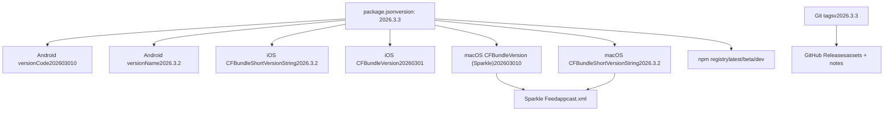
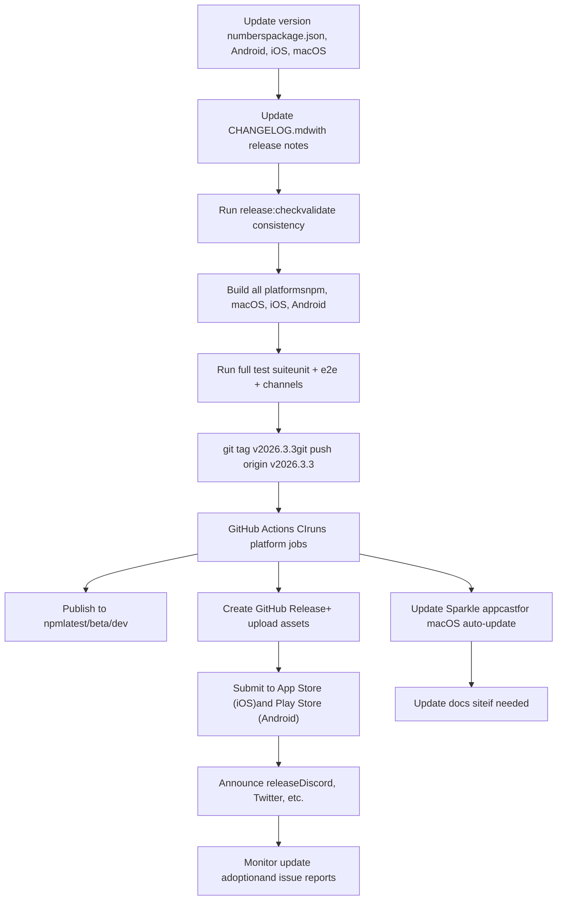

# Release Process

Relevant source files

-   [CHANGELOG.md](https://github.com/openclaw/openclaw/blob/8873e13f/CHANGELOG.md)
-   [README.md](https://github.com/openclaw/openclaw/blob/8873e13f/README.md)
-   [apps/android/app/build.gradle.kts](https://github.com/openclaw/openclaw/blob/8873e13f/apps/android/app/build.gradle.kts)
-   [apps/ios/Sources/Info.plist](https://github.com/openclaw/openclaw/blob/8873e13f/apps/ios/Sources/Info.plist)
-   [apps/ios/Tests/Info.plist](https://github.com/openclaw/openclaw/blob/8873e13f/apps/ios/Tests/Info.plist)
-   [apps/ios/project.yml](https://github.com/openclaw/openclaw/blob/8873e13f/apps/ios/project.yml)
-   [apps/macos/Sources/OpenClaw/Resources/Info.plist](https://github.com/openclaw/openclaw/blob/8873e13f/apps/macos/Sources/OpenClaw/Resources/Info.plist)
-   [assets/avatar-placeholder.svg](https://github.com/openclaw/openclaw/blob/8873e13f/assets/avatar-placeholder.svg)
-   [docs/cli/index.md](https://github.com/openclaw/openclaw/blob/8873e13f/docs/cli/index.md)
-   [docs/gateway/configuration.md](https://github.com/openclaw/openclaw/blob/8873e13f/docs/gateway/configuration.md)
-   [docs/gateway/index.md](https://github.com/openclaw/openclaw/blob/8873e13f/docs/gateway/index.md)
-   [docs/gateway/troubleshooting.md](https://github.com/openclaw/openclaw/blob/8873e13f/docs/gateway/troubleshooting.md)
-   [docs/index.md](https://github.com/openclaw/openclaw/blob/8873e13f/docs/index.md)
-   [docs/platforms/mac/release.md](https://github.com/openclaw/openclaw/blob/8873e13f/docs/platforms/mac/release.md)
-   [docs/start/getting-started.md](https://github.com/openclaw/openclaw/blob/8873e13f/docs/start/getting-started.md)
-   [docs/start/wizard.md](https://github.com/openclaw/openclaw/blob/8873e13f/docs/start/wizard.md)
-   [extensions/bluebubbles/src/send-helpers.ts](https://github.com/openclaw/openclaw/blob/8873e13f/extensions/bluebubbles/src/send-helpers.ts)
-   [package.json](https://github.com/openclaw/openclaw/blob/8873e13f/package.json)
-   [pnpm-lock.yaml](https://github.com/openclaw/openclaw/blob/8873e13f/pnpm-lock.yaml)
-   [scripts/clawtributors-map.json](https://github.com/openclaw/openclaw/blob/8873e13f/scripts/clawtributors-map.json)
-   [scripts/update-clawtributors.ts](https://github.com/openclaw/openclaw/blob/8873e13f/scripts/update-clawtributors.ts)
-   [scripts/update-clawtributors.types.ts](https://github.com/openclaw/openclaw/blob/8873e13f/scripts/update-clawtributors.types.ts)
-   [src/agents/subagent-registry-cleanup.test.ts](https://github.com/openclaw/openclaw/blob/8873e13f/src/agents/subagent-registry-cleanup.test.ts)
-   [src/cli/program.ts](https://github.com/openclaw/openclaw/blob/8873e13f/src/cli/program.ts)
-   [src/config/config.ts](https://github.com/openclaw/openclaw/blob/8873e13f/src/config/config.ts)
-   [src/config/types.ts](https://github.com/openclaw/openclaw/blob/8873e13f/src/config/types.ts)
-   [src/config/zod-schema.ts](https://github.com/openclaw/openclaw/blob/8873e13f/src/config/zod-schema.ts)
-   [ui/package.json](https://github.com/openclaw/openclaw/blob/8873e13f/ui/package.json)

This document describes the versioning strategy, release checklist, changelog maintenance, and distribution process for OpenClaw releases across npm, GitHub, and platform-specific channels (macOS, iOS, Android).

For CI/CD pipeline details, see [CI/CD Pipeline](/openclaw/openclaw/8.1-cicd-pipeline). For platform-specific development setup, see [macOS Dev Setup](https://github.com/openclaw/openclaw/blob/8873e13f/macOS Dev Setup) [iOS](https://github.com/openclaw/openclaw/blob/8873e13f/iOS) and [Android](https://github.com/openclaw/openclaw/blob/8873e13f/Android)

## Purpose and Scope

This page covers:

-   Versioning scheme and version number coordination
-   Release checklist and pre-release validation
-   Changelog format and maintenance practices
-   Distribution to npm, GitHub releases, and platform app stores
-   Platform-specific release processes (Sparkle auto-updates for macOS, mobile builds)
-   Update mechanisms and channels (stable/beta/dev)

---

## Versioning Strategy

OpenClaw uses a **calendar-based versioning scheme**: `YYYY.M.D` (year, month, day).

| Example Version | Interpretation |
| --- | --- |
| `2026.3.3` | March 3, 2026 (stable release) |
| `2026.3.2` | March 2, 2026 (previous stable) |
| `2026.3.3-beta.1` | Beta prerelease for March 3 cycle |

**Version Fields:**

-   **npm package version** ([package.json3](https://github.com/openclaw/openclaw/blob/8873e13f/package.json#L3-L3)): semantic source of truth for Node.js distribution
-   **Android `versionCode`** ([apps/android/app/build.gradle.kts24](https://github.com/openclaw/openclaw/blob/8873e13f/apps/android/app/build.gradle.kts#L24-L24)): monotonic integer for Google Play (e.g., `202603010`)
-   **Android `versionName`** ([apps/android/app/build.gradle.kts25](https://github.com/openclaw/openclaw/blob/8873e13f/apps/android/app/build.gradle.kts#L25-L25)): human-readable display version (e.g., `"2026.3.2"`)
-   **iOS `CFBundleShortVersionString`** ([apps/ios/Sources/Info.plist22](https://github.com/openclaw/openclaw/blob/8873e13f/apps/ios/Sources/Info.plist#L22-L22)): marketing version (e.g., `"2026.3.2"`)
-   **iOS `CFBundleVersion`** ([apps/ios/Sources/Info.plist35](https://github.com/openclaw/openclaw/blob/8873e13f/apps/ios/Sources/Info.plist#L35-L35)): build number (e.g., `"20260301"`)
-   **macOS `CFBundleShortVersionString`** ([apps/macos/Sources/OpenClaw/Resources/Info.plist18](https://github.com/openclaw/openclaw/blob/8873e13f/apps/macos/Sources/OpenClaw/Resources/Info.plist#L18-L18)): display version
-   **macOS `CFBundleVersion`** ([apps/macos/Sources/OpenClaw/Resources/Info.plist20](https://github.com/openclaw/openclaw/blob/8873e13f/apps/macos/Sources/OpenClaw/Resources/Info.plist#L20-L20)): Sparkle version (numeric, monotonic)

**Distribution Channels:**

-   `stable` — tagged releases (`vYYYY.M.D`), npm dist-tag `latest`
-   `beta` — prerelease tags (`vYYYY.M.D-beta.N`), npm dist-tag `beta`
-   `dev` — moving head of `main`, npm dist-tag `dev`

Sources: [CHANGELOG.md5-31](https://github.com/openclaw/openclaw/blob/8873e13f/CHANGELOG.md#L5-L31) [package.json3](https://github.com/openclaw/openclaw/blob/8873e13f/package.json#L3-L3) [README.md85-90](https://github.com/openclaw/openclaw/blob/8873e13f/README.md#L85-L90)

---

## Version Coordination Across Platforms


**Key Invariants:**

-   **npm version** is the canonical source for all platform versions
-   **Mobile build numbers** must be monotonic integers for app store submission
-   **macOS `APP_BUILD`** must be numeric and monotonic for Sparkle version comparison ([docs/platforms/mac/release.md29-31](https://github.com/openclaw/openclaw/blob/8873e13f/docs/platforms/mac/release.md#L29-L31))
-   Android `versionCode` format: `YYYYMMDDNN` (date + lane suffix)
-   iOS `CFBundleVersion` format: `YYYYMMDD` (date only)

Sources: [package.json3](https://github.com/openclaw/openclaw/blob/8873e13f/package.json#L3-L3) [apps/android/app/build.gradle.kts24-25](https://github.com/openclaw/openclaw/blob/8873e13f/apps/android/app/build.gradle.kts#L24-L25) [apps/ios/Sources/Info.plist22-35](https://github.com/openclaw/openclaw/blob/8873e13f/apps/ios/Sources/Info.plist#L22-L35) [apps/macos/Sources/OpenClaw/Resources/Info.plist18-20](https://github.com/openclaw/openclaw/blob/8873e13f/apps/macos/Sources/OpenClaw/Resources/Info.plist#L18-L20)

---

## Release Checklist

### Pre-Release Validation

> **[Mermaid sequence]**
> *(图表结构无法解析)*

**Manual Steps:**

1.  **Update version numbers** across all platform configs to match

    -   [package.json3](https://github.com/openclaw/openclaw/blob/8873e13f/package.json#L3-L3)
    -   [apps/android/app/build.gradle.kts24-25](https://github.com/openclaw/openclaw/blob/8873e13f/apps/android/app/build.gradle.kts#L24-L25)
    -   [apps/ios/Sources/Info.plist22-35](https://github.com/openclaw/openclaw/blob/8873e13f/apps/ios/Sources/Info.plist#L22-L35)
    -   [apps/ios/project.yml101-102](https://github.com/openclaw/openclaw/blob/8873e13f/apps/ios/project.yml#L101-L102)
    -   [apps/macos/Sources/OpenClaw/Resources/Info.plist18-20](https://github.com/openclaw/openclaw/blob/8873e13f/apps/macos/Sources/OpenClaw/Resources/Info.plist#L18-L20)
2.  **Update CHANGELOG.md** with release notes

    -   Add new `## YYYY.M.D` section at top
    -   Categorize changes: `### Changes`, `### Breaking`, `### Fixes`
    -   Include PR references and contributor credits ([CHANGELOG.md1-166](https://github.com/openclaw/openclaw/blob/8873e13f/CHANGELOG.md#L1-L166))
3.  **Run pre-release checks:**

    ```
    npm run release:check
    ```

    This script ([package.json294](https://github.com/openclaw/openclaw/blob/8873e13f/package.json#L294-L294)) validates version consistency, changelog presence, and git state.

4.  **Verify build across platforms:**

    ```
    pnpm build                    # Node/TS distpnpm ui:build                 # Control UIpnpm android:assemble         # Android APKpnpm ios:build               # iOS build# macOS: see platform-specific section below
    ```

5.  **Run full test suite:**

    ```
    pnpm test                     # Unit testspnpm test:e2e                # E2E testspnpm test:channels           # Channel integration tests
    ```

6.  **Tag and push:**

    ```
    git tag v2026.3.3git push origin v2026.3.3
    ```


**Automated Validation:**

-   CI runs [scope detection](/openclaw/openclaw/8.1-cicd-pipeline) to determine which platform jobs to execute
-   Type checking, linting, and formatting checks run on all pushes
-   Platform-specific tests run when relevant files change

Sources: [package.json294](https://github.com/openclaw/openclaw/blob/8873e13f/package.json#L294-L294) [CHANGELOG.md1-166](https://github.com/openclaw/openclaw/blob/8873e13f/CHANGELOG.md#L1-L166) [.github/workflows/ci.yml](https://github.com/openclaw/openclaw/blob/8873e13f/.github/workflows/ci.yml) (implied)

---

## Changelog Maintenance

The changelog follows a **structured format** with three main categories:

| Section | Purpose |
| --- | --- |
| `### Changes` | New features, improvements, and non-breaking changes |
| `### Breaking` | Breaking changes requiring user action (bold with migration guidance) |
| `### Fixes` | Bug fixes with symptoms, root cause, and resolution |

**Changelog Entry Format:**

```
### Changes - Feature/area: description of change with context and user impact. (#PR) Thanks @contributor.
```
**Best Practices:**

-   **User-centric language**: describe impact, not implementation
-   **Include context**: why the change was needed, what problem it solves
-   **Cite PRs and contributors**: `(#12345) Thanks @username`
-   **Breaking changes**: must include migration path or workaround
-   **Categorize precisely**: Changes vs Fixes vs Breaking

**Example Breaking Change Entry:**

```
### Breaking - **BREAKING:** Gateway auth now requires explicit `gateway.auth.mode` when both  `gateway.auth.token` and `gateway.auth.password` are configured. Set  `gateway.auth.mode` to `token` or `password` before upgrade to avoid startup  failures. (#35094) Thanks @joshavant.
```
Sources: [CHANGELOG.md1-166](https://github.com/openclaw/openclaw/blob/8873e13f/CHANGELOG.md#L1-L166)

---

## Distribution Channels

### npm Registry

OpenClaw publishes to npm with three dist-tags:

| Dist-Tag | Purpose | Audience |
| --- | --- | --- |
| `latest` | Stable releases | Production users |
| `beta` | Beta prereleases | Early adopters, testing |
| `dev` | Development snapshots | Contributors, bleeding edge |

**Publish Command:**

```
npm publish --tag latest      # Stablenpm publish --tag beta        # Betanpm publish --tag dev         # Dev snapshot
```
**Package Contents** ([package.json23-34](https://github.com/openclaw/openclaw/blob/8873e13f/package.json#L23-L34)):

-   `CHANGELOG.md`, `LICENSE`, `README.md`
-   `openclaw.mjs` (CLI entry point)
-   `dist/` (compiled TypeScript)
-   `assets/`, `docs/`, `extensions/`, `skills/`

**Pre-Publish Hook** ([package.json289](https://github.com/openclaw/openclaw/blob/8873e13f/package.json#L289-L289)):

```
pnpm build && pnpm ui:build
```
Ensures `dist/` and Control UI assets are fresh before packing.

Sources: [package.json23-289](https://github.com/openclaw/openclaw/blob/8873e13f/package.json#L23-L289) [README.md85-90](https://github.com/openclaw/openclaw/blob/8873e13f/README.md#L85-L90)

---

### GitHub Releases

GitHub Releases serve as the **changelog archive** and **asset distribution point**.

**Release Workflow:**

1.  Tag pushed triggers CI
2.  CI builds all platform artifacts
3.  CI creates GitHub Release with:
    -   Release notes (extracted from CHANGELOG.md)
    -   Downloadable assets:
        -   `openclaw-{version}.tgz` (npm tarball)
        -   `OpenClaw-{version}.dmg` (macOS)
        -   `openclaw-{version}-release.apk` (Android)
        -   `openclaw-{version}.ipa` (iOS, if built)

**Release Notes Format:**

```
## 2026.3.3 ### Changes- [List from CHANGELOG.md] ### Breaking- [List from CHANGELOG.md] ### Fixes- [List from CHANGELOG.md]
```
Sources: [CHANGELOG.md1-166](https://github.com/openclaw/openclaw/blob/8873e13f/CHANGELOG.md#L1-L166) [README.md16](https://github.com/openclaw/openclaw/blob/8873e13f/README.md#L16-L16)

---

## Platform-Specific Release Processes

### macOS: Sparkle Auto-Updates

macOS releases use **Sparkle** for in-app auto-updates.

**Sparkle Version Constraints:**

-   `APP_BUILD` (maps to `sparkle:version` and `CFBundleVersion`) must be **numeric and monotonic**
-   `APP_VERSION` (maps to `sparkle:shortVersionString` and `CFBundleShortVersionString`) is human-readable
-   If `APP_BUILD` is omitted, `scripts/package-mac-app.sh` auto-derives it from `APP_VERSION` using format `YYYYMMDDNN` (stable defaults to `90`, prereleases use suffix-derived lane)

**Build and Package Commands:**

```
# Set release metadataBUNDLE_ID=ai.openclaw.mac \APP_VERSION=2026.3.2 \BUILD_CONFIG=release \SIGN_IDENTITY="Developer ID Application: <Name> (<TEAMID>)" \scripts/package-mac-app.sh # Create signed, notarized distribution artifactsBUNDLE_ID=ai.openclaw.mac \APP_VERSION=2026.3.2 \BUILD_CONFIG=release \SIGN_IDENTITY="Developer ID Application: <Name> (<TEAMID>)" \scripts/package-mac-dist.sh
```
**Output Artifacts:**

-   `dist/OpenClaw.app` — Developer ID signed app bundle
-   `dist/OpenClaw-{version}.zip` — Sparkle-signed archive
-   `dist/OpenClaw-{version}.dmg` — Notarized disk image
-   `dist/openclaw-{version}.appcast.xml` — Sparkle feed entry

**Sparkle Feed Update:**

```
# Generate/update appcast.xml~/.build/artifacts/sparkle/Sparkle/bin/generate_appcast \  --channel main \  dist/
```
**Notarization Flow:**

1.  Build and sign with Developer ID
2.  Create distributable archive (`.zip` or `.dmg`)
3.  Submit to Apple notary service:

    ```
    xcrun notarytool submit dist/OpenClaw-{version}.dmg \  --keychain-profile openclaw-notary \  --wait
    ```

4.  Staple notarization ticket:

    ```
    xcrun stapler staple dist/OpenClaw-{version}.dmg
    ```


**Prerequisites:**

-   Developer ID Application certificate installed
-   Sparkle private key at `$SPARKLE_PRIVATE_KEY_FILE`
-   Notary credentials stored in keychain profile `openclaw-notary`

Sources: [docs/platforms/mac/release.md1-45](https://github.com/openclaw/openclaw/blob/8873e13f/docs/platforms/mac/release.md#L1-L45) [apps/macos/Sources/OpenClaw/Resources/Info.plist18-20](https://github.com/openclaw/openclaw/blob/8873e13f/apps/macos/Sources/OpenClaw/Resources/Info.plist#L18-L20)

---

### iOS Release

**Version Management:**

-   `CFBundleShortVersionString` ([apps/ios/Sources/Info.plist22](https://github.com/openclaw/openclaw/blob/8873e13f/apps/ios/Sources/Info.plist#L22-L22)): marketing version (e.g., `"2026.3.2"`)
-   `CFBundleVersion` ([apps/ios/Sources/Info.plist35](https://github.com/openclaw/openclaw/blob/8873e13f/apps/ios/Sources/Info.plist#L35-L35)): build number (e.g., `"20260301"`, monotonic)

**Build Commands:**

```
# Generate Xcode project from project.ymlpnpm ios:gen # Build for simulatorIOS_DEST="platform=iOS Simulator,name=iPhone 17" pnpm ios:build # Build for device (requires signing)pnpm ios:build
```
**Signing Configuration:** Managed via `Signing.xcconfig` and environment variables:

-   `OPENCLAW_CODE_SIGN_STYLE` (Automatic or Manual)
-   `OPENCLAW_DEVELOPMENT_TEAM` (Team ID)
-   `OPENCLAW_APP_BUNDLE_ID` (Bundle identifier)
-   `OPENCLAW_APP_PROFILE` (Provisioning profile name)

**Release Steps:**

1.  Update versions in [apps/ios/project.yml101-102](https://github.com/openclaw/openclaw/blob/8873e13f/apps/ios/project.yml#L101-L102) and [apps/ios/Sources/Info.plist22-35](https://github.com/openclaw/openclaw/blob/8873e13f/apps/ios/Sources/Info.plist#L22-L35)
2.  Run `pnpm ios:build` with release configuration
3.  Archive via Xcode or `xcodebuild archive`
4.  Submit to App Store Connect via Xcode Organizer or `xcrun altool`

Sources: [apps/ios/project.yml1-119](https://github.com/openclaw/openclaw/blob/8873e13f/apps/ios/project.yml#L1-L119) [apps/ios/Sources/Info.plist1-91](https://github.com/openclaw/openclaw/blob/8873e13f/apps/ios/Sources/Info.plist#L1-L91) [package.json262-265](https://github.com/openclaw/openclaw/blob/8873e13f/package.json#L262-L265)

---

### Android Release

**Version Management:**

-   `versionCode` ([apps/android/app/build.gradle.kts24](https://github.com/openclaw/openclaw/blob/8873e13f/apps/android/app/build.gradle.kts#L24-L24)): monotonic integer for Play Store (e.g., `202603010`)
-   `versionName` ([apps/android/app/build.gradle.kts25](https://github.com/openclaw/openclaw/blob/8873e13f/apps/android/app/build.gradle.kts#L25-L25)): display version (e.g., `"2026.3.2"`)

**Build Commands:**

```
# Debug buildpnpm android:assemble # Release build (requires signing key)cd apps/android./gradlew :app:assembleRelease
```
**Output Filename:** The `androidComponents` block ([apps/android/app/build.gradle.kts82-94](https://github.com/openclaw/openclaw/blob/8873e13f/apps/android/app/build.gradle.kts#L82-L94)) customizes output filename:

```
openclaw-{versionName}-{buildType}.apk
```
Example: `openclaw-2026.3.2-release.apk`

**Release Steps:**

1.  Update `versionCode` (increment monotonically) and `versionName` in [apps/android/app/build.gradle.kts24-25](https://github.com/openclaw/openclaw/blob/8873e13f/apps/android/app/build.gradle.kts#L24-L25)
2.  Build release APK: `./gradlew :app:assembleRelease`
3.  Sign with release keystore (configured in `signing` block, not shown in provided files)
4.  Upload to Google Play Console

Sources: [apps/android/app/build.gradle.kts1-169](https://github.com/openclaw/openclaw/blob/8873e13f/apps/android/app/build.gradle.kts#L1-L169) [package.json218-224](https://github.com/openclaw/openclaw/blob/8873e13f/package.json#L218-L224)

---

## Automated Release Checks

The `release:check` script validates release readiness:

```
npm run release:check
```
**Validation Steps** (inferred from script name):

1.  **Version format**: Ensure all version strings match expected calendar format
2.  **Version consistency**: Verify npm package version matches platform versions
3.  **Changelog presence**: Require corresponding CHANGELOG.md section for current version
4.  **Git state**: Ensure working tree is clean and on `main` branch
5.  **Build status**: Verify `dist/` is up-to-date (optional, may require manual `pnpm build`)

**Usage in CI:** The `release:check` script likely runs as part of the tag push workflow to catch errors before publishing.

Sources: [package.json294](https://github.com/openclaw/openclaw/blob/8873e13f/package.json#L294-L294)

---

## Update Mechanisms

### User-Facing Update Command

```
openclaw update [--channel stable|beta|dev]
```
**Behavior:**

-   Detects current install method (npm, git source, or other)
-   Updates to latest version on specified channel
-   For npm installs: `npm install -g openclaw@latest` (or `@beta`, `@dev`)
-   For git installs: `git pull && pnpm install && pnpm build`

**Auto-Update Configuration** ([docs/gateway/configuration.md269-283](https://github.com/openclaw/openclaw/blob/8873e13f/docs/gateway/configuration.md#L269-L283)):

```
{  update: {    channel: "stable",           // stable | beta | dev    checkOnStart: true,          // Check for updates on gateway start    auto: {      enabled: false,            // Auto-install updates (disabled by default)      stableDelayHours: 72,      // Delay before auto-applying stable updates      stableJitterHours: 24,     // Random jitter to spread update load      betaCheckIntervalHours: 6  // How often to check for beta updates    }  }}
```
**macOS Auto-Update Flow:**

1.  Sparkle checks appcast feed on app launch
2.  User prompted when update available
3.  Update downloaded in background
4.  User chooses "Install and Relaunch"
5.  Sparkle replaces app bundle and relaunches

Sources: [README.md85-90](https://github.com/openclaw/openclaw/blob/8873e13f/README.md#L85-L90) [docs/gateway/configuration.md269-283](https://github.com/openclaw/openclaw/blob/8873e13f/docs/gateway/configuration.md#L269-L283)

---

## Contributor Credits

The `scripts/update-clawtributors.ts` script maintains the contributor section in README.md:

**Data Sources:**

-   GitHub API: fetch contributors via `gh api "repos/openclaw/openclaw/contributors"`
-   Git history: parse commits for name/email mappings
-   Manual mappings: [scripts/clawtributors-map.json1-41](https://github.com/openclaw/openclaw/blob/8873e13f/scripts/clawtributors-map.json#L1-L41) for display name overrides

**Update Command:**

```
# Run manually before releasepnpm tsx scripts/update-clawtributors.ts
```
**Output:** Updates the contributor grid in [README.md](https://github.com/openclaw/openclaw/blob/8873e13f/README.md) with avatars and profile links.

Sources: [scripts/update-clawtributors.ts1-227](https://github.com/openclaw/openclaw/blob/8873e13f/scripts/update-clawtributors.ts#L1-L227) [scripts/clawtributors-map.json1-41](https://github.com/openclaw/openclaw/blob/8873e13f/scripts/clawtributors-map.json#L1-L41)

---

## Summary Workflow Diagram


Sources: [package.json3-294](https://github.com/openclaw/openclaw/blob/8873e13f/package.json#L3-L294) [CHANGELOG.md1-166](https://github.com/openclaw/openclaw/blob/8873e13f/CHANGELOG.md#L1-L166) [docs/platforms/mac/release.md1-45](https://github.com/openclaw/openclaw/blob/8873e13f/docs/platforms/mac/release.md#L1-L45) [apps/android/app/build.gradle.kts24-25](https://github.com/openclaw/openclaw/blob/8873e13f/apps/android/app/build.gradle.kts#L24-L25) [apps/ios/Sources/Info.plist22-35](https://github.com/openclaw/openclaw/blob/8873e13f/apps/ios/Sources/Info.plist#L22-L35)
