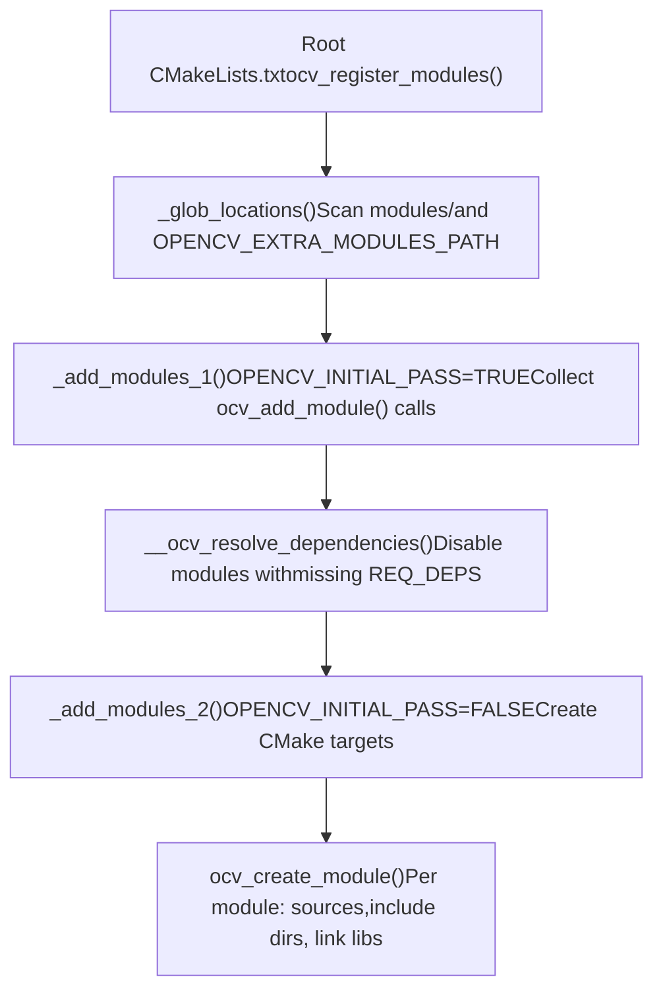
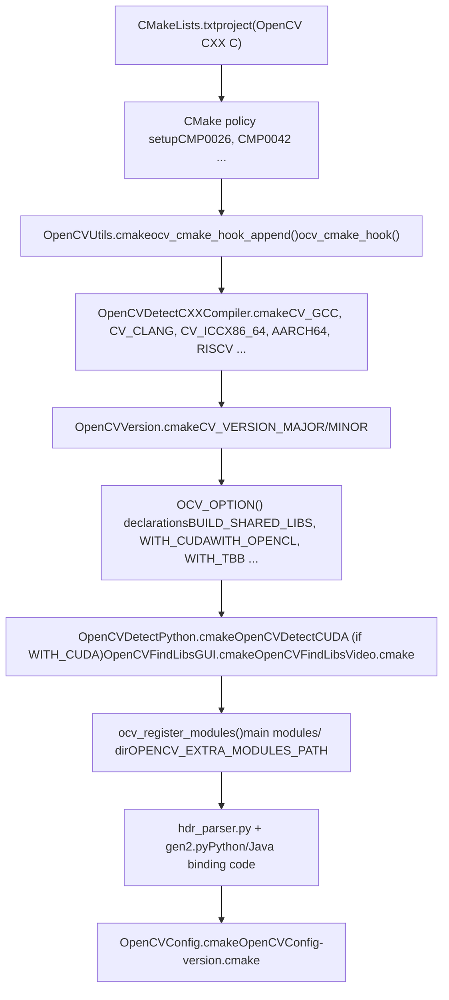
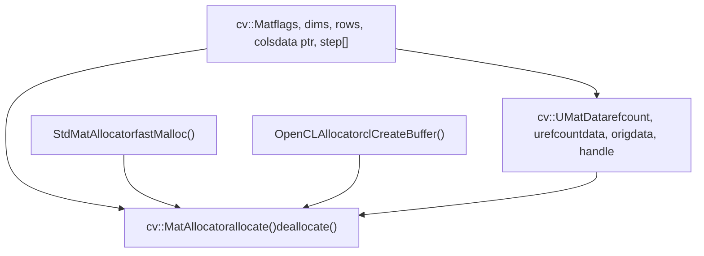
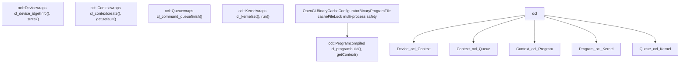
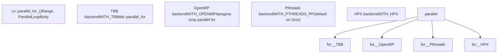
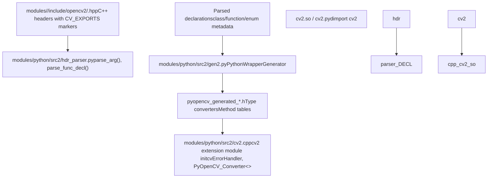
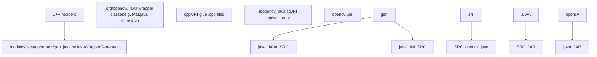

# OpenCV Overview

Relevant source files

-   [CMakeLists.txt](https://github.com/opencv/opencv/blob/91c78f50/CMakeLists.txt)
-   [cmake/OpenCVCRTLinkage.cmake](https://github.com/opencv/opencv/blob/91c78f50/cmake/OpenCVCRTLinkage.cmake)
-   [cmake/OpenCVCompilerOptions.cmake](https://github.com/opencv/opencv/blob/91c78f50/cmake/OpenCVCompilerOptions.cmake)
-   [cmake/OpenCVDetectCXXCompiler.cmake](https://github.com/opencv/opencv/blob/91c78f50/cmake/OpenCVDetectCXXCompiler.cmake)
-   [cmake/OpenCVFindLibsGUI.cmake](https://github.com/opencv/opencv/blob/91c78f50/cmake/OpenCVFindLibsGUI.cmake)
-   [cmake/OpenCVFindLibsVideo.cmake](https://github.com/opencv/opencv/blob/91c78f50/cmake/OpenCVFindLibsVideo.cmake)
-   [cmake/OpenCVModule.cmake](https://github.com/opencv/opencv/blob/91c78f50/cmake/OpenCVModule.cmake)
-   [cmake/OpenCVPCHSupport.cmake](https://github.com/opencv/opencv/blob/91c78f50/cmake/OpenCVPCHSupport.cmake)
-   [cmake/OpenCVUtils.cmake](https://github.com/opencv/opencv/blob/91c78f50/cmake/OpenCVUtils.cmake)
-   [cmake/templates/OpenCVConfig.root-WIN32.cmake.in](https://github.com/opencv/opencv/blob/91c78f50/cmake/templates/OpenCVConfig.root-WIN32.cmake.in)
-   [cmake/templates/cvconfig.h.in](https://github.com/opencv/opencv/blob/91c78f50/cmake/templates/cvconfig.h.in)
-   [doc/tutorials/dnn/dnn\_android/dnn\_android.markdown](https://github.com/opencv/opencv/blob/91c78f50/doc/tutorials/dnn/dnn_android/dnn_android.markdown?plain=1)
-   [doc/tutorials/introduction/cross\_referencing/tutorial\_cross\_referencing.markdown](https://github.com/opencv/opencv/blob/91c78f50/doc/tutorials/introduction/cross_referencing/tutorial_cross_referencing.markdown?plain=1)
-   [modules/core/CMakeLists.txt](https://github.com/opencv/opencv/blob/91c78f50/modules/core/CMakeLists.txt)
-   [modules/core/include/opencv2/core/version.hpp](https://github.com/opencv/opencv/blob/91c78f50/modules/core/include/opencv2/core/version.hpp)
-   [modules/dnn/include/opencv2/dnn/version.hpp](https://github.com/opencv/opencv/blob/91c78f50/modules/dnn/include/opencv2/dnn/version.hpp)
-   [modules/highgui/CMakeLists.txt](https://github.com/opencv/opencv/blob/91c78f50/modules/highgui/CMakeLists.txt)
-   [modules/highgui/include/opencv2/highgui.hpp](https://github.com/opencv/opencv/blob/91c78f50/modules/highgui/include/opencv2/highgui.hpp)
-   [modules/highgui/include/opencv2/highgui/highgui.hpp](https://github.com/opencv/opencv/blob/91c78f50/modules/highgui/include/opencv2/highgui/highgui.hpp)
-   [modules/highgui/include/opencv2/highgui/highgui\_c.h](https://github.com/opencv/opencv/blob/91c78f50/modules/highgui/include/opencv2/highgui/highgui_c.h)
-   [modules/highgui/src/precomp.hpp](https://github.com/opencv/opencv/blob/91c78f50/modules/highgui/src/precomp.hpp)
-   [modules/highgui/src/window.cpp](https://github.com/opencv/opencv/blob/91c78f50/modules/highgui/src/window.cpp)
-   [modules/highgui/src/window\_QT.cpp](https://github.com/opencv/opencv/blob/91c78f50/modules/highgui/src/window_QT.cpp)
-   [modules/highgui/src/window\_QT.h](https://github.com/opencv/opencv/blob/91c78f50/modules/highgui/src/window_QT.h)
-   [modules/highgui/src/window\_cocoa.mm](https://github.com/opencv/opencv/blob/91c78f50/modules/highgui/src/window_cocoa.mm)
-   [modules/highgui/src/window\_gtk.cpp](https://github.com/opencv/opencv/blob/91c78f50/modules/highgui/src/window_gtk.cpp)
-   [modules/highgui/src/window\_w32.cpp](https://github.com/opencv/opencv/blob/91c78f50/modules/highgui/src/window_w32.cpp)
-   [modules/java/CMakeLists.txt](https://github.com/opencv/opencv/blob/91c78f50/modules/java/CMakeLists.txt)
-   [modules/python/package/setup.py](https://github.com/opencv/opencv/blob/91c78f50/modules/python/package/setup.py)
-   [modules/videoio/CMakeLists.txt](https://github.com/opencv/opencv/blob/91c78f50/modules/videoio/CMakeLists.txt)
-   [platforms/android/build\_sdk.py](https://github.com/opencv/opencv/blob/91c78f50/platforms/android/build_sdk.py)
-   [platforms/android/ndk-10.config.py](https://github.com/opencv/opencv/blob/91c78f50/platforms/android/ndk-10.config.py)
-   [platforms/android/ndk-16.config.py](https://github.com/opencv/opencv/blob/91c78f50/platforms/android/ndk-16.config.py)
-   [platforms/maven/opencv-it/pom.xml](https://github.com/opencv/opencv/blob/91c78f50/platforms/maven/opencv-it/pom.xml)
-   [platforms/maven/opencv/pom.xml](https://github.com/opencv/opencv/blob/91c78f50/platforms/maven/opencv/pom.xml)
-   [platforms/maven/pom.xml](https://github.com/opencv/opencv/blob/91c78f50/platforms/maven/pom.xml)

## What Is OpenCV

OpenCV (Open Source Computer Vision Library) is a C++ library for real-time computer vision and image processing. It provides:

-   Image and video I/O (reading, writing, camera capture)
-   Image processing (filtering, transformations, color conversion)
-   Computer vision algorithms (feature detection, camera calibration, object detection)
-   Deep neural network inference (`opencv_dnn`)
-   GPU acceleration via OpenCL and CUDA
-   Language bindings for Python and Java

The library is organized as a set of independently buildable modules, each living under `modules/`. All modules depend on `opencv_core`, which provides the fundamental data structures and utilities.

## Repository Layout and Version

OpenCV 4.14.0-pre is a modular C++ library with a CMake-based build system and auto-generated language bindings.

| Directory | Contents |
| --- | --- |
| `modules/` | Core OpenCV modules (`core`, `imgproc`, `dnn`, `features2d`, etc.) |
| `cmake/` | Build infrastructure: detection scripts, module macros, compiler options |
| `platforms/` | Platform-specific build scripts (Android SDK builder, Maven POMs) |
| `3rdparty/` | Bundled third-party dependencies (zlib, libjpeg, libpng, etc.) |

**Version constants** are defined in [modules/core/include/opencv2/core/version.hpp8-11](https://github.com/opencv/opencv/blob/91c78f50/modules/core/include/opencv2/core/version.hpp#L8-L11):

| Macro | Value |
| --- | --- |
| `CV_VERSION_MAJOR` | `4` |
| `CV_VERSION_MINOR` | `14` |
| `CV_VERSION_REVISION` | `0` |
| `CV_VERSION_STATUS` | `"-pre"` |

Sources: [modules/core/include/opencv2/core/version.hpp1-27](https://github.com/opencv/opencv/blob/91c78f50/modules/core/include/opencv2/core/version.hpp#L1-L27)

## Supported Platforms

OpenCV targets a wide range of platforms. The CMake variable `CMAKE_SYSTEM_NAME` and processor flags set in [cmake/OpenCVDetectCXXCompiler.cmake94-116](https://github.com/opencv/opencv/blob/91c78f50/cmake/OpenCVDetectCXXCompiler.cmake#L94-L116) determine which paths are active.

| Platform | Notes |
| --- | --- |
| Linux (x86\_64, ARM, AArch64, RISC-V, LoongArch64) | Full feature set; GTK or Qt GUI |
| Windows (x86, x64, ARM64) | Win32 UI or Qt GUI; MSVC, MinGW |
| macOS | Cocoa GUI; Apple Silicon and Intel |
| Android | NDK build; multi-ABI via `build_sdk.py` |
| iOS / visionOS | Framework build; AVFoundation capture |
| WebAssembly (Emscripten) | JS bindings |

Sources: [cmake/OpenCVDetectCXXCompiler.cmake1-116](https://github.com/opencv/opencv/blob/91c78f50/cmake/OpenCVDetectCXXCompiler.cmake#L1-L116) [CMakeLists.txt18-26](https://github.com/opencv/opencv/blob/91c78f50/CMakeLists.txt#L18-L26) [platforms/android/build\_sdk.py70-79](https://github.com/opencv/opencv/blob/91c78f50/platforms/android/build_sdk.py#L70-L79)

## Module Organization and Dependencies

### Module Architecture

OpenCV's architecture is hierarchical. Each module is declared via `ocv_add_module` in its own `CMakeLists.txt` and lists required and optional dependencies. The fixed ordering of canonical modules is defined in [cmake/OpenCVModule.cmake424-426](https://github.com/opencv/opencv/blob/91c78f50/cmake/OpenCVModule.cmake#L424-L426)

**Module dependency graph (canonical modules):**


Sources: [cmake/OpenCVModule.cmake424-426](https://github.com/opencv/opencv/blob/91c78f50/cmake/OpenCVModule.cmake#L424-L426) [modules/core/CMakeLists.txt35-37](https://github.com/opencv/opencv/blob/91c78f50/modules/core/CMakeLists.txt#L35-L37) [modules/highgui/CMakeLists.txt4-6](https://github.com/opencv/opencv/blob/91c78f50/modules/highgui/CMakeLists.txt#L4-L6) [modules/videoio/CMakeLists.txt24](https://github.com/opencv/opencv/blob/91c78f50/modules/videoio/CMakeLists.txt#L24-L24)

### Module Registration via `ocv_add_module`

Every module calls `ocv_add_module` in its `CMakeLists.txt`. The macro (defined in [cmake/OpenCVModule.cmake124-223](https://github.com/opencv/opencv/blob/91c78f50/cmake/OpenCVModule.cmake#L124-L223)) collects dependency information during the first CMake pass (`OPENCV_INITIAL_PASS=ON`) and creates build targets on the second pass.

```
ocv_add_module(<name> [INTERNAL|BINDINGS]
               [REQUIRED] <deps>
               [OPTIONAL <optional_deps>]
               [WRAP <python|java|objc|js>])
```
Module metadata stored in CMake cache:

| CMake Variable | Description |
| --- | --- |
| `OPENCV_MODULE_${the_module}_LOCATION` | Source directory |
| `OPENCV_MODULE_${the_module}_DEPS` | Flattened resolved dependency list |
| `OPENCV_MODULE_${the_module}_CLASS` | `PUBLIC`, `INTERNAL`, or `BINDINGS` |
| `OPENCV_MODULE_${the_module}_WRAPPERS` | Enabled language wrappers |
| `HAVE_${the_module}` | `ON` if module is buildable |

Sources: [cmake/OpenCVModule.cmake1-117](https://github.com/opencv/opencv/blob/91c78f50/cmake/OpenCVModule.cmake#L1-L117) [CMakeLists.txt195-196](https://github.com/opencv/opencv/blob/91c78f50/CMakeLists.txt#L195-L196)

### Module Discovery Process

The build system discovers modules using `_glob_locations`, `_add_modules_1`, and `_add_modules_2` functions. Module paths are discovered by scanning for `CMakeLists.txt` files in [cmake/OpenCVModule.cmake250-280](https://github.com/opencv/opencv/blob/91c78f50/cmake/OpenCVModule.cmake#L250-L280)

**Module registration and build flow:**


Sources: [cmake/OpenCVModule.cmake246-399](https://github.com/opencv/opencv/blob/91c78f50/cmake/OpenCVModule.cmake#L246-L399) [CMakeLists.txt631-632](https://github.com/opencv/opencv/blob/91c78f50/CMakeLists.txt#L631-L632)

## Build System Architecture

### CMake Configuration Flow

The root `CMakeLists.txt` drives platform detection, compiler configuration, third-party library discovery, and module compilation. For a detailed treatment of the build system, see page 2.

**CMake configuration sequence:**


**Key configuration variables:**

| Variable | Purpose | Default |
| --- | --- | --- |
| `BUILD_SHARED_LIBS` | `.so`/`.dll` vs `.a`/`.lib` | `ON` (except Android/iOS) |
| `BUILD_LIST` | Comma-separated subset of modules to build | all |
| `OPENCV_EXTRA_MODULES_PATH` | Additional module search paths | empty |
| `OPENCV_FORCE_3RDPARTY_BUILD` | Build all third-party libs from source | `OFF` |
| `BUILD_opencv_world` | Merge all modules into one library | `OFF` |

**CMake hooks** allow external customization. Registered via `ocv_cmake_hook_append()` and invoked at named points (`CMAKE_INIT`, `POST_DETECT_COMPILER`, `POST_ADD_MODULE`, etc.) [cmake/OpenCVUtils.cmake48-86](https://github.com/opencv/opencv/blob/91c78f50/cmake/OpenCVUtils.cmake#L48-L86)

Sources: [CMakeLists.txt1-200](https://github.com/opencv/opencv/blob/91c78f50/CMakeLists.txt#L1-L200) [cmake/OpenCVUtils.cmake44-97](https://github.com/opencv/opencv/blob/91c78f50/cmake/OpenCVUtils.cmake#L44-L97) [cmake/OpenCVDetectCXXCompiler.cmake1-50](https://github.com/opencv/opencv/blob/91c78f50/cmake/OpenCVDetectCXXCompiler.cmake#L1-L50)

### Module Compilation Pattern

Each module's `CMakeLists.txt` follows a standard pattern documented at [cmake/OpenCVModule.cmake33-51](https://github.com/opencv/opencv/blob/91c78f50/cmake/OpenCVModule.cmake#L33-L51):

1.  `ocv_add_module(name <deps>)` — declare module and dependencies
2.  `ocv_glob_module_sources()` or `ocv_set_module_sources(SOURCES ... HEADERS ...)` — collect files
3.  `ocv_module_include_directories()` — set up include paths
4.  `ocv_create_module([extra_link_libs])` — create the CMake library target
5.  `ocv_add_accuracy_tests()`, `ocv_add_perf_tests()` — register test targets

Inside any module `CMakeLists.txt`, `${the_module}` is the full target name (e.g., `opencv_core`) and `${name}` is the short name (e.g., `core`).

Sources: [cmake/OpenCVModule.cmake33-51](https://github.com/opencv/opencv/blob/91c78f50/cmake/OpenCVModule.cmake#L33-L51) [modules/core/CMakeLists.txt35-173](https://github.com/opencv/opencv/blob/91c78f50/modules/core/CMakeLists.txt#L35-L173) [modules/highgui/CMakeLists.txt1-12](https://github.com/opencv/opencv/blob/91c78f50/modules/highgui/CMakeLists.txt#L1-L12)

## Core Data Structures

For full details on `Mat`, `UMat`, OpenCL acceleration, SIMD dispatch, and other core facilities, see page 3.

### Mat and Memory Management

`cv::Mat` is the fundamental data container, implementing reference-counted memory with copy-on-write semantics. It is defined in `modules/core/include/opencv2/core/mat.hpp`.

**Mat / UMatData / MatAllocator relationship:**


Key `cv::Mat` fields ([modules/core/include/opencv2/core/mat.hpp1753-2665](https://github.com/opencv/opencv/blob/91c78f50/modules/core/include/opencv2/core/mat.hpp#L1753-L2665)):

| Field | Type | Purpose |
| --- | --- | --- |
| `flags` | `int` | Encodes element type (`CV_8UC1`, `CV_32FC3`, etc.) |
| `dims` | `int` | Number of dimensions |
| `rows`, `cols` | `int` | Dimensions for 2D matrices |
| `data` | `uchar*` | Pointer to first element |
| `u` | `UMatData*` | Reference-counting and allocator metadata |
| `step` | `MatStep` | Row stride in bytes |

Reference counting uses `CV_XADD` (atomic increment/decrement) on `UMatData::refcount`. `addref()` and `release()` are implemented in [modules/core/src/matrix.cpp541-565](https://github.com/opencv/opencv/blob/91c78f50/modules/core/src/matrix.cpp#L541-L565) The default allocator `StdMatAllocator` uses `fastMalloc()` [modules/core/src/matrix.cpp126-177](https://github.com/opencv/opencv/blob/91c78f50/modules/core/src/matrix.cpp#L126-L177)

Sources: [modules/core/include/opencv2/core/mat.hpp1753-1950](https://github.com/opencv/opencv/blob/91c78f50/modules/core/include/opencv2/core/mat.hpp#L1753-L1950) [modules/core/src/matrix.cpp126-177](https://github.com/opencv/opencv/blob/91c78f50/modules/core/src/matrix.cpp#L126-L177) [modules/core/src/matrix.cpp336-446](https://github.com/opencv/opencv/blob/91c78f50/modules/core/src/matrix.cpp#L336-L446)

### UMat and Unified Memory

`cv::UMat` provides transparent GPU execution via OpenCL. It shares the `UMatData` reference-counting mechanism with `cv::Mat` but uses `OpenCLAllocator` to back storage with a `cl_mem` buffer.

`UMat::getMat(accessFlags)` triggers data migration:

-   `ACCESS_READ` — Download GPU→CPU if GPU copy is newer
-   `ACCESS_WRITE` — Mark GPU data as stale after CPU write
-   `ACCESS_RW` — Bidirectional sync

`InputArray` and `OutputArray` (defined in [modules/core/include/opencv2/core/mat.hpp160-356](https://github.com/opencv/opencv/blob/91c78f50/modules/core/include/opencv2/core/mat.hpp#L160-L356)) allow all OpenCV functions to accept either `Mat` or `UMat` without source-level changes.

Sources: [modules/core/src/umatrix.cpp1-1200](https://github.com/opencv/opencv/blob/91c78f50/modules/core/src/umatrix.cpp#L1-L1200) [modules/core/include/opencv2/core/mat.hpp160-356](https://github.com/opencv/opencv/blob/91c78f50/modules/core/include/opencv2/core/mat.hpp#L160-L356)

## Hardware Acceleration Infrastructure

For full details on OpenCL and CUDA acceleration, see pages 3.2 and 14.

### OpenCL Integration

OpenCL support is managed via the `cv::ocl` namespace. The class hierarchy maps directly to the OpenCL object model.

**`cv::ocl` class hierarchy:**


Kernel binary caching is managed by `OpenCLBinaryCacheConfigurator` [modules/core/src/ocl.cpp311-519](https://github.com/opencv/opencv/blob/91c78f50/modules/core/src/ocl.cpp#L311-L519) The cache directory is controlled by `OPENCV_OPENCL_CACHE_DIR`. Build options can be extended via `OPENCV_OPENCL_BUILD_EXTRA_OPTIONS` [modules/core/src/ocl.cpp233-245](https://github.com/opencv/opencv/blob/91c78f50/modules/core/src/ocl.cpp#L233-L245)

Sources: [modules/core/src/ocl.cpp311-842](https://github.com/opencv/opencv/blob/91c78f50/modules/core/src/ocl.cpp#L311-L842) [modules/core/include/opencv2/core/ocl.hpp1-600](https://github.com/opencv/opencv/blob/91c78f50/modules/core/include/opencv2/core/ocl.hpp#L1-L600)

### Parallel Processing

`cv::parallel_for_()` dispatches loop bodies across CPU threads using a pluggable backend system.


Build-time CMake options select which backends are compiled in [CMakeLists.txt351-362](https://github.com/opencv/opencv/blob/91c78f50/CMakeLists.txt#L351-L362)

Sources: [CMakeLists.txt351-362](https://github.com/opencv/opencv/blob/91c78f50/CMakeLists.txt#L351-L362)

### SIMD Dispatching

OpenCV compiles multiple optimized variants of hot functions and selects the best at runtime. For details, see page 3.5.

CPU capabilities are detected by `HWFeatures` in [modules/core/src/system.cpp382-640](https://github.com/opencv/opencv/blob/91c78f50/modules/core/src/system.cpp#L382-L640):

-   x86: `SSE2`, `AVX`, `AVX2`, `AVX512` via CPUID
-   ARM/AArch64: `NEON`, `SVE` via auxiliary vector
-   PowerPC: `VSX` via `getauxval()`

Modules declare dispatch targets with `ocv_add_dispatched_file()` [modules/core/CMakeLists.txt3-10](https://github.com/opencv/opencv/blob/91c78f50/modules/core/CMakeLists.txt#L3-L10) For example:

```
ocv_add_dispatched_file(arithm SSE2 SSE4_1 AVX2 VSX3 LASX)
```
This generates one compilation unit per ISA extension. Runtime dispatch selects the best via `CV_CPU_HAS_SUPPORT_*` macros.

Sources: [modules/core/src/system.cpp382-640](https://github.com/opencv/opencv/blob/91c78f50/modules/core/src/system.cpp#L382-L640) [modules/core/CMakeLists.txt1-20](https://github.com/opencv/opencv/blob/91c78f50/modules/core/CMakeLists.txt#L1-L20)

## Language Binding Infrastructure

For full details on Python and Java bindings, see pages 11.1 and 11.2.

### Python Bindings

Python bindings are auto-generated from C++ headers. The pipeline runs at build time.

**Python binding generation pipeline:**


Type conversions: `cv::Mat` ↔ `numpy.ndarray`, `std::vector<T>` ↔ Python list, `cv::Point`/`cv::Rect` ↔ Python tuples.

Sources: [modules/python/CMakeLists.txt1-50](https://github.com/opencv/opencv/blob/91c78f50/modules/python/CMakeLists.txt#L1-L50)

### Java Bindings

Java bindings use the same header-parsing approach, feeding into a JNI layer.

**Java binding generation:**


The `opencv_java` module is declared as `BINDINGS` class in [modules/java/CMakeLists.txt16](https://github.com/opencv/opencv/blob/91c78f50/modules/java/CMakeLists.txt#L16-L16) It requires `ANT_EXECUTABLE` or `Java_FOUND` or Gradle at configure time.

Sources: [modules/java/CMakeLists.txt1-42](https://github.com/opencv/opencv/blob/91c78f50/modules/java/CMakeLists.txt#L1-L42)

## Configuration and Build Options

### Third-Party Dependencies

All optional integrations are controlled by `WITH_*` CMake options declared in [CMakeLists.txt215-482](https://github.com/opencv/opencv/blob/91c78f50/CMakeLists.txt#L215-L482) Each option has a corresponding `HAVE_*` variable set after detection.

| Category | Option | Purpose |
| --- | --- | --- |
| Acceleration | `WITH_OPENCL` | OpenCL runtime |
| Acceleration | `WITH_CUDA` | NVIDIA CUDA toolkit |
| Acceleration | `WITH_IPP` | Intel IPP (x86/x64 only) |
| Acceleration | `WITH_TBB` | Intel Threading Building Blocks |
| Acceleration | `WITH_EIGEN` | Eigen3 linear algebra |
| Video I/O | `WITH_FFMPEG` | FFmpeg video codec |
| Video I/O | `WITH_GSTREAMER` | GStreamer pipeline |
| Video I/O | `WITH_V4L` | Video4Linux (Linux only) |
| Video I/O | `WITH_MSMF` | Media Foundation (Windows) |
| Image codecs | `WITH_JPEG` / `WITH_PNG` / `WITH_TIFF` | Image format support |
| Image codecs | `WITH_WEBP` / `WITH_AVIF` / `WITH_OPENEXR` | Additional formats |
| GUI | `WITH_QT` | Qt window backend |
| GUI | `WITH_GTK` | GTK window backend (Linux) |
| GUI | `WITH_WIN32UI` | Win32 window backend |
| DNN | `WITH_OPENVINO` | Intel OpenVINO inference backend |
| DNN | `WITH_CUDA` + `WITH_CUDNN` | CUDA/cuDNN DNN backend |

Sources: [CMakeLists.txt215-483](https://github.com/opencv/opencv/blob/91c78f50/CMakeLists.txt#L215-L483) [cmake/OpenCVFindLibsVideo.cmake1-12](https://github.com/opencv/opencv/blob/91c78f50/cmake/OpenCVFindLibsVideo.cmake#L1-L12) [cmake/OpenCVFindLibsGUI.cmake1-50](https://github.com/opencv/opencv/blob/91c78f50/cmake/OpenCVFindLibsGUI.cmake#L1-L50)

### Platform-Specific Configuration

Platform detection is performed by `cmake/OpenCVDetectCXXCompiler.cmake` and platform-specific files under `cmake/platforms/`.

-   **Android**: `platforms/android/build_sdk.py` orchestrates multi-ABI NDK builds (armeabi-v7a, arm64-v8a, x86, x86\_64) and produces an AAR. See page 2.3.
-   **iOS/macOS**: Framework bundle creation; `APPLE_FRAMEWORK` CMake variable activates framework-specific rules.
-   **Windows**: MSVC-specific compiler flags set in [cmake/OpenCVCompilerOptions.cmake96-103](https://github.com/opencv/opencv/blob/91c78f50/cmake/OpenCVCompilerOptions.cmake#L96-L103) Win32 UI backend selected when `WITH_WIN32UI` is `ON`.
-   **Emscripten (WebAssembly)**: JS bindings via `BUILD_opencv_js`; plugin system disabled.

Sources: [platforms/android/build\_sdk.py70-80](https://github.com/opencv/opencv/blob/91c78f50/platforms/android/build_sdk.py#L70-L80) [cmake/OpenCVCompilerOptions.cmake96-340](https://github.com/opencv/opencv/blob/91c78f50/cmake/OpenCVCompilerOptions.cmake#L96-L340) [cmake/OpenCVDetectCXXCompiler.cmake92-140](https://github.com/opencv/opencv/blob/91c78f50/cmake/OpenCVDetectCXXCompiler.cmake#L92-L140)

## Extension Mechanisms

### Custom Modules

OpenCV supports external modules via `OPENCV_EXTRA_MODULES_PATH`:

1.  Create module directory with `CMakeLists.txt`
2.  Call `ocv_add_module(mymodule <dependencies>)`
3.  Point CMake to module path: `-DOPENCV_EXTRA_MODULES_PATH=/path/to/modules`

The module system automatically integrates external modules into:

-   Build process
-   Installation
-   Language bindings (if applicable)
-   Documentation generation

Sources: [cmake/OpenCVModule.cmake246-280](https://github.com/opencv/opencv/blob/91c78f50/cmake/OpenCVModule.cmake#L246-L280) [CMakeLists.txt632](https://github.com/opencv/opencv/blob/91c78f50/CMakeLists.txt#L632-L632)

### Plugin Architecture

The `highgui` and `videoio` modules support runtime-loadable plugins for GUI and video backends.

**Plugin Registration:** Backends register via `ocv_create_builtin_highgui_plugin()` macro in [modules/highgui/CMakeLists.txt196-204](https://github.com/opencv/opencv/blob/91c78f50/modules/highgui/CMakeLists.txt#L196-L204)

**Backend Selection:** The `OPENCV_HIGHGUI_BUILTIN_BACKEND` variable determines the default backend (e.g., "QT5", "GTK3", "WIN32UI").

Sources: [modules/highgui/CMakeLists.txt1-250](https://github.com/opencv/opencv/blob/91c78f50/modules/highgui/CMakeLists.txt#L1-L250)

---

This overview covers OpenCV's modular architecture, build infrastructure, core data structures, hardware acceleration, and language bindings. For implementation details of specific subsystems, consult the corresponding specialized documentation pages.
