# User Interfaces (highgui)

Relevant source files

-   [CMakeLists.txt](https://github.com/opencv/opencv/blob/91c78f50/CMakeLists.txt)
-   [cmake/OpenCVCRTLinkage.cmake](https://github.com/opencv/opencv/blob/91c78f50/cmake/OpenCVCRTLinkage.cmake)
-   [cmake/OpenCVCompilerOptions.cmake](https://github.com/opencv/opencv/blob/91c78f50/cmake/OpenCVCompilerOptions.cmake)
-   [cmake/OpenCVDetectCXXCompiler.cmake](https://github.com/opencv/opencv/blob/91c78f50/cmake/OpenCVDetectCXXCompiler.cmake)
-   [cmake/OpenCVFindLibsGUI.cmake](https://github.com/opencv/opencv/blob/91c78f50/cmake/OpenCVFindLibsGUI.cmake)
-   [cmake/OpenCVFindLibsVideo.cmake](https://github.com/opencv/opencv/blob/91c78f50/cmake/OpenCVFindLibsVideo.cmake)
-   [cmake/OpenCVModule.cmake](https://github.com/opencv/opencv/blob/91c78f50/cmake/OpenCVModule.cmake)
-   [cmake/OpenCVPCHSupport.cmake](https://github.com/opencv/opencv/blob/91c78f50/cmake/OpenCVPCHSupport.cmake)
-   [cmake/OpenCVUtils.cmake](https://github.com/opencv/opencv/blob/91c78f50/cmake/OpenCVUtils.cmake)
-   [cmake/templates/OpenCVConfig.root-WIN32.cmake.in](https://github.com/opencv/opencv/blob/91c78f50/cmake/templates/OpenCVConfig.root-WIN32.cmake.in)
-   [cmake/templates/cvconfig.h.in](https://github.com/opencv/opencv/blob/91c78f50/cmake/templates/cvconfig.h.in)
-   [doc/tutorials/app/highgui\_wayland\_ubuntu.markdown](https://github.com/opencv/opencv/blob/91c78f50/doc/tutorials/app/highgui_wayland_ubuntu.markdown?plain=1)
-   [modules/core/CMakeLists.txt](https://github.com/opencv/opencv/blob/91c78f50/modules/core/CMakeLists.txt)
-   [modules/highgui/CMakeLists.txt](https://github.com/opencv/opencv/blob/91c78f50/modules/highgui/CMakeLists.txt)
-   [modules/highgui/cmake/detect\_wayland.cmake](https://github.com/opencv/opencv/blob/91c78f50/modules/highgui/cmake/detect_wayland.cmake)
-   [modules/highgui/include/opencv2/highgui.hpp](https://github.com/opencv/opencv/blob/91c78f50/modules/highgui/include/opencv2/highgui.hpp)
-   [modules/highgui/include/opencv2/highgui/highgui.hpp](https://github.com/opencv/opencv/blob/91c78f50/modules/highgui/include/opencv2/highgui/highgui.hpp)
-   [modules/highgui/include/opencv2/highgui/highgui\_c.h](https://github.com/opencv/opencv/blob/91c78f50/modules/highgui/include/opencv2/highgui/highgui_c.h)
-   [modules/highgui/src/precomp.hpp](https://github.com/opencv/opencv/blob/91c78f50/modules/highgui/src/precomp.hpp)
-   [modules/highgui/src/window.cpp](https://github.com/opencv/opencv/blob/91c78f50/modules/highgui/src/window.cpp)
-   [modules/highgui/src/window\_QT.cpp](https://github.com/opencv/opencv/blob/91c78f50/modules/highgui/src/window_QT.cpp)
-   [modules/highgui/src/window\_QT.h](https://github.com/opencv/opencv/blob/91c78f50/modules/highgui/src/window_QT.h)
-   [modules/highgui/src/window\_cocoa.mm](https://github.com/opencv/opencv/blob/91c78f50/modules/highgui/src/window_cocoa.mm)
-   [modules/highgui/src/window\_gtk.cpp](https://github.com/opencv/opencv/blob/91c78f50/modules/highgui/src/window_gtk.cpp)
-   [modules/highgui/src/window\_w32.cpp](https://github.com/opencv/opencv/blob/91c78f50/modules/highgui/src/window_w32.cpp)
-   [modules/highgui/src/window\_wayland.cpp](https://github.com/opencv/opencv/blob/91c78f50/modules/highgui/src/window_wayland.cpp)
-   [modules/highgui/test/test\_gui.cpp](https://github.com/opencv/opencv/blob/91c78f50/modules/highgui/test/test_gui.cpp)
-   [modules/highgui/test/test\_precomp.hpp](https://github.com/opencv/opencv/blob/91c78f50/modules/highgui/test/test_precomp.hpp)
-   [modules/java/CMakeLists.txt](https://github.com/opencv/opencv/blob/91c78f50/modules/java/CMakeLists.txt)
-   [modules/videoio/CMakeLists.txt](https://github.com/opencv/opencv/blob/91c78f50/modules/videoio/CMakeLists.txt)

The highgui module provides platform-independent GUI functionality for creating windows, displaying images, and handling user interactions. It supports simple visualization tasks and basic user input without requiring external UI frameworks. For media file I/O, see [Image File I/O and Codec System](/opencv/opencv/7.1-image-file-io-and-codec-system) and [Video Capture and Backend Architecture](/opencv/opencv/7.2-video-capture-and-backend-architecture).

## Module Architecture and Backend Abstraction

The highgui module uses a **multi-backend architecture** where a common API layer dispatches calls to platform-specific implementations selected at compile time or runtime. This design enables consistent cross-platform behavior while leveraging native GUI toolkits.

### Backend Selection and Dispatch Pattern

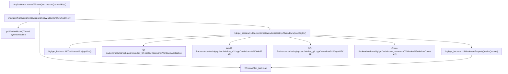
**Sources:** [modules/highgui/src/window.cpp54-178](https://github.com/opencv/opencv/blob/91c78f50/modules/highgui/src/window.cpp#L54-L178) [modules/highgui/src/window\_QT.cpp117-166](https://github.com/opencv/opencv/blob/91c78f50/modules/highgui/src/window_QT.cpp#L117-L166) [modules/highgui/src/window\_w32.cpp148-234](https://github.com/opencv/opencv/blob/91c78f50/modules/highgui/src/window_w32.cpp#L148-L234) [modules/highgui/src/window\_gtk.cpp527-564](https://github.com/opencv/opencv/blob/91c78f50/modules/highgui/src/window_gtk.cpp#L527-L564)

The dispatch mechanism operates through conditional compilation and runtime checks:

| Backend | Compile Flag | Platform | Primary Classes |
| --- | --- | --- | --- |
| Qt | `HAVE_QT` | Cross-platform | `GuiReceiver`, `CvWindow`, `ViewPort` |
| Win32 | `HAVE_WIN32UI` | Windows | `CvWindow`, `CvTrackbar` (via HWND) |
| GTK | `HAVE_GTK` | Linux | `CvWindow`, `CvTrackbar`, `CvImageWidget` |
| Cocoa | `HAVE_COCOA` | macOS | `CVWindow`, `CVView`, `CVSlider` |
| Wayland | `HAVE_WAYLAND` | Linux | Wayland-specific implementation |

**Sources:** [modules/highgui/src/precomp.hpp94-152](https://github.com/opencv/opencv/blob/91c78f50/modules/highgui/src/precomp.hpp#L94-L152) [modules/highgui/src/window.cpp182-215](https://github.com/opencv/opencv/blob/91c78f50/modules/highgui/src/window.cpp#L182-L215)

## Core API Functions and Window Lifecycle

### Window Management API

The primary user-facing functions form a simple but complete windowing API:

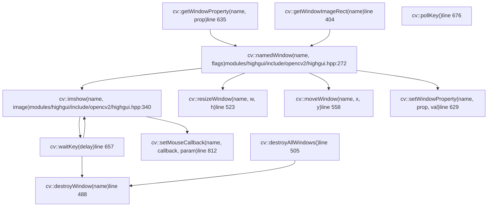
**Sources:** [modules/highgui/include/opencv2/highgui.hpp248-527](https://github.com/opencv/opencv/blob/91c78f50/modules/highgui/include/opencv2/highgui.hpp#L248-L527) [modules/highgui/src/window.cpp448-695](https://github.com/opencv/opencv/blob/91c78f50/modules/highgui/src/window.cpp#L448-L695)

### Window Lifecycle State Machine

**Sources:** [modules/highgui/src/window.cpp448-521](https://github.com/opencv/opencv/blob/91c78f50/modules/highgui/src/window.cpp#L448-L521) [modules/highgui/src/window\_w32.cpp570-639](https://github.com/opencv/opencv/blob/91c78f50/modules/highgui/src/window_w32.cpp#L570-L639)

### Window Flags and Properties

Window behavior is controlled through flags at creation and properties during runtime:

| Flag/Property | Value | Description |
| --- | --- | --- |
| `WINDOW_NORMAL` | `0x00000000` | Resizable window |
| `WINDOW_AUTOSIZE` | `0x00000001` | Fixed size matching image |
| `WINDOW_OPENGL` | `0x00001000` | Enable OpenGL rendering |
| `WINDOW_FULLSCREEN` | `1` | Fullscreen mode |
| `WINDOW_FREERATIO` | `0x00000100` | No aspect ratio constraint |
| `WINDOW_KEEPRATIO` | `0x00000000` | Maintain aspect ratio |
| `WND_PROP_FULLSCREEN` | `0` | Query/set fullscreen state |
| `WND_PROP_AUTOSIZE` | `1` | Query/set autosize state |
| `WND_PROP_ASPECT_RATIO` | `2` | Query/set aspect ratio mode |
| `WND_PROP_OPENGL` | `3` | Query OpenGL support |
| `WND_PROP_VISIBLE` | `4` | Query window visibility |
| `WND_PROP_TOPMOST` | `5` | Set window always-on-top |
| `WND_PROP_VSYNC` | `6` | Enable/disable VSync (OpenGL) |

**Sources:** [modules/highgui/include/opencv2/highgui.hpp142-163](https://github.com/opencv/opencv/blob/91c78f50/modules/highgui/include/opencv2/highgui.hpp#L142-L163) [modules/highgui/src/window.cpp190-273](https://github.com/opencv/opencv/blob/91c78f50/modules/highgui/src/window.cpp#L190-L273)

## User Input Handling

### Keyboard Input Flow

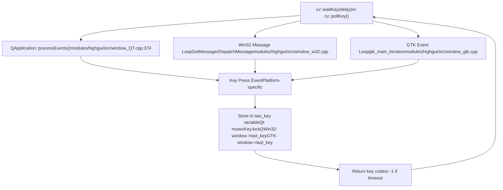
**Sources:** [modules/highgui/src/window.cpp641-695](https://github.com/opencv/opencv/blob/91c78f50/modules/highgui/src/window.cpp#L641-L695) [modules/highgui/src/window\_QT.cpp343-415](https://github.com/opencv/opencv/blob/91c78f50/modules/highgui/src/window_QT.cpp#L343-L415) [modules/highgui/src/window\_w32.cpp1600-1750](https://github.com/opencv/opencv/blob/91c78f50/modules/highgui/src/window_w32.cpp#L1600-L1750) [modules/highgui/src/window\_gtk.cpp1200-1350](https://github.com/opencv/opencv/blob/91c78f50/modules/highgui/src/window_gtk.cpp#L1200-L1350)

The `waitKey()` function serves dual purposes:

1.  **Event Processing**: Processes GUI events necessary for window updates and repaints
2.  **Input Retrieval**: Returns keyboard input with optional timeout

Key implementation details:

-   **Qt Backend**: Uses `QWaitCondition` with mutex for thread-safe key storage [modules/highgui/src/window\_QT.cpp106-415](https://github.com/opencv/opencv/blob/91c78f50/modules/highgui/src/window_QT.cpp#L106-L415)
-   **Win32 Backend**: Polls message queue in tight loop with `Sleep(1)` [modules/highgui/src/window\_w32.cpp1600-1750](https://github.com/opencv/opencv/blob/91c78f50/modules/highgui/src/window_w32.cpp#L1600-L1750)
-   **GTK Backend**: Calls `gtk_main_iteration()` to process pending events [modules/highgui/src/window\_gtk.cpp1200-1350](https://github.com/opencv/opencv/blob/91c78f50/modules/highgui/src/window_gtk.cpp#L1200-L1350)

### Mouse Event Handling

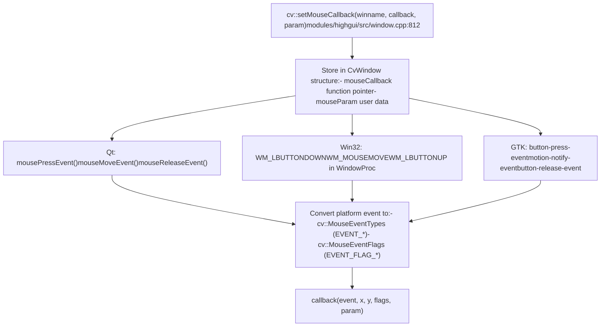
**Sources:** [modules/highgui/src/window.cpp812-850](https://github.com/opencv/opencv/blob/91c78f50/modules/highgui/src/window.cpp#L812-L850) [modules/highgui/src/window\_QT.h386-393](https://github.com/opencv/opencv/blob/91c78f50/modules/highgui/src/window_QT.h#L386-L393) [modules/highgui/src/window\_w32.cpp1400-1600](https://github.com/opencv/opencv/blob/91c78f50/modules/highgui/src/window_w32.cpp#L1400-L1600) [modules/highgui/src/window\_gtk.cpp850-1050](https://github.com/opencv/opencv/blob/91c78f50/modules/highgui/src/window_gtk.cpp#L850-L1050)

Mouse event types and flags:

| Event Type | Value | Description |
| --- | --- | --- |
| `EVENT_MOUSEMOVE` | 0 | Mouse moved |
| `EVENT_LBUTTONDOWN` | 1 | Left button pressed |
| `EVENT_RBUTTONDOWN` | 2 | Right button pressed |
| `EVENT_MBUTTONDOWN` | 3 | Middle button pressed |
| `EVENT_LBUTTONUP` | 4 | Left button released |
| `EVENT_RBUTTONUP` | 5 | Right button released |
| `EVENT_MBUTTONUP` | 6 | Middle button released |
| `EVENT_LBUTTONDBLCLK` | 7 | Left button double-click |
| `EVENT_MOUSEWHEEL` | 10 | Mouse wheel scrolled |

| Event Flag | Value | Description |
| --- | --- | --- |
| `EVENT_FLAG_LBUTTON` | 1 | Left button is down |
| `EVENT_FLAG_RBUTTON` | 2 | Right button is down |
| `EVENT_FLAG_MBUTTON` | 4 | Middle button is down |
| `EVENT_FLAG_CTRLKEY` | 8 | Ctrl key is pressed |
| `EVENT_FLAG_SHIFTKEY` | 16 | Shift key is pressed |
| `EVENT_FLAG_ALTKEY` | 32 | Alt key is pressed |

**Sources:** [modules/highgui/include/opencv2/highgui.hpp166-189](https://github.com/opencv/opencv/blob/91c78f50/modules/highgui/include/opencv2/highgui.hpp#L166-L189) [modules/highgui/include/opencv2/highgui/highgui\_c.h170-194](https://github.com/opencv/opencv/blob/91c78f50/modules/highgui/include/opencv2/highgui/highgui_c.h#L170-L194)

## Interactive Controls: Trackbars

Trackbars (sliders) provide simple numeric input controls attached to windows. Backend-specific implementations vary significantly:

### Trackbar Architecture

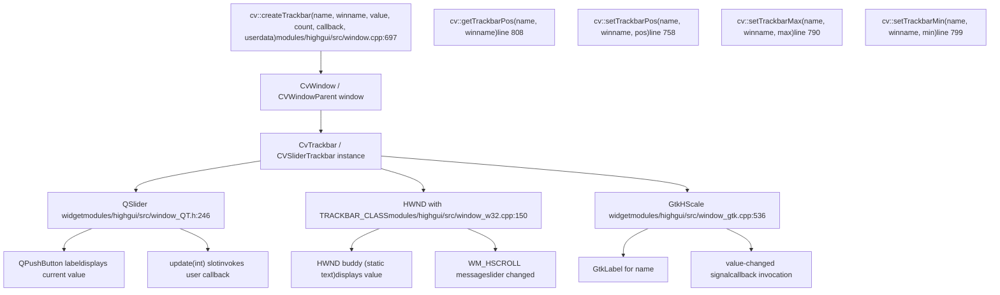
**Sources:** [modules/highgui/src/window.cpp697-810](https://github.com/opencv/opencv/blob/91c78f50/modules/highgui/src/window.cpp#L697-L810) [modules/highgui/src/window\_QT.h246-268](https://github.com/opencv/opencv/blob/91c78f50/modules/highgui/src/window_QT.h#L246-L268) [modules/highgui/src/window\_w32.cpp150-178](https://github.com/opencv/opencv/blob/91c78f50/modules/highgui/src/window_w32.cpp#L150-L178) [modules/highgui/src/window\_gtk.cpp536-563](https://github.com/opencv/opencv/blob/91c78f50/modules/highgui/src/window_gtk.cpp#L536-L563)

### Trackbar Callback Mechanism

Modern trackbar API uses `TrackbarCallback` with user data, while legacy API supports deprecated callbacks:

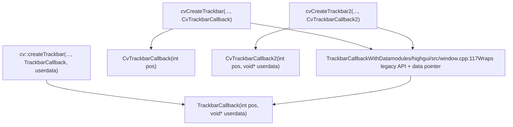
**Sources:** [modules/highgui/include/opencv2/highgui.hpp235](https://github.com/opencv/opencv/blob/91c78f50/modules/highgui/include/opencv2/highgui.hpp#L235-L235) [modules/highgui/src/window.cpp117-176](https://github.com/opencv/opencv/blob/91c78f50/modules/highgui/src/window.cpp#L117-L176) [modules/highgui/include/opencv2/highgui/highgui\_c.h152-162](https://github.com/opencv/opencv/blob/91c78f50/modules/highgui/include/opencv2/highgui/highgui_c.h#L152-L162)

The `TrackbarCallbackWithData` wrapper maintains backward compatibility while supporting the deprecated pattern of passing `int*` value pointers [modules/highgui/src/window.cpp117-150](https://github.com/opencv/opencv/blob/91c78f50/modules/highgui/src/window.cpp#L117-L150) Modern code should pass `NULL` as the value pointer and use the callback's `pos` parameter instead.

## Backend-Specific Implementations

Each backend implements the same conceptual model with platform-specific primitives:

### Qt Backend Architecture

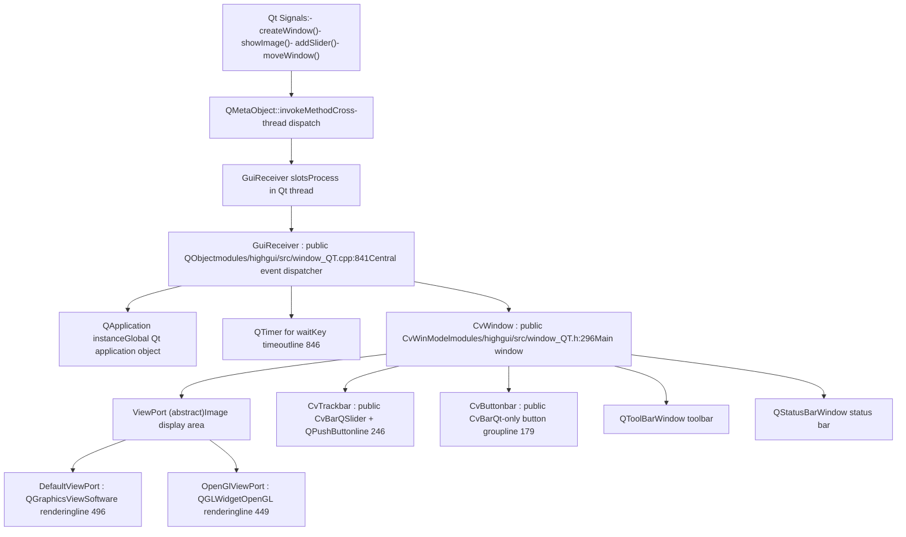
**Sources:** [modules/highgui/src/window\_QT.cpp117-880](https://github.com/opencv/opencv/blob/91c78f50/modules/highgui/src/window_QT.cpp#L117-L880) [modules/highgui/src/window\_QT.h117-383](https://github.com/opencv/opencv/blob/91c78f50/modules/highgui/src/window_QT.h#L117-L383)

Qt backend unique features:

-   **Thread Safety**: Uses `QMetaObject::invokeMethod` with `autoBlockingConnection()` for cross-thread calls [modules/highgui/src/window\_QT.cpp116-125](https://github.com/opencv/opencv/blob/91c78f50/modules/highgui/src/window_QT.cpp#L116-L125)
-   **Multi-threading**: Optional multi-threaded mode via `cvStartLoop()` [modules/highgui/src/window\_QT.cpp421-426](https://github.com/opencv/opencv/blob/91c78f50/modules/highgui/src/window_QT.cpp#L421-L426)
-   **Extended GUI**: Supports toolbars, status bars, and button controls [modules/highgui/src/window\_QT.h342-348](https://github.com/opencv/opencv/blob/91c78f50/modules/highgui/src/window_QT.h#L342-L348)
-   **Settings Persistence**: Can save/load window positions via `cvSaveWindowParameters()` [modules/highgui/src/window\_QT.cpp305-326](https://github.com/opencv/opencv/blob/91c78f50/modules/highgui/src/window_QT.cpp#L305-L326)

### Win32 Backend Architecture

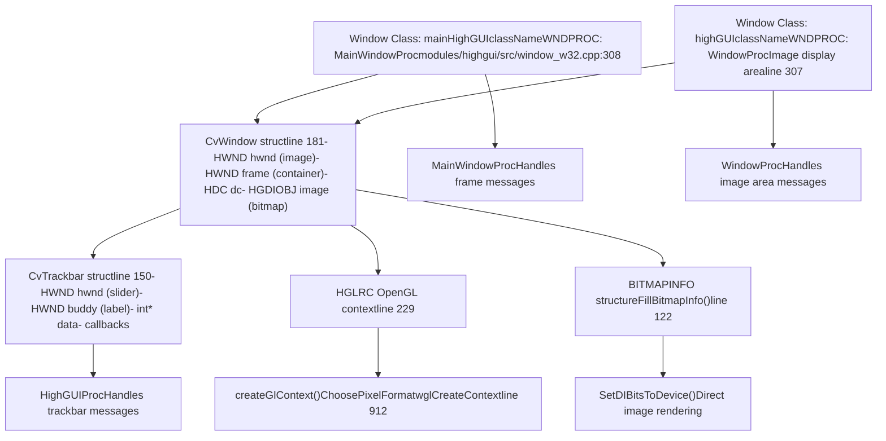
**Sources:** [modules/highgui/src/window\_w32.cpp148-1000](https://github.com/opencv/opencv/blob/91c78f50/modules/highgui/src/window_w32.cpp#L148-L1000)

Win32 backend implementation details:

-   **Two-Window Design**: Outer frame window contains inner image window [modules/highgui/src/window\_w32.cpp1100-1200](https://github.com/opencv/opencv/blob/91c78f50/modules/highgui/src/window_w32.cpp#L1100-L1200)
-   **Bitmap Rendering**: Uses `BITMAPINFO` and `SetDIBitsToDevice()` for efficient image display [modules/highgui/src/window\_w32.cpp122-1500](https://github.com/opencv/opencv/blob/91c78f50/modules/highgui/src/window_w32.cpp#L122-L1500)
-   **Registry Persistence**: Stores window positions in Windows Registry [modules/highgui/src/window\_w32.cpp397-521](https://github.com/opencv/opencv/blob/91c78f50/modules/highgui/src/window_w32.cpp#L397-L521)
-   **OpenGL via WGL**: Optional OpenGL rendering through `wglCreateContext()` [modules/highgui/src/window\_w32.cpp912-1000](https://github.com/opencv/opencv/blob/91c78f50/modules/highgui/src/window_w32.cpp#L912-L1000)

### GTK Backend Architecture

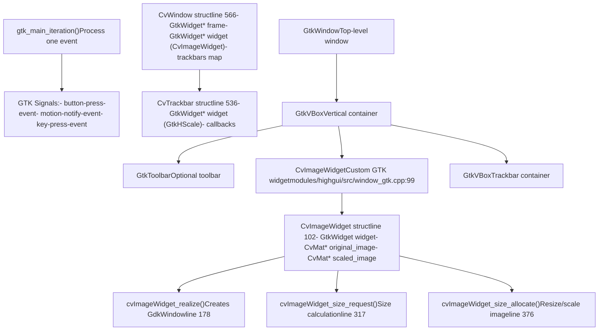
**Sources:** [modules/highgui/src/window\_gtk.cpp99-680](https://github.com/opencv/opencv/blob/91c78f50/modules/highgui/src/window_gtk.cpp#L99-L680)

GTK backend characteristics:

-   **Custom Widget**: `CvImageWidget` is a custom `GtkWidget` subclass handling image display [modules/highgui/src/window\_gtk.cpp99-524](https://github.com/opencv/opencv/blob/91c78f50/modules/highgui/src/window_gtk.cpp#L99-L524)
-   **Type System**: Uses GLib type system with `G_TYPE_CHECK_INSTANCE_CAST` macros [modules/highgui/src/window\_gtk.cpp119-121](https://github.com/opencv/opencv/blob/91c78f50/modules/highgui/src/window_gtk.cpp#L119-L121)
-   **Automatic Scaling**: Resizes images to fit window in `size_allocate` callback [modules/highgui/src/window\_gtk.cpp376-436](https://github.com/opencv/opencv/blob/91c78f50/modules/highgui/src/window_gtk.cpp#L376-L436)
-   **GTK2/GTK3 Support**: Conditional compilation for both GTK versions [modules/highgui/src/window\_gtk.cpp57-65](https://github.com/opencv/opencv/blob/91c78f50/modules/highgui/src/window_gtk.cpp#L57-L65)

### Cocoa Backend Architecture

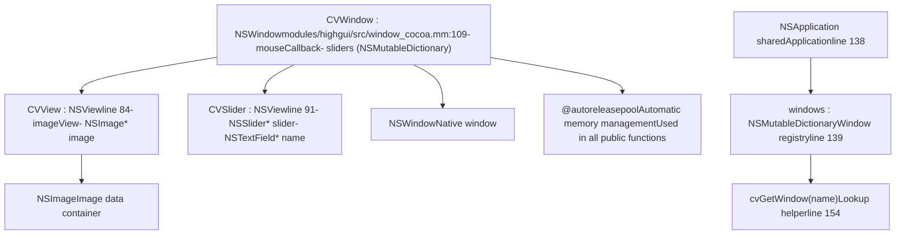
**Sources:** [modules/highgui/src/window\_cocoa.mm84-164](https://github.com/opencv/opencv/blob/91c78f50/modules/highgui/src/window_cocoa.mm#L84-L164)

Cocoa backend specifics:

-   **Objective-C++**: Uses `.mm` extension for Objective-C++ implementation [modules/highgui/src/window\_cocoa.mm1-48](https://github.com/opencv/opencv/blob/91c78f50/modules/highgui/src/window_cocoa.mm#L1-L48)
-   **Autorelease Pools**: All API functions wrapped in `@autoreleasepool` blocks [modules/highgui/src/window\_cocoa.mm156-183](https://github.com/opencv/opencv/blob/91c78f50/modules/highgui/src/window_cocoa.mm#L156-L183)
-   **Dictionary-based Registry**: Windows stored in `NSMutableDictionary` by name [modules/highgui/src/window\_cocoa.mm139-164](https://github.com/opencv/opencv/blob/91c78f50/modules/highgui/src/window_cocoa.mm#L139-L164)
-   **Retina Display Support**: Handles high-DPI displays with `convertSizeFromBacking:` [modules/highgui/src/window\_cocoa.mm221-236](https://github.com/opencv/opencv/blob/91c78f50/modules/highgui/src/window_cocoa.mm#L221-L236)

## Data Structures and Memory Management

### Window Management Structures

Each backend maintains window state differently, but follows similar patterns:

**Qt Backend:**

```
// modules/highgui/src/window_QT.h:296-383class CvWindow : public CvWinModel {    QString name;    ViewPort* myView;          // Image display (DefaultViewPort or OpenGlViewPort)    QBoxLayout* myGlobalLayout;    QBoxLayout* myBarLayout;   // Trackbar container    QToolBar* myToolBar;    QStatusBar* myStatusBar;    int param_flags;           // WINDOW_AUTOSIZE, etc.    int param_gui_mode;        // CV_GUI_NORMAL or CV_GUI_EXPANDED    // ...};
```
**Win32 Backend:**

```
// modules/highgui/src/window_w32.cpp:181-234struct CvWindow {    int signature;             // CV_WINDOW_MAGIC_VAL    cv::Mutex mutex;    HWND hwnd;                 // Image window    HWND frame;                // Container window    HDC dc;                    // Device context    HGDIOBJ image;             // Bitmap handle    int flags;                 // WINDOW_AUTOSIZE, etc.    CvMouseCallback on_mouse;    void* on_mouse_param;    struct {        HWND toolbar;        std::vector<std::shared_ptr<CvTrackbar>> trackbars;    } toolbar;    bool useGl;                // OpenGL enabled    HGLRC hGLRC;               // OpenGL context    // ...};
```
**GTK Backend:**

```
// modules/highgui/src/window_gtk.cpp:566-680struct CvWindow {    int signature;             // CV_WINDOW_MAGIC_VAL    GtkWidget* frame;          // GtkWindow    GtkWidget* widget;         // CvImageWidget    GtkWidget* pane;           // Container    int flags;    int status;                // Fullscreen state    CvMouseCallback on_mouse;    void* on_mouse_param;    std::map<std::string, std::shared_ptr<CvTrackbar>> trackbars;    // ...};
```
**Sources:** [modules/highgui/src/window\_QT.h296-383](https://github.com/opencv/opencv/blob/91c78f50/modules/highgui/src/window_QT.h#L296-L383) [modules/highgui/src/window\_w32.cpp181-234](https://github.com/opencv/opencv/blob/91c78f50/modules/highgui/src/window_w32.cpp#L181-L234) [modules/highgui/src/window\_gtk.cpp566-680](https://github.com/opencv/opencv/blob/91c78f50/modules/highgui/src/window_gtk.cpp#L566-L680)

### Trackbar Structures

**Win32 Backend:**

```
// modules/highgui/src/window_w32.cpp:150-178struct CvTrackbar {    int signature;             // CV_TRACKBAR_MAGIC_VAL    HWND hwnd;                 // Slider control    std::string name;    CvWindow* parent;    HWND buddy;                // Value display label    int* data;                 // Deprecated: direct value pointer    int pos, maxval, minval;    void (*notify)(int);       // Deprecated callback    void (*notify2)(int, void*); // Deprecated callback with userdata    TrackbarCallback onChangeCallback; // Modern callback    void* userdata;    // ...};
```
**GTK Backend:**

```
// modules/highgui/src/window_gtk.cpp:536-563struct CvTrackbar {    int signature;             // CV_TRACKBAR_MAGIC_VAL    GtkWidget* widget;         // GtkHScale slider    std::string name;    CvWindow* parent;    int* data;    int pos, maxval, minval;    CvTrackbarCallback notify;    CvTrackbarCallback2 notify2;    TrackbarCallback onChangeCallback;    void* userdata;};
```
**Sources:** [modules/highgui/src/window\_w32.cpp150-178](https://github.com/opencv/opencv/blob/91c78f50/modules/highgui/src/window_w32.cpp#L150-L178) [modules/highgui/src/window\_gtk.cpp536-563](https://github.com/opencv/opencv/blob/91c78f50/modules/highgui/src/window_gtk.cpp#L536-L563)

### Window Registry and Cleanup

The common API layer maintains a window registry for backend-agnostic access:

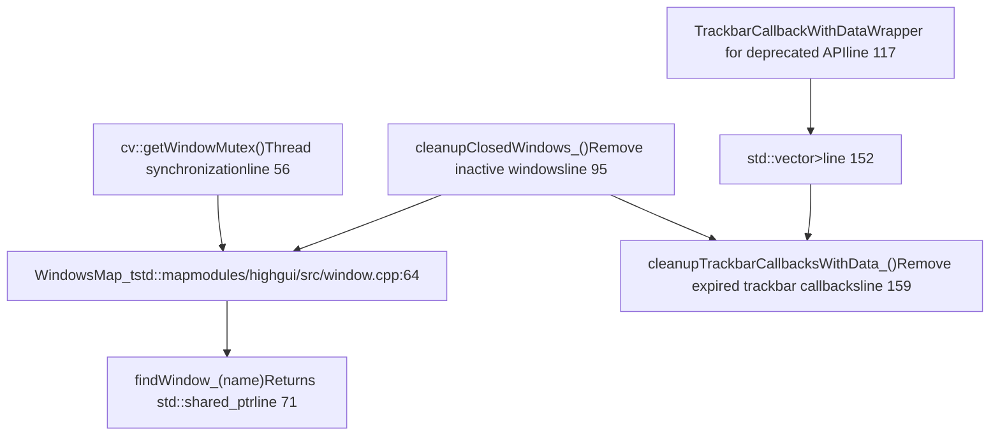
**Sources:** [modules/highgui/src/window.cpp56-176](https://github.com/opencv/opencv/blob/91c78f50/modules/highgui/src/window.cpp#L56-L176)

The registry uses:

-   **Smart Pointers**: `std::shared_ptr` for automatic memory management
-   **Weak Pointers**: Used in callbacks to detect expired trackbars [modules/highgui/src/window.cpp119-175](https://github.com/opencv/opencv/blob/91c78f50/modules/highgui/src/window.cpp#L119-L175)
-   **Periodic Cleanup**: `cleanupClosedWindows_()` called during window operations to remove dead entries
-   **Thread Safety**: All registry operations protected by `getWindowMutex()`

## OpenGL Support (Optional)

When compiled with `HAVE_OPENGL`, highgui provides OpenGL rendering as an alternative to native image display:

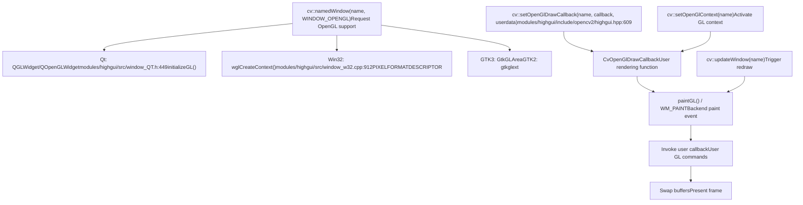
**Sources:** [modules/highgui/include/opencv2/highgui.hpp609-663](https://github.com/opencv/opencv/blob/91c78f50/modules/highgui/include/opencv2/highgui.hpp#L609-L663) [modules/highgui/src/window\_QT.h449-492](https://github.com/opencv/opencv/blob/91c78f50/modules/highgui/src/window_QT.h#L449-L492) [modules/highgui/src/window\_w32.cpp908-1000](https://github.com/opencv/opencv/blob/91c78f50/modules/highgui/src/window_w32.cpp#L908-L1000)

OpenGL features:

-   **Double Buffering**: All backends use double-buffered OpenGL contexts
-   **VSync Control**: Win32 backend supports `WND_PROP_VSYNC` for controlling vertical sync [modules/highgui/src/window\_w32.cpp753-805](https://github.com/opencv/opencv/blob/91c78f50/modules/highgui/src/window_w32.cpp#L753-L805)
-   **Context Management**: `setOpenGlContext()` makes the GL context current for direct GL calls
-   **Custom Drawing**: User callback invoked during paint events for full rendering control

OpenGL-specific functions:

-   `cv::setOpenGlDrawCallback(winname, callback, userdata)` - Register rendering callback
-   `cv::setOpenGlContext(winname)` - Activate GL context
-   `cv::updateWindow(winname)` - Force window repaint

**Sources:** [modules/highgui/include/opencv2/highgui.hpp609-663](https://github.com/opencv/opencv/blob/91c78f50/modules/highgui/include/opencv2/highgui.hpp#L609-L663) [modules/highgui/src/window\_w32.cpp780-815](https://github.com/opencv/opencv/blob/91c78f50/modules/highgui/src/window_w32.cpp#L780-L815)

## API Function Implementation Flow

### imshow() Execution Path

> **[Mermaid sequence]**
> *(图表结构无法解析)*

**Sources:** [modules/highgui/src/window.cpp760-810](https://github.com/opencv/opencv/blob/91c78f50/modules/highgui/src/window.cpp#L760-L810) [modules/highgui/src/window\_QT.cpp1080-1109](https://github.com/opencv/opencv/blob/91c78f50/modules/highgui/src/window_QT.cpp#L1080-L1109) [modules/highgui/src/window\_w32.cpp1450-1550](https://github.com/opencv/opencv/blob/91c78f50/modules/highgui/src/window_w32.cpp#L1450-L1550)

### waitKey() Event Processing Loop

> **[Mermaid sequence]**
> *(图表结构无法解析)*

**Sources:** [modules/highgui/src/window.cpp641-671](https://github.com/opencv/opencv/blob/91c78f50/modules/highgui/src/window.cpp#L641-L671) [modules/highgui/src/window\_QT.cpp343-415](https://github.com/opencv/opencv/blob/91c78f50/modules/highgui/src/window_QT.cpp#L343-L415) [modules/highgui/src/window\_w32.cpp1600-1750](https://github.com/opencv/opencv/blob/91c78f50/modules/highgui/src/window_w32.cpp#L1600-L1750)

Key implementation differences:

-   **Qt**: Uses `QWaitCondition` with timeout for efficient waiting
-   **Win32**: Busy-loops with `Sleep(1)` while processing messages
-   **GTK**: Calls `gtk_main_iteration()` repeatedly with timeout tracking

## Summary: Key Components and Their Roles

| Component | Location | Purpose |
| --- | --- | --- |
| `cv::namedWindow()` | [modules/highgui/src/window.cpp448](https://github.com/opencv/opencv/blob/91c78f50/modules/highgui/src/window.cpp#L448-L448) | Create window with specified flags |
| `cv::imshow()` | [modules/highgui/src/window.cpp760](https://github.com/opencv/opencv/blob/91c78f50/modules/highgui/src/window.cpp#L760-L760) | Display image in window |
| `cv::waitKey()` | [modules/highgui/src/window.cpp657](https://github.com/opencv/opencv/blob/91c78f50/modules/highgui/src/window.cpp#L657-L657) | Process events and wait for keyboard input |
| `cv::setMouseCallback()` | [modules/highgui/src/window.cpp812](https://github.com/opencv/opencv/blob/91c78f50/modules/highgui/src/window.cpp#L812-L812) | Register mouse event handler |
| `cv::createTrackbar()` | [modules/highgui/src/window.cpp697](https://github.com/opencv/opencv/blob/91c78f50/modules/highgui/src/window.cpp#L697-L697) | Add slider control to window |
| `GuiReceiver` (Qt) | [modules/highgui/src/window\_QT.cpp117](https://github.com/opencv/opencv/blob/91c78f50/modules/highgui/src/window_QT.cpp#L117-L117) | Qt backend central dispatcher |
| `CvWindow` (Win32) | [modules/highgui/src/window\_w32.cpp181](https://github.com/opencv/opencv/blob/91c78f50/modules/highgui/src/window_w32.cpp#L181-L181) | Win32 backend window structure |
| `CvWindow` (GTK) | [modules/highgui/src/window\_gtk.cpp566](https://github.com/opencv/opencv/blob/91c78f50/modules/highgui/src/window_gtk.cpp#L566-L566) | GTK backend window structure |
| `CVWindow` (Cocoa) | [modules/highgui/src/window\_cocoa.mm109](https://github.com/opencv/opencv/blob/91c78f50/modules/highgui/src/window_cocoa.mm#L109-L109) | Cocoa backend window class |
| `CvImageWidget` (GTK) | [modules/highgui/src/window\_gtk.cpp99](https://github.com/opencv/opencv/blob/91c78f50/modules/highgui/src/window_gtk.cpp#L99-L99) | Custom GTK widget for image display |
| `WindowsMap_t` | [modules/highgui/src/window.cpp64](https://github.com/opencv/opencv/blob/91c78f50/modules/highgui/src/window.cpp#L64-L64) | Global window registry |
| `getWindowMutex()` | [modules/highgui/src/window.cpp56](https://github.com/opencv/opencv/blob/91c78f50/modules/highgui/src/window.cpp#L56-L56) | Thread synchronization primitive |

**Sources:** [modules/highgui/src/window.cpp](https://github.com/opencv/opencv/blob/91c78f50/modules/highgui/src/window.cpp) [modules/highgui/src/window\_QT.cpp](https://github.com/opencv/opencv/blob/91c78f50/modules/highgui/src/window_QT.cpp) [modules/highgui/src/window\_w32.cpp](https://github.com/opencv/opencv/blob/91c78f50/modules/highgui/src/window_w32.cpp) [modules/highgui/src/window\_gtk.cpp](https://github.com/opencv/opencv/blob/91c78f50/modules/highgui/src/window_gtk.cpp) [modules/highgui/src/window\_cocoa.mm](https://github.com/opencv/opencv/blob/91c78f50/modules/highgui/src/window_cocoa.mm)
