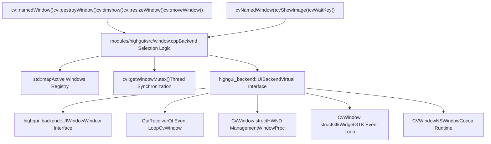
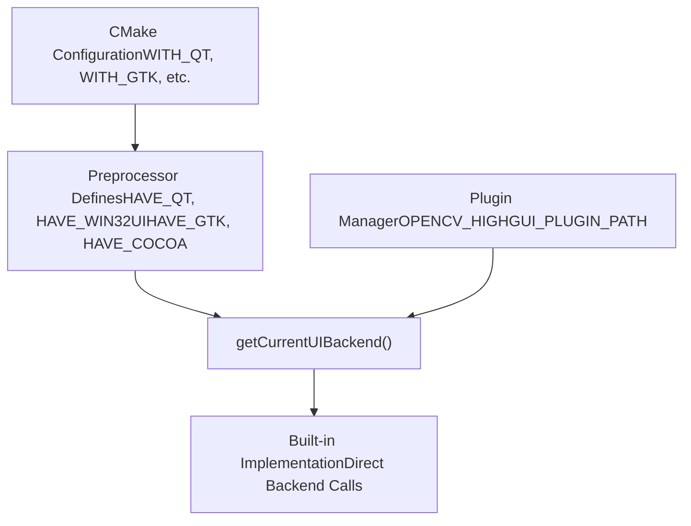
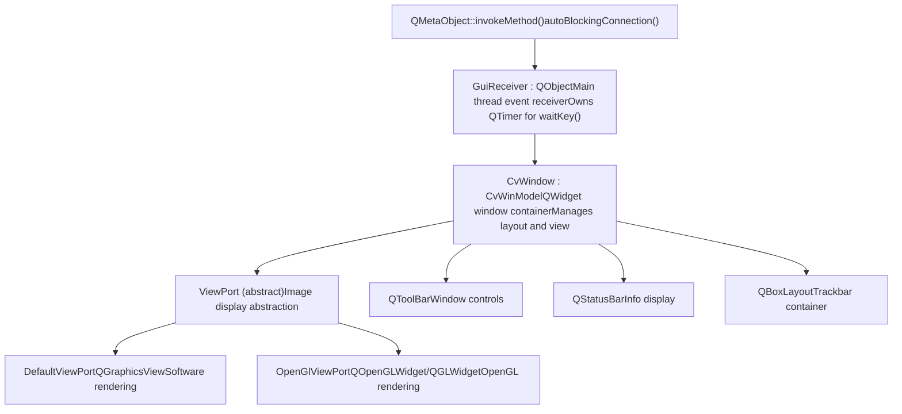
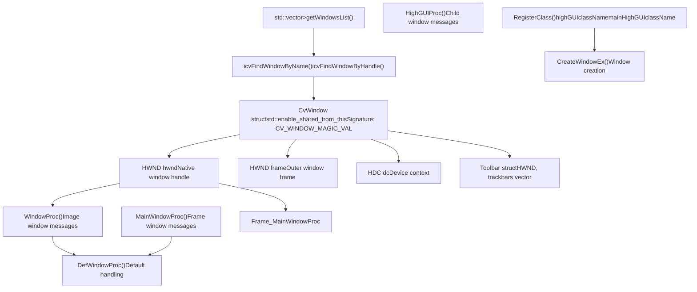
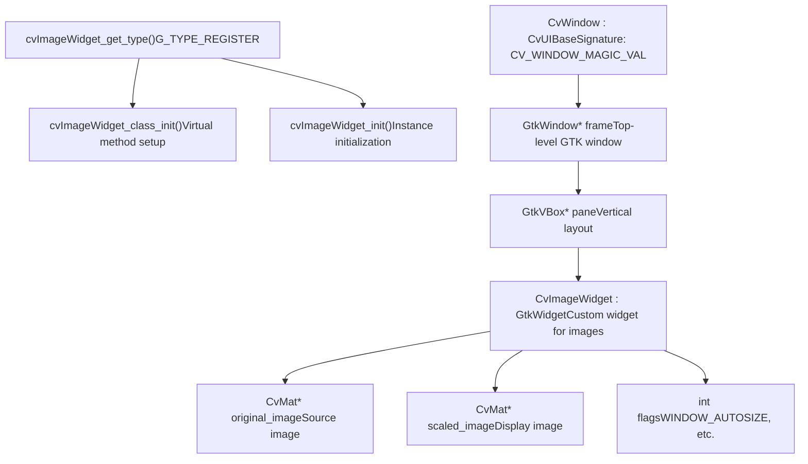
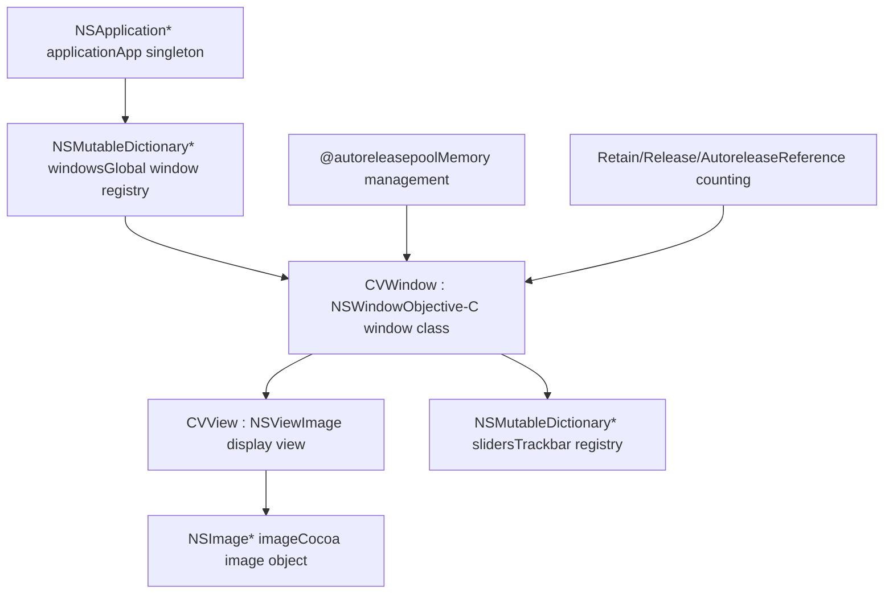
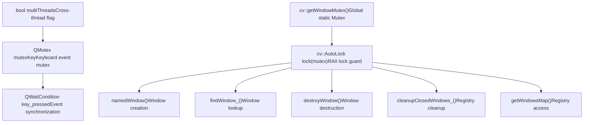
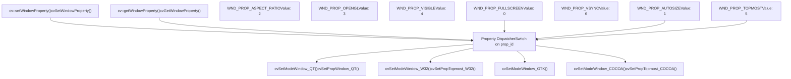
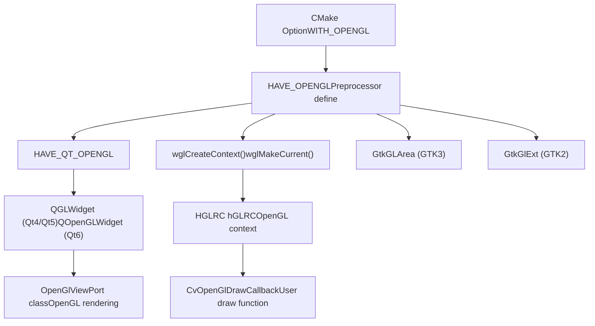
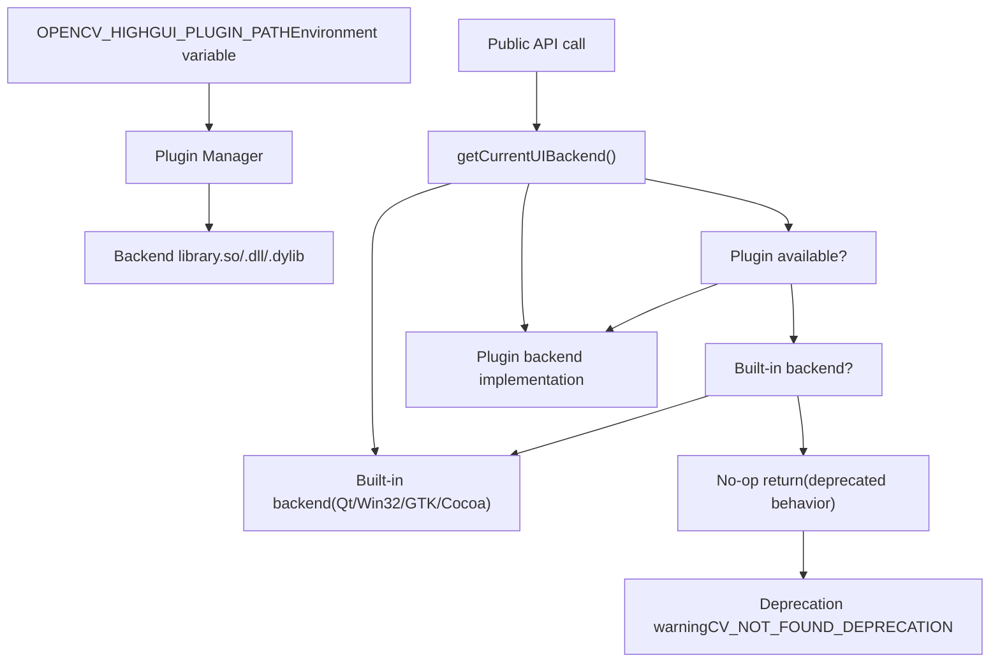

# Window Management and Multi-Backend GUI

Relevant source files

-   [CMakeLists.txt](https://github.com/opencv/opencv/blob/91c78f50/CMakeLists.txt)
-   [cmake/OpenCVCRTLinkage.cmake](https://github.com/opencv/opencv/blob/91c78f50/cmake/OpenCVCRTLinkage.cmake)
-   [cmake/OpenCVCompilerOptions.cmake](https://github.com/opencv/opencv/blob/91c78f50/cmake/OpenCVCompilerOptions.cmake)
-   [cmake/OpenCVDetectCXXCompiler.cmake](https://github.com/opencv/opencv/blob/91c78f50/cmake/OpenCVDetectCXXCompiler.cmake)
-   [cmake/OpenCVFindLibsGUI.cmake](https://github.com/opencv/opencv/blob/91c78f50/cmake/OpenCVFindLibsGUI.cmake)
-   [cmake/OpenCVFindLibsVideo.cmake](https://github.com/opencv/opencv/blob/91c78f50/cmake/OpenCVFindLibsVideo.cmake)
-   [cmake/OpenCVModule.cmake](https://github.com/opencv/opencv/blob/91c78f50/cmake/OpenCVModule.cmake)
-   [cmake/OpenCVPCHSupport.cmake](https://github.com/opencv/opencv/blob/91c78f50/cmake/OpenCVPCHSupport.cmake)
-   [cmake/OpenCVUtils.cmake](https://github.com/opencv/opencv/blob/91c78f50/cmake/OpenCVUtils.cmake)
-   [cmake/templates/OpenCVConfig.root-WIN32.cmake.in](https://github.com/opencv/opencv/blob/91c78f50/cmake/templates/OpenCVConfig.root-WIN32.cmake.in)
-   [cmake/templates/cvconfig.h.in](https://github.com/opencv/opencv/blob/91c78f50/cmake/templates/cvconfig.h.in)
-   [doc/tutorials/app/highgui\_wayland\_ubuntu.markdown](https://github.com/opencv/opencv/blob/91c78f50/doc/tutorials/app/highgui_wayland_ubuntu.markdown?plain=1)
-   [modules/core/CMakeLists.txt](https://github.com/opencv/opencv/blob/91c78f50/modules/core/CMakeLists.txt)
-   [modules/highgui/CMakeLists.txt](https://github.com/opencv/opencv/blob/91c78f50/modules/highgui/CMakeLists.txt)
-   [modules/highgui/cmake/detect\_wayland.cmake](https://github.com/opencv/opencv/blob/91c78f50/modules/highgui/cmake/detect_wayland.cmake)
-   [modules/highgui/include/opencv2/highgui.hpp](https://github.com/opencv/opencv/blob/91c78f50/modules/highgui/include/opencv2/highgui.hpp)
-   [modules/highgui/include/opencv2/highgui/highgui.hpp](https://github.com/opencv/opencv/blob/91c78f50/modules/highgui/include/opencv2/highgui/highgui.hpp)
-   [modules/highgui/include/opencv2/highgui/highgui\_c.h](https://github.com/opencv/opencv/blob/91c78f50/modules/highgui/include/opencv2/highgui/highgui_c.h)
-   [modules/highgui/src/precomp.hpp](https://github.com/opencv/opencv/blob/91c78f50/modules/highgui/src/precomp.hpp)
-   [modules/highgui/src/window.cpp](https://github.com/opencv/opencv/blob/91c78f50/modules/highgui/src/window.cpp)
-   [modules/highgui/src/window\_QT.cpp](https://github.com/opencv/opencv/blob/91c78f50/modules/highgui/src/window_QT.cpp)
-   [modules/highgui/src/window\_QT.h](https://github.com/opencv/opencv/blob/91c78f50/modules/highgui/src/window_QT.h)
-   [modules/highgui/src/window\_cocoa.mm](https://github.com/opencv/opencv/blob/91c78f50/modules/highgui/src/window_cocoa.mm)
-   [modules/highgui/src/window\_gtk.cpp](https://github.com/opencv/opencv/blob/91c78f50/modules/highgui/src/window_gtk.cpp)
-   [modules/highgui/src/window\_w32.cpp](https://github.com/opencv/opencv/blob/91c78f50/modules/highgui/src/window_w32.cpp)
-   [modules/highgui/src/window\_wayland.cpp](https://github.com/opencv/opencv/blob/91c78f50/modules/highgui/src/window_wayland.cpp)
-   [modules/highgui/test/test\_gui.cpp](https://github.com/opencv/opencv/blob/91c78f50/modules/highgui/test/test_gui.cpp)
-   [modules/highgui/test/test\_precomp.hpp](https://github.com/opencv/opencv/blob/91c78f50/modules/highgui/test/test_precomp.hpp)
-   [modules/java/CMakeLists.txt](https://github.com/opencv/opencv/blob/91c78f50/modules/java/CMakeLists.txt)
-   [modules/videoio/CMakeLists.txt](https://github.com/opencv/opencv/blob/91c78f50/modules/videoio/CMakeLists.txt)

## Purpose and Scope

This document describes the window management system in OpenCV's `highgui` module, which provides a unified API for creating and managing GUI windows across multiple platform-specific backends. The system abstracts platform differences (Qt, GTK, Win32, Cocoa, WinRT, Wayland) behind a common interface, enabling cross-platform visualization code.

For information about event handling (mouse callbacks, trackbars, buttons), see [Event Handling and Interactive Elements](/opencv/opencv/10.2-event-handling-and-interactive-elements). For image/video I/O functionality, see [Image File I/O and Codec System](/opencv/opencv/7.1-image-file-io-and-codec-system) and [Video Capture and Backend Architecture](/opencv/opencv/7.2-video-capture-and-backend-architecture).

## Architecture Overview

The highgui module implements a **dispatcher pattern** that routes window operations to platform-specific backend implementations. This design allows the same client code to work on any supported platform without modification.

**Sources**: [modules/highgui/src/window.cpp54-91](https://github.com/opencv/opencv/blob/91c78f50/modules/highgui/src/window.cpp#L54-L91) [modules/highgui/src/precomp.hpp90-152](https://github.com/opencv/opencv/blob/91c78f50/modules/highgui/src/precomp.hpp#L90-L152) [modules/highgui/include/opencv2/highgui.hpp132-272](https://github.com/opencv/opencv/blob/91c78f50/modules/highgui/include/opencv2/highgui.hpp#L132-L272)

### Backend Selection Mechanism

Backend selection occurs at **compile time** through preprocessor directives and at **runtime** through plugin loading (when enabled).

**Sources**: [modules/highgui/src/window.cpp182-273](https://github.com/opencv/opencv/blob/91c78f50/modules/highgui/src/window.cpp#L182-L273) [modules/highgui/src/precomp.hpp45-51](https://github.com/opencv/opencv/blob/91c78f50/modules/highgui/src/precomp.hpp#L45-L51)

## Window Storage and Lifecycle

### Window Registry

Windows are tracked in a centralized registry protected by a global mutex. Each window is identified by its name string.

| Component | Type | Purpose |
| --- | --- | --- |
| `getWindowsMap()` | `std::map<std::string, UIWindowBase::Ptr>` | Maps window name to window object |
| `getWindowMutex()` | `cv::Mutex` | Protects concurrent access to registry |
| `findWindow_()` | Helper function | Thread-safe window lookup |
| `cleanupClosedWindows_()` | Cleanup function | Removes inactive windows from registry |

**Sources**: [modules/highgui/src/window.cpp64-114](https://github.com/opencv/opencv/blob/91c78f50/modules/highgui/src/window.cpp#L64-L114)

### Window Lifecycle State Machine

> **[Mermaid stateDiagram]**
> *(图表结构无法解析)*

**Sources**: [modules/highgui/src/window.cpp448-503](https://github.com/opencv/opencv/blob/91c78f50/modules/highgui/src/window.cpp#L448-L503) [modules/highgui/src/window\_QT.cpp1039-1053](https://github.com/opencv/opencv/blob/91c78f50/modules/highgui/src/window_QT.cpp#L1039-L1053)

## Backend Implementations

Each backend provides platform-specific implementations of window operations. The implementations differ significantly due to platform GUI toolkit requirements.

### Qt Backend Architecture

The Qt backend uses a **receiver-slot pattern** with thread-safe method invocation via Qt's signal-slot mechanism.

**Key Features**:

-   **Thread Safety**: `autoBlockingConnection()` [modules/highgui/src/window\_QT.cpp121-125](https://github.com/opencv/opencv/blob/91c78f50/modules/highgui/src/window_QT.cpp#L121-L125) automatically selects `Qt::BlockingQueuedConnection` for cross-thread calls or `Qt::DirectConnection` for same-thread calls
-   **Multi-threading Support**: Detects `multiThreads` flag when calls originate from non-main thread [modules/highgui/src/window\_QT.cpp560-569](https://github.com/opencv/opencv/blob/91c78f50/modules/highgui/src/window_QT.cpp#L560-L569)
-   **Event Loop**: `GuiReceiver::start()` launches `qApp->exec()` for standalone Qt event processing [modules/highgui/src/window\_QT.cpp1301-1304](https://github.com/opencv/opencv/blob/91c78f50/modules/highgui/src/window_QT.cpp#L1301-L1304)

**Sources**: [modules/highgui/src/window\_QT.cpp117-853](https://github.com/opencv/opencv/blob/91c78f50/modules/highgui/src/window_QT.cpp#L117-L853) [modules/highgui/src/window\_QT.h117-383](https://github.com/opencv/opencv/blob/91c78f50/modules/highgui/src/window_QT.h#L117-L383)

### Win32 Backend Architecture

The Win32 backend uses native Windows API with window procedure callbacks and shared pointer management.

**Key Features**:

-   **Signature Validation**: Each `CvWindow` has `signature = CV_WINDOW_MAGIC_VAL` for safe pointer validation [modules/highgui/src/window\_w32.cpp181-194](https://github.com/opencv/opencv/blob/91c78f50/modules/highgui/src/window_w32.cpp#L181-L194)
-   **Shared Pointer Lifecycle**: Uses `std::enable_shared_from_this` for safe reference management [modules/highgui/src/window\_w32.cpp181-234](https://github.com/opencv/opencv/blob/91c78f50/modules/highgui/src/window_w32.cpp#L181-L234)
-   **Registry Persistence**: Saves/loads window positions using Windows Registry [modules/highgui/src/window\_w32.cpp397-521](https://github.com/opencv/opencv/blob/91c78f50/modules/highgui/src/window_w32.cpp#L397-L521)

**Sources**: [modules/highgui/src/window\_w32.cpp148-356](https://github.com/opencv/opencv/blob/91c78f50/modules/highgui/src/window_w32.cpp#L148-L356) [modules/highgui/src/window\_w32.cpp251-295](https://github.com/opencv/opencv/blob/91c78f50/modules/highgui/src/window_w32.cpp#L251-L295)

### GTK Backend Architecture

The GTK backend implements a custom `CvImageWidget` GTK widget type for image display.

**Key Features**:

-   **Custom Widget Type**: Registers `CvImageWidget` as a GType for full GTK integration [modules/highgui/src/window\_gtk.cpp504-521](https://github.com/opencv/opencv/blob/91c78f50/modules/highgui/src/window_gtk.cpp#L504-L521)
-   **GTK2/GTK3 Support**: Conditional compilation for both GTK versions [modules/highgui/src/window\_gtk.cpp57-66](https://github.com/opencv/opencv/blob/91c78f50/modules/highgui/src/window_gtk.cpp#L57-L66)
-   **Automatic Scaling**: Maintains scaled copy for non-autosize windows [modules/highgui/src/window\_gtk.cpp349-373](https://github.com/opencv/opencv/blob/91c78f50/modules/highgui/src/window_gtk.cpp#L349-L373)

**Sources**: [modules/highgui/src/window\_gtk.cpp99-522](https://github.com/opencv/opencv/blob/91c78f50/modules/highgui/src/window_gtk.cpp#L99-L522) [modules/highgui/src/window\_gtk.cpp566-672](https://github.com/opencv/opencv/blob/91c78f50/modules/highgui/src/window_gtk.cpp#L566-L672)

### Cocoa Backend Architecture

The Cocoa backend uses Objective-C for macOS native integration.

**Key Features**:

-   **Automatic Reference Counting**: Uses `@autoreleasepool` blocks for memory management [modules/highgui/src/window\_cocoa.mm156-163](https://github.com/opencv/opencv/blob/91c78f50/modules/highgui/src/window_cocoa.mm#L156-L163)
-   **Retina Display Support**: Handles high-DPI scaling with `convertSizeFromBacking:` [modules/highgui/src/window\_cocoa.mm221-236](https://github.com/opencv/opencv/blob/91c78f50/modules/highgui/src/window_cocoa.mm#L221-L236)
-   **Fullscreen Support**: Native macOS fullscreen mode toggle [modules/highgui/src/window\_cocoa.mm176-178](https://github.com/opencv/opencv/blob/91c78f50/modules/highgui/src/window_cocoa.mm#L176-L178)

**Sources**: [modules/highgui/src/window\_cocoa.mm84-132](https://github.com/opencv/opencv/blob/91c78f50/modules/highgui/src/window_cocoa.mm#L84-L132) [modules/highgui/src/window\_cocoa.mm154-164](https://github.com/opencv/opencv/blob/91c78f50/modules/highgui/src/window_cocoa.mm#L154-L164)

## Thread Safety and Synchronization

### Global Mutex Protection

All window operations are protected by a global mutex to ensure thread safety.

**Critical Sections**:

| Operation | Lock Scope | File Reference |
| --- | --- | --- |
| Window creation | Full operation | [modules/highgui/src/window.cpp454-483](https://github.com/opencv/opencv/blob/91c78f50/modules/highgui/src/window.cpp#L454-L483) |
| Window lookup | Lookup only | [modules/highgui/src/window.cpp72-91](https://github.com/opencv/opencv/blob/91c78f50/modules/highgui/src/window.cpp#L72-L91) |
| Window cleanup | Full cleanup | [modules/highgui/src/window.cpp95-114](https://github.com/opencv/opencv/blob/91c78f50/modules/highgui/src/window.cpp#L95-L114) |
| Qt method invocation | Auto-selected | [modules/highgui/src/window\_QT.cpp121-125](https://github.com/opencv/opencv/blob/91c78f50/modules/highgui/src/window_QT.cpp#L121-L125) |

**Sources**: [modules/highgui/src/window.cpp56-60](https://github.com/opencv/opencv/blob/91c78f50/modules/highgui/src/window.cpp#L56-L60) [modules/highgui/src/window\_QT.cpp100-107](https://github.com/opencv/opencv/blob/91c78f50/modules/highgui/src/window_QT.cpp#L100-L107)

### Qt Backend Threading Model

The Qt backend supports two threading modes:

**Implementation Details**:

-   **Thread Detection**: Checks if caller is in Qt main thread [modules/highgui/src/window\_QT.cpp560-561](https://github.com/opencv/opencv/blob/91c78f50/modules/highgui/src/window_QT.cpp#L560-L561)
-   **Blocking Invocation**: Uses `Qt::BlockingQueuedConnection` for cross-thread calls [modules/highgui/src/window\_QT.cpp564](https://github.com/opencv/opencv/blob/91c78f50/modules/highgui/src/window_QT.cpp#L564-L564)
-   **Direct Execution**: Calls method directly if same thread [modules/highgui/src/window\_QT.cpp568](https://github.com/opencv/opencv/blob/91c78f50/modules/highgui/src/window_QT.cpp#L568-L568)

**Sources**: [modules/highgui/src/window\_QT.cpp556-575](https://github.com/opencv/opencv/blob/91c78f50/modules/highgui/src/window_QT.cpp#L556-L575) [modules/highgui/src/window\_QT.cpp121-125](https://github.com/opencv/opencv/blob/91c78f50/modules/highgui/src/window_QT.cpp#L121-L125)

## Window Properties and Configuration

### Property System

Windows support runtime configuration through a property system that maps property IDs to backend-specific implementations.

**Sources**: [modules/highgui/src/window.cpp190-273](https://github.com/opencv/opencv/blob/91c78f50/modules/highgui/src/window.cpp#L190-L273) [modules/highgui/include/opencv2/highgui.hpp154-163](https://github.com/opencv/opencv/blob/91c78f50/modules/highgui/include/opencv2/highgui.hpp#L154-L163)

### Backend-Specific Property Support

| Property | Qt | Win32 | GTK | Cocoa | Notes |
| --- | --- | --- | --- | --- | --- |
| `WND_PROP_FULLSCREEN` | ✓ | ✓ | ✓ | ✓ | Toggles fullscreen mode |
| `WND_PROP_AUTOSIZE` | ✓ | ✓ | ✓ | ✗ | Constrains window to image size |
| `WND_PROP_ASPECT_RATIO` | ✓ | ✓ | ✓ | ✗ | Maintains image aspect ratio |
| `WND_PROP_OPENGL` | ✓ | ✓ | ✓ | ✗ | OpenGL rendering support |
| `WND_PROP_VISIBLE` | ✓ | ✓ | ✗ | ✓ | Window visibility status |
| `WND_PROP_TOPMOST` | ✗ | ✓ | ✗ | ✓ | Always-on-top behavior |
| `WND_PROP_VSYNC` | ✗ | ✓ | ✗ | ✗ | OpenGL VSync control |

**Sources**: [modules/highgui/src/window.cpp217-272](https://github.com/opencv/opencv/blob/91c78f50/modules/highgui/src/window.cpp#L217-L272) [modules/highgui/src/window.cpp306-401](https://github.com/opencv/opencv/blob/91c78f50/modules/highgui/src/window.cpp#L306-L401)

### Fullscreen Mode Implementation

Each backend implements fullscreen differently based on platform conventions:

**Win32**: Removes window borders and maximizes to monitor bounds [modules/highgui/src/window\_w32.cpp588-639](https://github.com/opencv/opencv/blob/91c78f50/modules/highgui/src/window_w32.cpp#L588-L639)

**GTK**: Uses GTK's native fullscreen API [modules/highgui/src/window\_gtk.cpp1178-1214](https://github.com/opencv/opencv/blob/91c78f50/modules/highgui/src/window_gtk.cpp#L1178-L1214)

**Qt**: Toggles Qt's fullscreen window flag [modules/highgui/src/window\_QT.cpp1026-1036](https://github.com/opencv/opencv/blob/91c78f50/modules/highgui/src/window_QT.cpp#L1026-L1036)

**Cocoa**: Uses macOS native fullscreen toggle [modules/highgui/src/window\_cocoa.mm176-178](https://github.com/opencv/opencv/blob/91c78f50/modules/highgui/src/window_cocoa.mm#L176-L178)

## API Call Flow

### Window Creation Flow

> **[Mermaid sequence]**
> *(图表结构无法解析)*

**Sources**: [modules/highgui/src/window.cpp448-486](https://github.com/opencv/opencv/blob/91c78f50/modules/highgui/src/window.cpp#L448-L486)

### Image Display Flow

> **[Mermaid sequence]**
> *(图表结构无法解析)*

**Sources**: [modules/highgui/src/window.cpp760-775](https://github.com/opencv/opencv/blob/91c78f50/modules/highgui/src/window.cpp#L760-L775) [modules/highgui/src/window\_QT.cpp1080-1109](https://github.com/opencv/opencv/blob/91c78f50/modules/highgui/src/window_QT.cpp#L1080-L1109)

### Event Processing Flow (Qt Backend)

> **[Mermaid sequence]**
> *(图表结构无法解析)*

**Sources**: [modules/highgui/src/window\_QT.cpp343-415](https://github.com/opencv/opencv/blob/91c78f50/modules/highgui/src/window_QT.cpp#L343-L415)

## OpenGL Support

### OpenGL Backend Selection

When `WINDOW_OPENGL` flag is specified, backends create OpenGL-capable windows:

**Implementation Details**:

**Qt Backend**: Uses `QGLWidget` (Qt4/5) or `QOpenGLWidget` (Qt6) [modules/highgui/src/window\_QT.h440-493](https://github.com/opencv/opencv/blob/91c78f50/modules/highgui/src/window_QT.h#L440-L493)

**Win32 Backend**: Creates OpenGL context with WGL functions [modules/highgui/src/window\_w32.cpp909-960](https://github.com/opencv/opencv/blob/91c78f50/modules/highgui/src/window_w32.cpp#L909-L960)

**GTK Backend**: Uses `GtkGLArea` (GTK3) or `GtkGlExt` (GTK2) [modules/highgui/src/window\_gtk.cpp49-75](https://github.com/opencv/opencv/blob/91c78f50/modules/highgui/src/window_gtk.cpp#L49-L75)

**Sources**: [modules/highgui/src/window\_QT.h49-76](https://github.com/opencv/opencv/blob/91c78f50/modules/highgui/src/window_QT.h#L49-L76) [modules/highgui/src/window\_w32.cpp69-76](https://github.com/opencv/opencv/blob/91c78f50/modules/highgui/src/window_w32.cpp#L69-L76)

## Integration with Backend Plugins

The highgui module supports **dynamic backend loading** through a plugin system when `OPENCV_HIGHGUI_WITHOUT_BUILTIN_BACKEND` and `ENABLE_PLUGINS` are defined.

**Plugin System Behavior**:

When plugins are enabled and no backend is available, the system **logs a warning** and performs no-op (deprecated behavior) [modules/highgui/src/window.cpp182-188](https://github.com/opencv/opencv/blob/91c78f50/modules/highgui/src/window.cpp#L182-L188) [modules/highgui/src/window.cpp204-214](https://github.com/opencv/opencv/blob/91c78f50/modules/highgui/src/window.cpp#L204-L214)

**Sources**: [modules/highgui/src/window.cpp182-273](https://github.com/opencv/opencv/blob/91c78f50/modules/highgui/src/window.cpp#L182-L273) [modules/highgui/src/precomp.hpp45-51](https://github.com/opencv/opencv/blob/91c78f50/modules/highgui/src/precomp.hpp#L45-L51)
