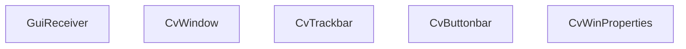

# Event Handling and Interactive Elements

Relevant source files

-   [CMakeLists.txt](https://github.com/opencv/opencv/blob/91c78f50/CMakeLists.txt)
-   [cmake/OpenCVCRTLinkage.cmake](https://github.com/opencv/opencv/blob/91c78f50/cmake/OpenCVCRTLinkage.cmake)
-   [cmake/OpenCVCompilerOptions.cmake](https://github.com/opencv/opencv/blob/91c78f50/cmake/OpenCVCompilerOptions.cmake)
-   [cmake/OpenCVDetectCXXCompiler.cmake](https://github.com/opencv/opencv/blob/91c78f50/cmake/OpenCVDetectCXXCompiler.cmake)
-   [cmake/OpenCVFindLibsGUI.cmake](https://github.com/opencv/opencv/blob/91c78f50/cmake/OpenCVFindLibsGUI.cmake)
-   [cmake/OpenCVFindLibsVideo.cmake](https://github.com/opencv/opencv/blob/91c78f50/cmake/OpenCVFindLibsVideo.cmake)
-   [cmake/OpenCVModule.cmake](https://github.com/opencv/opencv/blob/91c78f50/cmake/OpenCVModule.cmake)
-   [cmake/OpenCVPCHSupport.cmake](https://github.com/opencv/opencv/blob/91c78f50/cmake/OpenCVPCHSupport.cmake)
-   [cmake/OpenCVUtils.cmake](https://github.com/opencv/opencv/blob/91c78f50/cmake/OpenCVUtils.cmake)
-   [cmake/templates/OpenCVConfig.root-WIN32.cmake.in](https://github.com/opencv/opencv/blob/91c78f50/cmake/templates/OpenCVConfig.root-WIN32.cmake.in)
-   [cmake/templates/cvconfig.h.in](https://github.com/opencv/opencv/blob/91c78f50/cmake/templates/cvconfig.h.in)
-   [modules/core/CMakeLists.txt](https://github.com/opencv/opencv/blob/91c78f50/modules/core/CMakeLists.txt)
-   [modules/highgui/CMakeLists.txt](https://github.com/opencv/opencv/blob/91c78f50/modules/highgui/CMakeLists.txt)
-   [modules/highgui/include/opencv2/highgui.hpp](https://github.com/opencv/opencv/blob/91c78f50/modules/highgui/include/opencv2/highgui.hpp)
-   [modules/highgui/include/opencv2/highgui/highgui.hpp](https://github.com/opencv/opencv/blob/91c78f50/modules/highgui/include/opencv2/highgui/highgui.hpp)
-   [modules/highgui/include/opencv2/highgui/highgui\_c.h](https://github.com/opencv/opencv/blob/91c78f50/modules/highgui/include/opencv2/highgui/highgui_c.h)
-   [modules/highgui/src/precomp.hpp](https://github.com/opencv/opencv/blob/91c78f50/modules/highgui/src/precomp.hpp)
-   [modules/highgui/src/window.cpp](https://github.com/opencv/opencv/blob/91c78f50/modules/highgui/src/window.cpp)
-   [modules/highgui/src/window\_QT.cpp](https://github.com/opencv/opencv/blob/91c78f50/modules/highgui/src/window_QT.cpp)
-   [modules/highgui/src/window\_QT.h](https://github.com/opencv/opencv/blob/91c78f50/modules/highgui/src/window_QT.h)
-   [modules/highgui/src/window\_cocoa.mm](https://github.com/opencv/opencv/blob/91c78f50/modules/highgui/src/window_cocoa.mm)
-   [modules/highgui/src/window\_gtk.cpp](https://github.com/opencv/opencv/blob/91c78f50/modules/highgui/src/window_gtk.cpp)
-   [modules/highgui/src/window\_w32.cpp](https://github.com/opencv/opencv/blob/91c78f50/modules/highgui/src/window_w32.cpp)
-   [modules/java/CMakeLists.txt](https://github.com/opencv/opencv/blob/91c78f50/modules/java/CMakeLists.txt)
-   [modules/videoio/CMakeLists.txt](https://github.com/opencv/opencv/blob/91c78f50/modules/videoio/CMakeLists.txt)

## Overview

This page covers the interactive input layer of the `opencv_highgui` module: keyboard input via `waitKey` and `pollKey`, mouse event delivery via `setMouseCallback`, trackbar controls via `createTrackbar`, and the Qt-backend-exclusive extensions (buttons, overlay text, status bar, and text-on-image rendering).

For information about how windows are created and how the module selects a GUI backend at build time, see [10.1](/opencv/opencv/10.1-window-management-and-multi-backend-gui).

---

## waitKey and pollKey

`cv::waitKey` is the primary mechanism for pumping the event loop in a highgui application. All window repainting and event dispatch happen during this call.

| Function | Signature | Behavior |
| --- | --- | --- |
| `waitKey` | `int waitKey(int delay=0)` | Blocks up to `delay` ms; 0 = indefinite. Returns the key code or -1 on timeout. |
| `waitKeyEx` | `int waitKeyEx(int delay=0)` | Same as `waitKey` but returns full key code including special keys. |
| `pollKey` | `int pollKey()` | Non-blocking; processes pending events and returns any queued key code or -1. |

The return value is the ASCII code of the key pressed, or a platform-specific extended code for special keys (arrow keys, function keys, etc.).

### Backend Implementations

Each GUI backend has its own event loop pump.

**Qt backend** (`modules/highgui/src/window_QT.cpp`):

In single-thread mode, `cvWaitKey` calls `qApp->processEvents(QEventLoop::AllEvents)` in a busy-wait loop, sleeping 1 ms between iterations to reduce CPU usage. The key value is stored in the static `last_key` variable and protected by `mutexKey`. A `QTimer` is started for the timeout. In multi-thread mode (`multiThreads == true`), a `QWaitCondition` called `key_pressed` is used instead.

[modules/highgui/src/window\_QT.cpp343-415](https://github.com/opencv/opencv/blob/91c78f50/modules/highgui/src/window_QT.cpp#L343-L415)

**Win32 backend** (`modules/highgui/src/window_w32.cpp`):

Keyboard events arrive via `WM_KEYDOWN` and `WM_CHAR` messages in `HighGUIProc`. The key is stored in `CvWindow::last_key`. `waitKey` calls `MsgWaitForMultipleObjects` or `PeekMessage`/`TranslateMessage`/`DispatchMessage` to process Windows messages.

[modules/highgui/src/window\_w32.cpp298-304](https://github.com/opencv/opencv/blob/91c78f50/modules/highgui/src/window_w32.cpp#L298-L304)

**GTK backend** (`modules/highgui/src/window_gtk.cpp`):

Uses `gtk_main_iteration_do` during `waitKey` to process GTK events. Key events are received via `key_press_cb` signal handlers connected during window creation.

**Cocoa backend** (`modules/highgui/src/window_cocoa.mm`):

Overrides `keyDown:` in a custom `NSView` subclass and forwards characters to the shared key queue.

---

**waitKey dispatch diagram:**

*`waitKey` call flow through the backend abstraction*

Sources: [modules/highgui/src/window.cpp](https://github.com/opencv/opencv/blob/91c78f50/modules/highgui/src/window.cpp) [modules/highgui/src/window\_QT.cpp343-415](https://github.com/opencv/opencv/blob/91c78f50/modules/highgui/src/window_QT.cpp#L343-L415) [modules/highgui/src/window\_w32.cpp](https://github.com/opencv/opencv/blob/91c78f50/modules/highgui/src/window_w32.cpp) [modules/highgui/src/window\_gtk.cpp](https://github.com/opencv/opencv/blob/91c78f50/modules/highgui/src/window_gtk.cpp)

---

## Mouse Callbacks

`cv::setMouseCallback` registers a `MouseCallback` function to receive mouse events for a named window.

```
typedef void (*MouseCallback)(int event, int x, int y, int flags, void* userdata);
```
[modules/highgui/include/opencv2/highgui.hpp](https://github.com/opencv/opencv/blob/91c78f50/modules/highgui/include/opencv2/highgui.hpp)

The parameters are:

| Parameter | Meaning |
| --- | --- |
| `event` | One of the `MouseEventTypes` constants below |
| `x`, `y` | Cursor position in image pixels |
| `flags` | Bitmask of `MouseEventFlags` |
| `userdata` | The pointer passed to `setMouseCallback` |

### Mouse Event Types

Defined in `modules/highgui/include/opencv2/highgui.hpp`:

| Constant | Value | Meaning |
| --- | --- | --- |
| `EVENT_MOUSEMOVE` | 0 | Mouse moved |
| `EVENT_LBUTTONDOWN` | 1 | Left button pressed |
| `EVENT_RBUTTONDOWN` | 2 | Right button pressed |
| `EVENT_MBUTTONDOWN` | 3 | Middle button pressed |
| `EVENT_LBUTTONUP` | 4 | Left button released |
| `EVENT_RBUTTONUP` | 5 | Right button released |
| `EVENT_MBUTTONUP` | 6 | Middle button released |
| `EVENT_LBUTTONDBLCLK` | 7 | Left double-click |
| `EVENT_RBUTTONDBLCLK` | 8 | Right double-click |
| `EVENT_MBUTTONDBLCLK` | 9 | Middle double-click |
| `EVENT_MOUSEWHEEL` | 10 | Vertical scroll wheel |
| `EVENT_MOUSEHWHEEL` | 11 | Horizontal scroll wheel |

### Mouse Event Flags

| Constant | Meaning |
| --- | --- |
| `EVENT_FLAG_LBUTTON` | Left button held |
| `EVENT_FLAG_RBUTTON` | Right button held |
| `EVENT_FLAG_MBUTTON` | Middle button held |
| `EVENT_FLAG_CTRLKEY` | Ctrl key held |
| `EVENT_FLAG_SHIFTKEY` | Shift key held |
| `EVENT_FLAG_ALTKEY` | Alt key held |

### Registration and Delivery

`setMouseCallback` in `window.cpp` looks up the named window from the `WindowsMap_t` (a `std::map<std::string, UIWindowBase::Ptr>`) and calls `UIWindow::setMouseCallback` on the found instance.

[modules/highgui/src/window.cpp56-91](https://github.com/opencv/opencv/blob/91c78f50/modules/highgui/src/window.cpp#L56-L91)

In the **Win32 backend**, the callback is stored as `CvWindow::on_mouse`. The `HighGUIProc` message handler intercepts `WM_MOUSEMOVE`, `WM_LBUTTONDOWN`, `WM_LBUTTONUP`, `WM_RBUTTONDOWN`, `WM_RBUTTONUP`, `WM_MBUTTONDOWN`, `WM_MBUTTONUP`, `WM_LBUTTONDBLCLK`, and `WM_MOUSEWHEEL`, converts them to the `EVENT_*` constants, and calls `on_mouse`.

[modules/highgui/src/window\_w32.cpp181-234](https://github.com/opencv/opencv/blob/91c78f50/modules/highgui/src/window_w32.cpp#L181-L234)

In the **Qt backend**, `CvWindow` stores the callback and the image view's `mousePressEvent`, `mouseReleaseEvent`, `mouseMoveEvent`, and `wheelEvent` overrides translate Qt events into `EVENT_*` calls.

[modules/highgui/src/window\_QT.cpp](https://github.com/opencv/opencv/blob/91c78f50/modules/highgui/src/window_QT.cpp) [modules/highgui/src/window\_QT.h](https://github.com/opencv/opencv/blob/91c78f50/modules/highgui/src/window_QT.h)

*Mouse callback registration and event delivery*

Sources: [modules/highgui/src/window.cpp](https://github.com/opencv/opencv/blob/91c78f50/modules/highgui/src/window.cpp) [modules/highgui/src/window\_w32.cpp](https://github.com/opencv/opencv/blob/91c78f50/modules/highgui/src/window_w32.cpp) [modules/highgui/src/window\_QT.cpp](https://github.com/opencv/opencv/blob/91c78f50/modules/highgui/src/window_QT.cpp) [modules/highgui/src/window\_gtk.cpp](https://github.com/opencv/opencv/blob/91c78f50/modules/highgui/src/window_gtk.cpp)

---

## Trackbars

`cv::createTrackbar` attaches a slider control to a named window.

```
int createTrackbar(const String& trackbarname, const String& winname,
                   int* value, int count,
                   TrackbarCallback onChange = 0,
                   void* userdata = 0);
```
| Parameter | Meaning |
| --- | --- |
| `trackbarname` | Name label displayed on the control |
| `winname` | Target window (empty string = global control panel, Qt only) |
| `value` | Pointer to an `int` that receives position updates (deprecated usage) |
| `count` | Maximum value; minimum is 0 by default |
| `onChange` | `void callback(int pos, void* userdata)` |
| `userdata` | Passed to `onChange` |

`getTrackbarPos`, `setTrackbarPos`, `setTrackbarMax`, and `setTrackbarMin` are the companion query/update functions.

### Callback Dispatch and Compatibility Wrapper

The C++ `createTrackbar` API supports two usage patterns:

1.  **New style**: pass `onChange` + `userdata`; the `int* value` pointer may be null.
2.  **Deprecated style**: pass a non-null `int* value` which is automatically updated; legacy callbacks of type `void (*)(int)` (single-arg) are also handled internally.

`window.cpp` wraps the deprecated pattern using `TrackbarCallbackWithData`:

[modules/highgui/src/window.cpp117-150](https://github.com/opencv/opencv/blob/91c78f50/modules/highgui/src/window.cpp#L117-L150)

This struct holds a weak pointer to the `UITrackbar`, the `int* data` pointer, and the `TrackbarCallback`. Its `onChange(int pos)` method writes `*data_ = pos` and then calls the user callback. The wrapper is stored in a `TrackbarCallbacksWithData_t` vector and cleaned up when windows are closed.

*Trackbar creation and callback chain*

Sources: [modules/highgui/src/window.cpp117-200](https://github.com/opencv/opencv/blob/91c78f50/modules/highgui/src/window.cpp#L117-L200) [modules/highgui/src/window\_w32.cpp150-178](https://github.com/opencv/opencv/blob/91c78f50/modules/highgui/src/window_w32.cpp#L150-L178) [modules/highgui/src/window\_QT.h](https://github.com/opencv/opencv/blob/91c78f50/modules/highgui/src/window_QT.h)

### Win32 Trackbar Internals

In the Win32 backend, each trackbar is represented by a `CvTrackbar` struct stored in `CvWindow::toolbar.trackbars` (a `std::vector<std::shared_ptr<CvTrackbar>>`). The underlying Win32 control is a `TRACKBAR_CLASS` common control. `WM_HSCROLL` messages trigger position reads via `SendMessage(TB, TBM_GETPOS, ...)` and invoke the stored callback.

[modules/highgui/src/window\_w32.cpp150-178](https://github.com/opencv/opencv/blob/91c78f50/modules/highgui/src/window_w32.cpp#L150-L178)

### Qt Trackbar Internals

Qt trackbars (`CvTrackbar` in `window_QT.h`) are `QSlider`\-backed widgets laid out in the window's `myBarLayout`. `CvTrackbar` connects the `valueChanged` signal to the callback.

[modules/highgui/src/window\_QT.h](https://github.com/opencv/opencv/blob/91c78f50/modules/highgui/src/window_QT.h)

---

## Qt-Specific Extensions

When OpenCV is built with Qt (`HAVE_QT` defined), several additional interactive elements are available. These are declared in `highgui.hpp` inside `#ifdef HAVE_QT` guards and exposed via the C API in `highgui_c.h`.

All Qt-backend calls from any thread are dispatched to the main Qt thread via `QMetaObject::invokeMethod` with `autoBlockingConnection()` — blocking if called from a non-GUI thread, direct if already on the GUI thread.

[modules/highgui/src/window\_QT.cpp121-125](https://github.com/opencv/opencv/blob/91c78f50/modules/highgui/src/window_QT.cpp#L121-L125)

### Buttons (createButton)

```
int createButton(const String& bar_name,
                 ButtonCallback on_change,
                 void* userdata = 0,
                 int type = QT_PUSH_BUTTON,
                 bool initial_button_state = false);
```
Buttons appear in the **global control panel** (`CvWinProperties`), not inside individual windows. Three `type` values are supported:

| Constant | Value | Widget |
| --- | --- | --- |
| `QT_PUSH_BUTTON` | 0 | `QPushButton` |
| `QT_CHECKBOX` | 1 | `QCheckBox` |
| `QT_RADIOBOX` | 2 | `QRadioButton` |

The flag `QT_NEW_BUTTONBAR = 1024` can be OR'd into `type` to start a new row of buttons.

`ButtonCallback` signature: `void callback(int state, void* userdata)` where `state` is 1 (checked/pressed) or 0.

[modules/highgui/include/opencv2/highgui.hpp](https://github.com/opencv/opencv/blob/91c78f50/modules/highgui/include/opencv2/highgui.hpp) [modules/highgui/include/opencv2/highgui/highgui\_c.h89-91](https://github.com/opencv/opencv/blob/91c78f50/modules/highgui/include/opencv2/highgui/highgui_c.h#L89-L91)

### Overlay Text (displayOverlay)

```
void displayOverlay(const String& winname, const String& text, int delayms = 0);
```
C API: `cvDisplayOverlay(const char* name, const char* text, int delayms)`

Displays `text` as a semi-transparent overlay over the image area for `delayms` milliseconds (0 = permanent). Implemented by `GuiReceiver::displayInfo`, which creates a `QLabel` with a `QTimer` to auto-clear.

[modules/highgui/src/window\_QT.cpp291-302](https://github.com/opencv/opencv/blob/91c78f50/modules/highgui/src/window_QT.cpp#L291-L302)

### Status Bar (displayStatusBar)

```
void displayStatusBar(const String& winname, const String& text, int delayms = 0);
```
C API: `cvDisplayStatusBar(const char* name, const char* text, int delayms)`

Writes `text` to the window's `QStatusBar` for `delayms` ms. Requires a window opened with `WINDOW_GUI_EXPANDED` (the default Qt mode; `WINDOW_GUI_NORMAL` suppresses the toolbar and status bar).

[modules/highgui/src/window\_QT.cpp329-340](https://github.com/opencv/opencv/blob/91c78f50/modules/highgui/src/window_QT.cpp#L329-L340)

### Text Rendering on Images (fontQt / addText)

```
QtFont fontQt(const String& nameFont,
              int pointSize = -1,
              Scalar color = Scalar::all(0),
              int weight = QT_FONT_NORMAL,
              int style = QT_STYLE_NORMAL,
              int spacing = 0);

void addText(const Mat& img,
             const String& text,
             Point org,
             const QtFont& font);
```
C API: `cvFontQt(...)` / `cvAddText(const CvArr* img, ...)`

`addText` renders `text` directly into the pixel data of `img` using Qt's `QPainter`. `fontQt` creates a `QtFont` (internally a `CvFont` with Qt-specific fields) specifying the typeface, point size, RGBA color, weight (`QT_FONT_LIGHT`, `QT_FONT_NORMAL`, `QT_FONT_BOLD`, etc.), and style (`QT_STYLE_NORMAL`, `QT_STYLE_ITALIC`, `QT_STYLE_OBLIQUE`).

[modules/highgui/src/window\_QT.cpp127-159](https://github.com/opencv/opencv/blob/91c78f50/modules/highgui/src/window_QT.cpp#L127-L159) [modules/highgui/include/opencv2/highgui/highgui\_c.h62-79](https://github.com/opencv/opencv/blob/91c78f50/modules/highgui/include/opencv2/highgui/highgui_c.h#L62-L79)

### Window Parameter Persistence

```
void saveWindowParameters(const String& windowName);
void loadWindowParameters(const String& windowName);
```
Persists and restores window geometry (position, size, fullscreen state, toolbar state) using `QSettings`. The data is stored in an application-level settings store keyed by window name.

[modules/highgui/src/window\_QT.cpp305-326](https://github.com/opencv/opencv/blob/91c78f50/modules/highgui/src/window_QT.cpp#L305-L326)

---

## Qt Window and Control Hierarchy

*Qt backend internal object relationships*


Sources: [modules/highgui/src/window\_QT.h](https://github.com/opencv/opencv/blob/91c78f50/modules/highgui/src/window_QT.h) [modules/highgui/src/window\_QT.cpp](https://github.com/opencv/opencv/blob/91c78f50/modules/highgui/src/window_QT.cpp)

---

## C API

The C API in `modules/highgui/include/opencv2/highgui/highgui_c.h` exposes all the same functionality with `cv` prefixes. The C++ API in `window.cpp` calls through to these same backend entry points.

| C++ function | C function |
| --- | --- |
| `cv::waitKey` | `cvWaitKey` |
| `cv::setMouseCallback` | `cvSetMouseCallback` |
| `cv::createTrackbar` | `cvCreateTrackbar` / `cvCreateTrackbar2` |
| `cv::getTrackbarPos` | `cvGetTrackbarPos` |
| `cv::setTrackbarPos` | `cvSetTrackbarPos` |
| `cv::displayOverlay` | `cvDisplayOverlay` (Qt only) |
| `cv::displayStatusBar` | `cvDisplayStatusBar` (Qt only) |
| `cv::createButton` | `cvCreateButton` (Qt only) |
| `cv::addText` | `cvAddText` (Qt only) |
| `cv::fontQt` | `cvFontQt` (Qt only) |
| `cv::saveWindowParameters` | `cvSaveWindowParameters` (Qt only) |
| `cv::loadWindowParameters` | `cvLoadWindowParameters` (Qt only) |

Sources: [modules/highgui/include/opencv2/highgui/highgui\_c.h](https://github.com/opencv/opencv/blob/91c78f50/modules/highgui/include/opencv2/highgui/highgui_c.h) [modules/highgui/include/opencv2/highgui.hpp](https://github.com/opencv/opencv/blob/91c78f50/modules/highgui/include/opencv2/highgui.hpp)

---

## Summary: Availability by Backend

| Feature | Win32 | GTK | Qt | Cocoa | Wayland | Framebuffer |
| --- | --- | --- | --- | --- | --- | --- |
| `waitKey` | ✓ | ✓ | ✓ | ✓ | ✓ | ✓ |
| `setMouseCallback` | ✓ | ✓ | ✓ | ✓ | partial | — |
| `createTrackbar` | ✓ | ✓ | ✓ | — | — | — |
| `createButton` | — | — | ✓ | — | — | — |
| `displayOverlay` | — | — | ✓ | — | — | — |
| `displayStatusBar` | — | — | ✓ | — | — | — |
| `addText` / `fontQt` | — | — | ✓ | — | — | — |
| `saveWindowParameters` | — | — | ✓ | — | — | — |

Sources: [modules/highgui/src/window\_QT.cpp](https://github.com/opencv/opencv/blob/91c78f50/modules/highgui/src/window_QT.cpp) [modules/highgui/src/window\_w32.cpp](https://github.com/opencv/opencv/blob/91c78f50/modules/highgui/src/window_w32.cpp) [modules/highgui/src/window\_gtk.cpp](https://github.com/opencv/opencv/blob/91c78f50/modules/highgui/src/window_gtk.cpp) [modules/highgui/src/window\_cocoa.mm](https://github.com/opencv/opencv/blob/91c78f50/modules/highgui/src/window_cocoa.mm) [modules/highgui/include/opencv2/highgui.hpp](https://github.com/opencv/opencv/blob/91c78f50/modules/highgui/include/opencv2/highgui.hpp)
