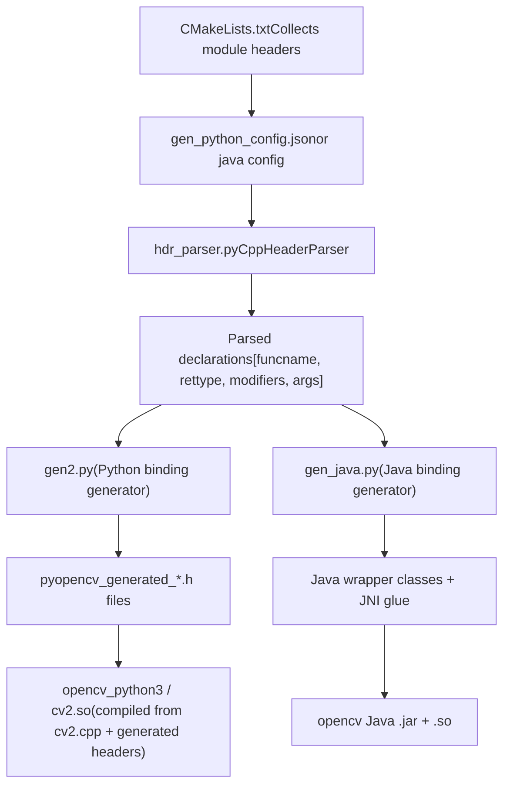
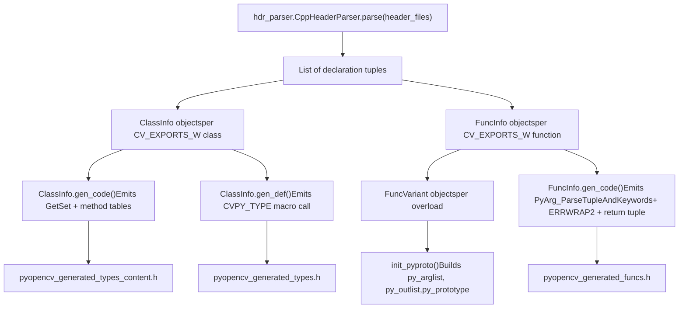
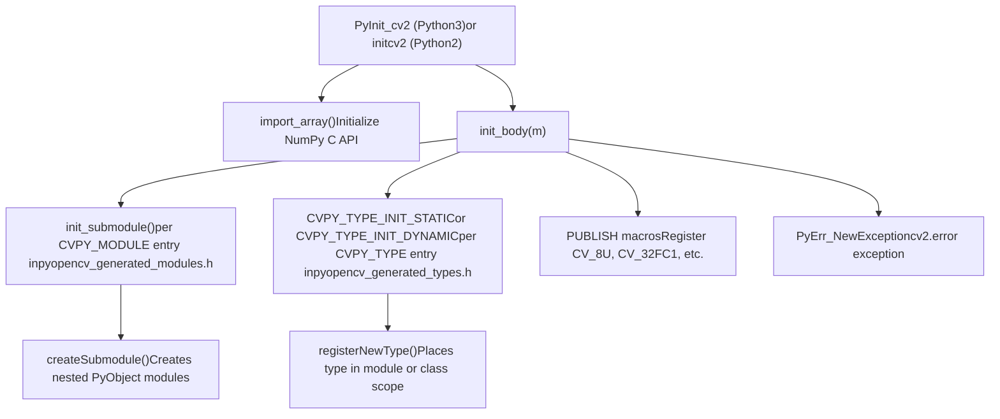
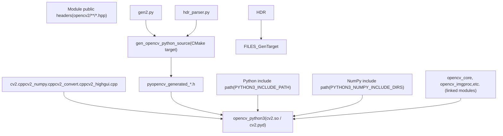

# Language Bindings

Relevant source files

-   [cmake/OpenCVDetectPython.cmake](https://github.com/opencv/opencv/blob/91c78f50/cmake/OpenCVDetectPython.cmake)
-   [cmake/OpenCVGenSetupVars.cmake](https://github.com/opencv/opencv/blob/91c78f50/cmake/OpenCVGenSetupVars.cmake)
-   [modules/core/include/opencv2/core/bindings\_utils.hpp](https://github.com/opencv/opencv/blob/91c78f50/modules/core/include/opencv2/core/bindings_utils.hpp)
-   [modules/core/misc/python/package/utils/\_\_init\_\_.py](https://github.com/opencv/opencv/blob/91c78f50/modules/core/misc/python/package/utils/__init__.py)
-   [modules/core/src/bindings\_utils.cpp](https://github.com/opencv/opencv/blob/91c78f50/modules/core/src/bindings_utils.cpp)
-   [modules/java/check-tests.py](https://github.com/opencv/opencv/blob/91c78f50/modules/java/check-tests.py)
-   [modules/python/CMakeLists.txt](https://github.com/opencv/opencv/blob/91c78f50/modules/python/CMakeLists.txt)
-   [modules/python/bindings/CMakeLists.txt](https://github.com/opencv/opencv/blob/91c78f50/modules/python/bindings/CMakeLists.txt)
-   [modules/python/common.cmake](https://github.com/opencv/opencv/blob/91c78f50/modules/python/common.cmake)
-   [modules/python/package/.gitignore](https://github.com/opencv/opencv/blob/91c78f50/modules/python/package/.gitignore)
-   [modules/python/package/cv2/\_\_init\_\_.py](https://github.com/opencv/opencv/blob/91c78f50/modules/python/package/cv2/__init__.py)
-   [modules/python/package/cv2/load\_config\_py2.py](https://github.com/opencv/opencv/blob/91c78f50/modules/python/package/cv2/load_config_py2.py)
-   [modules/python/package/cv2/load\_config\_py3.py](https://github.com/opencv/opencv/blob/91c78f50/modules/python/package/cv2/load_config_py3.py)
-   [modules/python/package/extra\_modules/misc/\_\_init\_\_.py](https://github.com/opencv/opencv/blob/91c78f50/modules/python/package/extra_modules/misc/__init__.py)
-   [modules/python/package/extra\_modules/misc/version.py](https://github.com/opencv/opencv/blob/91c78f50/modules/python/package/extra_modules/misc/version.py)
-   [modules/python/package/template/config-x.y.py.in](https://github.com/opencv/opencv/blob/91c78f50/modules/python/package/template/config-x.y.py.in)
-   [modules/python/package/template/config.py.in](https://github.com/opencv/opencv/blob/91c78f50/modules/python/package/template/config.py.in)
-   [modules/python/python2/CMakeLists.txt](https://github.com/opencv/opencv/blob/91c78f50/modules/python/python2/CMakeLists.txt)
-   [modules/python/python3/CMakeLists.txt](https://github.com/opencv/opencv/blob/91c78f50/modules/python/python3/CMakeLists.txt)
-   [modules/python/python\_loader.cmake](https://github.com/opencv/opencv/blob/91c78f50/modules/python/python_loader.cmake)
-   [modules/python/src2/cv2.cpp](https://github.com/opencv/opencv/blob/91c78f50/modules/python/src2/cv2.cpp)
-   [modules/python/src2/gen2.py](https://github.com/opencv/opencv/blob/91c78f50/modules/python/src2/gen2.py)
-   [modules/python/src2/hdr\_parser.py](https://github.com/opencv/opencv/blob/91c78f50/modules/python/src2/hdr_parser.py)
-   [modules/python/src2/pycompat.hpp](https://github.com/opencv/opencv/blob/91c78f50/modules/python/src2/pycompat.hpp)
-   [modules/python/standalone.cmake](https://github.com/opencv/opencv/blob/91c78f50/modules/python/standalone.cmake)
-   [modules/python/test/test\_fs\_cache\_dir.py](https://github.com/opencv/opencv/blob/91c78f50/modules/python/test/test_fs_cache_dir.py)
-   [modules/python/test/test\_misc.py](https://github.com/opencv/opencv/blob/91c78f50/modules/python/test/test_misc.py)

## Purpose and Scope

This page describes how OpenCV's C++ API is exposed to Python and Java, covering the annotation conventions in C++ headers, the code-generation toolchains that transform those annotations into binding code, and the runtime mechanisms that load and initialize the generated extensions.

For deep implementation details, see:

-   [Python Bindings and Code Generation](/opencv/opencv/11.1-python-bindings-and-code-generation) — `hdr_parser.py`, `gen2.py`, type mapping, the `cv2` package structure
-   [Java and Android Bindings](/opencv/opencv/11.2-java-and-android-bindings) — `gen_java.py`, JNI glue, Android-specific components

For how modules are declared and configured during the build, see [Module Configuration and ocv\_add\_module](/opencv/opencv/2.2-module-configuration-and-ocv_add_module).

---

## Common Design Principles

Both the Python and Java binding systems share the same overall strategy:

1.  **Annotate C++ headers** with special macros to mark which classes, methods, and arguments should be exposed.
2.  **Run a Python-based code generator** at build time that parses those headers and emits language-specific glue code.
3.  **Compile the glue code** into a native extension that is loaded at runtime.

This means the binding code is never written by hand — adding a new exported function requires only marking it in the header.

### C++ Annotation Macros

The macros below are recognized by both `hdr_parser.py` and `gen_java.py`:

| Macro | Applies To | Effect |
| --- | --- | --- |
| `CV_EXPORTS_W` | Functions, classes | Include in binding code generation |
| `CV_EXPORTS_W_SIMPLE` | Structs | Wrap by value (not via `Ptr<>`) |
| `CV_EXPORTS_W_MAP` | Structs | Allow construction from a Python dict / Java map |
| `CV_EXPORTS_W_PARAMS` | Structs | Treat as a named-parameter bundle; flatten into function signature |
| `CV_EXPORTS_AS(name)` | Functions, classes | Export under a different name |
| `CV_WRAP` | Class methods | Include individual method when class is not fully exported |
| `CV_WRAP_AS(name)` | Methods | Export method under a different name |
| `CV_OUT` | Function arguments | Mark as output-only; return from binding function |
| `CV_IN_OUT` | Function arguments | Mark as input and output |
| `CV_PROP` | Class members | Expose as read-only property |
| `CV_PROP_RW` | Class members | Expose as read-write property |

These macros expand to nothing in normal compilation — they are only meaningful to the binding generator scripts. See [modules/core/include/opencv2/core/bindings\_utils.hpp](https://github.com/opencv/opencv/blob/91c78f50/modules/core/include/opencv2/core/bindings_utils.hpp) for real usage examples of `CV_EXPORTS_W_SIMPLE`, `CV_EXPORTS_W_PARAMS`, `CV_PROP_RW`, etc.

---

## Architecture Overview

**High-level binding pipeline (both languages)**

Sources: [modules/python/bindings/CMakeLists.txt](https://github.com/opencv/opencv/blob/91c78f50/modules/python/bindings/CMakeLists.txt) [modules/python/src2/gen2.py1-10](https://github.com/opencv/opencv/blob/91c78f50/modules/python/src2/gen2.py#L1-L10) [modules/python/src2/hdr\_parser.py1-33](https://github.com/opencv/opencv/blob/91c78f50/modules/python/src2/hdr_parser.py#L1-L33)

---

## Python Bindings

### Code Generation Pipeline

CMake drives the code generation step. The key steps in [modules/python/bindings/CMakeLists.txt](https://github.com/opencv/opencv/blob/91c78f50/modules/python/bindings/CMakeLists.txt) are:

1.  Enumerate all build modules that declare `python` in their `WRAPPERS` list.
2.  Collect their public header files (under `include/`), plus any `misc/python/shadow*.hpp` and `misc/python/pyopencv*.hpp` files.
3.  Filter out implementation-only headers (CUDA, HAL, inline, legacy paths).
4.  Write a JSON config file (`gen_python_config.json`) listing all headers and preprocessor definitions.
5.  Run a `add_custom_command` that invokes `gen2.py --config gen_python_config.json --output_dir ...` to produce all generated files.

**Generated files** (all written to the build directory):

| File | Contents |
| --- | --- |
| `pyopencv_generated_enums.h` | `cv::` enum constants published to Python |
| `pyopencv_generated_funcs.h` | C wrapper functions for every `CV_EXPORTS_W` free function |
| `pyopencv_generated_types.h` | `CVPY_TYPE(...)` macro calls declaring each wrapped class |
| `pyopencv_generated_types_content.h` | GetSet, method tables, and converter specializations for each class |
| `pyopencv_generated_modules.h` | `CVPY_MODULE(...)` calls for each submodule |
| `pyopencv_generated_modules_content.h` | Method and constant tables for each submodule |
| `pyopencv_generated_include.h` | `#include` directives for all processed headers |
| `pyopencv_signatures.json` | JSON file recording function signatures (used for documentation) |

Sources: [modules/python/bindings/CMakeLists.txt67-131](https://github.com/opencv/opencv/blob/91c78f50/modules/python/bindings/CMakeLists.txt#L67-L131)

### Header Parsing

`hdr_parser.py` contains the `CppHeaderParser` class. It implements a line-by-line C++ scanner (not a full parser) that:

-   Recognizes class/struct declarations annotated with `CV_EXPORTS_W*` macros via `parse_class_decl`.
-   Recognizes function/method declarations annotated with `CV_EXPORTS_W` or `CV_WRAP` via `parse_func_decl`.
-   Parses argument lists, extracting types, names, default values, and modifier flags (`CV_OUT`, `CV_IN_OUT`, `CV_CARRAY`, etc.) via `parse_arg`.
-   Returns each declaration as a list: `[funcname, rettype, modifiers, args, original_rettype, docstring]`.

Each element of `args` is a 4-tuple: `[argtype, argname, default_value, modifiers]`.

Sources: [modules/python/src2/hdr\_parser.py24-32](https://github.com/opencv/opencv/blob/91c78f50/modules/python/src2/hdr_parser.py#L24-L32) [modules/python/src2/hdr\_parser.py226-387](https://github.com/opencv/opencv/blob/91c78f50/modules/python/src2/hdr_parser.py#L226-L387)

### Binding Code Generation

`gen2.py` consumes the parsed declarations and emits C++ binding code. Its main classes are:

| Class | Role |
| --- | --- |
| `ClassInfo` | Represents one wrapped C++ class; holds `ClassProp` list and method dict |
| `FuncInfo` | Represents one wrapped function or method; holds a list of `FuncVariant` for overloads |
| `FuncVariant` | Represents one overload; computes Python argument list order, optional args, return values |
| `ArgInfo` | Represents one function argument; tracks `inputarg`, `outputarg`, `isarray`, `defval` |

The generator handles several special cases:

-   **Output arguments** (`CV_OUT`): removed from Python inputs, collected as return values.
-   **Heavy output arguments** (`Mat`, `UMat`, vectors): promoted to optional Python inputs so callers can pre-allocate.
-   **Named parameter structs** (`CV_EXPORTS_W_PARAMS`): their fields are inlined into the function signature.
-   **Overload resolution**: multiple `FuncVariant` objects are attempted in sequence; UMat variants are tried last to prefer cheaper Mat conversions.
-   **Reserved Python keywords**: argument/property names matching Python keywords (`lambda`, `from`, `except`, etc.) get a trailing `_` appended.

**Code generation flow in gen2.py**

Sources: [modules/python/src2/gen2.py281-448](https://github.com/opencv/opencv/blob/91c78f50/modules/python/src2/gen2.py#L281-L448) [modules/python/src2/gen2.py597-747](https://github.com/opencv/opencv/blob/91c78f50/modules/python/src2/gen2.py#L597-L747) [modules/python/src2/gen2.py749-835](https://github.com/opencv/opencv/blob/91c78f50/modules/python/src2/gen2.py#L749-L835)

### The cv2 Extension Module

[modules/python/src2/cv2.cpp](https://github.com/opencv/opencv/blob/91c78f50/modules/python/src2/cv2.cpp) is the manually written C++ file that ties all generated code together. It:

1.  Includes all generated headers (`pyopencv_generated_include.h`, `pyopencv_generated_enums.h`, `pyopencv_generated_types.h`, etc.).
2.  Defines `PyInit_cv2()` (Python 3) or `initcv2()` (Python 2) as the module entry point.
3.  Calls `init_body()`, which:
    -   Calls `init_submodule()` for every `CVPY_MODULE` (e.g., `cv2.dnn`, `cv2.ml`).
    -   Initializes all wrapped types via `CVPY_TYPE_INIT_STATIC` / `CVPY_TYPE_INIT_DYNAMIC`.
    -   Registers them via `registerNewType()`, which places the type in the correct module or class scope.
    -   Publishes integer constants for every `CV_*` depth/type macro (`CV_8U`, `CV_32FC3`, etc.).
    -   Creates the `cv2.error` exception class.

**cv2.cpp initialization flow**

Sources: [modules/python/src2/cv2.cpp471-611](https://github.com/opencv/opencv/blob/91c78f50/modules/python/src2/cv2.cpp#L471-L611) [modules/python/src2/cv2.cpp159-246](https://github.com/opencv/opencv/blob/91c78f50/modules/python/src2/cv2.cpp#L159-L246) [modules/python/src2/cv2.cpp424-469](https://github.com/opencv/opencv/blob/91c78f50/modules/python/src2/cv2.cpp#L424-L469)

The `special_methods` table in `cv2.cpp` lists functions that are registered manually rather than generated: `_registerMatType`, `redirectError`, `createTrackbar`, `setMouseCallback`, `dnn_registerLayer`, and `dnn_unregisterLayer`.

Sources: [modules/python/src2/cv2.cpp112-125](https://github.com/opencv/opencv/blob/91c78f50/modules/python/src2/cv2.cpp#L112-L125)

### Type Mapping

Type conversion between Python and C++ is handled by the `pyopencv_to` and `pyopencv_from` template functions. Specializations exist for:

-   Primitive types (`bool`, `int`, `float`, `double`, `size_t`): mapped directly from Python numeric types.
-   `std::string` / `cv::String`: mapped from `str` or `bytes`.
-   `Mat` / `UMat`: converted via NumPy array interface (`cv2_numpy.cpp`).
-   OpenCV geometric types (`Point`, `Rect`, `Size`, `Scalar`, `Vec*`): converted from Python tuples.
-   `Ptr<T>` wrapped classes: mapped to/from their Python type objects generated by `gen2.py`.
-   `std::vector<T>`: converted from Python lists.

The `pycompat.hpp` header provides macros and inline helpers to normalize differences between Python 2 and Python 3 C APIs.

Sources: [modules/python/src2/pycompat.hpp49-205](https://github.com/opencv/opencv/blob/91c78f50/modules/python/src2/pycompat.hpp#L49-L205)

### cv2 Package Loading

When the user writes `import cv2`, Python executes [modules/python/package/cv2/\_\_init\_\_.py](https://github.com/opencv/opencv/blob/91c78f50/modules/python/package/cv2/__init__.py) The `bootstrap()` function:

1.  Reads `cv2/config.py` — sets `BINARIES_PATHS` (directory containing the native OpenCV shared libraries).
2.  Reads `cv2/config-3.x.py` — sets `PYTHON_EXTENSIONS_PATHS` (directory containing the compiled `cv2.so`/`cv2.pyd`).
3.  On Windows, calls `os.add_dll_directory()` (Python ≥ 3.8) or amends `PATH` for the binary paths.
4.  Temporarily inserts extension paths into `sys.path`, then calls `importlib.import_module("cv2")` to load the native extension.
5.  Re-exports all symbols from the native module into the package namespace.
6.  Loads any extra Python submodules found alongside the `__init__.py` (e.g., `cv2.misc`, `cv2.utils`).

This two-config design allows a single installed `cv2` package to support multiple Python versions side by side (via separate `config-3.9.py`, `config-3.10.py`, etc.).

Sources: [modules/python/package/cv2/\_\_init\_\_.py68-181](https://github.com/opencv/opencv/blob/91c78f50/modules/python/package/cv2/__init__.py#L68-L181) [modules/python/common.cmake217-236](https://github.com/opencv/opencv/blob/91c78f50/modules/python/common.cmake#L217-L236)

---

## Java Bindings

The Java binding system follows the same overall pattern as Python:

1.  `gen_java.py` parses C++ headers using a shared core with `hdr_parser.py`.
2.  It generates Java wrapper classes (e.g., `Mat.java`, `Core.java`) and JNI C++ glue code.
3.  The JNI glue is compiled into a native shared library (`libopencv_java.so` / `opencv_java.dll`).
4.  Java code calls into the native library through the generated JNI layer.

The tool `modules/java/check-tests.py` provides a coverage audit: it compares method signatures found in generated Java source files against those found in Java test files, and reports methods that lack test coverage.

For full details, see [Java and Android Bindings](/opencv/opencv/11.2-java-and-android-bindings).

Sources: [modules/java/check-tests.py1-166](https://github.com/opencv/opencv/blob/91c78f50/modules/java/check-tests.py#L1-L166)

---

## Build System Integration

The CMake build system handles Python detection and module compilation through several files:

| File | Role |
| --- | --- |
| `cmake/OpenCVDetectPython.cmake` | Locates Python interpreter, libraries, NumPy; sets `PYTHON3_INCLUDE_PATH`, `PYTHON3_NUMPY_INCLUDE_DIRS`, etc. |
| `modules/python/CMakeLists.txt` | Top-level entry; adds `bindings/`, `python2/`, `python3/` subdirectories; disables Python on Android, WinRT, Apple Framework |
| `modules/python/bindings/CMakeLists.txt` | Runs `gen2.py` via `add_custom_command`; produces `gen_opencv_python_source` CMake target |
| `modules/python/common.cmake` | Defines the compiled module target (`cv2.so`); handles linking, suffix detection, install paths |
| `modules/python/python3/CMakeLists.txt` | Activates `common.cmake` with `PYTHON=PYTHON3` |
| `modules/python/python_loader.cmake` | Copies `__init__.py`, `config.py`, `config-x.y.py` to the build tree and install tree |

The `find_python` function in `OpenCVDetectPython.cmake` supports both cross-compilation (where NumPy headers must be specified manually) and native builds (where they are queried via the Python interpreter).

Sources: [modules/python/CMakeLists.txt1-42](https://github.com/opencv/opencv/blob/91c78f50/modules/python/CMakeLists.txt#L1-L42) [modules/python/common.cmake1-50](https://github.com/opencv/opencv/blob/91c78f50/modules/python/common.cmake#L1-L50) [cmake/OpenCVDetectPython.cmake24-265](https://github.com/opencv/opencv/blob/91c78f50/cmake/OpenCVDetectPython.cmake#L24-L265)

**Build dependency graph for Python bindings**

Sources: [modules/python/bindings/CMakeLists.txt117-131](https://github.com/opencv/opencv/blob/91c78f50/modules/python/bindings/CMakeLists.txt#L117-L131) [modules/python/common.cmake22-74](https://github.com/opencv/opencv/blob/91c78f50/modules/python/common.cmake#L22-L74)
