# Python Bindings and Code Generation

Relevant source files

-   [cmake/OpenCVDetectPython.cmake](https://github.com/opencv/opencv/blob/91c78f50/cmake/OpenCVDetectPython.cmake)
-   [cmake/OpenCVGenSetupVars.cmake](https://github.com/opencv/opencv/blob/91c78f50/cmake/OpenCVGenSetupVars.cmake)
-   [modules/core/include/opencv2/core/bindings\_utils.hpp](https://github.com/opencv/opencv/blob/91c78f50/modules/core/include/opencv2/core/bindings_utils.hpp)
-   [modules/core/misc/python/package/utils/\_\_init\_\_.py](https://github.com/opencv/opencv/blob/91c78f50/modules/core/misc/python/package/utils/__init__.py)
-   [modules/core/src/bindings\_utils.cpp](https://github.com/opencv/opencv/blob/91c78f50/modules/core/src/bindings_utils.cpp)
-   [modules/python/CMakeLists.txt](https://github.com/opencv/opencv/blob/91c78f50/modules/python/CMakeLists.txt)
-   [modules/python/bindings/CMakeLists.txt](https://github.com/opencv/opencv/blob/91c78f50/modules/python/bindings/CMakeLists.txt)
-   [modules/python/common.cmake](https://github.com/opencv/opencv/blob/91c78f50/modules/python/common.cmake)
-   [modules/python/package/.gitignore](https://github.com/opencv/opencv/blob/91c78f50/modules/python/package/.gitignore)
-   [modules/python/package/cv2/\_\_init\_\_.py](https://github.com/opencv/opencv/blob/91c78f50/modules/python/package/cv2/__init__.py)
-   [modules/python/package/cv2/load\_config\_py2.py](https://github.com/opencv/opencv/blob/91c78f50/modules/python/package/cv2/load_config_py2.py)
-   [modules/python/package/cv2/load\_config\_py3.py](https://github.com/opencv/opencv/blob/91c78f50/modules/python/package/cv2/load_config_py3.py)
-   [modules/python/package/extra\_modules/misc/\_\_init\_\_.py](https://github.com/opencv/opencv/blob/91c78f50/modules/python/package/extra_modules/misc/__init__.py)
-   [modules/python/package/extra\_modules/misc/version.py](https://github.com/opencv/opencv/blob/91c78f50/modules/python/package/extra_modules/misc/version.py)
-   [modules/python/package/template/config-x.y.py.in](https://github.com/opencv/opencv/blob/91c78f50/modules/python/package/template/config-x.y.py.in)
-   [modules/python/package/template/config.py.in](https://github.com/opencv/opencv/blob/91c78f50/modules/python/package/template/config.py.in)
-   [modules/python/python2/CMakeLists.txt](https://github.com/opencv/opencv/blob/91c78f50/modules/python/python2/CMakeLists.txt)
-   [modules/python/python3/CMakeLists.txt](https://github.com/opencv/opencv/blob/91c78f50/modules/python/python3/CMakeLists.txt)
-   [modules/python/python\_loader.cmake](https://github.com/opencv/opencv/blob/91c78f50/modules/python/python_loader.cmake)
-   [modules/python/src2/cv2.cpp](https://github.com/opencv/opencv/blob/91c78f50/modules/python/src2/cv2.cpp)
-   [modules/python/src2/gen2.py](https://github.com/opencv/opencv/blob/91c78f50/modules/python/src2/gen2.py)
-   [modules/python/src2/hdr\_parser.py](https://github.com/opencv/opencv/blob/91c78f50/modules/python/src2/hdr_parser.py)
-   [modules/python/src2/pycompat.hpp](https://github.com/opencv/opencv/blob/91c78f50/modules/python/src2/pycompat.hpp)
-   [modules/python/standalone.cmake](https://github.com/opencv/opencv/blob/91c78f50/modules/python/standalone.cmake)
-   [modules/python/test/test\_fs\_cache\_dir.py](https://github.com/opencv/opencv/blob/91c78f50/modules/python/test/test_fs_cache_dir.py)
-   [modules/python/test/test\_misc.py](https://github.com/opencv/opencv/blob/91c78f50/modules/python/test/test_misc.py)

This page documents the Python binding generation system that transforms C++ OpenCV APIs into Python-accessible bindings. The system consists of three primary components: `gen2.py` (the code generator), a type conversion layer, and the `cv2` module structure. The generator parses C++ headers, creates wrapper functions with automatic type conversion, and produces a complete Python extension module with NumPy integration.

## Code Generation Pipeline

The binding generation process parses C++ headers, generates wrapper code, and produces a compiled Python extension module. The pipeline uses `hdr_parser.py` to extract API declarations, `gen2.py` to generate binding code, and CMake to compile the result.

**Code Generation and Compilation Flow**

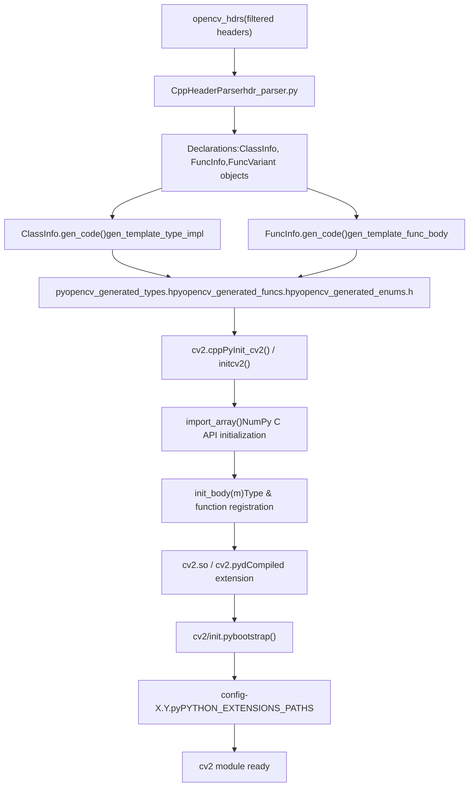
Sources: [modules/python/src2/hdr\_parser.py172-199](https://github.com/opencv/opencv/blob/91c78f50/modules/python/src2/hdr_parser.py#L172-L199) [modules/python/src2/gen2.py379-427](https://github.com/opencv/opencv/blob/91c78f50/modules/python/src2/gen2.py#L379-L427) [modules/python/src2/gen2.py836-875](https://github.com/opencv/opencv/blob/91c78f50/modules/python/src2/gen2.py#L836-L875) [modules/python/src2/cv2.cpp591-599](https://github.com/opencv/opencv/blob/91c78f50/modules/python/src2/cv2.cpp#L591-L599) [modules/python/src2/cv2.cpp473-572](https://github.com/opencv/opencv/blob/91c78f50/modules/python/src2/cv2.cpp#L473-L572) [modules/python/package/cv2/\_\_init\_\_.py68-179](https://github.com/opencv/opencv/blob/91c78f50/modules/python/package/cv2/__init__.py#L68-L179)

## Key Components

## Header Parser (hdr\_parser.py)

The `CppHeaderParser` class extracts API declarations from C++ headers by parsing functions, classes, and enums marked with OpenCV wrapper annotations. The parser produces structured declaration lists that `gen2.py` consumes.

**CppHeaderParser Declaration Extraction**

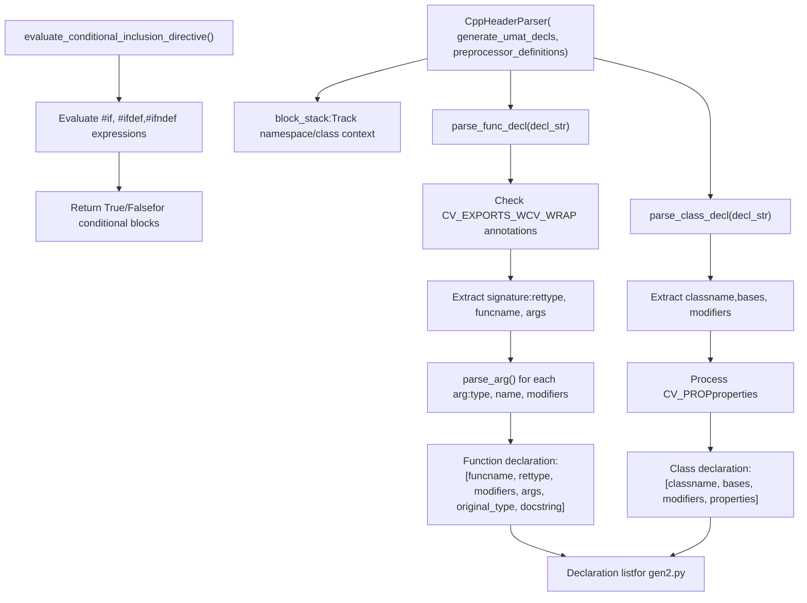
**Annotation Detection in parse\_func\_decl()**

| Annotation | Detection | Purpose |
| --- | --- | --- |
| `CV_EXPORTS_W` | `"CV_EXPORTS_W" in decl_str` | Mark function for wrapping |
| `CV_WRAP` | `"CV_WRAP" in decl_str` | Mark method for wrapping |
| `CV_OUT` | `"CV_OUT" in arg_str` | Mark output argument |
| `CV_IN_OUT` | `"CV_IN_OUT" in arg_str` | Mark input/output argument |
| `CV_WRAP_AS` | `"CV_WRAP_AS" in decl_str` | Rename exported function |

Key parser methods:

-   **`parse_func_decl(decl_str, mat, docstring)`**: Parses function signatures with `CV_EXPORTS_W`/`CV_WRAP` annotations [modules/python/src2/hdr\_parser.py556-710](https://github.com/opencv/opencv/blob/91c78f50/modules/python/src2/hdr_parser.py#L556-L710)
-   **`parse_class_decl(decl_str)`**: Extracts class declarations marked with `CV_EXPORTS_W_MAP` or `CV_EXPORTS_W_SIMPLE` [modules/python/src2/hdr\_parser.py411-442](https://github.com/opencv/opencv/blob/91c78f50/modules/python/src2/hdr_parser.py#L411-L442)
-   **`parse_arg(arg_str, argno)`**: Parses argument types and modifiers like `/O` (output), `/A` (array) [modules/python/src2/hdr\_parser.py226-387](https://github.com/opencv/opencv/blob/91c78f50/modules/python/src2/hdr_parser.py#L226-L387)
-   **`get_macro_arg(arg_str, npos)`**: Extracts macro arguments for annotations like `CV_WRAP_AS(name)` [modules/python/src2/hdr\_parser.py206-224](https://github.com/opencv/opencv/blob/91c78f50/modules/python/src2/hdr_parser.py#L206-L224)
-   **`evaluate_conditional_inclusion_directive(directive, preprocessor_definitions)`**: Evaluates `#if`, `#ifdef` conditionals [modules/python/src2/hdr\_parser.py34-169](https://github.com/opencv/opencv/blob/91c78f50/modules/python/src2/hdr_parser.py#L34-L169)

Sources: [modules/python/src2/hdr\_parser.py172-199](https://github.com/opencv/opencv/blob/91c78f50/modules/python/src2/hdr_parser.py#L172-L199) [modules/python/src2/hdr\_parser.py556-710](https://github.com/opencv/opencv/blob/91c78f50/modules/python/src2/hdr_parser.py#L556-L710) [modules/python/src2/hdr\_parser.py411-442](https://github.com/opencv/opencv/blob/91c78f50/modules/python/src2/hdr_parser.py#L411-L442) [modules/python/src2/hdr\_parser.py226-387](https://github.com/opencv/opencv/blob/91c78f50/modules/python/src2/hdr_parser.py#L226-L387)

## Binding Generator (gen2.py)

The `gen2.py` script converts parsed C++ declarations into Python wrapper code. It uses `ClassInfo` and `FuncInfo` objects to generate type conversion code, argument parsing, and C++ function calls through template substitution.

**gen2.py Core Classes and Generation Flow**

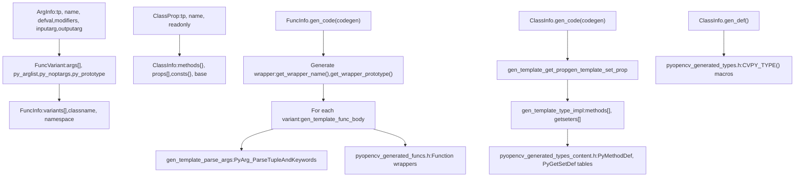
**Key Classes and Their Roles**

| Class | Purpose | Key Methods | File Location |
| --- | --- | --- | --- |
| `ArgInfo` | Represents function argument | `inputarg`, `outputarg`, `isbig()` | [modules/python/src2/gen2.py457-541](https://github.com/opencv/opencv/blob/91c78f50/modules/python/src2/gen2.py#L457-L541) |
| `FuncVariant` | Single function overload | `init_pyproto()`, generates Python prototype | [modules/python/src2/gen2.py597-747](https://github.com/opencv/opencv/blob/91c78f50/modules/python/src2/gen2.py#L597-L747) |
| `FuncInfo` | Function with all overloads | `add_variant()`, `gen_code()`, `get_wrapper_name()` | [modules/python/src2/gen2.py749-875](https://github.com/opencv/opencv/blob/91c78f50/modules/python/src2/gen2.py#L749-L875) |
| `ClassProp` | Class property | `export_name` property | [modules/python/src2/gen2.py265-279](https://github.com/opencv/opencv/blob/91c78f50/modules/python/src2/gen2.py#L265-L279) |
| `ClassInfo` | C++ class representation | `gen_code()`, `gen_def()`, `gen_map_code()` | [modules/python/src2/gen2.py281-448](https://github.com/opencv/opencv/blob/91c78f50/modules/python/src2/gen2.py#L281-L448) |

**Type Mapping in simple\_argtype\_mapping**

```
simple_argtype_mapping = {    "bool": ArgTypeInfo("bool", FormatStrings.unsigned_char, "0", True),    "int": ArgTypeInfo("int", FormatStrings.int, "0", True),    "float": ArgTypeInfo("float", FormatStrings.float, "0.f", True),    "double": ArgTypeInfo("double", FormatStrings.double, "0", True),    "string": ArgTypeInfo("std::string", FormatStrings.object, None, True),    "Mat": ArgTypeInfo("Mat", FormatStrings.object, 'Mat()', True),    "UMat": ArgTypeInfo("UMat", FormatStrings.object, 'UMat()', True),}
```
Sources: [modules/python/src2/gen2.py229-241](https://github.com/opencv/opencv/blob/91c78f50/modules/python/src2/gen2.py#L229-L241) [modules/python/src2/gen2.py281-448](https://github.com/opencv/opencv/blob/91c78f50/modules/python/src2/gen2.py#L281-L448) [modules/python/src2/gen2.py749-875](https://github.com/opencv/opencv/blob/91c78f50/modules/python/src2/gen2.py#L749-L875) [modules/python/src2/gen2.py597-747](https://github.com/opencv/opencv/blob/91c78f50/modules/python/src2/gen2.py#L597-L747)

## Type Conversion System

The type conversion system bridges Python and C++ types through specialized `pyopencv_to()` and `pyopencv_from()` template functions. These converters handle NumPy arrays, standard types, OpenCV classes, and containers with zero-copy semantics where possible.

**Type Converter Template Structure**

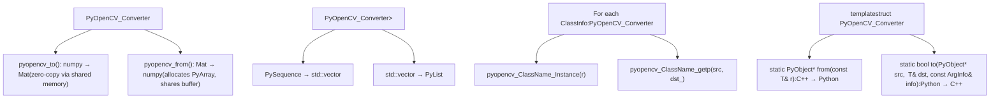
**Mat ↔ NumPy Conversion Flow**

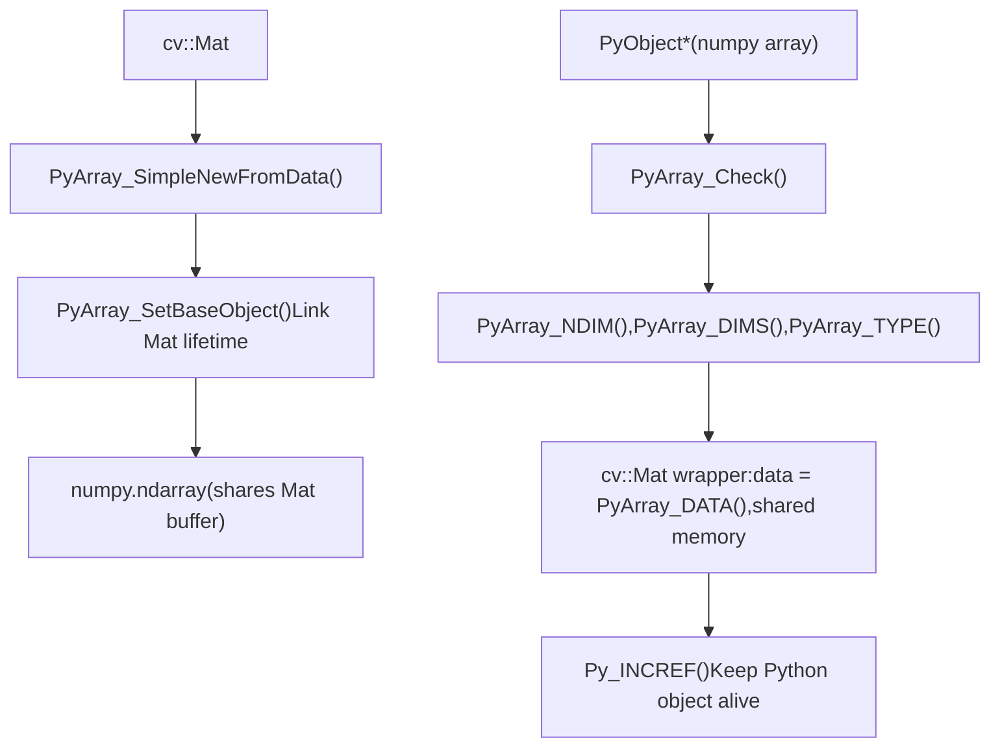
**Type Conversion Table**

| C++ Type | Python Type | Converter Location | Zero-Copy |
| --- | --- | --- | --- |
| `cv::Mat` | `numpy.ndarray` | cv2\_numpy.hpp | Yes (shared buffer) |
| `cv::UMat` | `numpy.ndarray` | cv2\_convert.hpp | No (UMat.getMat() copies) |
| `std::vector<cv::Mat>` | `List[numpy.ndarray]` | Generated | Per-Mat basis |
| `cv::Scalar` | `tuple` or array | cv2\_convert.hpp | N/A |
| `Ptr<T>` | Python class instance | Generated converters | Reference counted |
| `int`, `float`, `bool` | `int`, `float`, `bool` | cv2\_convert.hpp | N/A |
| `std::string` | `str` | cv2\_convert.hpp | No (copy) |

**Argument Conversion in Generated Wrappers**

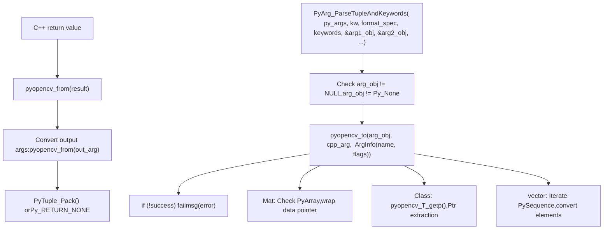
Sources: [modules/python/src2/cv2\_convert.hpp](https://github.com/opencv/opencv/blob/91c78f50/modules/python/src2/cv2_convert.hpp) [modules/python/src2/cv2\_numpy.hpp](https://github.com/opencv/opencv/blob/91c78f50/modules/python/src2/cv2_numpy.hpp) [modules/python/src2/gen2.py76-102](https://github.com/opencv/opencv/blob/91c78f50/modules/python/src2/gen2.py#L76-L102) [modules/python/src2/gen2.py876-1043](https://github.com/opencv/opencv/blob/91c78f50/modules/python/src2/gen2.py#L876-L1043)

## cv2 Module Structure and Initialization

The `cv2` module consists of a Python package loader ([modules/python/package/cv2/\_\_init\_\_.py](https://github.com/opencv/opencv/blob/91c78f50/modules/python/package/cv2/__init__.py)) and a native extension module ([modules/python/src2/cv2.cpp](https://github.com/opencv/opencv/blob/91c78f50/modules/python/src2/cv2.cpp)). The loader handles cross-platform binary discovery, while the native module provides the C++ API bindings.

**cv2 Module Components**

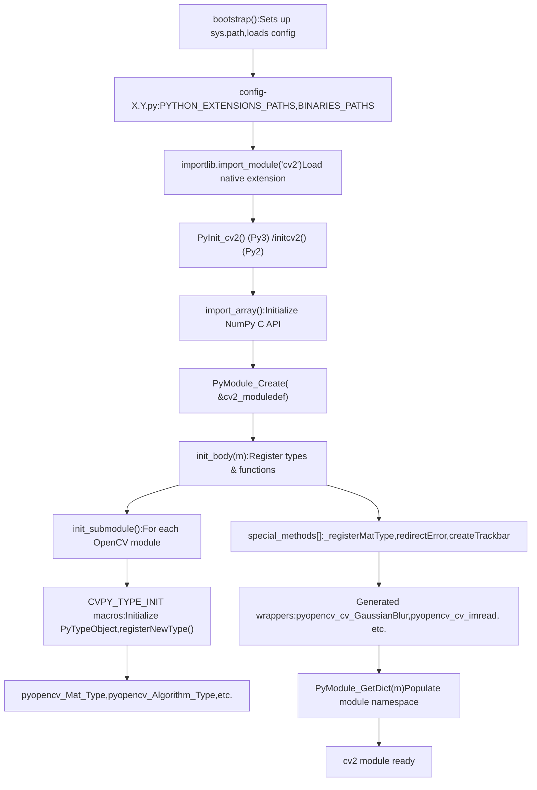
**Module Initialization Details**

The native module initialization in `cv2.cpp` follows this sequence:

1.  **NumPy API Initialization** [modules/python/src2/cv2.cpp594-607](https://github.com/opencv/opencv/blob/91c78f50/modules/python/src2/cv2.cpp#L594-L607):

    ```
    import_array(); // Initialize NumPy C APIPyObject* m = PyModule_Create(&cv2_moduledef);
    ```

2.  **Type Registration** [modules/python/src2/cv2.cpp484-491](https://github.com/opencv/opencv/blob/91c78f50/modules/python/src2/cv2.cpp#L484-L491):

    ```
    // For each CVPY_TYPE macro in pyopencv_generated_types.hCVPY_TYPE_INIT_STATIC(EXPORT_NAME, CLASS_ID, return false, BASE, CONSTRUCTOR, SCOPE)// Calls registerNewType() to add type to module or parent class scope
    ```

3.  **Submodule Population** [modules/python/src2/cv2.cpp475-481](https://github.com/opencv/opencv/blob/91c78f50/modules/python/src2/cv2.cpp#L475-L481):

    ```
    // For each CVPY_MODULE in pyopencv_generated_modules.hinit_submodule(m, MODULESTR NAMESTR, methods_##NAME, consts_##NAME)
    ```

4.  **Constant Publishing** [modules/python/src2/cv2.cpp528-568](https://github.com/opencv/opencv/blob/91c78f50/modules/python/src2/cv2.cpp#L528-L568):

    ```
    PUBLISH(CV_8U);   // Adds CV_8U constant to module dictPUBLISH(CV_32F);  // etc.
    ```


**special\_methods\[\] Registration**

| Function | Purpose | Implementation |
| --- | --- | --- |
| `_registerMatType` | Register custom Mat type | [modules/python/src2/cv2.cpp96-110](https://github.com/opencv/opencv/blob/91c78f50/modules/python/src2/cv2.cpp#L96-L110) |
| `redirectError` | Custom error handler | [modules/python/src2/cv2.cpp114](https://github.com/opencv/opencv/blob/91c78f50/modules/python/src2/cv2.cpp#L114-L114) |
| `createTrackbar` | GUI trackbar creation | [modules/python/src2/cv2.cpp116](https://github.com/opencv/opencv/blob/91c78f50/modules/python/src2/cv2.cpp#L116-L116) |
| `setMouseCallback` | Mouse event handler | [modules/python/src2/cv2.cpp118](https://github.com/opencv/opencv/blob/91c78f50/modules/python/src2/cv2.cpp#L118-L118) |
| `dnn_registerLayer` | Register DNN layer | [modules/python/src2/cv2.cpp121-122](https://github.com/opencv/opencv/blob/91c78f50/modules/python/src2/cv2.cpp#L121-L122) |

**Bootstrap Loader (cv2/**init**.py)**

The Python package uses a bootstrap system to locate and load the native extension:

1.  **Config Loading** [modules/python/package/cv2/\_\_init\_\_.py99-115](https://github.com/opencv/opencv/blob/91c78f50/modules/python/package/cv2/__init__.py#L99-L115):

    -   Loads `config.py` and `config-X.Y.py` using `exec_file_wrapper()`
    -   Sets `PYTHON_EXTENSIONS_PATHS` and `BINARIES_PATHS`
2.  **Path Manipulation** [modules/python/package/cv2/\_\_init\_\_.py132-133](https://github.com/opencv/opencv/blob/91c78f50/modules/python/package/cv2/__init__.py#L132-L133):

    -   Inserts extension paths into `sys.path`
    -   Adds binary paths to `PATH` (Windows) or `LD_LIBRARY_PATH` (Linux)
3.  **Native Import** [modules/python/package/cv2/\_\_init\_\_.py151-163](https://github.com/opencv/opencv/blob/91c78f50/modules/python/package/cv2/__init__.py#L151-L163):

    -   Imports native `cv2` module
    -   Relinks symbols to package namespace

Sources: [modules/python/src2/cv2.cpp473-612](https://github.com/opencv/opencv/blob/91c78f50/modules/python/src2/cv2.cpp#L473-L612) [modules/python/src2/cv2.cpp112-125](https://github.com/opencv/opencv/blob/91c78f50/modules/python/src2/cv2.cpp#L112-L125) [modules/python/src2/cv2.cpp96-110](https://github.com/opencv/opencv/blob/91c78f50/modules/python/src2/cv2.cpp#L96-L110) [modules/python/package/cv2/\_\_init\_\_.py68-179](https://github.com/opencv/opencv/blob/91c78f50/modules/python/package/cv2/__init__.py#L68-L179)

## Template-Based Code Generation

The code generator uses Python `string.Template` objects to produce C++ wrapper code through variable substitution. Each template defines a code pattern for functions, classes, or type conversions.

**Template Categories and Usage**

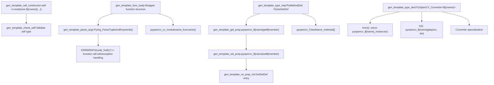
**Core Template Definitions**

Template objects defined in [modules/python/src2/gen2.py40-207](https://github.com/opencv/opencv/blob/91c78f50/modules/python/src2/gen2.py#L40-L207):

```
gen_template_func_body = Template("""$code_decl    $code_parse    {        ${code_prelude}ERRWRAP2($code_fcall);        $code_ret;    }""") gen_template_parse_args = Template("""const char* keywords[] = { $kw_list, NULL };    if( PyArg_ParseTupleAndKeywords(py_args, kw, "$fmtspec", (char**)keywords, $parse_arglist)$code_cvt )""") gen_template_type_decl = Template("""// Converter (${name})template<>struct PyOpenCV_Converter< ${cname} >{    static PyObject* from(const ${cname}& r) { return pyopencv_${name}_Instance(r); }    static bool to(PyObject* src, ${cname}& dst, const ArgInfo& info) { ... }};""")
```
**Template Variable Substitution Example**

For `cv::GaussianBlur()`:

| Variable | Value |
| --- | --- |
| `${code_decl}` | `PyObject* pyopencv_cv_GaussianBlur(...) {` |
| `${code_parse}` | `const char* keywords[] = {"src", "dst", "ksize", ...}; if(PyArg_ParseTuple...)` |
| `${code_prelude}` | `Mat _src; Mat _dst; ...` (variable declarations) |
| `${code_fcall}` | `cv::GaussianBlur(_src, _dst, _ksize, _sigmaX, _sigmaY, _borderType)` |
| `${code_ret}` | `Py_RETURN_NONE` or tuple packing for output args |
| `${kw_list}` | `"src", "dst", "ksize", "sigmaX", "sigmaY", "borderType"` |
| `${fmtspec}` | \`"OO(dd) |

**Template Usage in FuncInfo.gen\_code()**

The wrapper generation process [modules/python/src2/gen2.py836-875](https://github.com/opencv/opencv/blob/91c78f50/modules/python/src2/gen2.py#L836-L875):

1.  **Build argument lists**: Extract input args, output args, optional args
2.  **Generate declarations**: `code_decl` for local variables
3.  **Generate parsing code**: `code_parse` for `PyArg_ParseTupleAndKeywords()`
4.  **Generate conversions**: `code_cvt` for `pyopencv_to()` calls
5.  **Generate C++ call**: `code_fcall` for actual OpenCV function
6.  **Generate return**: `code_ret` for return value or output tuple
7.  **Substitute template**: Call `gen_template_func_body.substitute()`

Sources: [modules/python/src2/gen2.py40-102](https://github.com/opencv/opencv/blob/91c78f50/modules/python/src2/gen2.py#L40-L102) [modules/python/src2/gen2.py118-207](https://github.com/opencv/opencv/blob/91c78f50/modules/python/src2/gen2.py#L118-L207) [modules/python/src2/gen2.py836-875](https://github.com/opencv/opencv/blob/91c78f50/modules/python/src2/gen2.py#L836-L875)

## Build System Integration

The CMake build system orchestrates Python detection, header collection, code generation, and module compilation. The build produces separate extension modules for Python 2 and Python 3.

**CMake Build Workflow**

**Header Collection and Filtering**

Headers are collected from all modules [modules/python/bindings/CMakeLists.txt24-46](https://github.com/opencv/opencv/blob/91c78f50/modules/python/bindings/CMakeLists.txt#L24-L46):

```
foreach(m ${OPENCV_PYTHON_MODULES})  foreach(hdr ${OPENCV_MODULE_${m}_HEADERS})    ocv_is_subdir(is_sub "${OPENCV_MODULE_${m}_LOCATION}/include" "${hdr}")    if(is_sub)      list(APPEND opencv_hdrs "${hdr}")    endif()  endforeach()endforeach()
```
Filtered to exclude internal headers [modules/python/bindings/CMakeLists.txt48-65](https://github.com/opencv/opencv/blob/91c78f50/modules/python/bindings/CMakeLists.txt#L48-L65):

```
ocv_list_filterout(opencv_hdrs "modules/.*\\.h$")        # C headersocv_list_filterout(opencv_hdrs "modules/.*\\.inl\\.h*")  # Inline implementationsocv_list_filterout(opencv_hdrs "modules/.*/cuda/")       # CUDA internalsocv_list_filterout(opencv_hdrs "modules/.*/hal/")        # HAL internals
```
**Code Generation Command**

Custom command executes `gen2.py` [modules/python/bindings/CMakeLists.txt117-129](https://github.com/opencv/opencv/blob/91c78f50/modules/python/bindings/CMakeLists.txt#L117-L129):

```
add_custom_command(    OUTPUT ${cv2_generated_files}  # pyopencv_generated_*.h    COMMAND "${PYTHON_DEFAULT_EXECUTABLE}" "${PYTHON_SOURCE_DIR}/src2/gen2.py"        "--config" "${JSON_CONFIG_FILE_PATH}"  # gen_python_config.json        "--output_dir" "${CMAKE_CURRENT_BINARY_DIR}"    DEPENDS "${PYTHON_SOURCE_DIR}/src2/gen2.py"            "${PYTHON_SOURCE_DIR}/src2/hdr_parser.py"            ${opencv_hdrs})
```
**Generated Files**

Output files from code generation [modules/python/bindings/CMakeLists.txt67-76](https://github.com/opencv/opencv/blob/91c78f50/modules/python/bindings/CMakeLists.txt#L67-L76):

| File | Content | Generated By |
| --- | --- | --- |
| `pyopencv_generated_enums.h` | Enum constants | `gen2.py` enum processing |
| `pyopencv_generated_funcs.h` | Function wrappers | `FuncInfo.gen_code()` |
| `pyopencv_generated_types.h` | `CVPY_TYPE()` macros | `ClassInfo.gen_def()` |
| `pyopencv_generated_types_content.h` | Method/property tables | `ClassInfo.gen_code()` |
| `pyopencv_generated_modules.h` | Module structure | Module organization |
| `pyopencv_generated_modules_content.h` | Submodule init | `init_submodule()` data |

**Module Compilation**

The `common.cmake` script compiles the extension module [modules/python/common.cmake22-31](https://github.com/opencv/opencv/blob/91c78f50/modules/python/common.cmake#L22-L31):

```
ocv_add_library(${the_module} MODULE  ${PYTHON_SOURCE_DIR}/src2/cv2.cpp  ${PYTHON_SOURCE_DIR}/src2/cv2_util.cpp  ${PYTHON_SOURCE_DIR}/src2/cv2_numpy.cpp  ${PYTHON_SOURCE_DIR}/src2/cv2_convert.cpp  ${PYTHON_SOURCE_DIR}/src2/cv2_highgui.cpp  ${cv2_generated_hdrs})
```
Target properties [modules/python/common.cmake101-106](https://github.com/opencv/opencv/blob/91c78f50/modules/python/common.cmake#L101-L106):

```
set_target_properties(${the_module} PROPERTIES  PREFIX ""  OUTPUT_NAME cv2  SUFFIX "${CVPY_SUFFIX}"  # .cpython-38-x86_64-linux-gnu.so)
```
Sources: [cmake/OpenCVDetectPython.cmake24-265](https://github.com/opencv/opencv/blob/91c78f50/cmake/OpenCVDetectPython.cmake#L24-L265) [modules/python/CMakeLists.txt4-34](https://github.com/opencv/opencv/blob/91c78f50/modules/python/CMakeLists.txt#L4-L34) [modules/python/bindings/CMakeLists.txt15-129](https://github.com/opencv/opencv/blob/91c78f50/modules/python/bindings/CMakeLists.txt#L15-L129) [modules/python/common.cmake4-106](https://github.com/opencv/opencv/blob/91c78f50/modules/python/common.cmake#L4-L106)

## Supported Python Versions and Compatibility

The system supports generating bindings for both Python 2 and Python 3, with special handling for differences between the versions.

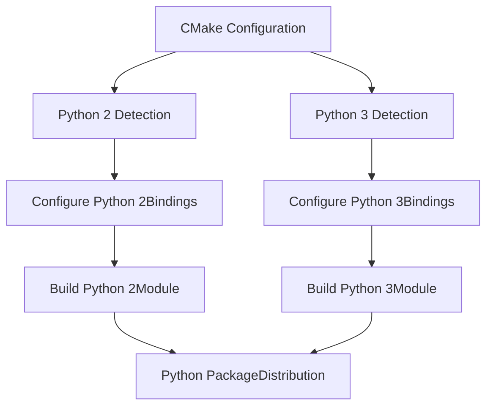
Special considerations include:

-   Different module names for different Python versions
-   Version-specific type handling
-   Limited API support for better compatibility

Sources: [modules/python/python2/CMakeLists.txt](https://github.com/opencv/opencv/blob/91c78f50/modules/python/python2/CMakeLists.txt) [modules/python/python3/CMakeLists.txt](https://github.com/opencv/opencv/blob/91c78f50/modules/python/python3/CMakeLists.txt) [modules/python/src2/pycompat.hpp](https://github.com/opencv/opencv/blob/91c78f50/modules/python/src2/pycompat.hpp)

## Runtime Architecture

When the generated Python module is loaded, it provides a bridge between Python code and the OpenCV C++ implementation.

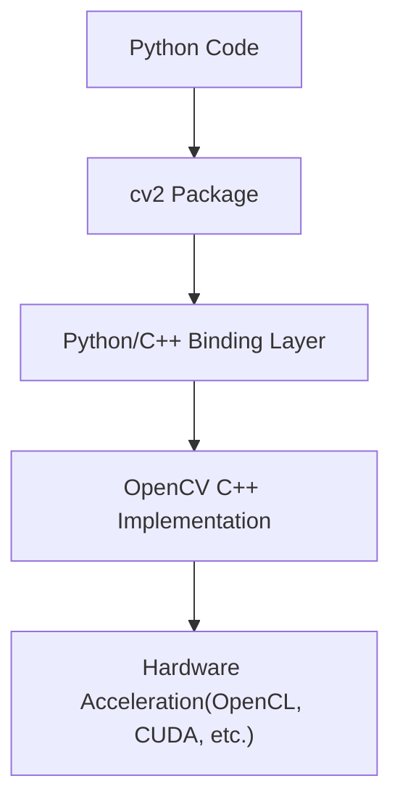
The runtime architecture includes:

-   The `cv2` Python package that provides the interface
-   A binding layer that converts between Python and C++
-   The underlying OpenCV C++ implementation
-   Support for hardware acceleration through the C++ implementation

Sources: [modules/python/src2/cv2.cpp60-608](https://github.com/opencv/opencv/blob/91c78f50/modules/python/src2/cv2.cpp#L60-L608) [modules/python/package/cv2/\_\_init\_\_.py](https://github.com/opencv/opencv/blob/91c78f50/modules/python/package/cv2/__init__.py)

## Processing Annotations in C++ Code

OpenCV uses special annotations in C++ code to control the binding generation.

| Annotation | Purpose | Example |
| --- | --- | --- |
| `CV_EXPORTS_W` | Mark a class or function for wrapping | `CV_EXPORTS_W void filter2D(...)` |
| `CV_WRAP` | Mark a method for wrapping | `CV_WRAP void setParams(...)` |
| `CV_PROP` | Mark a read-only class property | `CV_PROP int rows;` |
| `CV_PROP_RW` | Mark a read-write class property | `CV_PROP_RW double threshold;` |
| `CV_OUT` | Mark an output argument | `CV_OUT std::vector<Rect>& faces` |

The header parser recognizes these annotations and passes the information to the generator, which uses it to determine how to generate the binding code.

Sources: [modules/python/src2/hdr\_parser.py75-129](https://github.com/opencv/opencv/blob/91c78f50/modules/python/src2/hdr_parser.py#L75-L129)

## Python Type Stub Generation for IDE Support

The system also generates Python type stubs (`.pyi` files) to provide better IDE support and type checking for the Python bindings.

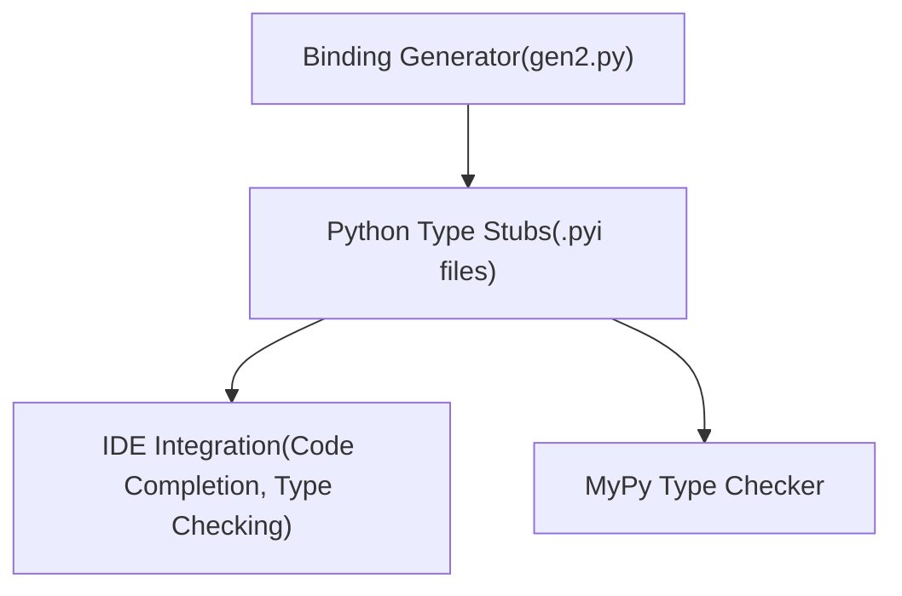
Type stubs provide:

-   Function and method signatures
-   Class definitions
-   Type hints for arguments and return values
-   Documentation strings

Sources: [modules/python/bindings/CMakeLists.txt9](https://github.com/opencv/opencv/blob/91c78f50/modules/python/bindings/CMakeLists.txt#L9-L9) [modules/python/src2/gen2.py9](https://github.com/opencv/opencv/blob/91c78f50/modules/python/src2/gen2.py#L9-L9)

## Generated Files and Their Structure

The code generator produces multiple header files that are included by `cv2.cpp` during compilation. Each file serves a specific role in the binding system.

**Generated File Organization**

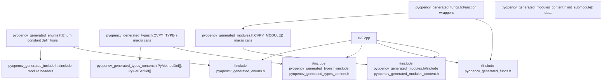
**File Contents and Structure**

**1\. pyopencv\_generated\_types.h**

Contains `CVPY_TYPE()` macro invocations for each wrapped class [modules/python/src2/gen2.py429-448](https://github.com/opencv/opencv/blob/91c78f50/modules/python/src2/gen2.py#L429-L448):

```
// Generated by ClassInfo.gen_def()CVPY_TYPE(Mat, Mat, cv::Mat, Ptr, NoBase, 0, "")CVPY_TYPE(Algorithm, Algorithm, Ptr<cv::Algorithm>, Ptr, NoBase, pyopencv_Algorithm_Algorithm, "")CVPY_TYPE(StereoBM, StereoBM, Ptr<cv::StereoBM>, Ptr, StereoMatcher, pyopencv_StereoBM_StereoBM, "")
```
**2\. pyopencv\_generated\_types\_content.h**

Contains method and property tables generated by `ClassInfo.gen_code()` [modules/python/src2/gen2.py379-427](https://github.com/opencv/opencv/blob/91c78f50/modules/python/src2/gen2.py#L379-L427):

```
// GetSet (Mat)static PyObject* pyopencv_Mat_get_rows(pyopencv_Mat_t* p, void *closure) {    return pyopencv_from(p->v->rows);}// ... // Methods (Mat)static PyObject* pyopencv_cv_Mat_ptr(PyObject* self, PyObject* py_args, PyObject* kw) {    // wrapper implementation}// ... // Tables (Mat)static PyGetSetDef pyopencv_Mat_getseters[] = {    {(char*)"rows", (getter)pyopencv_Mat_get_rows, NULL, (char*)"rows", NULL},    // ...    {NULL}}; static PyMethodDef pyopencv_Mat_methods[] = {    {"ptr", CV_PY_FN_WITH_KW(pyopencv_cv_Mat_ptr), "ptr(...) -> ..."},    // ...    {NULL, NULL}};
```
**3\. pyopencv\_generated\_funcs.h**

Contains wrapper functions for module-level functions [modules/python/src2/gen2.py836-875](https://github.com/opencv/opencv/blob/91c78f50/modules/python/src2/gen2.py#L836-L875):

```
static PyObject* pyopencv_cv_imread(PyObject* , PyObject* py_args, PyObject* kw){    using namespace cv;    // Parse arguments    const char* keywords[] = { "filename", "flags", NULL };    PyObject* filename_obj = NULL;    int flags = IMREAD_COLOR;    if( PyArg_ParseTupleAndKeywords(py_args, kw, "O|i", (char**)keywords, &filename_obj, &flags) )    {        // Convert arguments        String filename;        if (!pyopencv_to_safe(filename_obj, filename, ArgInfo("filename", 0))) return NULL;        // Call C++ function        Mat retval;        ERRWRAP2(retval = cv::imread(filename, flags));        // Return result        return pyopencv_from(retval);    }    // ...}
```
**4\. pyopencv\_generated\_modules.h**

Contains `CVPY_MODULE()` macro calls for submodule organization:

```
CVPY_MODULE("", )          // Root cv2 moduleCVPY_MODULE(".dnn", dnn)   // cv2.dnn submoduleCVPY_MODULE(".ml", ml)     // cv2.ml submodule// ...
```
**5\. pyopencv\_generated\_enums.h**

Contains enum constant definitions:

```
{"IMREAD_COLOR", static_cast<long>(cv::IMREAD_COLOR)},{"IMREAD_GRAYSCALE", static_cast<long>(cv::IMREAD_GRAYSCALE)},// ...
```
**CVPY\_TYPE Macro Expansion**

The `CVPY_TYPE()` macro expands differently based on build configuration [modules/python/src2/pycompat.hpp217-245](https://github.com/opencv/opencv/blob/91c78f50/modules/python/src2/pycompat.hpp#L217-L245):

For static types:

```
struct pyopencv_Mat_t {    PyObject_HEAD    cv::Mat v;};static PyTypeObject pyopencv_Mat_TypeXXX = { /* ... */ };static PyTypeObject * pyopencv_Mat_TypePtr = &pyopencv_Mat_TypeXXX;
```
For dynamic types (Limited API):

```
// Similar but uses PyType_FromSpec()
```
Sources: [modules/python/src2/gen2.py429-448](https://github.com/opencv/opencv/blob/91c78f50/modules/python/src2/gen2.py#L429-L448) [modules/python/src2/gen2.py379-427](https://github.com/opencv/opencv/blob/91c78f50/modules/python/src2/gen2.py#L379-L427) [modules/python/src2/gen2.py836-875](https://github.com/opencv/opencv/blob/91c78f50/modules/python/src2/gen2.py#L836-L875) [modules/python/src2/pycompat.hpp217-289](https://github.com/opencv/opencv/blob/91c78f50/modules/python/src2/pycompat.hpp#L217-L289) [modules/python/bindings/CMakeLists.txt67-76](https://github.com/opencv/opencv/blob/91c78f50/modules/python/bindings/CMakeLists.txt#L67-L76)

## Special Cases and Advanced Features

The binding system handles several special cases through custom code and generator logic.

**Overload Resolution**

Multiple C++ overloads are wrapped in a single Python function that tries each variant [modules/python/src2/gen2.py859-875](https://github.com/opencv/opencv/blob/91c78f50/modules/python/src2/gen2.py#L859-L875):

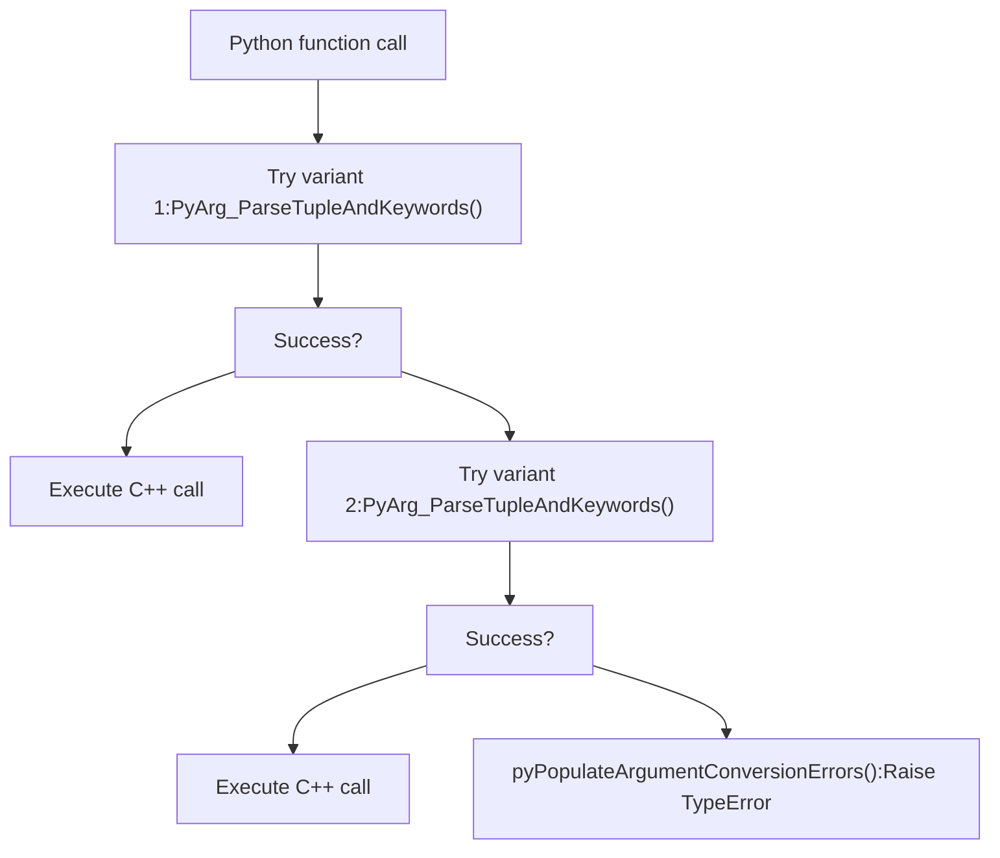
Generated overload wrapper structure:

```
static PyObject* pyopencv_cv_function(PyObject* , PyObject* py_args, PyObject* kw){    // Try variant 1    {        const char* keywords[] = { "arg1", "arg2", NULL };        if( PyArg_ParseTupleAndKeywords(...) ) {            // variant 1 implementation        }        pyPopulateArgumentConversionErrors();    }    // Try variant 2    {        const char* keywords[] = { "arg1", NULL };        if( PyArg_ParseTupleAndKeywords(...) ) {            // variant 2 implementation        }        pyPopulateArgumentConversionErrors();    }    return NULL;  // All variants failed}
```
**Output Arguments**

Arguments marked with `/O` modifier become output parameters [modules/python/src2/hdr\_parser.py242-248](https://github.com/opencv/opencv/blob/91c78f50/modules/python/src2/hdr_parser.py#L242-L248):

1.  **Removed from input**: Not in `py_arglist` if no default value
2.  **Added to output**: Added to `py_outlist` tuple
3.  **Optionally input**: If has default, appears as optional input parameter

Example: `cv::imencode(ext, img, CV_OUT std::vector<uchar>& buf)`

-   Python signature: `imencode(ext, img) -> (retval, buf)`
-   `buf` is output-only, not an input parameter

**Named Arguments (Parameters Structures)**

Functions can use parameter structures marked with `CV_EXPORTS_W_PARAMS` [modules/python/src2/gen2.py656-682](https://github.com/opencv/opencv/blob/91c78f50/modules/python/src2/gen2.py#L656-L682):

```
struct CV_EXPORTS_W_PARAMS FunctionParams {    CV_PROP_RW int lambda = -1;    CV_PROP_RW float sigma = 0.0f;}; CV_WRAP void myFunction(InputArray src, OutputArray dst, const FunctionParams& params = FunctionParams());
```
Generator expands properties as individual arguments:

```
# Python callcv2.myFunction(src, dst, lambda=5, sigma=0.5)
```
**Custom Type Conversions**

Module-specific converters in `misc/python/` directories [modules/dnn/misc/python/pyopencv\_dnn.hpp](https://github.com/opencv/opencv/blob/91c78f50/modules/dnn/misc/python/pyopencv_dnn.hpp):

```
// Custom DNN Net conversionstemplate<>bool pyopencv_to(PyObject* src, cv::dnn::Net& dst, const ArgInfo& info) {    // Custom conversion logic}
```
**UMat Handling**

UMat arguments generate special variants [modules/python/src2/gen2.py861-874](https://github.com/opencv/opencv/blob/91c78f50/modules/python/src2/gen2.py#L861-L874):

-   Mat variants are tried first (more efficient)
-   UMat variants tried after Mat variants fail
-   Prevents expensive UMat construction when Mat works

Sources: [modules/python/src2/gen2.py656-682](https://github.com/opencv/opencv/blob/91c78f50/modules/python/src2/gen2.py#L656-L682) [modules/python/src2/gen2.py859-875](https://github.com/opencv/opencv/blob/91c78f50/modules/python/src2/gen2.py#L859-L875) [modules/python/src2/hdr\_parser.py242-248](https://github.com/opencv/opencv/blob/91c78f50/modules/python/src2/hdr_parser.py#L242-L248) [modules/dnn/misc/python/pyopencv\_dnn.hpp](https://github.com/opencv/opencv/blob/91c78f50/modules/dnn/misc/python/pyopencv_dnn.hpp)

## Conclusion

The OpenCV Python API generation system automatically creates Python bindings from C++ code, enabling Python developers to leverage the full power of OpenCV. The system uses a combination of header parsing, code generation, and build system integration to create seamless bindings that feel natural to Python developers while maintaining high performance by calling into the C++ implementation.
