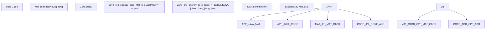
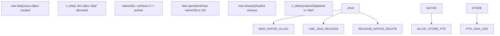
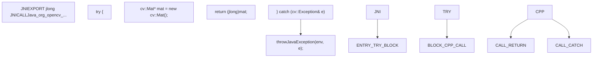
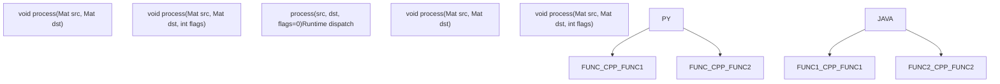
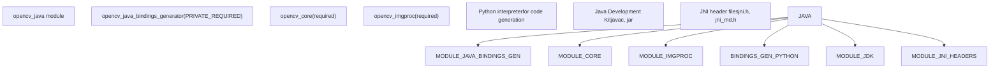

# Java/JNI Bindings and Cross-Language Design

Relevant source files

-   [cmake/android/OpenCVDetectAndroidSDK.cmake](https://github.com/opencv/opencv/blob/91c78f50/cmake/android/OpenCVDetectAndroidSDK.cmake)
-   [cmake/android/android\_ant\_projects.cmake](https://github.com/opencv/opencv/blob/91c78f50/cmake/android/android_ant_projects.cmake)
-   [modules/core/misc/java/src/java/core+Mat.java](https://github.com/opencv/opencv/blob/91c78f50/modules/core/misc/java/src/java/core+Mat.java)
-   [modules/core/misc/java/test/MatTest.java](https://github.com/opencv/opencv/blob/91c78f50/modules/core/misc/java/test/MatTest.java)
-   [modules/dnn/misc/java/gen\_dict.json](https://github.com/opencv/opencv/blob/91c78f50/modules/dnn/misc/java/gen_dict.json)
-   [modules/dnn/misc/java/src/cpp/dnn\_converters.cpp](https://github.com/opencv/opencv/blob/91c78f50/modules/dnn/misc/java/src/cpp/dnn_converters.cpp)
-   [modules/dnn/misc/java/src/cpp/dnn\_converters.hpp](https://github.com/opencv/opencv/blob/91c78f50/modules/dnn/misc/java/src/cpp/dnn_converters.hpp)
-   [modules/dnn/misc/java/test/DnnListRegressionTest.java](https://github.com/opencv/opencv/blob/91c78f50/modules/dnn/misc/java/test/DnnListRegressionTest.java)
-   [modules/dnn/misc/java/test/DnnTensorFlowTest.java](https://github.com/opencv/opencv/blob/91c78f50/modules/dnn/misc/java/test/DnnTensorFlowTest.java)
-   [modules/java/check-tests.py](https://github.com/opencv/opencv/blob/91c78f50/modules/java/check-tests.py)
-   [modules/java/generator/CMakeLists.txt](https://github.com/opencv/opencv/blob/91c78f50/modules/java/generator/CMakeLists.txt)
-   [modules/java/generator/gen\_java.py](https://github.com/opencv/opencv/blob/91c78f50/modules/java/generator/gen_java.py)
-   [modules/java/generator/src/cpp/CleanableMat.cpp](https://github.com/opencv/opencv/blob/91c78f50/modules/java/generator/src/cpp/CleanableMat.cpp)
-   [modules/java/generator/src/cpp/Mat.cpp](https://github.com/opencv/opencv/blob/91c78f50/modules/java/generator/src/cpp/Mat.cpp)
-   [modules/java/generator/src/java/org/opencv/utils/Converters.java](https://github.com/opencv/opencv/blob/91c78f50/modules/java/generator/src/java/org/opencv/utils/Converters.java)
-   [modules/java/generator/src/java9/CleanableMat.java](https://github.com/opencv/opencv/blob/91c78f50/modules/java/generator/src/java9/CleanableMat.java)
-   [modules/java/generator/src/java\_classic/CleanableMat.java](https://github.com/opencv/opencv/blob/91c78f50/modules/java/generator/src/java_classic/CleanableMat.java)
-   [modules/java/generator/templates/java\_class.prolog](https://github.com/opencv/opencv/blob/91c78f50/modules/java/generator/templates/java_class.prolog)
-   [modules/java/generator/templates/java\_class\_inherited.prolog](https://github.com/opencv/opencv/blob/91c78f50/modules/java/generator/templates/java_class_inherited.prolog)
-   [modules/java/generator/templates/java\_module.prolog](https://github.com/opencv/opencv/blob/91c78f50/modules/java/generator/templates/java_module.prolog)
-   [modules/java/jni/CMakeLists.txt](https://github.com/opencv/opencv/blob/91c78f50/modules/java/jni/CMakeLists.txt)
-   [modules/java/test/android\_test/CMakeLists.txt](https://github.com/opencv/opencv/blob/91c78f50/modules/java/test/android_test/CMakeLists.txt)
-   [modules/java/test/android\_test/build.gradle.in](https://github.com/opencv/opencv/blob/91c78f50/modules/java/test/android_test/build.gradle.in)
-   [modules/java/test/android\_test/gradle.properties](https://github.com/opencv/opencv/blob/91c78f50/modules/java/test/android_test/gradle.properties)
-   [modules/java/test/android\_test/settings.gradle](https://github.com/opencv/opencv/blob/91c78f50/modules/java/test/android_test/settings.gradle)
-   [modules/java/test/android\_test/src/org/opencv/test/OpenCVTestCase.java](https://github.com/opencv/opencv/blob/91c78f50/modules/java/test/android_test/src/org/opencv/test/OpenCVTestCase.java)
-   [modules/java/test/android\_test/src/org/opencv/test/OpenCVTestRunner.java](https://github.com/opencv/opencv/blob/91c78f50/modules/java/test/android_test/src/org/opencv/test/OpenCVTestRunner.java)
-   [modules/java/test/android\_test/src/org/opencv/test/android/KotlinTest.kt](https://github.com/opencv/opencv/blob/91c78f50/modules/java/test/android_test/src/org/opencv/test/android/KotlinTest.kt)
-   [modules/java/test/android\_test/src/org/opencv/test/android/UtilsTest.java](https://github.com/opencv/opencv/blob/91c78f50/modules/java/test/android_test/src/org/opencv/test/android/UtilsTest.java)
-   [modules/java/test/android\_test/tests\_module/build.gradle.in](https://github.com/opencv/opencv/blob/91c78f50/modules/java/test/android_test/tests_module/build.gradle.in)
-   [modules/java/test/common\_test/src/org/opencv/test/utils/ConvertersTest.java](https://github.com/opencv/opencv/blob/91c78f50/modules/java/test/common_test/src/org/opencv/test/utils/ConvertersTest.java)
-   [modules/java/test/pure\_test/src/org/opencv/test/OpenCVTestCase.java](https://github.com/opencv/opencv/blob/91c78f50/modules/java/test/pure_test/src/org/opencv/test/OpenCVTestCase.java)
-   [platforms/android/ndk-25.config.py](https://github.com/opencv/opencv/blob/91c78f50/platforms/android/ndk-25.config.py)
-   [samples/android/15-puzzle/AndroidManifest.xml](https://github.com/opencv/opencv/blob/91c78f50/samples/android/15-puzzle/AndroidManifest.xml)
-   [samples/android/15-puzzle/CMakeLists.txt](https://github.com/opencv/opencv/blob/91c78f50/samples/android/15-puzzle/CMakeLists.txt)
-   [samples/android/image-manipulations/CMakeLists.txt](https://github.com/opencv/opencv/blob/91c78f50/samples/android/image-manipulations/CMakeLists.txt)
-   [samples/android/tutorial-1-camerapreview/res/values/strings.xml](https://github.com/opencv/opencv/blob/91c78f50/samples/android/tutorial-1-camerapreview/res/values/strings.xml)
-   [samples/android/tutorial-2-mixedprocessing/CMakeLists.txt](https://github.com/opencv/opencv/blob/91c78f50/samples/android/tutorial-2-mixedprocessing/CMakeLists.txt)
-   [samples/android/tutorial-3-cameracontrol/res/layout/tutorial3\_surface\_view.xml](https://github.com/opencv/opencv/blob/91c78f50/samples/android/tutorial-3-cameracontrol/res/layout/tutorial3_surface_view.xml)
-   [samples/android/tutorial-3-cameracontrol/src/org/opencv/samples/tutorial3/Tutorial3View.java](https://github.com/opencv/opencv/blob/91c78f50/samples/android/tutorial-3-cameracontrol/src/org/opencv/samples/tutorial3/Tutorial3View.java)

## Purpose and Scope

This document explains OpenCV's Java binding system and the general cross-language design patterns used across all OpenCV bindings. The focus is on the Java Native Interface (JNI) wrapper architecture, Java code generation pipeline, and the common binding design principles shared with Python and other language bindings.

For information about the specific Python binding implementation details, see [Python API Generation and Binding](/opencv/opencv/11.1-python-bindings-and-code-generation).

## Java/JNI Architecture Overview

OpenCV's Java bindings use the Java Native Interface (JNI) to bridge Java code with native C++ OpenCV libraries. The system follows a declarative approach where C++ headers annotated with `CV_WRAP` macros are processed to generate both Java classes and corresponding JNI wrapper functions.

### Java Binding Pipeline

Sources: [modules/java/CMakeLists.txt1-72](https://github.com/opencv/opencv/blob/91c78f50/modules/java/CMakeLists.txt#L1-L72) [modules/java/common.cmake](https://github.com/opencv/opencv/blob/91c78f50/modules/java/common.cmake) (referenced), [modules/python/src2/hdr\_parser.py172-200](https://github.com/opencv/opencv/blob/91c78f50/modules/python/src2/hdr_parser.py#L172-L200)

### JNI Wrapper Architecture

The Java bindings consist of two layers:

**Java Layer**: Pure Java classes that provide type-safe APIs and memory management. Each OpenCV C++ class maps to a Java class with `nativeObj` field storing the native pointer.

**JNI Layer**: C++ functions with JNI signatures (`JNIEXPORT`/`JNICALL`) that marshal data between Java and C++, handle type conversions, and call the underlying OpenCV functions.

Sources: [modules/java/CMakeLists.txt58-63](https://github.com/opencv/opencv/blob/91c78f50/modules/java/CMakeLists.txt#L58-L63) [modules/python/src2/hdr\_parser.py556-620](https://github.com/opencv/opencv/blob/91c78f50/modules/python/src2/hdr_parser.py#L556-L620) (shared parser logic)

## JNI Code Generation System

The Java binding generator processes parsed C++ declarations to produce Java wrapper classes and JNI bridge functions. The generator must handle Java-specific requirements like explicit memory management, package organization, and JNI type marshalling.

### Java Generation Pipeline

```mermaid
flowchart TD
    PARSED_CLASSES["Class DeclarationsClassInfo objects"]
    PARSED_FUNCS["Function DeclarationsFuncInfo with args"]
    PARSED_CONSTS["Constants and Enumsname-value pairs"]
    JAVA_CLASS_GEN["Java Class Generatorgenerate Java source"]
    PACKAGE_RESOLVER["Package Resolutionorg.opencv.core, etc."]
    METHOD_GEN["Method Generatornative declarations"]
    FIELD_GEN["Field Generatorpublic long nativeObj"]
    JNI_FUNC_GEN["JNI Function GeneratorJNIEXPORT signatures"]
    TYPE_MARSHALLER["Type Marshallerjlong <-> cv::Mat*"]
    EXCEPTION_HANDLER["Exception HandlerC++ -> Java exceptions"]
    JAVA_SRC["Java Source FilesMat.java, Core.java"]
    JNI_CPP_SRC["JNI C++ Sourcesorg_opencv_core_Mat.cpp"]
    JNI_HDR["JNI Headersorg_opencv_core_Mat.h"]

    PARSED --> CLASSES_JAVA_CLASS_GEN
    PARSED --> FUNCS_JAVA_CLASS_GEN
    PARSED --> CONSTS_JAVA_CLASS_GEN
    JAVA --> CLASS_GEN_PACKAGE_RESOLVER
    PACKAGE --> RESOLVER_METHOD_GEN
    PACKAGE --> RESOLVER_FIELD_GEN
    PARSED --> CLASSES_JNI_FUNC_GEN
    PARSED --> FUNCS_JNI_FUNC_GEN
    JNI --> FUNC_GEN_TYPE_MARSHALLER
    JNI --> FUNC_GEN_EXCEPTION_HANDLER
    METHOD --> GEN_JAVA_SRC
    FIELD --> GEN_JAVA_SRC
    TYPE --> MARSHALLER_JNI_CPP_SRC
    EXCEPTION --> HANDLER_JNI_CPP_SRC
    JNI --> FUNC_GEN_JNI_HDR
```

Sources: [modules/java/CMakeLists.txt1-18](https://github.com/opencv/opencv/blob/91c78f50/modules/java/CMakeLists.txt#L1-L18) [modules/python/src2/gen2.py597-747](https://github.com/opencv/opencv/blob/91c78f50/modules/python/src2/gen2.py#L597-L747) (similar architecture)

### JNI Naming Conventions

The generator follows strict JNI naming conventions to map Java native methods to C++ function names:

| Java Declaration | JNI Function Name | Notes |
| --- | --- | --- |
| `Mat.nativeObj` | Field holding C++ pointer | Stored as `jlong` (64-bit) |
| `native long n_Mat()` | `Java_org_opencv_core_Mat_n_1Mat` | Constructor wrapper |
| `native void n_delete(long)` | `Java_org_opencv_core_Mat_n_1delete` | Destructor wrapper |
| `Core.add(...)` | `Java_org_opencv_core_Core_add` | Static method wrapper |

The `n_` prefix distinguishes native methods in Java source, and `_1` encodes underscores in JNI function names.

Sources: [modules/java/CMakeLists.txt20-36](https://github.com/opencv/opencv/blob/91c78f50/modules/java/CMakeLists.txt#L20-L36)

### Annotation Processing for Java

The header parser recognizes binding annotations that control Java code generation:

| Annotation | Purpose | Java Impact |
| --- | --- | --- |
| `CV_WRAP` | Mark function/method for wrapping | Generates public Java method + JNI wrapper |
| `CV_EXPORTS_W` | Mark class for wrapping | Generates Java class with `nativeObj` field |
| `CV_OUT` | Output parameter modifier | Becomes additional return value or array parameter |
| `CV_IN_OUT` | Input/output parameter modifier | Must use array wrapper for mutability |
| `CV_WRAP_AS()` | Provide alternative name | Java method uses alternative name |

Sources: [modules/python/src2/hdr\_parser.py172-200](https://github.com/opencv/opencv/blob/91c78f50/modules/python/src2/hdr_parser.py#L172-L200) [modules/python/src2/hdr\_parser.py556-620](https://github.com/opencv/opencv/blob/91c78f50/modules/python/src2/hdr_parser.py#L556-L620)

## Java Type Conversion and Memory Management

The Java bindings implement explicit memory management due to Java's lack of deterministic finalization. Each wrapped C++ object is represented by a `long nativeObj` field in Java, which stores the pointer to the native C++ object.

### Memory Management Pattern

Sources: [modules/java/CMakeLists.txt58-63](https://github.com/opencv/opencv/blob/91c78f50/modules/java/CMakeLists.txt#L58-L63)

### Type Conversion System

The JNI layer converts between Java and C++ types using explicit marshalling functions:

| C++ Type | Java Type | JNI Type | Conversion Method |
| --- | --- | --- | --- |
| `cv::Mat` | `Mat` | `jlong` | Store `cv::Mat*` as pointer |
| `std::vector<int>` | `MatOfInt` | `jlong` | Wrap in `Mat`, convert on access |
| `cv::Point` | `Point` | `jobject` | Field-by-field transfer |
| `std::string` | `String` | `jstring` | `JNIEnv->GetStringUTFChars()` |
| `int`, `float`, etc. | Primitives | `jint`, `jfloat` | Direct cast |
| `std::vector<cv::Mat>` | `List<Mat>` | `jlong` | Convert to array of pointers |

### JNI Exception Handling

C++ exceptions are caught in JNI wrappers and converted to Java exceptions:

Sources: [modules/python/src2/gen2.py597-747](https://github.com/opencv/opencv/blob/91c78f50/modules/python/src2/gen2.py#L597-L747) (similar pattern for Python), [modules/java/common.cmake](https://github.com/opencv/opencv/blob/91c78f50/modules/java/common.cmake) (referenced)

### Vector and Matrix Specialized Classes

Java bindings provide specialized wrapper classes for common `std::vector<T>` instantiations:

-   `MatOfByte` - wraps `std::vector<uchar>`
-   `MatOfInt` - wraps `std::vector<int>`
-   `MatOfFloat` - wraps `std::vector<float>`
-   `MatOfPoint` - wraps `std::vector<cv::Point>`
-   `MatOfPoint2f` - wraps `std::vector<cv::Point2f>`
-   `MatOfRect` - wraps `std::vector<cv::Rect>`

These classes inherit from `Mat` and provide typed `toArray()` and `fromArray()` methods for convenient conversion between Java arrays and OpenCV data structures.

Sources: [modules/java/CMakeLists.txt20-36](https://github.com/opencv/opencv/blob/91c78f50/modules/java/CMakeLists.txt#L20-L36)

## Cross-Language Design Patterns

While Java and Python bindings have different implementations, they share common design patterns to provide consistent behavior across languages.

### Shared Header Parsing

Both Java and Python bindings use the same `hdr_parser.py` module to parse C++ headers:

```mermaid
flowchart TD
    CPP_HEADERS["C++ Headersopencv2/*.hpp"]
    HDR_PARSER["hdr_parser.pyCppHeaderParser class"]
    PARSE_FUNC["parse_func_decl()parse_class_decl()"]
    PYTHON_GEN["gen2.pyPython generator"]
    JAVA_GEN["gen_java.pyJava generator"]
    FUNC_INFO["FuncInfo[name, rettype, args]"]
    CLASS_INFO["ClassInfo[name, methods, props]"]
    CONST_INFO["Constants[name, value]"]

    CPP --> HEADERS_HDR_PARSER
    HDR --> PARSER_PARSE_FUNC
    PARSE --> FUNC_FUNC_INFO
    PARSE --> FUNC_CLASS_INFO
    PARSE --> FUNC_CONST_INFO
    FUNC --> INFO_PYTHON_GEN
    FUNC --> INFO_JAVA_GEN
    CLASS --> INFO_PYTHON_GEN
    CLASS --> INFO_JAVA_GEN
    CONST --> INFO_PYTHON_GEN
    CONST --> INFO_JAVA_GEN
```

Sources: [modules/python/src2/hdr\_parser.py172-555](https://github.com/opencv/opencv/blob/91c78f50/modules/python/src2/hdr_parser.py#L172-L555) [modules/python/src2/gen2.py1-50](https://github.com/opencv/opencv/blob/91c78f50/modules/python/src2/gen2.py#L1-L50)

### Common Binding Strategies

| Design Aspect | Python Approach | Java Approach | Shared Pattern |
| --- | --- | --- | --- |
| Object Lifecycle | Automatic (reference counting) | Explicit `release()` | C++ pointer wrapped in language object |
| Memory Storage | `PyObject*` with embedded data | `long nativeObj` field | Native pointer as opaque handle |
| Method Calls | Direct C API call | JNI native method call | Marshal arguments, call C++, marshal result |
| Exception Handling | Convert to `cv2.error` | Convert to `CvException` | Catch C++ exceptions in wrapper layer |
| Vector Types | Convert to Python list | Specialized `MatOf*` classes | Wrapper for `std::vector<T>` |
| Default Arguments | Optional parameters | Method overloading | Multiple variants of same function |

### Function Overload Resolution

Both generators handle C++ function overloading by creating language-specific mechanisms:

**Python**: Single function with optional parameters. The binding layer checks argument types at runtime and dispatches to the appropriate C++ overload.

**Java**: Multiple Java methods (overloading) that map to different JNI functions, each calling a specific C++ overload.

Sources: [modules/python/src2/gen2.py597-747](https://github.com/opencv/opencv/blob/91c78f50/modules/python/src2/gen2.py#L597-L747) [modules/java/CMakeLists.txt20-36](https://github.com/opencv/opencv/blob/91c78f50/modules/java/CMakeLists.txt#L20-L36)

### Output Parameter Handling

C++ output parameters (marked with `CV_OUT`) are handled differently in each language:

**Python**: Output parameters become additional return values. Multiple return values are packed into a tuple.

**Java**: Output parameters use array wrappers (e.g., `int[] output`) or return objects with multiple fields.

Sources: [modules/python/src2/hdr\_parser.py226-387](https://github.com/opencv/opencv/blob/91c78f50/modules/python/src2/hdr_parser.py#L226-L387) [modules/python/src2/gen2.py749-835](https://github.com/opencv/opencv/blob/91c78f50/modules/python/src2/gen2.py#L749-L835)

## Java Build System Integration

The Java bindings integrate with OpenCV's CMake build system through a modular configuration that supports multiple platforms including desktop Java and Android.

### Build Configuration Flow

Sources: [modules/java/CMakeLists.txt1-72](https://github.com/opencv/opencv/blob/91c78f50/modules/java/CMakeLists.txt#L1-L72) [cmake/OpenCVModule.cmake1-66](https://github.com/opencv/opencv/blob/91c78f50/cmake/OpenCVModule.cmake#L1-L66)

### Platform-Specific Configuration

The build system handles platform differences:

| Platform | Library Name | Packaging | Notes |
| --- | --- | --- | --- |
| Linux | `libopencv_java<ver>.so` | JAR + `.so` | Loaded via `System.loadLibrary()` |
| Windows | `opencv_java<ver>.dll` | JAR + `.dll` | Must be on PATH or in JAR |
| macOS | `libopencv_java<ver>.dylib` | JAR + `.dylib` | Embedded in app bundle |
| Android | `libopencv_java<ver>.so` | AAR package | Android-specific SDK generation |

### Java/JNI Module Dependencies

The Java module has specific dependency requirements:

The `BUILD_FAT_JAVA_LIB` option controls whether Java bindings export all OpenCV functions (requires static library build) or just the explicitly wrapped functions.

Sources: [modules/java/CMakeLists.txt1-18](https://github.com/opencv/opencv/blob/91c78f50/modules/java/CMakeLists.txt#L1-L18) [CMakeLists.txt499-504](https://github.com/opencv/opencv/blob/91c78f50/CMakeLists.txt#L499-L504)

### Android SDK Generation

For Android, the build system provides additional targets:

-   `android_sdk` - Generates Android AAR package with Java classes and native libraries for multiple ABIs
-   Android project configuration through Gradle or legacy Ant build system
-   Automatic packaging of native libraries into `jniLibs` directory structure

Sources: [modules/java/CMakeLists.txt58-63](https://github.com/opencv/opencv/blob/91c78f50/modules/java/CMakeLists.txt#L58-L63)

## Build System Integration

The cross-language interface design integrates with OpenCV's CMake build system to provide automated configuration and compilation of language bindings.

The build system handles:

1.  **Language Detection**: Automatic detection of Python/Java interpreters and development libraries
2.  **Dependency Resolution**: Resolution of dependencies between OpenCV modules for binding generation
3.  **Cross-Compilation**: Support for cross-compilation scenarios with appropriate toolchain configuration
4.  **Installation**: Platform-specific installation of binding modules and loader infrastructure

Sources: [cmake/OpenCVDetectPython.cmake24-265](https://github.com/opencv/opencv/blob/91c78f50/cmake/OpenCVDetectPython.cmake#L24-L265) [modules/python/bindings/CMakeLists.txt15-135](https://github.com/opencv/opencv/blob/91c78f50/modules/python/bindings/CMakeLists.txt#L15-L135) [modules/python/common.cmake1-60](https://github.com/opencv/opencv/blob/91c78f50/modules/python/common.cmake#L1-L60) [modules/python/python\_loader.cmake1-158](https://github.com/opencv/opencv/blob/91c78f50/modules/python/python_loader.cmake#L1-L158)
