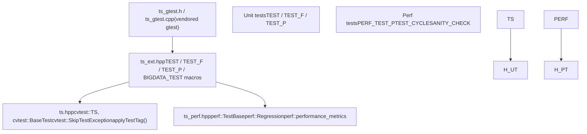
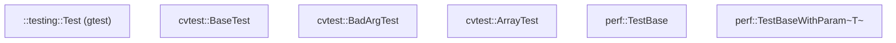
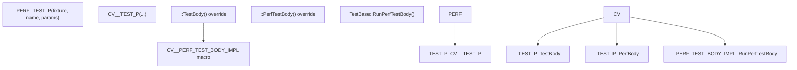
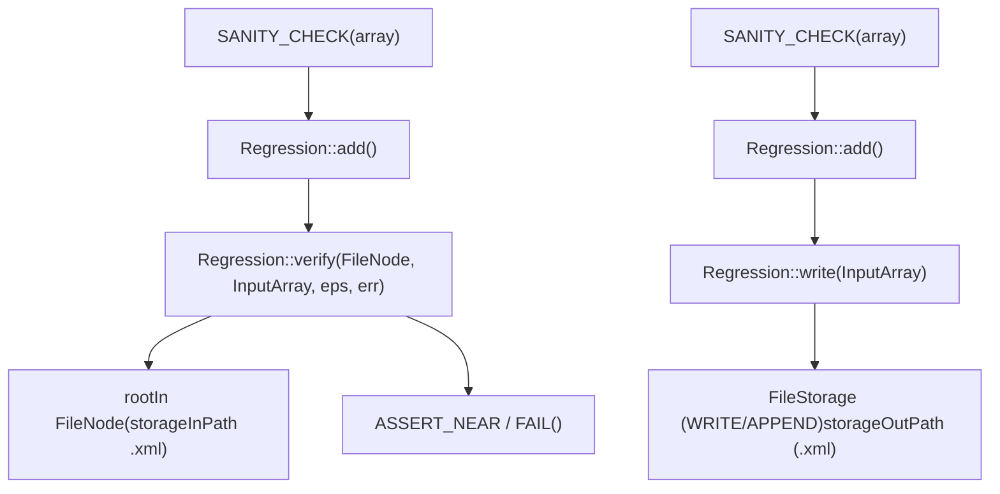

# Testing Framework (ts)

Relevant source files

-   [modules/core/src/parallel.cpp](https://github.com/opencv/opencv/blob/91c78f50/modules/core/src/parallel.cpp)
-   [modules/ts/CMakeLists.txt](https://github.com/opencv/opencv/blob/91c78f50/modules/ts/CMakeLists.txt)
-   [modules/ts/include/opencv2/ts.hpp](https://github.com/opencv/opencv/blob/91c78f50/modules/ts/include/opencv2/ts.hpp)
-   [modules/ts/include/opencv2/ts/ts\_ext.hpp](https://github.com/opencv/opencv/blob/91c78f50/modules/ts/include/opencv2/ts/ts_ext.hpp)
-   [modules/ts/include/opencv2/ts/ts\_gtest.h](https://github.com/opencv/opencv/blob/91c78f50/modules/ts/include/opencv2/ts/ts_gtest.h)
-   [modules/ts/include/opencv2/ts/ts\_perf.hpp](https://github.com/opencv/opencv/blob/91c78f50/modules/ts/include/opencv2/ts/ts_perf.hpp)
-   [modules/ts/src/precomp.hpp](https://github.com/opencv/opencv/blob/91c78f50/modules/ts/src/precomp.hpp)
-   [modules/ts/src/ts.cpp](https://github.com/opencv/opencv/blob/91c78f50/modules/ts/src/ts.cpp)
-   [modules/ts/src/ts\_arrtest.cpp](https://github.com/opencv/opencv/blob/91c78f50/modules/ts/src/ts_arrtest.cpp)
-   [modules/ts/src/ts\_func.cpp](https://github.com/opencv/opencv/blob/91c78f50/modules/ts/src/ts_func.cpp)
-   [modules/ts/src/ts\_gtest.cpp](https://github.com/opencv/opencv/blob/91c78f50/modules/ts/src/ts_gtest.cpp)
-   [modules/ts/src/ts\_perf.cpp](https://github.com/opencv/opencv/blob/91c78f50/modules/ts/src/ts_perf.cpp)

## Purpose and Scope

The `ts` module is OpenCV's internal testing library. It provides a unified testing infrastructure that all other OpenCV module test binaries link against. The module bundles a vendored copy of Google Test, extends it with OpenCV-specific fixtures, macros, and utilities, and adds a dedicated performance benchmarking subsystem.

This page covers the overall structure of the `ts` module, the core classes that both unit and performance tests share, the test tag filtering system, and common utility functions. Detailed treatment of the performance benchmarking loop and regression baseline management is in [Performance Testing with perf::TestBase](/opencv/opencv/12.1-performance-testing-with-perf::testbase). The unit test layer, OpenCL validation helpers, and the `run.py` runner are in [Unit Testing and OpenCL Test Utilities](/opencv/opencv/12.2-unit-testing-and-opencl-test-utilities).

---

## Module Layout

The `ts` module is built as a **static library** (`OPENCV_MODULE_TYPE STATIC`) and is excluded from `opencv_world`. It is never shipped to end users; it exists solely to be linked by the `*_tests` and `*_perf_tests` binaries produced per-module.

**Build dependencies** declared in [modules/ts/CMakeLists.txt](https://github.com/opencv/opencv/blob/91c78f50/modules/ts/CMakeLists.txt):

| Dependency | Role in ts |
| --- | --- |
| `opencv_core` | `Mat`, RNG, `FileStorage`, error handling |
| `opencv_imgproc` | Reference implementations in test utilities |
| `opencv_imgcodecs` | Loading test images |
| `opencv_videoio` | Video capture in tests |
| `opencv_highgui` | Display helpers |

On WinRT, the `OPENCV_TEST_DATA_PATH` and `OPENCV_PERF_VALIDATION_DIR` environment variables are baked in at CMake time as macros because the OS does not provide runtime access to environment variables [modules/ts/CMakeLists.txt10-15](https://github.com/opencv/opencv/blob/91c78f50/modules/ts/CMakeLists.txt#L10-L15)

### Source Files

| File | Contents |
| --- | --- |
| `modules/ts/include/opencv2/ts.hpp` | Public API: `TS`, `BaseTest`, utility functions, test tags |
| `modules/ts/include/opencv2/ts/ts_perf.hpp` | `TestBase`, `Regression`, `performance_metrics`, perf macros |
| `modules/ts/include/opencv2/ts/ts_ext.hpp` | Macro overrides for `TEST`, `TEST_F`, `TEST_P`, `BIGDATA_TEST` |
| `modules/ts/include/opencv2/ts/ts_gtest.h` | Vendored Google Test single-header |
| `modules/ts/src/ts.cpp` | `TS` singleton, `BaseTest`, `BadArgTest` |
| `modules/ts/src/ts_perf.cpp` | `TestBase`, `Regression`, `performance_metrics` |
| `modules/ts/src/ts_func.cpp` | Reference math ops, `randomMat`, `norm`, `PSNR`, `cmpUlps` |
| `modules/ts/src/ts_arrtest.cpp` | `ArrayTest` base class |
| `modules/ts/src/ts_gtest.cpp` | Vendored Google Test implementation |

---

## Architecture Overview

**Diagram: ts module layers and principal code entities**


Sources: [modules/ts/include/opencv2/ts.hpp](https://github.com/opencv/opencv/blob/91c78f50/modules/ts/include/opencv2/ts.hpp) [modules/ts/include/opencv2/ts/ts\_perf.hpp](https://github.com/opencv/opencv/blob/91c78f50/modules/ts/include/opencv2/ts/ts_perf.hpp) [modules/ts/include/opencv2/ts/ts\_ext.hpp](https://github.com/opencv/opencv/blob/91c78f50/modules/ts/include/opencv2/ts/ts_ext.hpp)

---

## Core Infrastructure: `cvtest::TS`

`TS` is a process-wide singleton accessed via `TS::ptr()`. It manages:

-   The global `param_seed` used to seed per-test RNGs reproducibly.
-   An `output_buf` array of string buffers (LOG, SUMMARY, CONSOLE) that accumulate per-test output and are dumped on failure.
-   The `current_test_info` (`TestInfo`) struct that tracks the active test, case index, and error code.
-   Error routing: `TS::set_failed_test_info(int)` maps to `TS::FailureCode` enum values; `TS::set_gtest_status()` converts them to GTest `FAIL()` calls.

**Failure codes** defined in `TS`:

| Code | Meaning |
| --- | --- |
| `FAIL_GENERIC` | Unknown |
| `FAIL_MISSING_TEST_DATA` | Test data file not found |
| `FAIL_ERROR_IN_CALLED_FUNC` | `cv::Error` was called inside the function |
| `FAIL_MEMORY_EXCEPTION` | Segfault / access violation |
| `FAIL_ARITHM_EXCEPTION` | FP or integer arithmetic exception |
| `FAIL_BAD_ACCURACY` | Output within range but exceeds allowed epsilon |
| `FAIL_MISMATCH` | Output does not match expected |

[modules/ts/src/ts.cpp517-541](https://github.com/opencv/opencv/blob/91c78f50/modules/ts/src/ts.cpp#L517-L541)

---

## Base Test Classes

**Diagram: class hierarchy for unit and performance tests**


Sources: [modules/ts/include/opencv2/ts.hpp148-400](https://github.com/opencv/opencv/blob/91c78f50/modules/ts/include/opencv2/ts.hpp#L148-L400) [modules/ts/include/opencv2/ts/ts\_perf.hpp374-498](https://github.com/opencv/opencv/blob/91c78f50/modules/ts/include/opencv2/ts/ts_perf.hpp#L374-L498) [modules/ts/src/ts.cpp252-430](https://github.com/opencv/opencv/blob/91c78f50/modules/ts/src/ts.cpp#L252-L430)

### `cvtest::BaseTest`

The older base class for functional tests. Subclasses override:

-   `run_func()` — calls the OpenCV function under test.
-   `prepare_test_case(idx)` — allocates and fills input data.
-   `validate_test_results(idx)` — compares output against reference.

`BaseTest::safe_run()` wraps `run()` with signal handlers (SIGSEGV, SIGFPE, etc. on POSIX; `_set_se_translator` on Windows) and catches `cv::Exception` [modules/ts/src/ts.cpp287-338](https://github.com/opencv/opencv/blob/91c78f50/modules/ts/src/ts.cpp#L287-L338)

### `cvtest::ArrayTest`

Extends `BaseTest` for array-processing functions. Allocates randomized `CvMat` / `IplImage` arrays, fills them with `randUni()`, calls `run_func()`, and validates output vs. reference arrays using `cmpEps2()`. Controlled by `min_log_array_size` / `max_log_array_size` [modules/ts/src/ts\_arrtest.cpp51-333](https://github.com/opencv/opencv/blob/91c78f50/modules/ts/src/ts_arrtest.cpp#L51-L333)

### `cvtest::BadArgTest`

Validates that a function correctly rejects bad input by asserting that calling `run_func()` raises a `cv::Exception` with the expected error code [modules/ts/src/ts.cpp432-481](https://github.com/opencv/opencv/blob/91c78f50/modules/ts/src/ts.cpp#L432-L481)

---

## Performance Testing: `perf::TestBase`

`perf::TestBase` is the fixture for all benchmarks. It inherits directly from `::testing::Test` and manages warmup, a timed measurement loop, outlier removal, and metric reporting.

Key members:

| Member | Role |
| --- | --- |
| `declare` (`_declareHelper`) | Fluent API to register input/output arrays and set time limits |
| `times` (`TimeVector`) | Raw per-iteration timings in ticks |
| `metrics` (`performance_metrics`) | Computed statistics after the loop |
| `timeLimit` | Per-test wall-clock budget |
| `minIters` / `nIters` / `currentIter` | Iteration control |

The timing loop is driven by three methods:

-   `startTimer()` — records the start tick count and returns `true` (used as the loop condition).
-   `stopTimer()` — records the elapsed ticks into `times`.
-   `next()` — checks termination conditions (time limit, iteration count, stability); returns `false` when done.

The standard pattern using the `TEST_CYCLE()` macro:

```
// Expands to: for(; perf::TestBase::startTimer(); perf::TestBase::stopTimer())
TEST_CYCLE() { cv::someFunction(src, dst); }
```
`TestBase::Init()` parses command-line arguments controlling strategy, seed, thread count, sanity checks, and CUDA device selection [modules/ts/src/ts\_perf.cpp947-1002](https://github.com/opencv/opencv/blob/91c78f50/modules/ts/src/ts_perf.cpp#L947-L1002)

For full details on warmup, regression baselines, and metric computation, see [Performance Testing with perf::TestBase](/opencv/opencv/12.1-performance-testing-with-perf::testbase).

---

## Test Macros

**Diagram: macro expansion chain for performance tests**


Sources: [modules/ts/include/opencv2/ts/ts\_perf.hpp523-630](https://github.com/opencv/opencv/blob/91c78f50/modules/ts/include/opencv2/ts/ts_perf.hpp#L523-L630) [modules/ts/include/opencv2/ts/ts\_ext.hpp176-208](https://github.com/opencv/opencv/blob/91c78f50/modules/ts/include/opencv2/ts/ts_ext.hpp#L176-L208)

### Perf test macros

| Macro | Use case |
| --- | --- |
| `PERF_TEST(case, name)` | Simple non-parametrized perf test |
| `PERF_TEST_F(fixture, name)` | Perf test using a custom fixture class |
| `PERF_TEST_P(fixture, name, params)` | Parametrized perf test; also calls `INSTANTIATE_TEST_CASE_P` internally |
| `PERF_TEST_P_(fixture, name)` | Like `PERF_TEST_P` but without auto-instantiation |
| `TEST_CYCLE()` | `for` loop wrapping `startTimer()`/`stopTimer()` |
| `SANITY_CHECK(array, ...)` | Calls `Regression::add()` to compare or record output |
| `SANITY_CHECK_NOTHING()` | Marks test verified without output comparison |
| `SANITY_CHECK_KEYPOINTS(array, ...)` | Sanity check for `vector<cv::KeyPoint>` |
| `SANITY_CHECK_MATCHES(array, ...)` | Sanity check for `vector<cv::DMatch>` |

[modules/ts/include/opencv2/ts/ts\_perf.hpp215-660](https://github.com/opencv/opencv/blob/91c78f50/modules/ts/include/opencv2/ts/ts_perf.hpp#L215-L660)

### Unit test macro overrides

`ts_ext.hpp` replaces the standard gtest `TEST`, `TEST_F`, and `TEST_P` macros. The overridden versions:

1.  Add a `setUpSkipped` flag so that exceptions thrown in `SetUp()` suppress `TestBody()`.
2.  Use a separate factory class that catches `SkipTestExceptionBase` at construction time and substitutes a `SkipThisTest` placeholder.
3.  Wrap `Body()` (the actual user code) with `cvtest::testSetUp()` / `cvtest::testTearDown()` calls.

[modules/ts/include/opencv2/ts/ts\_ext.hpp72-211](https://github.com/opencv/opencv/blob/91c78f50/modules/ts/include/opencv2/ts/ts_ext.hpp#L72-L211)

---

## Predefined Size Constants

`ts_perf.hpp` exports size constants for common benchmark resolutions:

| Constant | Value |
| --- | --- |
| `szQVGA` | 320×240 |
| `szVGA` | 640×480 |
| `sznHD` | 640×360 |
| `szqHD` | 960×540 |
| `sz720p` | 1280×720 |
| `sz1080p` | 1920×1080 |
| `sz2160p` | 3840×2160 |
| `szODD` | 127×61 (non-power-of-two edge case) |

Grouped selection macros such as `SZ_TYPICAL`, `SZ_ALL_HD`, and `TYPICAL_MATS` combine these with `::testing::Values()` for use inside `INSTANTIATE_TEST_CASE_P`.

[modules/ts/include/opencv2/ts/ts\_perf.hpp46-85](https://github.com/opencv/opencv/blob/91c78f50/modules/ts/include/opencv2/ts/ts_perf.hpp#L46-L85)

---

## Test Tag System

Tags allow tests to be selectively enabled or skipped based on resource constraints or platform capabilities without modifying test code.

### Built-in tag constants (defined in `ts.hpp`)

| Tag | Meaning |
| --- | --- |
| `CV_TEST_TAG_MEMORY_512MB` | Test uses 200–512 MB; on by default |
| `CV_TEST_TAG_MEMORY_2GB` | Disabled on 32-bit |
| `CV_TEST_TAG_MEMORY_6GB` | Disabled by default |
| `CV_TEST_TAG_LONG` | 5+ seconds single-threaded |
| `CV_TEST_TAG_VERYLONG` | 20+ seconds |
| `CV_TEST_TAG_DEBUG_LONG` | For debug builds |
| `CV_TEST_TAG_SIZE_HD` | 720p and above |
| `CV_TEST_TAG_SIZE_FULLHD` | 1080p and above |
| `CV_TEST_TAG_TYPE_64F` | Uses `CV_64F` depth |
| `CV_TEST_TAG_OPENCL` | OpenCL path |

[modules/ts/include/opencv2/ts.hpp59-89](https://github.com/opencv/opencv/blob/91c78f50/modules/ts/include/opencv2/ts.hpp#L59-L89)

### API

-   `cvtest::applyTestTag(tag)` — applies a tag to the current test; throws `SkipTestException` if the tag is in the skip list.
-   `cvtest::registerGlobalSkipTag(tag)` — registers a tag to be skipped globally (called from `main()` or test setup).
-   `cvtest::checkTestTags()` — explicitly runs deferred tag checks.

Applying a compound tag (e.g., `CV_TEST_TAG_SIZE_4K`) automatically applies implied tags (`SIZE_FULLHD`, `SIZE_HD`) so a broad skip like "no HD" covers all higher resolutions without requiring every test to list every implied tag.

[modules/ts/include/opencv2/ts.hpp207-258](https://github.com/opencv/opencv/blob/91c78f50/modules/ts/include/opencv2/ts.hpp#L207-L258)

---

## Utility Functions (`cvtest` namespace)

`ts.hpp` and `ts_func.cpp` expose a library of reference implementations and helpers used inside test bodies.

### Random data generation

| Function | Signature |
| --- | --- |
| `randomMat` | `(RNG&, Size, int type, double minVal, double maxVal, bool useRoi) → Mat` |
| `randomSize` | `(RNG&, double maxSizeLog) → Size` |
| `randomType` | `(RNG&, DepthMask, int minCh, int maxCh) → int` |
| `randUni` | `(RNG&, Mat&, Scalar lo, Scalar hi)` |

[modules/ts/src/ts\_func.cpp41-70](https://github.com/opencv/opencv/blob/91c78f50/modules/ts/src/ts_func.cpp#L41-L70) [modules/ts/include/opencv2/ts.hpp296-302](https://github.com/opencv/opencv/blob/91c78f50/modules/ts/include/opencv2/ts.hpp#L296-L302)

### Comparison and error measurement

| Function | Purpose |
| --- | --- |
| `norm(src, normType)` | Scalar norm of a single array |
| `norm(src1, src2, normType)` | Difference norm between two arrays |
| `PSNR(src1, src2)` | Peak signal-to-noise ratio in dB |
| `cmpUlps(data, refdata, expMaxDiff, ...)` | ULP-based comparison for floating-point |
| `cmpEps2(ts, actual, expected, eps, ...)` | Epsilon comparison, records failure in `TS` |

[modules/ts/include/opencv2/ts.hpp339-350](https://github.com/opencv/opencv/blob/91c78f50/modules/ts/include/opencv2/ts.hpp#L339-L350)

### Reference arithmetic

`ts_func.cpp` provides plain-C++ reference implementations used to validate accelerated library functions:

-   `add`, `multiply`, `divide` — element-wise arithmetic with alpha/beta scaling.
-   `convert` — type conversion with scale and shift.
-   `copy`, `set`, `extract`, `insert` — array manipulation with mask support.
-   `filter2D`, `erode`, `dilate`, `copyMakeBorder` — reference convolution and morphology.
-   `transpose`, `minMaxLoc`, `mean` — reduction operations.

[modules/ts/src/ts\_func.cpp152-600](https://github.com/opencv/opencv/blob/91c78f50/modules/ts/src/ts_func.cpp#L152-L600)

---

## `perf::Regression`: Sanity Check Storage

`Regression` is a singleton that records expected output values to an XML file during a "write sanity" run and verifies them on subsequent runs. It uses `cv::FileStorage` for persistence.

**Diagram: Regression data flow**


Sources: [modules/ts/src/ts\_perf.cpp130-635](https://github.com/opencv/opencv/blob/91c78f50/modules/ts/src/ts_perf.cpp#L130-L635) [modules/ts/include/opencv2/ts/ts\_perf.hpp174-219](https://github.com/opencv/opencv/blob/91c78f50/modules/ts/include/opencv2/ts/ts_perf.hpp#L174-L219)

The data stored per test per array includes: min, max, last element, and two randomly sampled elements (reproducible via `regRNG`). For vectors, a random element index is also stored. For keypoints and descriptor matches, individual fields are stored as separate matrices.

Supported `ERROR_TYPE` values:

-   `ERROR_ABSOLUTE` — `|expected - actual| ≤ eps`
-   `ERROR_RELATIVE` — `|expected - actual| ≤ eps * max(|expected|, |actual|)`

---

## `perf::performance_metrics`

The `performance_metrics` struct holds all computed timing statistics for a single test run:

| Field | Type | Description |
| --- | --- | --- |
| `samples` | `unsigned int` | Number of timing samples kept |
| `outliers` | `unsigned int` | Samples discarded as outliers |
| `min` | `double` | Minimum sample (seconds) |
| `median` | `double` | Median sample |
| `mean` | `double` | Arithmetic mean |
| `gmean` | `double` | Geometric mean |
| `stddev` | `double` | Standard deviation |
| `gstddev` | `double` | Std dev of log(time) |
| `frequency` | `double` | Tick frequency used for conversion |
| `bytesIn` / `bytesOut` | `size_t` | Declared input/output sizes |
| `terminationReason` | `int` | `TERM_TIME`, `TERM_ITERATIONS`, `TERM_INTERRUPT`, etc. |

[modules/ts/include/opencv2/ts/ts\_perf.hpp232-259](https://github.com/opencv/opencv/blob/91c78f50/modules/ts/include/opencv2/ts/ts_perf.hpp#L232-L259)

---

## Key Command-Line Parameters

`TestBase::Init()` registers these parameters via `cv::CommandLineParser`:

| Flag | Default | Effect |
| --- | --- | --- |
| `--perf_time_limit` | 3.0 s (6.0 on Android) | Max wall time per test |
| `--perf_min_samples` | 10 | Minimum iterations before stopping |
| `--perf_force_samples` | 100 | Override: always run exactly this many |
| `--perf_max_outliers` | 8 | % of samples that may be discarded |
| `--perf_seed` | 809564 | RNG seed |
| `--perf_threads` | \-1 | Worker thread count (-1 = default) |
| `--perf_write_sanity` | false | Write regression baseline to XML |
| `--perf_verify_sanity` | false | Fail if no baseline exists |
| `--perf_impl` | `plain` | Implementation variant to select |
| `--perf_strategy` | `default` | `base` or `simple` outlier strategy |
| `--perf_cuda_device` | 0 | CUDA device index for GPU tests |

[modules/ts/src/ts\_perf.cpp961-1001](https://github.com/opencv/opencv/blob/91c78f50/modules/ts/src/ts_perf.cpp#L961-L1001)
