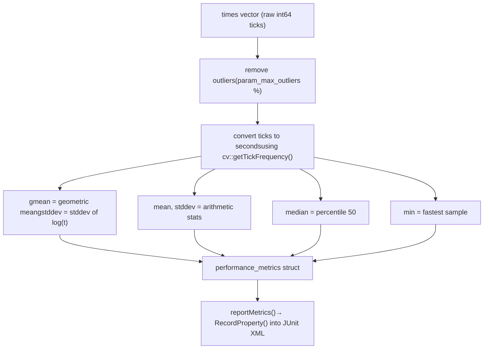
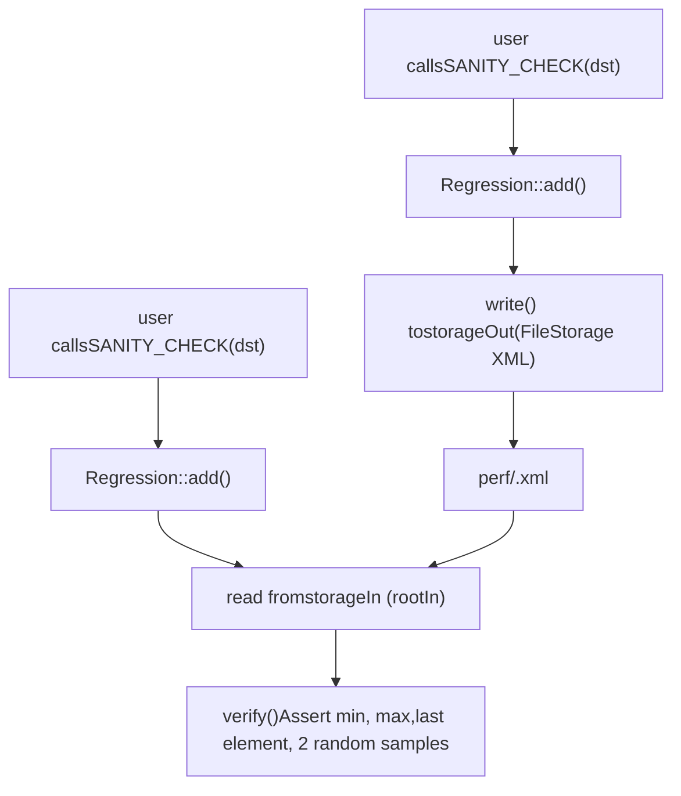

# Performance Testing with perf::TestBase

Relevant source files

-   [modules/core/src/parallel.cpp](https://github.com/opencv/opencv/blob/91c78f50/modules/core/src/parallel.cpp)
-   [modules/ts/CMakeLists.txt](https://github.com/opencv/opencv/blob/91c78f50/modules/ts/CMakeLists.txt)
-   [modules/ts/include/opencv2/ts.hpp](https://github.com/opencv/opencv/blob/91c78f50/modules/ts/include/opencv2/ts.hpp)
-   [modules/ts/include/opencv2/ts/ts\_ext.hpp](https://github.com/opencv/opencv/blob/91c78f50/modules/ts/include/opencv2/ts/ts_ext.hpp)
-   [modules/ts/include/opencv2/ts/ts\_gtest.h](https://github.com/opencv/opencv/blob/91c78f50/modules/ts/include/opencv2/ts/ts_gtest.h)
-   [modules/ts/include/opencv2/ts/ts\_perf.hpp](https://github.com/opencv/opencv/blob/91c78f50/modules/ts/include/opencv2/ts/ts_perf.hpp)
-   [modules/ts/src/precomp.hpp](https://github.com/opencv/opencv/blob/91c78f50/modules/ts/src/precomp.hpp)
-   [modules/ts/src/ts.cpp](https://github.com/opencv/opencv/blob/91c78f50/modules/ts/src/ts.cpp)
-   [modules/ts/src/ts\_arrtest.cpp](https://github.com/opencv/opencv/blob/91c78f50/modules/ts/src/ts_arrtest.cpp)
-   [modules/ts/src/ts\_func.cpp](https://github.com/opencv/opencv/blob/91c78f50/modules/ts/src/ts_func.cpp)
-   [modules/ts/src/ts\_gtest.cpp](https://github.com/opencv/opencv/blob/91c78f50/modules/ts/src/ts_gtest.cpp)
-   [modules/ts/src/ts\_perf.cpp](https://github.com/opencv/opencv/blob/91c78f50/modules/ts/src/ts_perf.cpp)

## Purpose and Scope

This page documents the performance testing framework in the `modules/ts` module, specifically the `perf::TestBase` class and the surrounding infrastructure for writing, running, and comparing micro-benchmarks. It covers test declaration macros, the timing loop, input/output declaration, regression baseline management, statistical metrics, and command-line controls.

For unit test facilities and OpenCL test validation, see [Unit Testing and OpenCL Test Utilities](/opencv/opencv/12.2-unit-testing-and-opencl-test-utilities). For the broader testing module overview, see [Testing Framework (ts)](/opencv/opencv/12-testing-framework-(ts)).

---

## Architecture Overview

The performance testing infrastructure lives in the `perf` namespace and is declared in [modules/ts/include/opencv2/ts/ts\_perf.hpp](https://github.com/opencv/opencv/blob/91c78f50/modules/ts/include/opencv2/ts/ts_perf.hpp) with implementation in [modules/ts/src/ts\_perf.cpp](https://github.com/opencv/opencv/blob/91c78f50/modules/ts/src/ts_perf.cpp)

**Key relationships among the major types:**

Sources: [modules/ts/include/opencv2/ts/ts\_perf.hpp374-498](https://github.com/opencv/opencv/blob/91c78f50/modules/ts/include/opencv2/ts/ts_perf.hpp#L374-L498) [modules/ts/src/ts\_perf.cpp130-660](https://github.com/opencv/opencv/blob/91c78f50/modules/ts/src/ts_perf.cpp#L130-L660)

---

## Test Declaration Macros

Three macros cover the common test patterns. All of them define a class whose `PerfTestBody()` method contains the user code.

| Macro | Intended Use |
| --- | --- |
| `PERF_TEST(suite, name)` | Simple one-off performance test, no fixture or parameters |
| `PERF_TEST_F(fixture, name)` | Performance test on a user-defined fixture subclassing `TestBase` |
| `PERF_TEST_P(fixture, name, values)` | Parameterized test; also instantiates the parameter set inline |
| `PERF_TEST_P_(fixture, name)` | Parameterized test without inline instantiation; pair with `INSTANTIATE_TEST_CASE_P` |

`PERF_TEST_P` is the most common pattern. The fixture is typically a `typedef` of `TestBaseWithParam<T>` for some parameter tuple `T`.

Sources: [modules/ts/include/opencv2/ts/ts\_perf.hpp553-640](https://github.com/opencv/opencv/blob/91c78f50/modules/ts/include/opencv2/ts/ts_perf.hpp#L553-L640)

---

## Writing a Parameterized Performance Test

A typical test follows this structure:

```
typedef perf::TestBaseWithParam<cv::Size> MyTest; PERF_TEST_P(MyTest, ResizeLinear,    ::testing::Values(perf::szVGA, perf::sz720p, perf::sz1080p)){    cv::Size sz = GetParam();    cv::Mat src(sz, CV_8UC3);    cv::Mat dst;     declare.in(src).out(dst);     TEST_CYCLE() cv::resize(src, dst, cv::Size(), 0.5, 0.5);     SANITY_CHECK(dst);}
```
Key elements:

-   **`GetParam()`** — retrieves the current parameter value via `testing::WithParamInterface`.
-   **`declare.in(src).out(dst)`** — registers arrays so the framework can compute data sizes (`bytesIn`, `bytesOut`) and apply warm-up.
-   **`TEST_CYCLE()`** — drives the timing loop by calling `startTimer()`, `next()`, and `stopTimer()` on each pass.
-   **`SANITY_CHECK(dst)`** — registers output for regression comparison.

Sources: [modules/ts/include/opencv2/ts/ts\_perf.hpp462-496](https://github.com/opencv/opencv/blob/91c78f50/modules/ts/include/opencv2/ts/ts_perf.hpp#L462-L496) [modules/ts/include/opencv2/ts/ts\_perf.hpp215-219](https://github.com/opencv/opencv/blob/91c78f50/modules/ts/include/opencv2/ts/ts_perf.hpp#L215-L219)

---

## Predefined Size Constants

`ts_perf.hpp` declares a standard set of `cv::Size` constants for use as test parameters:

| Constant | Resolution |
| --- | --- |
| `szQVGA` | 320 × 240 |
| `szVGA` | 640 × 480 |
| `szSVGA` | 800 × 600 |
| `szXGA` | 1024 × 768 |
| `sz720p` | 1280 × 720 |
| `sz1080p` | 1920 × 1080 |
| `sz2160p` | 3840 × 2160 (4K) |

Convenience macros like `SZ_ALL_HD` and `SZ_TYPICAL` expand to `::testing::Values(...)` expressions.

Sources: [modules/ts/include/opencv2/ts/ts\_perf.hpp46-83](https://github.com/opencv/opencv/blob/91c78f50/modules/ts/include/opencv2/ts/ts_perf.hpp#L46-L83)

---

## Test Lifecycle

**Test execution flow:**

Sources: [modules/ts/src/ts\_perf.cpp942-1200](https://github.com/opencv/opencv/blob/91c78f50/modules/ts/src/ts_perf.cpp#L942-L1200) [modules/ts/include/opencv2/ts/ts\_perf.hpp396-421](https://github.com/opencv/opencv/blob/91c78f50/modules/ts/include/opencv2/ts/ts_perf.hpp#L396-L421)

---

## Timing Loop Control

`startTimer()`, `stopTimer()`, and `next()` are the three methods that control the measurement loop.

-   **`startTimer()`** — records the current tick count into `lastTime`. Returns `true` so it can be used in loop conditionals.
-   **`stopTimer()`** — computes elapsed ticks since `startTimer()` and appends the value to the internal `times` vector.
-   **`next()`** — determines whether to continue iterating. Returns `false` when either:
    -   The accumulated wall time exceeds `timeLimit`, **and** at least `minIters` samples have been collected, or
    -   The iteration count exceeds `nIters`.

The `TEST_CYCLE()` macro composes these into a `for` loop:

```
for (; startTimer(), next(); stopTimer())
    { /* user operation */ }
```
The number of `runsPerIteration` (configurable via `declare.runs(n)`) determines how many times the operation executes per call to `startTimer/stopTimer`, which is useful for very fast operations.

Sources: [modules/ts/include/opencv2/ts/ts\_perf.hpp402-404](https://github.com/opencv/opencv/blob/91c78f50/modules/ts/include/opencv2/ts/ts_perf.hpp#L402-L404) [modules/ts/src/ts\_perf.cpp942-1300](https://github.com/opencv/opencv/blob/91c78f50/modules/ts/src/ts_perf.cpp#L942-L1300)

---

## Input/Output Declaration

`TestBase::_declareHelper` is accessed via the public member `declare`. It chains calls to register arrays and configure the test:

| Method | Effect |
| --- | --- |
| `declare.in(a, wtype)` | Register array `a` as input; apply warm-up of type `wtype` |
| `declare.out(a, wtype)` | Register array `a` as output; apply warm-up of type `wtype` |
| `declare.time(secs)` | Override the default time limit for this test |
| `declare.iterations(n)` | Cap the number of timing samples |
| `declare.runs(n)` | Set repetitions per timed slot |
| `declare.tbb_threads(n)` | Override the worker thread count for this test |
| `declare.strategy(s)` | Set the convergence strategy for this test |

The `WarmUpType` enum controls how arrays are touched before timing begins:

| Value | Behavior |
| --- | --- |
| `WARMUP_READ` | Read-access the data (default for inputs) |
| `WARMUP_WRITE` | Write zeros (default for outputs) |
| `WARMUP_RNG` | Fill with random data |
| `WARMUP_NONE` | No warm-up |

Warm-up ensures that caches and page tables are in a representative state before timing starts.

Sources: [modules/ts/include/opencv2/ts/ts\_perf.hpp408-488](https://github.com/opencv/opencv/blob/91c78f50/modules/ts/include/opencv2/ts/ts_perf.hpp#L408-L488) [modules/ts/src/ts\_perf.cpp1300-1450](https://github.com/opencv/opencv/blob/91c78f50/modules/ts/src/ts_perf.cpp#L1300-L1450)

---

## Measuring Strategies

`PERF_STRATEGY` controls the convergence and termination conditions:

| Value | Description |
| --- | --- |
| `PERF_STRATEGY_DEFAULT (-1)` | Use the module-level default |
| `PERF_STRATEGY_BASE (0)` | Stricter — requires stability within `perf_max_deviation` |
| `PERF_STRATEGY_SIMPLE (1)` | Weaker — stops at time limit regardless of variance |

The module default is set to `PERF_STRATEGY_SIMPLE` at startup. Each module can override it via `TestBase::setModulePerformanceStrategy()`, and individual tests can override it via `declare.strategy()`.

The stability criterion is 3% (`perf_stability_criteria = 0.03`) — a measure of whether the geometric standard deviation of collected samples has converged.

Sources: [modules/ts/include/opencv2/ts/ts\_perf.hpp265-270](https://github.com/opencv/opencv/blob/91c78f50/modules/ts/include/opencv2/ts/ts_perf.hpp#L265-L270) [modules/ts/src/ts\_perf.cpp35-36](https://github.com/opencv/opencv/blob/91c78f50/modules/ts/src/ts_perf.cpp#L35-L36) [modules/ts/src/ts\_perf.cpp80](https://github.com/opencv/opencv/blob/91c78f50/modules/ts/src/ts_perf.cpp#L80-L80)

---

## Performance Metrics

After the timing loop, `calcMetrics()` computes a `performance_metrics` struct from the collected `times` vector. Outliers are removed first using the `param_max_outliers` threshold.


The `terminationReason` field records why the loop stopped:

| Value | Meaning |
| --- | --- |
| `TERM_ITERATIONS (0)` | Hit iteration cap |
| `TERM_TIME (1)` | Hit time limit |
| `TERM_INTERRUPT (2)` | User interrupted |
| `TERM_EXCEPTION (3)` | Exception thrown |
| `TERM_SKIP_TEST (4)` | Test was skipped |
| `TERM_UNKNOWN (-1)` | Uninitialized |

Sources: [modules/ts/include/opencv2/ts/ts\_perf.hpp232-259](https://github.com/opencv/opencv/blob/91c78f50/modules/ts/include/opencv2/ts/ts_perf.hpp#L232-L259) [modules/ts/src/ts\_perf.cpp638-660](https://github.com/opencv/opencv/blob/91c78f50/modules/ts/src/ts_perf.cpp#L638-L660)

---

## Regression Baseline Management

The `Regression` class handles sanity checking: recording output values from a reference run and verifying them on subsequent runs. The macros `SANITY_CHECK`, `SANITY_CHECK_KEYPOINTS`, `SANITY_CHECK_MATCHES`, and `SANITY_CHECK_MOMENTS` all delegate to `Regression::add()`.

**Regression data flow:**


For each `cv::Mat`, the class records and verifies:

-   `min` and `max` values via `cv::minMaxIdx`
-   The element at `[rows-1, cols-1, channels-1]` (last element)
-   Two elements at randomly selected positions (`rng1`, `rng2`)

The storage file is located at `$OPENCV_TEST_DATA_PATH/perf/<suiteName>.xml` by default. Error types are `ERROR_ABSOLUTE` (fixed epsilon) or `ERROR_RELATIVE` (epsilon scaled by the reference magnitude).

Sources: [modules/ts/include/opencv2/ts/ts\_perf.hpp174-219](https://github.com/opencv/opencv/blob/91c78f50/modules/ts/include/opencv2/ts/ts_perf.hpp#L174-L219) [modules/ts/src/ts\_perf.cpp130-635](https://github.com/opencv/opencv/blob/91c78f50/modules/ts/src/ts_perf.cpp#L130-L635)

---

## Performance Validation

A separate mechanism compares current run timings against results from a previous run, distinct from regression checks on output correctness.

-   `--perf_read_validation_results <file>` — load prior timings from a plain text file (one `value;name` pair per line).
-   `--perf_write_validation_results <file>` — write current median timings to that file after the run.

The comparison tolerance is 3% (`perf_validation_criteria = 0.03`). Tests faster than `perf_validation_time_threshold_ms = 0.1` ms are not validated. Between test runs, an idle delay of 3 seconds (`perf_validation_idle_delay_ms = 3000`) can be inserted.

The `PerfValidationEnvironment` class (registered with Google Test via `testing::AddGlobalTestEnvironment`) calls `savePerfValidationResults()` in its `TearDown()`.

Sources: [modules/ts/src/ts\_perf.cpp666-735](https://github.com/opencv/opencv/blob/91c78f50/modules/ts/src/ts_perf.cpp#L666-L735)

---

## Initialization and Command-Line Parameters

`TestBase::Init()` must be called from `main()` before running tests. It parses command-line arguments via `cv::CommandLineParser` and registers a `PerfEnvironment` global environment.

| Flag | Default | Description |
| --- | --- | --- |
| `--perf_time_limit` | 3.0 s (6.0 s Android) | Wall time per test |
| `--perf_min_samples` | 10 | Minimum timing samples |
| `--perf_force_samples` | 100 | Hard cap on samples |
| `--perf_max_outliers` | 8 | Percent of samples discarded as outliers |
| `--perf_max_deviation` | 1.0 | Allowed stddev ratio |
| `--perf_seed` | 809564 | RNG seed for data generation |
| `--perf_threads` | \-1 | Worker thread count (-1 = system default) |
| `--perf_impl` | `plain` | Implementation variant to test |
| `--perf_strategy` | `default` | `default`, `base`, or `simple` |
| `--perf_write_sanity` | false | Record baseline regression data |
| `--perf_verify_sanity` | false | Fail if baseline data is missing |
| `--perf_cuda_device` | 0 | CUDA device index (when built with CUDA) |

Sources: [modules/ts/src/ts\_perf.cpp947-1070](https://github.com/opencv/opencv/blob/91c78f50/modules/ts/src/ts_perf.cpp#L947-L1070)

---

## Helper Types and Macros

### CV\_ENUM and CV\_FLAGS

These macros generate wrapper structs that are both castable to `int` and printable by Google Test. They are used to define printable parameter types for `PERF_TEST_P`:

```
CV_ENUM(InterpolationType, INTER_NEAREST, INTER_LINEAR, INTER_CUBIC)
```
The generated struct implements `PrintTo(std::ostream*)` and a static `all()` generator for `::testing::ValuesIn(...)`.

`CV_FLAGS` is the same pattern but handles bitfield combinations.

Sources: [modules/ts/include/opencv2/ts/ts\_perf.hpp104-163](https://github.com/opencv/opencv/blob/91c78f50/modules/ts/include/opencv2/ts/ts_perf.hpp#L104-L163)

### MatType and MatDepth

`MatType` is a printable `int` wrapper for `cv::Mat` type codes. `MatDepth` is a `CV_ENUM` of all depth constants (`CV_8U`, `CV_8S`, ..., `CV_16F`).

The typedef `Size_MatType_t = tuple<cv::Size, MatType>` and `Size_MatType = TestBaseWithParam<Size_MatType_t>` provide a ready-made base for the most common two-parameter combination.

Sources: [modules/ts/include/opencv2/ts/ts\_perf.hpp91-99](https://github.com/opencv/opencv/blob/91c78f50/modules/ts/include/opencv2/ts/ts_perf.hpp#L91-L99) [modules/ts/include/opencv2/ts/ts\_perf.hpp500-501](https://github.com/opencv/opencv/blob/91c78f50/modules/ts/include/opencv2/ts/ts_perf.hpp#L500-L501)

---

## Instrumentation and Implementation Tracking

Two optional compile-time features extend `TestBase`:

**`CV_COLLECT_IMPL_DATA`** — enables the `ImplData` struct (member `implConf`) that collects which implementation path (plain C, IPP, OpenCL) was taken for each iteration. Controlled via `--perf_collect_impl`.

**`ENABLE_INSTRUMENTATION`** — enables call-tree tracing via `InstumentData` (member `instrConf`). The `InstumentData::printTree()` static method prints a hierarchical trace of function calls with timing weights, including IPP and OpenCL percentage breakdowns. Controlled via `--perf_instrument`.

Sources: [modules/ts/include/opencv2/ts/ts\_perf.hpp276-372](https://github.com/opencv/opencv/blob/91c78f50/modules/ts/include/opencv2/ts/ts_perf.hpp#L276-L372) [modules/ts/src/ts\_perf.cpp737-940](https://github.com/opencv/opencv/blob/91c78f50/modules/ts/src/ts_perf.cpp#L737-L940)

---

## Build Integration

The `ts` module is built as a static library (`OPENCV_MODULE_TYPE STATIC`) and is not part of `opencv_world`. It depends on `opencv_core`, `opencv_imgproc`, `opencv_imgcodecs`, `opencv_videoio`, and `opencv_highgui`. It is compiled only when `BUILD_TESTS` or `BUILD_PERF_TESTS` is enabled.

A generated header `opencv_tests_config.hpp` is placed in the CMake binary directory and supplies `OPENCV_INSTALL_PREFIX` and `OPENCV_TEST_DATA_INSTALL_PATH` to the test executables.

Sources: [modules/ts/CMakeLists.txt1-58](https://github.com/opencv/opencv/blob/91c78f50/modules/ts/CMakeLists.txt#L1-L58)
