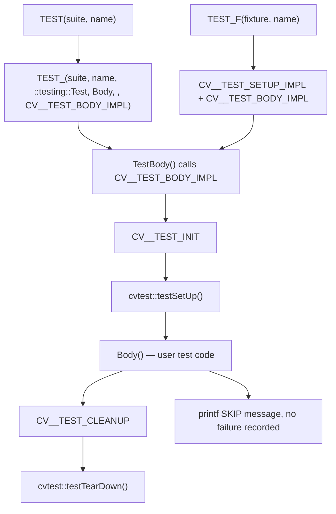
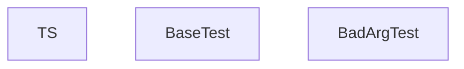
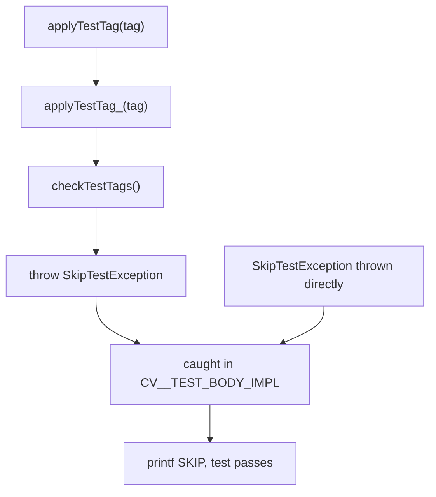
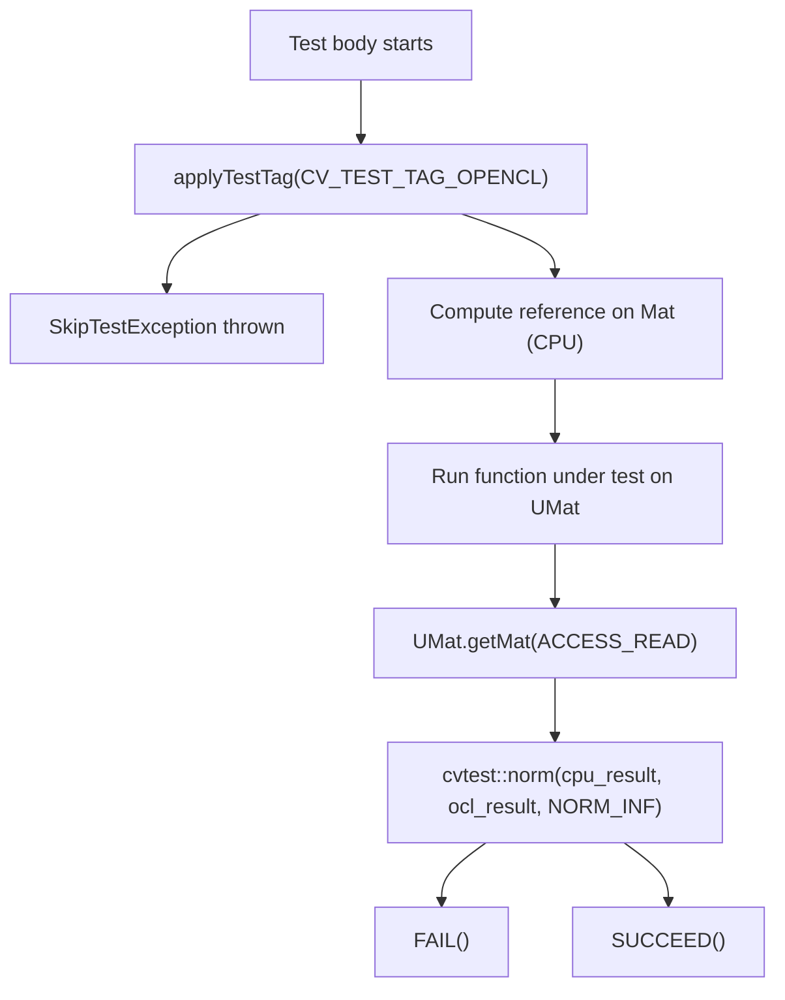
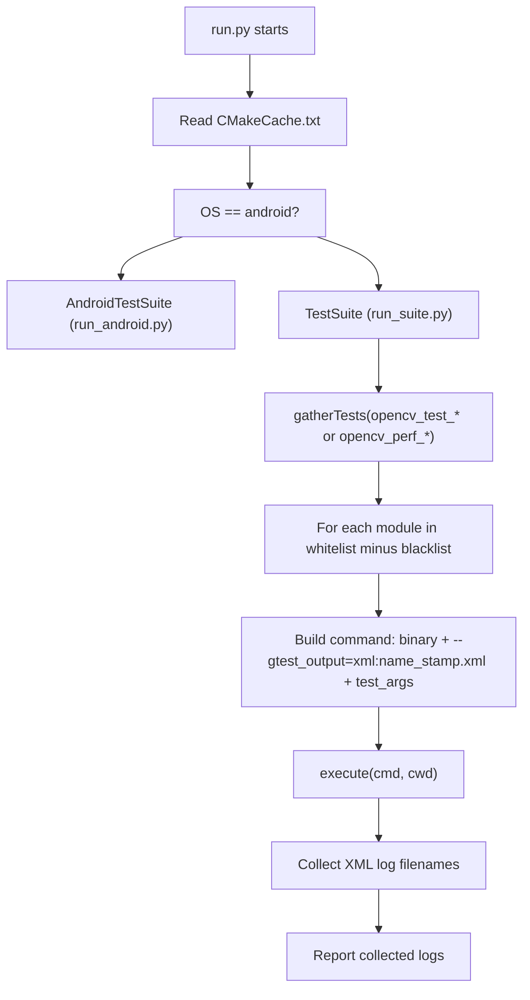
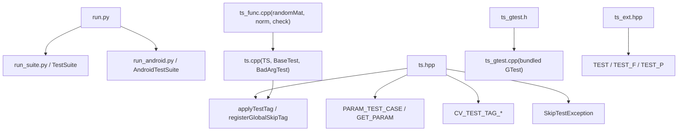

# Unit Testing and OpenCL Test Utilities

Relevant source files

-   [modules/calib3d/perf/perf\_precomp.hpp](https://github.com/opencv/opencv/blob/91c78f50/modules/calib3d/perf/perf_precomp.hpp)
-   [modules/core/perf/perf\_precomp.hpp](https://github.com/opencv/opencv/blob/91c78f50/modules/core/perf/perf_precomp.hpp)
-   [modules/core/src/parallel.cpp](https://github.com/opencv/opencv/blob/91c78f50/modules/core/src/parallel.cpp)
-   [modules/features2d/perf/perf\_precomp.hpp](https://github.com/opencv/opencv/blob/91c78f50/modules/features2d/perf/perf_precomp.hpp)
-   [modules/imgproc/perf/perf\_canny.cpp](https://github.com/opencv/opencv/blob/91c78f50/modules/imgproc/perf/perf_canny.cpp)
-   [modules/imgproc/perf/perf\_precomp.hpp](https://github.com/opencv/opencv/blob/91c78f50/modules/imgproc/perf/perf_precomp.hpp)
-   [modules/java/generator/src/cpp/opencv\_java.hpp](https://github.com/opencv/opencv/blob/91c78f50/modules/java/generator/src/cpp/opencv_java.hpp)
-   [modules/java/generator/src/java/org/opencv/osgi/OpenCVNativeLoader.java.in](https://github.com/opencv/opencv/blob/91c78f50/modules/java/generator/src/java/org/opencv/osgi/OpenCVNativeLoader.java.in)
-   [modules/java/test/pure\_test/CMakeLists.txt](https://github.com/opencv/opencv/blob/91c78f50/modules/java/test/pure_test/CMakeLists.txt)
-   [modules/java/test/pure\_test/build.xml](https://github.com/opencv/opencv/blob/91c78f50/modules/java/test/pure_test/build.xml)
-   [modules/photo/perf/perf\_precomp.hpp](https://github.com/opencv/opencv/blob/91c78f50/modules/photo/perf/perf_precomp.hpp)
-   [modules/ts/CMakeLists.txt](https://github.com/opencv/opencv/blob/91c78f50/modules/ts/CMakeLists.txt)
-   [modules/ts/include/opencv2/ts.hpp](https://github.com/opencv/opencv/blob/91c78f50/modules/ts/include/opencv2/ts.hpp)
-   [modules/ts/include/opencv2/ts/ts\_ext.hpp](https://github.com/opencv/opencv/blob/91c78f50/modules/ts/include/opencv2/ts/ts_ext.hpp)
-   [modules/ts/include/opencv2/ts/ts\_gtest.h](https://github.com/opencv/opencv/blob/91c78f50/modules/ts/include/opencv2/ts/ts_gtest.h)
-   [modules/ts/include/opencv2/ts/ts\_perf.hpp](https://github.com/opencv/opencv/blob/91c78f50/modules/ts/include/opencv2/ts/ts_perf.hpp)
-   [modules/ts/misc/chart.py](https://github.com/opencv/opencv/blob/91c78f50/modules/ts/misc/chart.py)
-   [modules/ts/misc/color.py](https://github.com/opencv/opencv/blob/91c78f50/modules/ts/misc/color.py)
-   [modules/ts/misc/concatlogs.py](https://github.com/opencv/opencv/blob/91c78f50/modules/ts/misc/concatlogs.py)
-   [modules/ts/misc/perf\_tests\_timing.py](https://github.com/opencv/opencv/blob/91c78f50/modules/ts/misc/perf_tests_timing.py)
-   [modules/ts/misc/report.py](https://github.com/opencv/opencv/blob/91c78f50/modules/ts/misc/report.py)
-   [modules/ts/misc/run.py](https://github.com/opencv/opencv/blob/91c78f50/modules/ts/misc/run.py)
-   [modules/ts/misc/run\_android.py](https://github.com/opencv/opencv/blob/91c78f50/modules/ts/misc/run_android.py)
-   [modules/ts/misc/run\_long.py](https://github.com/opencv/opencv/blob/91c78f50/modules/ts/misc/run_long.py)
-   [modules/ts/misc/run\_suite.py](https://github.com/opencv/opencv/blob/91c78f50/modules/ts/misc/run_suite.py)
-   [modules/ts/misc/run\_utils.py](https://github.com/opencv/opencv/blob/91c78f50/modules/ts/misc/run_utils.py)
-   [modules/ts/misc/summary.py](https://github.com/opencv/opencv/blob/91c78f50/modules/ts/misc/summary.py)
-   [modules/ts/misc/table\_formatter.py](https://github.com/opencv/opencv/blob/91c78f50/modules/ts/misc/table_formatter.py)
-   [modules/ts/misc/testlog\_parser.py](https://github.com/opencv/opencv/blob/91c78f50/modules/ts/misc/testlog_parser.py)
-   [modules/ts/misc/trace\_profiler.py](https://github.com/opencv/opencv/blob/91c78f50/modules/ts/misc/trace_profiler.py)
-   [modules/ts/misc/xls-report.py](https://github.com/opencv/opencv/blob/91c78f50/modules/ts/misc/xls-report.py)
-   [modules/ts/src/precomp.hpp](https://github.com/opencv/opencv/blob/91c78f50/modules/ts/src/precomp.hpp)
-   [modules/ts/src/ts.cpp](https://github.com/opencv/opencv/blob/91c78f50/modules/ts/src/ts.cpp)
-   [modules/ts/src/ts\_arrtest.cpp](https://github.com/opencv/opencv/blob/91c78f50/modules/ts/src/ts_arrtest.cpp)
-   [modules/ts/src/ts\_func.cpp](https://github.com/opencv/opencv/blob/91c78f50/modules/ts/src/ts_func.cpp)
-   [modules/ts/src/ts\_gtest.cpp](https://github.com/opencv/opencv/blob/91c78f50/modules/ts/src/ts_gtest.cpp)
-   [modules/ts/src/ts\_perf.cpp](https://github.com/opencv/opencv/blob/91c78f50/modules/ts/src/ts_perf.cpp)

## Purpose and Scope

This page documents the unit testing infrastructure in OpenCV's `ts` module (`modules/ts/`), covering the Google Test integration layer, custom test fixture macros, array comparison utilities, OpenCL-specific testing patterns, and the `run.py` test runner script.

For performance-oriented testing with timing loops and regression baselines, see [Performance Testing with perf::TestBase](/opencv/opencv/12.1-performance-testing-with-perf::testbase). For OpenCL device management and the transparent execution model that tests validate, see [OpenCL Acceleration and Transparent GPU Execution](/opencv/opencv/3.2-opencl-acceleration-and-transparent-gpu-execution).

---

## Module Structure

The `ts` module is compiled as a static library and is **not** included in `opencv_world`. It declares itself with `OPENCV_MODULE_TYPE STATIC` and depends on `opencv_core`, `opencv_imgproc`, `opencv_imgcodecs`, `opencv_videoio`, and `opencv_highgui`.

[modules/ts/CMakeLists.txt1-57](https://github.com/opencv/opencv/blob/91c78f50/modules/ts/CMakeLists.txt#L1-L57)

**Module layout:**

| File | Role |
| --- | --- |
| `modules/ts/include/opencv2/ts.hpp` | Primary header: includes gtest, declares `TS`, `BaseTest`, utility functions, test tags |
| `modules/ts/include/opencv2/ts/ts_ext.hpp` | Macro overrides for `TEST`, `TEST_F`, `TEST_P`; skip-on-construction support |
| `modules/ts/include/opencv2/ts/ts_gtest.h` | Bundled Google Test header (single-header form) |
| `modules/ts/src/ts_gtest.cpp` | Bundled Google Test implementation |
| `modules/ts/src/ts.cpp` | `TS`, `BaseTest`, `BadArgTest`; OpenCL info recording; signal handlers |
| `modules/ts/src/ts_func.cpp` | `randomMat`, `norm`, `check`, matrix math reference implementations |
| `modules/ts/src/ts_arrtest.cpp` | `ArrayTest` legacy base class |
| `modules/ts/src/ts_perf.cpp` | `perf::TestBase`, `Regression` (performance layer) |
| `modules/ts/misc/run.py` | Cross-platform test runner and collector |

Sources: [modules/ts/CMakeLists.txt1-57](https://github.com/opencv/opencv/blob/91c78f50/modules/ts/CMakeLists.txt#L1-L57) [modules/ts/include/opencv2/ts.hpp1-50](https://github.com/opencv/opencv/blob/91c78f50/modules/ts/include/opencv2/ts.hpp#L1-L50) [modules/ts/src/ts.cpp1-130](https://github.com/opencv/opencv/blob/91c78f50/modules/ts/src/ts.cpp#L1-L130)

---

## Google Test Integration

OpenCV bundles a fixed version of Google Test rather than requiring it as an external dependency. The bundled copy is exposed as:

-   `modules/ts/include/opencv2/ts/ts_gtest.h` — public API
-   `modules/ts/src/ts_gtest.cpp` — all implementation translation units concatenated

[modules/ts/include/opencv2/ts.hpp101-134](https://github.com/opencv/opencv/blob/91c78f50/modules/ts/include/opencv2/ts.hpp#L101-L134) configures GTest preprocessor flags before including `ts_gtest.h`, notably:

-   Disabling GTest's macro aliases (`GTEST_DONT_DEFINE_FAIL 0` etc.) since OpenCV redefines them
-   Setting C++11 tuple detection (`GTEST_LANG_CXX11`, `GTEST_HAS_TR1_TUPLE`, `GTEST_HAS_COMBINE`)

**Test macro chain diagram:**


Sources: [modules/ts/include/opencv2/ts/ts\_ext.hpp32-110](https://github.com/opencv/opencv/blob/91c78f50/modules/ts/include/opencv2/ts/ts_ext.hpp#L32-L110)

---

## Custom Test Macros (`ts_ext.hpp`)

`ts_ext.hpp` replaces the standard GTest `TEST`, `TEST_F`, and `TEST_P` macros with versions that add:

1.  **Skip-at-construction**: If `SetUp()` throws `SkipTestExceptionBase`, `setUpSkipped = true` is set and `TestBody()` returns immediately without calling `Body()`.
2.  **Namespace enforcement**: `CV__TEST_NAMESPACE_CHECK` enforces that test code lives in the `opencv_test` namespace during OpenCV internal builds.
3.  **Lifecycle hooks**: `cvtest::testSetUp()` and `cvtest::testTearDown()` are called around each test body.

**Key macros:**

| Macro | Defined in | Purpose |
| --- | --- | --- |
| `TEST(suite, name)` | `ts_ext.hpp:110` | Replaces gtest `TEST`; adds skip and lifecycle support |
| `TEST_F(fixture, name)` | `ts_ext.hpp:138` | Replaces gtest `TEST_F` |
| `TEST_(...)` | `ts_ext.hpp:73` | Internal generic form used by `TEST` and perf macros |
| `PARAM_TEST_CASE(name, ...)` | `ts.hpp:144` | Shorthand for `struct name : testing::TestWithParam<tuple<...>>` |
| `GET_PARAM(k)` | `ts.hpp:145` | `testing::get<k>(GetParam())` |
| `BIGDATA_TEST(suite, name)` | `ts_ext.hpp:131` | Skipped automatically on 32-bit builds |

Sources: [modules/ts/include/opencv2/ts/ts\_ext.hpp32-135](https://github.com/opencv/opencv/blob/91c78f50/modules/ts/include/opencv2/ts/ts_ext.hpp#L32-L135) [modules/ts/include/opencv2/ts.hpp144-145](https://github.com/opencv/opencv/blob/91c78f50/modules/ts/include/opencv2/ts.hpp#L144-L145)

---

## `TS` and `BaseTest` Classes

The `TS` class is a singleton that manages the test system state: error codes, output buffers, RNG seed, and callback registration.

**Class responsibility diagram:**


`BaseTest::safe_run()` installs signal handlers (SIGSEGV, SIGFPE, etc. on POSIX; SEH translator on MSVC) and wraps `run()` in exception handlers that translate to `TS::FailureCode` values.

[modules/ts/src/ts.cpp287-338](https://github.com/opencv/opencv/blob/91c78f50/modules/ts/src/ts.cpp#L287-L338)

---

## Test Skip Mechanism

Tests can be skipped gracefully by throwing `cvtest::SkipTestException` or by calling `cvtest::applyTestTag`.


`registerGlobalSkipTag(tag)` adds a tag to the global skip list at startup time, e.g., to globally disable all OpenCL tests if no device is available.

**Predefined test tags** (from `ts.hpp`):

| Tag constant | String | Meaning |
| --- | --- | --- |
| `CV_TEST_TAG_MEMORY_512MB` | `"mem_512mb"` | Requires 200–512 MB memory |
| `CV_TEST_TAG_MEMORY_2GB` | `"mem_2gb"` | Requires 1–2 GB; disabled on 32-bit by default |
| `CV_TEST_TAG_LONG` | `"long"` | 5+ seconds on desktop |
| `CV_TEST_TAG_DEBUG_VERYLONG` | `"debug_verylong"` | 40+ seconds in debug |
| `CV_TEST_TAG_SIZE_HD` | `"size_hd"` | 720p or larger images |
| `CV_TEST_TAG_SIZE_FULLHD` | `"size_fullhd"` | 1080p or larger |
| `CV_TEST_TAG_OPENCL` | `"opencl"` | Requires OpenCL device |
| `CV_TEST_TAG_TYPE_64F` | `"type_64f"` | Uses `CV_64F` depth |

[modules/ts/include/opencv2/ts.hpp59-90](https://github.com/opencv/opencv/blob/91c78f50/modules/ts/include/opencv2/ts.hpp#L59-L90) [modules/ts/include/opencv2/ts.hpp190-258](https://github.com/opencv/opencv/blob/91c78f50/modules/ts/include/opencv2/ts.hpp#L190-L258)

---

## Array Comparison Utilities (`ts_func.cpp`)

`modules/ts/src/ts_func.cpp` and the declarations in `modules/ts/include/opencv2/ts.hpp` provide reference-quality array operations for use in test validation.

**Data generation:**

| Function | Signature | Purpose |
| --- | --- | --- |
| `randomSize` | `(RNG&, double maxSizeLog) → Size` | Random 2D size |
| `randomSize` | `(RNG&, int minDims, int maxDims, double maxSizeLog, vector<int>&)` | Random N-D size |
| `randomType` | `(RNG&, DepthMask, int minCh, int maxCh) → int` | Random `CV_XUY` type |
| `randomMat` | `(RNG&, Size, int type, double, double, bool useRoi) → Mat` | Filled random matrix, optionally as ROI sub-window |

[modules/ts/src/ts\_func.cpp41-150](https://github.com/opencv/opencv/blob/91c78f50/modules/ts/src/ts_func.cpp#L41-L150)

**Reference operations** (scalar-precision, channel-by-channel):

| Function | Notes |
| --- | --- |
| `cvtest::add(a, alpha, b, beta, gamma, c, ctype, calcAbs)` | `c = alpha*a + beta*b + gamma` |
| `cvtest::convert(src, dst, dtype, alpha, beta)` | Type conversion via `double` intermediary |
| `cvtest::copy(src, dst, mask, invertMask)` | Masked copy |
| `cvtest::norm(src, normType, mask)` | `NORM_L1`, `NORM_L2`, `NORM_INF` |
| `cvtest::norm(src1, src2, normType, mask)` | Difference norm |
| `cvtest::check(data, min_val, max_val, idx)` | Range check; returns count of violations |
| `cvtest::transpose(src, dst)` | Reference 2D transpose |
| `cvtest::filter2D(src, dst, ddepth, kernel, anchor, delta, borderType, borderValue)` | Reference 2D convolution |

Sources: [modules/ts/include/opencv2/ts.hpp295-360](https://github.com/opencv/opencv/blob/91c78f50/modules/ts/include/opencv2/ts.hpp#L295-L360) [modules/ts/src/ts\_func.cpp152-600](https://github.com/opencv/opencv/blob/91c78f50/modules/ts/src/ts_func.cpp#L152-L600)

---

## OpenCL Test Utilities

### Device Information Recording

When the build includes `HAVE_OPENCL`, `modules/ts/src/ts.cpp` records OpenCL platform and device properties into the GTest XML output via `::testing::Test::RecordProperty`. This uses the macros `DUMP_CONFIG_PROPERTY` and `DUMP_MESSAGE_STDOUT`, backed by `opencv2/core/opencl/opencl_info.hpp`.

[modules/ts/src/ts.cpp82-102](https://github.com/opencv/opencv/blob/91c78f50/modules/ts/src/ts.cpp#L82-L102)

OpenCL allocator memory statistics are also sampled via `cv::ocl::getOpenCLAllocatorStatistics()` to detect leaks between tests.

[modules/ts/src/ts.cpp98-102](https://github.com/opencv/opencv/blob/91c78f50/modules/ts/src/ts.cpp#L98-L102)

### Standard OpenCL Test Pattern

The OpenCL testing idiom throughout OpenCV is:

1.  Apply the `CV_TEST_TAG_OPENCL` tag so the test can be globally skipped when OpenCL is absent.
2.  Compute a CPU reference result using `Mat` inputs.
3.  Run the function under test with `UMat` inputs (OpenCL path is selected automatically via `UMat`; see [UMat and Transparent GPU Execution](/opencv/opencv/3.2-opencl-acceleration-and-transparent-gpu-execution)).
4.  Compare CPU and OpenCL outputs using `cvtest::norm` or an `EXPECT_MAT_NEAR`\-style assertion.


### `PARAM_TEST_CASE` / `CV_ENUM` for OCL Fixtures

Many OCL test files use the `PARAM_TEST_CASE` macro combined with `testing::Combine` to sweep over image sizes and types:

```
PARAM_TEST_CASE(Blur, MatType, Size) { ... };TEST_P(Blur, Accuracy) {    applyTestTag(CV_TEST_TAG_OPENCL);    // test body}INSTANTIATE_TEST_CASE_P(OCL_ImgProc, Blur,    testing::Combine(        testing::Values(CV_8UC1, CV_8UC4),        testing::Values(Size(640, 480), Size(1920, 1080))    ));
```
`PARAM_TEST_CASE` expands to `struct Name : testing::TestWithParam<tuple<...>>`. `GET_PARAM(k)` retrieves the k-th element.

Sources: [modules/ts/include/opencv2/ts.hpp144-145](https://github.com/opencv/opencv/blob/91c78f50/modules/ts/include/opencv2/ts.hpp#L144-L145) [modules/ts/include/opencv2/ts.hpp87-90](https://github.com/opencv/opencv/blob/91c78f50/modules/ts/include/opencv2/ts.hpp#L87-L90) [modules/ts/src/ts.cpp82-102](https://github.com/opencv/opencv/blob/91c78f50/modules/ts/src/ts.cpp#L82-L102)

---

## `TS` Test Infrastructure: Signal Handling and Error Callbacks

`TS::init()` installs:

-   An OpenCV error callback (`tsErrorCallback`) that captures `cv::Error` details into the log buffer instead of printing to stderr.
-   On POSIX: signal handlers for `SIGSEGV`, `SIGBUS`, `SIGFPE`, `SIGILL`, `SIGABRT` that `longjmp` back to `safe_run`, producing a `FAIL_MEMORY_EXCEPTION` or `FAIL_ARITHM_EXCEPTION` failure code.
-   On MSVC Windows: a structured exception handler (`_set_se_translator`) that throws a `TS::FailureCode`.

[modules/ts/src/ts.cpp163-226](https://github.com/opencv/opencv/blob/91c78f50/modules/ts/src/ts.cpp#L163-L226) [modules/ts/src/ts.cpp553-590](https://github.com/opencv/opencv/blob/91c78f50/modules/ts/src/ts.cpp#L553-L590)

---

## The `run.py` Test Runner

`modules/ts/misc/run.py` is a Python script that discovers and runs test executables produced by the build, collecting GTest XML output.

### Invocation modes

```
run.py [build_path] [options] [--gtest_* or --perf_* args]
```
| Flag | Effect |
| --- | --- |
| `-a` / `--accuracy` | Run `opencv_test_<module>` binaries (accuracy/unit tests) |
| *(default)* | Run `opencv_perf_<module>` binaries (performance tests) |
| `-t core,imgproc` | Restrict to listed modules |
| `-b java` | Exclude listed modules |
| `--check` | Shorthand for `--perf_min_samples=1 --perf_force_samples=1 --perf_verify_sanity` |
| `--valgrind` | Wrap executables with Valgrind |
| `--android` | Push and run on connected Android device via ADB |
| `--dry_run` | Print commands without executing |
| `--trace` | Enable OpenCV tracing |

[modules/ts/misc/run.py1-180](https://github.com/opencv/opencv/blob/91c78f50/modules/ts/misc/run.py#L1-L180)

### Test discovery and execution flow


[modules/ts/misc/run.py139-180](https://github.com/opencv/opencv/blob/91c78f50/modules/ts/misc/run.py#L139-L180) [modules/ts/misc/run\_suite.py12-180](https://github.com/opencv/opencv/blob/91c78f50/modules/ts/misc/run_suite.py#L12-L180)

`run_suite.py` constructs aliases for each binary (e.g., `opencv_test_core` → aliases `core`, `opencv_test_core`, etc.) and passes any `--gtest_*` and `--perf_*` arguments transparently to the test process.

[modules/ts/misc/run\_suite.py35-61](https://github.com/opencv/opencv/blob/91c78f50/modules/ts/misc/run_suite.py#L35-L61)

### Supporting scripts

| Script | Purpose |
| --- | --- |
| `run_utils.py` | `CMakeCache` reader, `execute()`, platform helpers |
| `run_android.py` | ADB push/pull, `am instrument` invocation |
| `run_long.py` | `LONG_TESTS_DEBUG_VALGRIND` filter list for Valgrind runs |
| `testlog_parser.py` | Parse GTest XML output into `TestInfo` objects |
| `summary.py` | Compare performance metrics across multiple XML runs |
| `report.py` | Configurable performance report tables |

Sources: [modules/ts/misc/run\_utils.py1-60](https://github.com/opencv/opencv/blob/91c78f50/modules/ts/misc/run_utils.py#L1-L60) [modules/ts/misc/run\_long.py1-45](https://github.com/opencv/opencv/blob/91c78f50/modules/ts/misc/run_long.py#L1-L45) [modules/ts/misc/testlog\_parser.py1-65](https://github.com/opencv/opencv/blob/91c78f50/modules/ts/misc/testlog_parser.py#L1-L65)

---

## Key Code Entity Map


Sources: [modules/ts/include/opencv2/ts.hpp1-180](https://github.com/opencv/opencv/blob/91c78f50/modules/ts/include/opencv2/ts.hpp#L1-L180) [modules/ts/include/opencv2/ts/ts\_ext.hpp1-135](https://github.com/opencv/opencv/blob/91c78f50/modules/ts/include/opencv2/ts/ts_ext.hpp#L1-L135) [modules/ts/src/ts.cpp123-640](https://github.com/opencv/opencv/blob/91c78f50/modules/ts/src/ts.cpp#L123-L640) [modules/ts/misc/run.py1-180](https://github.com/opencv/opencv/blob/91c78f50/modules/ts/misc/run.py#L1-L180)
